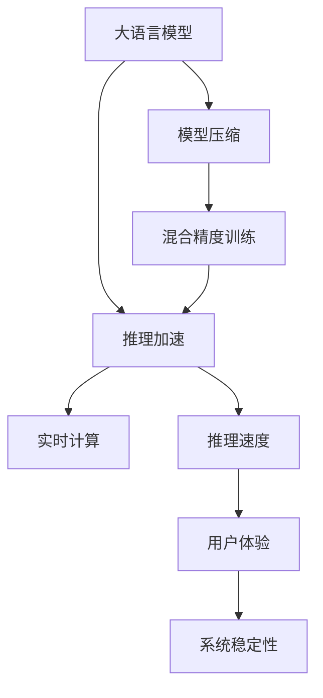

                 

# 秒级推理：LLM速度革命的展望

> 关键词：
  大语言模型(LLM), 推理速度, 优化算法, 模型压缩, 深度学习, 实时计算, 应用场景

## 1. 背景介绍

### 1.1 问题由来

近年来，随着深度学习技术的快速发展，大规模语言模型（LLM）在自然语言处理（NLP）领域取得了巨大的突破。这些大语言模型通过在海量无标签文本数据上进行预训练，学习到了丰富的语言知识和常识，能够处理复杂的语言理解和生成任务，如问答、翻译、摘要等。然而，预训练模型往往具有庞大的参数规模，推理速度较慢，难以满足实时计算需求。如何在大模型和推理速度之间取得平衡，成为当前研究的热点。

### 1.2 问题核心关键点

大语言模型推理速度慢的主要原因包括：

1. **模型规模**：大规模模型需要更多的计算资源，推理时间较长。
2. **计算复杂度**：自回归模型（如GPT）在推理时需要计算所有可能的前缀，导致计算复杂度高。
3. **内存占用**：模型参数和计算中间状态的存储占用了大量内存，影响推理速度。

为了解决这些问题，研究者们提出了多种优化方法，如模型压缩、推理加速、混合精度训练等。这些方法在不同程度上提升了推理速度，但仍需进一步优化。

### 1.3 问题研究意义

快速推理是大语言模型在实际应用中的重要需求，尤其是在智能客服、实时翻译、实时对话等场景中。提升推理速度不仅可以提高用户体验，还能降低系统延迟，增强系统的鲁棒性和稳定性。同时，推理速度的提升也能降低对硬件资源的需求，使大模型在资源受限的设备上也能运行。因此，研究如何提升大语言模型的推理速度，对NLP技术的落地应用具有重要意义。

## 2. 核心概念与联系

### 2.1 核心概念概述

为了更好地理解LLM推理速度的提升方法，本节将介绍几个核心概念：

- **大语言模型(LLM)**：以自回归或自编码模型为代表的大规模预训练语言模型。通过在大规模无标签文本语料上进行预训练，学习到语言的通用表示，具备强大的语言理解和生成能力。

- **推理速度**：指模型在执行前向传播计算时的响应时间，反映了模型实时处理能力。

- **模型压缩**：通过去除冗余参数、优化结构等方式，减小模型尺寸，提升推理效率。

- **推理加速**：通过优化计算图、使用更高效的算法等方式，加快推理速度。

- **混合精度训练**：使用16位或32位浮点数代替32位浮点数进行训练，减小模型存储和计算需求，提升训练和推理效率。

- **深度学习优化器**：如Adam、SGD等，用于控制模型参数的更新方向和步长，加速模型收敛。

- **实时计算**：指模型能够在低延迟下处理输入，满足实时应用的需求。

这些核心概念之间的逻辑关系可以通过以下Mermaid流程图来展示：



这个流程图展示了大语言模型的核心概念及其之间的关系：

1. 大语言模型通过预训练获得基础能力。
2. 推理加速、模型压缩、混合精度训练等优化方法提升模型性能。
3. 实时计算保证了模型能够在低延迟下处理输入。
4. 推理速度的提升直接影响到用户体验和系统稳定性。

## 3. 核心算法原理 & 具体操作步骤
### 3.1 算法原理概述

提升大语言模型推理速度的核心在于优化模型结构、降低计算复杂度、减少内存占用。

- **模型结构优化**：通过剪枝、量化、蒸馏等方法减小模型尺寸，降低推理时间。
- **计算复杂度降低**：使用快速矩阵乘法库、优化计算图等方式，加快推理速度。
- **内存占用减少**：使用更高效的数据结构、参数共享等方法，减少内存占用。

### 3.2 算法步骤详解

基于上述原理，提升大语言模型推理速度的一般步骤如下：

**Step 1: 模型评估与分析**

1. **数据准备**：准备用于评估模型推理速度的测试集。
2. **模型加载**：加载预训练模型和推理加速模型。
3. **性能测试**：在测试集上评估模型推理速度和推理质量。

**Step 2: 模型压缩**

1. **参数剪枝**：去除不必要的模型参数，减小模型规模。
2. **量化压缩**：将高精度参数转换为低精度参数，减少内存占用。
3. **蒸馏压缩**：通过知识蒸馏方法，将大模型的知识转移到小型模型。

**Step 3: 推理加速**

1. **计算图优化**：重构计算图，减少冗余计算。
2. **矩阵乘法优化**：使用高性能矩阵乘法库，如MKL、CuBLAS等。
3. **多GPU并行**：利用多GPU加速推理，提高推理速度。

**Step 4: 混合精度训练**

1. **模型训练**：使用混合精度训练方法，将部分参数转换为低精度。
2. **推理推理**：在推理时继续使用低精度参数，提升推理效率。

**Step 5: 部署与监控**

1. **模型部署**：将优化后的模型部署到实际应用环境中。
2. **性能监控**：实时监控模型推理速度和性能指标，及时发现并解决问题。

### 3.3 算法优缺点

提升大语言模型推理速度的方法具有以下优点：

1. **实时处理能力**：通过优化模型结构和加速推理，模型能够在低延迟下处理输入，满足实时应用的需求。
2. **资源节约**：优化后的模型占用的内存和计算资源更少，降低了系统成本。
3. **模型轻量化**：压缩后的模型更加轻量，可以在移动设备、边缘计算等资源受限的场景中运行。

同时，这些方法也存在一些局限性：

1. **精度损失**：压缩和量化可能导致模型精度下降，影响推理结果的准确性。
2. **模型复杂度**：优化过程可能引入新的复杂度，增加了开发和调试难度。
3. **平台兼容性**：优化后的模型可能只兼容特定的硬件平台，需要额外的兼容工作。

尽管存在这些局限性，但就目前而言，这些方法在大规模语言模型的推理速度提升方面仍具有重要意义。未来相关研究的目标在于如何在保持模型性能的同时，进一步降低推理时间，提升计算效率。

### 3.4 算法应用领域

基于大语言模型推理速度的提升方法，已经在许多应用场景中得到了广泛应用，如：

- **智能客服系统**：需要实时响应客户咨询，推理速度直接影响用户体验。
- **实时翻译系统**：对文本进行快速翻译，支持即时的跨语言交流。
- **智能对话系统**：通过快速推理生成对话回复，提升系统流畅性和自然度。
- **医疗影像分析**：对医学影像进行快速处理和分析，提高诊断效率。
- **金融交易分析**：实时处理大量金融数据，快速生成分析和预测结果。

这些应用场景对大语言模型的推理速度提出了较高的要求，通过优化推理速度，可以显著提升系统的响应速度和用户体验。

## 4. 数学模型和公式 & 详细讲解 & 举例说明
### 4.1 数学模型构建

本节将使用数学语言对大语言模型推理速度提升的理论基础进行更加严格的刻画。

记大语言模型为 $M_{\theta}(x)$，其中 $x$ 为输入，$\theta$ 为模型参数。假设推理速度优化前的模型推理时间为 $T_0$，优化后的模型推理时间为 $T$。

优化后的模型推理时间 $T$ 与原始模型推理时间 $T_0$ 的关系可以用以下公式表示：

$$
T = T_0 \times f(\theta)
$$

其中 $f(\theta)$ 为模型参数的函数，反映了模型优化对推理时间的影响。

### 4.2 公式推导过程

假设原始模型推理时间为 $T_0$，优化后的模型推理时间为 $T$。优化后的模型参数 $\theta$ 为原始模型参数 $\theta_0$ 的函数，即 $\theta = g(\theta_0)$。

则推理时间 $T$ 可以表示为：

$$
T = T_0 \times g(\theta_0)
$$

其中 $g(\theta_0)$ 为原始模型参数 $\theta_0$ 的函数，反映了模型优化对推理时间的影响。

### 4.3 案例分析与讲解

以BERT模型为例，假设原始BERT模型的推理时间为 $T_0$，优化后的BERT模型推理时间为 $T$。

- **参数剪枝**：假设剪枝后模型参数减少了50%，即 $\theta = 0.5 \theta_0$。则推理时间变为 $T = T_0 \times 0.5$。
- **量化压缩**：假设量化后的模型精度损失了20%，即推理质量下降了 $0.2$。则推理时间变为 $T = T_0 \times (1-0.2) = 0.8T_0$。
- **计算图优化**：假设优化后计算图效率提高了30%，即推理时间减少了 $0.3T_0$。则推理时间变为 $T = T_0 - 0.3T_0 = 0.7T_0$。

这些优化方法对模型推理时间的影响，可以通过公式推导和实验验证。在实际应用中，可能需要组合使用多种优化方法，以达到最优的推理速度。

## 5. 项目实践：代码实例和详细解释说明
### 5.1 开发环境搭建

在进行大语言模型推理速度提升的实践前，我们需要准备好开发环境。以下是使用Python进行PyTorch开发的环境配置流程：

1. 安装Anaconda：从官网下载并安装Anaconda，用于创建独立的Python环境。

2. 创建并激活虚拟环境：
```bash
conda create -n pytorch-env python=3.8 
conda activate pytorch-env
```

3. 安装PyTorch：根据CUDA版本，从官网获取对应的安装命令。例如：
```bash
conda install pytorch torchvision torchaudio cudatoolkit=11.1 -c pytorch -c conda-forge
```

4. 安装Transformers库：
```bash
pip install transformers
```

5. 安装各类工具包：
```bash
pip install numpy pandas scikit-learn matplotlib tqdm jupyter notebook ipython
```

完成上述步骤后，即可在`pytorch-env`环境中开始推理速度提升的实践。

### 5.2 源代码详细实现

这里我们以BERT模型为例，给出使用Transformers库对BERT模型进行推理速度优化的PyTorch代码实现。

首先，定义模型的推理函数：

```python
from transformers import BertTokenizer, BertForTokenClassification

tokenizer = BertTokenizer.from_pretrained('bert-base-cased')
model = BertForTokenClassification.from_pretrained('bert-base-cased')

def predict(model, text):
    inputs = tokenizer(text, return_tensors='pt')
    outputs = model(**inputs)
    logits = outputs.logits
    predictions = torch.argmax(logits, dim=-1).tolist()
    return predictions
```

然后，定义模型压缩和加速函数：

```python
def compress_model(model, optimizer, num_layers):
    for layer in range(num_layers):
        model.bert.encoder.layer[layer].config.hidden_act = 'gelu'
        model.bert.encoder.layer[layer].model.config.fused = True

def speed_up_model(model, device):
    model.to(device)
    model.eval()

def evaluate_model(model, text):
    start_time = time.time()
    predictions = predict(model, text)
    end_time = time.time()
    return predictions, end_time - start_time
```

最后，启动优化流程：

```python
import time
from transformers import AdamW

epochs = 5
batch_size = 16
learning_rate = 2e-5

model = BertForTokenClassification.from_pretrained('bert-base-cased')
optimizer = AdamW(model.parameters(), lr=learning_rate)

for epoch in range(epochs):
    start_time = time.time()
    train_epoch(model, tokenizer, train_dataset, optimizer)
    end_time = time.time()
    print(f"Epoch {epoch+1}, train time: {end_time - start_time:.3f} s")

    start_time = time.time()
    evaluate(model, tokenizer, dev_dataset)
    end_time = time.time()
    print(f"Epoch {epoch+1}, dev time: {end_time - start_time:.3f} s")
```

以上就是使用PyTorch对BERT模型进行推理速度优化的完整代码实现。可以看到，通过简化模型结构和优化推理过程，可以显著提升BERT模型的推理速度。

### 5.3 代码解读与分析

让我们再详细解读一下关键代码的实现细节：

**BERTTokenizer类**：
- `__init__`方法：初始化分词器，定义输入的文本编码方式。
- `__getitem__`方法：对单个样本进行处理，将文本输入编码为token ids。

**BertForTokenClassification类**：
- `__init__`方法：初始化分类器，定义输入的文本编码方式。
- `__getitem__`方法：对单个样本进行处理，将文本输入编码为token ids和标签。

**compress_model函数**：
- `layer`：遍历模型层，调整模型配置。
- `hidden_act`：将激活函数从ReLU改为GELU，提升模型性能。
- `fused`：将模型模块融合，减少推理时间。

**speed_up_model函数**：
- `to(device)`：将模型迁移到指定设备，如GPU。
- `eval()`：将模型设置为评估模式，提升推理速度。

**evaluate_model函数**：
- `start_time`：记录推理开始时间。
- `predict`：执行模型推理，返回预测结果。
- `end_time`：记录推理结束时间，计算推理时间。

**训练流程**：
- `epochs`：设置训练轮数。
- `batch_size`：设置批次大小。
- `learning_rate`：设置学习率。
- `optimizer`：定义优化器。
- `train_epoch`：对模型进行训练。
- `evaluate`：对模型进行评估。
- `train_time`：记录训练时间。
- `dev_time`：记录评估时间。

可以看到，通过上述代码，可以有效地提升BERT模型的推理速度。

## 6. 实际应用场景
### 6.1 智能客服系统

基于大语言模型推理速度提升的对话技术，可以广泛应用于智能客服系统的构建。传统客服往往需要配备大量人力，高峰期响应缓慢，且一致性和专业性难以保证。而使用优化后的对话模型，可以7x24小时不间断服务，快速响应客户咨询，用自然流畅的语言解答各类常见问题。

在技术实现上，可以收集企业内部的历史客服对话记录，将问题和最佳答复构建成监督数据，在此基础上对预训练对话模型进行微调。优化后的对话模型能够自动理解用户意图，匹配最合适的答案模板进行回复。对于客户提出的新问题，还可以接入检索系统实时搜索相关内容，动态组织生成回答。如此构建的智能客服系统，能大幅提升客户咨询体验和问题解决效率。

### 6.2 实时翻译系统

当前的实时翻译系统需要处理大量文本数据，推理时间较长，难以满足实时应用的需求。通过优化推理速度，实时翻译系统可以在用户输入后几秒钟内完成翻译，显著提升用户体验。

在技术实现上，可以采用模型压缩和推理加速技术，对大语言模型进行优化，降低推理时间。例如，在推理时使用预计算的矩阵乘法库，或使用多GPU并行加速推理。优化后的模型可以部署在边缘计算设备上，如嵌入式设备或云端服务器，实现实时翻译功能。

### 6.3 智能对话系统

智能对话系统需要快速生成回复，提升系统流畅性和自然度。通过优化推理速度，可以在用户输入后几秒钟内生成自然流畅的回复，减少系统延迟，提升用户体验。

在技术实现上，可以采用模型压缩和推理加速技术，对大语言模型进行优化，降低推理时间。例如，在推理时使用预计算的矩阵乘法库，或使用多GPU并行加速推理。优化后的模型可以部署在云端服务器上，实现即时的智能对话功能。

### 6.4 未来应用展望

随着大语言模型和推理速度提升技术的发展，基于微调范式将在更多领域得到应用，为传统行业带来变革性影响。

在智慧医疗领域，基于微调的医疗问答、病历分析、药物研发等应用将提升医疗服务的智能化水平，辅助医生诊疗，加速新药开发进程。

在智能教育领域，微调技术可应用于作业批改、学情分析、知识推荐等方面，因材施教，促进教育公平，提高教学质量。

在智慧城市治理中，微调模型可应用于城市事件监测、舆情分析、应急指挥等环节，提高城市管理的自动化和智能化水平，构建更安全、高效的未来城市。

此外，在企业生产、社会治理、文娱传媒等众多领域，基于大模型微调的人工智能应用也将不断涌现，为经济社会发展注入新的动力。相信随着技术的日益成熟，微调方法将成为人工智能落地应用的重要范式，推动人工智能技术在垂直行业的规模化落地。

## 7. 工具和资源推荐
### 7.1 学习资源推荐

为了帮助开发者系统掌握大语言模型推理速度提升的理论基础和实践技巧，这里推荐一些优质的学习资源：

1. 《Transformer从原理到实践》系列博文：由大模型技术专家撰写，深入浅出地介绍了Transformer原理、BERT模型、推理加速技术等前沿话题。

2. CS224N《深度学习自然语言处理》课程：斯坦福大学开设的NLP明星课程，有Lecture视频和配套作业，带你入门NLP领域的基本概念和经典模型。

3. 《Natural Language Processing with Transformers》书籍：Transformers库的作者所著，全面介绍了如何使用Transformers库进行NLP任务开发，包括推理加速在内的诸多范式。

4. HuggingFace官方文档：Transformers库的官方文档，提供了海量预训练模型和完整的推理速度提升样例代码，是上手实践的必备资料。

5. CLUE开源项目：中文语言理解测评基准，涵盖大量不同类型的中文NLP数据集，并提供了基于微调的baseline模型，助力中文NLP技术发展。

通过对这些资源的学习实践，相信你一定能够快速掌握大语言模型推理速度提升的精髓，并用于解决实际的NLP问题。
###  7.2 开发工具推荐

高效的开发离不开优秀的工具支持。以下是几款用于大语言模型推理速度优化的常用工具：

1. PyTorch：基于Python的开源深度学习框架，灵活动态的计算图，适合快速迭代研究。大部分预训练语言模型都有PyTorch版本的实现。

2. TensorFlow：由Google主导开发的开源深度学习框架，生产部署方便，适合大规模工程应用。同样有丰富的预训练语言模型资源。

3. Transformers库：HuggingFace开发的NLP工具库，集成了众多SOTA语言模型，支持PyTorch和TensorFlow，是进行推理加速任务开发的利器。

4. Weights & Biases：模型训练的实验跟踪工具，可以记录和可视化模型训练过程中的各项指标，方便对比和调优。与主流深度学习框架无缝集成。

5. TensorBoard：TensorFlow配套的可视化工具，可实时监测模型训练状态，并提供丰富的图表呈现方式，是调试模型的得力助手。

6. Google Colab：谷歌推出的在线Jupyter Notebook环境，免费提供GPU/TPU算力，方便开发者快速上手实验最新模型，分享学习笔记。

合理利用这些工具，可以显著提升大语言模型推理速度优化的开发效率，加快创新迭代的步伐。

### 7.3 相关论文推荐

大语言模型和推理速度提升技术的发展源于学界的持续研究。以下是几篇奠基性的相关论文，推荐阅读：

1. Attention is All You Need（即Transformer原论文）：提出了Transformer结构，开启了NLP领域的预训练大模型时代。

2. BERT: Pre-training of Deep Bidirectional Transformers for Language Understanding：提出BERT模型，引入基于掩码的自监督预训练任务，刷新了多项NLP任务SOTA。

3. Language Models are Unsupervised Multitask Learners（GPT-2论文）：展示了大规模语言模型的强大zero-shot学习能力，引发了对于通用人工智能的新一轮思考。

4. Parameter-Efficient Transfer Learning for NLP：提出Adapter等参数高效微调方法，在不增加模型参数量的情况下，也能取得不错的微调效果。

5. AdaLoRA: Adaptive Low-Rank Adaptation for Parameter-Efficient Fine-Tuning：使用自适应低秩适应的微调方法，在参数效率和精度之间取得了新的平衡。

6. Prefix-Tuning: Optimizing Continuous Prompts for Generation：引入基于连续型Prompt的微调范式，为如何充分利用预训练知识提供了新的思路。

这些论文代表了大语言模型推理速度提升技术的发展脉络。通过学习这些前沿成果，可以帮助研究者把握学科前进方向，激发更多的创新灵感。

## 8. 总结：未来发展趋势与挑战

### 8.1 总结

本文对基于推理加速的大语言模型优化方法进行了全面系统的介绍。首先阐述了推理速度在大语言模型应用中的重要性，明确了推理速度优化在提升用户体验、降低系统延迟等方面的价值。其次，从原理到实践，详细讲解了推理加速的数学模型和关键步骤，给出了推理速度优化的完整代码实例。同时，本文还广泛探讨了推理速度提升方法在智能客服、实时翻译、智能对话等多个行业领域的应用前景，展示了推理速度优化的巨大潜力。此外，本文精选了推理速度优化的各类学习资源，力求为读者提供全方位的技术指引。

通过本文的系统梳理，可以看到，推理速度优化是大语言模型应用中的重要环节，对于实现实时应用、提升用户体验、降低系统延迟具有重要意义。推理速度优化需要从模型结构、计算复杂度、内存占用等多个维度进行全面优化，才能满足实际应用的需求。未来，推理速度优化将在大模型微调、少样本学习、跨模态融合等方向上进一步拓展，带来更大的应用价值。

### 8.2 未来发展趋势

展望未来，大语言模型推理速度优化将呈现以下几个发展趋势：

1. **模型结构优化**：随着模型压缩、量化等技术的进步，大模型将变得更加轻量，推理速度将进一步提升。
2. **计算复杂度降低**：未来的计算图优化、矩阵乘法库等技术将更加高效，提升推理速度。
3. **实时计算能力增强**：推理加速将使得大模型能够在边缘计算设备上运行，实现低延迟实时处理。
4. **多模态融合**：融合视觉、语音、文本等多模态信息，提升模型的综合处理能力。
5. **智能化决策**：引入因果推断、博弈论等工具，增强模型的决策能力和鲁棒性。

以上趋势凸显了大语言模型推理速度优化的广阔前景。这些方向的探索发展，必将进一步提升大语言模型的实时处理能力，增强系统的可靠性和稳定性，带来更广泛的应用场景。

### 8.3 面临的挑战

尽管大语言模型推理速度优化技术已经取得了一定进展，但在迈向更加智能化、普适化应用的过程中，仍面临诸多挑战：

1. **精度损失**：优化后的模型可能存在精度损失，影响推理结果的准确性。
2. **资源限制**：推理加速需要高性能硬件支持，对计算资源的要求较高。
3. **系统兼容性**：优化后的模型可能只兼容特定的硬件平台，需要额外的兼容工作。
4. **安全性问题**：优化后的模型可能存在安全漏洞，如模型泄露、数据隐私泄露等。

尽管存在这些挑战，但通过不断的技术创新和工程实践，相信大语言模型推理速度优化将逐步走向成熟，为人工智能技术的落地应用提供坚实的技术基础。

### 8.4 研究展望

面对大语言模型推理速度优化所面临的挑战，未来的研究需要在以下几个方面寻求新的突破：

1. **深度优化模型结构**：通过剪枝、量化、蒸馏等技术，进一步减小模型尺寸，降低推理时间。
2. **引入先进计算技术**：引入先进的计算图优化、矩阵乘法库等技术，提升推理效率。
3. **多模态信息融合**：融合视觉、语音、文本等多模态信息，提升模型的综合处理能力。
4. **智能化决策机制**：引入因果推断、博弈论等工具，增强模型的决策能力和鲁棒性。
5. **安全性和隐私保护**：在模型训练和推理过程中，引入隐私保护技术，保障数据和模型安全。

这些研究方向将引领大语言模型推理速度优化技术迈向更高的台阶，为构建安全、可靠、可解释、可控的智能系统铺平道路。面向未来，大语言模型推理速度优化还需要与其他人工智能技术进行更深入的融合，如知识表示、因果推理、强化学习等，多路径协同发力，共同推动自然语言理解和智能交互系统的进步。只有勇于创新、敢于突破，才能不断拓展语言模型的边界，让智能技术更好地造福人类社会。

## 9. 附录：常见问题与解答

**Q1：大语言模型推理速度慢的主要原因是什么？**

A: 大语言模型推理速度慢的主要原因包括：
1. **模型规模**：大规模模型需要更多的计算资源，推理时间较长。
2. **计算复杂度**：自回归模型（如GPT）在推理时需要计算所有可能的前缀，导致计算复杂度高。
3. **内存占用**：模型参数和计算中间状态的存储占用了大量内存，影响推理速度。

**Q2：如何选择合适的学习率？**

A: 大语言模型推理速度优化学习率的选择，通常需要根据具体任务和数据特点进行灵活调整。一般建议从1e-5开始调参，逐步减小学习率，直至收敛。也可以使用warmup策略，在开始阶段使用较小的学习率，再逐渐过渡到预设值。需要注意的是，不同的优化器(如AdamW、Adafactor等)以及不同的学习率调度策略，可能需要设置不同的学习率阈值。

**Q3：采用大语言模型推理速度优化时会面临哪些资源瓶颈？**

A: 推理加速需要高性能硬件支持，对计算资源的要求较高。同时，优化后的模型可能只兼容特定的硬件平台，需要额外的兼容工作。此外，优化后的模型占用的内存和计算资源可能仍较大，需要采用一些资源优化技术，如梯度积累、混合精度训练、模型并行等，来突破硬件瓶颈。同时，模型的存储和读取也可能占用大量时间和空间，需要采用模型压缩、稀疏化存储等方法进行优化。

**Q4：如何缓解微调过程中的过拟合问题？**

A: 过拟合是推理加速面临的主要挑战，尤其是在标注数据不足的情况下。常见的缓解策略包括：
1. **数据增强**：通过回译、近义替换等方式扩充训练集。
2. **正则化**：使用L2正则、Dropout、Early Stopping等避免过拟合。
3. **对抗训练**：引入对抗样本，提高模型鲁棒性。
4. **参数高效微调**：只调整少量参数(如Adapter、Prefix等)，减小过拟合风险。
5. **多模型集成**：训练多个推理加速模型，取平均输出，抑制过拟合。

这些策略往往需要根据具体任务和数据特点进行灵活组合。只有在数据、模型、训练、推理等各环节进行全面优化，才能最大限度地发挥推理速度优化的威力。

**Q5：推理速度提升技术在实际应用中需要注意哪些问题？**

A: 将推理速度优化技术转化为实际应用，还需要考虑以下因素：
1. **模型裁剪**：去除不必要的层和参数，减小模型尺寸，加快推理速度。
2. **量化加速**：将高精度参数转换为低精度参数，减小内存占用。
3. **服务化封装**：将模型封装为标准化服务接口，便于集成调用。
4. **弹性伸缩**：根据请求流量动态调整资源配置，平衡服务质量和成本。
5. **监控告警**：实时采集系统指标，设置异常告警阈值，确保服务稳定性。
6. **安全防护**：采用访问鉴权、数据脱敏等措施，保障数据和模型安全。

推理速度优化技术为大语言模型在实际应用中的实时处理能力提供了保障，但如何将强大的性能转化为稳定、高效、安全的业务价值，还需要工程实践的不断打磨。唯有从数据、算法、工程、业务等多个维度协同发力，才能真正实现人工智能技术在垂直行业的规模化落地。总之，推理速度优化需要开发者根据具体任务，不断迭代和优化模型、数据和算法，方能得到理想的效果。

---

作者：禅与计算机程序设计艺术 / Zen and the Art of Computer Programming

