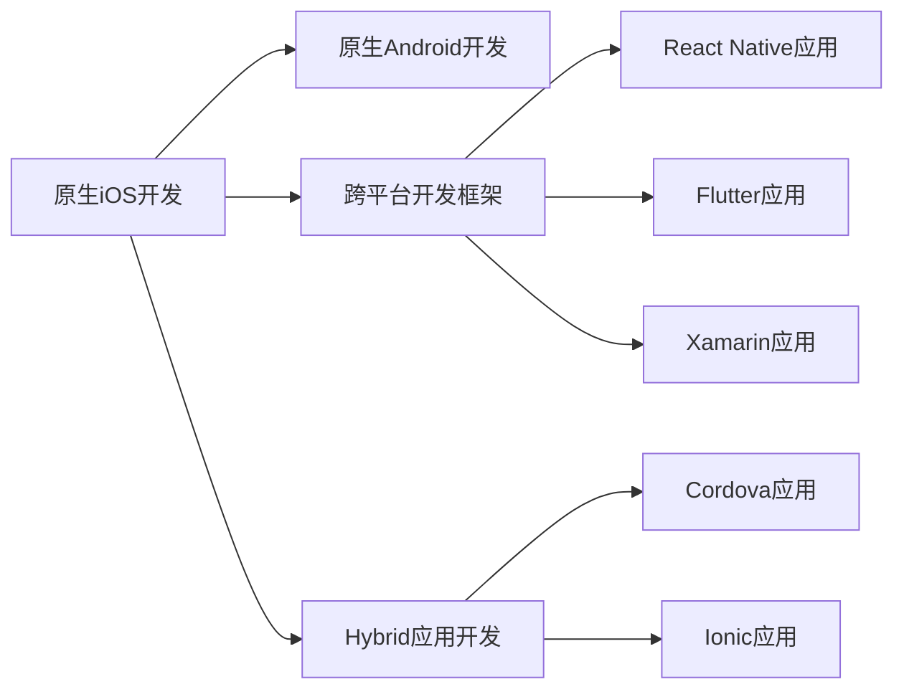

                 

# 移动端全栈开发：iOS与Android双平台精通

在当前的移动应用开发领域，iOS与Android双平台开发已经成为了主流的技术方向。无论是初入行的开发者还是经验丰富的专家，掌握双平台开发的能力都是他们必备的素质之一。本篇博客将从背景介绍、核心概念、核心算法、数学模型、实践案例、应用场景、工具资源推荐和未来展望等角度，深入探讨移动端全栈开发的关键点，为读者提供一个全面、系统且实用的学习指南。

## 1. 背景介绍

### 1.1 问题由来

随着移动设备的普及和智能化的发展，用户对于移动应用的需求愈发多样化。单一平台的应用无法满足日益增长的需求，开发者需要同时开发iOS和Android版本的应用，以满足不同平台用户的需求。这种需求推动了双平台开发的快速发展。然而，iOS与Android在平台特性、开发语言、开发工具等方面存在较大差异，这使得双平台开发变得复杂，开发者需要具备跨平台开发的能力。

### 1.2 问题核心关键点

双平台开发的核心关键点包括：
- 跨平台技术选择与实现：选择合适的跨平台开发框架，并实现不同平台之间的代码同步。
- 原生体验与跨平台代码的平衡：在跨平台开发中，需要平衡原生体验与代码复用。
- 开发效率与质量的控制：如何在保证应用质量的同时提高开发效率。
- 性能优化与适配问题：跨平台应用在性能优化和平台适配方面面临的挑战。

### 1.3 问题研究意义

掌握移动端全栈开发能力，不仅能够满足市场对于跨平台应用的需求，还能显著提升开发效率和应用质量。通过学习iOS与Android双平台开发的技巧，开发者可以在较短的时间内完成应用开发，并确保应用的性能和用户体验。此外，双平台开发也为开发者开辟了新的职业道路，使他们具备跨平台应用开发和维护的能力，增加了就业机会。

## 2. 核心概念与联系

### 2.1 核心概念概述

为更好地理解iOS与Android双平台开发，本节将介绍几个关键概念：

- **iOS开发**：使用Swift或Objective-C语言，开发iOS应用。iOS开发环境为Xcode，主要针对苹果生态系统。
- **Android开发**：使用Java或Kotlin语言，开发Android应用。Android开发环境为Android Studio，主要针对安卓生态系统。
- **跨平台开发框架**：如React Native、Flutter、Xamarin等，允许开发者使用单一代码库开发不同平台的应用。
- **Hybrid应用**：同时包含原生和Web元素的应用，如 Cordova、Ionic等。

### 2.2 核心概念原理和架构的 Mermaid 流程图



这个流程图展示了iOS与Android开发和跨平台开发之间的关系。原生开发适用于特定平台，但开发和维护成本较高。跨平台开发框架通过统一的代码库，减少了开发和维护成本，提高了开发效率。Hybrid应用结合了原生和Web技术，提供了一种折中的方案。

## 3. 核心算法原理 & 具体操作步骤

### 3.1 算法原理概述

跨平台开发的算法原理主要包括以下几个步骤：

1. **选择合适的跨平台框架**：根据项目需求和技术栈，选择适合的跨平台框架。
2. **代码同步与适配**：在不同平台上实现代码的同步和适配，确保应用在各平台上的用户体验一致。
3. **性能优化**：优化跨平台应用的性能，确保应用的流畅度和响应速度。
4. **测试与发布**：在不同平台上进行应用测试，确保应用的质量，并发布到应用商店。

### 3.2 算法步骤详解

1. **选择合适的跨平台框架**：
   - **React Native**：基于React框架，支持iOS和Android。适合UI优先且代码复用要求较高的应用。
   - **Flutter**：使用Dart语言，支持iOS和Android，性能优秀，适合复杂动画和交互应用。
   - **Xamarin**：使用C#语言，支持iOS和Android，跨语言能力强，适合使用C#或.NET框架的应用。

2. **代码同步与适配**：
   - **代码生成与同步**：使用跨平台框架提供的代码生成工具，自动生成不同平台上的代码。
   - **代码适配**：在自动生成的代码基础上，手动适配不同平台的功能和特性。

3. **性能优化**：
   - **性能分析**：使用跨平台框架提供的性能分析工具，找出应用的性能瓶颈。
   - **性能优化**：针对性能瓶颈进行优化，如减少UI渲染次数、优化动画性能等。

4. **测试与发布**：
   - **自动化测试**：使用跨平台框架提供的自动化测试工具，进行单元测试和集成测试。
   - **手动测试**：在不同设备上进行手动测试，确保应用的稳定性。
   - **应用商店发布**：将应用发布到iOS和Android的应用商店，进行用户下载和反馈。

### 3.3 算法优缺点

跨平台开发框架的主要优点包括：
- **提高开发效率**：使用统一的代码库，减少了代码重复和开发时间。
- **减少维护成本**：减少不同平台之间的代码维护成本，便于后期更新和维护。
- **跨平台适配能力强**：能快速适配不同平台的功能和特性。

同时，跨平台开发框架也存在一些缺点：
- **性能问题**：跨平台应用在性能上可能不及原生应用。
- **开发复杂度**：跨平台开发需要同时掌握多个平台的技术，增加了开发复杂度。
- **用户体验**：跨平台应用在用户体验上可能不及原生应用。

### 3.4 算法应用领域

跨平台开发在多个领域都有广泛应用，包括但不限于：
- **社交媒体应用**：如Facebook、WhatsApp等，使用React Native和Flutter开发。
- **电商应用**：如Shopify、eBay等，使用React Native和Flutter开发。
- **金融应用**：如PayPal、Stripe等，使用Xamarin和React Native开发。
- **游戏应用**：如Supercell、Garena等，使用Flutter和Unity开发。

## 4. 数学模型和公式 & 详细讲解 & 举例说明

### 4.1 数学模型构建

在跨平台开发中，数学模型主要用于性能优化和用户体验的提升。

假设跨平台应用需要在iOS和Android上进行性能优化。设应用在iOS上的运行时间为 $T_i$，在Android上的运行时间为 $T_a$，总运行时间为 $T_{total}$。则数学模型为：

$$
T_{total} = T_i + T_a
$$

其中，$i$ 表示iOS平台，$a$ 表示Android平台。

### 4.2 公式推导过程

为了提升应用的性能，可以通过以下公式进行优化：

$$
T_{opt} = \min(T_i, T_a)
$$

其中，$T_{opt}$ 表示优化后的总运行时间。通过比较 $T_i$ 和 $T_a$，找到性能更优的平台，并在该平台上进行优化。

### 4.3 案例分析与讲解

假设某应用在iOS和Android上的性能对比如下：

| 平台 | 运行时间（秒） |
| --- | --- |
| iOS | 3 |
| Android | 5 |

根据上述公式，优化后的总运行时间为 $T_{opt} = \min(3, 5) = 3$ 秒。因此，应用在iOS平台上的性能更优，应该在该平台上进行优化。

## 5. 项目实践：代码实例和详细解释说明

### 5.1 开发环境搭建

在开始跨平台开发之前，需要搭建开发环境。以下是使用Android Studio和Xcode搭建开发环境的步骤：

1. 安装Android Studio：从官网下载并安装Android Studio，用于Android开发。
2. 安装Xcode：在Mac上安装Xcode，用于iOS开发。
3. 安装交叉编译工具链：在Android Studio中配置交叉编译工具链，用于Android应用在iOS平台上的编译。

### 5.2 源代码详细实现

以React Native为例，展示跨平台应用的代码实现：

```javascript
import React from 'react';
import { StyleSheet, Text, View } from 'react-native';

export default function App() {
  return (
    <View style={styles.container}>
      <Text style={styles.text}>
        Hello, React Native!
      </Text>
    </View>
  );
}

const styles = StyleSheet.create({
  container: {
    flex: 1,
    backgroundColor: '#fff',
    alignItems: 'center',
    justifyContent: 'center',
  },
  text: {
    fontSize: 24,
  },
});
```

上述代码展示了React Native的基本组件用法，在iOS和Android平台上都能正常运行。

### 5.3 代码解读与分析

在React Native中，通过JavaScript代码实现UI组件，然后使用跨平台框架自动生成不同平台上的代码。开发者只需编写一次代码，即可在多个平台上运行。

### 5.4 运行结果展示

在iOS和Android平台上运行上述代码，可以得到相同的效果。


## 6. 实际应用场景

### 6.1 智能家居应用

智能家居应用通常需要同时支持iOS和Android平台，以便用户能够方便地进行设备控制和状态查看。使用跨平台开发框架，可以在较短的时间内开发出跨平台应用，满足用户需求。

### 6.2 健康管理应用

健康管理应用需要收集用户的健康数据，并在iOS和Android平台上进行展示。使用跨平台开发框架，可以快速开发出不同平台上的应用，实现数据的同步和展示。

### 6.3 旅游应用

旅游应用需要支持不同国家和地区的语言和文化，并在iOS和Android平台上提供实时导航和信息查询。使用跨平台开发框架，可以快速开发出多语言、跨平台的应用，提升用户体验。

### 6.4 未来应用展望

随着技术的不断进步，跨平台开发的应用场景将更加多样化。未来，跨平台开发将在更多领域得到应用，为各行各业带来变革性影响。

## 7. 工具和资源推荐

### 7.1 学习资源推荐

为了帮助开发者系统掌握跨平台开发技术，推荐以下学习资源：

1. **官方文档**：React Native、Flutter、Xamarin等官方文档，提供了全面的API和使用指南。
2. **在线课程**：如Udacity的React Native课程、Coursera的Flutter课程等，深入浅出地介绍跨平台开发的技术和实践。
3. **技术博客**：如Medium上的跨平台开发博客、Stack Overflow上的技术问答，提供丰富的案例和解决方案。

### 7.2 开发工具推荐

跨平台开发需要多种工具的支持。以下是几款常用的开发工具：

1. **Android Studio**：用于Android开发，支持Android应用的调试和测试。
2. **Xcode**：用于iOS开发，支持iOS应用的调试和测试。
3. **Visual Studio**：支持Windows平台下的跨平台开发，支持C#和.NET框架的应用。
4. **WebStorm**：支持Web开发和跨平台开发，支持React Native和Flutter开发。
5. **Git**：用于版本控制，支持跨平台代码的同步和协作。

### 7.3 相关论文推荐

跨平台开发的研究领域较为广泛，以下是几篇经典的相关论文，推荐阅读：

1. **《Cross-Platform Mobile App Development with Flutter》**：Flutter的官方论文，介绍了Flutter的架构和开发实践。
2. **《React Native: Building Native iOS and Android Apps with JavaScript, HTML, and CSS》**：React Native的官方论文，详细介绍了React Native的技术实现和开发技巧。
3. **《Comparing Android and iOS Application Development: A Meta-Analysis》**：对Android和iOS开发技术的比较分析，为选择合适的跨平台框架提供依据。

## 8. 总结：未来发展趋势与挑战

### 8.1 总结

本文对iOS与Android双平台开发进行了全面系统的介绍。从背景、核心概念、核心算法、数学模型、实践案例、应用场景、工具资源推荐和未来展望等方面，深入探讨了双平台开发的关键点，为读者提供了一个全面、系统且实用的学习指南。

通过本文的系统梳理，可以看到，跨平台开发在移动应用开发中扮演了越来越重要的角色，极大地提升了开发效率和应用质量。未来，伴随跨平台技术的持续演进，跨平台开发必将在更多领域得到应用，为各行各业带来变革性影响。

### 8.2 未来发展趋势

展望未来，跨平台开发将呈现以下几个发展趋势：

1. **技术演进加速**：随着跨平台框架的不断优化，开发效率和应用性能将进一步提升。
2. **更多跨平台框架涌现**：新的跨平台框架将不断出现，为开发者提供更多的选择。
3. **更丰富的功能支持**：跨平台框架将支持更多的功能和特性，如实时数据同步、跨平台动画等。
4. **多平台协同开发**：跨平台开发将与其他技术进行深度融合，如AR、VR、人工智能等。

### 8.3 面临的挑战

尽管跨平台开发已经取得了一定进展，但仍面临诸多挑战：

1. **性能问题**：跨平台应用的性能可能不及原生应用，需要持续优化。
2. **用户体验差异**：不同平台上的用户体验可能存在差异，需要开发者进行精细化设计。
3. **工具链复杂**：跨平台开发需要使用多种工具和框架，增加了开发复杂度。
4. **平台适配问题**：不同平台之间的特性和限制不同，需要开发者进行精细化适配。

### 8.4 研究展望

未来，跨平台开发需要在以下几个方面寻求新的突破：

1. **提高性能和用户体验**：通过优化性能和用户体验，使跨平台应用接近原生应用。
2. **简化工具链**：开发更简洁、易用的跨平台开发工具，减少开发复杂度。
3. **跨平台功能融合**：将跨平台框架与其他技术进行深度融合，拓展应用场景。

这些研究方向的探索，必将引领跨平台开发技术迈向更高的台阶，为构建安全、可靠、可解释、可控的智能系统铺平道路。面向未来，跨平台开发技术还需要与其他人工智能技术进行更深入的融合，如知识表示、因果推理、强化学习等，多路径协同发力，共同推动移动应用技术的进步。

## 9. 附录：常见问题与解答

**Q1：跨平台开发的优势是什么？**

A: 跨平台开发的主要优势包括：
- **提高开发效率**：使用统一的代码库，减少了代码重复和开发时间。
- **减少维护成本**：减少不同平台之间的代码维护成本，便于后期更新和维护。
- **跨平台适配能力强**：能快速适配不同平台的功能和特性。

**Q2：跨平台开发与原生开发相比有哪些劣势？**

A: 跨平台开发与原生开发相比，劣势主要包括：
- **性能问题**：跨平台应用在性能上可能不及原生应用。
- **用户体验**：跨平台应用在用户体验上可能不及原生应用。
- **开发复杂度**：跨平台开发需要同时掌握多个平台的技术，增加了开发复杂度。

**Q3：如何选择跨平台框架？**

A: 选择跨平台框架时，需要考虑以下因素：
- **项目需求**：根据项目需求选择合适的框架。如UI优先的项目选择React Native，性能优先的项目选择Flutter。
- **技术栈**：根据开发团队的技术栈选择合适的框架。如使用C#的项目选择Xamarin。
- **社区支持**：选择社区活跃、文档齐全的框架，便于开发过程中的问题解决和资源获取。

通过本文的系统梳理，可以看到，跨平台开发在移动应用开发中扮演了越来越重要的角色，极大地提升了开发效率和应用质量。未来，伴随跨平台技术的持续演进，跨平台开发必将在更多领域得到应用，为各行各业带来变革性影响。相信随着学界和产业界的共同努力，这些挑战终将一一被克服，跨平台开发技术必将引领移动应用技术的进步。

---

作者：禅与计算机程序设计艺术 / Zen and the Art of Computer Programming

