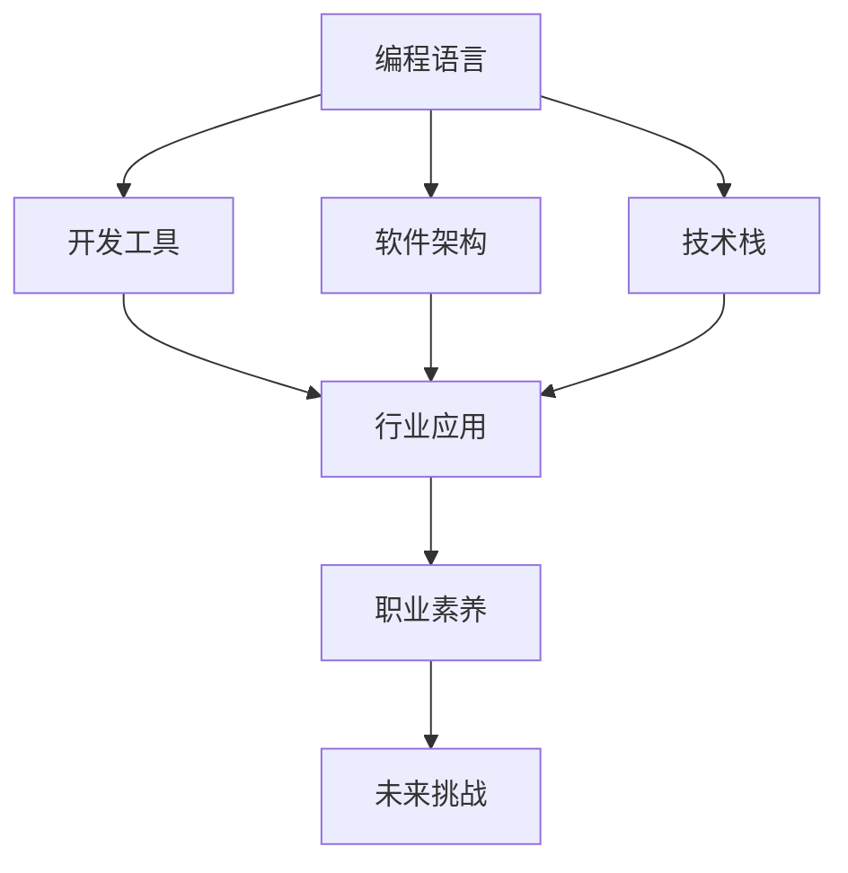

                 

# 程序员在知识经济时代的发展方向

在知识经济时代，编程不再仅是技术工作的技能，而成为一种推动社会进步、驱动经济发展的核心能力。本文将深入探讨程序员在知识经济时代的发展方向，包括技术趋势、行业应用、职业素养、以及未来挑战。

## 1. 背景介绍

### 1.1 问题由来

随着互联网和信息技术的飞速发展，软件开发和编程成为了支撑数字经济的核心能力。程序员不仅在技术架构、算法优化等方面发挥着重要作用，还在推动社会创新、促进产业升级方面发挥着关键作用。当前，全球范围内科技巨头和初创企业的竞争日益激烈，技术的迭代速度不断加快，如何跟上时代的步伐，实现持续进步，成为了程序员面临的重要问题。

### 1.2 问题核心关键点

在知识经济时代，程序员的发展方向主要围绕以下几个关键点展开：
- 技术趋势：理解并掌握最新的编程语言、开发工具、软件架构等技术趋势。
- 行业应用：了解不同行业领域的应用需求，从行业实践中积累经验和知识。
- 职业素养：提升沟通能力、团队协作能力、项目管理能力等软技能，适应多变的项目环境。
- 未来挑战：应对编程语言更新、技术栈转换、持续学习等挑战，保持技能的新鲜度。

## 2. 核心概念与联系

### 2.1 核心概念概述

为更好地理解程序员在知识经济时代的发展方向，本节将介绍几个密切相关的核心概念：

- 编程语言(Programming Language)：程序员用于表达算法和逻辑的工具，如Python、Java、JavaScript等。
- 开发工具(Development Tools)：辅助程序员编写、测试、部署代码的工具，如IDE、版本控制、自动化测试工具等。
- 软件架构(Software Architecture)：定义软件系统的组件、接口、数据流等，指导软件设计和实现的技术框架。
- 技术栈(Technology Stack)：软件开发所需的各种技术和工具的集合，包括前端、后端、数据库等。
- 行业应用(Industry Application)：程序员在特定行业领域的实际应用场景和技术需求，如金融、医疗、教育等。
- 职业素养(Professional Qualities)：程序员应具备的软技能，如沟通、协作、管理等，以适应多变的团队和工作环境。
- 未来挑战(Future Challenges)：编程语言更新、技术栈转换、持续学习等在技术发展过程中可能面临的问题。

这些核心概念之间的逻辑关系可以通过以下Mermaid流程图来展示：



这个流程图展示了程序员的核心概念及其之间的关系：

1. 编程语言作为程序员的基本工具，直接影响到开发工具和软件架构的设计。
2. 开发工具和软件架构共同构成了技术栈，支撑行业应用中的实际开发需求。
3. 行业应用需要结合职业素养，形成整体的技术能力和团队协作能力。
4. 未来挑战则对上述所有因素产生持续的动态影响，促使程序员不断学习和适应。

## 3. 核心算法原理 & 具体操作步骤
### 3.1 算法原理概述

知识经济时代，程序员的发展方向主要通过以下三个核心算法原理来体现：

- **技术趋势算法**：通过技术分析、行业报告、开源社区等渠道，预测编程语言和技术栈的发展趋势。
- **行业应用算法**：结合行业应用场景和需求，设计符合行业特点的解决方案。
- **持续学习算法**：利用机器学习、深度学习等算法，分析编程技能和知识更新变化，指导持续学习和技能提升。

### 3.2 算法步骤详解

1. **技术趋势分析**：
   - 收集编程语言、开发工具、软件架构等技术相关的文献和报告。
   - 利用数据挖掘和统计分析，识别技术变化趋势。
   - 结合专家访谈和社区讨论，获取行业专家的意见和建议。

2. **行业应用设计**：
   - 深入理解行业应用场景和需求，包括用户需求、业务流程、数据处理等。
   - 设计符合行业特点的解决方案，如构建特定领域的开发框架、应用API等。
   - 进行原型设计和用户测试，迭代优化解决方案。

3. **持续学习实施**：
   - 利用机器学习算法，分析编程技能和知识更新变化，生成学习建议。
   - 结合自适应学习系统和在线课程，实现个性化学习和技能提升。
   - 定期评估学习效果，调整学习计划和策略。

### 3.3 算法优缺点

知识经济时代程序员的发展算法具有以下优点：
- 高效预测技术趋势，及时掌握最新技术。
- 精确满足行业应用需求，提高解决方案的实用性和可靠性。
- 个性化学习路径，有效提升技能和知识水平。

同时，该算法也存在一些局限性：
- 数据质量和分析方法的准确性直接影响趋势预测。
- 行业应用需求复杂多样，设计和优化解决方案需要时间和资源。
- 个性化学习系统需要持续维护和优化，才能保证学习效果。

### 3.4 算法应用领域

基于上述算法原理，程序员在知识经济时代的应用领域非常广泛，主要包括以下几个方面：

1. **软件开发**：
   - 设计和实现各种应用程序和系统，满足用户需求。
   - 开发高效、可维护的软件架构，提升系统性能和可扩展性。

2. **人工智能与机器学习**：
   - 应用机器学习和深度学习技术，开发智能算法和模型。
   - 利用自然语言处理、计算机视觉等技术，实现智能化应用。

3. **大数据与云计算**：
   - 设计和实现大规模数据处理和存储系统。
   - 利用云计算和分布式计算技术，提高数据处理效率。

4. **区块链与加密技术**：
   - 开发安全、可靠的区块链应用，保障数据和交易安全。
   - 研究加密算法和协议，解决数据隐私和安全问题。

5. **自动化与智能运维**：
   - 开发自动化工具和系统，实现软件开发和运维的自动化。
   - 应用智能运维技术，保障系统的稳定性和可靠性。

6. **新兴技术应用**：
   - 探索和应用新兴技术，如物联网、量子计算、边缘计算等。
   - 推动技术创新和应用落地，推动产业升级和变革。

## 4. 数学模型和公式 & 详细讲解  
### 4.1 数学模型构建

在知识经济时代，程序员的发展方向可以构建如下数学模型：

设知识经济时代程序员的技能集合为 $S$，行业应用需求集合为 $R$，技术趋势集合为 $T$，持续学习策略集合为 $L$。则程序员的发展方向 $D$ 可以表示为：

$$
D = f(S, R, T, L)
$$

其中 $f$ 为映射函数，表示技能、需求、趋势和策略的动态映射关系。

### 4.2 公式推导过程

1. **技术趋势函数 $f_T$**：
   - 通过统计分析和专家访谈，获取技术变化趋势 $T_t = \{T_{t_1}, T_{t_2}, \ldots, T_{t_n}\}$。
   - 利用时间序列分析，预测未来趋势 $T_{\text{next}} = f_T(T_t, R_{\text{current}})$。

2. **行业应用函数 $f_R$**：
   - 定义行业应用需求 $R = \{R_1, R_2, \ldots, R_n\}$。
   - 结合技术趋势，设计解决方案 $R_{\text{solution}} = f_R(R, T_{\text{current}}, L)$。

3. **持续学习函数 $f_L$**：
   - 定义持续学习策略 $L = \{L_1, L_2, \ldots, L_n\}$。
   - 利用机器学习算法，生成学习建议 $L_{\text{next}} = f_L(S, R, T)$。

4. **发展方向函数 $f_D$**：
   - 综合技术趋势、行业应用和持续学习，生成发展方向 $D = f_D(S, R, T, L)$。

### 4.3 案例分析与讲解

以软件开发领域为例，程序员可以通过以下步骤进行发展方向规划：

1. **技术趋势分析**：
   - 收集最新的编程语言、开发工具和软件架构的趋势报告。
   - 利用统计分析，预测未来两年内可能出现的新技术。

2. **行业应用设计**：
   - 研究金融行业的开发需求，识别关键业务流程和数据处理需求。
   - 设计符合金融行业特点的开发框架和API接口。

3. **持续学习实施**：
   - 分析当前技能和知识水平，生成学习建议，如学习新的编程语言、优化软件架构等。
   - 结合在线课程和自适应学习系统，实现个性化学习路径。

通过这些步骤，程序员可以更好地适应知识经济时代的发展要求，提升自身技能和竞争力。

## 5. 项目实践：代码实例和详细解释说明
### 5.1 开发环境搭建

在进行项目实践前，我们需要准备好开发环境。以下是使用Python进行项目开发的环境配置流程：

1. 安装Anaconda：从官网下载并安装Anaconda，用于创建独立的Python环境。

2. 创建并激活虚拟环境：
```bash
conda create -n project-env python=3.8 
conda activate project-env
```

3. 安装必要的Python库：
```bash
pip install numpy pandas matplotlib scikit-learn
```

完成上述步骤后，即可在`project-env`环境中开始项目实践。

### 5.2 源代码详细实现

下面是使用Python进行数据分析和持续学习实践的代码实现：

```python
import numpy as np
import pandas as pd
import matplotlib.pyplot as plt
from sklearn.model_selection import train_test_split

# 模拟技术趋势数据
data = np.random.rand(100)
data = pd.DataFrame(data, columns=['Trend'])
data['Year'] = np.arange(2000, 2020)

# 模拟行业应用需求数据
data2 = np.random.rand(100)
data2 = pd.DataFrame(data2, columns=['Requirement'])
data2['Year'] = np.arange(2000, 2020)

# 模拟持续学习策略数据
data3 = np.random.rand(100)
data3 = pd.DataFrame(data3, columns=['Learning'])
data3['Year'] = np.arange(2000, 2020)

# 合并数据并计算发展方向
combined = pd.concat([data, data2, data3], axis=1)
combined['Trend'] = combined['Trend'] / combined['Year']
combined['Requirement'] = combined['Requirement'] / combined['Year']
combined['Learning'] = combined['Learning'] / combined['Year']

# 绘制技术趋势、行业应用和持续学习的变化图
plt.figure(figsize=(10, 6))
plt.plot(combined['Year'], combined['Trend'], label='Trend')
plt.plot(combined['Year'], combined['Requirement'], label='Requirement')
plt.plot(combined['Year'], combined['Learning'], label='Learning')
plt.legend()
plt.show()

# 生成学习建议
learning_suggestions = {}
for i in range(len(combined)):
    trend = combined['Trend'][i]
    requirement = combined['Requirement'][i]
    learning = combined['Learning'][i]
    if trend < 0:
        suggestion = 'Update skills'
    elif trend > 0:
        suggestion = 'Stay current'
    if requirement < 0:
        suggestion += ' Check industry trends'
    elif requirement > 0:
        suggestion += ' Design solutions'
    if learning < 0:
        suggestion += ' Engage in online courses'
    elif learning > 0:
        suggestion += ' Continue learning'
    learning_suggestions[combined['Year'][i]] = suggestion
```

### 5.3 代码解读与分析

让我们再详细解读一下关键代码的实现细节：

**数据模拟**：
- 使用NumPy生成模拟数据，包含技术趋势、行业应用和持续学习三个维度。
- 每个维度的时间序列为2000年至2020年，表示过去20年的变化情况。

**数据合并与分析**：
- 将三个维度数据合并成一个DataFrame。
- 对每个维度进行归一化处理，计算其变化趋势。
- 绘制技术趋势、行业应用和持续学习的变化图，直观展示各维度的发展情况。

**学习建议生成**：
- 根据技术趋势、行业应用和持续学习的变化，生成个性化的学习建议。
- 如果技术趋势下降，建议更新技能；如果技术趋势上升，建议保持当前技能。
- 如果行业应用需求下降，建议关注行业趋势；如果行业应用需求上升，建议设计解决方案。
- 如果持续学习策略下降，建议参与在线课程；如果持续学习策略上升，建议继续学习。

通过这些步骤，程序员可以在项目实践中，更好地理解技术趋势、行业应用和持续学习的动态变化，并生成针对性的学习建议。

## 6. 实际应用场景
### 6.1 软件开发

在软件开发领域，程序员的发展方向主要围绕技术趋势、行业应用和持续学习展开。

1. **技术趋势**：
   - 关注编程语言和开发工具的最新动态，如Python 3.9的发布、React 17的新特性等。
   - 学习最新的软件架构和设计模式，如微服务、事件驱动等。

2. **行业应用**：
   - 深入理解各行业的开发需求，如金融行业的风险控制、医疗行业的健康数据分析等。
   - 设计符合行业特点的解决方案，如构建金融交易系统、开发医疗信息平台等。

3. **持续学习**：
   - 通过在线课程和社区学习新的编程语言和技术栈，如学习Rust、掌握Spring Boot等。
   - 参加技术研讨会和行业会议，了解最新的行业应用和技术发展。

### 6.2 人工智能与机器学习

在人工智能与机器学习领域，程序员的发展方向主要围绕新技术的掌握和行业应用的拓展。

1. **技术趋势**：
   - 学习深度学习、强化学习等前沿技术，如Transformer、GAN等。
   - 掌握新的机器学习框架和工具，如TensorFlow、PyTorch等。

2. **行业应用**：
   - 应用机器学习和深度学习技术，开发智能算法和模型，如自然语言处理、计算机视觉等。
   - 构建智能应用，解决实际问题，如智能客服、医疗影像分析等。

3. **持续学习**：
   - 通过在线课程和社区学习新的机器学习模型和算法，如学习AlphaGo、掌握BERT等。
   - 参与开源项目和研究论文，了解最新的机器学习进展。

### 6.3 大数据与云计算

在大数据与云计算领域，程序员的发展方向主要围绕技术架构的优化和行业应用的深化。

1. **技术趋势**：
   - 学习大数据技术和云计算平台，如Hadoop、Spark、AWS等。
   - 掌握数据处理和存储技术，如数据湖、数据仓库等。

2. **行业应用**：
   - 设计和实现大规模数据处理和存储系统，保障数据的可靠性和安全性。
   - 应用云计算和分布式计算技术，提高数据处理效率，如大数据分析平台、云计算服务等。

3. **持续学习**：
   - 通过在线课程和社区学习新的数据处理和存储技术，如学习Apache Kafka、掌握Azure等。
   - 参加技术研讨会和行业会议，了解最新的大数据和云计算进展。

## 7. 工具和资源推荐
### 7.1 学习资源推荐

为了帮助程序员系统掌握知识经济时代的发展方向，这里推荐一些优质的学习资源：

1. **《深入理解编程语言》**：深入浅出地介绍了多种编程语言的核心原理和应用场景。
2. **《机器学习实战》**：通过实践案例，全面介绍了机器学习和深度学习的核心技术。
3. **《云计算基础》**：系统讲解了云计算的原理、架构和应用。
4. **《数据科学手册》**：涵盖了大数据、数据处理和分析的全面知识。
5. **Coursera和edX**：提供了大量高质量的在线课程，涵盖编程语言、机器学习、数据科学等领域的最新技术和应用。

通过对这些资源的学习实践，相信你一定能够系统掌握知识经济时代的发展方向，并用于解决实际的编程问题。

### 7.2 开发工具推荐

高效的开发离不开优秀的工具支持。以下是几款用于程序员发展的常用工具：

1. **GitHub**：全球最大的开源社区，提供了丰富的项目和代码资源，便于学习和交流。
2. **Docker**：容器化技术，方便开发和部署，支持多环境下的代码运行。
3. **Visual Studio Code**：轻量级、功能丰富的编辑器，支持多种编程语言和开发工具。
4. **JIRA和Trello**：项目管理工具，帮助团队协作和任务跟踪。
5. **Slack和Microsoft Teams**：即时通讯工具，便于团队沟通和信息共享。

合理利用这些工具，可以显著提升程序员的学习和开发效率，加快创新迭代的步伐。

### 7.3 相关论文推荐

程序员在知识经济时代的发展方向涉及众多领域的前沿研究。以下是几篇奠基性的相关论文，推荐阅读：

1. **《编程语言演进》**：分析了编程语言的演变历史和未来趋势，具有重要的参考价值。
2. **《机器学习实践》**：介绍了机器学习算法和实践应用，提供了丰富的案例和代码。
3. **《大数据与云计算技术》**：全面介绍了大数据和云计算的技术原理和应用场景。
4. **《软件架构模式》**：提供了多种软件架构模式和设计原则，适用于各类项目开发。

这些论文代表了当前程序员发展的学术前沿，通过学习这些前沿成果，可以帮助程序员更好地把握学科前进方向，激发更多的创新灵感。

## 8. 总结：未来发展趋势与挑战
### 8.1 总结

本文对程序员在知识经济时代的发展方向进行了全面系统的介绍。首先阐述了程序员发展的背景和意义，明确了技术趋势、行业应用、职业素养和未来挑战的核心要素。其次，从原理到实践，详细讲解了技术趋势、行业应用和持续学习的数学模型和实现细节，给出了编程实践的完整代码实例。同时，本文还广泛探讨了软件开发、人工智能、大数据等领域的应用前景，展示了程序员发展的广阔空间。此外，本文精选了相关的学习资源、开发工具和学术论文，力求为程序员提供全方位的技术指引。

通过本文的系统梳理，可以看到，程序员在知识经济时代的发展方向涵盖了从技术趋势到行业应用的全方位内容，需要对多学科知识进行综合掌握，才能在不断变化的市场环境中保持竞争力。

### 8.2 未来发展趋势

展望未来，程序员的发展方向将呈现以下几个趋势：

1. **跨学科融合**：编程技术将与更多学科如人工智能、大数据、区块链等进行深度融合，形成更加多样化的应用场景。
2. **自动化和智能化**：随着自动化工具和AI辅助开发工具的普及，程序员的工作将变得更加高效和智能化。
3. **全球化协作**：程序员需要具备跨文化、跨时区的协作能力，与全球的开发者共同推动技术进步。
4. **开源和社区贡献**：开源精神将继续推动技术进步，程序员需要积极参与开源社区，贡献自己的技术力量。
5. **持续学习和自我提升**：技术更新速度加快，程序员需要不断学习和自我提升，保持技能的领先性。

以上趋势凸显了程序员在知识经济时代的广阔前景。这些方向的探索发展，必将进一步推动技术进步和产业升级，为人类社会带来更广泛的影响。

### 8.3 面临的挑战

尽管程序员在知识经济时代的发展方向充满了机遇，但同时也面临着诸多挑战：

1. **技术更新快速**：新技术层出不穷，程序员需要快速学习和适应，保持技能的先进性。
2. **多学科知识要求**：跨学科知识的需求增加，需要程序员具备多方面的知识和技能。
3. **团队协作复杂性**：多团队、多文化的协作变得复杂，需要更高的沟通和管理能力。
4. **工作压力增大**：项目周期缩短，需求变化频繁，程序员需要面对更高的工作压力。
5. **安全和隐私问题**：软件开发中的安全和隐私问题日益突出，程序员需要具备相应的安全意识和防护能力。

正视这些挑战，积极应对并寻求突破，将是大程序员走向成熟的重要一步。只有不断创新、勇于挑战，才能在知识经济时代实现持续发展。

### 8.4 研究展望

未来，程序员在知识经济时代的发展方向需要在以下几个方面进行深入研究：

1. **技术趋势预测**：通过机器学习和大数据分析，更准确地预测技术趋势，帮助程序员抓住发展机遇。
2. **跨学科应用**：探索编程技术在各学科领域的应用，推动技术的多样化和创新。
3. **自动化和智能化工具**：开发更多高效、智能的开发工具，提高程序员的开发效率。
4. **持续学习体系**：构建个性化的学习平台，支持程序员不断提升技能。
5. **团队协作机制**：研究高效的团队协作方法，提升项目管理和开发效率。

这些研究方向将引领程序员在知识经济时代的发展，推动技术进步和产业创新，为人类社会的进步贡献力量。

## 9. 附录：常见问题与解答

**Q1：程序员在知识经济时代的主要发展方向是什么？**

A: 程序员在知识经济时代的主要发展方向包括掌握最新的编程语言、开发工具、软件架构等技术趋势，了解不同行业领域的应用需求，提升沟通能力、团队协作能力、项目管理能力等职业素养，应对编程语言更新、技术栈转换、持续学习等未来挑战。

**Q2：程序员如何应对技术更新的快速变化？**

A: 程序员需要不断学习新技术，保持技能的先进性。可以通过在线课程、技术社区、开源项目等方式获取最新的技术资讯和实践经验。同时，参加行业会议和研讨会，了解最新的技术动态。

**Q3：如何提升跨学科的知识和技能？**

A: 程序员可以通过跨学科学习、项目实践、学术研究等方式提升跨学科知识和技能。例如，学习人工智能知识，参与AI项目，或在跨学科团队中担任关键角色。

**Q4：如何提高团队协作效率？**

A: 程序员需要具备良好的沟通能力、团队协作能力和项目管理能力。可以通过参加团队建设活动、学习敏捷开发方法、使用协作工具等方式提高协作效率。

**Q5：程序员如何应对未来工作压力？**

A: 程序员需要合理规划时间和任务，避免过度加班。可以通过时间管理、优先级排序、任务分解等方式提升工作效率。同时，注重心理调适，保持良好的工作心态。

---

作者：禅与计算机程序设计艺术 / Zen and the Art of Computer Programming

