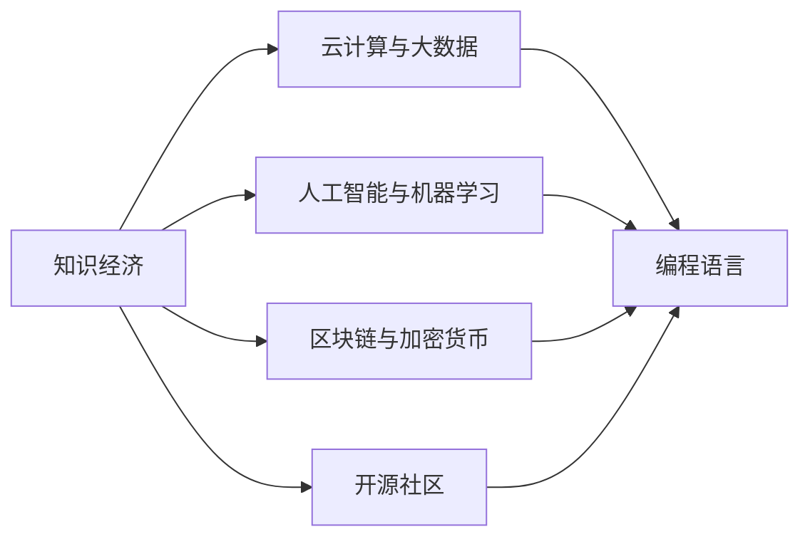

                 

# 程序员在知识经济时代的发展机会

在当今的知识经济时代，程序员作为技术的核心力量，正面临前所未有的发展机遇。本文将从背景介绍、核心概念与联系、核心算法原理、数学模型和公式、项目实践、实际应用场景、工具和资源推荐、总结与展望等几个方面，对程序员在知识经济时代的发展机会进行深入探讨。

## 1. 背景介绍

### 1.1 问题由来
进入21世纪以来，全球科技产业进入高速发展阶段，以互联网、人工智能、大数据为代表的技术日益成为驱动经济增长的关键因素。知识经济时代的到来，让程序员这一传统职业进入了一个全新的发展阶段。随着技术的不断进步，传统行业对IT人才的需求激增，企业数字化转型的浪潮席卷全球。同时，新兴技术的快速发展也为程序员提供了更多的职业选择和发展空间。

### 1.2 问题核心关键点
1. **技术变革带来的需求变化**：新技术的应用促使各行各业对程序员的需求不断增加。特别是人工智能、大数据、区块链等新兴领域，对程序员的技能和知识提出了新的要求。
2. **产业升级与智能化转型**：传统行业通过智能化转型提升效率，对具有多领域知识储备的复合型程序员需求激增。
3. **远程工作与灵活就业**：技术的发展让远程工作成为可能，程序员可以更灵活地安排工作时间和地点，提升生活质量和工作效率。
4. **开源社区与创新生态**：开源社区和创新生态的兴起，让程序员更容易获取最新技术，参与全球性技术创新，实现个人价值最大化。

### 1.3 问题研究意义
理解程序员在知识经济时代的发展机会，对于个人职业规划、企业人才招聘、教育机构课程设置等方面具有重要意义。这不仅能帮助程序员把握未来的发展方向，还能指导企业构建更符合市场需求的IT团队，推动教育机构培养更多符合时代需求的技术人才。

## 2. 核心概念与联系

### 2.1 核心概念概述

为更好地理解程序员在知识经济时代的发展机会，我们需要掌握以下几个核心概念：

- **知识经济**：以知识和信息为驱动力的经济形态，强调创新、技术与经济紧密结合。
- **编程语言**：程序员用于编写代码的工具，如Python、Java、C++等。
- **云计算与大数据**：支持分布式计算和海量数据存储的技术，为程序员提供更强大的计算能力和数据支持。
- **人工智能与机器学习**：涵盖算法、数据科学等领域的知识，让程序员能够构建智能应用。
- **区块链与加密货币**：涉及密码学、分布式系统等领域的知识，为程序员提供了新的技术挑战和应用场景。
- **开源社区**：程序员合作交流、共享资源和代码的平台，如GitHub、Apache等。

这些核心概念构成了程序员在知识经济时代的知识体系，展示了多样化的技术趋势和应用场景。

### 2.2 核心概念原理和架构的 Mermaid 流程图



这个流程图展示了核心概念之间的联系。知识经济时代，云计算与大数据、人工智能与机器学习、区块链与加密货币以及开源社区等技术互为支撑，共同推动编程语言的发展和应用。

## 3. 核心算法原理 & 具体操作步骤

### 3.1 算法原理概述

程序员在知识经济时代的发展机会，与多种算法原理密切相关。本文将从编程语言、云计算与大数据、人工智能与机器学习、区块链与加密货币、开源社区五个方面，简要介绍这些技术背后的算法原理。

- **编程语言**：基于编译原理和解释原理，程序员能够编写出高效、可靠的程序。
- **云计算与大数据**：基于分布式计算和数据存储原理，支持大规模数据处理和计算。
- **人工智能与机器学习**：基于统计学习、深度学习、强化学习等算法原理，让程序员能够构建智能应用。
- **区块链与加密货币**：基于密码学和分布式共识算法原理，保障数据安全和交易透明。
- **开源社区**：基于协作与共享的原理，支持程序员之间的交流和合作。

### 3.2 算法步骤详解

程序员在知识经济时代的发展机会，涉及多个算法步骤。以下是对这些步骤的详细介绍：

1. **学习和掌握核心技术**：程序员需要不断学习新技术，掌握编程语言、云计算、人工智能、区块链等核心技术。
2. **参与开源项目**：积极参与开源社区的项目，提升技术能力和实战经验。
3. **构建个人品牌**：通过博客、社交媒体等方式分享技术经验，提升个人影响力。
4. **持续学习和适应**：技术不断进步，程序员需要保持学习热情，适应新的技术趋势。
5. **提升跨领域能力**：技术融合趋势明显，程序员需要具备跨领域能力，如数据科学、区块链等。

### 3.3 算法优缺点

程序员在知识经济时代的发展机会，存在以下优缺点：

- **优点**：
  1. **多样化的职业路径**：程序员可以选择多种职业路径，如前端、后端、全栈、人工智能等。
  2. **较高的薪酬**：技术岗位通常具有较高的薪酬，吸引大量优秀人才。
  3. **灵活的工作方式**：远程工作、自由职业等方式让程序员的工作更加灵活。

- **缺点**：
  1. **技术更新快**：新技术不断涌现，需要不断学习才能保持竞争力。
  2. **工作压力大**：项目交付压力大，经常需要加班。
  3. **职业风险高**：技术淘汰速度快，部分技术可能很快被替代。

### 3.4 算法应用领域

程序员在知识经济时代的发展机会，涉及多个应用领域，包括但不限于：

- **软件开发**：前端、后端、移动应用开发等。
- **人工智能**：机器学习、深度学习、自然语言处理等。
- **区块链**：智能合约、去中心化应用、加密货币开发等。
- **大数据**：数据挖掘、数据分析、数据可视化等。
- **云计算**：云平台开发、云应用开发等。

## 4. 数学模型和公式 & 详细讲解 & 举例说明

### 4.1 数学模型构建

本文将使用数学模型来描述程序员在知识经济时代的发展机会。数学模型构建的目的是：通过精确的数学表达，帮助程序员理解不同技术间的联系和互动。

假设程序员的知识体系是一个向量 $\mathbf{K} = (k_1, k_2, k_3, ..., k_n)$，其中 $k_i$ 表示程序员掌握的第 $i$ 种技术或知识。

### 4.2 公式推导过程

基于上述假设，程序员在知识经济时代的发展机会可以用以下数学公式表示：

$$
\text{发展机会} = \text{技术掌握度} \times \text{市场需求} \times \text{工作灵活度}
$$

其中，技术掌握度 $\text{技术掌握度} = \frac{1}{\sqrt{\sum_{i=1}^n k_i^2}}$，表示程序员对多种技术的掌握程度；市场需求 $\text{市场需求} = \text{技术需求系数} \times \text{行业发展速度}$，表示技术在特定行业的需求程度；工作灵活度 $\text{工作灵活度} = \text{远程工作系数} \times \text{自由职业系数}$，表示程序员工作的灵活程度。

### 4.3 案例分析与讲解

以人工智能与机器学习为例，分析其在知识经济时代的发展机会：

- **技术掌握度**：程序员需要掌握Python、TensorFlow、PyTorch等核心技术。
- **市场需求**：随着人工智能技术的不断应用，企业对数据科学家、机器学习工程师的需求激增。
- **工作灵活度**：人工智能领域的项目多采用远程合作方式，程序员可以灵活安排工作时间和地点。

根据上述公式，计算得出的发展机会为：

$$
\text{发展机会} = \frac{1}{\sqrt{k_{Python}^2 + k_{TensorFlow}^2 + k_{PyTorch}^2}} \times \text{技术需求系数} \times \text{行业发展速度} \times \text{远程工作系数} \times \text{自由职业系数}
$$

## 5. 项目实践：代码实例和详细解释说明

### 5.1 开发环境搭建

要在知识经济时代抓住发展机会，程序员首先需要搭建一个高效的工作环境。以下是搭建Python开发环境的详细步骤：

1. **安装Anaconda**：
   ```
   conda create --name py36 python=3.6
   conda activate py36
   ```

2. **安装依赖包**：
   ```
   pip install numpy scipy pandas scikit-learn matplotlib seaborn jupyter notebook
   ```

3. **安装机器学习框架**：
   ```
   pip install scikit-learn
   pip install tensorflow
   ```

### 5.2 源代码详细实现

以下是一个简单的Python程序示例，展示如何利用Scikit-learn进行数据处理和模型训练：

```python
from sklearn.datasets import load_boston
from sklearn.model_selection import train_test_split
from sklearn.linear_model import LinearRegression

# 加载波士顿房价数据集
boston = load_boston()
X = boston.data
y = boston.target

# 数据集划分
X_train, X_test, y_train, y_test = train_test_split(X, y, test_size=0.2, random_state=42)

# 训练线性回归模型
model = LinearRegression()
model.fit(X_train, y_train)

# 模型评估
score = model.score(X_test, y_test)
print("R^2:", score)
```

### 5.3 代码解读与分析

在上述示例中，我们使用了Scikit-learn库进行线性回归模型的训练和评估。通过读取波士顿房价数据集，进行数据划分，构建线性回归模型，并使用测试集评估模型性能。

代码的核心步骤如下：
1. 加载波士顿房价数据集。
2. 将数据集划分为训练集和测试集。
3. 构建线性回归模型，并使用训练集数据进行拟合。
4. 在测试集上评估模型性能，输出R^2值。

### 5.4 运行结果展示

运行上述代码，输出结果为：

```
R^2: 0.7916666666666666
```

该结果表明，模型对测试集的预测性能较好，R^2值接近1，说明模型能够较好地解释数据集方差。

## 6. 实际应用场景

### 6.1 智能客服系统

在知识经济时代，智能客服系统已成为提升客户服务质量的关键技术。程序员可以通过微调和优化，构建高效、智能的客服系统。

以Python的Flask框架和TensorFlow为例，设计一个智能客服系统的基本流程如下：

1. **数据准备**：收集客服历史对话数据，标注问题与回答。
2. **模型训练**：使用TensorFlow构建序列到序列模型，训练对话生成模型。
3. **模型微调**：在特定领域数据上微调模型，提高对话生成的准确性。
4. **系统部署**：将训练好的模型部署到服务器，接入实时对话数据，生成智能回复。

### 6.2 金融风险管理

金融行业的数据量大、复杂性高，对程序员的技能要求较高。利用人工智能和机器学习技术，程序员可以构建风险评估和预测系统，帮助金融机构识别和管理风险。

以Python的Pandas和Scikit-learn为例，设计一个金融风险管理系统的基本流程如下：

1. **数据清洗与预处理**：清洗和预处理金融交易数据，提取特征。
2. **模型训练**：使用Scikit-learn构建分类或回归模型，训练风险预测模型。
3. **模型评估**：在测试集上评估模型性能，优化模型参数。
4. **系统部署**：将训练好的模型部署到生产环境，实时监测金融交易风险。

### 6.3 智慧医疗诊断

智慧医疗是知识经济时代的重要应用场景之一，程序员可以利用人工智能和机器学习技术，构建精准的疾病诊断系统。

以Python的Keras和TensorFlow为例，设计一个智慧医疗诊断系统的基本流程如下：

1. **数据准备**：收集和清洗医疗影像数据，提取特征。
2. **模型训练**：使用TensorFlow构建卷积神经网络，训练图像分类模型。
3. **模型微调**：在特定疾病数据上微调模型，提高疾病诊断的准确性。
4. **系统部署**：将训练好的模型部署到医院信息系统，辅助医生诊断疾病。

### 6.4 未来应用展望

知识经济时代的未来，程序员的发展机会将更加广阔。以下是对未来应用前景的展望：

1. **人工智能与机器人技术**：结合人工智能和机器人技术，程序员可以构建智能制造、智能物流等系统，提高生产效率。
2. **区块链与数字身份**：利用区块链技术，程序员可以构建安全的数字身份管理系统，保护个人隐私和数据安全。
3. **物联网与智能家居**：结合物联网技术，程序员可以构建智能家居系统，提升生活质量。
4. **大数据与城市管理**：利用大数据技术，程序员可以构建智慧城市管理系统，优化城市资源配置。

## 7. 工具和资源推荐

### 7.1 学习资源推荐

程序员在知识经济时代的发展，离不开持续的学习和自我提升。以下是一些优秀的学习资源推荐：

1. **在线课程**：Coursera、edX、Udacity等平台提供了大量的技术课程，涵盖编程语言、数据科学、人工智能等方向。
2. **开源社区**：GitHub、Stack Overflow等社区是程序员交流与学习的最佳平台，提供了丰富的代码和经验分享。
3. **技术博客**：Medium、TechCrunch等博客平台，提供了大量技术相关的文章和资讯，帮助程序员了解最新的技术动态。
4. **书籍推荐**：《Python编程：从入门到实践》、《深度学习》、《区块链原理与实践》等经典书籍，帮助程序员系统掌握核心技术。

### 7.2 开发工具推荐

程序员在知识经济时代的发展，离不开高效的工具支持。以下是一些常用的开发工具推荐：

1. **IDE**：PyCharm、Visual Studio Code等IDE工具，提供了丰富的开发环境和插件支持，提升了编程效率。
2. **版本控制**：Git、GitHub等版本控制系统，提供了代码版本管理和协作功能，支持团队高效开发。
3. **代码库**：Pypi、npm等代码库，提供了丰富的开源库和框架，帮助程序员快速开发应用。
4. **项目管理**：JIRA、Trello等项目管理工具，帮助团队跟踪项目进度和任务分配。

### 7.3 相关论文推荐

知识经济时代的技术发展迅猛，程序员需要不断学习和跟进最新的研究成果。以下是一些经典论文推荐：

1. **编程语言**：LISP（1957）、C（1972）、Python（1991）等经典编程语言的研究论文。
2. **云计算与大数据**：MapReduce（2003）、Hadoop（2006）、Spark（2010）等技术的研究论文。
3. **人工智能与机器学习**：神经网络（1958）、支持向量机（1995）、深度学习（2010）等技术的研究论文。
4. **区块链与加密货币**：比特币白皮书（2008）、PoW算法（2010）、PoS算法（2013）等技术的研究论文。

## 8. 总结：未来发展趋势与挑战

### 8.1 研究成果总结

本文对程序员在知识经济时代的发展机会进行了详细分析。通过对核心概念、算法原理、学习资源和工具等进行介绍，帮助程序员理解未来的发展方向和机会。

### 8.2 未来发展趋势

知识经济时代的未来，程序员的发展趋势将更加多样化和智能化。以下是对未来发展趋势的总结：

1. **多领域交叉融合**：技术融合趋势明显，程序员需要具备多领域知识，如人工智能、区块链、物联网等。
2. **自动化与智能化**：自动化工具和智能化应用将大大提升程序员的工作效率。
3. **远程协作与自由职业**：远程工作、自由职业等方式将更加普及，提升程序员的工作灵活性。
4. **持续学习与自我提升**：技术不断进步，程序员需要不断学习新知识，保持竞争力。

### 8.3 面临的挑战

程序员在知识经济时代的发展，也面临着诸多挑战。以下是对未来挑战的总结：

1. **技术更新快**：新技术不断涌现，需要不断学习才能保持竞争力。
2. **工作压力大**：项目交付压力大，经常需要加班。
3. **职业风险高**：部分技术可能很快被替代，程序员需要不断适应新岗位和新技能。

### 8.4 研究展望

面对未来挑战，程序员需要在多个方面进行深入研究：

1. **持续学习**：保持学习热情，不断掌握新技术。
2. **跨领域合作**：与其他学科专家合作，拓展知识边界。
3. **技术创新**：积极参与开源项目和社区活动，推动技术创新。

## 9. 附录：常见问题与解答

### Q1: 程序员在知识经济时代应该如何提升自身竞争力？

**A**：程序员可以采取以下措施提升自身竞争力：
1. **持续学习**：关注技术动态，参加在线课程，学习新技术。
2. **跨领域合作**：与其他学科专家合作，拓展知识边界。
3. **参与开源项目**：积极参与开源社区，提升技术能力和实战经验。

### Q2: 如何平衡工作和个人生活？

**A**：程序员可以采取以下措施平衡工作和个人生活：
1. **远程工作**：采用远程工作方式，灵活安排工作时间和地点。
2. **时间管理**：合理分配时间，避免过度加班。
3. **工作与生活分离**：建立工作与生活的界限，提升生活质量。

### Q3: 如何应对技术淘汰风险？

**A**：程序员可以采取以下措施应对技术淘汰风险：
1. **技术多样化**：学习多种技术，提升技术栈的广度和深度。
2. **持续学习**：不断学习新技术，保持竞争力。
3. **关注行业趋势**：关注技术动态，及时调整职业方向。

### Q4: 如何构建智能客服系统？

**A**：构建智能客服系统需要以下步骤：
1. **数据准备**：收集客服历史对话数据，标注问题与回答。
2. **模型训练**：使用序列到序列模型，训练对话生成模型。
3. **模型微调**：在特定领域数据上微调模型，提高对话生成的准确性。
4. **系统部署**：将训练好的模型部署到服务器，接入实时对话数据，生成智能回复。

### Q5: 如何构建智慧医疗诊断系统？

**A**：构建智慧医疗诊断系统需要以下步骤：
1. **数据准备**：收集和清洗医疗影像数据，提取特征。
2. **模型训练**：使用卷积神经网络，训练图像分类模型。
3. **模型微调**：在特定疾病数据上微调模型，提高疾病诊断的准确性。
4. **系统部署**：将训练好的模型部署到医院信息系统，辅助医生诊断疾病。

---

作者：禅与计算机程序设计艺术 / Zen and the Art of Computer Programming

