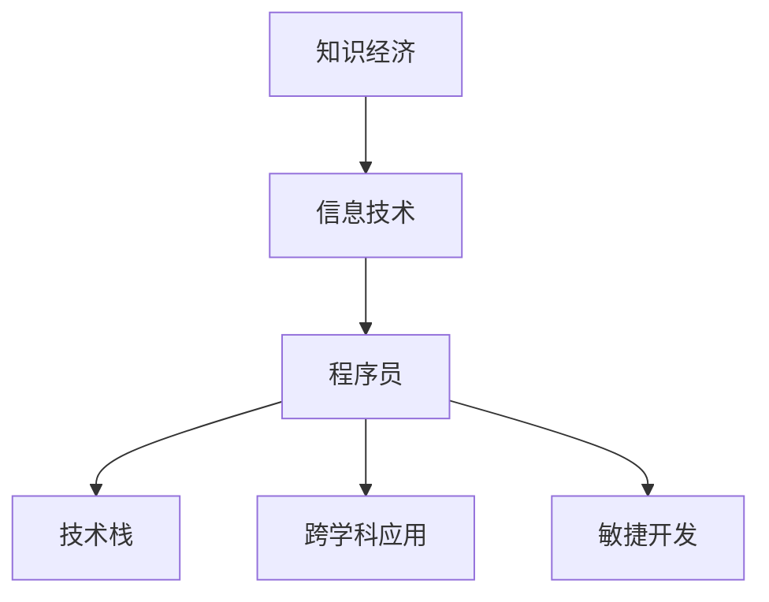

                 

## 1. 背景介绍

### 1.1 问题由来
在知识经济时代，信息技术的迅猛发展深刻改变了社会生产力和社会形态。程序员作为信息技术的核心承载者，面临着前所未有的发展机遇和挑战。面对快速变化的技术栈、不断涌现的新型应用场景、复杂多变的市场需求，程序员需要不断学习和适应，以保持自身竞争力。

### 1.2 问题核心关键点
核心问题在于：程序员如何应对知识经济时代的变化，不断更新自身技能，以适应新技术和新应用场景的要求。这涉及多个方面的考量，包括但不限于：

- **技术栈选择**：如何选择合适的技术栈，以最大化开发效率和应用性能。
- **学习路径规划**：如何构建系统的学习路径，使自己能够持续学习和提升。
- **跨学科应用**：如何跨越技术和业务之间的界限，实现技术的应用价值最大化。
- **团队协作与沟通**：如何在技术团队和跨职能团队中发挥作用，提升项目成功率。

### 1.3 问题研究意义
深入研究程序员在知识经济时代的发展趋势，对于推动信息技术在各个行业的普及应用、提升技术开发效率、培养符合新经济要求的科技人才具有重要意义。理解并适应这些变化，将有助于程序员在竞争激烈的市场环境中脱颖而出，实现职业发展的突破。

## 2. 核心概念与联系

### 2.1 核心概念概述

为更好地理解程序员在知识经济时代的发展趋势，本节将介绍几个密切相关的核心概念：

- **知识经济**：以知识生产、传播和应用为基础的经济形态，强调技术创新和知识产权的重要性。
- **信息技术**：使用计算机科学和电信技术处理、存储、传输和检索信息的技术体系。
- **程序员**：专门从事计算机程序设计、软件开发等工作，具备编程技能和问题解决能力的专家。
- **技术栈**：开发项目所需的技术工具、框架和语言的集合，通常包括前后端技术、数据库、中间件等。
- **跨学科应用**：将技术应用到非技术领域，如金融、医疗、教育等，实现技术价值的最大化。
- **敏捷开发**：一种迭代、增量、协作的软件开发方法，强调快速响应市场变化和客户需求。

这些核心概念之间的逻辑关系可以通过以下Mermaid流程图来展示：



这个流程图展示的核心概念之间的关系：

1. 知识经济以信息技术为基础，提供了技术发展的土壤。
2. 信息技术的发展推动了程序员职业的需求和演进。
3. 程序员通过技术栈选择和持续学习，参与信息技术的应用。
4. 跨学科应用展示了信息技术的多样化应用场景。
5. 敏捷开发方法提升了技术开发效率和市场响应速度。

## 3. 核心算法原理 & 具体操作步骤
### 3.1 算法原理概述

知识经济时代，程序员的发展趋势可以理解为通过不断学习和适应新技术，提升自身技能，进而提升项目效率和价值。这种趋势与人工智能、大数据、区块链等新技术的发展密切相关。其核心算法原理包括但不限于：

- **持续学习**：程序员需要不断学习新的编程语言、框架和工具，以适应新技术的发展。
- **跨学科知识**：将信息技术与其他学科知识结合，提升技术的应用价值。
- **敏捷开发**：通过迭代、增量的开发方式，快速响应市场和客户需求，提升项目成功率。
- **团队协作**：在团队中发挥作用，提升团队整体效能。

### 3.2 算法步骤详解

基于上述算法原理，程序员在知识经济时代的发展步骤可以总结为以下几个关键步骤：

**Step 1: 自我定位与规划**

1. 评估自身技能和知识水平，明确在技术栈、行业应用和团队协作中的定位。
2. 制定长期和短期的学习目标，规划具体的学习路径。

**Step 2: 技术栈选择与学习**

1. 根据项目需求和行业趋势，选择合适的前端、后端、数据库等技术栈。
2. 针对选定的技术栈，系统学习相关知识，掌握核心技术。
3. 通过项目实践，不断提升技术应用能力。

**Step 3: 跨学科知识应用**

1. 识别业务需求和技术能力之间的匹配点，将技术应用于非技术领域。
2. 通过项目实践，探索技术在特定业务场景中的最佳应用方式。

**Step 4: 敏捷开发实践**

1. 采用敏捷开发方法，实现快速迭代和增量交付。
2. 定期进行代码审查和团队复盘，持续改进开发流程和质量。

**Step 5: 团队协作与沟通**

1. 建立良好的沟通机制，确保项目需求和进展透明。
2. 提升团队协作效率，实现资源的最大化利用。

### 3.3 算法优缺点

持续学习、跨学科应用、敏捷开发和团队协作的算法具有以下优点：

- **提升效率**：通过不断学习和适应新技术，提升技术栈选择和应用能力。
- **增强价值**：通过跨学科应用，提升技术的社会和经济价值。
- **优化流程**：通过敏捷开发，提升开发效率和市场响应速度。
- **协同合作**：通过团队协作，提升团队整体效能和项目成功率。

但这些算法也存在一些局限性：

- **学习成本**：持续学习需要投入大量时间和精力，可能影响日常工作和生活。
- **技术切换**：频繁切换技术栈可能导致技能掌握不精，影响项目质量和稳定性。
- **跨领域挑战**：跨学科应用可能面临技术和业务理解的不足，影响实际应用效果。
- **沟通协调**：团队协作需要良好的沟通机制和协作文化，可能存在协调难度。

### 3.4 算法应用领域

持续学习、跨学科应用、敏捷开发和团队协作的算法在多个领域得到了广泛应用：

- **软件开发**：通过选择合适技术栈和持续学习，提升项目开发效率和质量。
- **数据分析**：利用数据分析工具和技术栈，提升数据处理和分析能力。
- **人工智能**：通过跨学科知识，将AI技术应用于实际问题，实现技术突破。
- **项目管理**：采用敏捷开发和团队协作方法，提升项目管理效率和成功率。

这些领域的应用展示了持续学习和跨学科应用的巨大潜力，推动了信息技术在各个行业的普及和创新。

## 4. 数学模型和公式 & 详细讲解 & 举例说明

### 4.1 数学模型构建

为了更好地理解程序员在知识经济时代的发展趋势，我们可以建立如下数学模型：

- 设 $X$ 为程序员的技术栈集合，$Y$ 为程序员在知识经济时代的发展路径。
- $X$ 和 $Y$ 之间的关系可以表示为 $Y = f(X)$，其中 $f$ 为映射函数。
- $f$ 函数可以分解为多个子函数，表示不同的学习路径、技术应用和团队协作方式。

### 4.2 公式推导过程

对于上述模型，我们可以进行以下推导：

1. 设定 $X = \{x_1, x_2, ..., x_n\}$，其中 $x_i$ 表示第 $i$ 项技术栈。
2. 设 $Y = \{y_1, y_2, ..., y_m\}$，其中 $y_j$ 表示第 $j$ 项发展路径。
3. 设 $f$ 函数为 $f(X) = Y$，其中 $f$ 可以表示为：
   $$
   f(X) = \bigoplus_{i=1}^n f_i(x_i)
   $$
   其中 $\bigoplus$ 表示函数和运算，$f_i$ 为第 $i$ 项技术栈对应的映射函数。
4. 设 $f_1$ 为技术栈选择函数，$f_2$ 为持续学习函数，$f_3$ 为跨学科应用函数，$f_4$ 为团队协作函数。

### 4.3 案例分析与讲解

假设某程序员 $C$ 希望在知识经济时代实现职业生涯发展，技术栈集合 $X = \{前端框架、后端语言、数据库系统、云计算平台\}$，发展路径 $Y = \{初级开发者、中级开发者、高级开发者、架构师\}$。

**Step 1: 技术栈选择**

$C$ 可以通过 $f_1$ 函数选择技术栈。例如，$C$ 选择前端框架 $x_1 = React$，后端语言 $x_2 = Python$，数据库系统 $x_3 = MySQL$，云计算平台 $x_4 = AWS$。

**Step 2: 持续学习**

$C$ 通过 $f_2$ 函数不断学习和提升技术能力。例如，$C$ 学习并掌握了新框架 $x_1' = Vue$，新语言 $x_2' = JavaScript$，新数据库系统 $x_3' = PostgreSQL$，新云计算平台 $x_4' = Azure$。

**Step 3: 跨学科应用**

$C$ 通过 $f_3$ 函数将技术应用于非技术领域。例如，$C$ 将技术应用于金融领域，构建了基于区块链技术的智能合约系统。

**Step 4: 团队协作**

$C$ 通过 $f_4$ 函数提升团队协作效率。例如，$C$ 参与了一个大型软件开发项目，担任前端负责人，与后端、测试团队紧密协作，确保项目按时交付。

## 5. 项目实践：代码实例和详细解释说明

### 5.1 开发环境搭建

在进行项目实践前，我们需要准备好开发环境。以下是使用Python进行Django开发的开发环境配置流程：

1. 安装Anaconda：从官网下载并安装Anaconda，用于创建独立的Python环境。

2. 创建并激活虚拟环境：
```bash
conda create -n django-env python=3.8 
conda activate django-env
```

3. 安装Django：
```bash
pip install Django==3.2
```

4. 安装开发工具：
```bash
pip install pipenv virtualenv wheel
```

完成上述步骤后，即可在`django-env`环境中开始项目开发。

### 5.2 源代码详细实现

以下是使用Python和Django开发一个简单的Web应用的示例代码：

**models.py**

```python
from django.db import models

class Blog(models.Model):
    title = models.CharField(max_length=200)
    content = models.TextField()
    pub_date = models.DateTimeField('date published', auto_now_add=True)

    def __str__(self):
        return self.title
```

**views.py**

```python
from django.shortcuts import render
from .models import Blog

def blog_list(request):
    blogs = Blog.objects.order_by('-pub_date')
    return render(request, 'blog/index.html', {'blogs': blogs})
```

**urls.py**

```python
from django.urls import path
from . import views

urlpatterns = [
    path('', views.blog_list, name='blog_list'),
]
```

**templates/index.html**

```html



  <h1>My Blog</h1>
  <ul>
    
      <li><a href="">{{ blog.title }}</a></li>
    
  </ul>

```

### 5.3 代码解读与分析

让我们再详细解读一下关键代码的实现细节：

**models.py**

- `models.py` 定义了Web应用的数据模型，包括博客标题、内容和发布时间等字段。

**views.py**

- `views.py` 定义了视图函数，用于处理Web请求并返回响应。在这个例子中，`blog_list` 函数查询所有博客，并返回一个HTML页面。

**urls.py**

- `urls.py` 定义了路由规则，将URL请求映射到相应的视图函数。

**templates/index.html**

- `templates/index.html` 是一个HTML模板，用于渲染博客列表页面。

### 5.4 运行结果展示

完成上述代码后，可以通过以下步骤运行Web应用：

1. 运行开发服务器：
```bash
python manage.py runserver
```

2. 访问Web应用：在浏览器中访问 `http://127.0.0.1:8000/`，即可看到博客列表页面。

## 6. 实际应用场景

### 6.1 软件开发

在软件开发中，持续学习、跨学科应用、敏捷开发和团队协作的应用非常广泛。通过不断学习和适应新技术，提升自身技能，程序员可以更好地应对项目需求的变化，提升项目开发效率和质量。

### 6.2 数据分析

数据分析领域也离不开程序员的贡献。通过学习和应用数据分析工具和技术栈，如Python、R、SQL、Tableau等，程序员可以帮助企业挖掘数据价值，提升决策支持能力。

### 6.3 人工智能

人工智能领域对程序员的需求量非常大。通过学习机器学习、深度学习、自然语言处理等技术，程序员可以将AI技术应用于实际问题，实现技术突破。

### 6.4 项目管理

项目管理领域也需要程序员的参与。通过敏捷开发和团队协作方法，程序员可以提升项目管理和协调效率，确保项目按时交付。

## 7. 工具和资源推荐

### 7.1 学习资源推荐

为了帮助程序员系统掌握知识经济时代的技能，这里推荐一些优质的学习资源：

1. **《代码大全》**：由Steve McConnell撰写，全面介绍了软件开发的规范和最佳实践，是程序员的必读书籍。

2. **《设计模式》**：由Erich Gamma等撰写，详细介绍了23种常用的设计模式，帮助程序员提升软件设计和架构能力。

3. **Coursera**：提供丰富的在线课程，涵盖计算机科学、软件工程、人工智能等多个领域，适合程序员系统学习。

4. **GitHub**：全球最大的代码托管平台，程序员可以通过GitHub学习和分享代码，提升技术水平。

5. **Stack Overflow**：程序员交流和求助的社区平台，提供了大量的技术问题和解决方案。

通过对这些资源的学习实践，相信你一定能够系统掌握知识经济时代程序员的发展趋势，并用于解决实际的开发问题。

### 7.2 开发工具推荐

高效的开发离不开优秀的工具支持。以下是几款用于软件开发和数据分析的常用工具：

1. **Visual Studio Code**：轻量级、高度可定制的代码编辑器，支持多种编程语言和插件扩展。

2. **Git**：版本控制系统，帮助程序员管理代码变更，提升团队协作效率。

3. **Jupyter Notebook**：交互式的数据分析工具，支持Python、R等多种编程语言。

4. **TensorFlow**：由Google主导开发的深度学习框架，支持大规模深度学习模型的开发和训练。

5. **Tableau**：数据可视化工具，帮助程序员快速分析和展示数据。

6. **Docker**：容器化技术，帮助程序员在各种环境中一致地运行应用。

合理利用这些工具，可以显著提升软件开发和数据分析的效率，加快创新迭代的步伐。

### 7.3 相关论文推荐

知识经济时代对程序员的发展研究源于学界的持续研究。以下是几篇奠基性的相关论文，推荐阅读：

1. **《程序员知识管理研究》**：提出了程序员知识管理和持续学习的框架，强调了知识管理的必要性和方法。

2. **《敏捷软件开发实践》**：介绍了敏捷开发的核心思想和实践方法，帮助程序员提升项目管理效率。

3. **《跨学科技术应用研究》**：探讨了信息技术在非技术领域的应用，强调了跨学科技术整合的价值。

4. **《深度学习与大数据结合研究》**：介绍了深度学习和大数据结合的方法，提升了数据分析和应用的能力。

5. **《软件工程师的角色转变》**：探讨了知识经济时代软件工程师的角色转变，强调了学习新技能的重要性。

这些论文代表了大语言模型微调技术的发展脉络。通过学习这些前沿成果，可以帮助研究者把握学科前进方向，激发更多的创新灵感。

## 8. 总结：未来发展趋势与挑战

### 8.1 总结

本文对程序员在知识经济时代的发展趋势进行了全面系统的介绍。首先阐述了知识经济时代对程序员的需求和挑战，明确了持续学习、跨学科应用、敏捷开发和团队协作的重要性。其次，从原理到实践，详细讲解了这些技术的核心算法原理和具体操作步骤，给出了项目实践的完整代码实现。同时，本文还广泛探讨了这些技术在软件开发、数据分析、人工智能等领域的实际应用，展示了程序员在知识经济时代的广阔发展空间。

通过本文的系统梳理，可以看到，知识经济时代对程序员提出了更高的要求，需要不断学习和适应新技术，提升自身技能。同时，也展示了程序员在技术开发、数据分析、人工智能等领域的广阔应用前景。未来，伴随知识经济和信息技术的发展，程序员在各个行业的价值将得到进一步提升，成为推动技术创新和产业发展的重要力量。

### 8.2 未来发展趋势

展望未来，程序员在知识经济时代的发展趋势将呈现以下几个方向：

1. **自动化与智能化**：随着AI技术的不断进步，程序员可以更多地利用自动化和智能化工具，提升开发效率和项目质量。

2. **跨领域融合**：信息技术与其他领域的融合将带来更多的应用场景，程序员需要掌握跨领域知识，提升技术应用能力。

3. **远程协作**：远程工作模式的普及将对程序员的团队协作能力提出新的要求，需要提升沟通和协作效率。

4. **持续学习与自我更新**：知识经济时代的信息技术更新速度极快，程序员需要持续学习和自我更新，以保持竞争力。

5. **数据驱动决策**：数据分析和数据科学在各个领域的普及，将促使程序员更多地参与数据驱动的决策过程。

6. **安全性与伦理**：随着技术应用的广泛，程序员需要更多地关注安全性与伦理问题，确保技术应用的合法性和安全性。

### 8.3 面临的挑战

尽管知识经济时代对程序员的发展带来了诸多机遇，但也面临诸多挑战：

1. **技术更新速度快**：信息技术更新速度快，需要程序员持续学习和适应新技术。

2. **跨领域应用难度大**：信息技术与其他领域的融合，需要程序员具备跨领域知识。

3. **远程协作效率低**：远程工作模式的普及，可能影响团队协作效率。

4. **安全性与伦理风险**：技术应用涉及大量数据和隐私问题，需要程序员具备安全性与伦理意识。

### 8.4 研究展望

未来，对程序员在知识经济时代的发展研究需要从以下几个方面进行探索：

1. **技术栈选择与学习路径优化**：如何根据个人和项目需求，选择合适技术栈和学习路径，提升学习效率。

2. **跨学科知识整合与创新**：如何通过跨学科知识的整合，实现技术在更多领域的创新应用。

3. **敏捷开发与项目管理**：如何结合敏捷开发和项目管理方法，提升项目效率和成功率。

4. **远程协作与沟通**：如何提升远程协作的效率和效果，实现团队的协同工作。

5. **安全性与伦理保障**：如何在技术应用中确保安全性与伦理，提升技术的社会价值。

6. **持续学习与自我更新**：如何建立持续学习机制，提升程序员的自我更新能力。

这些研究方向将帮助程序员更好地应对知识经济时代的挑战，实现自身发展和行业应用的双重突破。

## 9. 附录：常见问题与解答

**Q1：程序员如何选择合适的技术栈？**

A: 选择合适的技术栈需要考虑多个因素，包括项目需求、团队技能、技术栈成熟度等。通常建议选择主流、成熟的技术栈，并在实践中不断优化和提升。

**Q2：程序员如何保持持续学习的动力？**

A: 持续学习需要明确学习目标，制定详细的学习计划，并利用技术社区、学习平台等资源，持续获取新知识。同时，可以通过参与项目实践，将学习与工作相结合，提升学习效果。

**Q3：跨学科应用需要注意哪些问题？**

A: 跨学科应用需要克服技术和业务理解的不足，建议通过项目实践，不断积累经验，提升跨学科整合能力。同时，需要注意数据安全和隐私问题，确保技术应用的合法性和安全性。

**Q4：远程协作有哪些技巧？**

A: 远程协作需要注意沟通和协作效率。建议建立明确的项目沟通机制，定期进行进展汇报和团队复盘，提升协作效率。同时，可以利用协作工具，如Slack、Trello等，提升协作效果。

**Q5：如何提升数据分析能力？**

A: 提升数据分析能力需要系统学习相关技术和工具，如Python、R、SQL、Tableau等。建议通过项目实践，不断积累经验，提升数据分析和应用能力。

通过本文的系统梳理，可以看到，知识经济时代对程序员的发展提出了更高的要求，需要不断学习和适应新技术，提升自身技能。未来，伴随知识经济和信息技术的发展，程序员在各个行业的价值将得到进一步提升，成为推动技术创新和产业发展的重要力量。

---

作者：禅与计算机程序设计艺术 / Zen and the Art of Computer Programming

