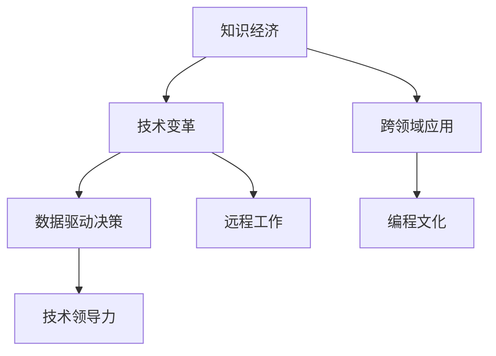

                 

# 程序员在知识经济时代的发展趋势与机遇

> 关键词：程序员,知识经济,技术变革,人工智能,软件开发,职业发展,编程文化,技能提升,技术领导力

## 1. 背景介绍

### 1.1 问题由来

随着全球经济和社会环境的深刻变革，知识经济时代悄然来临。这一时代，以知识为核心的经济发展模式正在取代传统的物质经济模式，技术创新和知识积累成为国家竞争力的重要基础。在这一背景下，程序员这一技术工种面临着前所未有的发展机遇，但同时也遭遇着全新的挑战。

### 1.2 问题核心关键点

- **技术变革速度加快**：知识经济时代，技术更新迭代速度显著提升，要求程序员不断学习新技术，紧跟行业发展前沿。
- **跨领域需求增加**：随着各行业的数字化转型加速，程序员需要具备跨领域的知识背景，能够将技术应用于不同行业场景中。
- **数据驱动决策**：大数据、人工智能等新兴技术的应用，要求程序员具备数据驱动思维，能够从数据中提取有价值的信息，支持决策。
- **远程工作常态化**：疫情加速了远程工作模式的普及，对程序员的自主管理和远程协作能力提出了更高要求。
- **编程文化和企业文化**：知识经济时代，企业文化更加注重创新和灵活性，程序员需积极融入企业文化，发挥创造力。

### 1.3 问题研究意义

理解程序员在知识经济时代的角色和挑战，对于提升程序员的职业发展，促进技术创新和产业升级，具有重要意义：

- **推动技术创新**：了解知识经济时代的技术发展趋势，有助于程序员更好地掌握新技能，推动技术进步。
- **优化人才培养**：基于对知识经济时代需求的分析，有助于教育机构和培训机构调整课程设置，培养符合时代需求的程序员。
- **提高企业竞争力**：掌握知识经济时代的人才发展趋势，有助于企业吸引和留住优秀人才，提升竞争力。
- **促进社会进步**：程序员是推动技术进步和社会进步的关键力量，了解其发展方向和机遇，有助于推动全社会的技术进步和文化发展。

## 2. 核心概念与联系

### 2.1 核心概念概述

为更好地理解程序员在知识经济时代的发展趋势与机遇，本节将介绍几个密切相关的核心概念：

- **知识经济**：以知识为核心，通过技术创新和知识应用驱动经济发展的新经济形态。
- **技术变革**：指技术在产品、服务和商业模式方面的创新和变化。
- **跨领域应用**：指技术在不同领域（如医疗、教育、金融等）的应用和融合。
- **数据驱动决策**：利用数据科学和人工智能技术，辅助决策过程，提升决策效率和质量。
- **远程工作**：通过互联网和通信技术，实现员工在不同地理位置的协作和办公。
- **编程文化**：反映技术公司和团队在开发过程、项目管理、团队协作等方面的文化价值观。
- **技术领导力**：指在技术领域内能够引领团队、推动创新、解决复杂问题的能力。

这些核心概念之间的逻辑关系可以通过以下Mermaid流程图来展示：



这个流程图展示的核心概念及其之间的关系：

1. 知识经济是技术变革、跨领域应用、数据驱动决策、远程工作和编程文化的背景和驱动因素。
2. 技术变革推动了跨领域应用和数据驱动决策的发展。
3. 远程工作是技术变革和数据驱动决策的产物，同时对编程文化提出了新要求。
4. 编程文化和技术领导力是技术变革和远程工作得以有效实施的基础。

## 3. 核心算法原理 & 具体操作步骤
### 3.1 算法原理概述

程序员在知识经济时代的发展，核心在于其对新技术、新方法和新工具的掌握和应用。这一过程可以分为技术学习、技能提升、知识应用和职业发展四个阶段。

**技术学习**：指程序员通过教育培训、自学、实践等方式，掌握新的技术知识。

**技能提升**：指程序员在掌握技术知识的基础上，提升其在特定领域（如软件开发、数据分析、人工智能等）的实践技能。

**知识应用**：指程序员将所学技术和技能应用于实际项目和业务场景中，解决实际问题。

**职业发展**：指程序员通过不断的学习和实践，逐步提升自身能力，在职业生涯中实现自我价值和社会贡献。

### 3.2 算法步骤详解

基于知识经济时代程序员的发展路径，本文将详细讲解其核心算法原理和具体操作步骤。

**Step 1: 技术学习阶段**

1. **选择学习资源**：根据个人职业目标和兴趣，选择适合的在线课程、书籍、文档、论坛等学习资源。
2. **制定学习计划**：根据学习资源的特点和个人的学习节奏，制定详细的学习计划，包括每日/每周学习内容和学习时间。
3. **实践应用**：在学习过程中，通过实际项目或开源社区的贡献，进行技术实践和应用，巩固所学知识。

**Step 2: 技能提升阶段**

1. **识别技能缺口**：根据职业目标和当前水平，识别自身技能的不足之处。
2. **制定技能提升计划**：针对技能缺口，制定详细的技能提升计划，包括参加培训、项目实践、代码贡献等。
3. **持续学习**：通过参加线上课程、阅读最新论文、参与技术交流会等方式，持续学习和提升。

**Step 3: 知识应用阶段**

1. **选择合适的项目**：根据自身的技能水平和职业目标，选择合适的项目进行实践。
2. **解决问题**：在项目中，识别问题并使用所学技术和技能进行解决，积累项目经验。
3. **总结和分享**：完成项目后，总结项目经验，并将成果分享至社区或博客，提升影响力。

**Step 4: 职业发展阶段**

1. **明确职业目标**：根据个人兴趣和市场需求，明确职业发展目标。
2. **获取认证**：通过参与认证考试或项目评估，获得行业认可的证书和资质。
3. **网络构建**：通过参加行业会议、加入技术社区、建立个人品牌等方式，建立广泛的人脉网络。
4. **职业转型**：根据职业发展目标，适时进行职业转型，向更高职位或不同领域发展。

### 3.3 算法优缺点

知识经济时代的程序员发展方法具有以下优点：

- **适应性强**：通过不断学习和实践，程序员能够适应技术变革和市场需求的变化。
- **自主学习**：技术学习和技能提升阶段更多依赖自我驱动，培养了独立解决问题的能力。
- **灵活应用**：知识应用阶段强调将所学知识应用于实际项目中，提升了技术实践能力。
- **职业发展明确**：职业发展阶段通过目标设定和持续努力，促进了职业成长和进步。

但这一方法也存在一定的局限性：

- **资源投入大**：技术学习和技能提升需要大量时间和金钱投入，对部分人来说可能难以承担。
- **效果依赖持续性**：技能提升和职业发展是一个持续过程，中断或懈怠将影响效果。
- **知识更新快**：技术更新速度加快，要求程序员不断学习，避免技能过时。
- **自我管理难度大**：自主学习过程中，需要较强的自我管理和自律能力。

### 3.4 算法应用领域

知识经济时代程序员的发展方法，广泛适用于各种技术岗位和行业领域，包括但不限于：

- **软件开发**：掌握编程语言、框架、设计模式等技术，解决软件开发中的实际问题。
- **数据分析**：学习数据科学、机器学习、大数据技术，进行数据挖掘、分析和可视化。
- **人工智能**：学习深度学习、自然语言处理、计算机视觉等技术，构建智能应用系统。
- **云计算**：学习云平台、容器技术、微服务架构等，构建高效、可扩展的云应用。
- **网络安全**：学习网络安全、加密技术、漏洞分析等，保障信息系统的安全性。
- **移动开发**：学习移动开发框架、前端技术、用户体验设计等，开发高质量移动应用。

## 4. 数学模型和公式 & 详细讲解  
### 4.1 数学模型构建

为了更好地理解程序员在知识经济时代的技能提升过程，本节将使用数学语言对技术学习和技能提升的过程进行更加严格的刻画。

假设程序员具备初始技能水平 $S_0$，通过学习资源 $R$ 和技能提升计划 $P$，学习时间 $T$ 后，技能提升至 $S_T$。其中 $R$ 和 $P$ 为技能提升过程中的变量，$T$ 为学习时间。

定义技能提升率为 $k$，则有：

$$
S_T = S_0 + k \cdot T
$$

在实践中，技能提升率 $k$ 通常依赖于学习资源的有效性和学习计划的合理性，可以通过实验数据估计和优化。

### 4.2 公式推导过程

假设技能提升率 $k$ 为常数，则有：

$$
S_T = S_0 + k \cdot T
$$

其中 $S_0$ 为初始技能水平，$k$ 为技能提升率，$T$ 为学习时间。

若将学习时间 $T$ 离散化，则技能提升率 $k$ 在每个时间单位内保持不变，可表示为：

$$
S_{t+1} = S_t + k
$$

其中 $S_t$ 为 $t$ 时刻的技能水平，$k$ 为每个时间单位内的技能提升量。

### 4.3 案例分析与讲解

假设某程序员初始技能水平为 $S_0=50$，每天学习 $k=0.1$，则经过 $T=100$ 天的学习，其技能水平 $S_T$ 为：

$$
S_T = 50 + 0.1 \cdot 100 = 60
$$

这意味着通过持续学习，该程序员的技能提升了 $10$ 个单位。

## 5. 项目实践：代码实例和详细解释说明
### 5.1 开发环境搭建

在进行程序员技能提升项目实践前，我们需要准备好开发环境。以下是使用Python进行项目开发的开发环境配置流程：

1. **安装Anaconda**：从官网下载并安装Anaconda，用于创建独立的Python环境。
2. **创建并激活虚拟环境**：
```bash
conda create -n pyproject python=3.8 
conda activate pyproject
```
3. **安装相关包**：
```bash
pip install pandas numpy matplotlib scikit-learn jupyter notebook
```

完成上述步骤后，即可在`pyproject`环境中开始项目开发。

### 5.2 源代码详细实现

以下是一个简单的Python项目，用于模拟程序员技能提升的过程：

```python
import numpy as np
import matplotlib.pyplot as plt

# 初始技能水平
S_0 = 50
# 技能提升率
k = 0.1
# 学习时间
T = 100

# 技能提升过程
S = S_0 + k * np.arange(T+1)

# 绘制技能提升曲线
plt.plot(range(T+1), S, marker='o')
plt.xlabel('学习时间')
plt.ylabel('技能水平')
plt.title('程序员技能提升过程')
plt.show()
```

### 5.3 代码解读与分析

让我们再详细解读一下关键代码的实现细节：

**初始化变量**：
- `S_0`：初始技能水平，设定为50。
- `k`：技能提升率，设定为0.1。
- `T`：学习时间，设定为100天。

**技能提升过程**：
- `S = S_0 + k * np.arange(T+1)`：使用NumPy库的arange函数生成从0到T（包含T）的等差数列，表示学习过程中的每一天，并计算每一天的技能水平。

**绘制技能提升曲线**：
- `plt.plot(range(T+1), S, marker='o')`：使用Matplotlib库绘制技能提升过程的折线图，并添加标记点。
- `plt.xlabel('学习时间')`：设置x轴标签为学习时间。
- `plt.ylabel('技能水平')`：设置y轴标签为技能水平。
- `plt.title('程序员技能提升过程')`：设置图表标题。
- `plt.show()`：显示图表。

可以看到，通过Python的简单代码，我们成功地模拟了程序员技能提升的过程，并可视化了技能提升曲线。这个项目虽然简单，但展示了编程语言在技能提升实践中的应用价值。

## 6. 实际应用场景
### 6.1 智能系统开发

知识经济时代，智能系统开发成为了程序员重要的应用场景之一。智能系统包括但不限于智能推荐、智能客服、智能健康、智能交通等。程序员通过掌握数据科学、机器学习和深度学习等技术，可以开发出具有高度智能化和自适应能力的系统。

在智能推荐系统开发中，程序员需要掌握推荐算法、用户行为分析、数据分析等技术，利用数据科学方法构建用户画像，通过机器学习算法进行推荐模型训练，实现个性化推荐服务。

在智能客服开发中，程序员需要掌握自然语言处理、语音识别、对话系统等技术，构建具备自然语言理解和生成能力的智能客服系统，为用户提供24小时不间断的咨询服务。

### 6.2 企业信息化建设

企业信息化建设是程序员在知识经济时代的另一个重要应用场景。通过信息化建设，企业可以实现业务流程自动化、数据管理优化、决策支持等，提升企业运营效率和竞争力。

在企业信息化建设中，程序员需要掌握企业级应用开发、数据管理、系统集成等技术，构建企业信息化平台，实现数据共享、业务协同等功能。例如，通过开发企业级ERP系统、CRM系统、OA系统等，帮助企业提高管理效率和市场响应速度。

### 6.3 科学研究和技术创新

知识经济时代，科学研究和技术创新也离不开程序员的贡献。通过编程和数据科学方法，程序员可以辅助科学家进行数据分析、实验设计、结果验证等，推动科学研究和技术进步。

在科学研究中，程序员需要掌握数据处理、机器学习、科学计算等技术，利用编程工具进行数据分析和模型训练，辅助科学家进行实验设计和结果验证。例如，通过编程实现复杂的科学实验仿真，进行数据分析和可视化，帮助科学家发现新的科学规律。

## 7. 工具和资源推荐
### 7.1 学习资源推荐

为了帮助程序员系统掌握知识经济时代的发展趋势与机遇，这里推荐一些优质的学习资源：

1. **《编程之美》系列书籍**：由国内外知名程序员撰写，介绍了编程思想、算法设计、系统架构等核心知识。
2. **《机器学习实战》系列书籍**：由Google等公司工程师撰写，介绍了机器学习技术在实际项目中的应用。
3. **《数据科学导论》系列课程**：Coursera等平台提供的免费课程，涵盖了数据科学和机器学习的基础知识和实践技能。
4. **Kaggle平台**：数据科学和机器学习竞赛平台，提供大量的数据集和开源代码，帮助程序员提升实践技能。
5. **Github**：全球最大的开源代码托管平台，提供丰富的项目和技术资源，促进程序员之间的交流和合作。

通过这些资源的学习实践，相信程序员能够更好地掌握知识经济时代的技能需求，提升自身竞争力。

### 7.2 开发工具推荐

高效的开发离不开优秀的工具支持。以下是几款用于程序员技能提升和项目开发的常用工具：

1. **Jupyter Notebook**：用于数据科学和机器学习项目的交互式编程和数据可视化，支持Python、R等多种语言。
2. **PyCharm**：功能强大的Python IDE，提供代码高亮、自动补全、调试等功能，提升开发效率。
3. **Visual Studio Code**：轻量级的代码编辑器，支持多种编程语言和扩展，灵活性强。
4. **Git**：版本控制系统，支持代码协作、版本管理、分支合并等功能，是开发团队必备工具。
5. **Docker**：容器化技术，实现应用和依赖包的打包和分发，支持跨平台部署和运行。
6. **AWS、Google Cloud、Azure**：云平台服务，提供计算、存储、网络等基础设施，支持大规模应用部署和运维。

合理利用这些工具，可以显著提升程序员的技能提升和项目开发效率，加快创新迭代的步伐。

### 7.3 相关论文推荐

知识经济时代的程序员发展，得益于学界的持续研究。以下是几篇奠基性的相关论文，推荐阅读：

1. **《大规模在线学习与人工智能的发展》**：探讨了在线学习和大规模人工智能技术的发展趋势，指出了其在知识经济时代的重要作用。
2. **《知识经济时代的企业信息化建设》**：研究了企业信息化建设对知识经济发展的推动作用，提出了基于编程和数据科学的企业信息化解决方案。
3. **《智能推荐系统的发展与挑战》**：介绍了智能推荐系统的基本原理和技术应用，分析了其面临的挑战和未来发展方向。
4. **《科学研究与编程技术的融合》**：探讨了编程技术和数据科学在科学研究中的应用，展示了其在推动科研创新中的作用。
5. **《人工智能与程序员的未来》**：展望了人工智能技术对程序员职业发展的深远影响，提出了应对挑战和抓住机遇的策略。

这些论文代表了大语言模型微调技术的发展脉络。通过学习这些前沿成果，可以帮助程序员把握学科前进方向，激发更多的创新灵感。

## 8. 总结：未来发展趋势与挑战
### 8.1 总结

本文对知识经济时代程序员的发展趋势与机遇进行了全面系统的介绍。首先阐述了知识经济时代的技术变革和跨领域应用对程序员的挑战和机遇，明确了程序员在知识经济时代的重要角色和价值。其次，从技术学习、技能提升、知识应用和职业发展四个阶段，详细讲解了程序员在知识经济时代的发展路径和具体操作步骤。同时，本文还探讨了程序员在智能系统开发、企业信息化建设、科学研究等领域的应用前景，展示了程序员在知识经济时代的广阔职业发展空间。最后，本文精选了知识经济时代程序员的学习资源、开发工具和相关论文，力求为读者提供全方位的技术指引。

通过本文的系统梳理，可以看到，知识经济时代程序员的发展方向和机遇，受到技术变革和市场需求的双重驱动，充满了挑战和机遇。程序员需要不断学习新知识，提升新技能，才能在知识经济时代中保持竞争力，实现自我价值。

### 8.2 未来发展趋势

展望未来，知识经济时代的程序员发展趋势将呈现以下几个方向：

1. **数据科学和人工智能的普及**：随着数据科学和人工智能技术的广泛应用，程序员需要掌握这些技术，提升数据分析和模型构建能力。
2. **跨领域应用需求增加**：各行业数字化转型加速，程序员需要具备跨领域应用能力，能够将技术应用于不同行业场景中。
3. **远程工作成为常态**：疫情加速了远程工作模式的普及，程序员需要具备远程协作和自我管理能力。
4. **编程文化和团队协作加强**：知识经济时代，企业文化更加注重创新和灵活性，程序员需积极融入企业文化，发挥创造力。
5. **技术领导力提升**：企业对技术领导力的需求增加，程序员需要通过持续学习和实践，提升技术领导力，引领团队和项目。
6. **技能更新速度加快**：技术更新速度加快，程序员需要不断学习和实践，避免技能过时。

这些趋势凸显了程序员在知识经济时代的发展前景，为程序员提供了明确的职业发展方向和目标。

### 8.3 面临的挑战

尽管知识经济时代为程序员提供了诸多发展机遇，但在迈向更加智能化、普适化应用的过程中，程序员仍面临以下挑战：

1. **技术更新速度快**：新技术和新工具层出不穷，要求程序员不断学习，避免技能过时。
2. **跨领域应用难度大**：不同领域的业务需求和技术背景不同，程序员需要具备跨领域的知识和技能。
3. **远程协作效率低**：远程工作模式对团队协作和沟通提出了更高要求，程序员需要具备较强的自我管理和沟通能力。
4. **技术领导力缺乏**：具备技术领导力的程序员数量有限，如何培养和提升技术领导力，是一个亟待解决的问题。
5. **编程文化和团队合作**：不同的编程文化和团队合作方式，要求程序员具备较强的适应能力和包容性。

### 8.4 研究展望

面对知识经济时代程序员面临的挑战，未来的研究需要在以下几个方面寻求新的突破：

1. **技术学习资源优化**：开发更多优质的在线课程、书籍和文档，帮助程序员更高效地掌握新知识。
2. **跨领域应用框架**：开发跨领域应用框架和工具，降低程序员在不同领域间迁移技术的难度。
3. **远程协作工具改进**：开发更高效的远程协作工具，提升团队协作效率和沟通效果。
4. **技术领导力培养**：建立技术领导力培养体系，帮助程序员提升领导力和团队管理能力。
5. **编程文化和团队合作**：推广开放、包容、创新的编程文化和团队合作方式，营造良好的工作氛围。

这些研究方向的探索，将有助于知识经济时代程序员的发展和成长，推动技术创新和产业升级。

## 9. 附录：常见问题与解答

**Q1：程序员在知识经济时代如何提升技能？**

A: 程序员在知识经济时代提升技能的路径可以归纳为四个阶段：技术学习、技能提升、知识应用和职业发展。首先，通过选择适合的在线课程、书籍、文档、论坛等学习资源，制定详细的学习计划，进行技术学习。其次，识别技能缺口，制定详细的技能提升计划，通过参加培训、项目实践、代码贡献等方式进行技能提升。然后，选择合适的项目进行实践，利用所学技术和技能解决问题，积累项目经验。最后，明确职业目标，获取认证，建立人脉网络，适时进行职业转型。

**Q2：知识经济时代程序员如何保持学习动力？**

A: 知识经济时代，技术更新速度加快，对程序员的学习动力提出了更高要求。可以通过以下几个方法保持学习动力：
1. 设置明确的职业目标和学习计划，避免盲目学习。
2. 选择合适的学习资源，提升学习效率。
3. 通过项目实践和代码贡献，将学习成果应用到实际项目中，增强成就感。
4. 加入技术社区和开源项目，与同行交流学习经验。
5. 定期回顾和总结学习成果，提升学习效果。

**Q3：远程工作对程序员的技能和心理素质提出了哪些新要求？**

A: 远程工作对程序员的技能和心理素质提出了以下新要求：
1. 自我管理和自律能力：远程工作需要较强的自我管理和自律能力，保持高效的工作状态。
2. 沟通和协作能力：远程工作模式下，需要借助工具进行沟通和协作，提升沟通和协作能力。
3. 时间管理能力：远程工作需要自主安排工作时间和任务优先级，提升时间管理能力。
4. 心理素质：远程工作容易导致孤独感和压力感，需要具备较强的心理素质和自我调节能力。

**Q4：知识经济时代程序员如何构建技术领导力？**

A: 知识经济时代，程序员可以通过以下几个方法构建技术领导力：
1. 持续学习和实践，提升技术水平和实践能力。
2. 积极参与开源项目和社区活动，建立广泛的人脉网络。
3. 担任技术团队的领导角色，带领团队完成复杂项目。
4. 提出技术解决方案，推动团队技术创新和优化。
5. 培养技术团队成员，提升整体技术实力。

**Q5：知识经济时代程序员如何平衡工作与生活？**

A: 知识经济时代，程序员面临更高的工作压力和竞争压力，平衡工作与生活显得尤为重要。可以通过以下几个方法实现平衡：
1. 制定合理的工作计划和休息时间，避免过度劳累。
2. 注重身体健康，合理饮食、运动和休息。
3. 培养兴趣爱好，丰富业余生活。
4. 与家人和朋友保持良好关系，获得情感支持。
5. 调整心态，保持积极乐观的生活态度。

---

作者：禅与计算机程序设计艺术 / Zen and the Art of Computer Programming

