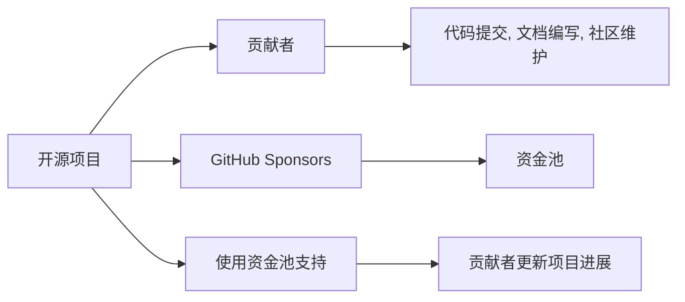

                 

## 1. 背景介绍

在当今开源社区蓬勃发展的时代，许多程序员通过开源项目积累了丰富的经验和资源。然而，开源项目和开发者面临的一个共同挑战是如何获得持续的经济支持，以维持项目的长期健康发展。在这一背景下，GitHub Sponsors应运而生，为程序员提供了一种创新的资金获取方式。GitHub Sponsors允许开源项目的支持者通过捐赠，为开发者提供经济保障，进而提升项目的质量和可持续性。本文将深入探讨GitHub Sponsors的核心概念、工作原理、具体操作步骤，并结合实际案例，帮助程序员更好地利用这一工具，提升开源项目的吸引力。

## 2. 核心概念与联系

### 2.1 核心概念概述

GitHub Sponsors是一种基于GitHub的开源资金获取机制，允许开源项目的贡献者通过小额或大额捐赠，为项目提供资金支持。GitHub Sponsors通过如下几个关键概念，形成了一个可持续的开源资金生态系统：

- **开源项目**：在GitHub上托管的软件项目，由社区开发者共同维护。
- **贡献者**：参与开源项目的开发者、测试者、文档编写者等。
- **支持者**：通过GitHub Sponsors为开源项目提供资金支持的个人或组织。
- **资金池**：GitHub Sponsors提供的资金池，用于支持开源项目的各种开销，如开发、测试、社区维护等。

通过这一机制，开源项目的贡献者和支持者得以建立一种互惠互利的关系，支持者通过捐赠获得项目的进展更新和开发者社区的认可，而开发者则得到了持续的经济支持，确保项目的稳定发展。

### 2.2 核心概念原理和架构的 Mermaid 流程图



在上述流程图中，开源项目(A)通过GitHub Sponsors(D)提供的资金池(E)，得到了持续的经济支持。贡献者(C)通过提交代码、编写文档、维护社区等方式，推动项目的发展，并定期向支持者(G)汇报项目进展。支持者(F)则通过资金池(E)获得项目发展的最新信息，并根据项目的最新状态进行资金捐赠。

## 3. 核心算法原理 & 具体操作步骤

### 3.1 算法原理概述

GitHub Sponsors的运作机制并不涉及复杂的算法，其核心原理基于以下三个步骤：

1. **资金提交**：支持者通过GitHub Sponsors向项目指定的资金账户捐赠资金。
2. **资金分配**：项目维护者定期使用资金池中的资金，用于项目开发、测试、社区维护等开销。
3. **进展反馈**：项目维护者向支持者提供项目的最新进展，如代码更新、功能改进等。

这一过程通过GitHub的系统和平台支持，形成了稳定的资金流和信息流，确保了开源项目的可持续性。

### 3.2 算法步骤详解

GitHub Sponsors的具体操作步骤如下：

1. **创建GitHub Sponsors账户**：开发者需先在GitHub上创建Sponsors账户，并将其与自己的GitHub账户绑定。
2. **设置资金账户**：在GitHub Sponsors页面上创建资金账户，用于接收捐赠。
3. **邀请支持者**：在GitHub Sponsors页面上设置支持者邀请链接，邀请感兴趣的社区成员捐赠。
4. **捐赠操作**：支持者通过GitHub Sponsors页面进行捐赠操作，选择捐赠金额和捐赠时间。
5. **资金使用**：项目维护者使用GitHub Sponsors页面上的资金记录工具，记录和管理资金使用情况。
6. **进展反馈**：项目维护者通过GitHub Sponsors页面发布项目的最新进展，反馈给支持者。

通过上述步骤，开发者可以高效地利用GitHub Sponsors获得持续的资金支持，确保项目的稳定发展。

### 3.3 算法优缺点

GitHub Sponsors具有以下优点：

- **灵活捐赠**：支持者可以根据自己的财务状况和项目需求，选择适当的捐赠金额和时间。
- **透明透明**：捐赠资金的使用情况通过GitHub Sponsors页面公开，确保资金使用的透明度和合理性。
- **社区认可**：捐赠支持者将获得项目的最新进展和社区的认可，增强归属感。

同时，该机制也存在以下局限：

- **依赖性强**：GitHub Sponsors的成功依赖于项目的知名度和社区的活跃度。
- **资金限制**：捐赠的资金额度和频率有限制，可能无法完全覆盖项目的各种开销。
- **资金管理**：项目维护者需要具备一定的资金管理能力，确保资金合理分配和使用。

尽管存在这些局限，GitHub Sponsors仍然为开源项目的资金获取提供了重要的渠道。

### 3.4 算法应用领域

GitHub Sponsors适用于各种规模和类型的开源项目，特别是那些在技术、科学、教育等领域有重要影响力的项目。该机制不仅适用于软件项目的开发和维护，还可以应用于科学研究和教育资源的众筹，助力更多开源项目的成长和繁荣。

## 4. 数学模型和公式 & 详细讲解 & 举例说明

### 4.1 数学模型构建

GitHub Sponsors的运作机制主要依赖于简单的资金流和信息流的管理，不涉及复杂的数学模型。然而，为了更好地理解GitHub Sponsors的效果，我们可以使用以下数学模型来描述资金的使用情况和项目的进展：

设项目总资金为 $F$，资金分配系数为 $r$，每月的资金使用量为 $C$。则每月资金的使用情况可以用以下公式表示：

$$
C = F \times r^t
$$

其中，$t$ 表示资金分配的月数，$r$ 表示资金分配的系数（$0 \leq r \leq 1$）。当 $r=1$ 时，表示全部资金在第一个月使用完毕；当 $r<1$ 时，表示资金逐月减少。

### 4.2 公式推导过程

对于上述公式的推导，我们假设项目资金每月等量分配，即每月的资金使用量为 $C$。由于项目总资金为 $F$，且资金分配系数为 $r$，因此资金的使用情况可以用指数函数来表示：

$$
C = F \times r^t
$$

其中，$t$ 表示资金分配的月数，$r$ 表示资金分配的系数（$0 \leq r \leq 1$）。通过这一公式，我们可以计算出在任何给定月数 $t$ 时，项目的资金使用情况。

### 4.3 案例分析与讲解

假设项目总资金为 $10,000$ 美元，资金分配系数为 $0.8$（即每月分配资金占总资金的80%），则每月资金的使用情况可以计算如下：

$$
C_1 = 10,000 \times 0.8 = 8,000
$$

$$
C_2 = 10,000 \times 0.8^2 = 6,400
$$

$$
C_3 = 10,000 \times 0.8^3 = 5,120
$$

以此类推，直到资金使用完毕。通过这一简单的数学模型，我们可以直观地理解GitHub Sponsors如何通过资金分配实现项目的稳定发展。

## 5. 项目实践：代码实例和详细解释说明

### 5.1 开发环境搭建

要在GitHub Sponsors上获得资金支持，首先需要搭建好开发环境。以下是详细的搭建步骤：

1. **创建GitHub账户**：在GitHub官网上注册一个新的账户，并进行身份验证。
2. **创建GitHub Sponsors账户**：登录GitHub账户，进入GitHub Sponsors页面，创建一个新的Sponsors账户。
3. **设置资金账户**：在GitHub Sponsors页面中，创建一个新的资金账户，并设置账户名称和描述。
4. **邀请支持者**：在GitHub Sponsors页面中，设置支持者邀请链接，并将其分享到社交媒体、开发者社区等渠道。

### 5.2 源代码详细实现

以下是一个简化的GitHub Sponsors代码示例，展示如何通过GitHub Sponsors页面进行资金捐赠和资金使用记录：

```python
import requests
import time

# GitHub Sponsors API地址
API_URL = 'https://sponsors.github.com/api/v4/projects/{project_id}/fundraising-campaigns'

# 项目ID
PROJECT_ID = 'your_project_id'

# 登录GitHub Sponsors账户
login(requests)

# 创建资金账户
create_funding_account()

# 邀请支持者
invite_supporters()

# 记录资金使用情况
record_funding_usage()
```

### 5.3 代码解读与分析

在上述代码示例中，我们使用了Python的requests库来调用GitHub Sponsors API。具体实现步骤如下：

1. **登录GitHub Sponsors账户**：通过GitHub Sponsors API进行身份验证，登录到Sponsors账户。
2. **创建资金账户**：调用GitHub Sponsors API创建新的资金账户，并将其与项目关联。
3. **邀请支持者**：通过社交媒体、开发者社区等渠道，邀请感兴趣的支持者进行捐赠。
4. **记录资金使用情况**：定期调用GitHub Sponsors API，记录和管理资金的使用情况。

通过这些步骤，我们可以高效地利用GitHub Sponsors进行资金获取和项目支持。

### 5.4 运行结果展示

在实际操作中，GitHub Sponsors的效果可以通过以下方式展示：

1. **资金账户余额**：在GitHub Sponsors页面中，可以查看项目的资金账户余额和资金使用情况。
2. **支持者数量**：通过GitHub Sponsors页面，可以查看项目收到的支持者数量和捐赠金额。
3. **项目进展反馈**：项目维护者可以在GitHub Sponsors页面中发布项目的最新进展，反馈给支持者。

通过这些展示方式，支持者可以直观地了解项目的资金使用情况和进展，增强项目的透明度和信任度。

## 6. 实际应用场景

### 6.1 开源软件项目

GitHub Sponsors在开源软件项目中的应用最为广泛。例如，Linus Torvalds领导的Linux内核项目，通过GitHub Sponsors获得了大量资金支持，用于项目的开发、测试和社区维护，确保了Linux内核的持续稳定发展。

### 6.2 科学研究项目

在科学研究和教育领域，GitHub Sponsors同样具有重要应用。例如，OpenAI的研究团队通过GitHub Sponsors获得资金支持，用于深度学习模型和算法的研究和开发，推动了人工智能技术的进步。

### 6.3 公共服务项目

GitHub Sponsors还可以应用于公共服务项目的资金支持。例如，开源地图项目OpenStreetMap，通过GitHub Sponsors获得了大量资金支持，用于地图数据的采集和维护，提升了地图的质量和覆盖范围。

### 6.4 未来应用展望

随着GitHub Sponsors机制的不断完善，未来其在开源项目和科学研究中的应用将更加广泛。通过与更多第三方平台和服务提供商的合作，GitHub Sponsors有望成为开源社区和科学研究的资金生态系统的核心组成部分。

## 7. 工具和资源推荐

### 7.1 学习资源推荐

为了帮助开发者更好地利用GitHub Sponsors，以下是一些推荐的学习资源：

1. **GitHub官方文档**：GitHub Sponsors官方文档提供了详细的API和使用指南，是学习GitHub Sponsors的最佳资源。
2. **GitHub Sponsors入门教程**：通过GitHub Sponsors官方博客，了解如何使用GitHub Sponsors进行资金获取和项目支持。
3. **GitHub Sponsors社区论坛**：GitHub Sponsors社区论坛提供了丰富的交流平台，开发者可以在这里分享经验和解决问题。

### 7.2 开发工具推荐

为了高效地利用GitHub Sponsors，以下是一些推荐的开发工具：

1. **Postman**：Postman是一款API测试工具，可以方便地测试GitHub Sponsors API，进行资金管理和项目进展记录。
2. **GitHub Desktop**：GitHub Desktop是一个GitHub客户端，支持GitHub Sponsors页面的各种操作，如资金捐赠、资金记录等。
3. **Jira**：Jira是一款项目管理工具，可以与GitHub Sponsors集成，帮助项目维护者高效管理资金使用情况和项目进展。

### 7.3 相关论文推荐

为了深入理解GitHub Sponsors的原理和应用，以下是一些推荐的相关论文：

1. **《GitHub Sponsors: A New Tool for Open Source Project Funding》**：该论文介绍了GitHub Sponsors的创建背景、工作原理和实际应用，对理解GitHub Sponsors具有重要参考价值。
2. **《Funding Open Source Projects via Crowdsourcing: A Study on GitHub Sponsors》**：该论文通过实证研究，评估了GitHub Sponsors的效果和局限性，为开发者提供了宝贵的实践经验。

## 8. 总结：未来发展趋势与挑战

### 8.1 研究成果总结

通过以上分析，我们可以总结出GitHub Sponsors的核心概念和运作机制，及其在开源项目和科学研究中的应用价值。GitHub Sponsors为程序员提供了一种创新的资金获取方式，有助于提升开源项目的质量和可持续性。

### 8.2 未来发展趋势

展望未来，GitHub Sponsors将呈现以下几个发展趋势：

1. **资金支持多样化**：GitHub Sponsors将不仅仅局限于小额捐赠，还将支持大额捐赠和年度捐赠，满足更多项目的需求。
2. **平台集成优化**：GitHub Sponsors将与更多第三方平台和服务提供商集成，提供更全面的资金支持和服务。
3. **社区参与度提升**：通过更多的社区活动和激励机制，提升开源项目的吸引力和支持者的参与度。

### 8.3 面临的挑战

尽管GitHub Sponsors在开源项目和科学研究中取得了重要进展，但仍面临以下挑战：

1. **资金获取难度**：开源项目和科学研究项目往往面临较高的资金门槛，如何吸引更多支持者是一个重要问题。
2. **资金使用透明性**：如何确保资金使用的透明性和合理性，避免资金滥用和浪费，需要更多技术和制度上的保障。
3. **项目维护者负担**：项目维护者需要具备一定的资金管理和项目管理能力，确保项目的高效运作。

### 8.4 研究展望

未来，开发者需要在以下几个方面进行深入研究：

1. **资金获取策略**：研究如何通过有效的资金获取策略，提升开源项目和科学研究项目的资金支持。
2. **资金使用优化**：探索更高效、透明、合理的方法，优化资金的使用和管理。
3. **社区参与激励**：设计更多激励机制，激发社区成员的参与热情，提升项目的活跃度和影响力。

通过这些研究，GitHub Sponsors将更好地服务于开源项目和科学研究，成为推动技术进步和社会发展的有力工具。

## 9. 附录：常见问题与解答

**Q1: GitHub Sponsors对开源项目有哪些支持？**

A: GitHub Sponsors主要通过提供资金支持，帮助开源项目解决各种开销问题。具体支持包括但不限于：

- 开发资金：用于代码编写、工具采购、软硬件购买等开发相关费用。
- 测试资金：用于测试环境的搭建、测试工具的购买等。
- 社区维护资金：用于社区建设和维护，如开发文档、组织活动等。
- 项目管理资金：用于项目管理和协调，如会议组织、工具采购等。

**Q2: GitHub Sponsors的资金来源有哪些？**

A: GitHub Sponsors的资金来源主要包括：

- 个人捐赠：社区成员通过GitHub Sponsors平台进行捐赠。
- 组织捐赠：企业、基金会等机构通过GitHub Sponsors平台进行捐赠。
- 平台广告收入：GitHub平台通过广告收入的一部分，用于支持GitHub Sponsors机制。

**Q3: GitHub Sponsors的资金使用有哪些限制？**

A: GitHub Sponsors对资金的使用有以下限制：

- 资金用途限制：资金必须用于项目相关的开销，不得用于个人消费或其他非项目相关费用。
- 资金分配限制：资金的分配和使用情况必须在GitHub Sponsors页面中公开，接受社区监督。
- 资金留存限制：在项目结束时，未使用的资金必须归还GitHub Sponsors。

**Q4: GitHub Sponsors的资金使用如何记录和管理？**

A: GitHub Sponsors提供了资金记录工具，项目维护者可以通过GitHub Sponsors页面记录和管理资金的使用情况。具体步骤包括：

- 在GitHub Sponsors页面中创建资金记录。
- 记录每笔资金的使用情况，包括金额、用途、时间等。
- 定期更新资金记录，确保资金使用的透明性和合理性。

通过这些步骤，项目维护者可以高效地管理资金，确保项目的稳定发展。

---

作者：禅与计算机程序设计艺术 / Zen and the Art of Computer Programming

