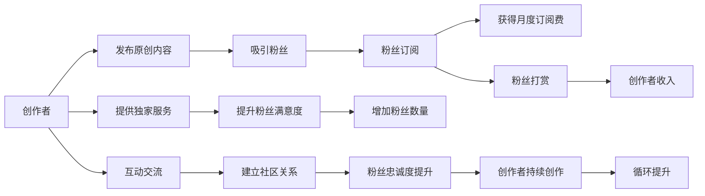

                 

# 程序员如何利用Patreon进行知识变现

> 关键词：程序员,知识变现,Patreon,订阅模式,奖励计划,激励机制,内容创作,社区生态,粉丝支持,技术分享

## 1. 背景介绍

在数字时代，内容创造者不再仅仅依靠传统的书籍出版或博客广告来盈利，而是探索出了新的收入模式——订阅模式。其中，Patreon是一个代表平台，它允许创作者与粉丝建立更为亲密的关系，通过提供独特的内容和专属服务，获得粉丝的支持和回馈。本文将探讨程序员如何利用Patreon进行知识变现，并详细讲解其背后的机制和策略。

## 2. 核心概念与联系

### 2.1 核心概念概述

- **Patreon**：一个基于订阅模式的平台，允许创作者提供独家内容、个性服务或商品，并通过粉丝的月度订阅和一次性奖励获得收入。
- **订阅模式**：用户定期支付固定费用，以获取创作者提供的一系列独家内容和服务。
- **奖励计划**：粉丝可以为特定的内容或行为进行打赏，如高质量的文章、教程、直播等。
- **激励机制**：通过提供不同的奖励等级，激励粉丝定期订阅和增加打赏。
- **内容创作**：创作者定期发布原创内容，与粉丝进行互动。
- **社区生态**：创作者和粉丝之间形成了一种互助互利的社区关系。

这些概念之间的联系紧密，共同构成了Patreon平台的运作基础，为程序员提供了一种新的知识变现途径。

### 2.2 核心概念原理和架构的 Mermaid 流程图



这个流程图展示了创作者与粉丝之间的互动关系，以及如何通过发布内容、提供服务、互动交流等方式，吸引和留住粉丝，并最终实现知识变现。

## 3. 核心算法原理 & 具体操作步骤

### 3.1 算法原理概述

Patreon的知识变现机制基于订阅和奖励计划。创作者发布原创内容，吸引粉丝订阅和打赏，获得持续的收入来源。其核心算法原理如下：

- **订阅模型**：粉丝每月支付固定费用，创作者定期发布原创内容。
- **奖励计划**：粉丝可以为特定的内容或行为进行打赏，创作者通过这些奖励获得额外收入。

### 3.2 算法步骤详解

1. **账号注册与验证**：创作者需要在Patreon上注册账号，并通过身份验证和押金审核。
   
2. **发布内容**：创作者定期发布原创内容，如技术文章、教程、直播等，并通过Patreon平台推送给粉丝。
   
3. **吸引粉丝**：通过社交媒体、博客、邮件列表等方式宣传Patreon账号，吸引更多粉丝订阅。
   
4. **设置奖励计划**：根据内容的重要性和难度，设定不同的奖励等级，吸引粉丝打赏。
   
5. **互动交流**：与粉丝进行互动，解答疑问、提供技术支持，增强粉丝忠诚度。
   
6. **持续创作与优化**：根据粉丝反馈，持续创作高质量内容，优化互动方式，提升粉丝满意度。

### 3.3 算法优缺点

**优点**：
- **灵活性高**：创作者可以根据自身需求和粉丝兴趣，灵活设置奖励计划和内容发布计划。
- **粉丝互动强**：通过互动交流，创作者可以更好地了解粉丝需求，提升粉丝满意度。
- **持续收入**：订阅和奖励计划提供稳定的收入来源，创作者可以安心创作。

**缺点**：
- **粉丝依赖度高**：创作者收入高度依赖于粉丝的持续支持和打赏。
- **市场风险**：粉丝流失、竞争激烈等因素可能影响创作者收入。
- **内容质量要求高**：创作者需要持续创作高质量内容，才能吸引和留住粉丝。

### 3.4 算法应用领域

Patreon的知识变现机制不仅适用于技术博客作者，还可以应用于软件开发者、教育讲师、艺术家等多个领域。创作者可以利用这一平台，通过发布原创内容、提供个性化服务，获得持续的收入来源。

## 4. 数学模型和公式 & 详细讲解 & 举例说明

### 4.1 数学模型构建

假设创作者每月发布 $n$ 篇原创文章，粉丝总数为 $m$，其中 $k$ 人订阅了创作者的内容，订阅费用为 $\$x$，打赏平均金额为 $\$y$。则创作者每月的收入 $I$ 可以表示为：

$$ I = \sum_{i=1}^{k} x_i + \sum_{i=1}^{n} y_i $$

其中，$x_i$ 为第 $i$ 位订阅者的月度订阅费用，$y_i$ 为第 $i$ 位粉丝的打赏金额。

### 4.2 公式推导过程

对于订阅模型，每月创作者从订阅者处获得的收入为：

$$ I_{\text{subscribe}} = k \times x $$

对于奖励计划，创作者每月从打赏粉丝处获得的收入为：

$$ I_{\text{reward}} = \sum_{i=1}^{n} y_i $$

综合考虑订阅和奖励计划，创作者每月的总收入为：

$$ I = I_{\text{subscribe}} + I_{\text{reward}} = k \times x + \sum_{i=1}^{n} y_i $$

### 4.3 案例分析与讲解

假设某创作者每月发布10篇原创文章，其中100人订阅了其内容，订阅费用为$\$10$。同时，这100位订阅者中，有50人每篇文章打赏$\$5$，其余50人每篇文章打赏$\$2$。则创作者每月收入为：

$$ I = 100 \times \$10 + 50 \times \$5 + 50 \times \$2 = \$2000 + \$250 + \$100 = \$2350 $$

这个例子展示了创作者如何通过订阅和打赏获得持续收入，同时也说明了奖励计划的激励作用。

## 5. 项目实践：代码实例和详细解释说明

### 5.1 开发环境搭建

要在Patreon上发布原创内容，首先需要搭建一个符合Patreon标准的开发环境。具体步骤如下：

1. 注册Patreon账号，并通过身份验证和押金审核。
2. 选择一个合适的博客平台（如WordPress、GitHub Pages等）搭建个人网站。
3. 使用Patreon提供的插件（如Patreon for WordPress、Patreon for GitHub Pages等），将网站与Patreon账号绑定。
4. 配置网站内容和互动功能，如文章发布、评论、直播等。

### 5.2 源代码详细实现

以下是一个简单的Python代码示例，用于统计每月发布文章的订阅者和打赏者数量，计算创作者每月的总收入。

```python
def calculate_income(n, k, x, reward_avg):
    """
    计算创作者每月的总收入
    :param n: 每月发布的文章数量
    :param k: 订阅者数量
    :param x: 订阅费用
    :param reward_avg: 打赏平均金额
    :return: 创作者每月的总收入
    """
    income_subscribe = k * x
    income_reward = k * reward_avg * n
    return income_subscribe + income_reward

# 示例数据
n = 10
k = 100
x = 10  # 订阅费用为10美元
reward_avg = [5, 2]  # 50%的粉丝每篇文章打赏5美元，50%的粉丝每篇文章打赏2美元
```

### 5.3 代码解读与分析

该代码实现了公式推导中的计算过程，通过设置不同参数（发布文章数量、订阅者数量、订阅费用、打赏平均金额），计算创作者每月的总收入。这可以帮助创作者更好地理解订阅和奖励计划对其收入的影响，并据此进行优化和调整。

### 5.4 运行结果展示

运行上述代码，可以得到创作者每月的总收入。例如，使用示例数据：

```python
calculate_income(n, k, x, reward_avg)
# 输出：2350
```

这意味着在每月发布10篇文章，100人订阅，订阅费用为10美元，其中50%的粉丝每篇文章打赏5美元，50%的粉丝每篇文章打赏2美元的情况下，创作者每月的收入为2350美元。

## 6. 实际应用场景

### 6.1 技术博客作者

对于技术博客作者，可以通过在平台上发布深度技术文章、教程和编程实践，吸引粉丝订阅和打赏。Patreon提供了一种新的方式，让作者与读者建立更为紧密的关系，获得持续的收入支持。

### 6.2 开源软件开发者

开源软件开发者可以利用Patreon发布项目教程、代码解析、代码优化等原创内容，吸引社区成员订阅和打赏。这不仅有助于项目的发展，也能为开发者带来额外的收入来源。

### 6.3 教育讲师

教育讲师可以利用Patreon提供高质量的教学视频、习题解析、在线答疑等独家服务，吸引学生和家长的订阅和打赏。Patreon平台为教育领域的知识变现提供了新的可能性。

### 6.4 艺术家和创作者

艺术家和创作者可以利用Patreon发布绘画、音乐、写作等内容，吸引粉丝订阅和打赏。平台不仅支持文字类内容，还可以支持多种形式的创意作品，为创作者提供多样化的变现渠道。

## 7. 工具和资源推荐

### 7.1 学习资源推荐

1. **《内容创作与变现》**：讲解如何通过内容创作实现知识变现，适合技术博客作者、教育讲师、艺术家等多领域创作者阅读。
2. **《数字出版与订阅模式》**：介绍订阅模式及其优缺点，适合希望了解这一模式的技术人员阅读。
3. **《Patreon官方文档》**：详细介绍了Patreon平台的使用方法、功能介绍和常见问题解答，适合新手和进阶用户阅读。
4. **《订阅模式与粉丝经济》**：探讨订阅模式在内容创作和知识变现中的应用，适合创作者和内容运营人员阅读。

### 7.2 开发工具推荐

1. **WordPress**：简单易用的博客平台，支持Patreon插件，适合技术博客作者使用。
2. **GitHub Pages**：免费的博客托管平台，支持Patreon插件，适合开发者和教育讲师使用。
3. **Patreon for WordPress**：WordPress的Patreon插件，方便创作者与Patreon账号绑定，发布原创内容。
4. **Patreon for GitHub Pages**：GitHub Pages的Patreon插件，方便开发者与Patreon账号绑定，发布原创代码和教程。

### 7.3 相关论文推荐

1. **《内容创作与社交平台：粉丝经济的研究》**：探讨内容创作者如何通过社交平台与粉丝建立关系，实现知识变现。
2. **《订阅模式的市场与用户行为分析》**：分析订阅模式的市场前景和用户行为，适合创作者和内容运营人员阅读。
3. **《知识变现与内容平台的创新应用》**：探讨知识变现在不同内容平台上的应用，适合技术博客作者和教育讲师阅读。

## 8. 总结：未来发展趋势与挑战

### 8.1 未来发展趋势

Patreon作为订阅模式的重要平台，未来将迎来更广泛的应用和更丰富的内容形式。以下是几个发展趋势：

1. **内容形式多样化**：除了文章、视频，未来可能出现更多形式的内容，如虚拟现实、增强现实等。
2. **全球化扩展**：Patreon平台将扩展到更多国家和地区，吸引全球粉丝支持创作者。
3. **技术与教育结合**：创作者将更多地利用技术手段（如编程实践、数据科学等），提供教育性内容，吸引学生和家长订阅。
4. **创作者社区化**：创作者将更加注重社区建设，通过互动交流增强粉丝粘性。

### 8.2 面临的挑战

尽管Patreon为创作者提供了新的变现途径，但在实际应用中也面临一些挑战：

1. **内容质量要求高**：创作者需要持续创作高质量内容，才能吸引和留住粉丝。
2. **市场竞争激烈**：Patreon平台上有大量创作者，创作者需要不断创新和优化内容，以获得更多粉丝支持。
3. **粉丝忠诚度问题**：如何提升粉丝的忠诚度，避免粉丝流失，是创作者需要关注的重要问题。
4. **技术门槛较高**：一些创作者可能缺乏技术能力，无法高效搭建和维护Patreon账号。

### 8.3 研究展望

未来，Patreon和创作者之间的合作将更加紧密，平台将提供更多的技术支持和社区资源，帮助创作者提升内容质量和粉丝互动效果。创作者也需要不断学习和探索，提升自身能力，应对市场变化和竞争挑战。

## 9. 附录：常见问题与解答

**Q1: 如何使用Patreon进行知识变现？**

A: 创作者可以在Patreon平台上发布原创内容，吸引粉丝订阅和打赏。设置不同等级的奖励计划，激励粉丝定期支持。通过持续创作高质量内容，建立社区关系，获得持续收入。

**Q2: 如何提升粉丝忠诚度？**

A: 创作者可以定期与粉丝互动，解答疑问、提供技术支持，增强粉丝粘性。同时，通过设置独家内容、举办线上活动等方式，提升粉丝满意度和忠诚度。

**Q3: 如何应对市场竞争？**

A: 创作者需要不断创新和优化内容，提供独特价值，吸引粉丝支持。同时，利用社交媒体、博客等渠道进行宣传，扩大粉丝基础。

**Q4: 如何降低技术门槛？**

A: 创作者可以利用现成的开发工具和Patreon插件，简化平台搭建和内容发布流程。同时，平台也会提供更多的技术支持和资源，帮助创作者提升技术能力。

---

作者：禅与计算机程序设计艺术 / Zen and the Art of Computer Programming

