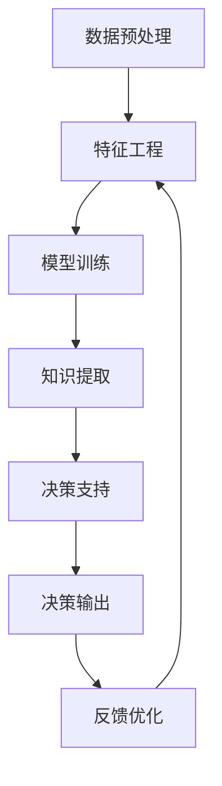

                 

## 1. 背景介绍

在现代数据驱动的世界里，决策不再只是基于经验和直觉，而是越来越多地依赖于数据分析和人工智能(AI)。特别是在金融、医疗、商业等领域，准确而及时的决策对于企业来说至关重要。然而，数据量的爆炸式增长和数据质量的参差不齐，使得传统的决策方式变得不再可行。知识发现引擎(Knowledge Discovery Engine, KDE)，作为一种基于数据挖掘和机器学习技术的智能决策工具，能够从海量数据中提取有价值的知识，辅助决策者做出更加科学合理的决策。

### 1.1 问题由来

在当前的信息化时代，数据无处不在。然而，数据的质量和数量并不能直接转换为知识的价值。数据往往需要通过智能分析才能转化为有用的信息，而知识的发现则涉及更深层次的分析和理解。传统的决策方式往往依赖于专家经验，但这种方法在面对复杂多变的现实情况时，容易产生偏差。知识发现引擎通过自动化地从数据中提取规律和模式，提供科学的决策依据，从而提高决策的准确性和效率。

### 1.2 问题核心关键点

知识发现引擎的核心在于从大规模数据中自动挖掘出有用知识，辅助决策者进行决策。这包括以下几个关键点：

- **数据预处理**：对原始数据进行清洗、转换、归一化等处理，为后续的模型训练和知识发现奠定基础。
- **特征工程**：从数据中提取具有代表性的特征，降低数据的维度，提高模型训练效率和效果。
- **模型选择与训练**：选择合适的机器学习模型进行训练，并通过交叉验证等方法优化模型参数。
- **知识提取与解释**：通过模型预测结果，自动挖掘出其中的知识模式，并生成易于理解的解释报告。
- **决策支持**：结合领域知识和模型预测结果，提供决策建议，辅助决策者做出更优的决策。

## 2. 核心概念与联系

### 2.1 核心概念概述

知识发现引擎利用数据挖掘和机器学习技术，从大规模数据中自动挖掘出有用的知识模式和规律。其核心概念包括：

- **数据挖掘(Data Mining)**：通过算法自动分析和挖掘数据中的规律和模式，提取有价值的信息。
- **机器学习(Machine Learning)**：利用数据训练模型，学习数据中的统计规律，进行预测和分类。
- **知识发现(Knowledge Discovery)**：从数据中发现知识模式和规律，生成易于理解的报告，辅助决策。
- **决策支持(Decision Support)**：结合领域知识和模型预测结果，提供决策建议，优化决策过程。

这些核心概念之间通过数据流动和模型训练形成了一个完整的知识发现和决策支持的闭环系统。

### 2.2 核心概念原理和架构的 Mermaid 流程图(Mermaid 流程节点中不要有括号、逗号等特殊字符)



此流程图展示了知识发现引擎的基本流程：

1. **数据预处理**：对原始数据进行清洗、转换和归一化。
2. **特征工程**：提取数据中的特征，降低数据维度。
3. **模型训练**：选择合适的机器学习模型，并训练其参数。
4. **知识提取**：利用训练好的模型对新数据进行预测，并从中提取知识模式。
5. **决策支持**：结合领域知识和模型预测结果，提供决策建议。
6. **反馈优化**：根据决策结果的反馈，优化模型和特征工程过程。

这一流程不断循环，不断提升模型的准确性和预测能力。

## 3. 核心算法原理 & 具体操作步骤

### 3.1 算法原理概述

知识发现引擎的核心算法原理主要基于以下三点：

- **监督学习(Supervised Learning)**：通过标注数据训练模型，学习输入与输出之间的映射关系，从而进行预测和分类。
- **无监督学习(Unsupervised Learning)**：在没有标注数据的情况下，自动发现数据中的规律和模式，进行聚类、降维等分析。
- **强化学习(Reinforcement Learning)**：通过与环境的交互，学习最优的决策策略，优化决策过程。

这些算法通过数据的不断输入和输出，逐步优化模型参数，提高知识发现的准确性和效果。

### 3.2 算法步骤详解

#### 3.2.1 数据预处理

数据预处理是知识发现引擎的基础步骤。以下是常用的预处理方法：

1. **数据清洗**：去除缺失值、异常值等噪音数据，确保数据的质量。
2. **数据转换**：将数据转换为模型能够处理的格式，如将分类变量转换为哑变量。
3. **特征提取**：通过选择和构造特征，降低数据维度，提高模型的训练效率和效果。

#### 3.2.2 特征工程

特征工程是知识发现引擎的关键步骤。通过合理的特征选择和构造，可以提高模型的性能：

1. **特征选择**：选择与目标变量相关性高的特征，去除无关或冗余特征。
2. **特征构造**：通过组合、变换等方法生成新的特征，丰富模型的输入。
3. **降维技术**：如主成分分析(PCA)、线性判别分析(LDA)等，降低数据的维度，提高计算效率。

#### 3.2.3 模型选择与训练

选择合适的机器学习模型并进行训练是知识发现引擎的核心步骤。常用的模型包括：

1. **线性回归(Linear Regression)**：用于预测连续型变量，如房价预测。
2. **逻辑回归(Logistic Regression)**：用于二分类问题，如客户流失预测。
3. **决策树(Decision Tree)**：用于分类和回归问题，如信用评估。
4. **随机森林(Random Forest)**：用于处理高维数据和减少过拟合问题。
5. **支持向量机(Support Vector Machine, SVM)**：用于分类问题，特别是非线性分类问题。
6. **神经网络(Neural Network)**：用于处理复杂的非线性问题，如图像识别和自然语言处理。

#### 3.2.4 知识提取与解释

知识提取是知识发现引擎的最终目标，其通过模型预测结果，自动挖掘出其中的知识模式：

1. **关联规则挖掘(Association Rule Mining)**：通过挖掘数据中的关联规则，发现项集之间的关联关系。
2. **聚类(Clustering)**：通过将数据分组，发现数据中的自然簇集。
3. **分类器(Classifier)**：通过训练分类器，将数据分类到不同的类别中。
4. **回归器(Regressor)**：通过训练回归器，预测连续型变量。

#### 3.2.5 决策支持

决策支持是将模型预测结果和领域知识结合起来，提供决策建议的过程：

1. **规则生成(Rule Generation)**：根据模型预测结果，生成易于理解的规则。
2. **解释报告(Explanation Report)**：生成报告，解释模型预测的依据和结果。
3. **决策建议(Decision Recommendation)**：结合领域知识，提供决策建议。

### 3.3 算法优缺点

知识发现引擎的优点包括：

1. **自动化**：能够自动从数据中挖掘出知识模式，无需人工干预。
2. **高效率**：能够处理大规模数据，快速生成决策建议。
3. **可解释性**：能够生成易于理解的解释报告，辅助决策者理解模型预测结果。

其缺点包括：

1. **数据依赖**：知识发现的效果依赖于数据的质量和数量，如果数据存在噪音或偏差，结果可能不准确。
2. **模型复杂度**：复杂的模型可能存在过拟合问题，需要更多的数据进行验证和优化。
3. **领域知识不足**：如果模型缺乏领域知识，可能无法生成有意义的解释和建议。

### 3.4 算法应用领域

知识发现引擎在多个领域都有广泛的应用，以下是一些典型的应用场景：

- **金融风险管理**：通过分析历史交易数据，发现潜在的风险因素，提供风险预警和防范建议。
- **医疗诊断**：通过分析患者的病历数据，发现疾病的关联和规律，辅助医生做出诊断决策。
- **市场营销**：通过分析消费者行为数据，发现市场趋势和用户偏好，优化营销策略。
- **物流管理**：通过分析运输数据，优化路线和仓库管理，提高物流效率。
- **智能推荐系统**：通过分析用户行为数据，发现用户兴趣和偏好，提供个性化推荐。

## 4. 数学模型和公式 & 详细讲解 & 举例说明

### 4.1 数学模型构建

知识发现引擎的数学模型构建主要包括数据的表示和模型的训练。以下是一个典型的知识发现流程：

#### 4.1.1 数据表示

数据通常通过向量或矩阵来表示。对于连续型变量，可以通过标准化或归一化处理后进行表示。对于分类变量，可以通过独热编码(One-Hot Encoding)或二进制编码(Binary Encoding)进行表示。

#### 4.1.2 模型训练

模型训练通常采用监督学习或无监督学习的方式。对于监督学习，需要标注数据进行训练；对于无监督学习，则不需要标注数据。常用的模型训练算法包括梯度下降、随机梯度下降、牛顿法等。

### 4.2 公式推导过程

以线性回归模型为例，其公式推导过程如下：

$$
y = \theta_0 + \sum_{i=1}^n \theta_i x_i
$$

其中，$y$ 表示目标变量，$x_i$ 表示输入变量，$\theta_i$ 表示模型参数。训练模型的目标是使损失函数最小化：

$$
\min_{\theta} \sum_{i=1}^n (y_i - \hat{y}_i)^2
$$

其中，$\hat{y}_i = \theta_0 + \sum_{i=1}^n \theta_i x_{i,i}$。

通过求解上述优化问题，可以训练出线性回归模型的参数 $\theta$。

### 4.3 案例分析与讲解

以信用卡违约预测为例，知识发现引擎的具体应用过程如下：

1. **数据预处理**：清洗信用卡交易数据，去除异常值，填充缺失值，将分类变量转换为哑变量。
2. **特征工程**：选择与违约相关的特征，如年龄、收入、消费金额等。
3. **模型训练**：使用逻辑回归模型，训练模型参数。
4. **知识提取**：根据训练好的模型，预测新客户的违约概率，提取关联规则和分类结果。
5. **决策支持**：结合领域知识，如年龄和收入与违约的关系，生成解释报告和决策建议。

## 5. 项目实践：代码实例和详细解释说明

### 5.1 开发环境搭建

开发知识发现引擎通常需要使用Python和R等编程语言。以下是使用Python进行开发的环境配置流程：

1. 安装Python：从官网下载并安装Python，选择适合的版本。
2. 安装相关库：安装Scikit-Learn、Pandas、NumPy等常用库。
3. 配置环境：设置Python路径，创建虚拟环境（如使用virtualenv）。
4. 安装依赖：安装所需依赖库，如TensorFlow、Keras等。

### 5.2 源代码详细实现

以下是一个简单的知识发现引擎代码示例，用于预测信用卡违约的概率：

```python
import pandas as pd
from sklearn.model_selection import train_test_split
from sklearn.linear_model import LogisticRegression
from sklearn.metrics import accuracy_score

# 读取数据
df = pd.read_csv('creditcard.csv')

# 数据预处理
df = df.dropna()
X = df[['V1', 'V2', 'V3', 'V4', 'V5', 'V6', 'V7', 'V8', 'V9', 'V10', 'V11', 'V12', 'V13', 'V14', 'V15', 'V16', 'V17', 'V18', 'V19', 'V20']]
y = df['Class']

# 划分训练集和测试集
X_train, X_test, y_train, y_test = train_test_split(X, y, test_size=0.2)

# 模型训练
model = LogisticRegression()
model.fit(X_train, y_train)

# 模型预测
y_pred = model.predict(X_test)

# 模型评估
acc = accuracy_score(y_test, y_pred)
print(f"Accuracy: {acc:.2f}")
```

### 5.3 代码解读与分析

以下是代码中每个步骤的详细解释：

1. **数据读取**：使用pandas库读取数据集，并将其存储在DataFrame中。
2. **数据预处理**：使用dropna()方法去除缺失值，选择与目标变量相关的特征。
3. **模型训练**：使用scikit-learn库中的LogisticRegression模型，训练模型参数。
4. **模型预测**：使用训练好的模型，对测试集进行预测。
5. **模型评估**：使用accuracy_score()方法计算模型预测的准确率。

## 6. 实际应用场景

### 6.1 金融风险管理

在金融风险管理中，知识发现引擎可以用于预测客户的违约概率，评估贷款风险，提供风险预警和防范建议。通过分析历史交易数据，可以发现潜在的风险因素，如收入水平、消费行为等，从而提高风险评估的准确性和效率。

### 6.2 医疗诊断

在医疗诊断中，知识发现引擎可以用于分析患者的病历数据，发现疾病的关联和规律，辅助医生做出诊断决策。通过分析患者的历史病历和症状，可以发现潜在的疾病风险，提供个性化的治疗建议。

### 6.3 市场营销

在市场营销中，知识发现引擎可以用于分析消费者行为数据，发现市场趋势和用户偏好，优化营销策略。通过分析消费者的购买历史和行为数据，可以发现用户的兴趣和需求，提供个性化的推荐和服务。

### 6.4 物流管理

在物流管理中，知识发现引擎可以用于优化路线和仓库管理，提高物流效率。通过分析运输数据和库存数据，可以发现最优的运输路线和库存策略，减少运输成本和库存损耗。

## 7. 工具和资源推荐

### 7.1 学习资源推荐

1. 《Python机器学习》：适合初学者和进阶者的入门书籍，介绍了机器学习的基本概念和常用算法。
2. 《机器学习实战》：通过实例和代码讲解了机器学习算法的实现过程。
3. Kaggle平台：提供丰富的数据集和竞赛，可以实践和测试机器学习算法的性能。
4. Coursera和edX平台：提供免费的在线课程，介绍机器学习和数据挖掘的高级知识。

### 7.2 开发工具推荐

1. Jupyter Notebook：用于数据探索和模型训练，支持Python、R等语言。
2. TensorFlow：用于深度学习和机器学习任务，提供丰富的预训练模型和算法。
3. Scikit-Learn：用于机器学习任务，提供了多种常见的机器学习算法和工具。
4. Weka：用于数据挖掘和机器学习任务，支持多种算法和可视化工具。

### 7.3 相关论文推荐

1. 《An Introduction to Statistical Learning》：介绍统计学习的基本概念和算法。
2. 《Pattern Recognition and Machine Learning》：介绍机器学习和数据挖掘的高级算法。
3. 《Deep Learning》：介绍深度学习的基本概念和算法。

## 8. 总结：未来发展趋势与挑战

### 8.1 研究成果总结

知识发现引擎在多个领域都展现了强大的应用潜力，通过自动化的数据挖掘和机器学习技术，从大规模数据中提取有价值的知识，辅助决策者做出更优的决策。

### 8.2 未来发展趋势

知识发现引擎的未来发展趋势包括：

1. **自动化程度提高**：随着技术的发展，知识发现引擎将更加自动化，无需人工干预即可发现有用知识。
2. **实时性增强**：通过云计算和大数据技术，知识发现引擎可以实时处理数据，提供即时的决策支持。
3. **多模态融合**：将知识发现引擎扩展到多模态数据，如文本、图像、语音等，实现跨模态的智能决策。
4. **跨领域应用**：知识发现引擎将广泛应用于更多领域，如医疗、金融、零售等。

### 8.3 面临的挑战

知识发现引擎的发展也面临诸多挑战：

1. **数据质量**：数据的质量和完整性直接影响知识发现的准确性。如何获取高质量的数据是当前的一个挑战。
2. **模型复杂度**：复杂的模型可能存在过拟合问题，需要更多的数据进行验证和优化。
3. **解释性不足**：知识发现引擎生成的模型和规则可能缺乏解释性，难以理解其决策过程。
4. **计算资源**：知识发现引擎需要处理大规模数据和复杂的计算任务，对计算资源的要求较高。

### 8.4 研究展望

未来的研究需要在以下几个方面进行突破：

1. **数据质量提升**：开发数据清洗和预处理技术，提高数据质量和完整性。
2. **模型优化**：开发更高效的算法，提高模型的训练速度和效果。
3. **解释性增强**：开发可解释的机器学习算法，增强模型的解释性和透明度。
4. **实时性改进**：通过云计算和大数据技术，提高知识发现引擎的实时性和响应速度。

## 9. 附录：常见问题与解答

**Q1：知识发现引擎是如何处理缺失数据的？**

A: 知识发现引擎通常通过删除或填补缺失值来处理缺失数据。常见的填补方法包括均值填补、中位数填补和插值填补等。

**Q2：如何选择合适的机器学习算法？**

A: 选择合适的机器学习算法需要考虑数据的类型、问题类型和数据量。一般来说，对于分类问题，可以使用决策树、随机森林和支持向量机等算法；对于回归问题，可以使用线性回归、逻辑回归和神经网络等算法。

**Q3：知识发现引擎在处理高维数据时需要注意哪些问题？**

A: 处理高维数据时，需要注意过拟合和维度灾难问题。通常通过特征选择和降维技术来解决这些问题，如主成分分析(PCA)、线性判别分析(LDA)等。

**Q4：如何提高知识发现引擎的实时性？**

A: 通过使用分布式计算和大数据技术，如Spark、Hadoop等，可以显著提高知识发现引擎的实时性。此外，优化算法和模型结构，减少计算时间和内存消耗，也是提高实时性的有效方法。

**Q5：知识发现引擎生成的解释报告是否一定可靠？**

A: 知识发现引擎生成的解释报告不一定可靠，其准确性取决于模型和数据的质量。在实际应用中，需要结合领域知识和专家经验，对解释报告进行验证和调整。

---

作者：禅与计算机程序设计艺术 / Zen and the Art of Computer Programming

