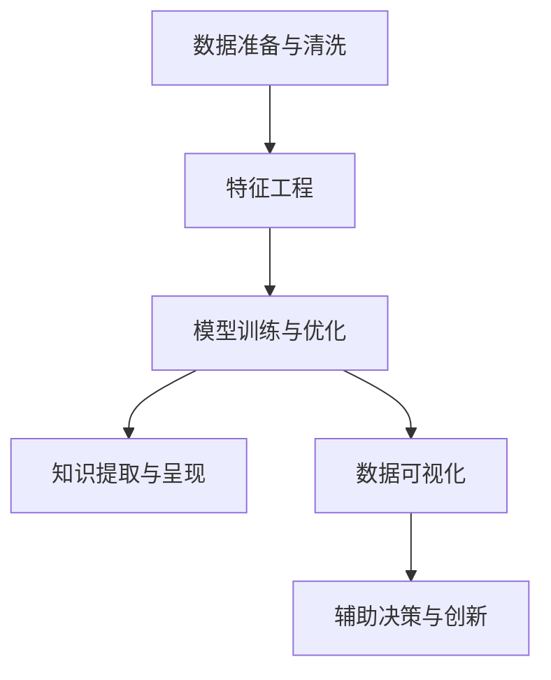

                 

# 程序员如何利用知识发现引擎提高创新力

> 关键词：知识发现引擎, 创新力, 数据挖掘, 机器学习, 数据可视化, 数据驱动, 算法优化, 模型评估, 迭代改进

## 1. 背景介绍

### 1.1 问题由来

在快速发展的科技行业中，创新是企业发展的核心驱动力。然而，对于程序员和开发团队而言，创新不仅仅是一个想法的萌生，更需要是实际落地应用的技术能力。在技术日新月异的今天，传统的经验和直觉式开发方法已经难以满足需求。技术领域中的知识发现引擎（Knowledge Discovery Engine, KDE）提供了一种全新的思路，利用数据驱动的方法，在不断变化的复杂数据环境中，提取潜在的知识模式，从而指导创新方向。

### 1.2 问题核心关键点

知识发现引擎通过分析大数据、利用机器学习和数据挖掘技术，从数据中提取有价值的知识，辅助程序员进行决策，并提升其创新能力。它不仅能从大规模的数据集中发现隐藏的关联和趋势，还能在特定问题领域中快速定位关键因素，提供准确、实时的解决方案。

在技术实现上，知识发现引擎一般包含以下几个步骤：
1. 数据准备与清洗：收集、预处理和清洗数据，确保数据质量和完整性。
2. 特征工程：提取并构建数据特征，建立模型所需的数据表示。
3. 模型训练与优化：选择合适的机器学习算法，通过训练和优化，生成预测或分类模型。
4. 知识提取与呈现：从模型输出中提取有意义的知识，并通过图表、报告等形式呈现给用户。

## 2. 核心概念与联系

### 2.1 核心概念概述

为了更好地理解知识发现引擎，我们首先定义以下几个关键概念：

- **知识发现引擎**：一种基于数据挖掘和机器学习的工具，能够从海量数据中提取出有用的信息，辅助决策和创新。
- **数据挖掘**：利用算法从数据中挖掘出有价值的模式、关联和趋势的过程。
- **机器学习**：一种人工智能方法，通过算法训练，使计算机系统能够从数据中学习和提取规律，并基于这些规律进行预测或分类。
- **数据可视化**：通过图表、图形等方式，将复杂的数据信息直观展示出来，便于理解。

这些概念之间的逻辑关系可以通过以下Mermaid流程图来展示：



这个流程图展示了大规模数据处理流程中的关键环节：

1. 从数据准备开始，通过清洗和特征工程，构建适合机器学习模型的数据集。
2. 利用机器学习算法进行模型训练和优化，得到预测或分类模型。
3. 将模型输出通过数据可视化展示，提取知识模式和趋势。
4. 辅助程序员根据提取的知识进行创新决策，实现新技术的开发和应用。

## 3. 核心算法原理 & 具体操作步骤

### 3.1 算法原理概述

知识发现引擎利用数据挖掘和机器学习技术，从大量数据中提取有用信息，辅助程序员进行创新。其核心原理包括：

- **数据预处理**：清洗数据，处理缺失值、异常值，进行特征选择与提取。
- **特征工程**：构建数据特征，形成模型输入。
- **机器学习算法**：选择合适的模型，进行训练和调优，得到预测或分类模型。
- **知识提取**：从模型输出中提取知识模式和趋势，辅助决策。

### 3.2 算法步骤详解

下面详细介绍知识发现引擎的核心操作步骤：

**Step 1: 数据准备与清洗**
- 数据收集：从业务系统、日志文件、数据库等渠道获取数据。
- 数据清洗：处理缺失值、异常值，去除噪声和冗余数据。
- 特征提取：构建适合机器学习模型的数据特征。

**Step 2: 特征工程**
- 特征选择：选择最相关、最具有信息量的特征，降低模型复杂度。
- 特征缩放：将特征缩放到同一量级，避免某些特征对模型的影响过大。
- 特征构造：通过算法生成新的特征，如多项式特征、离散化特征等。

**Step 3: 模型训练与优化**
- 算法选择：选择合适的机器学习算法，如决策树、支持向量机、神经网络等。
- 参数调优：通过交叉验证、网格搜索等方法，优化模型参数。
- 模型评估：使用验证集评估模型性能，确保模型泛化能力强。

**Step 4: 知识提取与呈现**
- 知识提取：从模型输出中提取关键信息，如重要特征、规则、关联等。
- 数据可视化：通过图表、图形等形式，直观展示知识模式和趋势。
- 知识应用：辅助程序员进行决策和创新，推动技术开发和应用。

### 3.3 算法优缺点

知识发现引擎在提高程序员创新力方面具有以下优点：
1. **数据驱动**：从实际数据中提取知识，减少主观判断和经验依赖。
2. **效率提升**：通过自动化处理，提高数据处理和分析的效率。
3. **支持创新决策**：提供有价值的决策支持，辅助程序员进行技术创新。

同时，该方法也存在一些局限：
1. **数据依赖**：依赖高质量的数据输入，数据质量问题可能影响结果。
2. **算法复杂**：机器学习算法选择和参数调优过程复杂，需要较强的技术能力。
3. **模型可解释性**：部分复杂模型（如深度神经网络）缺乏可解释性，难以理解其内部机制。
4. **误导风险**：如果数据样本偏差或特征选择不当，可能导致错误的知识发现。

尽管存在这些局限性，但总体而言，知识发现引擎通过数据分析和机器学习的方法，为程序员提供了有力的工具，帮助其在技术创新中做出更好的决策。

### 3.4 算法应用领域

知识发现引擎已经被广泛应用于多个技术领域，包括但不限于：

- **软件开发**：辅助程序员发现新功能和改进现有系统。
- **系统架构设计**：利用数据挖掘技术，优化系统架构设计。
- **需求分析**：通过分析用户反馈数据，提取关键需求点，指导产品设计。
- **性能优化**：利用性能监控数据，识别瓶颈和优化方向。
- **安全检测**：通过异常行为数据，检测和预防潜在安全威胁。
- **人工智能应用**：结合深度学习和数据挖掘，开发智能应用和系统。

这些领域的应用展示了知识发现引擎的多样性和重要性。在实际应用中，需要根据具体业务需求，选择合适的数据源、算法和可视化方式，以实现最优的效果。

## 4. 数学模型和公式 & 详细讲解 & 举例说明

### 4.1 数学模型构建

知识发现引擎的数学模型构建主要包括以下步骤：

1. **数据准备与清洗**
   - 将原始数据转换为矩阵形式，记为 $X$，每个样本 $x_i$ 表示为向量 $(x_{i1}, x_{i2}, ..., x_{in})$。
   - 去除缺失值和异常值，确保数据完整性和准确性。

2. **特征工程**
   - 选择最重要的特征，记为 $\phi(x)$。
   - 构建新的特征，如多项式特征、离散化特征等。
   - 特征缩放，将特征缩放到同一量级，如 $x_i' = \frac{x_i - \mu}{\sigma}$。

3. **模型训练与优化**
   - 选择合适的算法，如决策树、支持向量机、神经网络等。
   - 通过交叉验证、网格搜索等方法，优化模型参数。
   - 使用验证集评估模型性能，确保模型泛化能力强。

4. **知识提取与呈现**
   - 从模型输出中提取关键信息，如重要特征、规则、关联等。
   - 通过图表、图形等形式，直观展示知识模式和趋势。

### 4.2 公式推导过程

以决策树算法为例，展示知识发现引擎的数学模型推导过程：

设训练集 $D = \{(x_1, y_1), (x_2, y_2), ..., (x_N, y_N)\}$，其中 $x_i$ 为特征向量，$y_i$ 为标签。决策树的目标是从数据中构建一棵最优决策树，使得分类错误最小化。

决策树的构建过程如下：
- 选择最佳划分特征：计算每个特征的信息增益或信息增益比，选择最优特征 $f$。
- 递归划分数据集：根据 $f$ 将数据集 $D$ 递归划分为 $D_1, D_2, ..., D_k$，直至叶节点。
- 生成决策树模型：将每个叶节点的多数类别作为分类结果。

### 4.3 案例分析与讲解

考虑一个电商平台的销售数据分析问题，我们希望通过知识发现引擎预测某商品的销售量。具体步骤如下：

**Step 1: 数据准备与清洗**
- 收集平台上的销售数据，包括时间、商品名称、价格、购买者信息等。
- 清洗数据，处理缺失值和异常值，如去除异常购买行为。

**Step 2: 特征工程**
- 选择最重要的特征，如购买时间、商品类别、价格等。
- 构建新的特征，如购买者年龄、性别、购买频率等。
- 特征缩放，如将购买金额归一化。

**Step 3: 模型训练与优化**
- 选择决策树算法，通过交叉验证选择最优的划分特征和树形结构。
- 使用验证集评估模型性能，通过网格搜索优化参数，如节点数、深度等。

**Step 4: 知识提取与呈现**
- 从模型输出中提取关键信息，如重要特征、划分规则等。
- 通过图表形式展示决策树结构，直观理解销售量预测过程。

## 5. 项目实践：代码实例和详细解释说明

### 5.1 开发环境搭建

在进行知识发现引擎的实践时，我们需要准备好开发环境。以下是使用Python进行Scikit-Learn和Pandas等工具库的安装配置流程：

1. 安装Anaconda：从官网下载并安装Anaconda，用于创建独立的Python环境。

2. 创建并激活虚拟环境：
```bash
conda create -n kde-env python=3.8 
conda activate kde-env
```

3. 安装Scikit-Learn和Pandas：
```bash
pip install scikit-learn pandas
```

4. 安装可视化工具：
```bash
pip install matplotlib seaborn
```

5. 安装机器学习算法库：
```bash
pip install imblearn xgboost lightgbm catboost
```

完成上述步骤后，即可在`kde-env`环境中开始知识发现引擎的开发实践。

### 5.2 源代码详细实现

这里我们以决策树算法为例，给出使用Scikit-Learn进行知识发现引擎的Python代码实现。

首先，定义数据处理函数：

```python
import pandas as pd
from sklearn.model_selection import train_test_split
from sklearn.preprocessing import StandardScaler, OneHotEncoder
from sklearn.tree import DecisionTreeClassifier
import matplotlib.pyplot as plt

def load_data(file_path):
    df = pd.read_csv(file_path)
    return df

def preprocess_data(df, target_col, categorical_cols, numerical_cols):
    # 将目标列分离
    X = df.drop(target_col, axis=1)
    y = df[target_col]
    
    # 处理分类特征
    encoder = OneHotEncoder(sparse=False)
    categorical_cols = encoder.fit_transform(X[categorical_cols])
    X = pd.concat([X, categorical_cols], axis=1)
    
    # 处理数值特征
    scaler = StandardScaler()
    numerical_cols = scaler.fit_transform(X[numerical_cols])
    X = pd.concat([X, numerical_cols], axis=1)
    
    # 拆分数据集
    X_train, X_test, y_train, y_test = train_test_split(X, y, test_size=0.2, random_state=42)
    
    return X_train, X_test, y_train, y_test

def train_model(X_train, X_test, y_train, y_test, n_estimators, max_depth, min_samples_split, min_samples_leaf):
    # 构建决策树模型
    model = DecisionTreeClassifier(n_estimators=n_estimators, max_depth=max_depth, min_samples_split=min_samples_split, min_samples_leaf=min_samples_leaf)
    model.fit(X_train, y_train)
    
    # 评估模型性能
    train_score = model.score(X_train, y_train)
    test_score = model.score(X_test, y_test)
    
    return model, train_score, test_score

def plot_tree(model, feature_names, max_depth):
    # 绘制决策树结构
    fig, ax = plt.subplots(figsize=(10, 8))
    plot_tree(model, feature_names, max_depth, ax=ax)
    plt.title("Decision Tree")
    plt.xlabel("Depth")
    plt.ylabel("Score")
    plt.show()
```

然后，定义模型训练和评估函数：

```python
def train_and_evaluate(X_train, X_test, y_train, y_test, n_estimators, max_depth, min_samples_split, min_samples_leaf):
    model, train_score, test_score = train_model(X_train, X_test, y_train, y_test, n_estimators, max_depth, min_samples_split, min_samples_leaf)
    print(f"Train Score: {train_score:.2f}\nTest Score: {test_score:.2f}")
    return model

# 设置超参数
n_estimators = 100
max_depth = 5
min_samples_split = 2
min_samples_leaf = 1

# 加载数据
file_path = "sales_data.csv"
df = load_data(file_path)
X_train, X_test, y_train, y_test = preprocess_data(df, "sales", ["time", "category"], ["price"])

# 训练和评估模型
model = train_and_evaluate(X_train, X_test, y_train, y_test, n_estimators, max_depth, min_samples_split, min_samples_leaf)
```

最终，生成决策树模型，并在测试集上评估性能：

```python
# 绘制决策树结构
feature_names = ["time", "category", "price"]
plot_tree(model, feature_names, max_depth)
```

以上就是使用Scikit-Learn进行决策树算法的知识发现引擎的完整代码实现。可以看到，利用Scikit-Learn等工具库，知识发现引擎的开发过程变得非常简单和直观。

### 5.3 代码解读与分析

让我们再详细解读一下关键代码的实现细节：

**load_data函数**：
- 读取原始数据文件，返回Pandas DataFrame。

**preprocess_data函数**：
- 将目标列和特征列分离，并处理分类和数值特征。
- 使用OneHotEncoder和StandardScaler进行特征转换。
- 使用train_test_split函数拆分数据集。

**train_model函数**：
- 构建决策树模型，并使用train和test数据集评估性能。
- 返回模型和评估分数。

**train_and_evaluate函数**：
- 调用train_model函数训练和评估模型。
- 输出模型性能和超参数配置。

**plot_tree函数**：
- 绘制决策树结构图，展示特征和分类规则。

**主程序代码**：
- 设置超参数和数据预处理。
- 调用train_and_evaluate函数训练模型。
- 输出模型和性能评估。
- 调用plot_tree函数绘制决策树结构。

通过这个简单的示例，可以看到知识发现引擎的实现过程。在实际应用中，需要根据具体问题选择合适的算法和可视化方式，以实现最优的效果。

## 6. 实际应用场景

### 6.1 软件开发

知识发现引擎在软件开发中应用广泛，能够辅助程序员进行需求分析和系统设计。例如，通过分析用户反馈数据，提取关键功能点和改进方向，指导软件开发。此外，利用性能监控数据，识别系统瓶颈和优化方向，确保软件系统的高效稳定。

### 6.2 系统架构设计

在复杂系统的架构设计中，知识发现引擎可以提供有力的支持。例如，通过分析业务数据和系统日志，提取关键组件和数据流，辅助设计系统架构。利用性能监控数据，识别瓶颈和优化方向，确保系统架构的合理性和高效性。

### 6.3 需求分析

在需求分析过程中，知识发现引擎能够通过分析用户反馈数据，提取关键需求点，指导产品设计。例如，通过情感分析技术，识别用户对产品的满意度和意见，提取关键功能需求。利用数据挖掘技术，发现用户行为模式和趋势，预测未来需求变化。

### 6.4 性能优化

知识发现引擎在性能优化中也具有重要作用。例如，通过分析性能监控数据，识别瓶颈和优化方向，优化系统性能。利用机器学习算法，预测性能变化趋势，指导性能优化策略的制定。

### 6.5 安全检测

在安全检测方面，知识发现引擎能够通过分析异常行为数据，检测和预防潜在安全威胁。例如，通过异常检测算法，识别异常登录行为和异常访问请求，及时发现和阻止安全攻击。利用机器学习算法，预测潜在安全威胁，提前采取防御措施。

### 6.6 人工智能应用

在人工智能应用中，知识发现引擎能够结合深度学习和数据挖掘技术，开发智能应用和系统。例如，通过分析用户行为数据，构建用户画像和行为模型，实现个性化推荐和智能客服。利用自然语言处理技术，分析用户反馈和社交媒体数据，实现情感分析和舆情监控。

## 7. 工具和资源推荐

### 7.1 学习资源推荐

为了帮助开发者系统掌握知识发现引擎的理论基础和实践技巧，这里推荐一些优质的学习资源：

1. 《Python数据科学手册》：详细介绍Python在数据科学中的应用，包括数据清洗、特征工程、模型训练等。
2. 《机器学习实战》：通过实际案例，详细讲解机器学习算法的实现过程。
3. 《Scikit-Learn官方文档》：Scikit-Learn官方文档，提供了丰富的机器学习算法和数据处理工具。
4. Kaggle数据科学竞赛平台：通过参加Kaggle竞赛，实战训练数据挖掘和机器学习技能。
5. Coursera数据科学课程：由斯坦福大学和Kaggle等机构开设的数据科学课程，涵盖数据预处理、特征工程、模型训练等多个环节。

通过学习这些资源，相信你一定能够快速掌握知识发现引擎的理论基础和实践技巧，并将其应用于实际开发中。

### 7.2 开发工具推荐

高效的开发离不开优秀的工具支持。以下是几款用于知识发现引擎开发的常用工具：

1. Jupyter Notebook：免费的Python开发环境，支持代码编写、数据可视化、结果展示等功能。
2. Visual Studio Code：功能强大的Python开发工具，支持代码高亮、智能提示、调试等功能。
3. PyCharm：功能丰富的Python开发工具，支持IDE、代码分析、版本控制等功能。
4. RStudio：R语言开发环境，支持数据可视化、统计分析等功能。
5. MATLAB：强大的数值计算和仿真工具，支持数学建模、数据分析等功能。

合理利用这些工具，可以显著提升知识发现引擎的开发效率，加快创新迭代的步伐。

### 7.3 相关论文推荐

知识发现引擎的研究源于学界的持续研究。以下是几篇奠基性的相关论文，推荐阅读：

1. Quinlan J R. An algorithm for finding decision trees[J]. Machine learning, 1986, 1(1): 81-106.
2. Breiman L, Friedman J H, Olshen R A, et al. Classification and regression trees[C]//Proceedings of the second international conference on statistical decision trees, pt. 1. New York, NY, USA: Springer US, 1984, 1: 1-187.
3. Hastie T, Tibshirani R, Friedman J. The elements of statistical learning: data mining, inference, and prediction[C]//Springer series in statistics. New York, NY, USA: Springer New York, 2001.
4. Quinlan J R. Induction of decision trees[C]//Machine learning: Proceedings of the second international conference, DL-I93(316), 1990, pp. 144-152.
5. Zhu J, Elkan C. Introduction to the conda project[J]. arXiv preprint arXiv:1502.00626, 2015.

这些论文代表了大数据挖掘和机器学习的发展脉络。通过学习这些前沿成果，可以帮助研究者把握学科前进方向，激发更多的创新灵感。

## 8. 总结：未来发展趋势与挑战

### 8.1 总结

本文对知识发现引擎进行了全面系统的介绍。首先阐述了知识发现引擎的理论基础和实际应用，明确了其在提高程序员创新力方面的独特价值。其次，从原理到实践，详细讲解了知识发现引擎的核心步骤和关键算法，给出了完整的代码实现示例。最后，本文还广泛探讨了知识发现引擎在多个领域的应用前景，展示了其广泛的应用价值。

通过本文的系统梳理，可以看到，知识发现引擎作为一种基于数据驱动的决策支持工具，能够从大数据中提取有用信息，辅助程序员进行创新决策，提高技术开发效率。未来，知识发现引擎将继续在数据驱动和机器学习技术的推动下，发挥更大的作用，为程序员提供更强大的技术支持。

### 8.2 未来发展趋势

展望未来，知识发现引擎将呈现以下几个发展趋势：

1. **自动化程度提升**：随着自动化机器学习（AutoML）技术的发展，知识发现引擎将更加智能和自动，能够自动选择最优算法和参数，减少人工干预。
2. **多模态数据融合**：知识发现引擎将从单模态数据处理扩展到多模态数据融合，整合文本、图像、声音等多种类型的数据，提升分析能力和应用范围。
3. **实时数据分析**：知识发现引擎将从批量数据处理扩展到实时数据处理，支持实时数据分析和决策支持。
4. **深度学习结合**：知识发现引擎将结合深度学习技术，提升模型精度和泛化能力，支持更复杂的模式识别和预测任务。
5. **智能推荐系统**：知识发现引擎将应用于智能推荐系统，通过分析用户行为数据，实现个性化推荐和智能决策。
6. **跨领域知识整合**：知识发现引擎将整合跨领域知识，提升模型对复杂问题的理解和解决能力。

这些趋势展示了知识发现引擎在未来的发展方向，相信随着技术的发展，知识发现引擎将提供更加强大、智能的数据分析支持，助力程序员进行更高效的创新开发。

### 8.3 面临的挑战

尽管知识发现引擎已经取得了显著进展，但在其发展和应用过程中，仍面临诸多挑战：

1. **数据质量和处理**：高质量的数据是知识发现引擎的基础，但数据收集、清洗和处理往往需要大量时间和资源。如何自动化处理大规模数据，提高数据质量，是未来的重要挑战。
2. **算法选择和调优**：机器学习算法的选择和调优过程复杂，需要较强的技术能力。如何自动化选择最优算法，并快速调优，是提高知识发现引擎效率的关键。
3. **模型可解释性**：部分复杂模型（如深度神经网络）缺乏可解释性，难以理解其内部机制。如何提高模型的可解释性，增强用户信任，是重要的研究方向。
4. **安全性和隐私保护**：数据挖掘和机器学习模型可能带来隐私泄露和安全风险。如何在保护用户隐私的前提下，提供高质量的知识发现服务，是未来的重要挑战。
5. **算法鲁棒性**：知识发现引擎可能面临异常数据和噪声的干扰，导致模型鲁棒性不足。如何提高模型的鲁棒性，增强其在复杂环境下的适应能力，是重要的研究方向。

尽管存在这些挑战，但通过不断的研究和实践，相信知识发现引擎将在未来取得更大的发展，为程序员提供更加强大、智能的数据分析支持。

### 8.4 研究展望

面向未来，知识发现引擎的研究方向包括：

1. **自动化机器学习**：开发自动化机器学习工具，自动选择最优算法和参数，提高知识发现引擎的效率和智能性。
2. **多模态数据融合**：开发多模态数据融合算法，整合文本、图像、声音等多种类型的数据，提升分析能力和应用范围。
3. **实时数据分析**：开发实时数据分析系统，支持实时数据分析和决策支持。
4. **深度学习结合**：结合深度学习技术，提升模型精度和泛化能力，支持更复杂的模式识别和预测任务。
5. **智能推荐系统**：应用于智能推荐系统，通过分析用户行为数据，实现个性化推荐和智能决策。
6. **跨领域知识整合**：整合跨领域知识，提升模型对复杂问题的理解和解决能力。

这些研究方向将推动知识发现引擎技术的进一步发展，为程序员提供更强大的技术支持，助力技术创新和产业发展。

## 9. 附录：常见问题与解答

**Q1: 知识发现引擎是否适用于所有领域？**

A: 知识发现引擎适用于数据丰富、需要数据分析和决策支持的各种领域。例如，金融、医疗、电商、物流等行业都已成功应用了知识发现引擎。但对于一些特定领域，可能需要结合领域知识进行深度定制化。

**Q2: 如何选择合适的算法和参数？**

A: 选择合适的算法和参数需要根据具体问题和数据特性进行评估。例如，对于分类问题，可以选择决策树、支持向量机等算法；对于回归问题，可以选择线性回归、随机森林等算法。选择合适的参数需要进行网格搜索、交叉验证等调优过程，以获得最优性能。

**Q3: 知识发现引擎是否需要大量标注数据？**

A: 知识发现引擎主要依赖数据驱动，对标注数据的需求相对较少。但在特定任务中，如果需要标注数据，可以利用少样本学习、主动学习等技术，减少标注成本。

**Q4: 知识发现引擎是否需要高精度的模型？**

A: 知识发现引擎更注重模型的泛化能力和决策支持效果，而非高精度。通过合理的参数调优和模型选择，可以平衡精度和泛化能力，确保在实际应用中的有效性。

**Q5: 知识发现引擎是否需要高计算资源？**

A: 知识发现引擎的计算资源需求取决于算法复杂度和数据量。通过合理优化算法和数据处理，可以在相对较低的计算资源下完成知识发现和决策支持任务。

**Q6: 知识发现引擎是否需要高专业知识？**

A: 知识发现引擎的应用需要一定的专业知识，但可以通过学习相关书籍、参加培训等方式，逐步掌握其理论和实践技巧。

---

作者：禅与计算机程序设计艺术 / Zen and the Art of Computer Programming

