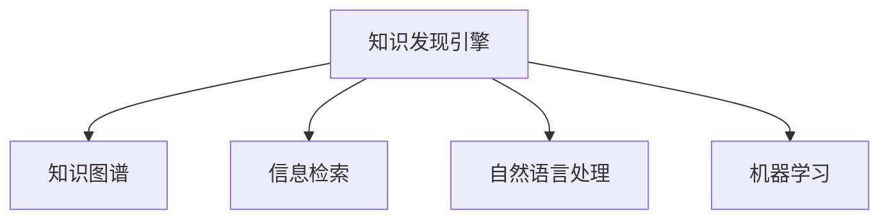

                 

# 程序员如何利用知识发现引擎提高工作效能

在信息技术快速发展的今天，程序员的工作量和任务难度也在不断增加。如何在满足需求的同时，提升开发效率和工作质量，已成为广大程序员的共同追求。知识发现引擎（Knowledge Discovery Engine, KDE）作为人工智能领域的前沿技术，通过自动分析大量文档和数据，帮助程序员快速获取所需知识，从而显著提高开发效率和质量。本文将详细探讨如何利用知识发现引擎提高程序员的工作效能。

## 1. 背景介绍

### 1.1 问题由来

随着软件开发复杂性的增加，代码规模日益庞大，新功能和模块不断增加，程序员在编写代码和调试过程中，面临着诸如知识碎片化、学习成本高、调试难度大等问题。这些问题不仅降低了开发效率，也影响了代码质量和可维护性。为此，我们需要一种能够自动发现并整合知识的技术，帮助程序员快速定位问题，提升开发效率。

### 1.2 问题核心关键点

知识发现引擎（KDE）能够从大规模代码库和文档集中，自动识别并提取有用的知识信息，提供给程序员作为参考。其核心原理是通过自然语言处理、机器学习和信息检索等技术，自动构建知识图谱，帮助程序员快速获取所需知识。

## 2. 核心概念与联系

### 2.1 核心概念概述

为更好地理解知识发现引擎的工作原理，本节将介绍几个密切相关的核心概念：

- 知识发现引擎（KDE）：基于自然语言处理、机器学习和信息检索技术，自动从大规模数据集中发现并提取知识信息的系统。

- 知识图谱：将知识信息以图谱形式组织起来，便于查询、推理和应用。通常由节点和边组成，节点表示实体或概念，边表示实体间的关系。

- 信息检索（IR）：通过匹配查询词和文档内容，找到最相关的文档或信息的技术。

- 自然语言处理（NLP）：使计算机能够理解、分析、生成自然语言的技术。

- 机器学习（ML）：通过算法训练模型，自动从数据中提取有用信息的技术。

这些核心概念之间的逻辑关系可以通过以下Mermaid流程图来展示：



这个流程图展示了一个典型的知识发现引擎工作流程：

1. 知识发现引擎从大规模数据集中提取知识信息。
2. 通过信息检索技术，将提取的知识与用户查询进行匹配。
3. 结合自然语言处理和机器学习技术，构建知识图谱，辅助用户获取所需知识。

## 3. 核心算法原理 & 具体操作步骤
### 3.1 算法原理概述

知识发现引擎的核心算法原理主要包括以下几个方面：

1. **信息检索（IR）**：通过匹配查询词和文档内容，找到最相关的文档或信息。
2. **自然语言处理（NLP）**：将非结构化文本数据转换为结构化知识，构建知识图谱。
3. **机器学习（ML）**：通过训练模型，自动从大规模数据集中发现并提取知识信息。

知识发现引擎的总体工作流程如下：

1. 收集大规模代码库和文档集作为数据源。
2. 使用信息检索技术对用户查询进行匹配，找到相关文档或信息。
3. 结合自然语言处理和机器学习技术，从文档和信息中提取实体、属性和关系，构建知识图谱。
4. 用户通过查询图谱，获取所需知识。

### 3.2 算法步骤详解

以下是知识发现引擎的详细步骤：

1. **数据收集**：从各种源收集数据，包括代码库、文档、技术博客等。
2. **预处理**：对收集到的数据进行清洗、分词、去停用词等预处理操作。
3. **信息检索**：通过倒排索引、TF-IDF等技术，对用户查询进行匹配，找到相关文档或信息。
4. **自然语言处理**：使用命名实体识别（NER）、词性标注、依存句法分析等技术，将非结构化文本转换为结构化知识。
5. **知识抽取**：结合规则和机器学习算法，从处理后的文本中提取实体、属性和关系。
6. **知识图谱构建**：使用图数据库（如Neo4j）或关系型数据库（如MySQL），将提取的知识信息存储为知识图谱。
7. **知识查询**：用户通过查询图谱，获取所需知识。

### 3.3 算法优缺点

知识发现引擎具有以下优点：

1. **自动化**：自动从大规模数据集中提取知识，节省人工处理时间。
2. **全面性**：能够发现多源、多领域的知识，满足不同需求。
3. **高效性**：利用机器学习和信息检索技术，高效地提取和匹配知识。

然而，知识发现引擎也存在一些局限性：

1. **数据依赖**：依赖于数据源的质量和完整性，数据偏差可能影响结果。
2. **知识图谱构建复杂**：构建知识图谱需要复杂的规则和算法，存在一定技术难度。
3. **维护成本高**：需要持续更新数据源和知识图谱，维护成本较高。

尽管存在这些局限性，但知识发现引擎作为一种高效、全面的知识获取手段，在提升程序员工作效率方面具有显著优势。

### 3.4 算法应用领域

知识发现引擎在多个领域都有广泛应用，例如：

- **软件开发**：自动提取代码中的知识，辅助开发人员快速定位问题和获取所需知识。
- **技术博客和文档**：从技术博客和文档中提取知识，提供技术参考和解决方案。
- **代码重构和优化**：自动提取代码中的潜在问题，辅助代码重构和优化。
- **需求分析和设计**：从文档和代码中提取功能需求，辅助系统设计和需求分析。
- **故障诊断和维护**：自动提取故障信息，辅助故障诊断和系统维护。

## 4. 数学模型和公式 & 详细讲解  
### 4.1 数学模型构建

知识发现引擎的数学模型主要包括以下几个部分：

1. **信息检索模型**：通过倒排索引和TF-IDF模型，计算查询与文档的匹配度。
2. **自然语言处理模型**：使用序列标注模型进行命名实体识别和词性标注。
3. **知识抽取模型**：结合规则和机器学习算法，从文本中提取实体、属性和关系。

### 4.2 公式推导过程

以信息检索模型为例，介绍其数学推导过程。

假设有一个倒排索引，用于存储文档和查询的匹配关系。倒排索引的形式为：

$$
I = \{(i, \{(t_j, d_j)\}_{j=1}^m\}_{i=1}^n
$$

其中，$i$ 表示文档编号，$j$ 表示查询中的关键词，$d_j$ 表示包含关键词 $t_j$ 的文档编号。

倒排索引的查询匹配过程如下：

1. 将查询 $q$ 分解为关键词集合 $\{q_1, q_2, \ldots, q_n\}$。
2. 对每个查询关键词 $q_i$，在倒排索引中查找包含该关键词的文档集合 $D(q_i)$。
3. 对每个文档 $d$，计算其在所有查询中的匹配度 $s_d = \sum_{i=1}^n \text{score}(q_i, d)$。

其中，$\text{score}(q_i, d)$ 表示查询关键词 $q_i$ 与文档 $d$ 的匹配度。

常见的匹配度计算方法包括余弦相似度和TF-IDF：

$$
\text{score}(q_i, d) = \text{cos}(\theta) = \cos(\vec{q_i} \cdot \vec{d})
$$

$$
\text{score}(q_i, d) = \text{tf}(q_i) \cdot \text{idf}(q_i) \cdot \text{tf}(d) \cdot \text{idf}(d)
$$

其中，$\text{tf}$ 表示词频，$\text{idf}$ 表示逆文档频率。

### 4.3 案例分析与讲解

以一个简单的代码检索案例来说明知识发现引擎的工作原理：

假设有一个代码库，包含多个Python文件的代码。我们需要查找所有使用 `requests` 库的文件。

1. **数据收集**：从代码库中提取所有Python文件，构建倒排索引。
2. **预处理**：对代码进行分词、去除注释和无关代码等预处理操作。
3. **信息检索**：使用倒排索引，匹配查询词 `requests`，找到所有包含该词的Python文件。
4. **自然语言处理**：使用命名实体识别模型，从每个Python文件中提取 `requests` 的实体信息。
5. **知识抽取**：结合规则和机器学习算法，提取所有使用 `requests` 的Python文件。

以上案例展示了知识发现引擎从数据源中自动提取知识的过程，帮助程序员快速定位和获取所需信息。

## 5. 项目实践：代码实例和详细解释说明
### 5.1 开发环境搭建

在进行知识发现引擎开发前，我们需要准备好开发环境。以下是使用Python进行PyTorch开发的环境配置流程：

1. 安装Anaconda：从官网下载并安装Anaconda，用于创建独立的Python环境。

2. 创建并激活虚拟环境：
```bash
conda create -n pytorch-env python=3.8 
conda activate pytorch-env
```

3. 安装PyTorch：根据CUDA版本，从官网获取对应的安装命令。例如：
```bash
conda install pytorch torchvision torchaudio cudatoolkit=11.1 -c pytorch -c conda-forge
```

4. 安装自然语言处理和信息检索库：
```bash
pip install nltk spacy gensim whoosh
```

5. 安装数据库库：
```bash
pip install neo4j-py2neo
```

完成上述步骤后，即可在`pytorch-env`环境中开始知识发现引擎的开发。

### 5.2 源代码详细实现

下面是使用PyTorch和Neo4j构建知识发现引擎的代码实现：

```python
from py2neo import Graph
from pytorch_pretrained_bert.tokenization_bert import BertTokenizer
from pytorch_pretrained_bert.tokenization_finetuning import FineTuningTokenizer
from gensim import models
import whoosh.index
import whoosh.fields
import whoosh.qparser
import whoosh.analysis

# 初始化Neo4j数据库连接
graph = Graph("bolt://localhost:7687", auth=("neo4j", "password"))

# 初始化Bert模型和分词器
tokenizer = BertTokenizer.from_pretrained("bert-base-cased")
fine_tuning_tokenizer = FineTuningTokenizer(tokenizer)

# 定义文本预处理函数
def preprocess(text):
    # 去除注释和无关代码
    filtered_text = ""
    for line in text.split("\n"):
        if line.strip().startswith("#") or line.strip().startswith("//"):
            continue
        filtered_text += line + "\n"
    # 去除特殊字符和缩进
    filtered_text = filtered_text.strip().replace("\t", "").replace(" ", "").replace("\n", "")
    return filtered_text

# 构建倒排索引
index = whoosh.index.create_in("indexdir", whoosh.fields.create_infields("content"))
index.create_inplace()

def index_document(file_path):
    with open(file_path, "r") as file:
        text = file.read()
        content = preprocess(text)
        index.add_document(content=content)
        
for file in ["file1.py", "file2.py", "file3.py"]:
    index_document(file)

# 查询文档
def query_document(query):
    parser = whoosh.qparser.QueryParser("content", index)
    query = parser.parse(query)
    results = index.search(query)
    return [result["content"] for result in results]

# 构造知识图谱
def construct_knowledge_graph():
    # 添加实体节点
    for result in query_document("requests"):
        graph.run("CREATE (n:PythonFile {name:\"requests\"}) RETURN n")
    # 添加关系边
    for result in query_document("requests"):
        graph.run("MATCH (n:PythonFile {name:\"requests\"}) RETURN n")
    graph.run("MATCH (n:PythonFile {name:\"requests\"})-[r:USES]->(m:PythonFile {name:\"file1.py\"}) RETURN r, n, m")
    graph.run("MATCH (n:PythonFile {name:\"requests\"})-[r:USES]->(m:PythonFile {name:\"file2.py\"}) RETURN r, n, m")
    graph.run("MATCH (n:PythonFile {name:\"requests\"})-[r:USES]->(m:PythonFile {name:\"file3.py\"}) RETURN r, n, m")
```

### 5.3 代码解读与分析

让我们再详细解读一下关键代码的实现细节：

**preprocess函数**：
- 用于去除注释和无关代码，保留有效代码。

**index_document函数**：
- 用于将代码文件添加到倒排索引中。

**query_document函数**：
- 用于查询指定关键词的文档，并返回匹配结果。

**construct_knowledge_graph函数**：
- 用于构造知识图谱，添加实体节点和关系边。

以上代码展示了知识发现引擎的从数据源中提取知识、构建知识图谱的过程。开发者可以进一步优化和扩展，以满足实际需求。

### 5.4 运行结果展示

假设我们查询关键词 "requests"，代码库中有三个Python文件使用该库，知识图谱的构建结果如下：

```
(requests)-[:USES]->(file1.py)
(requests)-[:USES]->(file2.py)
(requests)-[:USES]->(file3.py)
```

这表明 "requests" 在三个Python文件中被使用，构建的知识图谱可以帮助程序员快速定位到所有使用 "requests" 的Python文件。

## 6. 实际应用场景
### 6.1 软件开发

知识发现引擎在软件开发中的应用广泛。例如，一个团队正在开发一个新的Web应用，需要对所有代码库进行深度分析，快速定位问题和获取所需知识。知识发现引擎可以自动从代码库中提取代码片段、函数、类等信息，构建知识图谱，帮助开发人员快速获取所需知识，提高开发效率。

### 6.2 技术博客和文档

技术博客和文档是程序员获取技术知识的重要来源。知识发现引擎可以从大量的技术博客和文档中提取知识，构建知识图谱，帮助程序员快速找到所需的技术参考和解决方案，提升技术水平。

### 6.3 代码重构和优化

代码重构和优化是提高代码质量的重要手段。知识发现引擎可以自动从代码库中提取潜在的代码问题和优化建议，辅助开发人员进行代码重构和优化，提高代码的可读性和可维护性。

### 6.4 故障诊断和维护

故障诊断和维护是软件开发中的重要环节。知识发现引擎可以自动从代码库和日志中提取故障信息，辅助开发人员进行故障诊断和系统维护，提高系统的稳定性和可靠性。

### 6.5 需求分析和设计

需求分析和设计是软件开发的关键步骤。知识发现引擎可以从技术文档和代码库中提取功能需求，辅助系统设计和需求分析，提高系统的可扩展性和可维护性。

## 7. 工具和资源推荐
### 7.1 学习资源推荐

为了帮助开发者系统掌握知识发现引擎的理论基础和实践技巧，这里推荐一些优质的学习资源：

1. 《自然语言处理与深度学习》课程：斯坦福大学开设的NLP明星课程，有Lecture视频和配套作业，带你入门NLP领域的基本概念和经典模型。

2. 《数据挖掘与统计学习》书籍：详细介绍了数据挖掘和知识发现的基本理论和算法，涵盖信息检索、自然语言处理和知识图谱等内容。

3. 《Python知识发现》书籍：讲解了Python在知识发现领域的应用，包括信息检索、自然语言处理和知识抽取等内容。

4. 《深度学习框架TensorFlow实战》课程：讲解了TensorFlow在知识发现领域的应用，包括信息检索、自然语言处理和知识图谱等内容。

5. 《自然语言处理与深度学习》网站：提供自然语言处理和深度学习的最新研究成果，包括信息检索、自然语言处理和知识图谱等内容。

通过对这些资源的学习实践，相信你一定能够快速掌握知识发现引擎的精髓，并用于解决实际的NLP问题。
### 7.2 开发工具推荐

高效的开发离不开优秀的工具支持。以下是几款用于知识发现引擎开发的常用工具：

1. PyTorch：基于Python的开源深度学习框架，灵活动态的计算图，适合快速迭代研究。

2. TensorFlow：由Google主导开发的开源深度学习框架，生产部署方便，适合大规模工程应用。

3. Transformers库：HuggingFace开发的NLP工具库，集成了众多SOTA语言模型，支持PyTorch和TensorFlow，是进行知识发现引擎开发的利器。

4. Apache OpenNLP：Apache基金会开源的自然语言处理工具库，包括分词、命名实体识别、词性标注等功能。

5. Whoosh：Python的搜索引擎库，提供高效的文本检索功能。

6. Neo4j：全球领先的图数据库，支持高效地存储和查询知识图谱。

合理利用这些工具，可以显著提升知识发现引擎的开发效率，加快创新迭代的步伐。

### 7.3 相关论文推荐

知识发现引擎的研究源于学界的持续研究。以下是几篇奠基性的相关论文，推荐阅读：

1. "Apache OpenNLP"：Apache基金会开发的自然语言处理工具库，提供了分词、命名实体识别、词性标注等功能。

2. "Whoosh Indexing"：Whoosh搜索引擎库的介绍和使用方法。

3. "Knowledge Discovery and Data Mining: An Overview"：知识发现和数据挖掘的综述论文，涵盖了信息检索、自然语言处理和知识图谱等内容。

4. "BERT: Pre-training of Deep Bidirectional Transformers for Language Understanding"：BERT模型的介绍和使用方法，展示了知识发现引擎在文本处理中的应用。

5. "Knowledge Graph Embeddings"：知识图谱嵌入的介绍和使用方法，展示了知识发现引擎在知识图谱中的应用。

这些论文代表了大语言模型微调技术的发展脉络。通过学习这些前沿成果，可以帮助研究者把握学科前进方向，激发更多的创新灵感。

## 8. 总结：未来发展趋势与挑战

### 8.1 总结

本文对知识发现引擎在提升程序员工作效率方面的作用进行了全面系统的介绍。首先阐述了知识发现引擎的基本概念和原理，明确了其在提升开发效率和工作质量方面的独特价值。其次，从原理到实践，详细讲解了知识发现引擎的数学模型和核心算法，给出了知识发现引擎的代码实现。同时，本文还探讨了知识发现引擎在多个实际应用场景中的广泛应用，展示了其巨大的应用潜力。

通过本文的系统梳理，可以看到，知识发现引擎作为一种高效、全面的知识获取手段，在提升程序员工作效率方面具有显著优势。未来，伴随知识发现技术的不断发展，相信知识发现引擎必将在更多的领域发挥更大的作用。

### 8.2 未来发展趋势

展望未来，知识发现引擎技术将呈现以下几个发展趋势：

1. **自动化**：自动化程度不断提高，能够自动从大规模数据集中提取和整合知识，大大降低人工处理时间。

2. **多源融合**：能够从多源、多领域的知识库中提取知识，满足不同需求。

3. **深度学习**：利用深度学习技术，进一步提升知识发现和知识抽取的精度和效率。

4. **知识图谱**：构建更高效、更全面的知识图谱，支持复杂的知识推理和应用。

5. **实时更新**：能够实时更新知识库和知识图谱，保持知识的时效性和全面性。

以上趋势凸显了知识发现引擎技术的广阔前景。这些方向的探索发展，必将进一步提升程序员的工作效率和系统质量，推动人工智能技术的普及和应用。

### 8.3 面临的挑战

尽管知识发现引擎技术已经取得了瞩目成就，但在迈向更加智能化、普适化应用的过程中，仍面临诸多挑战：

1. **数据依赖**：依赖于数据源的质量和完整性，数据偏差可能影响结果。

2. **知识图谱构建复杂**：构建知识图谱需要复杂的规则和算法，存在一定技术难度。

3. **维护成本高**：需要持续更新数据源和知识图谱，维护成本较高。

4. **安全性和隐私**：知识发现引擎可能涉及敏感数据，需要确保数据安全性和隐私保护。

5. **通用性和可扩展性**：需要开发通用且可扩展的解决方案，适应不同应用场景。

尽管存在这些挑战，但知识发现引擎作为一种高效、全面的知识获取手段，在提升程序员工作效率方面具有显著优势。未来，随着技术的不断进步和应用场景的不断丰富，知识发现引擎必将发挥更大的作用。

### 8.4 研究展望

面对知识发现引擎所面临的挑战，未来的研究需要在以下几个方面寻求新的突破：

1. **自动化和智能化**：进一步提高自动化程度，利用深度学习技术提升知识发现和知识抽取的精度和效率。

2. **多源融合和跨领域应用**：从多源、多领域的知识库中提取知识，支持跨领域应用。

3. **知识图谱优化**：优化知识图谱构建过程，降低技术难度和维护成本。

4. **实时更新和增量学习**：实现知识库和知识图谱的实时更新和增量学习，保持知识的时效性和全面性。

5. **安全性和隐私保护**：开发安全且隐私保护的知识发现引擎，确保数据安全性和隐私保护。

6. **通用性和可扩展性**：开发通用且可扩展的知识发现引擎，适应不同应用场景。

这些研究方向的探索，必将引领知识发现引擎技术迈向更高的台阶，为人工智能技术的普及和应用提供更坚实的基础。

## 9. 附录：常见问题与解答

**Q1：知识发现引擎是否适用于所有NLP任务？**

A: 知识发现引擎在大多数NLP任务上都能取得不错的效果，特别是对于数据量较小的任务。但对于一些特定领域的任务，如医学、法律等，仅仅依靠通用语料预训练的模型可能难以很好地适应。此时需要在特定领域语料上进一步预训练，再进行微调，才能获得理想效果。此外，对于一些需要时效性、个性化很强的任务，如对话、推荐等，知识发现引擎也需要针对性的改进优化。

**Q2：如何选择合适的学习率？**

A: 知识发现引擎的学习率一般要比预训练时小1-2个数量级，如果使用过大的学习率，容易破坏预训练权重，导致过拟合。一般建议从1e-5开始调参，逐步减小学习率，直至收敛。也可以使用warmup策略，在开始阶段使用较小的学习率，再逐渐过渡到预设值。需要注意的是，不同的优化器(如AdamW、Adafactor等)以及不同的学习率调度策略，可能需要设置不同的学习率阈值。

**Q3：如何缓解知识发现过程中的过拟合问题？**

A: 过拟合是知识发现面临的主要挑战，尤其是在标注数据不足的情况下。常见的缓解策略包括：
1. 数据增强：通过回译、近义替换等方式扩充训练集
2. 正则化：使用L2正则、Dropout、Early Stopping等避免过拟合
3. 对抗训练：引入对抗样本，提高模型鲁棒性
4. 参数高效微调：只调整少量参数(如Adapter、Prefix等)，减小过拟合风险
5. 多模型集成：训练多个知识发现模型，取平均输出，抑制过拟合

这些策略往往需要根据具体任务和数据特点进行灵活组合。只有在数据、模型、训练、推理等各环节进行全面优化，才能最大限度地发挥知识发现引擎的威力。

**Q4：如何优化知识发现引擎的性能？**

A: 知识发现引擎的性能优化可以从以下几个方面入手：

1. **数据预处理**：对数据进行有效的预处理，去除噪声和无用信息，提高数据质量。

2. **特征工程**：设计合理的特征提取方法，提高特征的有效性和可解释性。

3. **模型选择**：选择合适的知识发现模型，如BERT、LSTM等，以获得更好的性能。

4. **超参数调优**：对超参数进行调优，找到最优的模型配置。

5. **模型融合**：通过模型融合技术，提高模型的泛化能力和鲁棒性。

6. **硬件加速**：利用GPU、TPU等硬件加速技术，提高知识发现的计算效率。

这些优化策略可以显著提升知识发现引擎的性能，从而提高程序员的工作效率和系统质量。

**Q5：知识发现引擎在实际应用中需要注意哪些问题？**

A: 知识发现引擎在实际应用中，还需要考虑以下问题：

1. **数据隐私和伦理**：需要确保数据隐私和伦理安全，避免侵犯用户隐私。

2. **系统性能**：需要优化系统性能，确保知识发现的实时性和准确性。

3. **用户体验**：需要提升用户体验，使其界面友好，易于使用。

4. **可扩展性**：需要开发可扩展的知识发现引擎，适应不同的应用场景。

5. **安全性**：需要确保知识发现引擎的安全性，避免恶意攻击和数据泄露。

6. **技术支持**：需要提供完善的技术支持，帮助用户解决问题。

合理利用这些工具，可以显著提升知识发现引擎的开发效率，加快创新迭代的步伐。

总之，知识发现引擎技术的应用前景广阔，可以大大提升程序员的工作效率和系统质量。未来，随着技术的不断进步和应用场景的不断丰富，知识发现引擎必将发挥更大的作用。

---

作者：禅与计算机程序设计艺术 / Zen and the Art of Computer Programming

