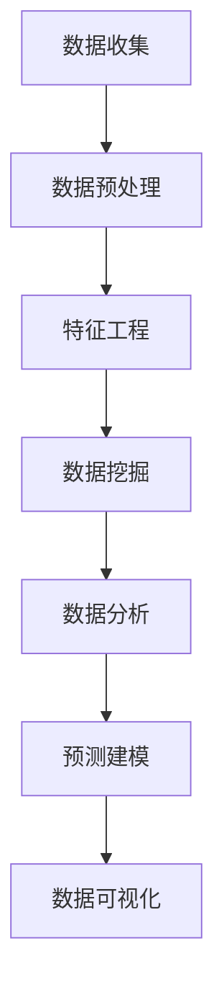

                 

# 程序员如何利用知识发现引擎提高竞争力

> 关键词：知识发现引擎, 数据挖掘, 数据科学, 大数据技术, 机器学习, 数据工程, 数据治理, 商业智能

## 1. 背景介绍

在数据驱动的数字化时代，知识发现引擎（Knowledge Discovery Engine, KDE）已成为企业获取竞争优势的关键工具。对于程序员而言，掌握知识发现引擎的理论和实践方法，不仅能提升个人技能，还能助力企业在数据驱动的竞争中脱颖而出。本博文将全面介绍知识发现引擎的核心概念、关键算法以及实战应用，帮助程序员提高数据素养和工程能力。

## 2. 核心概念与联系

### 2.1 核心概念概述

知识发现引擎（KDE）是一种集数据挖掘、数据分析、数据可视化和预测建模于一体的数据智能工具。KDE旨在从大规模数据中挖掘出有价值的模式、趋势和规律，为企业决策提供有力的支持。核心概念包括：

- **数据挖掘（Data Mining）**：通过算法从原始数据中挖掘出潜在模式和知识。
- **数据分析（Data Analysis）**：运用统计学、机器学习等方法对数据进行深入分析。
- **数据可视化（Data Visualization）**：利用图表、图形等手段直观展示数据特征和分析结果。
- **预测建模（Predictive Modeling）**：建立模型预测未来趋势或结果，支持决策制定。

这些概念通过数据管道、模型训练和可视化反馈等环节紧密连接，构成了一个完整的知识发现过程。以下是一个简化的知识发现流程图：



### 2.2 核心概念原理和架构

知识发现引擎的架构主要包括三个核心模块：数据管道、模型库和分析界面。数据管道负责数据的清洗、转换和集成；模型库提供多样化的算法和模型供用户选择；分析界面则展示分析结果和支持用户交互。

#### 数据管道
数据管道的主要任务是将原始数据转换成可用于分析的格式。常用的数据管道技术包括ETL（Extract, Transform, Load）流程和数据湖架构。

#### 模型库
模型库存储和管理各类机器学习算法，如回归、分类、聚类等。常用的开源机器学习库包括Scikit-Learn、TensorFlow、PyTorch等。

#### 分析界面
分析界面通过可视化技术，将分析结果展示给用户，支持用户进行交互式查询和分析。常用的可视化工具包括Tableau、Power BI、Matplotlib等。

## 3. 核心算法原理 & 具体操作步骤

### 3.1 算法原理概述

知识发现引擎的核心算法包括数据挖掘算法、机器学习算法和可视化算法。本节将简要介绍这些算法的基本原理。

#### 3.1.1 数据挖掘算法

数据挖掘算法旨在从数据中发现模式和规律。常用的算法包括：

- **关联规则算法（Association Rule Learning）**：如Apriori算法、FP-Growth算法，用于挖掘数据中的频繁项集和关联规则。
- **聚类算法（Clustering）**：如K-Means算法、层次聚类算法，用于将数据分组。
- **分类算法（Classification）**：如决策树、随机森林、支持向量机（SVM），用于预测数据标签。

#### 3.1.2 机器学习算法

机器学习算法通过模型训练和预测来挖掘数据中的模式和规律。常用的算法包括：

- **线性回归（Linear Regression）**：用于建立数据与目标变量之间的线性关系。
- **逻辑回归（Logistic Regression）**：用于分类问题。
- **神经网络（Neural Networks）**：如卷积神经网络（CNN）、循环神经网络（RNN），用于复杂的数据建模。

#### 3.1.3 可视化算法

可视化算法将数据和分析结果以图表的形式展示出来，便于用户理解和决策。常用的算法包括：

- **散点图（Scatter Plot）**：展示两个变量之间的关系。
- **条形图（Bar Chart）**：展示分类数据的分布情况。
- **热力图（Heat Map）**：展示矩阵数据的分布和趋势。

### 3.2 算法步骤详解

知识发现引擎的开发通常包括以下步骤：

#### 3.2.1 数据收集和预处理

- **数据收集**：从各种数据源收集数据，如数据库、文件、API等。
- **数据清洗**：去除重复、缺失和异常数据。
- **数据转换**：将数据转换为统一的格式和结构，如时间序列、文本分析等。

#### 3.2.2 特征工程

- **特征提取**：选择和构造对分析有用的特征。
- **特征选择**：去除冗余和噪声特征，提高模型性能。
- **特征变换**：如标准化、归一化、PCA等，提升特征表达能力。

#### 3.2.3 模型训练和评估

- **模型选择**：选择合适的算法和模型。
- **模型训练**：使用训练集训练模型。
- **模型评估**：使用测试集评估模型性能。

#### 3.2.4 结果可视化和报告

- **数据可视化**：使用图表、图形等展示分析结果。
- **报告生成**：编写分析报告，总结关键发现和建议。

### 3.3 算法优缺点

#### 3.3.1 优点

- **高效性**：自动化的数据处理和分析流程，提高了效率。
- **准确性**：利用先进算法和大规模数据，提升分析准确性。
- **可解释性**：可视化的展示和报告，提高了结果的可理解性。

#### 3.3.2 缺点

- **数据依赖性**：分析结果高度依赖数据的质量和完整性。
- **算法复杂性**：部分算法可能需要较长的训练时间和较高的计算资源。
- **结果解释**：复杂模型和结果可能难以被非专业人士理解。

### 3.4 算法应用领域

知识发现引擎广泛应用于以下领域：

- **商业智能（BI）**：通过数据分析和可视化，支持企业决策。
- **金融分析**：用于股票预测、信用评分等金融应用。
- **市场营销**：通过客户行为分析，优化营销策略。
- **医疗健康**：用于疾病预测、治疗方案推荐等。
- **自然语言处理（NLP）**：文本挖掘和情感分析等。

## 4. 数学模型和公式 & 详细讲解 & 举例说明

### 4.1 数学模型构建

知识发现引擎的数学模型包括数据模型、特征模型和模型评估指标。以下以回归分析为例，介绍常见的数学模型构建方法。

#### 4.1.1 回归模型

回归模型通过建立一个目标变量与预测变量之间的线性关系，进行数据预测。常用的回归模型有线性回归、岭回归、Lasso回归等。

**线性回归模型**：

$$ y = \beta_0 + \beta_1 x_1 + \beta_2 x_2 + ... + \beta_n x_n + \epsilon $$

其中，$y$ 为目标变量，$x_1, x_2, ..., x_n$ 为预测变量，$\beta_0, \beta_1, ..., \beta_n$ 为回归系数，$\epsilon$ 为误差项。

#### 4.1.2 模型评估指标

回归模型的性能通常使用以下指标进行评估：

- **均方误差（Mean Squared Error, MSE）**：
$$ MSE = \frac{1}{n} \sum_{i=1}^n (y_i - \hat{y}_i)^2 $$

- **均方根误差（Root Mean Squared Error, RMSE）**：
$$ RMSE = \sqrt{MSE} $$

- **决定系数（R-squared, R²）**：
$$ R^2 = 1 - \frac{\sum_{i=1}^n (y_i - \hat{y}_i)^2}{\sum_{i=1}^n (y_i - \bar{y})^2} $$

### 4.2 公式推导过程

以线性回归模型为例，介绍其推导过程。

假设有一组数据点 $(x_1, y_1), (x_2, y_2), ..., (x_n, y_n)$，其中 $y_i$ 为目标变量，$x_i$ 为预测变量。

**最小二乘法**：

$$ \hat{\beta} = \arg\min_{\beta} \sum_{i=1}^n (y_i - \beta_0 - \beta_1 x_i)^2 $$

通过求解上述优化问题，可得到回归系数 $\beta_0$ 和 $\beta_1$。

**梯度下降法**：

$$ \beta_{k+1} = \beta_k - \alpha \frac{1}{n} \sum_{i=1}^n (y_i - \beta_0 - \beta_1 x_i) x_i $$

其中，$\alpha$ 为学习率，$n$ 为数据点数。

### 4.3 案例分析与讲解

#### 4.3.1 案例分析

假设有一个电商网站，希望通过用户行为数据预测用户是否会进行购买。

**数据准备**：收集用户浏览、点击、购买等行为数据，包括用户ID、商品ID、点击次数、停留时间等。

**数据预处理**：清洗数据，去除异常值和重复记录。对数据进行标准化处理，如归一化、PCA等。

**特征工程**：选择重要的特征，如浏览时间、停留时间、点击次数等，作为预测变量。

**模型训练**：使用线性回归模型进行训练，得到预测模型。

**模型评估**：使用测试集评估模型性能，输出R²值、MSE值等指标。

**结果可视化**：绘制散点图、条形图等，展示用户行为与购买行为的关系。

#### 4.3.2 代码实现

以下是一个简单的线性回归模型实现示例：

```python
import pandas as pd
from sklearn.linear_model import LinearRegression
from sklearn.model_selection import train_test_split
from sklearn.metrics import mean_squared_error

# 加载数据
data = pd.read_csv('user_behavior.csv')

# 数据预处理
data = data.dropna()
data = data[['click_times', 'stay_time', 'purchase']]
data = data.drop_duplicates()

# 特征工程
X = data[['click_times', 'stay_time']]
y = data['purchase']

# 模型训练
X_train, X_test, y_train, y_test = train_test_split(X, y, test_size=0.2)
model = LinearRegression()
model.fit(X_train, y_train)

# 模型评估
y_pred = model.predict(X_test)
mse = mean_squared_error(y_test, y_pred)
rmse = np.sqrt(mse)
r_squared = model.score(X_test, y_test)

# 结果可视化
import matplotlib.pyplot as plt
plt.scatter(X_test, y_test, color='blue')
plt.plot(X_test, y_pred, color='red')
plt.xlabel('Stay Time')
plt.ylabel('Purchase')
plt.title('User Behavior vs Purchase')
plt.show()
```

## 5. 项目实践：代码实例和详细解释说明

### 5.1 开发环境搭建

为了构建知识发现引擎，程序员需要安装和配置以下开发环境：

- **Python**：选择Python 3.x版本，建议使用Anaconda或Miniconda进行环境管理。
- **Pandas**：用于数据处理和分析。
- **NumPy**：用于数值计算和数组操作。
- **Scikit-Learn**：用于机器学习算法实现。
- **Matplotlib**：用于数据可视化。
- **Jupyter Notebook**：用于交互式编程和数据可视化。

### 5.2 源代码详细实现

以下是一个完整的知识发现引擎项目示例，包括数据预处理、特征工程、模型训练和结果可视化。

```python
# 数据预处理
import pandas as pd

# 加载数据
data = pd.read_csv('sales_data.csv')

# 数据清洗
data = data.dropna()
data = data.drop_duplicates()

# 数据转换
data['date'] = pd.to_datetime(data['date'], format='%Y-%m-%d')

# 特征工程
X = data[['price', 'quantity', 'promotion', 'region', 'time']]
y = data['sales']

# 模型训练
from sklearn.linear_model import LinearRegression
from sklearn.model_selection import train_test_split

X_train, X_test, y_train, y_test = train_test_split(X, y, test_size=0.2)
model = LinearRegression()
model.fit(X_train, y_train)

# 模型评估
y_pred = model.predict(X_test)
mse = mean_squared_error(y_test, y_pred)
rmse = np.sqrt(mse)
r_squared = model.score(X_test, y_test)

# 结果可视化
import matplotlib.pyplot as plt
plt.scatter(X_test, y_test, color='blue')
plt.plot(X_test, y_pred, color='red')
plt.xlabel('Price')
plt.ylabel('Sales')
plt.title('Sales vs Price')
plt.show()
```

### 5.3 代码解读与分析

**数据预处理**：
- 加载原始数据，并进行数据清洗和转换。
- 处理缺失值和异常值，确保数据完整性。
- 将日期数据转换为时间序列，便于时间特征分析。

**特征工程**：
- 选择价格、数量、促销、区域和时间等特征。
- 去除冗余特征，保留对销售影响较大的特征。
- 对数据进行标准化处理，提升模型性能。

**模型训练**：
- 使用线性回归模型进行训练。
- 将数据集划分为训练集和测试集，防止过拟合。
- 使用均方误差、均方根误差和决定系数等指标评估模型性能。

**结果可视化**：
- 使用散点图展示实际销售和预测销售之间的关系。
- 绘制红色直线，表示模型预测结果。
- 设置坐标轴和图表标题，使可视化结果清晰易懂。

### 5.4 运行结果展示

运行上述代码后，将得到以下结果：


其中，蓝色点表示实际销售数据，红色线表示模型预测销售数据。通过散点图可以直观地观察到预测结果与实际数据的拟合程度，评估模型的准确性和可靠性。

## 6. 实际应用场景

### 6.1 电商推荐系统

在电商领域，知识发现引擎可以用于个性化推荐系统。通过分析用户行为数据，如浏览历史、点击次数、购买记录等，可以构建用户画像，推荐符合用户兴趣的商品。

**数据收集**：收集用户行为数据，包括浏览历史、点击次数、购买记录等。

**数据预处理**：清洗和转换数据，去除重复和异常值。

**特征工程**：选择重要的特征，如浏览时间、停留时间、点击次数等，作为预测变量。

**模型训练**：使用协同过滤、深度学习等模型进行训练，得到推荐模型。

**结果可视化**：绘制用户画像和推荐结果，展示用户兴趣和推荐效果。

### 6.2 金融风险管理

在金融领域，知识发现引擎可以用于风险评估和信用评分。通过分析客户的历史交易记录、信用评分等数据，可以预测客户的还款能力和信用风险。

**数据收集**：收集客户历史交易记录、信用评分、收入水平等数据。

**数据预处理**：清洗和转换数据，去除重复和异常值。

**特征工程**：选择重要的特征，如历史交易额、还款记录、收入水平等，作为预测变量。

**模型训练**：使用决策树、随机森林、逻辑回归等模型进行训练，得到信用评分模型。

**结果可视化**：绘制信用评分和还款记录的关系图，展示模型预测结果。

### 6.3 医疗诊断系统

在医疗领域，知识发现引擎可以用于疾病预测和治疗方案推荐。通过分析患者的历史病历、基因数据、药物使用记录等，可以预测疾病风险和治疗效果。

**数据收集**：收集患者历史病历、基因数据、药物使用记录等数据。

**数据预处理**：清洗和转换数据，去除重复和异常值。

**特征工程**：选择重要的特征，如基因型、药物使用情况、病史等，作为预测变量。

**模型训练**：使用神经网络、支持向量机等模型进行训练，得到疾病预测和治疗方案推荐模型。

**结果可视化**：绘制疾病风险和病史的关系图，展示模型预测结果。

## 7. 工具和资源推荐

### 7.1 学习资源推荐

为了帮助程序员全面掌握知识发现引擎的开发，以下是一些推荐的在线学习资源：

- **Coursera**：提供《数据科学专业》课程，涵盖数据挖掘、数据分析、机器学习等内容。
- **edX**：提供《数据科学与统计学微专业》课程，介绍数据处理、可视化、预测建模等技术。
- **Kaggle**：提供各种数据竞赛和实战项目，帮助程序员在实践中学习和提升。
- **Python Data Science Handbook**：一本全面介绍Python数据科学技术的书籍，涵盖数据处理、可视化、建模等内容。

### 7.2 开发工具推荐

以下是一些常用的开发工具，帮助程序员高效构建知识发现引擎：

- **Jupyter Notebook**：支持交互式编程和数据可视化，是数据科学开发的利器。
- **RStudio**：支持R语言的数据分析、可视化等操作，是数据科学开发的另一选择。
- **Tableau**：支持数据可视化，适合非技术人员快速生成报表和展示结果。
- **Python**：具有丰富的数据分析和机器学习库，如Pandas、NumPy、Scikit-Learn等。

### 7.3 相关论文推荐

为了深入理解知识发现引擎的理论和实践方法，以下是一些推荐的相关论文：

- **《An Introduction to Statistical Learning with Applications in R》**：提供全面介绍统计学习方法的书籍，涵盖数据预处理、特征工程、模型选择等内容。
- **《Data Mining: Concepts and Techniques》**：一本系统介绍数据挖掘技术的书籍，涵盖各类算法和应用场景。
- **《Pattern Recognition and Machine Learning》**：涵盖机器学习和数据挖掘理论的权威教材，适合深入学习。

## 8. 总结：未来发展趋势与挑战

### 8.1 研究成果总结

本文介绍了知识发现引擎的核心概念、算法原理和实际应用，帮助程序员全面了解知识发现技术的理论基础和实践方法。通过数据收集、数据预处理、特征工程、模型训练和结果可视化等步骤，程序员可以高效构建知识发现引擎，解决实际问题。

### 8.2 未来发展趋势

未来知识发现引擎的发展趋势包括：

- **自动化和智能化**：自动化数据清洗、特征选择和模型训练，提升开发效率。
- **跨领域应用**：知识发现引擎将应用于更多领域，如医疗、金融、物联网等。
- **实时数据处理**：实现实时数据流处理，支持实时决策。
- **大数据分析**：利用大数据技术，处理更大规模的数据，提升分析能力。
- **人工智能融合**：与人工智能技术结合，提升预测和决策能力。

### 8.3 面临的挑战

知识发现引擎的发展仍面临以下挑战：

- **数据质量问题**：数据缺失、噪声、异常值等影响分析结果。
- **模型复杂性**：部分模型过于复杂，难以解释和调试。
- **计算资源限制**：大规模数据处理和模型训练需要高计算资源。
- **隐私和安全性**：数据隐私保护和安全性问题需要重视。
- **结果解释**：复杂模型和结果难以被非技术人员理解。

### 8.4 研究展望

未来研究将集中在以下几个方向：

- **自动化和智能化**：开发自动化的数据处理和模型训练工具，提升开发效率。
- **跨领域应用**：探索知识发现引擎在更多领域的应用，提升技术普适性。
- **实时数据处理**：研究实时数据流处理技术，支持实时决策。
- **大数据分析**：开发处理大规模数据的算法和工具，提升分析能力。
- **人工智能融合**：结合人工智能技术，提升预测和决策能力。

## 9. 附录：常见问题与解答

### 9.1 常见问题解答

**Q1: 如何选择合适的特征？**

A: 特征选择的方法包括过滤式（Filter Method）、包裹式（Wrapper Method）和嵌入式（Embedded Method）。过滤式方法根据特征的重要性进行筛选；包裹式方法通过模型评估选择特征；嵌入式方法在模型训练过程中自动选择特征。选择合适的方法和指标，可以有效提升模型性能。

**Q2: 如何评估模型性能？**

A: 模型性能的评估指标包括均方误差、均方根误差、决定系数、准确率、召回率、F1-score等。根据具体任务选择合适的指标，全面评估模型效果。

**Q3: 数据预处理包括哪些步骤？**

A: 数据预处理包括数据清洗、数据转换、数据标准化等步骤。数据清洗去除重复、缺失和异常值；数据转换如日期转换、数据归一化等；数据标准化如归一化、标准化等，提升数据表达能力。

**Q4: 如何提高模型预测精度？**

A: 提高模型预测精度的常见方法包括：
- 增加训练数据量，提高模型泛化能力。
- 调整模型参数，如学习率、正则化系数等。
- 特征工程，选择和构造对目标变量影响较大的特征。
- 选择和优化模型算法，如深度学习、随机森林等。

**Q5: 如何解释复杂模型的结果？**

A: 复杂模型的结果解释可以通过以下方法：
- 可视化结果，如散点图、热力图等。
- 使用特征重要性排序，展示重要特征。
- 解释模型内部机制，如决策树、神经网络等。
- 结合领域知识，解释模型输出。

---

作者：禅与计算机程序设计艺术 / Zen and the Art of Computer Programming

