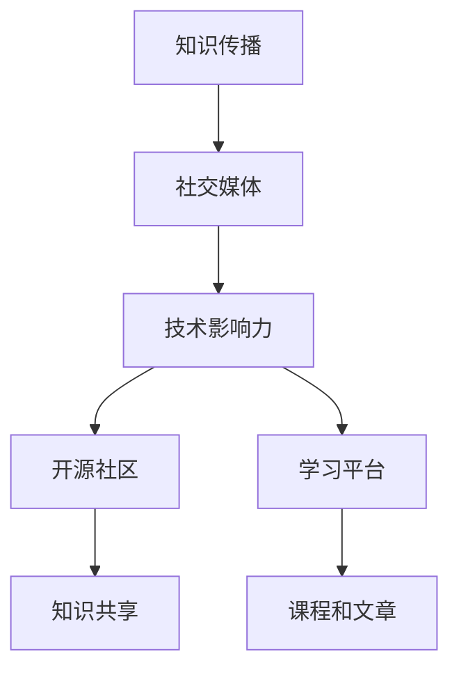

                 

# 程序员如何利用社交媒体扩大知识影响力

> 关键词：知识传播, 社交媒体, 技术影响力, 网络效应, 开源社区, 学习平台

## 1. 背景介绍

在当今信息爆炸的时代，社交媒体已成为知识传播的重要渠道之一。对于程序员而言，利用社交媒体平台，不仅能快速获取最新技术动态，还能分享个人经验，建立影响力，推动知识传播。本文将深入探讨程序员如何通过社交媒体扩大自己的知识影响力。

## 2. 核心概念与联系

### 2.1 核心概念概述

- **知识传播**：指通过各种渠道将知识从个体传递到更广泛受众的过程。
- **社交媒体**：指通过互联网平台，让用户之间进行互动和分享信息的应用程序，如Twitter、GitHub、LinkedIn等。
- **技术影响力**：程序员通过社交媒体分享知识、参与讨论，获得的关注度和认可度。
- **网络效应**：社交媒体平台上，用户越多，平台价值越高，吸引更多用户加入的效应。
- **开源社区**：基于开放源码的软件共享平台，程序员在其中分享代码、讨论技术问题。
- **学习平台**：如Coursera、Udemy等，提供在线课程、技术文章等学习资源。

这些概念之间有着紧密的联系。社交媒体为知识传播提供了新途径，网络效应使得知识传播更加广泛和深入，而开源社区和学习平台则提供了知识传播的平台和载体。程序员通过在这些平台上积极参与，能够扩大自己的知识影响力。

### 2.2 核心概念原理和架构的 Mermaid 流程图



该图展示了知识传播、社交媒体、技术影响力、开源社区和学习平台之间的相互关系和作用。知识通过社交媒体传播，进而影响程序员的技术影响力；而开源社区和学习平台则是知识传播的重要渠道。

## 3. 核心算法原理 & 具体操作步骤

### 3.1 算法原理概述

程序员利用社交媒体扩大知识影响力的核心算法原理在于利用网络效应和正反馈机制。当程序员在社交媒体上分享技术文章、解答技术问题、参与讨论时，会吸引更多关注和互动，从而形成正反馈循环，逐步扩大影响力。

### 3.2 算法步骤详解

1. **选择合适的社交媒体平台**：根据目标受众和内容类型选择合适的平台，如Twitter适合发布短消息，GitHub适合分享代码，LinkedIn适合建立职业网络。

2. **内容创作**：
   - **技术文章**：撰写深入浅出的技术文章，介绍最新的技术趋势、工具使用方法、项目实践经验等。
   - **代码分享**：将优秀的代码项目、开源工具包等发布到GitHub上，吸引用户关注和star。
   - **解答问题**：在技术论坛、Stack Overflow等平台上积极解答技术问题，提供有价值的见解和解决方案。

3. **互动交流**：
   - **评论互动**：在社交媒体上积极回复评论和私信，与读者建立良好的互动关系。
   - **参与讨论**：加入技术社区、微信群等，参与相关讨论，分享见解。

4. **持续更新**：
   - **持续创作**：定期更新社交媒体内容，保持与读者和社区的互动。
   - **跟踪热点**：关注技术热点和趋势，及时调整分享内容，保持新鲜感。

### 3.3 算法优缺点

**优点**：
- **快速传播**：社交媒体平台拥有强大的用户基础和网络效应，可以迅速传播知识。
- **多样性**：不同的社交媒体平台适合不同类型的内容分享，如技术文章、代码、视频等。
- **互动性强**：能够与读者和社区进行实时互动，及时获取反馈。

**缺点**：
- **信息过载**：社交媒体平台信息量巨大，容易导致内容被淹没。
- **时间投入**：需要投入大量时间进行内容创作和互动。
- **质量控制**：需确保内容质量和准确性，避免误导读者。

### 3.4 算法应用领域

程序员利用社交媒体扩大知识影响力的应用领域包括：
- **技术分享**：在社交媒体上分享最新的技术动态、工具使用方法、项目实践经验等。
- **开源贡献**：通过社交媒体宣传开源项目，吸引更多用户参与贡献。
- **职业发展**：通过LinkedIn等职业社交平台建立职业网络，拓展职业机会。
- **教育培训**：利用学习平台发布课程和文章，吸引学生和同行学习。

## 4. 数学模型和公式 & 详细讲解 & 举例说明

### 4.1 数学模型构建

假设社交媒体平台上，程序员分享技术内容的总影响力为 \( I \)，包括文章阅读数、代码star数、互动评论数等。设社交媒体用户数量为 \( U \)，每个用户平均关注数为 \( C \)，分享内容的传播因子为 \( F \)。则社交媒体上的内容影响力公式为：

$$ I = U \times C \times F \times P $$

其中 \( P \) 为内容传播的路径数。

### 4.2 公式推导过程

在社交媒体上，内容的影响力 \( I \) 与用户数 \( U \)、每个用户平均关注数 \( C \)、传播因子 \( F \) 和内容传播路径数 \( P \) 成正比。内容传播路径数 \( P \) 取决于内容的吸引力，高质量的内容能吸引更多用户传播和互动。

### 4.3 案例分析与讲解

以GitHub为例，程序员通过发布优秀的开源项目，能够吸引更多star和fork，增加项目的可见度。假设一个项目被10个用户star，每个用户平均关注数为100，传播因子为0.5，则该项目在社交媒体上的影响力为：

$$ I = 10 \times 100 \times 0.5 \times P $$

随着项目star数和用户关注度的增加，社交媒体上的影响力呈指数级增长。

## 5. 项目实践：代码实例和详细解释说明

### 5.1 开发环境搭建

1. **选择社交媒体平台**：根据自己的内容和受众选择Twitter、GitHub、LinkedIn等平台。
2. **注册和配置账户**：注册并配置账户信息，设置个人资料、头像等。
3. **选择合适的编辑器和工具**：如Visual Studio Code、Git、GitHub Desktop等。

### 5.2 源代码详细实现

1. **编写技术文章**：使用Markdown或HTML格式编写文章，发布到博客或Medium等平台。
2. **创建GitHub仓库**：在GitHub上创建仓库，上传代码项目和文档。
3. **发布到社交媒体**：将文章链接、GitHub仓库链接等分享到Twitter、LinkedIn等平台。

### 5.3 代码解读与分析

以在GitHub上发布开源项目为例，具体步骤如下：

```bash
# 创建仓库
git init
git remote add origin https://github.com/username/repo.git
git add .
git commit -m "Initial commit"
git push -u origin master

# 创建README.md文件
echo "## My Project" > README.md

# 上传代码
echo "console.log('Hello World!');" > index.js
git add .
git commit -m "Add Hello World script"
git push

# 添加许可证和依赖
echo "MIT License" > LICENSE.md
npm init -y
npm install express
git add .
git commit -m "Add LICENSE and express"
git push

# 创建Dockerfile和Makefile
echo "FROM node:16" > Dockerfile
echo "RUN npm install" > Makefile
git add .
git commit -m "Add Dockerfile and Makefile"
git push

# 发布代码
git push origin main
```

代码中，首先创建仓库并上传代码，然后添加README.md、许可证、依赖和Dockerfile等文件，最后发布到GitHub。通过这种流程，能够系统地组织和分享项目代码。

### 5.4 运行结果展示

在GitHub上发布项目后，可以展示项目的star数和fork数，以及项目的GitHub Pages等页面。例如，一个具有100个star的项目，其影响力和可见度将显著提升。

## 6. 实际应用场景

### 6.1 技术分享

在Twitter上发布最新的技术动态和使用方法，吸引开发者关注和讨论。例如，某程序员发布了一篇关于Node.js最新版本的文章，吸引了数千条评论和转发，提高了其技术影响力。

### 6.2 开源贡献

在GitHub上分享高质量的开源项目，吸引开发者贡献代码和问题反馈。例如，某程序员发布了一个用于数据可视化的开源库，吸引了数百个star和fork，项目社区活跃，开发者积极贡献代码。

### 6.3 职业发展

在LinkedIn上分享职业经验和招聘信息，吸引同行和雇主的关注。例如，某程序员在LinkedIn上分享了最新的技术栈和招聘信息，吸引了数十个猎头和招聘人员的关注。

### 6.4 教育培训

在Coursera、Udemy等学习平台上发布技术课程和文章，吸引学生和同行学习。例如，某程序员在Coursera上发布了一门关于Python数据科学课程，吸引了数百名学生报名学习。

## 7. 工具和资源推荐

### 7.1 学习资源推荐

- **Medium**：发表技术文章的平台，支持Markdown和HTML格式。
- **GitHub**：开源代码托管平台，适合分享代码和项目。
- **Stack Overflow**：技术问答社区，适合解答技术问题和分享解决方案。
- **Twitter**：快速发布短消息和链接的平台。
- **LinkedIn**：职业社交平台，适合建立职业网络和分享职业经验。

### 7.2 开发工具推荐

- **Visual Studio Code**：轻量级代码编辑器，支持多种编程语言和插件。
- **Git**：版本控制系统，适合代码协作和项目管理。
- **GitHub Desktop**：GitHub的桌面客户端，方便管理和发布代码。
- **GitHub Pages**：GitHub提供的静态网站托管服务，适合发布个人博客和技术文章。

### 7.3 相关论文推荐

- **"Social Media and Science"**：Braza和Kaplan的研究，探讨社交媒体对科学传播的影响。
- **"Diffusion of Innovations in Online Platforms"**：Davis和O'Neal的研究，分析在线平台上的创新扩散模型。
- **"Collaborative Filtering for Recommendation Systems"**：Bengio和Courville的研究，探讨推荐系统的协同过滤算法。

## 8. 总结：未来发展趋势与挑战

### 8.1 研究成果总结

本文探讨了程序员如何利用社交媒体扩大知识影响力，并从算法原理、操作步骤等方面进行了系统分析。主要结论如下：
- 社交媒体平台提供了强大的知识传播渠道，程序员通过积极参与，能够快速扩大影响力。
- 网络效应和正反馈机制使得知识传播更加广泛和深入。
- 高质量的内容是扩大影响力的关键。

### 8.2 未来发展趋势

未来，社交媒体平台上的知识传播将更加多样化和复杂化，开发者需要更加灵活地使用不同平台和工具，以最大化传播效果。同时，社交媒体平台也在不断优化算法，提升内容推荐的精准性和用户互动的互动性。

### 8.3 面临的挑战

- **信息过载**：社交媒体平台信息量巨大，开发者需筛选有价值的内容进行分享。
- **时间投入**：需要投入大量时间进行内容创作和互动。
- **质量控制**：需确保内容质量和准确性，避免误导读者。

### 8.4 研究展望

未来的研究应重点关注以下几点：
- **内容推荐算法**：研究新的内容推荐算法，提高内容推荐的精准性和覆盖面。
- **互动质量提升**：通过数据分析和算法优化，提升用户互动的质量和效率。
- **多平台协同**：探索不同社交媒体平台的协同传播机制，最大化知识传播效果。

## 9. 附录：常见问题与解答

**Q1：如何选择合适的社交媒体平台？**

A: 根据内容类型和受众选择适合的社交媒体平台，如技术文章适合在Medium和博客上发布，代码项目适合在GitHub上托管。

**Q2：如何提高社交媒体上的影响力？**

A: 持续创作高质量内容，积极参与互动，利用社交媒体平台推荐算法，扩大内容的覆盖范围。

**Q3：如何平衡时间投入和内容质量？**

A: 制定合理的发布计划，利用自动化工具提高效率，如使用GitHub Actions自动构建代码项目。

**Q4：如何避免内容过载？**

A: 选择有针对性的平台和受众，确保内容的相关性和价值，避免泛泛而谈。

**Q5：如何确保内容质量？**

A: 利用代码审查和用户反馈，不断优化和改进内容，确保准确性和实用性。

---

作者：禅与计算机程序设计艺术 / Zen and the Art of Computer Programming

