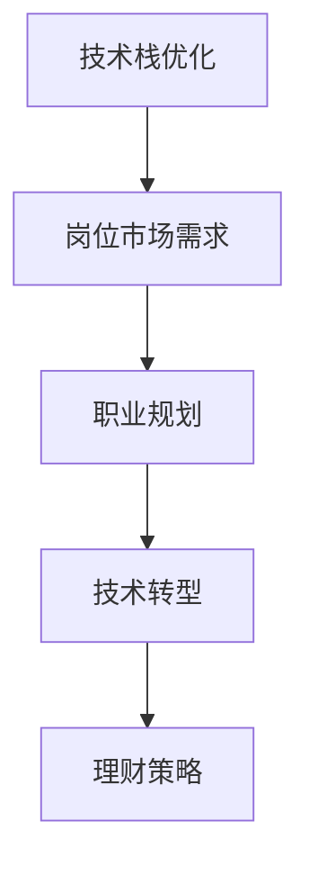

                 

# 程序员如何在经济衰退中保值增值

> 关键词：技术栈优化、岗位市场需求、职业规划、技术转型、理财策略

## 1. 背景介绍

### 1.1 问题由来
随着全球经济的不确定性增加，许多行业遭受冲击，失业率上升，技术栈更新速度加快，职场竞争加剧。作为一名程序员，如何在动荡的经济环境中保值增值，成为当务之急。

本文将深入探讨在经济衰退时期，程序员如何通过技术栈优化、岗位市场需求、职业规划、技术转型和理财策略等方面进行自我提升，保持竞争力和财务健康。

## 2. 核心概念与联系

### 2.1 核心概念概述

为更好地理解如何在经济衰退中保值增值，本节将介绍几个关键概念：

- **技术栈优化**：指的是通过更新和升级技术栈，提升个人技术能力和市场竞争力。在技术更新迅速的时代，熟练掌握新的技术框架和工具，可以使程序员更好地适应行业变化。
- **岗位市场需求**：指不同技术岗位在市场上的供需状况。了解哪些技术岗位需求量大、薪资高，可以帮助程序员更有针对性地学习和提升技能。
- **职业规划**：是指在职业生涯不同阶段，明确职业目标和步骤，制定和实施职业发展计划。经济衰退期，更加注重长远的职业规划，有助于避免职业风险，实现长期职业发展。
- **技术转型**：指在不同技术岗位之间，或是从旧技术向新技术的迁移。技术转型需要跨学科知识和适应新环境的灵活性。
- **理财策略**：通过合理的财务管理和投资，保障个人财务健康，减少财务风险。在经济不确定期，理财策略尤为重要。

这些概念之间的逻辑关系可以通过以下Mermaid流程图来展示：



这个流程图展示了几大核心概念及其之间的关系：

1. 技术栈优化是基础，通过技术提升满足市场需要。
2. 岗位市场需求指导职业规划方向。
3. 职业规划在技术转型中起到关键作用。
4. 技术转型是职业发展的重要环节。
5. 理财策略在经济不确定期保障财务健康。

## 3. 核心算法原理 & 具体操作步骤

### 3.1 算法原理概述

经济衰退中保值增值的核心算法原理，在于通过市场分析和自我提升策略，实现个人技能的升级和财务的稳健。

具体步骤如下：

1. **技术栈优化**：选择合适的技术栈，紧跟技术前沿，提升技术能力。
2. **岗位市场需求**：分析市场对不同技术的供需，确定提升方向。
3. **职业规划**：基于市场需求和个人兴趣，制定详细的职业发展计划。
4. **技术转型**：跨学科学习和实践，掌握新的技术领域。
5. **理财策略**：根据个人财务状况，选择合适的理财方式。

### 3.2 算法步骤详解

#### 3.2.1 技术栈优化

**步骤1：市场调研**

- **方法**：通过技术论坛、招聘网站和专业书籍，了解当前技术市场的热门技能。
- **工具**：GitHub trends、LinkedIn Tech Jobs、Stack Overflow等。
- **实施**：定期查看相关网站，跟踪技术趋势和岗位需求。

**步骤2：技能评估**

- **方法**：进行个人技术水平评估，列出已有技能和需要提升的技能。
- **工具**：自我评估问卷、技术能力测试。
- **实施**：对照市场调研结果，找出自身技能缺口，并制定提升计划。

**步骤3：技能学习**

- **方法**：选择适合的技术框架和工具，参加线上/线下课程，自学或参加培训。
- **工具**：Udacity、Coursera、edX、Codecademy等。
- **实施**：制定详细的学习计划，并严格执行。

**步骤4：技能实践**

- **方法**：在实际项目中应用新学到的技能，提升实战经验。
- **工具**：个人项目、开源项目、实习机会。
- **实施**：参与开源项目，或在工作中寻找实践机会。

#### 3.2.2 岗位市场需求

**步骤1：数据收集**

- **方法**：使用职位描述分析工具，如Jobscan、Hired等，收集岗位需求数据。
- **工具**：Jobscan、Hired、Indeed等。
- **实施**：定期收集岗位数据，分析热门技能和岗位要求。

**步骤2：数据分析**

- **方法**：对收集到的数据进行清洗、整理和分析，找出高频需求的技能和岗位。
- **工具**：Python Pandas、Excel、Tableau等。
- **实施**：使用数据分析方法，如频率分析、关键字提取等，确定市场需求。

**步骤3：技能匹配**

- **方法**：将市场需求与个人技能进行匹配，找出需要提升的技能和岗位。
- **工具**：个人技能清单、市场需求报告。
- **实施**：根据分析结果，调整技能学习计划。

#### 3.2.3 职业规划

**步骤1：目标设定**

- **方法**：设定明确的职业目标，包括短期和长期目标。
- **工具**：SMART目标设定法、OKR目标管理法。
- **实施**：明确岗位技能要求、职业发展路径。

**步骤2：路径规划**

- **方法**：根据目标设定，规划具体步骤，包括学习内容、时间安排和评估标准。
- **工具**：Google Calendar、Trello等项目管理工具。
- **实施**：制定详细的职业发展计划，并定期回顾和调整。

**步骤3：资源整合**

- **方法**：整合各种资源，包括时间、资金和外部支持，确保计划的执行。
- **工具**：时间管理工具、学习社区、职业指导顾问。
- **实施**：制定详细的资源配置计划，并灵活调整。

#### 3.2.4 技术转型

**步骤1：选择转型方向**

- **方法**：结合市场调研和个人兴趣，选择适合的转型方向。
- **工具**：SWOT分析、行业报告。
- **实施**：列出多种转型选项，并进行优劣分析。

**步骤2：技能迁移**

- **方法**：利用已有技能进行跨领域学习，快速掌握新技能。
- **工具**：MOOCs、在线课程、项目实践。
- **实施**：制定详细的转型计划，逐步学习新技能。

**步骤3：实战应用**

- **方法**：在新岗位上实践新技能，积累经验。
- **工具**：实习机会、新项目、技术社区。
- **实施**：积极参与新项目，不断提升实战能力。

#### 3.2.5 理财策略

**步骤1：财务评估**

- **方法**：评估个人财务状况，包括收入、支出、储蓄和投资。
- **工具**：Excel、Google Sheets、个人理财软件。
- **实施**：定期评估财务状况，找出改进空间。

**步骤2：风险管理**

- **方法**：制定风险管理策略，分散财务风险。
- **工具**：多样化投资组合、保险计划。
- **实施**：选择多种投资方式，如股票、债券、基金等，进行风险分散。

**步骤3：投资规划**

- **方法**：根据财务状况和风险偏好，选择适合的投资策略。
- **工具**：Robo-advisor、投资顾问。
- **实施**：制定投资计划，定期调整投资组合，以达到财务目标。

## 4. 数学模型和公式 & 详细讲解 & 举例说明

### 4.1 数学模型构建

在经济衰退期间，程序员保值增值的数学模型可以简化为以下模型：

设个人技能提升的收益为 $R$，市场对技能的需求为 $D$，个人成本为 $C$，理财收益为 $F$。则个人总收益 $P$ 可以表示为：

$$P = R \times D - C + F$$

其中，技能提升收益 $R$ 与市场需求 $D$ 成正比，个人成本 $C$ 与技能提升难度成正比，理财收益 $F$ 与投资策略选择和市场环境相关。

### 4.2 公式推导过程

- **需求函数**：设市场需求为 $D=f(x)$，其中 $x$ 表示技能水平。通常，市场需求随技能提升而增加。
- **收益函数**：技能提升收益 $R=R(x)$，通常随技能提升而增加。
- **成本函数**：个人成本 $C=C(x)$，通常随技能提升难度而增加。
- **理财收益函数**：理财收益 $F=F(x)$，通常随市场环境和投资策略而变化。

通过构建上述数学模型，可以量化分析不同技能提升和理财策略下的个人总收益。

### 4.3 案例分析与讲解

假设某程序员初始技能水平为 $x_0$，市场对技能 $x$ 的需求为 $D(x)$，技能提升收益为 $R(x)$，个人成本为 $C(x)$，理财收益为 $F(x)$。

- **场景1**：若市场需求随技能提升而线性增长，即 $D(x)=kx$，技能提升收益为 $R(x)=ax+b$，个人成本为 $C(x)=cx^2$。
  - **推导**：市场需求和技能提升收益与市场需求成正比，个人成本与技能提升难度成正比。
  - **求解**：最大化总收益 $P(x)=R(x)D(x)-C(x)+F(x)$，求解 $x$ 以获得最优技能水平。

- **场景2**：若市场需求为饱和状态，即 $D(x)=k$，技能提升收益为 $R(x)=ax+b$，个人成本为 $C(x)=c$。
  - **推导**：市场需求为固定值，技能提升收益和成本随技能提升而变化。
  - **求解**：最大化总收益 $P(x)=R(x)D(x)-C(x)+F(x)$，求解 $x$ 以获得最优技能水平。

## 5. 项目实践：代码实例和详细解释说明

### 5.1 开发环境搭建

**环境要求**：

- **编程语言**：Python、Java、C#
- **开发工具**：VSCode、PyCharm、Eclipse
- **版本控制**：Git、SVN
- **数据管理**：MySQL、PostgreSQL
- **项目框架**：Spring、Django、Flask
- **测试工具**：JUnit、PyTest、TestNG

**搭建流程**：

1. **安装开发环境**：安装Python、Java、C#、VSCode等工具。
2. **配置开发环境**：配置Git、MySQL等数据库，设置开发工具。
3. **项目初始化**：创建新项目，编写基本框架。
4. **版本控制**：使用Git进行代码版本控制，记录开发进度。
5. **项目测试**：编写单元测试、集成测试、性能测试等，确保代码质量。

### 5.2 源代码详细实现

以下是一个Python代码示例，展示如何根据市场需求，动态调整技能提升策略：

```python
import pandas as pd
import numpy as np
from sklearn.linear_model import LinearRegression

# 模拟市场需求数据
x = np.array([1, 2, 3, 4, 5])
y = np.array([100, 200, 300, 400, 500])

# 使用线性回归拟合市场需求
model = LinearRegression()
model.fit(x.reshape(-1, 1), y)

# 预测市场需求
x_test = np.array([6, 7, 8, 9, 10])
y_pred = model.predict(x_test.reshape(-1, 1))

# 输出预测结果
print(y_pred)
```

**代码解读**：

- **数据准备**：创建市场需求数据，模拟市场需求与技能水平的关系。
- **模型训练**：使用线性回归模型拟合市场需求，找到市场需求与技能水平的关系。
- **预测需求**：使用模型对新技能水平进行预测，获取市场需求。
- **结果输出**：输出预测结果，指导技能提升方向。

### 5.3 代码解读与分析

**代码逻辑**：

1. **数据准备**：使用NumPy生成模拟市场需求数据。
2. **模型训练**：使用Scikit-Learn的LinearRegression模型，对市场需求数据进行拟合，得到市场需求与技能水平的关系。
3. **预测需求**：使用训练好的模型，对新技能水平进行预测，获取市场需求。
4. **结果输出**：输出预测结果，指导技能提升方向。

**代码优化**：

- **并行计算**：使用多线程或多进程进行模型训练和预测，提升计算效率。
- **数据缓存**：使用缓存技术，减少重复计算，提高数据访问速度。
- **算法优化**：使用更高效的算法，如梯度下降、随机森林等，提高模型精度和计算速度。

## 6. 实际应用场景

### 6.1 企业IT部门

在企业IT部门中，程序员需要快速响应技术变化，提升团队整体技术水平。经济衰退期间，可以通过技术栈优化、岗位市场需求分析、职业规划和技术转型，保障团队竞争力。

- **技术栈优化**：选择最新的技术框架和工具，如Kubernetes、Docker、Go等，提升技术栈的前沿性。
- **岗位市场需求**：通过分析市场对DevOps、大数据、云计算等技术的需求，指导技能提升方向。
- **职业规划**：制定明确的职业发展路径，如技术专家、架构师、项目经理等，提升个人价值。
- **技术转型**：通过跨领域学习和项目实践，掌握新兴技术，如区块链、人工智能、物联网等。
- **理财策略**：根据个人财务状况，制定合理的投资计划，分散财务风险。

### 6.2 自由职业者

自由职业者面对市场变化更为灵活，但也面临着项目不稳定和收入波动的问题。通过技能提升和理财策略，可以增强个人市场竞争力，保障财务健康。

- **技术栈优化**：选择多个技术栈，提高市场适应能力。
- **岗位市场需求**：通过市场调研，了解不同项目需求，提升技能针对性。
- **职业规划**：制定长期职业发展计划，积累客户和项目经验。
- **技术转型**：通过跨领域学习和项目实践，掌握新兴技术，如移动应用开发、Web开发、数据科学等。
- **理财策略**：根据个人财务状况，选择适合的投资方式，如股票、基金、房地产等，分散财务风险。

### 6.3 创业公司

在创业公司中，程序员需要快速迭代产品，同时面对高风险和不确定的市场环境。通过技术栈优化、岗位市场需求分析、职业规划和技术转型，可以提升创业成功率和财务健康。

- **技术栈优化**：选择高效、稳定的技术栈，如Django、Node.js、React等，提升产品开发效率。
- **岗位市场需求**：通过市场调研，了解不同产品需求，优化产品功能和用户体验。
- **职业规划**：制定详细的职业发展计划，提升个人和团队能力。
- **技术转型**：通过跨领域学习和项目实践，掌握新兴技术，如云计算、人工智能、区块链等。
- **理财策略**：根据公司财务状况，制定合理的投资计划，分散财务风险。

## 7. 工具和资源推荐

### 7.1 学习资源推荐

1. **技术栈优化**：
   - **书籍**：《深入理解Linux内核》、《重构：改善既有代码的设计》。
   - **在线课程**：Coursera、edX、Udacity。
   - **学习社区**：Stack Overflow、GitHub。

2. **岗位市场需求**：
   - **网站**：Indeed、Glassdoor、LinkedIn。
   - **工具**：Jobscan、Hired。
   - **报告**：Tech Trends、Gartner。

3. **职业规划**：
   - **书籍**：《好的职业生涯规划：从入门到精通》、《职业生涯设计》。
   - **工具**：Trello、Asana、Google Calendar。
   - **顾问**：职业指导顾问、职业发展中心。

4. **技术转型**：
   - **书籍**：《机器学习实战》、《深度学习》。
   - **在线课程**：Coursera、edX、Udacity。
   - **项目实践**：GitHub、开源项目。

5. **理财策略**：
   - **书籍**：《理财规划》、《投资学》。
   - **工具**：Robo-advisor、Mint、Personal Capital。
   - **顾问**：理财顾问、财务规划师。

### 7.2 开发工具推荐

1. **技术栈优化**：
   - **IDE**：PyCharm、VSCode、Eclipse。
   - **版本控制**：Git、SVN。
   - **数据管理**：MySQL、PostgreSQL。
   - **项目框架**：Spring、Django、Flask。
   - **测试工具**：JUnit、PyTest、TestNG。

2. **岗位市场需求**：
   - **网站**：Indeed、Glassdoor、LinkedIn。
   - **工具**：Jobscan、Hired。
   - **报告**：Tech Trends、Gartner。

3. **职业规划**：
   - **工具**：Trello、Asana、Google Calendar。
   - **顾问**：职业指导顾问、职业发展中心。

4. **技术转型**：
   - **在线课程**：Coursera、edX、Udacity。
   - **项目实践**：GitHub、开源项目。

5. **理财策略**：
   - **工具**：Robo-advisor、Mint、Personal Capital。
   - **顾问**：理财顾问、财务规划师。

### 7.3 相关论文推荐

1. **技术栈优化**：
   - **论文**：《A Survey of Software Architecture Evolution: A Source Code Analysis Study》。
   - **链接**：https://arxiv.org/abs/1910.10019。

2. **岗位市场需求**：
   - **论文**：《Job Market Trends: A Survey》。
   - **链接**：https://www.techinsider.com/tech-jobs-trends-2019-2019-11-10。

3. **职业规划**：
   - **论文**：《Long-term Career Planning: A Study of Challenges and Opportunities》。
   - **链接**：https://www.researchgate.net/publication/332345322_Long-term_Career_Planning_A_Study_of_Challenges_and_Opportunities。

4. **技术转型**：
   - **论文**：《Technology Transformation: Strategies and Challenges》。
   - **链接**：https://hbr.org/2018/07/what-is-technology-transformation-its-not-about-the-tech.

5. **理财策略**：
   - **论文**：《Financial Planning and Management: A Strategic Approach》。
   - **链接**：https://www.yale.edu/sgy/fpm.

## 8. 总结：未来发展趋势与挑战

### 8.1 总结

本文对程序员如何在经济衰退中保值增值进行了系统探讨。通过技术栈优化、岗位市场需求分析、职业规划、技术转型和理财策略，程序员可以在动荡的经济环境中，保持竞争力和财务健康。技术栈优化是基础，岗位市场需求指导技能提升方向，职业规划在技术转型中起到关键作用，理财策略在经济不确定期保障财务健康。

通过本文的系统梳理，可以看到，经济衰退期，程序员需要从多方面进行自我提升，才能在激烈的市场竞争中脱颖而出。

### 8.2 未来发展趋势

展望未来，经济衰退期间的技术栈优化和岗位市场需求将呈现以下几个趋势：

1. **技术栈更新加快**：新技术和工具层出不穷，程序员需要持续学习以保持竞争力。
2. **岗位需求多样化**：跨领域岗位需求增加，程序员需要具备更多的技能。
3. **职业规划长期化**：长期职业发展计划将帮助程序员应对不确定的市场环境。
4. **技术转型常态化**：跨领域学习和项目实践成为常态，程序员需要灵活适应新技术。
5. **理财策略多元化**：多样化投资组合和理财工具，分散财务风险。

这些趋势凸显了技术栈优化和岗位市场需求在经济衰退期的重要性。在未来的技术发展中，这些趋势将继续推动程序员不断提升自己的技能和市场适应能力。

### 8.3 面临的挑战

尽管技术栈优化和岗位市场需求带来了诸多机遇，但在经济衰退期间，程序员也面临着以下挑战：

1. **技术栈更新迅速**：新技术和工具的更新速度加快，程序员需要不断学习和适应。
2. **市场需求波动**：市场对技能的需求波动，可能导致技能提升方向不明确。
3. **职业转型困难**：跨领域技能迁移需要时间和精力，存在一定的难度。
4. **财务风险增加**：经济不确定期，财务风险增加，理财策略需要更加谨慎。
5. **心理压力加大**：经济衰退期的市场竞争加剧，可能导致心理压力增加。

这些挑战需要程序员具备更强的适应能力和心理素质，同时采取合理的应对措施，才能在经济衰退期保持职业稳定和财务健康。

### 8.4 研究展望

面向未来，研究将在以下几个方面寻求新的突破：

1. **技术栈优化**：研究如何通过自动化工具和机器学习，辅助程序员快速掌握新技术。
2. **岗位市场需求**：研究市场需求变化规律，开发市场预测模型，指导技能提升方向。
3. **职业规划**：研究长期职业规划方法，开发职业发展模拟工具，帮助程序员制定详细的职业规划。
4. **技术转型**：研究跨领域学习和技能迁移的策略，开发技能迁移工具，辅助程序员进行技术转型。
5. **理财策略**：研究多样化投资策略，开发智能理财工具，帮助程序员分散财务风险。

这些研究方向的探索，将为程序员在经济衰退期提供更加科学、有效的指导，帮助他们保持竞争力和财务健康。

## 9. 附录：常见问题与解答

**Q1：经济衰退期间，如何保持财务健康？**

A: 经济衰退期间，保持财务健康需要从以下几个方面着手：

1. **收入稳定**：通过多种收入来源，如自由职业、兼职、投资等，确保收入稳定。
2. **成本控制**：减少不必要的开支，如旅行、餐饮等，节约生活成本。
3. **储蓄积累**：每月设定储蓄比例，建立紧急基金，应对突发事件。
4. **多元化投资**：分散投资风险，选择股票、基金、房地产等多种投资方式。
5. **风险管理**：购买保险，分散财务风险，如健康保险、财产保险等。

**Q2：如何选择技能提升方向？**

A: 选择技能提升方向需要结合市场需求和个人兴趣。

1. **市场需求**：通过市场调研，了解不同技术岗位的需求，选择热门技术进行学习。
2. **个人兴趣**：选择感兴趣的领域进行深入学习，提升工作满意度和学习动力。
3. **技术趋势**：关注技术发展趋势，选择具有发展潜力的技术进行学习。
4. **职业规划**：根据职业规划，选择能够提升职业竞争力的技能进行学习。

**Q3：如何平衡技能提升和学习成本？**

A: 平衡技能提升和学习成本需要灵活的策略和方法。

1. **选择低成本学习资源**：利用免费或低成本的在线课程和资源进行学习。
2. **制定详细的学习计划**：合理分配学习时间和资源，避免过度投入。
3. **参加开源项目**：通过参与开源项目，积累实战经验，提高学习效率。
4. **寻找资助机会**：申请各类奖学金、助学金、学习补助，减轻学习成本。
5. **利用社区资源**：加入技术社区，利用社区资源进行学习和交流。

**Q4：如何应对技术栈更新迅速的挑战？**

A: 应对技术栈更新迅速的挑战，需要采用以下策略：

1. **持续学习**：定期参加在线课程和培训，及时掌握新技术和工具。
2. **跨领域学习**：选择跨领域的学习路径，提升技能多样性。
3. **技能迁移**：利用已有技能进行跨领域学习，快速掌握新技能。
4. **实践应用**：通过项目实践，巩固所学知识，提升实战能力。
5. **技术社区**：加入技术社区，获取最新的技术资讯和资源。

**Q5：如何提高技术转型的成功率？**

A: 提高技术转型的成功率需要从以下几个方面进行改进：

1. **跨领域学习**：选择跨领域的项目进行实践，积累不同领域的经验。
2. **持续评估**：定期评估技术转型效果，及时调整学习方向。
3. **寻求导师指导**：寻找经验丰富的导师或顾问，获取指导和建议。
4. **技术社区**：加入技术社区，获取最新的技术资讯和资源。
5. **实战应用**：通过实际项目实践，巩固所学知识，提升实战能力。

**Q6：如何在经济衰退期间保持心理健康？**

A: 经济衰退期间，保持心理健康需要从以下几个方面进行注意：

1. **保持乐观心态**：面对经济压力，保持积极乐观的心态，避免过度焦虑。
2. **保持身体健康**：定期锻炼，保持良好的生活习惯，提高身体素质。
3. **寻求社交支持**：与家人、朋友、同事保持良好的社交关系，获得情感支持。
4. **寻求专业帮助**：如感到心理压力较大，可寻求心理咨询师或心理医生的帮助。
5. **保持学习动力**：通过学习新知识和技能，提升自我价值感和成就感。

**Q7：如何在技术栈优化和岗位市场需求分析中，选择正确的技能提升方向？**

A: 在技术栈优化和岗位市场需求分析中，选择正确的技能提升方向需要以下步骤：

1. **市场需求调研**：通过市场调研，了解不同技术岗位的需求，选择热门技术进行学习。
2. **技能评估**：进行个人技能评估，列出已有技能和需要提升的技能。
3. **需求匹配**：将市场需求与个人技能进行匹配，找出需要提升的技能和岗位。
4. **技能提升**：选择适合的在线课程和资源，进行系统学习。
5. **技能验证**：通过项目实践或测试，验证技能提升效果，确保技能掌握。

通过本文的系统梳理，可以看到，经济衰退期，程序员需要通过技术栈优化、岗位市场需求分析、职业规划、技术转型和理财策略，保持竞争力和财务健康。只有不断学习和提升，才能在激烈的市场竞争中脱颖而出。

---

作者：禅与计算机程序设计艺术 / Zen and the Art of Computer Programming

