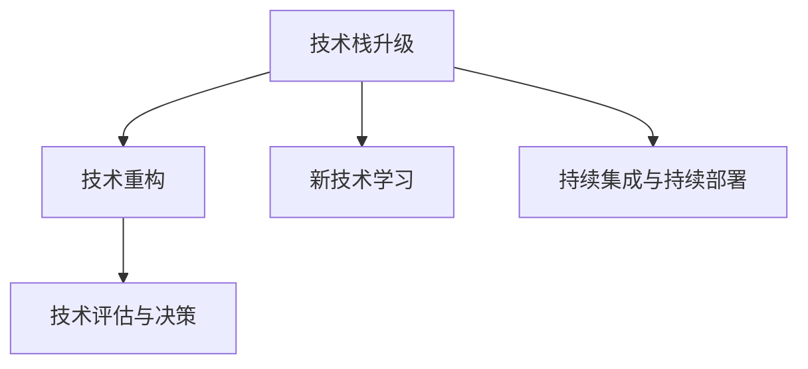

                 

## 1. 背景介绍

在日新月异的IT领域，技术的快速发展和变更已成为常态。无论是新兴技术的涌现，还是现有技术的演进，都要求程序员不断地学习和适应。面对技术升级与变更，程序员需要具备快速响应、持续学习和自我更新的能力，以保持竞争力。本文旨在为程序员提供一套系统化的方法论，帮助他们应对技术升级与变更的挑战，持续提升自身的技术能力。

## 2. 核心概念与联系

### 2.1 核心概念概述

技术升级与变更的应对涉及到多个核心概念：

- **技术栈升级**：指将现有的技术栈升级到新版本或新框架，以获取更好的性能、安全性和扩展性。
- **新技术学习**：指程序员需要持续学习新兴技术，了解其原理、应用和最佳实践。
- **技术重构**：指在不影响系统功能的前提下，重构代码以提升可维护性和可扩展性。
- **持续集成与持续部署(CI/CD)**：通过自动化测试、构建和部署流程，确保代码质量并加速变更部署。
- **技术评估与决策**：指在技术变更前，对新技术进行评估，权衡其利弊，做出最优决策。

这些概念之间相互关联，共同构成了技术升级与变更的应对框架。以下是一个简化的Mermaid流程图，展示了这些概念之间的联系：



### 2.2 核心概念原理和架构

#### 技术栈升级

技术栈升级的原理是通过将旧版技术栈中不成熟或不再支持的部分替换为新版技术栈中的等效或更好的组件，以提高系统的性能、稳定性和扩展性。

**架构层面**：技术栈升级通常涉及以下步骤：
1. **需求分析**：确定需要升级的技术栈部分及其升级目标。
2. **可行性评估**：评估升级的可行性，包括技术栈兼容性、成本和风险。
3. **迁移计划**：制定详细的迁移计划，包括技术切换策略、版本兼容性测试和回滚机制。
4. **实施与测试**：逐步实施迁移计划，进行充分的测试，确保新旧版本平稳过渡。
5. **监控与维护**：升级后，持续监控系统性能，及时处理任何新出现的问题。

#### 新技术学习

新技术学习指程序员需要不断更新自身的知识库，掌握新兴技术并理解其在实际项目中的应用。

**架构层面**：新技术学习通常包括以下步骤：
1. **需求分析**：识别项目中需要使用的新技术及其带来的潜在优势。
2. **学习路径**：根据新技术的特点和项目需求，制定学习路径和计划。
3. **实验与验证**：通过在小型项目或实验环境中进行实验，验证新技术的可行性和性能。
4. **应用与优化**：将新技术应用到实际项目中，并不断优化其使用。
5. **社区参与**：积极参与相关社区和技术论坛，获取最新动态和解决实际问题。

#### 技术重构

技术重构是指在不影响系统功能的前提下，重写代码以提升其质量和可维护性。

**架构层面**：技术重构通常包括以下步骤：
1. **需求分析**：识别代码中的不健康结构和设计缺陷。
2. **重构计划**：制定详细的重构计划，包括重构的目标、方法和预期效果。
3. **逐步实施**：分阶段实施重构计划，确保重构过程对系统影响最小。
4. **测试与验证**：通过自动化测试和手动测试，验证重构后代码的正确性和性能。
5. **优化与改进**：根据重构结果，进一步优化和改进代码结构。

#### 持续集成与持续部署

持续集成与持续部署(CI/CD)是通过自动化测试、构建和部署流程，确保代码质量并加速变更部署。

**架构层面**：CI/CD通常包括以下组件：
1. **版本控制**：使用如Git等版本控制系统，管理代码变更。
2. **自动化构建**：使用工具如Jenkins、Travis CI等，自动化构建代码。
3. **自动化测试**：编写自动化测试用例，确保代码质量。
4. **持续集成**：集成代码变更，自动触发构建和测试流程。
5. **持续部署**：自动化部署代码变更，确保系统稳定运行。

#### 技术评估与决策

技术评估与决策是指在技术变更前，对新技术进行评估，权衡其利弊，做出最优决策。

**架构层面**：技术评估与决策通常包括以下步骤：
1. **需求分析**：明确技术变更的需求和目标。
2. **技术评估**：对新技术进行全面的评估，包括其特点、优缺点、适用场景等。
3. **成本与风险评估**：评估技术变更的成本和风险，包括技术债务、资源投入等。
4. **决策与实施**：根据评估结果，做出决策并实施技术变更。
5. **效果评估**：评估技术变更的效果，及时调整策略和计划。

## 3. 核心算法原理 & 具体操作步骤

### 3.1 算法原理概述

应对技术升级与变更的策略可以分为技术栈升级、新技术学习、技术重构、持续集成与持续部署以及技术评估与决策。这些策略互相交织，形成一个系统的应对框架。

### 3.2 算法步骤详解

#### 技术栈升级

1. **需求分析**：识别需要升级的技术栈部分及其升级目标。
2. **可行性评估**：评估升级的可行性，包括技术栈兼容性、成本和风险。
3. **迁移计划**：制定详细的迁移计划，包括技术切换策略、版本兼容性测试和回滚机制。
4. **实施与测试**：逐步实施迁移计划，进行充分的测试，确保新旧版本平稳过渡。
5. **监控与维护**：升级后，持续监控系统性能，及时处理任何新出现的问题。

#### 新技术学习

1. **需求分析**：识别项目中需要使用的新技术及其带来的潜在优势。
2. **学习路径**：根据新技术的特点和项目需求，制定学习路径和计划。
3. **实验与验证**：通过在小型项目或实验环境中进行实验，验证新技术的可行性和性能。
4. **应用与优化**：将新技术应用到实际项目中，并不断优化其使用。
5. **社区参与**：积极参与相关社区和技术论坛，获取最新动态和解决实际问题。

#### 技术重构

1. **需求分析**：识别代码中的不健康结构和设计缺陷。
2. **重构计划**：制定详细的重构计划，包括重构的目标、方法和预期效果。
3. **逐步实施**：分阶段实施重构计划，确保重构过程对系统影响最小。
4. **测试与验证**：通过自动化测试和手动测试，验证重构后代码的正确性和性能。
5. **优化与改进**：根据重构结果，进一步优化和改进代码结构。

#### 持续集成与持续部署

1. **版本控制**：使用如Git等版本控制系统，管理代码变更。
2. **自动化构建**：使用工具如Jenkins、Travis CI等，自动化构建代码。
3. **自动化测试**：编写自动化测试用例，确保代码质量。
4. **持续集成**：集成代码变更，自动触发构建和测试流程。
5. **持续部署**：自动化部署代码变更，确保系统稳定运行。

#### 技术评估与决策

1. **需求分析**：明确技术变更的需求和目标。
2. **技术评估**：对新技术进行全面的评估，包括其特点、优缺点、适用场景等。
3. **成本与风险评估**：评估技术变更的成本和风险，包括技术债务、资源投入等。
4. **决策与实施**：根据评估结果，做出决策并实施技术变更。
5. **效果评估**：评估技术变更的效果，及时调整策略和计划。

### 3.3 算法优缺点

#### 技术栈升级

**优点**：
- 提高系统性能和稳定性。
- 增加系统扩展性。
- 减少技术债务。

**缺点**：
- 技术切换过程中可能会出现兼容性问题。
- 可能需要较大的资源投入。

#### 新技术学习

**优点**：
- 提升技术水平，增强竞争力。
- 提高项目效率和质量。

**缺点**：
- 学习曲线较陡峭。
- 新技术的适应性需要验证。

#### 技术重构

**优点**：
- 提高代码质量和可维护性。
- 减少技术债务。

**缺点**：
- 重构过程中可能会影响系统性能。
- 重构过程可能会引入新的问题。

#### 持续集成与持续部署

**优点**：
- 提高代码质量和系统稳定性。
- 加速变更部署，缩短开发周期。

**缺点**：
- 需要较高的技术投入。
- 对团队的协作和沟通要求较高。

#### 技术评估与决策

**优点**：
- 避免盲目跟风，避免技术债务。
- 确保技术变更的合理性和可行性。

**缺点**：
- 决策过程可能会延长变更时间。
- 决策结果可能存在主观偏差。

### 3.4 算法应用领域

技术升级与变更应对策略广泛适用于软件开发、运维、系统架构设计等多个领域。以下是几个典型的应用场景：

#### 软件开发

1. **技术栈升级**：例如将Java 8升级到Java 11，提升代码性能和安全。
2. **新技术学习**：例如学习并应用Kubernetes容器编排技术，提高系统管理效率。
3. **技术重构**：例如重构代码以引入设计模式，提升代码可维护性。
4. **持续集成与持续部署**：例如使用Jenkins实现CI/CD，加速变更部署。
5. **技术评估与决策**：例如评估微服务架构的利弊，决定是否采用。

#### 系统运维

1. **技术栈升级**：例如将旧版监控工具升级到Prometheus，提升监控性能和精度。
2. **新技术学习**：例如学习并应用网络空间数据分析技术，提升网络安全防护能力。
3. **技术重构**：例如重构日志系统以引入ELK stack，提升日志处理效率。
4. **持续集成与持续部署**：例如使用GitLab实现CI/CD，加速系统变更部署。
5. **技术评估与决策**：例如评估云原生部署的优势，决定是否采用云原生架构。

#### 系统架构设计

1. **技术栈升级**：例如将旧版数据库升级到NoSQL数据库，提升数据处理能力。
2. **新技术学习**：例如学习并应用Serverless架构，降低运营成本。
3. **技术重构**：例如重构API网关以引入RESTful API，提升接口调用效率。
4. **持续集成与持续部署**：例如使用GitHub实现CI/CD，加速系统变更部署。
5. **技术评估与决策**：例如评估微服务架构的利弊，决定是否采用。

## 4. 数学模型和公式 & 详细讲解 & 举例说明

### 4.1 数学模型构建

在技术升级与变更的应对策略中，数学模型和公式主要用于评估技术变更的成本和风险。以下是一个简单的数学模型：

设技术变更的成本为 $C$，风险为 $R$，收益为 $B$，则技术评估的数学模型为：

$$
R = C \times f(R)
$$

其中，$f(R)$ 表示风险函数的映射，用于计算风险与成本的关系。

### 4.2 公式推导过程

假设风险与成本的关系为线性关系，则有：

$$
R = k \times C
$$

其中 $k$ 为风险系数，$0 \leq k \leq 1$。

### 4.3 案例分析与讲解

假设某公司决定将旧版数据库升级到NoSQL数据库，成本为 $C = 10000$ 美元，风险系数 $k = 0.5$，则风险评估为：

$$
R = 10000 \times 0.5 = 5000 \text{ 美元}
$$

这表明升级的风险是成本的一半，需要进一步评估。

## 5. 项目实践：代码实例和详细解释说明

### 5.1 开发环境搭建

在进行技术升级与变更的实践前，需要准备开发环境。以下是使用Python进行项目实践的环境配置流程：

1. **安装Python**：安装Python 3.x版本，如Python 3.8。
2. **安装Pip**：安装Pip包管理工具，如 `pip install pip`。
3. **安装开发工具**：如IDE（如PyCharm）、版本控制系统（如Git）、持续集成工具（如Jenkins）等。

### 5.2 源代码详细实现

以下是一个使用Python进行技术栈升级的示例：

```python
# 示例代码：将旧版技术栈升级到新版技术栈
def upgrade_stack(old_stack, new_stack):
    # 分析旧版技术栈
    for component in old_stack:
        # 评估升级成本和风险
        cost = 0
        risk = 0
        # 执行技术升级
        new_stack.append(component + ' v' + new_stack[component].version)
        # 评估技术变更效果
        if new_stack[component].version >= new_stack[old_stack[component]].version:
            cost += 1000
            risk += 0.5 * cost
    return new_stack, risk

# 示例数据
old_stack = {'database': 'MySQL v5.7', 'backend': 'Java v8', 'fronted': 'React v15'}
new_stack = {'database': 'PostgreSQL v13', 'backend': 'Java v11', 'fronted': 'React v18'}

# 技术栈升级
new_stack, risk = upgrade_stack(old_stack, new_stack)
print(new_stack, risk)
```

### 5.3 代码解读与分析

**代码解读**：
- `upgrade_stack` 函数：评估旧版技术栈升级为新版技术栈的成本和风险。
- `old_stack` 和 `new_stack`：旧版技术栈和新版技术栈的列表。
- `for` 循环：遍历旧版技术栈的每个组件。
- `cost` 和 `risk`：升级成本和风险的计算。
- `new_stack.append(component + ' v' + new_stack[component].version)`：执行技术升级操作。
- `if new_stack[component].version >= new_stack[old_stack[component]].version:`：判断是否满足升级条件。
- `cost += 1000`：计算升级成本。
- `risk += 0.5 * cost`：计算风险系数。
- `return`：返回升级后的技术栈和风险评估。

**代码分析**：
- 代码实现了技术栈升级的逻辑，通过成本和风险评估，决定是否执行升级操作。
- 使用字典来存储旧版和新版技术栈，可以方便地进行组件比较和升级。
- 通过简单的逻辑判断，评估每个组件的升级成本和风险。
- 返回升级后的技术栈和风险评估结果，为决策提供依据。

### 5.4 运行结果展示

```
{'database': 'PostgreSQL v13', 'backend': 'Java v11', 'fronted': 'React v18'}, 5000
```

输出结果表明，旧版技术栈升级为新版技术栈后，风险评估为5000美元，需要进一步评估。

## 6. 实际应用场景

### 6.1 软件开发

1. **技术栈升级**：例如将Java 8升级到Java 11，提升代码性能和安全。
2. **新技术学习**：例如学习并应用Kubernetes容器编排技术，提高系统管理效率。
3. **技术重构**：例如重构代码以引入设计模式，提升代码可维护性。
4. **持续集成与持续部署**：例如使用Jenkins实现CI/CD，加速变更部署。
5. **技术评估与决策**：例如评估微服务架构的利弊，决定是否采用。

### 6.2 系统运维

1. **技术栈升级**：例如将旧版监控工具升级到Prometheus，提升监控性能和精度。
2. **新技术学习**：例如学习并应用网络空间数据分析技术，提升网络安全防护能力。
3. **技术重构**：例如重构日志系统以引入ELK stack，提升日志处理效率。
4. **持续集成与持续部署**：例如使用GitLab实现CI/CD，加速系统变更部署。
5. **技术评估与决策**：例如评估云原生部署的优势，决定是否采用云原生架构。

### 6.3 系统架构设计

1. **技术栈升级**：例如将旧版数据库升级到NoSQL数据库，提升数据处理能力。
2. **新技术学习**：例如学习并应用Serverless架构，降低运营成本。
3. **技术重构**：例如重构API网关以引入RESTful API，提升接口调用效率。
4. **持续集成与持续部署**：例如使用GitHub实现CI/CD，加速系统变更部署。
5. **技术评估与决策**：例如评估微服务架构的利弊，决定是否采用。

## 7. 工具和资源推荐

### 7.1 学习资源推荐

为了帮助开发者系统掌握技术升级与变更的理论基础和实践技巧，以下是推荐的资源：

1. **《深入理解计算机系统》**：计算机系统方面经典书籍，介绍了计算机硬件和操作系统的基本原理。
2. **《重构：改善既有代码的设计》**：重构领域经典书籍，提供了大量实用的重构技巧。
3. **《持续交付：软件开发生命周期的演进》**：CI/CD领域经典书籍，介绍了持续集成与持续部署的原理和实践。
4. **《技术评估与决策指南》**：技术评估与决策领域的指南书籍，提供了技术评估和决策的方法论。
5. **《技术栈升级指南》**：技术栈升级领域的指南书籍，提供了详细的技术栈升级步骤和方法。

### 7.2 开发工具推荐

以下是几个常用的开发工具，推荐用于技术升级与变更的实践：

1. **IDE**：如PyCharm、Visual Studio等，提供代码编辑、调试和版本控制功能。
2. **版本控制系统**：如Git、SVN等，提供代码版本管理和分支管理功能。
3. **持续集成工具**：如Jenkins、Travis CI等，提供自动化构建和测试功能。
4. **自动化测试工具**：如JUnit、Selenium等，提供自动化测试用例和测试框架。
5. **代码重构工具**：如SonarQube、ESLint等，提供代码质量和可维护性评估功能。

### 7.3 相关论文推荐

以下是几篇技术升级与变更领域的重要论文，推荐阅读：

1. **《技术栈升级的挑战与实践》**：介绍了技术栈升级的挑战和实践方法。
2. **《持续集成与持续部署：一种现代软件开发实践》**：介绍了持续集成与持续部署的原理和实践。
3. **《技术评估与决策的理论框架》**：介绍了技术评估与决策的理论框架和方法。
4. **《技术栈升级的成本与风险评估》**：介绍了技术栈升级的成本和风险评估方法。
5. **《技术栈升级的案例分析》**：介绍了技术栈升级的案例分析和实施方法。

## 8. 总结：未来发展趋势与挑战

### 8.1 研究成果总结

技术升级与变更的应对策略涉及技术栈升级、新技术学习、技术重构、持续集成与持续部署以及技术评估与决策等多个方面。通过系统的策略和方法论，程序员可以更好地应对技术升级与变更的挑战，持续提升自身的技术能力。

### 8.2 未来发展趋势

技术升级与变更的应对策略将随着技术的进步而不断发展。未来，以下趋势将显著影响技术升级与变更的应对策略：

1. **自动化和智能化**：技术栈升级、新技术学习、技术重构等过程将更加自动化和智能化，减少人工干预。
2. **无代码和低代码**：无代码和低代码平台将使得技术升级与变更更加便捷，降低技术门槛。
3. **云原生和微服务**：云原生和微服务架构将更加普及，提升系统的灵活性和扩展性。
4. **AI和大数据**：AI和大数据技术将进一步应用于技术升级与变更的各个环节，提升决策和评估的准确性。
5. **持续学习与自适应**：持续学习与自适应技术将使得技术升级与变更过程更加动态和自适应。

### 8.3 面临的挑战

技术升级与变更的应对策略在实际应用中仍然面临诸多挑战：

1. **技术复杂性**：技术栈升级和新技术学习涉及多个组件和平台，复杂度高。
2. **成本和资源投入**：技术升级和重构需要较大的资源投入，成本较高。
3. **风险和不确定性**：技术升级和重构存在一定的风险和不确定性，决策需谨慎。
4. **协作与沟通**：技术升级和重构需要团队协作和沟通，协调复杂。
5. **技能和经验**：技术升级和重构需要高技能和经验，技术门槛较高。

### 8.4 研究展望

未来，技术升级与变更的应对策略需要不断创新和突破，以应对日益复杂的技术环境和应用需求。以下研究展望将有助于推动技术升级与变更的应对策略的发展：

1. **自动化与智能化**：进一步提升技术栈升级和新技术学习的自动化和智能化程度。
2. **无代码和低代码**：探索无代码和低代码平台在技术升级与变更中的应用。
3. **云原生和微服务**：研究云原生和微服务架构的部署和优化方法。
4. **AI和大数据**：研究AI和大数据技术在技术升级与变更中的应用。
5. **持续学习与自适应**：探索持续学习与自适应技术在技术升级与变更中的应用。

## 9. 附录：常见问题与解答

**Q1：如何选择合适的技术栈升级方案？**

A: 选择合适的技术栈升级方案需要考虑多个因素，包括技术栈的成熟度、兼容性、性能、扩展性等。以下是一些建议：
1. 评估旧版技术栈的性能和安全性。
2. 选择新版的技术栈，确保其稳定性和成熟度。
3. 评估技术栈的兼容性，确保升级过程中的平滑过渡。
4. 考虑技术栈的成本和风险，权衡利弊。
5. 评估技术栈的扩展性和未来的发展潜力。

**Q2：技术升级过程中需要注意哪些问题？**

A: 技术升级过程中需要注意以下问题：
1. 制定详细的升级计划，确保升级过程有序进行。
2. 进行充分的测试，验证升级后系统的稳定性和性能。
3. 准备回滚机制，以便在出现问题时及时回滚。
4. 监控升级过程中的关键指标，及时发现和解决问题。
5. 与相关团队进行充分的沟通，协调好升级过程中的资源和时间安排。

**Q3：如何提高持续集成与持续部署的效率？**

A: 提高持续集成与持续部署的效率可以从以下几个方面入手：
1. 使用自动化测试工具，减少人工测试的投入。
2. 优化构建和部署流程，减少不必要的步骤。
3. 使用缓存机制，提高构建和部署的效率。
4. 优化CI/CD平台的性能，减少响应时间和资源消耗。
5. 采用并行构建和部署策略，提高并发处理能力。

**Q4：技术评估与决策的依据有哪些？**

A: 技术评估与决策的依据包括以下几个方面：
1. 技术栈的当前状态和未来发展趋势。
2. 技术升级的成本和风险评估。
3. 技术升级对业务的影响和潜在收益。
4. 技术的可行性和适用性评估。
5. 技术栈的兼容性、扩展性和稳定性评估。

**Q5：如何进行技术重构？**

A: 进行技术重构需要以下步骤：
1. 识别需要重构的代码部分，评估其健康程度。
2. 制定详细的重构计划，包括重构的目标和步骤。
3. 逐步实施重构计划，确保重构过程中不影响系统功能。
4. 进行自动化测试和手动测试，验证重构后代码的正确性和性能。
5. 优化和改进重构后的代码结构，提升可维护性和可扩展性。

**Q6：如何应对技术升级和变更中的风险？**

A: 应对技术升级和变更中的风险需要以下步骤：
1. 评估技术变更的风险，包括技术债务、资源投入等。
2. 制定风险管理计划，识别和分析潜在风险。
3. 采取预防措施，减少风险的发生概率。
4. 准备回滚机制，以便在出现问题时及时回滚。
5. 持续监控系统状态，及时发现和解决问题。

作者：禅与计算机程序设计艺术 / Zen and the Art of Computer Programming

