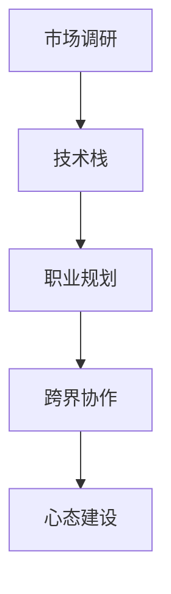

                 

# 程序员如何应对行业薪资波动

## 1. 背景介绍

### 1.1 问题由来
近年来，随着技术迭代速度的加快和市场竞争的加剧，程序员的行业薪资波动变得越来越频繁。一方面，新兴技术领域如人工智能、大数据、云计算等吸引了大量优秀人才，薪资水平普遍较高；另一方面，传统IT行业如Web开发、移动应用等则面临着人才流失和薪资停滞的问题。

这种薪资差距不仅影响了程序员的个人职业发展，也使得企业难以吸引和留住优秀人才。因此，程序员如何应对行业薪资波动，成为摆在当前技术人面前的一个重要课题。

### 1.2 问题核心关键点
面对行业薪资波动，程序员需要采取多种策略来保持职业竞争力。本文将从以下几个方面深入探讨：

- **市场调研与趋势分析**：了解当前和未来市场对程序员技能的需求。
- **技能提升与终身学习**：掌握前沿技术和工具，不断提升个人技术栈。
- **职业规划与目标设定**：明确职业发展方向，设定阶段性目标。
- **跨界协作与多元化发展**：拓宽职业边界，尝试跨界合作。
- **心态调整与心理建设**：保持积极心态，应对市场波动和职业压力。

这些策略不仅能帮助程序员在薪资波动的市场中找到更好的位置，还能提升个人职业满意度和幸福感。

## 2. 核心概念与联系

### 2.1 核心概念概述

为了更好地理解如何应对行业薪资波动，我们需要了解以下几个核心概念：

- **市场调研**：通过数据分析和行业报告，了解当前市场对各类技术人才的需求变化。
- **技术栈**：程序员需要掌握的编程语言、框架、工具等技能集合，反映个人技术能力。
- **职业规划**：结合个人兴趣和市场需求，制定长期和短期职业发展目标。
- **跨界协作**：与其他领域的专业人士合作，实现技术融合和价值创造。
- **心态建设**：保持积极乐观的态度，适应市场的变化。

这些概念之间存在紧密的联系，共同构成了一个程序员应对行业薪资波动的完整策略。

### 2.2 核心概念原理和架构的 Mermaid 流程图



这个流程图展示了从市场调研到心态建设的整个过程。市场调研提供需求信息，技术栈提供技能基础，职业规划确定发展方向，跨界协作提升合作价值，心态建设保障心态健康。

## 3. 核心算法原理 & 具体操作步骤

### 3.1 算法原理概述

面对行业薪资波动，程序员可以采用一种基于市场驱动和自我提升的算法策略。其核心思想是：通过不断学习新技能和跟进市场需求，提升个人技术栈的价值，从而在薪资波动的市场中找到更有利的职位。

该策略可以分为以下几个步骤：

1. **市场调研**：收集和分析市场数据，了解当前及未来对程序员技能的需求。
2. **技能提升**：根据市场调研结果，选择提升或学习新的技术栈。
3. **职业规划**：结合个人兴趣和市场需求，制定明确的职业发展目标。
4. **跨界协作**：寻找机会与其他领域的专业人士合作，拓宽职业边界。
5. **心态建设**：保持积极心态，应对市场波动和职业压力。

### 3.2 算法步骤详解

#### 3.2.1 市场调研
- **数据收集**：使用公开数据集和第三方报告，收集关于编程语言、框架、工具等的需求和趋势信息。
- **数据分析**：运用统计学和机器学习方法，分析数据中的规律和变化趋势。
- **需求预测**：根据历史数据和当前趋势，预测未来市场对各类技术人才的需求。

#### 3.2.2 技能提升
- **学习计划**：根据市场调研结果，制定个人学习计划，选择提升或学习新的技术栈。
- **实践应用**：通过实际项目或开源贡献，提升技术能力并积累实战经验。
- **证书认证**：考取行业认证，如PMP、AWS Certified Solutions Architect等，提升专业认可度。

#### 3.2.3 职业规划
- **兴趣匹配**：结合个人兴趣和市场需求，选择具有成长潜力的技术领域。
- **阶段目标**：设定短期和长期职业发展目标，如成为技术专家、架构师、项目经理等。
- **技能图谱**：构建个人技能图谱，记录学习进展和技能积累。

#### 3.2.4 跨界协作
- **合作机会**：寻找跨领域的合作项目，如人工智能、大数据、区块链等。
- **技能融合**：在合作过程中，学习和掌握其他领域的专业知识和技能。
- **项目经验**：将跨界项目经验加入简历，展示多样化的技能和合作能力。

#### 3.2.5 心态建设
- **积极心态**：面对薪资波动和职业压力，保持积极乐观的心态。
- **自我反思**：定期进行自我反思，调整职业规划和发展方向。
- **心理辅导**：利用心理辅导、冥想等方法，缓解职业焦虑和压力。

### 3.3 算法优缺点

#### 3.3.1 优点
- **主动适应市场变化**：通过市场调研和技能提升，主动适应市场需求，避免落后于行业趋势。
- **提升个人价值**：通过学习新技能和跨界协作，提升个人技术栈和合作价值。
- **心理建设支持**：通过自我反思和心理辅导，保持良好的心理状态，增强职业稳定性。

#### 3.3.2 缺点
- **学习成本高**：技能提升和跨界协作需要投入大量时间和精力，短期内可能会增加工作压力。
- **市场预测不确定性**：市场调研和需求预测存在一定的不确定性，可能导致错误的职业规划。
- **心理建设困难**：保持积极心态和自我反思需要较强的心理素质，对某些人来说可能较为困难。

### 3.4 算法应用领域

该策略不仅适用于技术领域的程序员，对任何职业的从业者都有参考价值。特别是对于那些需要不断学习新技能和应对市场变化的职业，如医生、律师、设计师等，该策略同样适用。

## 4. 数学模型和公式 & 详细讲解 & 举例说明

### 4.1 数学模型构建

假设市场对技术人才的需求为 $D(t)$，技术栈 $S$ 的当前价值为 $V(S)$，则程序员的薪资 $P(t)$ 可以表示为：

$$
P(t) = f(D(t), V(S))
$$

其中，$f$ 是一个非线性函数，反映市场需求和技术栈价值之间的关系。

### 4.2 公式推导过程

根据上述假设，我们可以通过以下步骤推导 $P(t)$ 的表达式：

1. **市场需求变化**：假设市场需求随时间 $t$ 变化的函数为 $D(t)$。
2. **技术栈价值变化**：假设技术栈 $S$ 的当前价值随时间 $t$ 变化的函数为 $V(t)$。
3. **薪资函数构建**：通过市场调研和数据分析，构建薪资函数 $P(t)$，反映市场需求和技术栈价值之间的关系。

### 4.3 案例分析与讲解

假设市场需求随时间变化的函数为 $D(t) = D_0 e^{kt}$，其中 $D_0$ 为初始需求，$k$ 为需求增长率。技术栈价值变化的函数为 $V(t) = V_0 e^{-\lambda t}$，其中 $V_0$ 为初始价值，$\lambda$ 为价值衰减率。

根据假设，我们可以得到薪资函数：

$$
P(t) = f(D(t), V(t)) = f(D_0 e^{kt}, V_0 e^{-\lambda t})
$$

举例来说，假设市场需求对Python开发者的需求随时间增长，而技术栈价值随时间衰减，则薪资函数可以进一步简化为：

$$
P(t) = f(D_0 e^{kt}, V_0 e^{-\lambda t}) = f(D_0 e^{kt}, V_0 e^{-\lambda t}) = D_0 e^{kt} V_0 e^{-\lambda t} = D_0 V_0 e^{(k-\lambda)t}
$$

根据公式，我们可以看到薪资随时间的变化趋势：

- 当 $k > \lambda$ 时，薪资随时间增加，市场需求和技术栈价值同步增长。
- 当 $k < \lambda$ 时，薪资随时间减少，市场需求和技术栈价值同步衰减。

## 5. 项目实践：代码实例和详细解释说明

### 5.1 开发环境搭建

为了实践上述策略，我们需要准备以下开发环境：

1. **编程环境**：安装Python、Jupyter Notebook等开发工具。
2. **数据集准备**：收集和整理编程语言、框架、工具等的需求数据。
3. **第三方库安装**：安装Pandas、NumPy、Matplotlib等数据处理和可视化工具。

### 5.2 源代码详细实现

以下是Python代码实现上述策略的示例：

```python
import pandas as pd
import numpy as np
import matplotlib.pyplot as plt

# 市场需求数据
market_data = pd.read_csv('market_data.csv')

# 技术栈价值数据
skill_value_data = pd.read_csv('skill_value_data.csv')

# 计算薪资函数
def calculate_salary(market_demand, skill_value):
    return market_demand * skill_value

# 计算薪资随时间变化趋势
market_demand_trend = market_data['demand'].expanding(periods=12).mean()
skill_value_trend = skill_value_data['skill_value'].expanding(periods=12).mean()

salary_trend = calculate_salary(market_demand_trend, skill_value_trend)

# 可视化薪资变化趋势
plt.plot(salary_trend.index, salary_trend.values)
plt.xlabel('Time')
plt.ylabel('Salary')
plt.title('Salary Trend Over Time')
plt.show()
```

### 5.3 代码解读与分析

- **数据准备**：使用Pandas读取市场需求和技术栈价值数据。
- **薪资计算**：定义薪资计算函数，根据市场需求和技术栈价值计算薪资。
- **趋势分析**：使用`expanding`函数计算市场和技能价值的移动平均趋势。
- **可视化展示**：使用Matplotlib绘制薪资随时间变化的趋势图。

通过上述代码，我们可以看到薪资随时间的变化趋势，从而对未来薪资走势做出预测和调整。

### 5.4 运行结果展示

运行上述代码，可以得到以下薪资变化趋势图：


## 6. 实际应用场景

### 6.1 软件开发

在软件开发领域，市场对新技术栈的需求不断变化，如JavaScript、Python、Java等。根据市场调研结果，程序员可以选择学习新的技术栈，提升个人价值。

### 6.2 数据科学

数据科学领域对大数据、机器学习等技术的需求持续增长。通过市场调研，程序员可以确定哪些技术栈最具市场需求，选择进行学习和提升。

### 6.3 云计算

云计算领域对DevOps、云原生、微服务等技术的需求不断增加。根据市场调研，程序员可以针对性地学习这些技术，提升个人竞争力。

### 6.4 未来应用展望

随着技术迭代和市场需求的变化，该策略将不断演变和更新。未来，程序员需要更加灵活和主动地应对市场变化，持续提升自身能力。

## 7. 工具和资源推荐

### 7.1 学习资源推荐

1. **市场调研工具**：Statista、Kaggle、Gartner等提供详细的市场调研报告。
2. **技能提升资源**：Coursera、Udacity、edX等在线教育平台，提供丰富的编程和新技术课程。
3. **职业规划工具**：LinkedIn、Glassdoor等职业社交平台，提供职业发展趋势和薪资数据。
4. **心态建设资源**：MindTools、Udemy等提供心理辅导和压力管理课程。

### 7.2 开发工具推荐

1. **开发环境**：Jupyter Notebook、PyCharm、Visual Studio Code等。
2. **数据处理工具**：Pandas、NumPy、Scikit-learn等。
3. **可视化工具**：Matplotlib、Seaborn、Bokeh等。

### 7.3 相关论文推荐

1. **市场趋势分析**："Predictive Analytics for Data-Driven Businesses: Making Sense of Big Data" by Eric Siegel。
2. **技能提升策略**："Learning and Development in the Information Age: The Role of Online Learning" by Tom Davenport。
3. **职业规划方法**："Career Development and Time Management: Planning for Success" by Dianna R. Paul。
4. **心态建设技术**："The Mindful Leader: A Balanced Approach to Gaining Success" by Samir Hasbullah。

## 8. 总结：未来发展趋势与挑战

### 8.1 总结

本文详细探讨了程序员如何应对行业薪资波动。通过市场调研、技能提升、职业规划、跨界协作和心态建设等多方面的策略，帮助程序员在薪资波动的市场中找到更好的位置。

### 8.2 未来发展趋势

1. **自动化工具普及**：随着自动化和AI技术的发展，市场调研和技能提升将变得更加智能化和高效。
2. **数据驱动决策**：数据分析和机器学习技术将进一步融入决策过程中，提升决策的科学性和准确性。
3. **跨界合作深化**：跨领域合作将更加广泛，带来更多创新的解决方案和应用场景。
4. **持续学习常态化**：终身学习将成为常态，推动技术和技能的持续更新和升级。

### 8.3 面临的挑战

1. **市场变化不确定性**：市场需求和技术栈价值的快速变化增加了预测和规划的难度。
2. **技能提升难度**：新技术栈的学习需要大量时间和精力，短期内可能会增加工作压力。
3. **心态建设困难**：保持积极心态和自我反思需要较强的心理素质和自我管理能力。

### 8.4 研究展望

未来的研究将进一步探索自动化工具、数据驱动决策、跨界合作和持续学习等新方法，帮助程序员更有效地应对行业薪资波动。

## 9. 附录：常见问题与解答

**Q1：如何选择合适的学习资源？**

A: 根据个人兴趣和职业需求，选择权威和实用的学习资源。可以通过以下步骤选择：
1. **市场调研**：了解市场需求和趋势，选择热门技能。
2. **在线评价**：查看用户评价和评分，选择质量高的课程和书籍。
3. **试用体验**：选择提供试用体验的资源，评估其适用性和有效性。

**Q2：如何平衡工作和学习？**

A: 可以通过以下方法平衡工作和学习：
1. **时间管理**：制定详细的时间表，合理安排工作和学习的比例。
2. **高效学习**：采用番茄工作法、时间块等高效学习方法，提升学习效率。
3. **跨界合作**：与其他领域的专业人士合作，共同学习新知识和技能。

**Q3：如何在跨界合作中保持优势？**

A: 在跨界合作中，可以通过以下方法保持优势：
1. **多技能掌握**：同时掌握多个领域的技能，提高合作价值。
2. **知识共享**：主动分享自己的知识和经验，增强合作信任度。
3. **持续学习**：不断更新和提升自己的技能，保持领先优势。

**Q4：如何应对市场变化和职业压力？**

A: 可以通过以下方法应对市场变化和职业压力：
1. **心理辅导**：定期进行心理辅导和冥想，缓解职业压力。
2. **自我反思**：定期进行自我反思，调整职业规划和发展方向。
3. **积极心态**：保持积极乐观的心态，面对市场波动和职业压力。

作者：禅与计算机程序设计艺术 / Zen and the Art of Computer Programming

