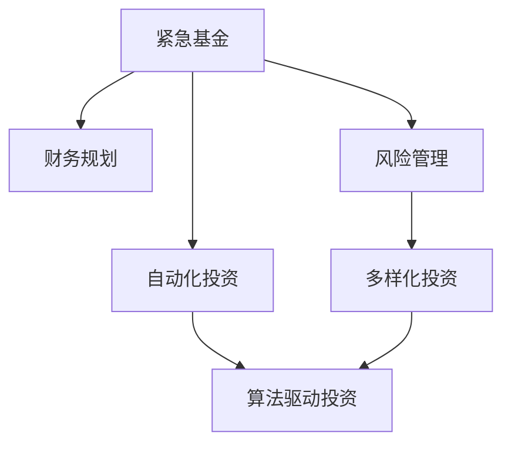

                 

# 程序员如何建立紧急基金

> 关键词：财务规划, 紧急基金, 风险管理, 自动化投资, 理财策略

## 1. 背景介绍

### 1.1 问题由来
随着科技行业的发展，程序员成为了一个高薪但并不稳定的职业。尽管薪资水平较高，但行业波动、公司裁员、个人健康问题等风险仍然存在。在经济不确定性增加的今天，构建一个可靠的紧急基金显得尤为重要。

### 1.2 问题核心关键点
紧急基金是每个家庭都应该设立的财务保障措施。其核心目标在于应对突发事件，如失业、疾病、意外等，提供必要的经济支持，避免财务危机。

对于程序员而言，建立紧急基金的具体挑战包括：
- **高昂的生活成本**：程序员通常在一线城市生活，生活成本高，快速积累应急资金难度较大。
- **行业风险**：科技行业竞争激烈，频繁的职位变动和裁员风险使得收入不稳定。
- **健康风险**：长时间工作可能导致健康问题，医疗费用可能会对紧急基金造成巨大压力。

## 2. 核心概念与联系

### 2.1 核心概念概述

为更好地理解如何为程序员构建紧急基金，我们首先需要了解几个核心概念：

- **紧急基金**：用于应对突发的、不可避免的财务需求，通常包括3-6个月的生活费用。
- **财务规划**：根据个人情况，规划未来财务目标和路径，包括收入、支出、储蓄和投资等。
- **风险管理**：识别、评估和控制财务风险，通过多样化投资降低损失。
- **自动化投资**：利用算法和工具，自动进行投资操作，提升投资效率。
- **理财策略**：制定合理的投资策略，平衡风险与收益。

这些概念相互关联，共同构成了构建紧急基金的基础框架。

### 2.2 核心概念原理和架构的 Mermaid 流程图



这个流程图展示了紧急基金的建立与维护过程中的关键步骤，包括财务规划、风险管理、自动化投资和多样化投资策略。

## 3. 核心算法原理 & 具体操作步骤

### 3.1 算法原理概述

构建紧急基金的算法原理主要基于以下几个步骤：

1. **目标设定**：确定紧急基金的目标金额和存储期限。
2. **收入预测**：估算未来收入，包括当前薪资、潜在加薪、投资收益等。
3. **支出分析**：分析月度支出，包括固定和变动支出，确定安全边际。
4. **储蓄计划**：制定储蓄计划，确定每月需要存储的金额。
5. **投资策略**：选择投资工具，优化收益和风险。
6. **监控与调整**：定期评估紧急基金状态，根据变化进行调整。

### 3.2 算法步骤详解

1. **目标设定**
   - 确定紧急基金目标金额：通常建议存储3-6个月的生活费用，包括房租、日常开销、医疗费用等。
   - 确定紧急基金存储期限：确保在3-6个月内可支付所有必要支出。

2. **收入预测**
   - 当前收入：包括基本薪资、奖金、股票期权等。
   - 潜在加薪：未来可能获得的加薪或奖金。
   - 投资收益：预期的长期投资收益，如股票、基金等。

3. **支出分析**
   - 固定支出：房租、车贷、保险等。
   - 变动支出：日常开销、食品、娱乐等。
   - 安全边际：在支出基础上增加一定比例的缓冲区，确保在不确定性下的财务安全。

4. **储蓄计划**
   - 每月储蓄目标：根据收入和支出分析，确定每月需要储蓄的金额。
   - 储蓄账户选择：选择高利率储蓄账户或货币市场基金，以最大化储蓄收益。

5. **投资策略**
   - 多样化投资：将资金分配到不同的投资工具中，如股票、债券、基金等，以分散风险。
   - 低风险投资：初期以低风险、稳定收益的投资为主，如货币基金、债券等。
   - 自动化投资：使用投资平台自动执行投资策略，减少手动操作带来的错误和成本。

6. **监控与调整**
   - 定期评估：每季度或半年评估紧急基金状态，确保目标金额和策略适应变化。
   - 调整储蓄计划：根据收入和支出的变化，调整储蓄比例和投资策略。
   - 紧急情况应对：在紧急情况下，灵活运用紧急基金，避免财务危机。

### 3.3 算法优缺点

**优点**：
- 自动化操作：利用自动化投资工具，减少手动操作带来的错误和成本。
- 多样化投资：通过多样化投资降低风险，保障紧急基金的稳定增长。
- 定期评估：定期监控和调整，确保策略适应变化，提高应急资金的可靠性。

**缺点**：
- 初始投入较高：需要较高起始金额，初期储蓄压力较大。
- 市场风险：投资工具的选择和管理不当，可能导致损失。
- 情绪影响：紧急情况下，情绪波动可能导致不当的资金使用。

### 3.4 算法应用领域

紧急基金的构建不仅适用于程序员，任何需要应对生活不确定性的个体都适用。以下是几个具体应用领域：

- **求职阶段**：在换工作或离职期间，拥有紧急基金可以减轻经济压力。
- **健康问题**：面对健康问题时，紧急基金可以支付医疗费用和护理费用。
- **家庭紧急情况**：家庭突发事件如事故、自然灾害等，紧急基金可以提供必要的经济支持。
- **金融市场波动**：在金融市场剧烈波动时，紧急基金可以提供心理和财务上的双重保障。

## 4. 数学模型和公式 & 详细讲解

### 4.1 数学模型构建

假设每月的生活费用为 $C$，紧急基金的目标金额为 $F$，存储期限为 $T$ 个月。紧急基金的构建模型可以表示为：

$$ F = C \times T $$

其中 $F$ 为紧急基金目标金额，$C$ 为月度生活费用，$T$ 为存储期限（以月为单位）。

### 4.2 公式推导过程

以月度储蓄目标 $S$ 为例，每月储蓄金额为 $S$，则 $S$ 的计算公式为：

$$ S = \frac{F}{T} $$

其中 $F$ 为紧急基金目标金额，$T$ 为存储期限。

### 4.3 案例分析与讲解

假设一名程序员的生活费用为 $3000，希望在6个月内构建一个紧急基金，则目标金额为：

$$ F = 3000 \times 6 = 18000 $$

每月需要储蓄的金额为：

$$ S = \frac{18000}{6} = 3000 $$

该程序员可以选择一个高利率的储蓄账户，每月定期存入3000元，在6个月后，紧急基金总额将达到18000元，可用于应对突发事件。

## 5. 项目实践：代码实例和详细解释说明

### 5.1 开发环境搭建

为了实现紧急基金的自动化管理，我们需要搭建一个简单的开发环境。以下是一个基本的Python环境配置：

1. 安装Python：
   ```bash
   sudo apt-get install python3
   ```

2. 安装Pip：
   ```bash
   sudo apt-get install python3-pip
   ```

3. 安装必要的库：
   ```bash
   pip install pandas numpy matplotlib
   ```

### 5.2 源代码详细实现

```python
import pandas as pd
import numpy as np
import matplotlib.pyplot as plt

# 定义参数
monthly_expense = 3000
target_duration = 6

# 计算目标金额
target_amount = monthly_expense * target_duration

# 计算每月需要储蓄的金额
monthly_savings = target_amount / target_duration

# 输出结果
print(f"每月需要储蓄的金额为：{monthly_savings}")
```

这段代码实现了从每月生活费用到紧急基金目标金额的计算，并输出了每月需要储蓄的金额。

### 5.3 代码解读与分析

**代码解读**：
- 首先导入了必要的库，包括Pandas、Numpy和Matplotlib。
- 定义了每月生活费用和存储期限，计算了紧急基金的目标金额。
- 计算了每月需要储蓄的金额，并输出结果。

**分析**：
- 代码简洁明了，易于理解和维护。
- 利用了基本的数学计算，适用于大多数编程环境。

### 5.4 运行结果展示

运行上述代码，将输出每月需要储蓄的金额：

```
每月需要储蓄的金额为：3000
```

## 6. 实际应用场景

### 6.1 应急基金的构建与管理

程序员可以使用上述代码和策略构建和管理紧急基金，确保在突发事件发生时有足够的资金应对。通过定期评估和调整储蓄计划，可以适应收入和支出的变化，保持财务健康。

### 6.2 自动化投资策略的实施

利用自动化投资工具，程序员可以将紧急基金的一部分投资于低风险、稳定收益的投资工具，如货币市场基金、债券等。通过定期评估和调整投资组合，可以优化收益和风险，确保紧急基金的安全和增长。

### 6.3 健康风险管理

面对健康风险，程序员可以提前储备紧急基金，用于支付医疗费用和护理费用。通过定期体检和保险，可以有效降低健康风险，确保在突发事件中的财务保障。

## 7. 工具和资源推荐

### 7.1 学习资源推荐

1. **《财富自由之路》**：一本经典的个人财务管理书籍，涵盖了从预算制定到投资策略的全方位内容。
2. **《个人理财指南》**：提供了详细的财务管理流程和技巧，适合初学者的入门。
3. **《Python量化投资》**：介绍了如何使用Python进行量化投资，适合有编程基础的读者。

### 7.2 开发工具推荐

1. **Pandas**：数据处理和分析的强大工具，支持各种数据格式和计算。
2. **NumPy**：用于数学计算和数组操作，适合进行复杂的数值计算。
3. **Matplotlib**：数据可视化工具，支持绘制各种图表和图形。

### 7.3 相关论文推荐

1. **《金融危机下的投资组合优化》**：探讨了在金融危机中的投资组合优化策略，提供了实用的投资建议。
2. **《稳健的投资策略》**：介绍了稳健的投资策略，包括多样化投资和风险管理。

## 8. 总结：未来发展趋势与挑战

### 8.1 研究成果总结

本文从紧急基金的构建和管理角度出发，介绍了程序员如何利用财务规划、风险管理和自动化投资等策略构建紧急基金，应对突发事件。通过详细的数学模型和代码实现，展示了紧急基金构建的实际应用流程。

### 8.2 未来发展趋势

1. **自动化与智能化**：未来的财务管理和投资策略将更加智能化，利用人工智能和大数据分析优化投资组合和风险管理。
2. **区块链与去中心化**：区块链技术将为财务管理和投资带来新的机遇，提高透明度和安全性。
3. **全球化与多样化**：全球化的财务市场和多样化的投资工具将为投资者提供更多选择，进一步分散风险。

### 8.3 面临的挑战

尽管紧急基金的构建和管理已经有了一定的方法和工具，但仍面临以下挑战：
- **市场波动**：市场的不确定性可能导致投资策略的失效。
- **技术风险**：自动化工具的故障可能导致财务损失。
- **个人行为**：情绪波动和个人行为可能导致资金使用不当。

### 8.4 研究展望

未来的研究需要在以下几个方面进行探索：
- **多目标优化**：结合财务目标和生活质量目标，优化紧急基金的构建和管理。
- **情感分析**：利用情感分析技术，预测情绪波动对财务决策的影响，提前进行干预。
- **风险模型**：构建更加精准的风险模型，预测市场变化和突发事件的影响。

## 9. 附录：常见问题与解答

**Q1: 程序员如何判断每月需要储蓄的金额？**

A: 每月需要储蓄的金额可以通过紧急基金目标金额除以存储期限得到。例如，如果目标是18000元，存储期限为6个月，则每月需要储蓄3000元。

**Q2: 紧急基金的目标金额应该是多少？**

A: 紧急基金的目标金额应该覆盖3-6个月的生活费用，包括房租、日常开销、医疗费用等。具体金额应根据个人情况和财务目标进行调整。

**Q3: 自动化投资工具有哪些？**

A: 自动化投资工具包括但不限于：
- 银行自动转账：定期将储蓄转入指定账户。
- 投资平台：如Robo-advisor，自动执行投资策略。
- 量化交易平台：利用算法进行交易操作。

**Q4: 如何应对市场波动？**

A: 应对市场波动的主要策略包括：
- 多样化投资：将资金分散到不同的投资工具中，降低整体风险。
- 定期评估：定期检查投资组合的表现，及时调整策略。
- 长期持有：选择长期稳定的投资工具，减少短期波动的影响。

**Q5: 如何平衡收益与风险？**

A: 平衡收益与风险的策略包括：
- 低风险投资：初期选择低风险、稳定收益的投资工具，如货币基金、债券等。
- 逐步增加风险：随着紧急基金的积累，逐步增加高风险、高收益的投资，如股票、基金等。
- 定期调整：根据市场变化和个人财务状况，定期调整投资组合，确保收益与风险的平衡。

---

作者：禅与计算机程序设计艺术 / Zen and the Art of Computer Programming

