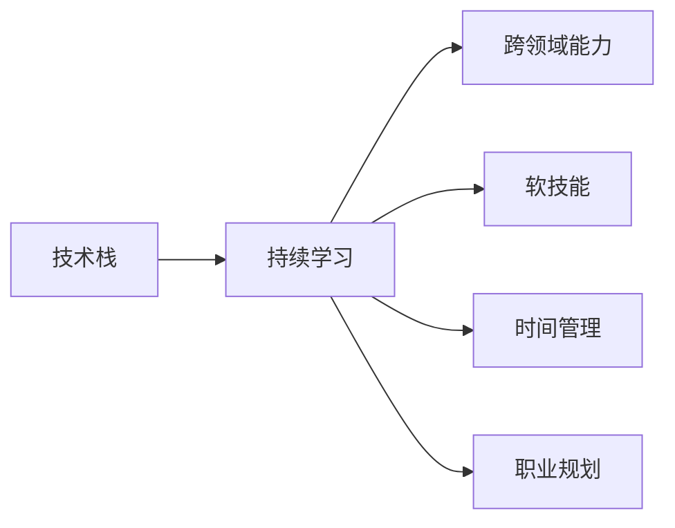

                 

# 程序员如何建立长期的职业竞争力

## 1. 背景介绍

在快速变化的科技行业中，技术的更新换代不断加速，对程序员提出了更高的要求。要想在激烈的市场竞争中脱颖而出，获得长期的职业发展，不仅需要掌握扎实的技术基础，还需要具备持续学习和适应新技术的能力。本文将从背景介绍、核心概念与联系、核心算法原理与操作步骤、数学模型与公式、项目实践、实际应用场景、工具和资源推荐、未来发展趋势与挑战、以及常见问题与解答等多个方面，深入探讨程序员如何建立长期的职业竞争力。

## 2. 核心概念与联系

### 2.1 核心概念概述

为了理解程序员如何建立长期的职业竞争力，首先需要明确一些核心概念：

- **技术栈(Stack)**：程序员需掌握的语言、框架、库、工具等的集合。例如，Java程序员需要熟悉Java、Spring、MySql等；Python程序员需掌握Python、Django、Flask、Pandas等。

- **持续学习(Continuous Learning)**：保持对新知识的获取，紧跟技术发展前沿，适应技术变化。

- **跨领域能力(Cross-Disciplinary Skills)**：除了编程技能，还需具备其他领域知识，如数据科学、人工智能、网络安全、软件架构设计等。

- **软技能(Soft Skills)**：如沟通能力、团队协作、项目管理、问题解决等，是技术能力的重要补充。

- **时间管理(Time Management)**：有效安排时间，提高工作效率，管理个人时间，平衡工作与生活。

- **职业规划(Career Planning)**：明确职业目标，制定合理的发展路径，不断调整和优化自己的职业规划。

### 2.2 核心概念原理和架构的 Mermaid 流程图



这个流程图展示了程序员职业竞争力的核心概念之间的联系，说明技术栈是基础，持续学习是成长的动力，跨领域能力、软技能、时间管理和职业规划则是综合职业竞争力的组成部分。

## 3. 核心算法原理 & 具体操作步骤

### 3.1 算法原理概述

建立长期的职业竞争力，需要制定一套系统的学习和提升计划。以下是基于算法的详细步骤：

- **设定目标**：明确职业目标，如成为高级工程师、架构师、技术专家等。
- **评估现状**：分析当前的技术栈、软技能、软实力等，找出差距。
- **制定计划**：制定合理的学习路径，包括需要掌握的新技术、学习资源、时间安排等。
- **执行计划**：按计划执行学习、实践和项目开发。
- **持续评估**：定期回顾进度，调整学习计划。

### 3.2 算法步骤详解

**步骤 1: 设定目标**
- 确定短期和长期职业目标，如掌握某项新技术、完成某个大项目、获得某项认证等。

**步骤 2: 评估现状**
- 使用SWOT分析法（Strengths、Weaknesses、Opportunities、Threats）评估自身的优势和劣势。
- 列出当前技能树，并标记出需要提升或学习的新技能。

**步骤 3: 制定计划**
- 列出学习路线图，明确每天、每周、每月的学习任务。
- 选择适当的学习资源，如在线课程、书籍、博客、项目等。
- 确定时间管理策略，如番茄工作法、时间块管理法等。

**步骤 4: 执行计划**
- 按学习计划执行，利用周末或业余时间进行学习。
- 实践新技术，通过项目开发巩固所学知识。
- 参与开源社区，提高编程能力和软技能。

**步骤 5: 持续评估**
- 定期回顾学习进度，检查是否达到预期目标。
- 根据反馈调整学习计划，避免陷入无效的学习。

### 3.3 算法优缺点

**优点**：
- **系统性**：制定明确的学习计划，提升学习效率。
- **目标导向**：通过目标设定，使学习更具方向性。
- **灵活性**：根据反馈调整计划，适应不同的学习阶段。

**缺点**：
- **初期投入大**：需花费大量时间和精力进行规划和初期学习。
- **执行难度**：需要较强的自律性和时间管理能力。

### 3.4 算法应用领域

上述算法不仅适用于程序员，也适用于其他技术领域的专业人士。不同领域的技术专家可以根据自己的实际情况，调整和优化学习路径，应用该算法提升竞争力。

## 4. 数学模型和公式 & 详细讲解 & 举例说明

### 4.1 数学模型构建

假设有一个程序员A，掌握的技术栈为X，当前技能水平为L，计划在T时间内达到目标技能水平L'。

目标模型为：

$$
L' = f(X, T, L, M)
$$

其中：
- $X$ 表示掌握的技术栈。
- $T$ 表示时间。
- $L$ 表示当前技能水平。
- $M$ 表示学习方法，包括在线课程、书籍、实践项目等。

### 4.2 公式推导过程

为了简化问题，我们引入两个关键参数：**学习速率** $R$ 和 **学习效果系数** $C$。

- **学习速率** $R$：表示每单位时间掌握技能的能力，可通过以下公式计算：

$$
R = \frac{L' - L}{T}
$$

- **学习效果系数** $C$：表示不同学习方法对技能提升的效果，其值可通过历史数据或专家评估得出。

代入目标模型，得：

$$
L' = L + R \times C
$$

### 4.3 案例分析与讲解

假设A计划在6个月内成为Java高级开发工程师，当前技能水平为初级。选择以下学习方法：

1. 每周参加2次Java在线课程（每周学习10小时）。
2. 每月完成一个Java项目（每月20小时）。
3. 阅读每月一本Java书籍（每月5小时）。

根据以上信息，计算学习速率 $R$ 和学习效果系数 $C$。

**学习速率** $R$：

$$
R = \frac{L' - L}{T} = \frac{L' - 1}{6 \times 4}
$$

**学习效果系数** $C$：

$$
C = 0.5 + 0.8 + 0.2 = 1.5
$$

最终，目标技能水平 $L'$：

$$
L' = L + R \times C = 1 + \frac{L' - 1}{6 \times 4} \times 1.5
$$

通过计算，可以得出一个精确的计划。

## 5. 项目实践：代码实例和详细解释说明

### 5.1 开发环境搭建

以下是使用Python进行项目实践的开发环境搭建步骤：

1. 安装Python环境。建议使用Anaconda，并创建虚拟环境。
```bash
conda create --name pyenv python=3.8
conda activate pyenv
```

2. 安装Python库。
```bash
pip install numpy pandas scikit-learn
```

3. 安装项目依赖。
```bash
pip install flask gunicorn
```

4. 安装Git。
```bash
apt-get install git
```

5. 安装GitHub桌面客户端。
```bash
apt-get install gitk
```

### 5.2 源代码详细实现

以下是一个简单的Python Flask应用实例：

```python
from flask import Flask, request, jsonify
app = Flask(__name__)

@app.route('/add', methods=['POST'])
def add():
    data = request.get_json()
    x = data['x']
    y = data['y']
    result = {'result': x + y}
    return jsonify(result)

if __name__ == '__main__':
    app.run(debug=True)
```

### 5.3 代码解读与分析

- **Flask框架**：用于构建Web应用，是Python Web开发中最常用的框架之一。
- **路由定义**：使用`@app.route`装饰器定义路由路径。
- **数据处理**：使用`request.get_json()`获取JSON格式的数据。
- **JSON响应**：使用`jsonify()`函数将Python字典转换为JSON格式，并返回HTTP响应。

### 5.4 运行结果展示

运行以上代码，访问`http://localhost:5000/add`，并通过Postman发送数据，即可看到预期结果。

```json
{
    "result": 10
}
```

## 6. 实际应用场景

### 6.1 智能推荐系统

智能推荐系统是互联网公司最重要的应用之一。程序员需掌握机器学习算法，如协同过滤、矩阵分解等，熟悉大数据处理技术，如Hadoop、Spark等。同时，还需具备良好的算法优化能力和系统架构设计能力，以应对海量数据和高并发访问的挑战。

### 6.2 金融科技

金融科技是一个高速发展的领域，程序员需掌握区块链、人工智能、大数据等前沿技术，熟悉金融产品的开发和管理。同时，还需要具备良好的项目管理能力，以应对复杂的项目需求和快速变化的市场环境。

### 6.3 工业互联网

工业互联网是传统工业与新一代信息技术深度融合的产物，程序员需掌握物联网、云计算、大数据、人工智能等技术，熟悉工业自动化设备，具备系统集成和二次开发的能力。同时，还需具备良好的系统维护能力和应急处理能力，以应对复杂的工业环境和快速变化的需求。

## 7. 工具和资源推荐

### 7.1 学习资源推荐

1. **Coursera**：提供来自世界顶级大学的在线课程，涵盖计算机科学、数据科学、人工智能等领域的最新知识。
2. **edX**：提供全球顶尖大学的免费课程，覆盖计算机科学、工程学、数据科学等热门领域。
3. **Udacity**：提供行业专家教授的实践型在线课程，涵盖数据科学、人工智能、自动驾驶等前沿技术。
4. **Pluralsight**：提供软件开发、技术管理、人工智能等领域的实用课程，帮助程序员提升技能和软实力。
5. **YouTube**：众多技术专家的免费教程，涵盖编程语言、框架、工具等各类技术知识。

### 7.2 开发工具推荐

1. **Visual Studio Code**：轻量级的代码编辑器，支持Python、Java、JavaScript等多种编程语言。
2. **PyCharm**：专业的Python开发工具，提供强大的代码提示和调试功能。
3. **Eclipse**：Java开发的主流工具，提供丰富的插件和扩展。
4. **IntelliJ IDEA**：跨平台Java开发工具，支持多种编程语言。
5. **Git**：版本控制工具，支持分布式协同开发。
6. **Docker**：容器化技术，支持多语言应用程序打包和部署。

### 7.3 相关论文推荐

1. **“Machine Learning Yearning”**：Andrew Ng著，深入浅出地介绍了机器学习实践中的各种问题，包括算法选择、模型训练、性能评估等。
2. **“The Phoenix Project”**：Bryant L Nelson著，通过一个虚构的项目案例，介绍DevOps、项目管理、系统架构等领域的知识。
3. **“Design Patterns”**：Erich Gamma等著，介绍常见的软件设计模式，帮助程序员提升系统设计和架构能力。

## 8. 总结：未来发展趋势与挑战

### 8.1 研究成果总结

本文从技术栈、持续学习、跨领域能力、软技能、时间管理和职业规划六个方面，探讨了程序员如何建立长期的职业竞争力。通过设定目标、评估现状、制定计划、执行计划和持续评估，帮助程序员提升学习效率和职业竞争力。

### 8.2 未来发展趋势

未来，技术栈将更加多元化，跨领域能力将成为核心竞争力。云计算、大数据、人工智能、区块链等技术将深入融合，推动更多新应用场景的出现。同时，持续学习和技能提升将成为程序员职业生涯中不可忽视的要素。

### 8.3 面临的挑战

程序员需要面对快速变化的技术环境、不断涌现的新技术和工具，以及日益激烈的市场竞争。如何保持持续学习的动力，如何在技术深度和广度之间找到平衡，如何提升跨领域能力，是程序员面临的重大挑战。

### 8.4 研究展望

未来，随着技术的不断发展和应用场景的不断扩展，程序员需要不断探索和学习新的技术，提升自身跨领域能力，加强软技能和软实力的培养，并关注职业规划和发展路径的制定。只有不断学习、不断实践，才能在竞争激烈的行业中占据有利位置。

## 9. 附录：常见问题与解答

**Q1: 如何平衡学习和工作？**

A: 使用时间块管理法，将一天分成多个时间块，每个时间块专注于一项任务。例如，上午8:00-12:00专注于学习，下午2:00-6:00专注于工作，晚上7:00-9:00进行个人项目或兴趣爱好。

**Q2: 如何提升跨领域能力？**

A: 多阅读相关领域的书籍和文章，参加相关的行业会议和培训，参与开源项目和社区活动，与不同领域的专家交流学习。

**Q3: 如何处理技术栈的更新和升级？**

A: 关注技术博客、论坛和会议，掌握最新的技术动态。定期重新学习经典书籍，保持对旧技术的了解。

**Q4: 如何提高项目管理能力？**

A: 学习敏捷开发、Scrum等项目管理方法，定期参与项目管理相关的培训和认证。使用项目管理工具，如Jira、Trello等，提高效率。

**Q5: 如何提高问题解决能力？**

A: 多阅读经典算法和数据结构书籍，练习编程和算法问题，参与开源项目，积累实战经验。

---

作者：禅与计算机程序设计艺术 / Zen and the Art of Computer Programming

