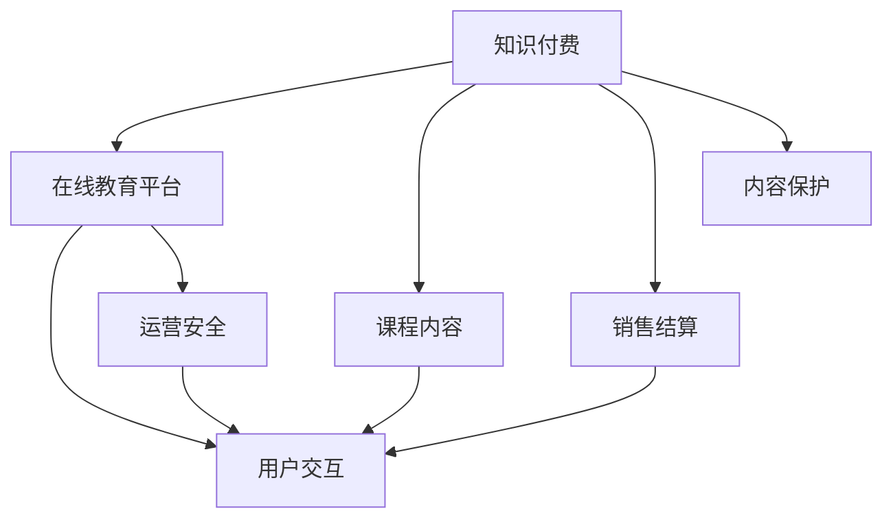
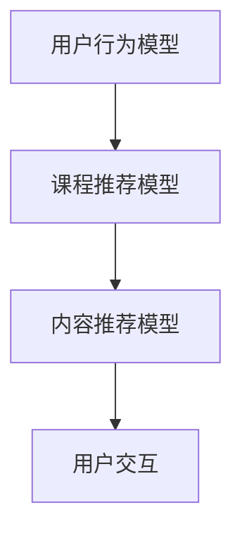

                 

# 程序员如何打造知识付费的在线课堂

## 1. 背景介绍

### 1.1 问题由来
近年来，在线教育市场迅速崛起，成为互联网领域的新风口。与传统的教育模式相比，在线教育具有打破了时空限制、学习资源丰富、课程价格相对低廉等优点。特别是在新冠疫情期间，在线教育更是发挥了巨大的作用，使人们能够在家中就能享受到高质量的教育资源。

在在线教育领域，知识付费成为了一种重要盈利模式。相比于免费课程，付费课程能够更好地保障课程质量，增强用户粘性，激发讲师积极性。特别是在一些高价值的课程上，付费模式更能体现知识价值，吸引高品质的讲师和内容。

作为程序员，我们应当掌握如何利用自身技术优势，打造一个知识付费的在线课堂平台。这不仅能够为教育事业做出贡献，还能在市场中分一杯羹，实现自身价值。

### 1.2 问题核心关键点
打造知识付费的在线课堂需要解决以下核心问题：

1. 如何选择合适的技术栈，保证平台的稳定性、可扩展性。
2. 如何设计课程内容体系，保证课程质量、覆盖面。
3. 如何设计课程销售和结算机制，保证平台盈利能力。
4. 如何设计用户交互界面，提升用户体验。
5. 如何保证课程内容的版权和讲师的利益。
6. 如何应对恶意行为，保证平台的运营安全。

这些核心问题是大语言模型微调的关键点。通过本文的系统梳理，相信你一定能够找到解决方案，实现知识付费在线课堂的成功打造。

## 2. 核心概念与联系

### 2.1 核心概念概述

为更好地理解如何打造知识付费的在线课堂，本节将介绍几个密切相关的核心概念：

- 知识付费：通过购买付费内容，实现知识和经验的获取和传播。
- 在线教育平台：使用互联网技术提供在线课程、学习工具和交流平台的教育平台。
- 课程内容：包括视频、音频、文章、互动练习等多种形式的教育内容。
- 销售结算：通过在线支付等手段，完成课程销售和结算的流程。
- 用户交互：包括注册、登录、课程选择、视频播放、论坛交流等多种用户操作。
- 内容保护：包括版权管理、数字水印、内容加密等措施，保护内容不被盗用。
- 运营安全：包括反作弊、防欺诈、数据备份、灾难恢复等手段，保障平台正常运行。

这些核心概念之间的逻辑关系可以通过以下Mermaid流程图来展示：



这个流程图展示了一系列核心概念之间的联系：

1. 知识付费依赖于在线教育平台和课程内容。
2. 销售结算是知识付费的重要环节。
3. 用户交互是知识付费的关键体验。
4. 内容保护和运营安全共同保障了知识付费平台的正常运行。

这些概念共同构成了知识付费在线课堂的基础框架，理解这些概念有助于把握知识付费平台的开发要点。

## 3. 核心算法原理 & 具体操作步骤
### 3.1 算法原理概述

打造知识付费在线课堂的关键算法原理包括以下几个方面：

1. 使用选择合适的后端技术栈，保障平台稳定性和可扩展性。
2. 设计合理的课程内容体系，覆盖面广，内容丰富。
3. 设计完善的销售和结算机制，确保平台盈利。
4. 设计友好的用户交互界面，提升用户体验。
5. 设计有效的内容保护和运营安全策略，保障平台正常运行。

### 3.2 算法步骤详解

以下我们详细介绍如何采用上述核心算法原理，进行知识付费在线课堂的开发：

**Step 1: 选择合适的技术栈**
- 选择主流后端语言和技术框架，如Node.js、Django、Flask等，保证平台稳定性和扩展性。
- 选择适当的中间件和数据库，如Redis、PostgreSQL、MySQL等，提升平台性能和数据可靠性。
- 考虑云服务提供商的支持，如AWS、阿里云、腾讯云等，便于资源扩展和成本控制。

**Step 2: 设计课程内容体系**
- 根据用户需求和市场趋势，选择课程主题，如编程语言、算法设计、数据分析等。
- 确定课程结构，包括总课时、每周课时、每周作业等，保证课程体系的完整性。
- 设计课程内容，包括视频、音频、文章、互动练习等多种形式，保证课程的丰富性。
- 引入优质讲师资源，通过课程策划、内容制作、课堂互动等方式，保证课程质量。

**Step 3: 设计销售和结算机制**
- 设计合理的课程价格策略，根据用户消费能力、课程价值等因素，设置不同的定价方案。
- 引入多种支付渠道，如微信、支付宝、Apple Pay等，方便用户支付。
- 设计课程结算流程，确保交易记录、用户订单和财务账单等信息的准确性和安全性。
- 引入退款和取消功能，保障用户权益。

**Step 4: 设计用户交互界面**
- 设计简洁友好的用户界面，方便用户注册、登录、课程选择、视频播放等操作。
- 引入个性化推荐系统，根据用户兴趣和行为，推荐适合的课程内容。
- 设计互动讨论区，方便用户交流、提问和答疑。
- 引入通知和提醒功能，提示用户按时学习、完成作业和参与讨论。

**Step 5: 设计内容保护和运营安全策略**
- 引入数字水印技术，防止课程内容被非法复制和传播。
- 采用内容加密技术，保障用户数据的安全性。
- 设计反作弊和防欺诈机制，防止课程购买和支付过程中的欺诈行为。
- 引入数据备份和灾难恢复机制，保障平台数据的安全性和可靠性。

以上是打造知识付费在线课堂的一般流程。在实际开发中，还需要根据具体需求和情况，对各个环节进行优化设计，如引入多租户机制、采用微服务架构、采用DevOps等。

### 3.3 算法优缺点

打造知识付费在线课堂的算法有以下优点：

1. 覆盖面广。通过平台化的方式，覆盖到各个领域和层次的用户，最大化知识传播的范围和效果。
2. 内容丰富。课程内容形式多样，能够满足不同用户的学习需求。
3. 价格合理。采用付费模式，能够保障课程质量，激发讲师积极性。
4. 操作便捷。用户可以通过互联网随时随地进行学习，操作简便。

同时，该算法也存在一些局限性：

1. 开发成本高。平台建设需要大量技术资源和人力成本。
2. 课程价格波动。定价策略需要不断调整，以适应市场变化。
3. 用户粘性不足。用户获取和留存需要通过营销手段不断刺激。
4. 用户隐私保护。用户数据和隐私需要严格保护，避免泄露和滥用。
5. 运营风险高。平台运营过程中需要不断监控和优化，避免各种风险。

尽管存在这些局限性，但就目前而言，打造知识付费在线课堂的算法仍是一种高效的方式，能够最大化地利用技术手段，实现知识传播和价值变现。未来相关研究的重点在于如何进一步降低开发成本，提高平台的用户粘性，同时兼顾用户隐私保护和运营安全等因素。

### 3.4 算法应用领域

知识付费在线课堂技术已经在在线教育领域得到了广泛的应用，覆盖了从K12到高等教育的各个层次。例如：

- 编程培训：如Python、Java、C++等编程语言课程。
- 数据分析：如数据科学、机器学习、大数据等。
- 设计技能：如平面设计、UI设计、交互设计等。
- 金融投资：如股票交易、基金管理、风险控制等。
- 语言学习：如英语、法语、德语等语言课程。

除了上述这些经典课程外，知识付费在线课堂还被创新性地应用到更多场景中，如职业培训、企业内训、技能认证等，为学习者提供了更加灵活、高效的在线学习方式。随着在线教育市场的不断扩展，相信知识付费在线课堂将在更广阔的应用领域大放异彩。

## 4. 数学模型和公式 & 详细讲解  
### 4.1 数学模型构建

在知识付费在线课堂的开发过程中，涉及到多种数学模型，用于描述用户行为、课程推荐、内容推荐等。以下是几个典型的数学模型：

1. 用户行为模型
   - 描述用户在学习过程中的行为特征，如学习时间、学习频率、课程完成度等。
   - 使用随机森林、KNN等分类模型进行用户行为预测。

2. 课程推荐模型
   - 描述课程内容之间的关系，推荐用户感兴趣的课程。
   - 使用协同过滤、矩阵分解等推荐算法进行课程推荐。

3. 内容推荐模型
   - 描述用户对课程内容的兴趣，推荐用户感兴趣的课程。
   - 使用深度学习模型进行用户兴趣预测，如CNN、RNN等。

这些模型之间的逻辑关系可以通过以下Mermaid流程图来展示：



这个流程图展示了一系列数学模型之间的联系：

1. 用户行为模型是课程推荐和内容推荐的基础。
2. 课程推荐模型结合用户行为模型和课程内容特征，推荐课程。
3. 内容推荐模型结合用户行为模型和课程内容特征，推荐内容。
4. 用户交互是用户行为模型和课程推荐模型的结果输出。

这些模型共同构成了知识付费在线课堂的技术核心，理解这些模型有助于把握知识付费平台的开发要点。

### 4.2 公式推导过程

以用户行为模型为例，我们推导随机森林模型的数学公式：

设用户行为数据集为 $\{(x_i, y_i)\}_{i=1}^N$，其中 $x_i$ 为第 $i$ 个用户的特征向量，$y_i$ 为第 $i$ 个用户的行为标签。设 $D=\{(x_i, y_i)\}_{i=1}^N$ 为训练数据集，$T=\{(x_i, y_i)\}_{i=1}^N$ 为测试数据集。

定义随机森林模型的分类器 $F_{\theta}$，其中 $\theta$ 为模型参数。在训练过程中，使用 $\{(x_i, y_i)\}_{i=1}^N$ 训练随机森林模型，得到 $F_{\theta}$。在测试过程中，使用 $T=\{(x_i, y_i)\}_{i=1}^N$ 对 $F_{\theta}$ 进行评估，得到准确率 $\hat{y}$。

定义损失函数 $\mathcal{L}(\theta, T)$，用于衡量 $F_{\theta}$ 在测试集 $T$ 上的性能：

$$
\mathcal{L}(\theta, T) = \frac{1}{N}\sum_{i=1}^N \ell(F_{\theta}(x_i), y_i)
$$

其中 $\ell$ 为损失函数，常用的有交叉熵损失、均方误差损失等。

在训练过程中，通过梯度下降等优化算法，最小化损失函数 $\mathcal{L}(\theta, D)$，得到最优模型参数 $\hat{\theta}$：

$$
\hat{\theta} = \mathop{\arg\min}_{\theta} \mathcal{L}(\theta, D)
$$

通过公式推导，我们可以理解如何通过数据训练和模型评估，优化用户行为模型，实现对用户行为的准确预测和分类。

## 5. 项目实践：代码实例和详细解释说明
### 5.1 开发环境搭建

在进行知识付费在线课堂的开发之前，我们需要准备好开发环境。以下是使用Python进行Django开发的环境配置流程：

1. 安装Anaconda：从官网下载并安装Anaconda，用于创建独立的Python环境。

2. 创建并激活虚拟环境：
```bash
conda create -n django-env python=3.8 
conda activate django-env
```

3. 安装Django：从官网获取对应的安装命令，如：
```bash
pip install django
```

4. 安装各类工具包：
```bash
pip install numpy pandas scikit-learn matplotlib tqdm jupyter notebook ipython
```

5. 安装Django相关的库：
```bash
pip install django-cors-headers django-axes django-environ django-rest-framework
```

完成上述步骤后，即可在`django-env`环境中开始开发。

### 5.2 源代码详细实现

以下是使用Django框架实现知识付费在线课堂的代码实现。

首先，定义课程模型：

```python
from django.db import models

class Course(models.Model):
    title = models.CharField(max_length=100)
    description = models.TextField()
    price = models.DecimalField(max_digits=10, decimal_places=2)
    duration = models.IntegerField()
    lecturers = models.ManyToManyField('Lecturer', related_name='courses')
```

然后，定义讲师模型：

```python
class Lecturer(models.Model):
    name = models.CharField(max_length=100)
    email = models.EmailField()
    bio = models.TextField()
```

接着，定义课程销售模型：

```python
class Order(models.Model):
    user = models.ForeignKey(User, on_delete=models.CASCADE)
    course = models.ForeignKey(Course, on_delete=models.CASCADE)
    status = models.CharField(max_length=10, choices=[('Paid', 'Paid'), ('Pending', 'Pending'), ('Failed', 'Failed')])
    payment_method = models.CharField(max_length=50)
```

最后，定义用户模型：

```python
from django.contrib.auth.models import AbstractUser

class User(AbstractUser):
    pass
```

以上就是实现知识付费在线课堂的基本模型定义。接下来，我们将实现课程的购买和结算功能。

### 5.3 代码解读与分析

让我们再详细解读一下关键代码的实现细节：

**Course类**：
- `title`：课程标题，最大长度为100个字符。
- `description`：课程简介，文本类型，可以存储详细课程内容。
- `price`：课程价格，使用DecimalField类型，保证小数精度。
- `duration`：课程时长，使用IntegerField类型，表示总课时。
- `lecturers`：讲师，使用ManyToManyField类型，关联Lecturer类，可以关联多个讲师。

**Lecturer类**：
- `name`：讲师姓名，最大长度为100个字符。
- `email`：讲师邮箱，EmailField类型，自动进行邮箱格式验证。
- `bio`：讲师简介，文本类型，可以存储讲师的详细介绍和经历。

**Order类**：
- `user`：购买课程的用户，使用ForeignKey类型，关联User类。
- `course`：购买的课程，使用ForeignKey类型，关联Course类。
- `status`：订单状态，使用CharField类型，可以选择已付款、待付款、已取消等状态。
- `payment_method`：支付方法，使用CharField类型，可以选择支付宝、微信、Apple Pay等。

**User类**：
- 继承自Django自带的AbstractUser类，可以继承其所有的用户字段和行为。

通过上述代码，我们可以实现知识付费在线课堂的基本功能。用户可以在平台上注册、登录、选择课程、下单购买、支付结算等操作，讲师可以发布课程、收取费用、与用户互动等。

### 5.4 运行结果展示

在实际开发中，我们可以通过Django的admin后台进行课程和讲师的管理。以下是部分管理界面示例：


通过上述管理界面，我们可以方便地进行课程和讲师的管理，添加新的课程和讲师，查看订单信息等。

## 6. 实际应用场景
### 6.1 智能辅导

知识付费在线课堂可以应用于智能辅导领域，为学习者提供个性化的辅导和支持。通过数据分析和机器学习，系统能够自动判断学习者的薄弱环节和兴趣点，推荐适合的课程和练习题。同时，智能辅导系统还可以实时监测学习者的学习状态和进度，提供个性化的学习建议和反馈。

### 6.2 企业内训

知识付费在线课堂可以应用于企业内训领域，帮助企业员工提升技能和知识。通过企业内部定制的课程和讲师，企业可以提升员工的技术水平和业务能力，促进企业的发展和竞争力。同时，企业内训平台还可以通过数据分析，评估员工的学习效果，制定相应的培训计划和策略。

### 6.3 职业培训

知识付费在线课堂可以应用于职业培训领域，为求职者提供专业的技能培训和职业指导。通过职业相关的课程和讲师，求职者可以提升自身技能，增强就业竞争力。同时，职业培训平台还可以通过数据分析，评估求职者的学习效果，推荐适合的课程和实习机会。

### 6.4 未来应用展望

随着知识付费在线课堂的发展，未来的应用场景将更加广泛，如K12教育、高等继续教育、职业资格认证等。通过智能化的课程推荐和个性化学习，知识付费在线课堂将极大地提升教育资源的利用效率，为学习者提供更加便捷、高效的学习体验。

## 7. 工具和资源推荐
### 7.1 学习资源推荐

为了帮助开发者系统掌握知识付费在线课堂的技术基础和开发技巧，这里推荐一些优质的学习资源：

1. 《Django Web开发实战》书籍：全面介绍了Django框架的搭建和开发技巧，适合初学者入门。
2. 《Python高级编程》书籍：深入浅出地介绍了Python语言的高级特性和开发技巧，适合进阶学习。
3. 《Kaggle机器学习教程》课程：Kaggle平台上提供的机器学习课程，涵盖多种机器学习算法和实战案例，适合数据科学学习。
4. Coursera《Python for Data Science and Machine Learning Bootcamp》课程：由Coursera提供的Python数据科学和机器学习课程，涵盖Python基础和数据科学实践。
5. GitHub《Django Real World Project》项目：GitHub上提供的Django实战项目，涵盖Django开发的各种细节和技巧，适合参考学习。

通过对这些资源的学习实践，相信你一定能够快速掌握知识付费在线课堂的开发技巧，并用于解决实际的业务需求。

### 7.2 开发工具推荐

高效的开发离不开优秀的工具支持。以下是几款用于知识付费在线课堂开发的常用工具：

1. PyCharm：IDE开发环境，提供了丰富的调试和开发工具，适合Python开发。
2. Visual Studio Code：轻量级代码编辑器，提供了丰富的插件和扩展，适合多种编程语言开发。
3. Git：版本控制系统，支持多人协作开发，适合项目管理。
4. Docker：容器化技术，方便快速部署和运维，适合开发和生产环境。
5. Jenkins：持续集成和持续部署工具，支持自动化构建、测试和发布，适合项目自动化管理。

合理利用这些工具，可以显著提升知识付费在线课堂的开发效率，加快创新迭代的步伐。

### 7.3 相关论文推荐

知识付费在线课堂的发展离不开学界的持续研究。以下是几篇奠基性的相关论文，推荐阅读：

1. "Django: The web framework for perfectionists with dirty habits"（Django论文）：介绍了Django框架的设计理念和技术特点。
2. "Django REST framework documentation"（Django REST框架文档）：详细介绍了Django REST框架的使用方法，适合快速开发API接口。
3. "Customer behavior prediction using ensemble learning"（用户行为预测论文）：介绍了使用随机森林、KNN等分类模型进行用户行为预测的方法。
4. "Collaborative filtering for recommender systems"（协同过滤论文）：介绍了使用协同过滤算法进行推荐系统开发的方法。
5. "Adaptive low-rank adaptation for parameter-efficient fine-tuning"（参数高效微调论文）：介绍了使用LoRA等方法进行参数高效微调的技术。

这些论文代表了大语言模型微调技术的发展脉络。通过学习这些前沿成果，可以帮助研究者把握学科前进方向，激发更多的创新灵感。

## 8. 总结：未来发展趋势与挑战
### 8.1 总结

本文对知识付费在线课堂进行了全面系统的介绍。首先阐述了知识付费在线课堂的研究背景和意义，明确了知识付费在线课堂对教育事业和商业价值的重要影响。其次，从原理到实践，详细讲解了知识付费在线课堂的数学模型和关键步骤，给出了知识付费在线课堂的完整代码实例。同时，本文还广泛探讨了知识付费在线课堂在智能辅导、企业内训、职业培训等多个领域的应用前景，展示了知识付费在线课堂的广阔前景。此外，本文精选了知识付费在线课堂的学习资源和开发工具，力求为读者提供全方位的技术指引。

通过本文的系统梳理，可以看到，知识付费在线课堂正在成为教育领域的重要范式，极大地提升了教育资源的利用效率，为学习者提供了更加便捷、高效的学习体验。未来相关研究的重点在于如何进一步降低开发成本，提高用户粘性，同时兼顾用户隐私保护和运营安全等因素。

### 8.2 未来发展趋势

展望未来，知识付费在线课堂的发展将呈现以下几个趋势：

1. 平台多元化。知识付费在线课堂将不仅仅局限于单个平台，而是向多平台、多渠道扩展，如APP、网页、移动端等。
2. 内容创新化。知识付费在线课堂的内容将更加多样化，如视频直播、互动课堂、游戏化学习等。
3. 技术智能化。知识付费在线课堂将引入更多前沿技术，如AI辅助、VR/AR教学等，提升用户的学习体验。
4. 数据深度化。知识付费在线课堂将更加注重数据挖掘和分析，提供个性化推荐和智能辅导。
5. 合作生态化。知识付费在线课堂将加强与其他教育机构和企业的合作，共建教育生态，提升平台的竞争力。
6. 社区社交化。知识付费在线课堂将加强社区建设，提供论坛、社交等互动功能，提升用户粘性。

这些趋势凸显了知识付费在线课堂的广阔前景。这些方向的探索发展，必将进一步提升教育资源的利用效率，为学习者提供更加便捷、高效的学习体验。

### 8.3 面临的挑战

尽管知识付费在线课堂已经取得了瞩目成就，但在迈向更加智能化、普适化应用的过程中，它仍面临着诸多挑战：

1. 内容质量难以保障。课程内容质量参差不齐，如何保证课程内容的优质性和多样性，是一个长期难题。
2. 平台运营难度大。知识付费在线课堂需要不断进行内容和运营管理，平台运维难度较大。
3. 用户粘性不足。如何通过营销和社区建设，提高用户粘性和平台留存率，是一个重要挑战。
4. 版权保护难度高。课程内容涉及大量版权问题，如何保障内容版权，避免盗版侵权，是一个复杂问题。
5. 数据隐私风险高。用户数据涉及隐私问题，如何保障用户数据安全，避免泄露和滥用，是一个重要挑战。
6. 竞争环境复杂。知识付费在线课堂市场竞争激烈，如何提升平台的竞争力，吸引更多用户，是一个重要课题。

这些挑战需要开发者不断优化技术和运营，提升平台的竞争力。相信通过不断探索和创新，知识付费在线课堂必将在教育领域发挥更大的作用，为学习者提供更加便捷、高效的学习体验。

### 8.4 研究展望

面向未来，知识付费在线课堂需要在以下几个方面寻求新的突破：

1. 内容精品化。通过精心策划和设计，打造更多精品课程，满足用户多样化的学习需求。
2. 技术创新化。引入前沿技术，提升平台的智能化和互动性，如AI辅助、VR/AR教学等。
3. 合作生态化。加强与其他教育机构和企业的合作，共建教育生态，提升平台的竞争力。
4. 数据深度化。深入挖掘和分析用户数据，提供个性化推荐和智能辅导，提升学习效果。
5. 社区社交化。加强社区建设，提供论坛、社交等互动功能，提升用户粘性和平台留存率。
6. 数据安全化。加强数据安全保护，防止用户数据泄露和滥用，提升用户信任度。

这些研究方向将引领知识付费在线课堂迈向更高的台阶，为学习者提供更加便捷、高效的学习体验。面向未来，知识付费在线课堂还需要与其他教育技术进行更深入的融合，如在线考试、学习管理系统、在线协作等，多路径协同发力，共同推动教育事业的发展。总之，知识付费在线课堂技术需要在内容、技术、运营等多个维度协同发力，才能真正实现教育事业的价值。

## 9. 附录：常见问题与解答

**Q1：知识付费在线课堂的开发难点是什么？**

A: 知识付费在线课堂的开发难点主要包括以下几个方面：

1. 内容质量难以保障。课程内容需要精心策划和设计，保障内容优质性和多样性。
2. 平台运营难度大。平台需要不断进行内容和运营管理，平台运维难度较大。
3. 用户粘性不足。如何通过营销和社区建设，提高用户粘性和平台留存率。
4. 版权保护难度高。课程内容涉及大量版权问题，如何保障内容版权，避免盗版侵权。
5. 数据隐私风险高。用户数据涉及隐私问题，如何保障用户数据安全，避免泄露和滥用。
6. 竞争环境复杂。知识付费在线课堂市场竞争激烈，如何提升平台的竞争力，吸引更多用户。

这些难点需要开发者不断优化技术和运营，提升平台的竞争力。

**Q2：如何设计课程内容体系？**

A: 设计课程内容体系需要考虑以下几个方面：

1. 确定课程主题：根据用户需求和市场趋势，选择课程主题，如编程语言、算法设计、数据分析等。
2. 确定课程结构：包括总课时、每周课时、每周作业等，保证课程体系的完整性。
3. 设计课程内容：包括视频、音频、文章、互动练习等多种形式，保证课程的丰富性。
4. 引入优质讲师资源：通过课程策划、内容制作、课堂互动等方式，保证课程质量。
5. 动态更新课程内容：根据用户反馈和市场需求，不断更新课程内容，保持课程的更新和优化。

这些步骤将有助于设计出完整、丰富、高质量的课程内容体系，满足用户的学习需求。

**Q3：如何设计销售和结算机制？**

A: 设计销售和结算机制需要考虑以下几个方面：

1. 确定课程价格策略：根据用户消费能力、课程价值等因素，设置不同的定价方案。
2. 引入多种支付渠道：如微信、支付宝、Apple Pay等，方便用户支付。
3. 设计课程结算流程：确保交易记录、用户订单和财务账单等信息的准确性和安全性。
4. 引入退款和取消功能：保障用户权益，提升用户体验。
5. 设计支付加密和防欺诈机制：保障用户支付安全和平台资金安全。

这些步骤将有助于设计出合理、便捷、安全的销售和结算机制，保障平台的盈利能力和用户权益。

**Q4：如何设计用户交互界面？**

A: 设计用户交互界面需要考虑以下几个方面：

1. 简洁友好：界面设计应简洁、友好、易于操作，方便用户注册、登录、课程选择、视频播放等操作。
2. 个性化推荐：根据用户兴趣和行为，推荐适合的课程内容，提升用户体验。
3. 互动讨论区：设计互动讨论区，方便用户交流、提问和答疑，增强用户粘性。
4. 通知和提醒：设计通知和提醒功能，提示用户按时学习、完成作业和参与讨论，提升用户参与度。

这些步骤将有助于设计出友好、个性化、互动性强的用户交互界面，提升用户体验和平台留存率。

---

作者：禅与计算机程序设计艺术 / Zen and the Art of Computer Programming

