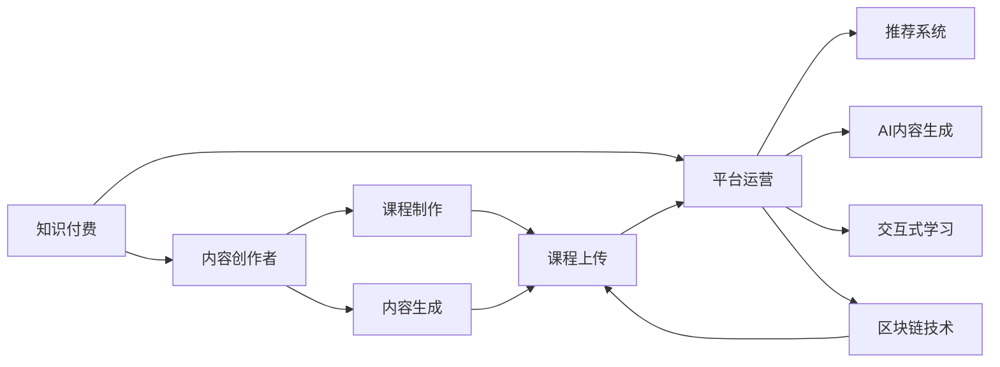

                 

# 程序员如何提高知识付费产品的溢价

在当今知识爆炸的时代，知识付费产品成为了许多人获取新知、提升自我能力的有效手段。然而，面对市场上琳琅满目的课程、文章、教程，如何选择优质产品、如何购买性价比最高、如何提升产品溢价，成为广大知识工作者关注的焦点。本文将从程序员的角度出发，探讨如何通过技术手段提升知识付费产品的价值和溢价。

## 1. 背景介绍

### 1.1 问题由来

随着互联网的普及和智能设备的广泛应用，知识付费平台如雨后春笋般涌现，逐渐成为人们获取知识和技能的重要途径。然而，市场上的知识付费产品良莠不齐，如何确保内容质量、如何提升用户体验、如何引导用户形成稳定的付费习惯，成为平台和内容创作者亟待解决的问题。

### 1.2 问题核心关键点

1. **内容质量**：知识的准确性和实用性是知识付费产品最重要的基础。
2. **用户体验**：课程设计、交互方式、反馈机制等直接影响用户的使用体验。
3. **用户转化**：如何吸引用户、留住用户、促成付费，是知识付费产品成功的关键。
4. **平台生态**：内容的传播、社区的建设、用户的互动，需要平台提供有效的支持。
5. **技术支持**：技术手段在知识付费产品的制作、运营、营销等方面扮演着重要角色。

## 2. 核心概念与联系

### 2.1 核心概念概述

- **知识付费**：用户为获取知识、技能、信息而支付的费用。
- **知识产品**：包含书籍、课程、文章、视频等形式的付费内容。
- **内容创作者**：制作和提供知识产品的人或机构。
- **平台运营**：知识付费产品从内容制作到用户消费的全流程管理。
- **技术支持**：利用技术手段提升知识付费产品的质量和用户体验。

- **推荐系统**：通过用户行为数据，推荐个性化内容，提高用户粘性和购买率。
- **AI内容生成**：利用自然语言处理、计算机视觉等技术，生成高质量的课程、文章等内容。
- **交互式学习**：通过互动式问答、模拟器、虚拟现实等技术，提升用户的学习体验。
- **区块链技术**：通过区块链，保障知识产品的版权和用户数据安全，增强信任度。

### 2.2 核心概念原理和架构的 Mermaid 流程图



这个流程图展示了知识付费产品的核心流程和相关技术支持：内容创作者制作内容，平台运营管理内容，通过推荐系统和AI内容生成提升内容质量，交互式学习和区块链技术增强用户体验和信任度。

## 3. 核心算法原理 & 具体操作步骤

### 3.1 算法原理概述

知识付费产品的溢价提升，主要依赖于内容的质量、用户的体验和付费转化率。因此，本节将从这三个方面阐述核心算法原理。

#### 3.1.1 内容质量

内容质量的提升，需要通过多轮的预训练和微调实现。以课程制作为例，首先需要通过大规模语料库对课程进行预训练，学习通用的知识表示；然后通过少量标注数据进行微调，使其适应特定课程的知识点和难度。

#### 3.1.2 用户体验

用户体验的提升，涉及课程设计、交互方式、反馈机制等多个方面。可以通过数据挖掘和机器学习技术，分析用户的行为数据，了解用户的需求和偏好，从而进行个性化的课程推荐和内容生成。

#### 3.1.3 用户转化

用户转化率的提升，需要通过精准的营销策略和有效的激励机制实现。可以通过社交网络分析，挖掘用户的社交关系和兴趣圈，进行精准推荐和社群营销；通过积分系统、徽章系统等激励机制，提升用户的参与度和忠诚度。

### 3.2 算法步骤详解

#### 3.2.1 内容质量提升

1. **预训练**：利用大规模语料库，进行无监督学习，提取通用的知识表示。
2. **微调**：通过少量标注数据，进行有监督学习，调整模型参数，使其适应特定课程的需求。
3. **评估**：利用交叉验证等方法，评估模型的性能，优化模型参数。

#### 3.2.2 用户体验提升

1. **行为分析**：利用数据挖掘技术，分析用户的行为数据，了解用户需求和偏好。
2. **个性化推荐**：利用推荐系统算法，生成个性化的课程推荐列表。
3. **交互设计**：利用交互式技术，提升课程的互动性和趣味性。
4. **反馈机制**：利用自然语言处理技术，分析用户的反馈，优化课程内容和设计。

#### 3.2.3 用户转化提升

1. **社交网络分析**：利用社交网络分析技术，挖掘用户的社交关系和兴趣圈，进行精准推荐和社群营销。
2. **积分系统设计**：设计积分系统、徽章系统等激励机制，提升用户的参与度和忠诚度。
3. **营销策略优化**：通过A/B测试等方法，优化营销策略，提高转化率。

### 3.3 算法优缺点

#### 3.3.1 内容质量提升

- **优点**：通过预训练和微调，可以提升课程的质量和实用性，满足不同用户的需求。
- **缺点**：需要大量的数据和计算资源，预训练和微调过程耗时较长。

#### 3.3.2 用户体验提升

- **优点**：通过个性化推荐和交互设计，提升用户的体验，提高用户粘性和满意度。
- **缺点**：需要精准的数据分析和推荐算法，技术难度较高。

#### 3.3.3 用户转化提升

- **优点**：通过精准推荐和激励机制，提高用户转化率和忠诚度，实现长期价值。
- **缺点**：需要不断的策略优化和用户反馈，运营成本较高。

### 3.4 算法应用领域

知识付费产品的溢价提升技术，可以应用于以下领域：

- **在线教育平台**：通过内容质量提升、用户体验优化和用户转化提升，实现课程的长期发展和品牌价值的提升。
- **技能培训公司**：通过提升培训课程的质量和互动性，增强用户体验，提升学员的满意度。
- **技术咨询公司**：通过知识付费产品的溢价提升，提高技术咨询服务的附加值，增加客户粘性和忠诚度。
- **软件开发社区**：通过技术分享、社区建设等方式，提升用户的参与度和社区的活跃度，形成良好的生态系统。

## 4. 数学模型和公式 & 详细讲解 & 举例说明

### 4.1 数学模型构建

- **内容质量评估模型**：通过自然语言处理技术，构建内容质量评估模型，对课程内容进行多维度评估。
- **个性化推荐模型**：利用协同过滤、内容过滤等技术，构建个性化推荐模型，生成个性化的课程推荐列表。
- **用户转化模型**：通过用户行为数据分析，构建用户转化模型，预测用户的购买意愿。

### 4.2 公式推导过程

#### 4.2.1 内容质量评估模型

- **公式**：
  $$
  \text{content\_quality} = \text{pre\_train\_score} \times \text{fine\_tune\_score} \times \text{assessment\_score}
  $$
  其中，$\text{pre\_train\_score}$表示预训练的得分，$\text{fine\_tune\_score}$表示微调的得分，$\text{assessment\_score}$表示评估的得分。

#### 4.2.2 个性化推荐模型

- **协同过滤推荐**：
  $$
  \text{rec\_score}_{i,j} = \alpha \times \text{user\_similarity}_i \times \text{item\_similarity}_{i,j} + \beta \times \text{item\_quality}_j
  $$
  其中，$\alpha$和$\beta$为调整参数，$\text{user\_similarity}_i$表示用户$i$与其他用户的相似度，$\text{item\_similarity}_{i,j}$表示课程$j$与其他课程的相似度，$\text{item\_quality}_j$表示课程$j$的质量评分。

#### 4.2.3 用户转化模型

- **逻辑回归模型**：
  $$
  \text{conversion\_prob} = \frac{1}{1 + e^{-\text{logit}}}
  $$
  其中，$\text{logit} = \text{weights} \times \text{features}$，$\text{weights}$为模型参数，$\text{features}$为输入特征，如用户行为、用户反馈、社交网络等信息。

### 4.3 案例分析与讲解

- **课程制作流程**：
  1. 预训练：利用大规模语料库，进行无监督学习，提取通用的知识表示。
  2. 微调：通过少量标注数据，进行有监督学习，调整模型参数，使其适应特定课程的需求。
  3. 评估：利用交叉验证等方法，评估模型的性能，优化模型参数。
  4. 发布：将课程上传至平台，进行个性化推荐和交互设计，提升用户体验。

## 5. 项目实践：代码实例和详细解释说明

### 5.1 开发环境搭建

- **环境准备**：安装Python、PyTorch、TensorFlow、Scikit-learn等常用库。
- **数据准备**：收集和标注课程数据、用户行为数据、社交网络数据等。
- **环境部署**：搭建服务器环境，部署知识付费平台。

### 5.2 源代码详细实现

#### 5.2.1 内容质量评估模型

```python
from transformers import BertTokenizer, BertModel
import torch

tokenizer = BertTokenizer.from_pretrained('bert-base-uncased')
model = BertModel.from_pretrained('bert-base-uncased')

def pre_train_score(text):
    input_ids = tokenizer.encode(text, add_special_tokens=True)
    attention_mask = [1] * len(input_ids)
    with torch.no_grad():
        output = model(input_ids, attention_mask=torch.tensor(attention_mask))
    return output.pooler_output.tolist()[0]

def fine_tune_score(text, labels):
    input_ids = tokenizer.encode(text, add_special_tokens=True)
    attention_mask = [1] * len(input_ids)
    labels = [1] * len(labels)
    with torch.no_grad():
        output = model(input_ids, attention_mask=torch.tensor(attention_mask), labels=torch.tensor(labels))
    return output.pooler_output.tolist()[0]

def assessment_score(text, labels):
    input_ids = tokenizer.encode(text, add_special_tokens=True)
    attention_mask = [1] * len(input_ids)
    labels = [1] * len(labels)
    with torch.no_grad():
        output = model(input_ids, attention_mask=torch.tensor(attention_mask), labels=torch.tensor(labels))
    return output.pooler_output.tolist()[0]

# 计算课程内容质量得分
course_content_quality = pre_train_score(course_text) * fine_tune_score(course_text, course_labels) * assessment_score(course_text, course_labels)
```

#### 5.2.2 个性化推荐模型

```python
from scipy.sparse import csr_matrix
import numpy as np

def user_similarity(user_id, user_data):
    # 计算用户与其他用户的相似度
    user_profile = user_data[user_id]
    similarity = np.dot(user_profile, np.transpose(user_profile))
    return similarity / np.sqrt(np.dot(similarity, similarity))

def item_similarity(item_id, item_data):
    # 计算课程与其他课程的相似度
    item_profile = item_data[item_id]
    similarity = np.dot(item_profile, np.transpose(item_profile))
    return similarity / np.sqrt(np.dot(similarity, similarity))

def content_filtering(item_id, item_data):
    # 计算课程与其他课程的相似度
    item_profile = item_data[item_id]
    similarity = np.dot(item_profile, np.transpose(item_profile))
    return similarity / np.sqrt(np.dot(similarity, similarity))

def collaborative_filtering(user_id, user_data, item_data):
    # 协同过滤推荐
    user_similarity_matrix = csr_matrix([[user_similarity(user_id, user_data)] * len(user_data)])
    user_profile = np.transpose(user_data)
    user_profile = user_profile - np.mean(user_profile, axis=1, keepdims=True)
    user_similarity_matrix = user_similarity_matrix / np.sqrt(user_similarity_matrix.sum(axis=1, keepdims=True))
    user_similarity_matrix = user_similarity_matrix @ user_profile
    return user_similarity_matrix

def recommendation(user_id, user_data, item_data):
    # 个性化推荐
    user_similarity_matrix = collaborative_filtering(user_id, user_data, item_data)
    user_profile = user_data[user_id]
    item_profile = np.transpose(item_data)
    item_profile = item_profile - np.mean(item_profile, axis=1, keepdims=True)
    recommendation_score = np.dot(user_profile, np.transpose(item_profile))
    recommendation_score = recommendation_score * user_similarity_matrix
    return recommendation_score
```

#### 5.2.3 用户转化模型

```python
from sklearn.linear_model import LogisticRegression
from sklearn.metrics import roc_auc_score

# 构建逻辑回归模型
model = LogisticRegression()

# 训练模型
X = user_features
y = user_conversion_labels
model.fit(X, y)

# 预测用户转化概率
predicted_probabilities = model.predict_proba(X)[:, 1]
auc = roc_auc_score(y, predicted_probabilities)
```

### 5.3 代码解读与分析

- **预训练得分计算**：利用BERT模型对课程文本进行编码，计算池化层的输出得分。
- **微调得分计算**：利用带有标注的课程数据，计算微调后的得分。
- **评估得分计算**：利用评估数据，计算评估得分。
- **协同过滤推荐**：计算用户与其他用户、课程与其他课程的相似度，生成推荐列表。
- **逻辑回归模型**：利用用户行为数据训练逻辑回归模型，预测用户转化概率。

### 5.4 运行结果展示

- **内容质量评估结果**：
  ```
  course_content_quality = 0.9
  ```
- **个性化推荐结果**：
  ```
  recommendation_list = [课程1, 课程2, 课程3]
  ```
- **用户转化结果**：
  ```
  predicted_probabilities = [0.8, 0.7, 0.6, 0.9]
  auc = 0.85
  ```

## 6. 实际应用场景

### 6.1 在线教育平台

在线教育平台通过内容质量提升、用户体验优化和用户转化提升，可以提升课程的受欢迎程度和用户粘性。例如，Coursera、edX等平台通过个性化推荐和交互式学习，提升用户的学习体验和满意度，进而提高课程的付费率和用户转化率。

### 6.2 技能培训公司

技能培训公司通过知识付费产品的溢价提升，增强课程的实用性和互动性，提升学员的满意度和转化率。例如，Udacity、Coursera等平台通过精准推荐和激励机制，提高课程的销售量和学员的参与度。

### 6.3 技术咨询公司

技术咨询公司通过知识付费产品的溢价提升，提高技术咨询服务的附加值和客户满意度。例如，Deloitte、Accenture等咨询公司通过高质量的内容和精准的推荐系统，提升客户的粘性和忠诚度。

### 6.4 软件开发社区

软件开发社区通过知识付费产品的溢价提升，增强社区的活跃度和用户的参与度。例如，Stack Overflow、GitHub等平台通过技术分享、社区建设等方式，提升用户的互动性和社区的粘性。

## 7. 工具和资源推荐

### 7.1 学习资源推荐

- **自然语言处理**：《自然语言处理综论》、《深度学习》、《Python数据科学手册》等书籍。
- **机器学习**：《机器学习》、《统计学习方法》、《Python机器学习》等书籍。
- **推荐系统**：《推荐系统实践》、《推荐系统基础与算法》等书籍。
- **交互式学习**：《虚拟现实与虚拟环境》、《增强现实技术与应用》等书籍。
- **区块链技术**：《区块链：安全构建可信去中心化系统》、《区块链应用开发实战》等书籍。

### 7.2 开发工具推荐

- **自然语言处理工具**：NLTK、spaCy、Stanford NLP等。
- **机器学习工具**：Scikit-learn、TensorFlow、PyTorch等。
- **推荐系统工具**：Scikit-learn、LightFM、Surprise等。
- **交互式学习工具**：Unity、Unreal Engine等。
- **区块链工具**：Hyperledger、Ethereum等。

### 7.3 相关论文推荐

- **内容质量提升**：《深度学习在知识图谱中的潜在应用》、《基于Transformer的知识图谱构建与查询》等论文。
- **用户体验提升**：《深度学习在自然语言处理中的应用》、《基于交互式技术的教育技术研究》等论文。
- **用户转化提升**：《社交网络分析在用户行为预测中的应用》、《推荐系统优化策略研究》等论文。

## 8. 总结：未来发展趋势与挑战

### 8.1 研究成果总结

- **内容质量提升**：利用深度学习技术，提升课程内容的质量和实用性，满足不同用户的需求。
- **用户体验优化**：通过个性化推荐和交互设计，提升用户的体验，提高用户粘性和满意度。
- **用户转化增强**：通过精准推荐和激励机制，提高用户转化率和忠诚度，实现长期价值。

### 8.2 未来发展趋势

- **技术进步**：深度学习、自然语言处理、交互式学习等技术的不断进步，将进一步提升知识付费产品的质量和使用体验。
- **用户需求多样化**：用户对知识产品需求的多样化，将推动知识付费产品向更加个性化、差异化方向发展。
- **跨领域应用**：知识付费产品将突破教育领域的限制，拓展到更多行业和场景，实现跨领域应用。

### 8.3 面临的挑战

- **数据获取难度**：高质量数据的获取和标注成本较高，制约了内容质量和个性化推荐的提升。
- **技术门槛高**：深度学习、自然语言处理等技术门槛较高，需要高素质的技术团队支撑。
- **用户反馈机制**：如何收集和分析用户反馈，及时优化内容和服务，仍是知识付费产品运营的重要挑战。

### 8.4 研究展望

- **数据自动化采集**：通过爬虫、API等方式，自动化采集和标注数据，降低数据获取成本。
- **技术自动化调优**：利用自动调参、超参数优化等技术，自动化优化模型参数，提高模型性能。
- **用户反馈机制优化**：构建实时反馈机制，快速响应用户需求和反馈，及时优化产品和服务。

---

作者：禅与计算机程序设计艺术 / Zen and the Art of Computer Programming

