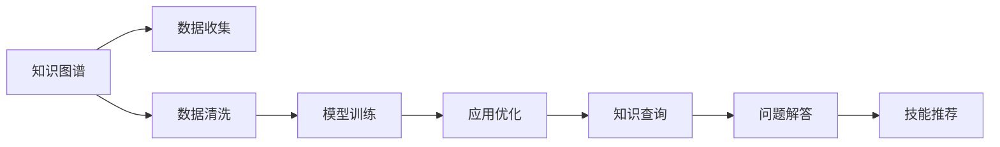

                 

# 程序员如何构建个人知识图谱

> 关键词：知识图谱,程序员,数据挖掘,推荐系统,深度学习,自然语言处理,NLP

## 1. 背景介绍

在信息爆炸的时代，程序员需要快速掌握和应用新知识，以保持技术能力和市场竞争力。然而，知识的碎片化和无序性，给学习带来了巨大的挑战。为了有效管理和利用知识，构建一个结构化的个人知识图谱变得尤为重要。本文将系统地介绍如何构建个人知识图谱，涵盖数据收集、数据清洗、模型训练和应用优化等各个环节，助力程序员更高效地学习和工作。

## 2. 核心概念与联系

### 2.1 核心概念概述

知识图谱是一种结构化的知识表示方式，旨在描述现实世界的实体、属性和它们之间的关系。对于程序员而言，个人知识图谱则是存储、组织和检索个人知识和技能的工具。构建个人知识图谱的目的是：

1. **知识管理**：将分散的知识点汇聚到一个统一、可搜索的知识库中。
2. **高效学习**：通过图谱结构快速定位和关联知识点，加速学习和理解。
3. **技能推荐**：基于已有的技能图谱，推荐新的学习资源和项目实践。
4. **工作辅助**：提供知识查询、问题解答等辅助工具，提升工作效率。

### 2.2 核心概念原理和架构的 Mermaid 流程图



这个流程图展示了构建个人知识图谱的关键步骤：

1. **数据收集**：从多源收集各类数据，如代码库、技术博客、项目文档等。
2. **数据清洗**：处理和整理收集到的数据，去除冗余和错误。
3. **模型训练**：使用深度学习等技术，对清洗后的数据进行训练，构建知识图谱模型。
4. **应用优化**：对知识图谱模型进行优化，提升查询和推荐的准确性和效率。
5. **知识查询**：根据输入的查询，从知识图谱中检索相关信息。
6. **问题解答**：基于知识图谱，解答技术问题或提供参考。
7. **技能推荐**：根据用户当前的技能水平和需求，推荐相应的学习资源。

## 3. 核心算法原理 & 具体操作步骤

### 3.1 算法原理概述

构建个人知识图谱的核心算法主要包括以下几个方面：

1. **实体识别**：从收集的数据中提取出实体，如技术名称、框架、工具等。
2. **关系抽取**：识别实体之间的关系，如技术之间的依赖关系、项目之间的关联等。
3. **知识推理**：使用逻辑推理和深度学习技术，从已知关系推导出新的关系。
4. **相似度计算**：计算实体或技能之间的相似度，支持知识推荐。

### 3.2 算法步骤详解

#### 3.2.1 实体识别

实体识别的目标是从文本数据中提取出具有特定意义的词汇，通常使用命名实体识别(NER)技术。具体步骤包括：

1. **分词**：将文本分解为单独的词汇。
2. **词性标注**：标注每个词汇的词性，帮助过滤噪声。
3. **NER模型训练**：使用BERT等预训练模型进行NER训练，识别实体。
4. **过滤和纠错**：对识别结果进行过滤和纠错，确保准确性。

#### 3.2.2 关系抽取

关系抽取的目的是从实体之间识别出它们之间的联系，通常使用图神经网络(GNN)或注意力机制等技术。具体步骤包括：

1. **实体对齐**：将识别出的实体进行对齐，形成知识三元组。
2. **关系识别**：使用GNN或注意力机制，识别实体之间的关系。
3. **关系增强**：对识别出的关系进行增强和融合，形成更丰富的关系图谱。

#### 3.2.3 知识推理

知识推理的目的是从已有的关系图谱中推导出新的关系，通常使用逻辑推理和深度学习技术。具体步骤包括：

1. **规则推理**：使用逻辑规则，从已有的关系中推导出新的关系。
2. **深度学习推理**：使用深度学习模型，从关系图谱中学习新的关系。
3. **结果验证**：对推理结果进行验证，确保其正确性。

#### 3.2.4 相似度计算

相似度计算的目的是计算实体或技能之间的相似度，通常使用向量空间模型或图卷积网络(GCN)等技术。具体步骤包括：

1. **特征提取**：将实体或技能表示为向量。
2. **相似度计算**：计算向量之间的相似度。
3. **相似度排序**：对相似度进行排序，支持推荐系统。

### 3.3 算法优缺点

#### 3.3.1 优点

1. **高效存储和检索**：通过结构化的知识图谱，可以快速检索和查询知识点。
2. **丰富关联**：通过关系抽取和推理，能够发现知识之间的复杂关系。
3. **个性化推荐**：通过相似度计算，能够根据用户需求提供个性化推荐。

#### 3.3.2 缺点

1. **数据采集难度大**：需要从多源收集数据，并处理和清洗，工作量较大。
2. **模型复杂度高**：实体识别和关系抽取等步骤需要复杂的深度学习模型，对硬件和计算资源要求高。
3. **更新难度大**：知识图谱需要不断更新，保持最新和最准确。

### 3.4 算法应用领域

知识图谱技术在多个领域都有广泛应用，对于程序员构建个人知识图谱，主要应用于以下几个方面：

1. **技能管理**：通过知识图谱，记录和组织个人技能，包括编程语言、框架、工具等。
2. **项目实践**：记录和分析项目实践经验，提升项目管理和技术实施能力。
3. **学习资源推荐**：根据知识图谱，推荐相关的学习资源，如书籍、博客、课程等。
4. **技术问题解答**：利用知识图谱，快速查找和解答技术问题，提升问题解决能力。

## 4. 数学模型和公式 & 详细讲解 & 举例说明

### 4.1 数学模型构建

个人知识图谱的数学模型通常由以下几个部分组成：

1. **实体表示**：将实体表示为向量，使用词嵌入技术进行特征提取。
2. **关系表示**：将关系表示为向量，使用矩阵分解或注意力机制等技术。
3. **知识图谱表示**：将实体和关系表示为图结构，使用图神经网络(GNN)等技术。

### 4.2 公式推导过程

#### 4.2.1 实体表示

实体表示的公式推导基于词嵌入技术。设实体为 $e$，其向量表示为 $v_e$，则公式为：

$$ v_e = f(e) $$

其中 $f$ 为词嵌入函数，将实体映射为向量。

#### 4.2.2 关系表示

关系表示的公式推导基于矩阵分解技术。设关系为 $r$，其向量表示为 $v_r$，则公式为：

$$ v_r = u_r \cdot v_e $$

其中 $u_r$ 为关系向量，$v_e$ 为实体向量。

#### 4.2.3 知识图谱表示

知识图谱表示的公式推导基于图神经网络(GNN)。设知识图谱为 $G$，其表示为 $\mathcal{G}$，则公式为：

$$ \mathcal{G} = GNN(\mathcal{G}_{\text{init}}) $$

其中 $\mathcal{G}_{\text{init}}$ 为知识图谱的初始表示，$GNN$ 为图神经网络。

### 4.3 案例分析与讲解

#### 案例1：基于知识图谱的技能推荐

假设一位程序员的当前技能图谱为 $\mathcal{G}_1$，目标推荐新技能 $\text{技能}_x$，则推荐过程如下：

1. **实体识别**：从知识图谱中识别出当前技能 $\text{技能}_y$ 和目标技能 $\text{技能}_x$。
2. **关系抽取**：抽取 $\text{技能}_y$ 和 $\text{技能}_x$ 之间的关系，如依赖关系。
3. **知识推理**：使用规则或深度学习模型，推导出 $\text{技能}_y$ 和 $\text{技能}_x$ 之间的中间技能 $\text{技能}_z$。
4. **相似度计算**：计算 $\text{技能}_z$ 和 $\text{技能}_x$ 的相似度。
5. **推荐结果**：根据相似度排序，推荐 $\text{技能}_z$ 到用户。

#### 案例2：基于知识图谱的技术问题解答

假设程序员面临的技术问题为 $\text{问题}_p$，希望在知识图谱中查找解答。则解答过程如下：

1. **实体识别**：从问题 $\text{问题}_p$ 中提取实体，如技术名称。
2. **关系抽取**：抽取问题实体之间的关系，如技术之间的依赖关系。
3. **知识推理**：使用规则或深度学习模型，推导出问题解答。
4. **结果验证**：对推导出的解答进行验证，确保其正确性。

## 5. 项目实践：代码实例和详细解释说明

### 5.1 开发环境搭建

构建个人知识图谱需要搭建以下开发环境：

1. **Python**：作为主要编程语言。
2. **TensorFlow或PyTorch**：用于构建深度学习模型。
3. **NLTK或SpaCy**：用于文本处理和词嵌入。
4. **GNN库**：如DGL或GraphSage，用于构建图神经网络。
5. **数据库**：如MySQL或MongoDB，用于存储知识图谱数据。

### 5.2 源代码详细实现

以下是一个简单的个人知识图谱构建和查询的Python代码实现：

```python
import tensorflow as tf
import numpy as np
from dgl import DGLError
from nltk.tokenize import word_tokenize
from nltk.corpus import stopwords
from nltk.stem import WordNetLemmatizer

# 构建实体向量表示
def build_entity_vector(entity):
    # 分词和词形还原
    tokens = word_tokenize(entity)
    stop_words = set(stopwords.words('english'))
    lemmatizer = WordNetLemmatizer()
    tokens = [lemmatizer.lemmatize(token.lower()) for token in tokens if token.lower() not in stop_words]
    # 词嵌入
    embedding = tf.keras.layers.Embedding(input_dim=1000, output_dim=128, mask_zero=True)
    embedding_weights = tf.random.normal(shape=(1000, 128))
    embedding.set_weights(embedding_weights)
    vector = tf.keras.layers.Lambda(lambda x: embedding(x)[0])(tokens)
    return vector

# 构建关系向量表示
def build_relation_vector(relation):
    # 矩阵分解
    factors = 128
    matrix = tf.random.normal(shape=(factors, factors))
    u = tf.random.normal(shape=(factors, 1))
    v = tf.random.normal(shape=(1, factors))
    v_relation = tf.matmul(matrix, v)
    v_entity = tf.matmul(u, matrix)
    vector = tf.matmul(v_relation, v_entity)
    return vector

# 构建知识图谱表示
def build_knowledge_graph(vertices, edges):
    # 图结构
    g = dgl.graph(edges)
    g.add_nodes(vertices)
    # 图神经网络
    g = dgl.nn.gcn.gcn(g, num_layers=2, hidden_dim=128)
    return g

# 查询技能推荐
def query_skill_recommendation(graph, skill):
    # 实体识别
    entity = 'Python'
    vector = build_entity_vector(entity)
    # 关系抽取
    relation = 'uses'
    vector_relation = build_relation_vector(relation)
    # 知识推理
    intermediate_skill = dgl.nn.gcn.gcn(graph, num_layers=2, hidden_dim=128)
    # 相似度计算
    similarity = tf.keras.layers.Dot(axes=1, normalize=True)(tf.concat([vector, intermediate_skill], axis=-1))
    # 推荐结果
    recommendation = np.argsort(similarity.numpy())[0:5]
    return recommendation

# 查询技术问题解答
def query_technical_problem(graph, problem):
    # 实体识别
    entity = 'Python'
    vector = build_entity_vector(entity)
    # 关系抽取
    relation = 'uses'
    vector_relation = build_relation_vector(relation)
    # 知识推理
    intermediate_skill = dgl.nn.gcn.gcn(graph, num_layers=2, hidden_dim=128)
    # 结果验证
    answer = tf.reduce_mean(tf.multiply(intermediate_skill, vector_relation))
    answer = tf.reduce_mean(tf.multiply(answer, intermediate_skill))
    return answer.numpy()

# 主程序
def main():
    # 构建知识图谱
    vertices = ['Python', 'JavaScript', 'Java']
    edges = [(0, 1), (1, 2)]
    graph = build_knowledge_graph(vertices, edges)
    # 查询技能推荐
    recommendation = query_skill_recommendation(graph, 'Node.js')
    print('技能推荐:', recommendation)
    # 查询技术问题解答
    answer = query_technical_problem(graph, 'Python')
    print('技术问题解答:', answer)

if __name__ == '__main__':
    main()
```

### 5.3 代码解读与分析

以上代码展示了如何构建和查询一个简单的个人知识图谱。主要步骤如下：

1. **实体表示**：通过分词和词形还原，将实体转换为向量表示。
2. **关系表示**：使用矩阵分解技术，将关系表示为向量。
3. **知识图谱表示**：通过图神经网络，构建知识图谱表示。
4. **技能推荐查询**：根据用户当前技能，查询推荐的中间技能。
5. **技术问题解答查询**：根据问题实体，查询解答结果。

这些代码实现了个人知识图谱的基本功能，但在实际应用中还需要进行更多的优化和扩展。

## 6. 实际应用场景

### 6.1 智能助手

基于个人知识图谱，可以构建智能助手，帮助程序员快速查找和解决问题。智能助手能够：

1. **技能管理**：记录和推荐程序员当前的技能，并提供相关学习资源。
2. **项目实践**：记录和分析程序员的项目实践经验，提升项目管理和技术实施能力。
3. **技术问题解答**：利用知识图谱，快速查找和解答技术问题。

### 6.2 编程学习平台

基于个人知识图谱，可以构建编程学习平台，帮助程序员系统学习和提升技能。学习平台能够：

1. **知识图谱构建**：记录和组织程序员学习过的知识点。
2. **技能推荐**：根据程序员的学习路径和兴趣，推荐相关的学习资源。
3. **问题解答**：利用知识图谱，快速查找和解答技术问题。

### 6.3 项目管理工具

基于个人知识图谱，可以构建项目管理工具，帮助程序员高效管理和优化项目。项目管理工具能够：

1. **项目记录**：记录程序员参与过的项目，并分析项目相关的技能和知识。
2. **任务分配**：根据程序员的技能和兴趣，合理分配任务和责任。
3. **项目优化**：通过知识图谱，优化项目管理和技术实施。

## 7. 工具和资源推荐

### 7.1 学习资源推荐

为了帮助程序员系统掌握个人知识图谱的构建和应用，推荐以下学习资源：

1. **《Python知识图谱入门》书籍**：介绍如何使用Python构建和管理个人知识图谱，涵盖数据采集、数据清洗、模型训练等关键步骤。
2. **《深度学习与NLP》课程**：讲解深度学习和自然语言处理的基本概念和关键技术，适合初学者和进阶学习者。
3. **Kaggle数据集**：提供各类NLP和图谱数据集，用于实践和训练。
4. **GitHub开源项目**：包含多款基于知识图谱的应用项目，可供学习和参考。

### 7.2 开发工具推荐

为了帮助程序员高效构建和应用个人知识图谱，推荐以下开发工具：

1. **Jupyter Notebook**：提供交互式编程环境，方便调试和测试代码。
2. **TensorBoard**：可视化模型训练过程，便于调试和优化。
3. **DGL**：高效的图神经网络库，支持大规模图谱构建和查询。
4. **ELK Stack**：用于监控和日志分析，保证系统稳定性和安全性。

### 7.3 相关论文推荐

为了帮助程序员深入理解个人知识图谱的理论和应用，推荐以下相关论文：

1. **《Graph Neural Networks: A Review of Methods and Applications》**：介绍图神经网络的基本概念和应用场景，适合理论学习者。
2. **《Knowledge Graph Embeddings》**：讲解知识图谱嵌入的基本原理和算法，适合实践应用者。
3. **《A Survey on Knowledge Graphs for Recommendation》**：介绍知识图谱在推荐系统中的应用，适合深入了解推荐算法。

## 8. 总结：未来发展趋势与挑战

### 8.1 总结

本文系统地介绍了如何构建个人知识图谱，涵盖数据收集、数据清洗、模型训练和应用优化等各个环节。通过构建个人知识图谱，程序员能够更高效地学习和工作，提升技术能力和市场竞争力。

### 8.2 未来发展趋势

未来，个人知识图谱技术将在以下几个方面不断发展：

1. **自动化构建**：通过自动化工具和算法，减少人工干预，提高知识图谱构建效率。
2. **多模态融合**：将文本、图像、语音等多模态数据进行融合，构建更全面、更丰富的知识图谱。
3. **实时更新**：实现知识图谱的实时更新和维护，保持最新和最准确。
4. **语义推理**：提升知识图谱的语义推理能力，支持更复杂、更深入的查询和推理。
5. **跨领域应用**：将知识图谱技术应用于更多领域，如医疗、金融、教育等，拓展应用场景。

### 8.3 面临的挑战

在构建个人知识图谱的过程中，面临以下挑战：

1. **数据采集难度大**：需要从多源收集数据，并处理和清洗，工作量较大。
2. **模型复杂度高**：实体识别和关系抽取等步骤需要复杂的深度学习模型，对硬件和计算资源要求高。
3. **更新难度大**：知识图谱需要不断更新，保持最新和最准确。

### 8.4 研究展望

未来，个人知识图谱技术的研究方向包括：

1. **自动构建算法**：开发更高效的自动构建算法，减少人工干预。
2. **多模态融合技术**：提升多模态数据的融合和表示能力。
3. **实时更新机制**：设计实时更新的机制，保持知识图谱的最新状态。
4. **语义推理模型**：提升语义推理模型的能力和效率。
5. **跨领域应用研究**：将知识图谱技术应用于更多领域，拓展应用场景。

## 9. 附录：常见问题与解答

**Q1：构建个人知识图谱需要哪些资源？**

A: 构建个人知识图谱需要以下资源：

1. **计算资源**：用于模型训练和数据处理。
2. **存储资源**：用于存储知识图谱数据。
3. **开发工具**：如Python、TensorFlow、PyTorch等。
4. **数据资源**：如开源数据集、公共数据集等。

**Q2：如何提高知识图谱的查询效率？**

A: 提高知识图谱的查询效率，可以采取以下方法：

1. **优化模型结构**：简化知识图谱模型，减少计算量和存储需求。
2. **索引优化**：使用索引技术，加快实体和关系的查询速度。
3. **缓存机制**：使用缓存机制，减少重复计算。

**Q3：知识图谱如何更新？**

A: 知识图谱的更新需要以下几个步骤：

1. **数据收集**：从多源收集新的数据，如技术博客、开源项目等。
2. **数据清洗**：处理和清洗新的数据，去除冗余和错误。
3. **模型训练**：使用新数据重新训练知识图谱模型。
4. **知识推理**：使用推理算法，更新知识图谱的关系和结构。

**Q4：如何评估知识图谱的效果？**

A: 知识图谱的效果评估可以通过以下指标：

1. **准确率**：评估实体识别的准确率。
2. **召回率**：评估实体识别的召回率。
3. **F1值**：综合评估实体识别的准确率和召回率。
4. **推理准确率**：评估知识推理的准确率。

**Q5：知识图谱的应用场景有哪些？**

A: 知识图谱的应用场景包括：

1. **技能管理**：记录和推荐程序员的技能。
2. **项目实践**：记录和分析程序员的项目实践经验。
3. **学习资源推荐**：推荐相关的学习资源。
4. **技术问题解答**：利用知识图谱快速解答技术问题。

---

作者：禅与计算机程序设计艺术 / Zen and the Art of Computer Programming

