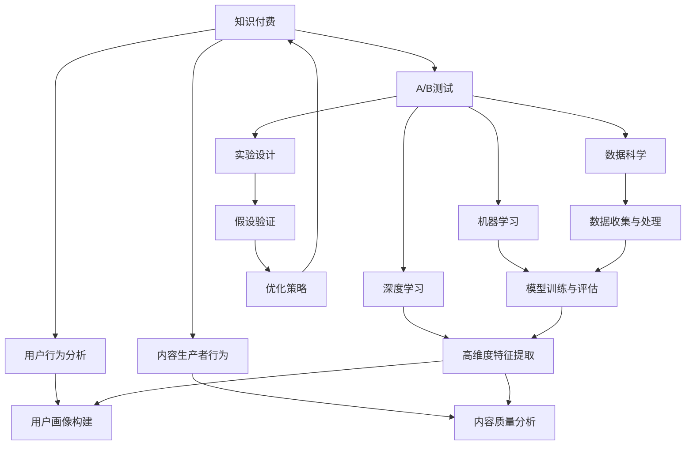

                 

## 1. 背景介绍

随着互联网的普及和技术的进步，知识付费成为了一个蓬勃发展的领域。程序员作为知识付费的主要受众之一，面临着如何有效筛选和推荐优质内容，提升学习效率和效果的问题。传统的内容推荐方式主要依赖于算法模型，但随着用户行为和内容生产日趋复杂，如何设计高效的A/B测试方案，进行精准的数据分析和实验验证，以实现更好的内容推荐，成为了一个新的研究热点。

本文将详细探讨程序员如何进行知识付费的A/B测试，从核心概念、算法原理、操作步骤、实际应用场景、工具资源推荐等方面展开。通过系统性的介绍和实践指导，帮助程序员更好地进行知识付费内容推荐优化，提升自身的学习效果和平台的用户体验。

## 2. 核心概念与联系

### 2.1 核心概念概述

在讨论如何进行知识付费的A/B测试前，需要先理解以下核心概念：

- **知识付费**：指用户为获取专业知识、技术、课程等内容，支付费用获取服务的模式。主要包括在线课程、电子书、专业问答、技术博客等形式。
- **A/B测试**：一种常用的实验方法，通过比较两个版本的内容，确定哪个版本的效果更好，以指导后续内容推荐策略的优化。
- **数据科学**：利用数据和技术工具进行数据分析、模型训练和结果验证的过程，是A/B测试的基础。
- **机器学习**：通过模型学习数据特征，进行自动化的决策和推荐。
- **深度学习**：一种机器学习技术，利用神经网络进行复杂特征提取和数据建模，适用于大规模、高维度数据。

这些概念之间的联系通过以下Mermaid流程图展示：



这个流程图展示了知识付费领域的A/B测试与数据科学、机器学习、深度学习、用户行为分析等核心概念之间的关系。

## 3. 核心算法原理 & 具体操作步骤

### 3.1 算法原理概述

进行知识付费的A/B测试，核心在于设计实验、收集数据、分析结果和优化策略。其基本流程如下：

1. **设计实验**：根据业务需求，设计不同的测试版本，确保测试组和对照组具有可比性。
2. **数据收集**：收集测试版本和对照版本的表现数据，并进行清洗、处理和归一化。
3. **结果分析**：通过统计分析和机器学习模型，评估不同版本的性能。
4. **优化策略**：根据分析结果，调整内容推荐策略，以提升用户体验和内容效果。

### 3.2 算法步骤详解

**Step 1: 实验设计**
- **目标设定**：明确A/B测试的目标，如点击率、注册率、用户留存率等。
- **版本选择**：设计不同的测试版本，如内容推荐算法、用户界面设计等，确保测试组和对照组具有代表性。
- **样本划分**：随机抽取部分用户，分成测试组和对照组，保证测试结果的统计显著性。

**Step 2: 数据收集**
- **数据类型**：收集点击量、转化率、用户反馈等行为数据，以及用户画像、内容标签等属性数据。
- **数据收集工具**：使用Google Analytics、Mixpanel等工具，确保数据的实时性和准确性。
- **数据处理**：对数据进行清洗、去重、归一化等预处理，确保数据质量。

**Step 3: 结果分析**
- **统计分析**：使用卡方检验、t检验、方差分析等统计方法，评估不同版本的表现差异。
- **机器学习模型**：使用决策树、随机森林、梯度提升树等模型，对不同版本进行分类和回归分析。
- **特征工程**：提取关键特征，如用户活跃度、内容相关性等，用于模型训练和评估。

**Step 4: 优化策略**
- **策略选择**：根据分析结果，选择优化方向，如调整推荐算法、改进用户体验等。
- **策略实施**：在对照组和新版本中进行小规模实验，验证优化效果。
- **策略推广**：在验证效果后，全面推广优化策略，进行大规模部署。

### 3.3 算法优缺点

**优点**：
- 精确性高：A/B测试通过数据对比，可以准确地评估不同策略的效果。
- 可重复性：A/B测试方法论具有科学性和规范性，可以重复进行。
- 高效性：可以快速验证假设，减少试错成本。

**缺点**：
- 实验周期长：A/B测试需要一定的时间，可能影响业务推进速度。
- 数据偏差：数据收集和处理过程中可能存在偏差，影响实验结果。
- 成本较高：设计、实施、分析A/B测试需要投入大量人力物力。

### 3.4 算法应用领域

A/B测试在知识付费领域有广泛的应用场景：

- **内容推荐优化**：通过A/B测试不同的内容推荐算法，优化内容推荐效果。
- **用户界面设计**：比较不同用户界面设计的效果，提升用户满意度。
- **付费策略调整**：测试不同的付费策略，如订阅模式、按需购买模式等，找到最优方案。
- **广告投放优化**：对比不同广告投放策略的效果，提高广告转化率。
- **用户体验改进**：通过A/B测试，改进用户界面、交互设计等，提升用户体验。

## 4. 数学模型和公式 & 详细讲解

### 4.1 数学模型构建

假设测试组和对照组的点击次数分别为 $N_A$ 和 $N_B$，转化次数分别为 $M_A$ 和 $M_B$，则点击率分别为 $r_A = \frac{M_A}{N_A}$ 和 $r_B = \frac{M_B}{N_B}$。通过卡方检验，计算P值和显著性水平 $\alpha$，判断两个点击率是否显著不同。

### 4.2 公式推导过程

卡方检验的公式为：

$$
\chi^2 = \frac{N_A r_A^2 + N_B r_B^2 - (N_A+N_B) (r_A + r_B)^2 / 4}{N_A N_B / 4}
$$

其中 $\chi^2$ 为卡方统计量，自由度为1。P值为：

$$
P = 1 - \text{P-ChiSq}(\chi^2, 1)
$$

若P值小于显著性水平 $\alpha$（通常为0.05），则认为两个点击率显著不同，测试组效果优于对照组。

### 4.3 案例分析与讲解

以内容推荐算法为例，测试组采用协同过滤算法，对照组采用基于内容的推荐算法。收集两组用户在不同时间段的点击和转化数据，使用卡方检验计算P值，判断哪种算法更适合推荐用户感兴趣的内容。

## 5. 项目实践：代码实例和详细解释说明

### 5.1 开发环境搭建

为了进行A/B测试，首先需要搭建测试环境。以下是Python环境搭建步骤：

1. 安装Python和pip。
2. 安装相关库，如SciPy、Pandas、NumPy、Matplotlib等。
3. 配置测试工具，如Google Analytics API、Mixpanel API等。

### 5.2 源代码详细实现

以下是一个简单的A/B测试代码实现，使用Pandas库进行数据处理和分析：

```python
import pandas as pd
import scipy.stats as stats

# 加载数据
data = pd.read_csv('test_data.csv')

# 划分测试组和对照组
test_group = data[data['group'] == 'test']
control_group = data[data['group'] == 'control']

# 计算点击率和转化率
test_rates = test_group[['clicks', 'conversions']].mean()
control_rates = control_group[['clicks', 'conversions']].mean()

# 卡方检验
chi2, p_value, dof, expected = stats.chi2_contingency([test_rates, control_rates])

# 输出结果
print(f'P-value: {p_value}')
```

### 5.3 代码解读与分析

上述代码实现了A/B测试的基本流程，包括数据加载、分组、计算统计量、卡方检验等步骤。通过对比测试组和对照组的数据，可以得出P值，判断两个版本的效果差异。

## 6. 实际应用场景

### 6.1 知识付费内容推荐

在知识付费平台上，通过A/B测试不同的内容推荐算法，可以显著提升用户的点击率和购买率。例如，测试协同过滤和基于内容的推荐算法，找到最优推荐策略。

### 6.2 广告投放优化

广告主可以通过A/B测试不同的广告创意和投放渠道，找到最有效的广告策略，提高广告转化率。例如，测试不同的广告文案和图片设计，以及不同的投放平台和时间段，优化广告效果。

### 6.3 用户体验改进

通过A/B测试不同的用户界面设计，可以提升用户满意度和留存率。例如，测试不同的导航结构、按钮布局、页面加载速度等，找到最优设计方案。

## 7. 工具和资源推荐

### 7.1 学习资源推荐

为了掌握A/B测试的核心技术，以下是一些推荐的学习资源：

- 《A/B Testing: The Most Powerful Way to Turn Clicks into Customers》：该书详细介绍了A/B测试的理论和实践方法，适合初学者和进阶读者。
- Coursera的《Data Science Specialization》：由Johns Hopkins大学开设，涵盖数据分析、统计学、机器学习等核心内容，适合全面学习。
- Kaggle竞赛：参加A/B测试相关的数据竞赛，如Google's AI Challenge等，通过实战提升技能。

### 7.2 开发工具推荐

以下是一些常用的A/B测试开发工具：

- Google Analytics：提供用户行为分析、转化跟踪等功能，适合跟踪点击率、购买率等关键指标。
- Mixpanel：提供用户路径分析、漏斗分析等功能，适合深入理解用户行为和转化过程。
- Optimizely：提供A/B测试、多变量测试等功能，适合构建和部署实验。

### 7.3 相关论文推荐

以下是几篇关于A/B测试的知名论文：

- Efron, B. (1963). "The Jackknife, the Bootstrap, and Other Resampling Methods". The Annals of Mathematical Statistics.
- Cohn, E. A., & Schouten, A. A. (2014). "Why Do People Not A/B Test? A Typology of Barriers to Practitioners' Adoption of the Method". Journal of Usability Studies.

## 8. 总结：未来发展趋势与挑战

### 8.1 研究成果总结

本文详细介绍了程序员如何进行知识付费的A/B测试，从实验设计、数据收集、结果分析到优化策略，提供了完整的步骤和方法。通过学习本文，程序员可以更好地进行A/B测试，提升内容推荐和用户体验，实现知识付费领域的精准化、个性化服务。

### 8.2 未来发展趋势

未来，A/B测试在知识付费领域的应用将更加广泛和深入，具体趋势包括：

- **自动化测试**：通过机器学习和自动化技术，实现更高效的A/B测试流程。
- **多目标优化**：结合用户行为分析和多目标优化算法，找到最优推荐策略。
- **实时分析**：使用流数据处理和实时分析技术，实现实时化的A/B测试。
- **跨平台整合**：整合不同平台的测试数据，进行更全面的实验分析。

### 8.3 面临的挑战

虽然A/B测试在知识付费领域具有重要应用价值，但仍然面临以下挑战：

- **数据隐私**：用户数据隐私保护是A/B测试中的重要问题，需要制定合理的隐私政策和数据保护措施。
- **数据质量**：数据质量差、数据偏差等问题可能影响实验结果的可靠性。
- **资源投入**：A/B测试需要大量人力物力，增加了平台的运营成本。

### 8.4 研究展望

未来的研究可以从以下几个方向进行探索：

- **混合测试**：结合A/B测试和多臂赌博机（Multi-Armed Bandit）方法，优化推荐策略。
- **交互设计**：结合心理学和认知科学，优化用户界面和交互设计，提升用户体验。
- **跨领域应用**：将A/B测试方法应用于其他领域，如电商、金融等，推广其应用价值。

## 9. 附录：常见问题与解答

**Q1: A/B测试是否适用于所有类型的知识付费内容？**

A: A/B测试适用于大部分内容类型，但需要注意不同内容的推荐算法和评估指标。例如，对于视频内容，可以测试不同视频时长、质量、风格等，优化视频推荐效果。

**Q2: 如何进行大规模A/B测试？**

A: 大规模A/B测试需要更高的资源投入和更精细的实验设计。可以使用分布式计算和大数据处理技术，提高测试效率。同时，可以采用分层抽样和多次测试，确保实验结果的准确性。

**Q3: A/B测试结果如何解释和应用？**

A: A/B测试结果需要结合业务需求和数据特征进行综合分析。测试结果的显著性水平、置信区间等信息，可以帮助解释测试结果，指导后续的优化策略。

---

作者：禅与计算机程序设计艺术 / Zen and the Art of Computer Programming

