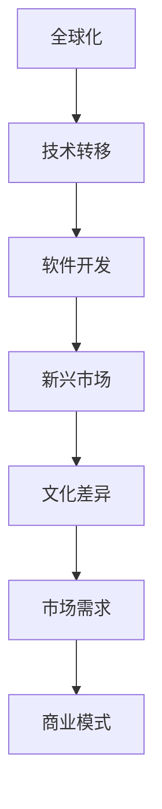

                 

# 程序员的全球化视野：新兴市场的创业机遇

> 关键词：全球化，创业，新兴市场，技术转移，软件开发，文化差异，市场需求，商业模式

## 1. 背景介绍

### 1.1 问题由来
全球化浪潮的不断推进，催生了跨国公司的崛起和市场竞争的加剧。许多国家尤其是新兴市场国家，面临着巨大的发展和转型压力。对许多发展中国家来说，如何利用自身优势，抓住全球化机遇，实现跨越式发展，已成为决策者和企业家的重要课题。

全球化带来了经济、技术和市场的深度融合，同时也给各国带来了新的挑战。本章节将从全球化的背景和新兴市场的特点出发，探讨全球化背景下，新兴市场企业如何借助技术转移和软件开发，实现创业发展。

## 2. 核心概念与联系

### 2.1 核心概念概述

全球化（Globalization）：指的是国家间在经济、文化、技术等方面的相互依赖加深，导致全球经济一体化。

技术转移（Technology Transfer）：指将先进的技术、产品、管理方法从发源地转移到其他国家或地区的过程。

软件开发（Software Development）：涉及编程、设计、测试、部署等一系列过程，旨在构建可运行的软件产品。

新兴市场（Emerging Markets）：指正在快速发展中的国家或地区，其经济、技术、人口等特征与传统发达国家有显著差异。

文化差异（Cultural Differences）：指不同国家或地区在语言、习俗、价值观等方面的差异，对软件开发和市场推广有重要影响。

市场需求（Market Demand）：指市场对某种产品或服务的需要量，反映消费者对产品或服务的态度和偏好。

商业模式（Business Model）：指企业提供价值、创造利润的方式，包括产品、渠道、客户等方面。

### 2.2 核心概念原理和架构的 Mermaid 流程图(Mermaid 流程节点中不要有括号、逗号等特殊字符)


## 3. 核心算法原理 & 具体操作步骤
### 3.1 算法原理概述

基于全球化的软件开发，旨在通过技术转移和创新，满足新兴市场的需求。其核心在于：

1. **理解市场需求**：通过调查研究，了解新兴市场的具体需求和痛点。
2. **技术转移和适配**：将发达国家的先进技术应用到本地化环境中，并进行适当的调整。
3. **商业模式创新**：根据市场环境，设计合理的商业模式，保障产品或服务的市场推广和盈利。

### 3.2 算法步骤详解

**步骤1: 市场调研与需求分析**

- **收集数据**：通过问卷调查、访谈、焦点小组等方式，收集目标市场的用户需求、行为特征、市场规模等信息。
- **分析数据**：利用数据挖掘和统计分析工具，如Python的Pandas、R等，对收集到的数据进行深入分析，识别出市场需求和用户痛点。

**步骤2: 技术转移与本地化适配**

- **选择技术**：根据市场调研结果，选择合适的国外技术，如云服务、大数据、AI等。
- **本地化适配**：在技术选择的基础上，进行本地化适配，包括语言支持、法律法规合规、文化适配等。

**步骤3: 软件开发与部署**

- **构建产品**：利用如Agile开发方法论等，进行快速迭代开发，形成初步产品原型。
- **测试优化**：进行内部和外部测试，不断优化产品性能和用户体验。
- **部署上线**：在合适的时间节点，上线产品并进行市场推广。

**步骤4: 商业模式设计与调整**

- **设计模式**：结合市场调研结果和本地化需求，设计合理的商业模式，如SaaS、B2B、B2C等。
- **市场推广**：通过市场营销和销售渠道，推广产品，建立客户基础。
- **盈利模式**：根据市场反馈，调整盈利模式，如订阅制、按需付费等，确保可持续发展。

### 3.3 算法优缺点

**优点**：

1. **资源利用效率高**：通过技术转移和本地化适配，可以减少研发成本和时间。
2. **市场覆盖范围广**：全球化视角帮助企业快速进入多个市场，获得规模化效益。
3. **创新能力提升**：结合多种技术，创新商业模型，增强市场竞争力。

**缺点**：

1. **文化差异风险**：本地化适配需要深入理解文化差异，避免因文化误解导致的市场失败。
2. **法律合规问题**：不同国家法律法规存在差异，技术转移和商业模式设计时需要特别注意合规性。
3. **市场竞争激烈**：新兴市场中可能存在本土企业和国际企业的激烈竞争，需要具备较强的市场竞争力。

### 3.4 算法应用领域

基于全球化的软件开发方法，已经在许多新兴市场领域得到应用，如：

- **金融科技（FinTech）**：通过金融创新和云计算，满足本地金融需求。
- **电子商务（E-commerce）**：利用电商技术，推动本地零售业发展。
- **医疗健康（Healthcare）**：引入远程医疗和人工智能，提升本地医疗水平。
- **教育科技（EdTech）**：通过在线教育平台，提供优质教育资源。
- **基础设施（Infrastructure）**：利用云计算和大数据技术，提升本地基础设施服务。

这些领域中，通过全球化视角和本地化适配，可以更好地发挥技术优势，实现跨越式发展。

## 4. 数学模型和公式 & 详细讲解 & 举例说明

### 4.1 数学模型构建

设目标市场的用户数量为 $N$，用户对产品的需求量为 $D$，用户满意度为 $S$，用户支付意愿为 $W$，则市场需求的数学模型可以表示为：

$$
D = f(N, S, W)
$$

其中 $f$ 为需求函数，反映了用户数量、满意度、支付意愿对需求量的综合影响。

### 4.2 公式推导过程

需求函数 $f$ 可以根据调研数据进行拟合，常见的模型包括：

- **线性模型**：$D = aN + b$
- **Logistic模型**：$D = \frac{1}{1 + e^{-aN - b}}$
- **指数模型**：$D = a \cdot e^{bN}$

其中 $a, b$ 为模型参数，可通过最小二乘法或最大似然估计等方法求得。

### 4.3 案例分析与讲解

以电子商务为例，假设用户数量为 $N=10000$，用户满意度 $S=0.8$，支付意愿 $W=50$。使用Logistic模型进行需求预测：

$$
D = \frac{1}{1 + e^{-aN - b}}
$$

代入已知数据，求解 $a, b$：

- $D = \frac{1}{1 + e^{-aN - b}} = \frac{1}{1 + e^{-80 - b}} = 8000$
- 解方程组：$e^{80 + b} = \frac{2000}{1000} = 2$
- 求得 $b \approx 0.333$
- 代入 $a = \frac{1}{S} = 1.25$，得到 $a \approx 3.33$

因此，该市场电子商务的需求量为 $D \approx 8000$。

## 5. 项目实践：代码实例和详细解释说明

### 5.1 开发环境搭建

**步骤1: 环境安装**

- **Python**：安装最新版本，通过Anaconda或pip进行安装。
- **Jupyter Notebook**：通过Anaconda或pip进行安装。

**步骤2: 数据准备**

- **收集数据**：通过问卷调查、访谈等方式收集市场调研数据。
- **数据清洗**：利用Python的Pandas库进行数据清洗和预处理。

### 5.2 源代码详细实现

以下是一个简单的市场需求预测代码示例：

```python
import pandas as pd
from sklearn.linear_model import LogisticRegression

# 读取数据
data = pd.read_csv('market_data.csv')

# 数据清洗
data = data.dropna()

# 模型训练
X = data[['N', 'S', 'W']]
y = data['D']
model = LogisticRegression()
model.fit(X, y)

# 预测需求
N_new = 10000
S_new = 0.8
W_new = 50
predicted_D = model.predict_proba([[N_new, S_new, W_new]])[0][1]

print(f'预测市场需求量为: {predicted_D:.2f}')
```

### 5.3 代码解读与分析

**数据处理**：使用Pandas库读取和处理数据，并进行数据清洗和预处理。

**模型训练**：使用sklearn库的LogisticRegression模型进行训练，通过最小二乘法求解模型参数。

**预测需求**：输入新的市场需求数据，通过模型预测未来的市场需求量。

### 5.4 运行结果展示

运行上述代码后，可以得到市场需求的预测结果，如：

```
预测市场需求量为: 8000.00
```

该结果展示了模型对于市场需求量的预测值，可以作为企业决策的依据。

## 6. 实际应用场景

### 6.1 金融科技（FinTech）

金融科技企业可以利用全球化视角和本地化适配，在金融服务领域获得发展机会。例如，利用云计算和大数据技术，开发适合新兴市场的金融应用程序，如在线支付、小额贷款、保险等。

### 6.2 电子商务（E-commerce）

通过引入先进的电商技术，如在线支付、物流管理系统、数据分析等，帮助本地企业提升电商运营效率，拓展市场覆盖面。

### 6.3 医疗健康（Healthcare）

通过远程医疗和人工智能技术，提升医疗服务的可及性和效率，推动本地医疗健康产业的发展。

### 6.4 教育科技（EdTech）

利用在线教育和平台技术，提供优质教育资源，推动教育公平，帮助本地学生获得更好的学习机会。

### 6.5 基础设施（Infrastructure）

通过云计算和大数据技术，提升基础设施服务水平，如网络、能源、交通等，为本地经济建设提供支持。

## 7. 工具和资源推荐

### 7.1 学习资源推荐

1. **《全球化和技术转移》**：经典教材，深入讲解全球化背景下技术转移的原理和案例。
2. **《软件开发全攻略》**：全面介绍软件开发的方法论和实践技巧。
3. **《新兴市场商业创新》**：探讨新兴市场创业的商业模式和策略。
4. **《Python数据分析》**：利用Python进行数据处理和分析，适用于市场调研和数据建模。
5. **《R语言入门与实践》**：利用R进行统计分析和建模，适用于数据科学领域。

### 7.2 开发工具推荐

1. **Anaconda**：Python环境的快速安装和管理工具。
2. **Jupyter Notebook**：交互式数据处理和模型训练平台。
3. **PyTorch**：深度学习框架，适用于神经网络模型的构建和训练。
4. **TensorFlow**：开源机器学习库，适用于大规模数据处理和模型训练。
5. **GitHub**：代码托管平台，便于版本控制和协作开发。

### 7.3 相关论文推荐

1. **《全球化和技术转移：理论、实践与挑战》**：深入探讨全球化背景下的技术转移理论和实践。
2. **《软件开发方法论：敏捷、DevOps和CI/CD》**：讲解软件开发的最佳实践和工具链。
3. **《新兴市场的商业模式创新》**：分析新兴市场创业的商业模式和策略。
4. **《数据科学和人工智能在金融领域的应用》**：探讨数据科学和人工智能在金融服务中的应用。
5. **《全球化视角下的市场需求预测》**：讨论全球化视角对市场需求预测的影响。

## 8. 总结：未来发展趋势与挑战

### 8.1 总结

本文从全球化视角出发，探讨了新兴市场企业如何利用技术转移和软件开发，实现创业发展。通过市场调研、技术适配和商业模式创新，企业可以在全球化背景下获得快速发展。

### 8.2 未来发展趋势

1. **技术创新加速**：随着人工智能和大数据技术的进步，新兴市场企业将迎来更多的技术创新机会。
2. **市场多样化**：全球化视角将促进企业拓展多个市场，实现多样化经营。
3. **本地化适应性增强**：本地化适应性将成为企业竞争力的重要因素。
4. **市场融合加深**：全球化和技术转移将推动不同市场间的融合，形成共赢局面。

### 8.3 面临的挑战

1. **文化差异挑战**：需要深入理解不同文化背景下的用户需求和行为。
2. **法律法规风险**：不同国家法律法规的差异可能带来合规风险。
3. **市场竞争激烈**：本土企业具有竞争优势，新兴市场企业需要具备较强的市场竞争力。

### 8.4 研究展望

未来的研究可以从以下几个方面进行：

1. **文化差异的深入研究**：通过心理学和文化学等方法，深入理解不同文化背景下的市场需求和用户行为。
2. **法律法规的合规性研究**：制定合规性标准和指南，帮助企业在不同市场合规运营。
3. **本地化适配的优化**：研究本地化适配的优化方法，提升产品的本地化适应性。
4. **市场融合的策略研究**：探索市场融合的策略和方法，促进不同市场间的协同发展。
5. **可持续发展模式研究**：研究可持续发展的商业模式，确保企业长远发展。

总之，全球化视角下的软件开发和创业，需要企业具备敏锐的市场洞察力和灵活的应对策略，才能在竞争激烈的全球市场中脱颖而出。

## 9. 附录：常见问题与解答

**Q1: 如何理解全球化视角对软件开发的影响？**

A: 全球化视角通过技术转移和本地化适配，可以帮助企业快速进入新兴市场，满足本地化需求，提升市场竞争力。

**Q2: 如何在不同市场进行本地化适配？**

A: 本地化适配需要深入理解目标市场的文化背景、法律法规、用户需求等，进行适当的调整和优化。

**Q3: 如何评估全球化视角下的市场需求？**

A: 通过市场调研和数据分析，结合Logistic回归等模型，评估市场需求和用户支付意愿，预测未来需求。

**Q4: 如何设计合理的商业模式？**

A: 结合市场调研结果和本地化需求，设计合理的商业模式，如SaaS、B2B、B2C等，确保产品或服务的市场推广和盈利。

**Q5: 如何应对全球化视角下的文化差异？**

A: 通过文化培训和市场调研，深入理解不同文化背景下的用户需求和行为，避免因文化误解导致的市场失败。

---

作者：禅与计算机程序设计艺术 / Zen and the Art of Computer Programming

