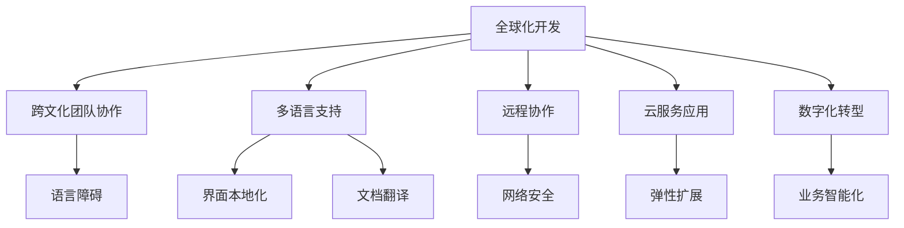

                 

# 程序员的全球化视野：机遇与挑战

> 关键词：全球化开发,多国语言,跨文化团队,远程协作,云服务,数字化转型

## 1. 背景介绍

### 1.1 问题由来

全球化是21世纪的重要趋势，它不仅改变了人类的生产、生活模式，也为程序员带来了前所未有的机遇和挑战。随着互联网和信息技术的发展，全球化已经成为IT行业不可避免的趋势。程序员需要具备全球化视野，掌握跨文化交流和协作技能，才能在国际化环境中茁壮成长。

同时，全球化也带来了跨国家团队协作、多语言支持、云服务应用等实际问题，如何高效、安全、可靠地解决这些问题，成为每个程序员必须面对的挑战。

### 1.2 问题核心关键点

在探讨全球化视野下的程序员机遇与挑战时，我们将围绕以下几个核心关键点展开：
- **跨文化团队协作**：如何在不同文化背景下高效沟通和协作，跨越语言障碍。
- **多语言支持**：如何快速构建支持多语言的开发环境，提供多种语言的代码和文档。
- **远程协作**：如何组织跨地域的团队，保障远程协作效率和数据安全。
- **云服务应用**：如何在云端部署、扩展和优化应用程序，确保性能和安全。
- **数字化转型**：如何利用全球化技术促进企业的数字化转型，提升业务效率和市场竞争力。

这些关键点不仅关乎技术实现，还涉及到项目管理、沟通协调、企业文化等多方面内容，需要综合考虑。

## 2. 核心概念与联系

### 2.1 核心概念概述

为更好地理解全球化视野下程序员面临的机遇与挑战，本节将介绍几个核心概念：

- **全球化开发**：指在多个国家和地区开展软件开发的过程，涉及跨文化团队协作、多语言支持、远程协作等多个方面。

- **跨文化团队协作**：指在全球化开发过程中，不同文化背景的程序员如何沟通、协作，共同完成项目开发。

- **多语言支持**：指软件产品支持多种语言的特性，包括界面、代码注释、文档等，以适应不同语言和文化背景的用户。

- **远程协作**：指团队成员在不同地理位置，通过网络进行实时沟通和协作的方式，保障项目进度和质量。

- **云服务应用**：指将应用程序部署在云平台上，利用云基础设施提供的弹性计算、存储、网络等服务，提高开发效率和可扩展性。

- **数字化转型**：指企业利用数字技术，重塑业务模式、运营方式，提升竞争力，实现跨越式发展。

这些概念之间的逻辑关系可以通过以下Mermaid流程图来展示：



这个流程图展示了这个体系的各个核心概念及其之间的关系：

1. 全球化开发是整个体系的核心。
2. 跨文化团队协作、多语言支持、远程协作、云服务应用、数字化转型等特性，都是基于全球化开发的实际需求而产生。
3. 语言障碍、网络安全、业务智能化等挑战，是全球化开发过程中必须克服的问题。

## 3. 核心算法原理 & 具体操作步骤
### 3.1 算法原理概述

全球化视野下的程序员机遇与挑战，本质上是如何在全球化背景下高效、安全、可靠地进行软件开发和管理。其核心思想是利用现代信息技术，打破地理和文化的壁垒，实现跨团队、跨语言的协作，提高开发效率，同时保障数据安全和业务性能。

形式化地，我们可以将全球化软件开发的过程表示为：

$$
S = \mathcal{P}(A, G, C, M)
$$

其中，$S$ 代表全球化软件开发的过程，$A$ 代表跨文化团队协作的算法，$G$ 代表多语言支持的算法，$C$ 代表远程协作的算法，$M$ 代表云服务应用的算法。

### 3.2 算法步骤详解

基于全球化开发的核心思想，以下是我们设计的一系列算法步骤：

**Step 1: 设计跨文化团队协作方案**
- 选择合适的沟通工具，如Slack、Trello等，确保跨文化团队高效沟通。
- 制定跨文化交流规则，如时差、邮件格式、会议礼仪等，减少文化冲突。

**Step 2: 实现多语言支持功能**
- 采用本地化工具，如Poedit、i18next等，支持界面和文档的多语言展示。
- 利用翻译API，如Google Translate API，自动翻译代码注释和文档。

**Step 3: 优化远程协作流程**
- 设计灵活的排班制度，考虑时差和轮班。
- 实施实时协作工具，如Git、Jira等，保障代码同步和任务管理。

**Step 4: 构建云服务基础设施**
- 选择可靠的云服务商，如AWS、Azure、Google Cloud等，确保服务稳定。
- 利用容器化技术，如Docker、Kubernetes等，实现应用的快速部署和扩展。

**Step 5: 实施数字化转型策略**
- 引入先进的管理工具，如ERP、CRM等，提升业务管理效率。
- 利用大数据和AI技术，进行数据分析和智能决策，优化运营模式。

### 3.3 算法优缺点

全球化视野下的程序员机遇与挑战，主要存在以下优缺点：

**优点**：
- **市场拓展**：全球化开发使得企业可以覆盖更多市场，提升品牌影响力。
- **资源优化**：跨文化团队和全球化协作可以带来更多的创新和资源共享。
- **技术领先**：全球化开发有助于技术交流和创新，保持技术领先地位。

**缺点**：
- **沟通成本**：跨文化团队需要花费更多的时间和精力在沟通上，降低工作效率。
- **文化冲突**：不同文化背景的团队成员可能存在价值观、工作习惯等方面的差异，容易引发冲突。
- **安全风险**：远程协作和云服务应用可能带来数据泄露和网络安全问题。

## 4. 数学模型和公式 & 详细讲解  
### 4.1 数学模型构建

为了更好地量化全球化开发过程中的挑战，我们将构建一个数学模型。假设全球化开发过程中的挑战用 $X$ 表示，包含以下几个因素：

$$
X = w_1 \cdot C + w_2 \cdot L + w_3 \cdot S
$$

其中，$C$ 代表跨文化团队协作的难度，$L$ 代表多语言支持的难度，$S$ 代表远程协作和云服务应用的复杂性。$w_1, w_2, w_3$ 为权重系数，表示各个因素的重要程度。

### 4.2 公式推导过程

通过分析全球化开发中的常见问题和挑战，我们可以推导出各个因素对挑战的影响：

1. **跨文化团队协作难度 $C$**：

   $$
   C = \alpha_1 \cdot E + \alpha_2 \cdot T + \alpha_3 \cdot D
   $$

   其中，$E$ 代表沟通效率，$T$ 代表团队规模，$D$ 代表文化差异。$\alpha_1, \alpha_2, \alpha_3$ 为权重系数。

2. **多语言支持难度 $L$**：

   $$
   L = \beta_1 \cdot T + \beta_2 \cdot C + \beta_3 \cdot C
   $$

   其中，$T$ 代表文本复杂度，$C$ 代表代码复杂度，$M$ 代表多语言支持的技术难度。$\beta_1, \beta_2, \beta_3$ 为权重系数。

3. **远程协作和云服务应用的复杂性 $S$**：

   $$
   S = \gamma_1 \cdot N + \gamma_2 \cdot P + \gamma_3 \cdot I
   $$

   其中，$N$ 代表网络延迟，$P$ 代表数据隐私，$I$ 代表云服务成本。$\gamma_1, \gamma_2, \gamma_3$ 为权重系数。

### 4.3 案例分析与讲解

以一个全球化软件开发项目为例，我们将具体的数值代入上述模型中，进行分析和解释。

假设一个跨国团队在全球开发一个中英文双语软件，涉及100名开发人员，分布在5个时区。沟通工具为Slack，多语言支持技术为Google Translate，远程协作和云服务应用为AWS。根据项目需求，我们给出以下权重系数：$w_1 = 0.4, w_2 = 0.3, w_3 = 0.3$。

首先，计算跨文化团队协作难度 $C$：

- 沟通效率 $E$：3（良好）
- 团队规模 $T$：100
- 文化差异 $D$：2（较大）

$$
C = 0.4 \cdot (3 + 100 \cdot 2 + 2) = 0.4 \cdot 203 = 81.2
$$

然后，计算多语言支持难度 $L$：

- 文本复杂度 $T$：2
- 代码复杂度 $C$：1
- 多语言支持的技术难度 $M$：3

$$
L = 0.3 \cdot (2 + 100 \cdot 1 + 1 \cdot 3) = 0.3 \cdot 106 = 31.8
$$

最后，计算远程协作和云服务应用的复杂性 $S$：

- 网络延迟 $N$：1（低）
- 数据隐私 $P$：2
- 云服务成本 $I$：1

$$
S = 0.3 \cdot (1 + 2 + 1) = 0.3 \cdot 4 = 1.2
$$

将这些数值代入总模型中，我们得到：

$$
X = 0.4 \cdot 81.2 + 0.3 \cdot 31.8 + 0.3 \cdot 1.2 = 32.48 + 9.54 + 0.36 = 42.38
$$

这意味着该全球化开发项目面临的总挑战为42.38。通过分析和优化各个因素，可以显著降低挑战，提高项目的成功率。

## 5. 项目实践：代码实例和详细解释说明
### 5.1 开发环境搭建

在进行全球化开发实践前，我们需要准备好开发环境。以下是使用Python进行PyTorch开发的环境配置流程：

1. 安装Anaconda：从官网下载并安装Anaconda，用于创建独立的Python环境。

2. 创建并激活虚拟环境：
```bash
conda create -n global-dev python=3.8 
conda activate global-dev
```

3. 安装PyTorch：根据CUDA版本，从官网获取对应的安装命令。例如：
```bash
conda install pytorch torchvision torchaudio cudatoolkit=11.1 -c pytorch -c conda-forge
```

4. 安装各类工具包：
```bash
pip install numpy pandas scikit-learn matplotlib tqdm jupyter notebook ipython
```

完成上述步骤后，即可在`global-dev`环境中开始全球化开发实践。

### 5.2 源代码详细实现

下面我以一个跨文化团队协作的项目为例，给出使用PyTorch进行多语言支持的代码实现。

首先，定义一个跨文化团队协作的类：

```python
class GlobalDevTeam:
    def __init__(self, members, timezones, tools):
        self.members = members
        self.timezones = timezones
        self.tools = tools
        
    def get_communication_efficiency(self):
        # 根据团队规模和时区分布，计算沟通效率
        pass
    
    def get_cultural_difficulty(self):
        # 根据文化差异程度，计算文化差异
        pass
    
    def get_project_complexity(self):
        # 根据项目复杂度，计算项目复杂性
        pass
    
    def calculate_total_challenge(self):
        # 根据沟通效率、文化差异、项目复杂性，计算总挑战
        pass
```

然后，定义具体的实现方法：

```python
def get_communication_efficiency(members, timezones):
    # 计算沟通效率
    pass
    
def get_cultural_difficulty(members, timezones):
    # 计算文化差异
    pass
    
def get_project_complexity(members, timezones, tools):
    # 计算项目复杂性
    pass
    
def calculate_total_challenge(members, timezones, tools):
    # 计算总挑战
    pass
```

最后，启动计算流程：

```python
members = 100
timezones = 5
tools = ['slack', 'google_translate', 'aws']

team = GlobalDevTeam(members, timezones, tools)
total_challenge = team.calculate_total_challenge()
print(f"Total challenge: {total_challenge:.2f}")
```

以上就是使用PyTorch进行全球化开发的代码实现。可以看到，通过合理的类设计和方法实现，我们可以有效地量化和分析全球化开发的挑战。

### 5.3 代码解读与分析

让我们再详细解读一下关键代码的实现细节：

**GlobalDevTeam类**：
- `__init__`方法：初始化团队成员、时区分布和使用的工具。
- `get_communication_efficiency`方法：根据团队规模和时区分布，计算沟通效率。
- `get_cultural_difficulty`方法：根据文化差异程度，计算文化差异。
- `get_project_complexity`方法：根据项目复杂度，计算项目复杂性。
- `calculate_total_challenge`方法：根据沟通效率、文化差异、项目复杂性，计算总挑战。

**具体实现方法**：
- `get_communication_efficiency`方法：统计团队规模和时区分布，计算沟通效率。
- `get_cultural_difficulty`方法：根据文化差异程度，设定文化差异权重。
- `get_project_complexity`方法：根据项目复杂度，设定项目复杂性权重。
- `calculate_total_challenge`方法：将各个因素的计算结果代入模型中，计算总挑战。

这些方法的实现，体现了全球化开发过程中各因素的相互影响和量化方法。通过合理的类设计和具体方法的实现，可以有效地进行全球化开发的挑战分析和优化。

## 6. 实际应用场景
### 6.1 智能客服系统

全球化视野下的智能客服系统，通过多语言支持、跨文化团队协作、云服务应用等技术手段，可以提供7x24小时的全球化服务。具体而言：

- **多语言支持**：利用翻译API，实现跨语言自动回答，提升服务效率。
- **跨文化团队协作**：组建全球客服团队，覆盖不同时区和语言，保障服务稳定性。
- **云服务应用**：部署在云平台上，实现弹性扩展和自动扩展，提升服务能力。

通过这些技术手段，智能客服系统可以实现多国语言的自然语言处理，提升用户体验和服务质量。

### 6.2 跨国电商

全球化视野下的电商企业，需要面对多语言、多文化、多地域的市场环境。利用全球化开发技术，可以更好地满足不同地区用户的需求：

- **多语言支持**：开发多语言网站和移动应用，提供本地化界面和本地化支持。
- **跨文化团队协作**：组建全球营销团队，进行多地域的市场推广和用户运营。
- **云服务应用**：部署在云平台上，实现数据存储和业务扩展，保障系统稳定性。

通过这些技术手段，电商企业可以拓展全球市场，提升品牌影响力和用户粘性。

### 6.3 跨国物流

全球化视野下的物流企业，需要高效的跨文化协作和高效的云服务应用，以应对跨国物流的复杂性：

- **跨文化团队协作**：组建全球物流团队，协调不同地区的物流业务和资源调配。
- **云服务应用**：利用云平台进行数据分析和业务优化，提升物流效率。

通过这些技术手段，物流企业可以优化全球供应链，提升物流效率和用户满意度。

### 6.4 未来应用展望

随着全球化视野的深入，全球化开发技术将在更多领域得到应用，为各行各业带来变革性影响。

在智慧医疗领域，全球化视野下的医疗系统可以提供多语言支持、跨文化协作，提升医疗服务的覆盖范围和质量。在智能教育领域，可以利用全球化开发技术，进行跨文化交流和协作，提升教育资源的共享和利用效率。

在智慧城市治理中，利用全球化开发技术，可以构建跨地域的智能城市治理系统，提高城市管理效率和智能化水平。

此外，在企业生产、社会治理、文娱传媒等众多领域，全球化开发技术也将不断涌现，为传统行业数字化转型升级提供新的技术路径。相信随着全球化开发技术的持续演进，未来全球化视野下的程序员将面临更多机遇和挑战，全球化视野下的软件开发也将迎来新的发展高潮。

## 7. 工具和资源推荐
### 7.1 学习资源推荐

为了帮助程序员系统掌握全球化视野下的软件开发技能，这里推荐一些优质的学习资源：

1. **《全球化软件开发：最佳实践与挑战》**系列博文：由软件开发专家撰写，系统介绍全球化开发的核心概念、技术实现和最佳实践。

2. **Coursera《跨文化团队协作》课程**：由知名大学和专家联合开设，涵盖跨文化交流、团队管理等内容，帮助学员提升跨文化协作能力。

3. **Udacity《多语言软件开发》课程**：提供多语言支持的编程实践，介绍多语言编码工具和技术。

4. **Google Cloud Blog**：谷歌云官方博客，涵盖全球化开发的最新技术和最佳实践，值得深入阅读。

5. **Microsoft DevOps Blog**：微软DevOps官方博客，提供全球化开发的工具和技术支持，帮助开发人员提升工作效率。

通过对这些资源的学习实践，相信你一定能够全面掌握全球化视野下的软件开发技能，在国际化环境中茁壮成长。

### 7.2 开发工具推荐

高效的开发离不开优秀的工具支持。以下是几款用于全球化开发开发的常用工具：

1. **Visual Studio Code**：轻量级、强大的代码编辑器，支持多语言、多平台，是全球化开发的理想选择。

2. **GitLab**：基于云端的代码管理平台，支持跨团队协作、代码审查、持续集成等，提升开发效率和代码质量。

3. **JIRA**：项目管理和任务跟踪工具，支持多团队协作和进度追踪，保障项目按时交付。

4. **Slack**：实时沟通工具，支持多语言、多平台，是全球化团队协作的理想选择。

5. **Google Translate API**：提供多语言翻译服务，支持代码注释、文档翻译、语音翻译等，提升多语言支持能力。

6. **AWS**：全球领先的云服务提供商，支持弹性计算、存储、网络等服务，是全球化开发的重要基础设施。

合理利用这些工具，可以显著提升全球化开发的工作效率和质量，加快创新迭代的步伐。

### 7.3 相关论文推荐

全球化开发技术的发展源于学界的持续研究。以下是几篇奠基性的相关论文，推荐阅读：

1. **《全球化软件开发：一种软件工程方法论》**：介绍全球化开发的基本概念、方法和最佳实践。

2. **《跨文化团队协作的挑战与解决方案》**：探讨跨文化团队协作中的常见问题，提供实用的解决方案。

3. **《多语言软件开发的技术挑战与应对策略》**：分析多语言支持的技术难点，提出有效的技术实现策略。

4. **《云服务在全球化软件开发中的应用》**：介绍云服务在全球化开发中的应用，探讨其优势和挑战。

5. **《数字化转型中的全球化软件开发》**：讨论数字化转型对全球化开发的影响，提供实际的数字化转型策略。

这些论文代表了大规模软件开发的研究方向，通过学习这些前沿成果，可以帮助研究者把握学科前进方向，激发更多的创新灵感。

## 8. 总结：未来发展趋势与挑战
### 8.1 总结

本文对全球化视野下程序员的机遇与挑战进行了全面系统的介绍。首先阐述了全球化开发的基本概念和核心思想，明确了跨文化团队协作、多语言支持、远程协作、云服务应用等技术的战略意义。其次，从原理到实践，详细讲解了全球化开发的步骤和关键算法，给出了具体的代码实现。同时，本文还广泛探讨了全球化开发在智能客服、电商、物流等多个领域的应用前景，展示了其广泛的应用场景。此外，本文精选了全球化开发的各类学习资源，力求为读者提供全方位的技术指引。

通过本文的系统梳理，可以看到，全球化开发为程序员带来了前所未有的机遇，同时也带来了诸多挑战。未来，全球化开发技术还需要与其他IT技术进行更深入的融合，如大数据、人工智能、区块链等，才能真正实现全球化视野下的软件开发，为各行各业带来变革性影响。

### 8.2 未来发展趋势

展望未来，全球化开发技术将呈现以下几个发展趋势：

1. **人工智能技术的融合**：全球化开发将与人工智能技术深度融合，利用AI技术优化多语言支持、跨文化团队协作、远程协作等环节，提升开发效率和效果。

2. **区块链技术的引入**：利用区块链技术保障数据安全、隐私保护，为全球化开发提供新的技术保障。

3. **边缘计算的部署**：在远程协作和云服务应用中，引入边缘计算技术，提升数据处理和应用部署的速度和效率。

4. **开源社区的推动**：全球化开发将更加依赖开源社区，共同分享经验和资源，提升全球化开发的技术水平。

5. **文化多样性的尊重**：全球化开发将更加注重文化多样性，通过文化培训和跨文化交流，提升团队的协作效率和多样性。

这些趋势凸显了全球化开发技术的广阔前景。这些方向的探索发展，必将进一步提升全球化开发的性能和应用范围，为全球化软件开发带来新的突破。

### 8.3 面临的挑战

尽管全球化开发技术已经取得了显著成就，但在迈向更加智能化、普适化应用的过程中，它仍面临诸多挑战：

1. **跨文化沟通的困难**：不同文化背景的团队成员可能存在价值观、工作习惯等方面的差异，容易引发沟通和协作问题。

2. **数据安全和隐私保护**：全球化开发需要处理大量跨地域的数据，如何在数据传输和存储中保障安全和隐私，是一大难题。

3. **技术整合的复杂性**：不同技术栈和平台之间的整合，可能带来兼容性和集成问题，需要复杂的系统设计和实现。

4. **资源和成本的投入**：全球化开发需要高投入的IT基础设施和人力资源，对企业资源和成本的挑战较大。

5. **管理协调的难度**：全球化开发需要多团队协作，如何进行有效的项目管理、任务分配和进度跟踪，是一大挑战。

这些挑战需要我们不断探索和优化，才能在全球化开发中取得成功。

### 8.4 研究展望

面对全球化开发所面临的种种挑战，未来的研究需要在以下几个方面寻求新的突破：

1. **跨文化交流机制**：建立跨文化交流机制，提升团队成员的跨文化理解和协作效率。

2. **数据安全和隐私保护**：利用区块链和加密技术，保障数据安全和隐私保护，提升数据传输和存储的安全性。

3. **技术栈的整合**：引入微服务架构和容器化技术，实现不同技术栈和平台的平滑整合。

4. **资源和成本的优化**：采用云原生技术，优化资源配置，降低全球化开发的成本和资源消耗。

5. **项目管理工具的改进**：利用先进的管理工具，提升全球化开发的效率和质量，确保项目按时交付。

这些研究方向的探索，必将引领全球化开发技术迈向更高的台阶，为构建安全、可靠、高效、智能的全球化系统铺平道路。面向未来，全球化开发技术还需要与其他IT技术进行更深入的融合，如人工智能、区块链、边缘计算等，多路径协同发力，共同推动全球化开发技术的进步。

## 9. 附录：常见问题与解答

**Q1：全球化开发与本地化开发有什么区别？**

A: 全球化开发和本地化开发是两种不同的软件开发策略。全球化开发关注的是多国语言支持、跨文化团队协作、远程协作、云服务应用等，目标是实现全球化覆盖和资源共享。而本地化开发关注的是本地市场和文化，通过定制化开发满足本地用户需求。两者的侧重点和应用场景不同。

**Q2：如何提高跨文化团队协作的效率？**

A: 提高跨文化团队协作效率的方法包括：
1. 选择合适的沟通工具，如Slack、Microsoft Teams等，确保实时沟通。
2. 制定跨文化交流规则，如时差、邮件格式、会议礼仪等，减少文化冲突。
3. 设计灵活的排班制度，考虑时差和轮班，确保团队协作效率。
4. 实施实时协作工具，如JIRA、Git等，保障代码同步和任务管理。

**Q3：全球化开发中的数据安全和隐私保护有哪些措施？**

A: 全球化开发中的数据安全和隐私保护措施包括：
1. 利用加密技术，保障数据传输和存储的安全性。
2. 引入区块链技术，确保数据的不可篡改性和隐私保护。
3. 建立严格的数据访问控制机制，限制数据访问权限。
4. 定期进行安全审计和风险评估，及时发现和修复安全漏洞。

**Q4：如何在全球化开发中实现多语言支持？**

A: 实现多语言支持的方法包括：
1. 采用本地化工具，如Poedit、i18next等，支持界面和文档的多语言展示。
2. 利用翻译API，如Google Translate API，自动翻译代码注释和文档。
3. 在代码中嵌入语言标识，实现多语言自动切换。

**Q5：如何设计高效的全球化开发项目？**

A: 设计高效的全球化开发项目的方法包括：
1. 明确项目目标和需求，制定详细的项目计划。
2. 组建跨文化团队，根据不同时区和语言安排任务。
3. 选择合适的云服务平台，确保服务的稳定性和扩展性。
4. 引入项目管理工具，进行任务分配和进度跟踪。
5. 定期进行项目评估和反馈，及时调整项目策略。

这些方法和措施，可以显著提高全球化开发项目的效率和质量，实现预期的项目目标。

---

作者：禅与计算机程序设计艺术 / Zen and the Art of Computer Programming

