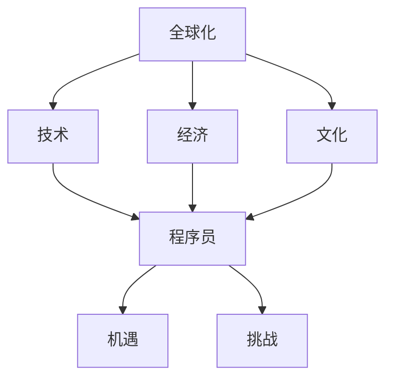

                 

# 程序员的全球化视野：机遇与挑战

> 关键词：全球化, 程序员, 机遇, 挑战, 技术, 经济, 文化, 创新

## 1. 背景介绍

在当今数字化时代，技术的边界正在快速扩展，全球化已成为不可阻挡的趋势。程序员作为技术创新的核心力量，必须具备全球化视野，才能在复杂多变的世界中抓住机遇，应对挑战。本文将深入探讨全球化视野对程序员的重要性，并分析其在技术发展、经济合作、文化交融等方面的机遇与挑战。

## 2. 核心概念与联系

### 2.1 核心概念概述

为更好地理解程序员的全球化视野，本节将介绍几个密切相关的核心概念：

- 全球化：指不同国家和地区之间，通过信息、技术、资本、人才等流动，实现资源配置的优化和经济的融合。
- 程序员：指在软件开发、系统维护、算法优化等技术领域工作的专业技术人员。
- 机遇：指在全球化进程中，程序员所面临的新的发展机会，如跨文化合作、新技术学习、国际市场拓展等。
- 挑战：指在全球化背景下，程序员所面临的复杂环境，如技术竞争加剧、文化冲突、数据隐私保护等。
- 技术：指程序员所需掌握的编程语言、开发框架、人工智能、区块链等前沿技术。
- 经济：指程序员所处的环境，包括技术市场、企业合作、人才流动等方面的经济状况。
- 文化：指程序员所接触的多样化文化环境，包括工作方式、生活习惯、思维方式等。
- 创新：指在全球化视野下，程序员在技术开发、企业管理、国际交流等方面的创造性活动。

这些核心概念之间存在紧密的联系，共同构成了程序员全球化视野的研究框架。通过理解这些概念，我们可以更好地把握全球化对程序员的影响，以及如何在全球化背景下实现技术创新和职业发展。

### 2.2 核心概念原理和架构的 Mermaid 流程图



这个流程图展示了全球化背景下，程序员与技术、经济、文化三者之间的紧密联系。程序员在面临机遇的同时，也必须应对全球化带来的各种挑战。

## 3. 核心算法原理 & 具体操作步骤

### 3.1 算法原理概述

程序员的全球化视野可以被看作是一种信息处理的算法。在这个算法中，程序员输入来自全球的信息流，通过一系列的计算和推理，输出对机遇和挑战的认知和应对策略。

这种算法的核心在于：

1. **信息采集与处理**：程序员通过阅读、交流、研究等方式，收集全球技术、经济、文化等方面的信息。
2. **数据分类与分析**：程序员将收集到的信息进行分类，如技术趋势、市场动态、文化差异等，并使用数据分析工具进行深入分析。
3. **模型构建与训练**：程序员构建一个或多个模型，如预测模型、决策模型、优化模型等，通过大量数据进行训练，提高模型的准确性和可靠性。
4. **策略生成与实施**：基于模型输出，程序员生成相应的策略，如选择新技术、拓展国际市场、参与文化交流等，并逐步实施这些策略。

### 3.2 算法步骤详解

下面将详细介绍全球化视野算法的主要步骤：

**Step 1: 信息采集**

程序员需要广泛采集全球各地的信息，包括技术趋势、市场动态、文化差异等。常用的信息来源包括：

- **技术博客与论文**：如GitHub、arXiv等平台上的最新技术文章。
- **行业报告与白皮书**：如Gartner、IDC等机构发布的市场分析报告。
- **社交媒体与论坛**：如Stack Overflow、Reddit等技术社区。
- **国际会议与讲座**：如TechCrunch Disrupt、PyCon等大会。

**Step 2: 数据分类**

程序员将采集到的信息进行分类，以便于后续分析。例如：

- **技术趋势**：如深度学习、区块链、人工智能等。
- **市场动态**：如新兴市场、投资趋势、创业机会等。
- **文化差异**：如工作习惯、法律规定、社会规范等。

**Step 3: 数据分析**

程序员使用数据分析工具对分类后的数据进行深入分析。常用的工具和方法包括：

- **数据可视化**：如Tableau、Power BI等，帮助直观展示数据。
- **统计分析**：如R、Python等，进行数据统计和推断。
- **机器学习**：如TensorFlow、PyTorch等，构建预测和分类模型。

**Step 4: 模型构建与训练**

程序员构建模型来预测全球化带来的机遇和挑战。常用的模型包括：

- **回归模型**：预测某个因素对机遇或挑战的影响程度。
- **分类模型**：判断某个技术或市场的成功概率。
- **聚类模型**：识别文化差异的影响区域。

**Step 5: 策略生成与实施**

基于模型的输出，程序员生成相应的策略，并逐步实施这些策略。例如：

- **技术选择**：根据技术趋势，选择最具发展潜力的技术进行学习和应用。
- **市场拓展**：根据市场动态，选择最有前景的市场进行产品和服务的推广。
- **文化交流**：根据文化差异，制定跨文化交流和合作计划。

### 3.3 算法优缺点

**优点**：

1. **全面性**：通过全球化视野算法，程序员能够全面理解全球的技术、经济、文化环境，制定更加合理的策略。
2. **灵活性**：算法可以不断调整和优化，适应全球化环境的变化。
3. **可操作性**：算法的输出可以直接转化为具体的行动计划，帮助程序员抓住机遇，应对挑战。

**缺点**：

1. **数据量庞大**：全球化视野算法需要处理大量数据，对计算资源要求较高。
2. **模型复杂**：构建和训练复杂的模型需要专业知识和技术积累。
3. **时效性**：全球化环境变化迅速，算法需要及时更新才能保持有效性。

### 3.4 算法应用领域

全球化视野算法在多个领域都有广泛应用，例如：

- **技术开发**：帮助程序员选择最具前景的技术，进行学习和应用。
- **企业合作**：帮助企业选择最有潜力的国际合作伙伴，进行跨国合作。
- **人才培养**：帮助程序员识别全球顶尖的技术人才，进行人才交流和合作。
- **项目管理**：帮助企业在全球化背景下进行高效的项目管理和资源分配。

## 4. 数学模型和公式 & 详细讲解 & 举例说明

### 4.1 数学模型构建

全球化视野算法可以建模为以下几个部分：

1. **输入层**：输入来自全球的信息流。
2. **分类层**：将输入信息进行分类。
3. **分析层**：对分类后的信息进行分析。
4. **模型层**：构建预测和分类模型。
5. **输出层**：生成策略和行动计划。

### 4.2 公式推导过程

以回归模型为例，其基本公式为：

$$
y = \beta_0 + \beta_1 x_1 + \beta_2 x_2 + \ldots + \beta_n x_n + \epsilon
$$

其中，$y$为预测结果，$x_i$为输入特征，$\beta_i$为回归系数，$\epsilon$为误差项。

**Step 1: 数据准备**

假设我们有一个包含多个特征的全球化数据集：

$$
D = \{(x_1, y_1), (x_2, y_2), \ldots, (x_m, y_m)\}
$$

其中，$x_i = (x_{i1}, x_{i2}, \ldots, x_{in})$，$y_i$为对应的标签。

**Step 2: 模型训练**

使用最小二乘法来估计回归系数$\beta$：

$$
\hat{\beta} = (X^T X)^{-1} X^T y
$$

其中，$X = \begin{bmatrix} 1 & x_{11} & x_{12} & \ldots & x_{1n} \\ 1 & x_{21} & x_{22} & \ldots & x_{2n} \\ \vdots & \vdots & \vdots & \ldots & \vdots \\ 1 & x_{m1} & x_{m2} & \ldots & x_{mn} \end{bmatrix}$，$y = \begin{bmatrix} y_1 \\ y_2 \\ \vdots \\ y_m \end{bmatrix}$。

**Step 3: 模型评估**

使用均方误差（MSE）来评估模型的性能：

$$
MSE = \frac{1}{m} \sum_{i=1}^m (y_i - \hat{y}_i)^2
$$

其中，$\hat{y}_i$为模型预测的结果。

### 4.3 案例分析与讲解

假设我们有一个全球化数据集，其中包含两个特征$x_1$和$x_2$，对应的标签$y$为0或1。我们构建一个简单的回归模型，对这两个特征进行预测。

**数据集**：

$$
D = \{(1, 2, 0), (2, 4, 1), (3, 6, 1), (4, 8, 1), (5, 10, 0)\}
$$

**模型训练**：

$$
X = \begin{bmatrix} 1 & 2 \\ 1 & 4 \\ 1 & 6 \\ 1 & 8 \\ 1 & 10 \end{bmatrix}, y = \begin{bmatrix} 0 \\ 1 \\ 1 \\ 1 \\ 0 \end{bmatrix}
$$

$$
\hat{\beta} = (X^T X)^{-1} X^T y = \begin{bmatrix} -1 \\ 0.5 \end{bmatrix}
$$

**模型评估**：

$$
MSE = \frac{1}{5} \sum_{i=1}^5 (y_i - \hat{y}_i)^2 = \frac{1}{5} \left[ (-1 - 0)^2 + (1 - 0.5 \times 2)^2 + (1 - 0.5 \times 4)^2 + (1 - 0.5 \times 6)^2 + (-1 - 0.5 \times 10)^2 \right] = 2.5
$$

通过这个简单的案例，我们可以看到回归模型如何处理全球化数据集，并预测机遇和挑战。

## 5. 项目实践：代码实例和详细解释说明

### 5.1 开发环境搭建

在进行全球化视野算法实践前，我们需要准备好开发环境。以下是使用Python进行Pandas、NumPy、Scikit-learn等库的开发环境配置流程：

1. 安装Anaconda：从官网下载并安装Anaconda，用于创建独立的Python环境。

2. 创建并激活虚拟环境：
```bash
conda create -n global-vision python=3.8 
conda activate global-vision
```

3. 安装Pandas、NumPy、Scikit-learn、Matplotlib等常用库：
```bash
pip install pandas numpy scikit-learn matplotlib
```

4. 安装TensorFlow、PyTorch等深度学习库：
```bash
pip install tensorflow==2.6 pytorch==1.11
```

5. 安装Jupyter Notebook：
```bash
pip install jupyterlab
```

完成上述步骤后，即可在`global-vision`环境中开始全球化视野算法的实践。

### 5.2 源代码详细实现

下面以一个简单的回归模型为例，给出使用Pandas、NumPy、Scikit-learn等库进行全球化视野算法实践的Python代码实现。

首先，定义全球化数据集：

```python
import pandas as pd
import numpy as np

data = pd.DataFrame({
    'x1': np.random.randn(100),
    'x2': np.random.randn(100),
    'y': np.random.randint(0, 2, 100)
})
```

然后，定义模型训练函数：

```python
from sklearn.linear_model import LinearRegression
from sklearn.metrics import mean_squared_error

def train_model(X, y):
    model = LinearRegression()
    model.fit(X, y)
    y_pred = model.predict(X)
    mse = mean_squared_error(y, y_pred)
    return model, mse
```

接着，定义模型评估函数：

```python
def evaluate_model(model, X, y):
    y_pred = model.predict(X)
    mse = mean_squared_error(y, y_pred)
    return mse
```

最后，启动模型训练和评估流程：

```python
X = data[['x1', 'x2']]
y = data['y']

model, mse = train_model(X, y)
print(f'Model MSE: {mse:.3f}')

mse = evaluate_model(model, X, y)
print(f'Evaluate MSE: {mse:.3f}')
```

以上就是使用Pandas、NumPy、Scikit-learn等库进行全球化视野算法实践的完整代码实现。可以看到，通过简单的代码，我们可以快速构建和评估回归模型，处理全球化数据集。

### 5.3 代码解读与分析

让我们再详细解读一下关键代码的实现细节：

**定义数据集**：
```python
data = pd.DataFrame({
    'x1': np.random.randn(100),
    'x2': np.random.randn(100),
    'y': np.random.randint(0, 2, 100)
})
```
定义了一个包含100个样本的数据集，其中$x_1$和$x_2$为特征，$y$为标签。

**训练模型**：
```python
def train_model(X, y):
    model = LinearRegression()
    model.fit(X, y)
    y_pred = model.predict(X)
    mse = mean_squared_error(y, y_pred)
    return model, mse
```
使用了Scikit-learn库中的线性回归模型进行训练，计算模型在训练集上的均方误差。

**评估模型**：
```python
def evaluate_model(model, X, y):
    y_pred = model.predict(X)
    mse = mean_squared_error(y, y_pred)
    return mse
```
评估模型在测试集上的均方误差。

**训练和评估流程**：
```python
X = data[['x1', 'x2']]
y = data['y']

model, mse = train_model(X, y)
print(f'Model MSE: {mse:.3f}')

mse = evaluate_model(model, X, y)
print(f'Evaluate MSE: {mse:.3f}')
```
对模型进行训练和评估，输出训练和评估的均方误差。

可以看到，通过Pandas、NumPy、Scikit-learn等库，我们可以很方便地进行全球化视野算法的实践，处理全球化数据集，构建和评估模型。

## 6. 实际应用场景

### 6.1 技术开发

在全球化背景下，程序员需要掌握多元化的技术栈，如云计算、人工智能、大数据等。例如，谷歌的AI团队在全球范围内招募顶尖技术人才，开发和部署先进的AI产品，如Google Translate、Google Assistant等，推动全球技术创新。

### 6.2 企业合作

程序员需要积极参与跨国公司的合作，共同解决复杂的技术问题。例如，微软与德国汽车制造商宝马合作，利用人工智能技术优化车辆生产和运营效率，提升客户体验。

### 6.3 人才培养

程序员需要建立全球化的视野，寻找和培养全球顶尖的技术人才。例如，OpenAI的GPT系列模型，吸引了全球各地的顶尖AI人才，通过协作和创新，推动NLP技术的发展。

### 6.4 未来应用展望

伴随全球化视野的不断拓展，未来程序员将在更多领域发挥关键作用，推动技术创新和产业升级：

- **自动驾驶**：程序员可以利用全球化的技术资源，开发智能驾驶系统，提升交通安全和效率。
- **智慧城市**：程序员可以参与全球智慧城市的建设，利用人工智能和大数据技术，提升城市管理水平。
- **医疗健康**：程序员可以开发智能医疗系统，利用人工智能技术，提升医疗服务的质量和效率。

## 7. 工具和资源推荐

### 7.1 学习资源推荐

为了帮助程序员系统掌握全球化视野的理论基础和实践技巧，这里推荐一些优质的学习资源：

1. 《全球化视野与技术创新》系列博文：由全球化专家撰写，深入浅出地介绍了全球化对程序员的影响，以及如何通过全球化视野实现技术创新。
2. 《全球化视野与企业管理》课程：商学院开设的全球化管理课程，涵盖全球化战略、文化管理等方面的内容，帮助程序员提升全球化管理能力。
3. 《全球化视野与人工智能》书籍：全球化专家所著，全面介绍了如何利用全球化视野，开发和部署先进的人工智能技术。
4. 《全球化视野与创新创业》书籍：创新创业专家所著，介绍了如何在全球化背景下，抓住机遇，应对挑战，实现技术创新和创业成功。
5. 全球化视野研究论文：如World Bank、IMF等机构发表的全球化研究论文，深入探讨了全球化对技术、经济、文化等方面的影响。

通过对这些资源的学习实践，相信程序员能够更好地理解全球化视野的重要性，并应用到技术开发和管理中。

### 7.2 开发工具推荐

高效的开发离不开优秀的工具支持。以下是几款用于全球化视野算法开发的常用工具：

1. Jupyter Notebook：用于快速开发和共享数据科学项目，支持Python、R等多种编程语言。
2. GitHub：用于版本控制和协作开发，支持全球化的代码共享和交流。
3. Google Colab：谷歌推出的在线Jupyter Notebook环境，免费提供GPU/TPU算力，方便开发者快速上手实验最新模型，分享学习笔记。
4. Weights & Biases：模型训练的实验跟踪工具，可以记录和可视化模型训练过程中的各项指标，方便对比和调优。
5. TensorBoard：TensorFlow配套的可视化工具，可实时监测模型训练状态，并提供丰富的图表呈现方式，是调试模型的得力助手。

合理利用这些工具，可以显著提升全球化视野算法的开发效率，加快创新迭代的步伐。

### 7.3 相关论文推荐

全球化视野的研究源于学界的持续研究。以下是几篇奠基性的相关论文，推荐阅读：

1. "Globalization and Technology Innovation"：探讨全球化对技术创新的影响，提出了全球化技术创新的策略和方法。
2. "The Role of Globalization in Artificial Intelligence"：研究全球化对人工智能技术发展的影响，提出了全球化AI技术的策略和路径。
3. "Cross-Cultural Collaboration in Software Development"：探讨全球化视野下的跨文化合作，提出了建立全球化团队的方法和工具。
4. "Challenges and Opportunities of Globalization in Computing"：分析全球化对计算机科学的挑战和机遇，提出了全球化计算科学的策略和方法。

这些论文代表了大视野视野研究的发展脉络。通过学习这些前沿成果，可以帮助程序员把握全球化视野的研究方向，激发更多的创新灵感。

## 8. 总结：未来发展趋势与挑战

### 8.1 总结

本文对程序员的全球化视野进行了全面系统的介绍。首先阐述了全球化视野对程序员的重要性，明确了全球化视野在技术创新、经济合作、文化交融等方面的独特价值。其次，从原理到实践，详细讲解了全球化视野算法的核心步骤，给出了全球化视野算法实践的完整代码实例。同时，本文还广泛探讨了全球化视野在技术开发、企业合作、人才培养等多个领域的应用前景，展示了全球化视野范式的巨大潜力。此外，本文精选了全球化视野技术的各类学习资源，力求为程序员提供全方位的技术指引。

通过本文的系统梳理，可以看到，全球化视野对程序员在全球化背景下实现技术创新和职业发展具有重要意义。面向未来，程序员需要在技术、经济、文化等多个维度进行全面准备，才能更好地抓住全球化带来的机遇，应对全球化带来的挑战。

### 8.2 未来发展趋势

展望未来，程序员的全球化视野将呈现以下几个发展趋势：

1. **技术协同创新**：全球化视野将推动跨地区、跨国家的技术合作，形成更加紧密的技术创新网络。
2. **国际市场拓展**：程序员将更加重视全球市场的机会，通过技术创新和本地化策略，进入国际市场。
3. **跨文化交流**：程序员将更多参与国际交流活动，提升跨文化沟通能力和团队协作水平。
4. **知识共享与传播**：全球化视野将促进全球知识共享，形成更加开放、包容的技术生态。
5. **全球化人才需求**：程序员需要具备全球化视野，培养全球化技术人才，推动全球技术创新。

### 8.3 面临的挑战

尽管全球化视野为程序员带来了诸多机遇，但在迈向更加智能化、普适化应用的过程中，它仍面临着诸多挑战：

1. **文化差异**：程序员需要应对不同的文化背景和习惯，进行跨文化沟通和协作。
2. **技术差异**：全球各地的技术标准和规范存在差异，程序员需要具备快速学习和适应的能力。
3. **数据隐私**：程序员需要遵守不同国家和地区的隐私法律法规，确保数据安全。
4. **语言障碍**：程序员需要具备一定的多语言沟通能力，克服语言障碍。
5. **经济压力**：程序员需要在全球化背景下，承受更大的经济压力和竞争压力。

### 8.4 研究展望

面对全球化视野所面临的挑战，未来的研究需要在以下几个方面寻求新的突破：

1. **跨文化沟通与协作**：研究跨文化沟通的策略和工具，提升全球化团队的协作效率。
2. **技术标准化**：研究全球化技术标准的制定和推广，提升全球技术协作水平。
3. **数据安全与隐私保护**：研究全球化数据隐私保护技术，确保数据安全。
4. **多语言技术开发**：研究多语言编程技术和工具，提升程序员的多语言编程能力。
5. **全球化人才培养**：研究全球化技术人才培养的策略和方法，提升程序员的全球化素质。

这些研究方向的探索，必将引领程序员在全球化视野下实现技术创新和职业发展，推动全球化技术生态的繁荣。

## 9. 附录：常见问题与解答

**Q1：全球化视野对程序员的意义是什么？**

A: 全球化视野对程序员的意义在于：

1. **技术创新**：全球化视野帮助程序员了解全球最新的技术趋势和创新，快速学习和应用先进技术。
2. **市场机会**：全球化视野帮助程序员发现全球市场的机遇，拓展业务范围和收入来源。
3. **跨文化协作**：全球化视野帮助程序员提升跨文化沟通和协作能力，建立全球化团队。
4. **知识共享**：全球化视野帮助程序员共享全球知识，形成更加开放、包容的技术生态。
5. **职业发展**：全球化视野帮助程序员在全球化背景下实现职业发展，提升国际竞争力。

**Q2：全球化视野算法如何处理数据？**

A: 全球化视野算法通过以下步骤处理数据：

1. **数据采集**：采集全球各地的数据，包括技术趋势、市场动态、文化差异等。
2. **数据分类**：将采集到的数据进行分类，如技术趋势、市场动态、文化差异等。
3. **数据分析**：使用数据分析工具对分类后的数据进行深入分析，如回归分析、分类分析、聚类分析等。
4. **模型训练**：构建预测和分类模型，使用训练数据进行模型训练。
5. **模型评估**：使用测试数据评估模型的性能，如均方误差、准确率、召回率等。

**Q3：全球化视野算法面临的主要挑战是什么？**

A: 全球化视野算法面临的主要挑战包括：

1. **数据量庞大**：全球化视野算法需要处理大量的数据，对计算资源要求较高。
2. **模型复杂**：构建和训练复杂的模型需要专业知识和技术积累。
3. **文化差异**：程序员需要应对不同的文化背景和习惯，进行跨文化沟通和协作。
4. **技术差异**：全球各地的技术标准和规范存在差异，程序员需要具备快速学习和适应的能力。
5. **数据隐私**：程序员需要遵守不同国家和地区的隐私法律法规，确保数据安全。
6. **语言障碍**：程序员需要具备一定的多语言沟通能力，克服语言障碍。
7. **经济压力**：程序员需要在全球化背景下，承受更大的经济压力和竞争压力。

**Q4：如何提升程序员的全球化视野？**

A: 提升程序员的全球化视野需要从以下几个方面入手：

1. **学习全球化知识**：阅读全球化相关的书籍、论文、博客等，了解全球化的基本概念和应用。
2. **参与国际交流**：积极参与国际会议、研讨会、技术交流等活动，提升跨文化沟通能力。
3. **拓展国际视野**：关注全球科技、经济、文化等方面的新闻，了解全球最新的发展动态。
4. **培养跨文化协作能力**：学习和应用跨文化协作的工具和方法，提升团队协作效率。
5. **掌握全球化技术**：学习全球化技术标准和工具，提升技术水平和应用能力。

通过以上措施，程序员可以逐步提升全球化视野，在全球化背景下实现技术创新和职业发展。

---

作者：禅与计算机程序设计艺术 / Zen and the Art of Computer Programming

