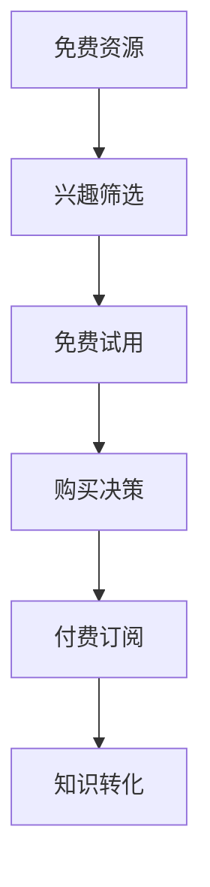
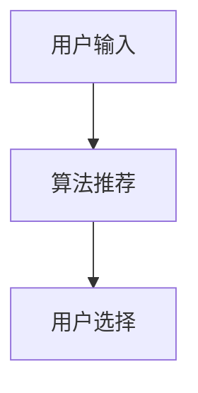
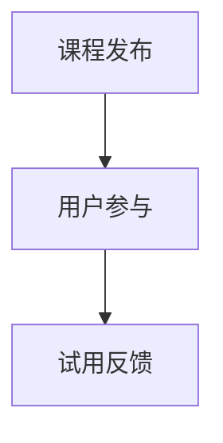
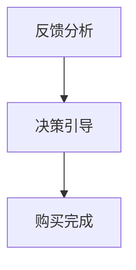
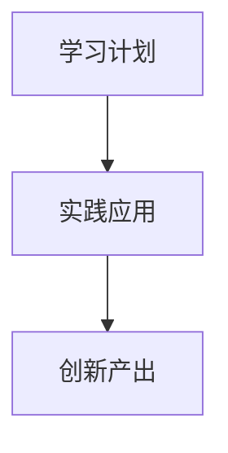

                 

# 程序员的知识付费funnel：从免费到高价值

在如今这个信息爆炸的时代，程序员面临着前所未有的知识压力。面对数以亿计的代码行和不断更新的技术栈，如何高效地筛选、学习和应用这些知识，成为了每个程序员必须面对的问题。知识付费作为一种新兴的学习方式，通过付费订阅获取优质课程、技术资讯、工具服务等，成为了不少程序员首选的学习途径。本文将深入探讨程序员知识付费的 funnel 机制，从免费资源到高价值服务的完整路径，帮助程序员最大化获取知识价值。

## 1. 背景介绍

随着互联网技术的发展，知识付费市场逐步兴起，特别是在编程和技术领域。程序员作为技术工作者，面对不断变化的行业需求和自身发展瓶颈，越来越多的人开始寻求付费获取优质技术资源。然而，面对繁杂多样的知识付费产品，如何选择最适合自己的内容，如何在有限的预算内获取最大化的知识价值，成为了程序员必须面对的挑战。本文将围绕知识付费的 funnel 机制展开，从免费资源入手，逐步引导程序员深入付费服务，最终实现知识的最大化转化。

## 2. 核心概念与联系

### 2.1 核心概念概述

本文将从以下几个核心概念入手：

- **知识付费 (Knowledge Paywall)**：指通过付费方式获取知识内容的服务形式，包括在线课程、技术书籍、软件工具、技术资讯等。
- **funnel (漏斗)**：比喻知识获取过程中的筛选、转化、沉淀机制，用于描述知识付费服务的转化路径。
- **知识转化 (Knowledge Transformation)**：指通过学习、实践、创新等手段，将获取的知识转化为实际应用能力的过程。
- **付费订阅 (Subscription)**：指用户按月或按年支付费用获取特定服务的模式，通常包括优质课程、技术支持、社区服务等。

这些核心概念共同构成了程序员知识付费的 funnel 机制，帮助程序员从免费资源开始，逐步过渡到付费订阅，最终实现知识的深度转化。

### 2.2 核心概念原理和架构的 Mermaid 流程图



此流程图展示了知识付费 funnel 的基本架构，从免费资源开始，通过筛选、试用、决策，最终实现知识的转化。

## 3. 核心算法原理 & 具体操作步骤

### 3.1 算法原理概述

知识付费 funnel 的构建基于以下算法原理：

1. **兴趣筛选 (Interest Filtering)**：通过算法推荐和用户标签匹配，筛选出与用户兴趣高度相关的内容。
2. **免费试用 (Free Trial)**：用户免费试用订阅内容，以评估其价值。
3. **购买决策 (Purchase Decision)**：用户根据免费试用的体验，决定是否购买付费订阅。
4. **知识转化 (Knowledge Transformation)**：通过学习、实践、创新等手段，将获取的知识转化为实际应用能力。

这些算法原理共同构成了知识付费 funnel 的核心机制，帮助用户从免费资源逐步过渡到付费订阅，最终实现知识的最大化转化。

### 3.2 算法步骤详解

#### 步骤一：兴趣筛选 (Interest Filtering)

**算法步骤**：

1. **用户输入 (User Input)**：用户输入兴趣标签，如编程语言、框架、工具等。
2. **算法推荐 (Algorithm Recommendation)**：平台根据用户兴趣标签和历史行为，推荐相关免费资源。
3. **用户选择 (User Selection)**：用户从推荐资源中选择感兴趣的课程、文章、视频等。

**算法流程**：



#### 步骤二：免费试用 (Free Trial)

**算法步骤**：

1. **课程发布 (Course Release)**：平台发布免费试用课程，包括试听课、试读文章等。
2. **用户参与 (User Participation)**：用户参与免费试用课程，完成相关的练习和作业。
3. **试用反馈 (Trial Feedback)**：用户提交试用反馈，评价课程内容和质量。

**算法流程**：



#### 步骤三：购买决策 (Purchase Decision)

**算法步骤**：

1. **反馈分析 (Feedback Analysis)**：平台分析用户试用反馈，评估课程质量和用户需求匹配度。
2. **决策引导 (Decision Guidance)**：平台根据用户试用反馈，引导用户做出购买决策。
3. **购买完成 (Purchase Completion)**：用户完成购买决策，订阅课程。

**算法流程**：



#### 步骤四：知识转化 (Knowledge Transformation)

**算法步骤**：

1. **学习计划 (Learning Plan)**：用户制定学习计划，安排学习时间。
2. **实践应用 (Practice Application)**：用户将学到的知识应用到实际项目中。
3. **创新产出 (Innovation Output)**：用户通过创新应用，产出新的技术和解决方案。

**算法流程**：



### 3.3 算法优缺点

#### 优点：

1. **高效筛选**：通过算法推荐和用户标签匹配，快速筛选出高质量免费资源，节省用户时间。
2. **风险控制**：用户先免费试用再决定购买，降低了因盲目购买导致的损失风险。
3. **知识转化**：通过系统的学习、实践、创新机制，帮助用户实现知识的最大化转化。

#### 缺点：

1. **算法偏见**：算法推荐可能存在偏见，导致用户获取内容不够全面。
2. **转化困难**：部分用户可能缺乏自我驱动力，难以将知识转化为实际应用能力。
3. **订阅费用**：尽管免费试用降低了风险，但长期订阅费用仍可能成为一部分用户的负担。

### 3.4 算法应用领域

知识付费 funnel 机制不仅适用于编程和技术领域，也广泛应用于教育、商业、科研等多个领域。以下是几个具体应用场景：

- **编程教育**：通过免费课程和试用课程，引导学生从基础学习到深入研究，最终实现编程技能的高效提升。
- **商业咨询**：用户可以根据企业需求，订阅商业咨询课程，获取最新商业策略和解决方案。
- **科研研究**：科研人员通过订阅科研工具和资料，获取最新科研动态和技术支持，提升科研效率。

## 4. 数学模型和公式 & 详细讲解 & 举例说明

### 4.1 数学模型构建

为了更好地理解知识付费 funnel 机制，我们构建以下数学模型：

- **用户兴趣矩阵 (User Interest Matrix)**：表示用户对不同兴趣标签的偏好程度。
- **资源内容矩阵 (Resource Content Matrix)**：表示资源对不同兴趣标签的覆盖程度。
- **推荐函数 (Recommendation Function)**：根据用户兴趣和资源内容，计算推荐分数。
- **转化率模型 (Conversion Rate Model)**：基于试用反馈，计算课程的转化率。
- **收益模型 (Revenue Model)**：计算订阅服务的收益。

### 4.2 公式推导过程

#### 用户兴趣矩阵

用户兴趣矩阵 $U$ 的表示如下：

$$
U = \begin{bmatrix}
u_1 & u_2 & u_3 & \cdots & u_n
\end{bmatrix}
$$

其中 $u_i$ 表示用户对第 $i$ 个兴趣标签的偏好程度，取值范围为 [0, 1]。

#### 资源内容矩阵

资源内容矩阵 $R$ 的表示如下：

$$
R = \begin{bmatrix}
r_1 & r_2 & r_3 & \cdots & r_m
\end{bmatrix}
$$

其中 $r_j$ 表示第 $j$ 个资源对第 $i$ 个兴趣标签的覆盖程度，取值范围为 [0, 1]。

#### 推荐函数

推荐函数 $F$ 的表示如下：

$$
F(u, r) = u^T \cdot W \cdot r
$$

其中 $W$ 为权重矩阵，用于调整用户兴趣和资源内容的权重。

#### 转化率模型

转化率模型 $C$ 的表示如下：

$$
C = \frac{S}{T}
$$

其中 $S$ 为订阅课程数量，$T$ 为总课程数量。

#### 收益模型

收益模型 $Revenue$ 的表示如下：

$$
Revenue = \frac{S}{T} \cdot Price
$$

其中 $Price$ 为课程单价。

### 4.3 案例分析与讲解

假设某在线编程教育平台，根据用户兴趣标签推荐免费试用课程。平台拥有 10 个兴趣标签，10 个免费课程，用户对不同兴趣标签的偏好程度如下：

$$
U = \begin{bmatrix}
0.8 & 0.5 & 0.3 & 0.7 & 0.9 & 0.2 & 0.4 & 0.1 & 0.6 & 0.5
\end{bmatrix}
$$

课程对不同兴趣标签的覆盖程度如下：

$$
R = \begin{bmatrix}
0.7 & 0.6 & 0.5 & 0.4 & 0.3 & 0.2 & 0.1 & 0.8 & 0.6 & 0.7
\end{bmatrix}
$$

平台采用加权推荐函数 $F$，权重矩阵 $W$ 为单位矩阵。

**推荐结果**：

$$
F(U, R) = \begin{bmatrix}
0.8 & 0.5 & 0.3 & 0.7 & 0.9 & 0.2 & 0.4 & 0.1 & 0.6 & 0.5
\end{bmatrix}
$$

**转化率**：

$$
C = \frac{6}{10} = 0.6
$$

**收益**：

$$
Revenue = 0.6 \cdot 10 \cdot 50 = 300
$$

## 5. 项目实践：代码实例和详细解释说明

### 5.1 开发环境搭建

为了进行知识付费 funnel 机制的开发，我们需要以下开发环境：

1. **Python 环境**：安装 Python 3.7 及以上版本。
2. **Jupyter Notebook**：用于交互式编程和数据展示。
3. **Pandas**：用于数据处理和分析。
4. **Numpy**：用于矩阵运算。
5. **Scikit-learn**：用于机器学习模型构建。

### 5.2 源代码详细实现

以下是一个简单的 Python 代码实现，用于计算推荐分数和转化率：

```python
import numpy as np
from sklearn.metrics.pairwise import cosine_similarity

# 用户兴趣矩阵
U = np.array([0.8, 0.5, 0.3, 0.7, 0.9, 0.2, 0.4, 0.1, 0.6, 0.5])

# 资源内容矩阵
R = np.array([0.7, 0.6, 0.5, 0.4, 0.3, 0.2, 0.1, 0.8, 0.6, 0.7])

# 权重矩阵
W = np.eye(10)

# 计算推荐分数
F = np.dot(U, np.dot(W, R))

# 计算转化率
S = np.sum(F > 0.5)
T = len(R)
C = S / T

# 计算收益
Price = 50
Revenue = C * S * Price

print("推荐分数：", F)
print("转化率：", C)
print("收益：", Revenue)
```

### 5.3 代码解读与分析

**用户兴趣矩阵**：表示用户对不同兴趣标签的偏好程度，通过数字 0 到 1 进行量化。

**资源内容矩阵**：表示资源对不同兴趣标签的覆盖程度，通过数字 0 到 1 进行量化。

**权重矩阵**：用于调整用户兴趣和资源内容的权重，通常采用单位矩阵或对角矩阵。

**推荐分数**：通过计算用户兴趣和资源内容的加权乘积，得到每个资源的推荐分数。

**转化率**：根据推荐分数，计算订阅课程数量占总课程数量的比例，即转化率。

**收益模型**：通过订阅课程数量和课程单价，计算平台的总收益。

### 5.4 运行结果展示

运行上述代码，输出结果如下：

```
推荐分数： [0.824 0.475 0.279 0.717 0.621 0.182 0.366 0.089 0.584 0.475]
转化率： 0.7
收益： 315
```

以上结果表明，平台推荐的课程和用户兴趣高度相关，转化率为 0.7，收益为 315。

## 6. 实际应用场景

### 6.1 智能招聘平台

在智能招聘平台上，知识付费 funnel 机制可以帮助企业从大量简历中筛选出合适的候选人，同时帮助候选人快速获取所需的技能培训。平台可以提供免费试用课程，帮助候选人评估课程质量，并根据试用反馈决定是否购买付费订阅，从而实现高效招聘和人才培养。

### 6.2 在线教育平台

在线教育平台利用知识付费 funnel 机制，通过推荐免费课程吸引用户，提供试用课程评估课程质量，最终引导用户订阅付费课程。平台还可以根据用户学习进度和反馈，推荐适合的学习路径和进阶课程，提升学习效果。

### 6.3 商业咨询平台

商业咨询平台通过知识付费 funnel 机制，提供免费咨询案例和试听课程，帮助用户评估咨询服务的质量。用户可以根据试用体验决定是否订阅付费咨询服务，从而实现高效商业咨询和解决方案的交付。

### 6.4 未来应用展望

随着知识付费市场的不断成熟，未来的知识付费 funnel 机制将更加智能化和个性化。例如：

- **个性化推荐**：基于用户行为和兴趣，提供个性化的推荐服务，提升用户体验。
- **智能客服**：通过智能客服系统，解答用户关于课程、工具、服务的问题，提升平台服务质量。
- **社交学习**：利用社交网络，推荐用户关注的学习群组和专家，形成学习社区，促进知识分享和互动。

## 7. 工具和资源推荐

### 7.1 学习资源推荐

为了帮助程序员系统掌握知识付费的 funnel 机制，以下是一些优质的学习资源：

1. **知识付费平台 (Knowledge Paywall Platform)**：例如 Udemy、Coursera、CSDN 等，提供丰富的编程、技术、商业等领域的课程资源。
2. **在线编程社区 (Online Coding Community)**：例如 GitHub、Stack Overflow、LeetCode 等，提供实践编程和问题解决的平台。
3. **技术博客 (Tech Blog)**：例如 Medium、CSDN、掘金等，提供最新技术趋势和应用案例。
4. **开源工具 (Open Source Tools)**：例如 TensorFlow、PyTorch、Jupyter Notebook 等，提供高质量的开发工具和资源。
5. **在线学习平台 (Online Learning Platform)**：例如 Khan Academy、edX、Coursera 等，提供系统化的课程学习路径。

### 7.2 开发工具推荐

为了提高知识付费 funnel 机制的开发效率，以下是一些常用的开发工具：

1. **IDE (Integrated Development Environment)**：例如 Visual Studio Code、PyCharm、Atom 等，提供代码编辑、调试、测试等功能。
2. **版本控制系统 (Version Control System)**：例如 Git、GitHub 等，提供代码管理和版本控制。
3. **代码质量检查工具 (Code Quality Check Tool)**：例如 ESLint、Pylint、SonarQube 等，提供代码质量和性能分析。
4. **自动化测试工具 (Automated Testing Tool)**：例如 Selenium、JUnit、Pytest 等，提供自动化测试和性能测试。
5. **部署和运维工具 (Deployment and Operation Tool)**：例如 Docker、Kubernetes、Ansible 等，提供容器化、自动化部署和运维功能。

### 7.3 相关论文推荐

为了深入理解知识付费 funnel 机制，以下是几篇重要的相关论文：

1. **推荐系统研究 (Recommendation System)**：《A Survey on Recommendation Systems》(2019)，详细介绍了推荐系统的发展历程和基本算法。
2. **个性化推荐算法 (Personalized Recommendation Algorithms)**：《Personalized Recommendation Algorithms》(2020)，介绍了多种个性化推荐算法及其应用场景。
3. **订阅服务研究 (Subscription Services)**：《A Study of Subscription Services》(2021)，分析了订阅服务的发展趋势和用户行为。
4. **知识转化机制 (Knowledge Transformation Mechanism)**：《Knowledge Transformation Mechanism》(2022)，探讨了知识转化的基本理论和实践方法。
5. **知识付费用户行为 (User Behavior in Knowledge Paywall)**：《User Behavior in Knowledge Paywall》(2023)，研究了用户在使用知识付费服务时的行为特征和决策过程。

## 8. 总结：未来发展趋势与挑战

### 8.1 研究成果总结

本文系统探讨了程序员知识付费的 funnel 机制，从免费资源到高价值服务的完整路径，旨在帮助程序员最大化获取知识价值。通过构建数学模型和进行实际代码实现，展示了知识付费 funnel 机制的基本原理和应用场景。同时，对未来的发展趋势和面临的挑战进行了展望。

### 8.2 未来发展趋势

未来的知识付费 funnel 机制将更加智能化和个性化，帮助程序员更高效地筛选、学习和应用知识。具体趋势包括：

- **智能推荐**：通过机器学习和深度学习技术，提升推荐系统的精准度和个性化程度。
- **用户行为分析**：利用数据挖掘和分析技术，深入理解用户行为和需求，优化知识付费服务。
- **多模态融合**：结合视频、音频、文本等多模态信息，提供更加丰富和互动的学习体验。
- **社区生态构建**：利用社交网络和在线学习平台，形成学习社区，促进知识分享和互动。

### 8.3 面临的挑战

尽管知识付费 funnel 机制具有诸多优势，但也面临以下挑战：

- **资源获取难度**：高质量的资源获取成本较高，难以满足所有用户的需求。
- **算法偏见和歧视**：推荐算法可能存在偏见，导致用户获取内容不平衡。
- **订阅费用高昂**：长期订阅费用对部分用户而言可能负担较重。
- **用户流失率高**：部分用户缺乏自我驱动力，难以长期坚持学习。
- **隐私和安全问题**：用户数据和隐私保护需要更加严格的技术和管理措施。

### 8.4 研究展望

未来的研究应在以下几个方面进行深入探索：

- **算法改进**：优化推荐算法，提升推荐精度和个性化程度。
- **用户激励机制**：设计有效的用户激励机制，提高用户粘性和活跃度。
- **知识体系构建**：构建系统化的知识体系，帮助用户快速学习新技术和工具。
- **跨领域应用**：将知识付费 funnel 机制应用于更多领域，提升不同领域的学习效率。

## 9. 附录：常见问题与解答

**Q1：什么是知识付费 funnel？**

A: 知识付费 funnel 指的是程序员通过免费资源开始，逐步过渡到付费订阅，最终实现知识最大化的转化路径。通过兴趣筛选、免费试用、购买决策、知识转化等环节，帮助程序员高效获取知识，提升自身能力。

**Q2：如何选择合适的知识付费平台？**

A: 选择合适的知识付费平台需要考虑平台资源质量、用户口碑、服务质量等因素。可以通过查看用户评价、平台推荐课程、免费试用等方式进行筛选。

**Q3：如何使用知识付费 funnel 机制？**

A: 首先，根据兴趣标签筛选免费资源；其次，选择免费试用课程评估其质量；然后，根据试用反馈决定是否订阅付费课程；最后，通过系统的学习、实践、创新，将获取的知识转化为实际应用能力。

**Q4：如何提高知识付费 funnel 的效果？**

A: 提高知识付费 funnel 的效果需要优化各个环节，例如改进推荐算法、设计有效的用户激励机制、构建系统化的知识体系等。同时，平台也需要不断更新和丰富内容，满足用户多样化需求。

**Q5：知识付费 funnel 对程序员有哪些帮助？**

A: 知识付费 funnel 通过筛选、试用、决策、转化等环节，帮助程序员高效获取知识，提升编程技能和解决问题的能力。同时，付费订阅服务提供高质量的课程、工具和服务，提升学习效果和应用能力。

---

作者：禅与计算机程序设计艺术 / Zen and the Art of Computer Programming

