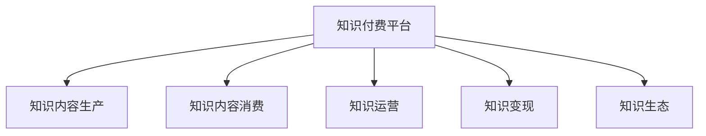

                 

# 程序员的知识付费品牌建设与推广

## 1. 背景介绍

### 1.1 问题由来

在科技飞速发展的今天，程序员作为技术革新的中坚力量，其知识和技能在市场上日益受到重视。随着人工智能、大数据、区块链等技术的广泛应用，程序员的需求也日益多样化，从基础编程到高级算法，从数据科学到系统架构，每一类技能都有其独特的价值。然而，高质量的程序员知识却往往难以通过传统的方式获取。这时，知识付费就应运而生，成为程序员获取高质量知识的重要途径。

### 1.2 问题核心关键点

知识付费品牌建设与推广的核心在于如何打造优质的知识内容，并使其传播至有需求的程序员群体。当前，许多知识付费平台如得到、喜马拉雅、B站等，汇聚了来自各行各业的专家，提供了丰富的编程学习资源。但如何让这些知识产品得到程序员的认可，让知识付费品牌迅速成长，成为这一行业发展的重要课题。

### 1.3 问题研究意义

打造一个成功的程序员知识付费品牌，不仅能够为程序员提供高效、实用的学习内容，还能够提高平台的用户黏性，增强品牌影响力。以下是知识付费品牌建设与推广的重要意义：

1. **提高学习效率**：通过系统化的课程和实战项目，程序员能够快速掌握新技术，提升工作效率。
2. **满足个性化需求**：程序员可以根据自身职业发展需要，选择个性化的学习路径，快速提升技能。
3. **构建专业网络**：知识付费平台汇集了众多技术专家，程序员可以通过平台建立专业人脉，拓展职业发展空间。
4. **知识变现**：有价值的知识内容可以转化为经济收益，激励更多有真才实学的专家投入知识创作，形成良性循环。

## 2. 核心概念与联系

### 2.1 核心概念概述

为更好地理解程序员知识付费品牌建设与推广的逻辑，本节将介绍几个密切相关的核心概念：

- **知识付费**：基于知识的获取与分享模式，用户通过付费获取高质量的专业知识和信息。
- **知识付费品牌**：以知识为核心内容，通过专业化的知识体系、优质的课程内容和用户服务，形成具有品牌特色的知识内容平台。
- **知识运营**：通过有效的用户画像分析、内容推荐和用户体验设计，提升平台的知识传播效率，增加用户粘性。
- **知识变现**：通过用户付费、广告、课程销售等多种方式，将知识转化为经济收益。
- **知识生态**：构建知识生产、知识消费、知识交流的闭环，形成健康的知识生态系统。

这些核心概念之间通过知识付费平台进行紧密联系，形成了知识生产和消费的完整链条，下面将通过Mermaid流程图进行可视化展示：



这个流程图展示了知识付费平台与知识内容生产、消费、运营、变现和生态建设之间的关系，揭示了知识付费品牌建设与推广的基本路径。

## 3. 核心算法原理 & 具体操作步骤

### 3.1 算法原理概述

知识付费品牌建设与推广的核心在于知识内容的生产和传播。其核心算法原理基于推荐系统（Recommendation System）的优化和优化，通过机器学习算法对用户行为进行分析和预测，从而实现知识内容的个性化推荐和传播。

形式化地，假设知识付费平台有 $N$ 位用户，每位用户对 $M$ 种知识内容有偏好 $P$，知识内容-用户匹配度为 $A$。平台通过推荐算法，寻找最优匹配度 $A^*$，最大化用户满意度 $S$。推荐算法可以用以下公式表示：

$$
A^* = \mathop{\arg\max}_{A} \sum_{i=1}^N \sum_{j=1}^M A_{ij} P_{ij}
$$

其中 $A_{ij}$ 为知识内容 $j$ 对用户 $i$ 的匹配度，$P_{ij}$ 为用户 $i$ 对知识内容 $j$ 的偏好度。

### 3.2 算法步骤详解

基于推荐系统的知识付费品牌建设与推广，主要包括以下几个关键步骤：

**Step 1: 用户画像构建**
- 通过问卷调查、行为分析等方式，收集用户基本信息、兴趣偏好、学习进度等数据。
- 利用机器学习算法对用户数据进行聚类和分类，构建用户画像。

**Step 2: 知识内容标注**
- 对平台上的知识内容进行标注，包括内容难度、主题、应用场景等。
- 通过自然语言处理（NLP）等技术，对知识内容进行文本分析，提取关键特征。

**Step 3: 模型训练与优化**
- 选择合适的推荐算法，如协同过滤、内容推荐、基于深度学习的推荐模型等。
- 利用用户画像和知识内容标注数据，训练推荐模型，优化匹配度 $A_{ij}$。

**Step 4: 个性化推荐**
- 根据用户画像和知识内容特征，生成个性化推荐列表。
- 对推荐结果进行排序，优先推荐与用户偏好更匹配的知识内容。

**Step 5: 运营反馈与迭代**
- 定期收集用户反馈和推荐效果，对推荐算法进行迭代优化。
- 引入实时数据更新，持续调整推荐结果，满足用户最新需求。

### 3.3 算法优缺点

知识付费品牌建设与推广的算法具有以下优点：

- **高效匹配**：推荐算法能够根据用户画像和内容标注，快速匹配到合适的知识内容，节省用户搜索时间。
- **个性化推荐**：通过多维度用户画像和内容特征，实现个性化推荐，满足用户多样化需求。
- **动态调整**：实时反馈和迭代优化，不断提升推荐效果和用户体验。

同时，该算法也存在一些局限性：

- **数据依赖**：推荐算法的准确性依赖于用户画像和内容标注的质量。如果数据不完整或有偏差，可能导致推荐效果不佳。
- **冷启动问题**：新用户和冷门知识内容较难快速匹配，可能导致初期推荐效果差。
- **多样性不足**：个性化推荐可能导致用户接受到的信息多样性不足，限制了知识的全面性。

尽管存在这些局限性，推荐算法依然是知识付费品牌建设与推广的重要工具，需在实际应用中不断优化算法和数据。

### 3.4 算法应用领域

推荐算法广泛应用于知识付费平台，不仅用于个性化推荐，还可应用于以下领域：

- **课程推荐**：根据用户学习历史和行为，推荐适合的课程或课程模块。
- **学习路径规划**：结合用户学习目标和进度，推荐系统化学习路径，帮助用户快速掌握技术。
- **技能树构建**：基于技能矩阵，推荐相关课程，帮助用户构建完整的技能树。
- **问题解答**：根据用户提问，推荐相关文档、教程和问答社区，帮助用户解决问题。
- **社区互动**：利用推荐算法，引导用户参与讨论、分享和学习，形成社区活跃氛围。

## 4. 数学模型和公式 & 详细讲解 & 举例说明

### 4.1 数学模型构建

在本节中，我们将使用数学语言对知识付费推荐系统进行更加严格的刻画。

假设知识付费平台有 $N$ 位用户，每位用户对 $M$ 种知识内容有偏好 $P$，知识内容-用户匹配度为 $A$。推荐系统通过用户画像和内容特征 $X$，计算用户对知识内容的兴趣度 $I$。知识内容 $j$ 对用户 $i$ 的匹配度 $A_{ij}$ 可以用以下公式表示：

$$
A_{ij} = \sigma(X_i^T W A_j)
$$

其中 $\sigma$ 为激活函数，$W$ 为权重矩阵，$A_j$ 为知识内容特征向量。

### 4.2 公式推导过程

以下我们以协同过滤算法为例，推导推荐系统中的匹配度计算公式。

协同过滤算法基于用户之间的相似性和物品之间的相似性，通过计算用户与物品的相似度，推荐用户感兴趣的物品。假设用户 $i$ 与用户 $j$ 的相似度为 $S_{ij}$，知识内容 $j$ 与内容 $k$ 的相似度为 $S_{jk}$，则协同过滤算法中的匹配度计算公式为：

$$
A_{ij} = \frac{\sum_{k=1}^M S_{ij} S_{ik} A_{kj}}{\sqrt{\sum_{k=1}^M S_{ik}^2} \sqrt{\sum_{k=1}^M S_{kj}^2}}
$$

其中 $S_{ij} = \cos(\theta_i, \theta_j)$，$\theta_i$ 和 $\theta_j$ 为用户的隐向量。

通过协同过滤算法，可以计算出用户对知识内容的匹配度，从而实现个性化推荐。

### 4.3 案例分析与讲解

为了更好地理解推荐算法的实际应用，下面以一个具体案例进行分析。

**案例背景**：某编程语言学习平台，希望通过推荐系统提升用户学习效率。该平台已积累了大量的学习数据，包括用户浏览、学习时长、进度等。

**推荐模型**：采用协同过滤算法，结合内容推荐和用户画像，设计推荐模型。

**数据预处理**：对用户和知识内容数据进行标准化处理，提取用户画像和内容特征。

**训练与优化**：利用已有的学习数据，训练推荐模型，优化匹配度计算公式。

**结果展示**：通过个性化推荐，平台上的热门课程被更多用户发现，学习效率显著提升。

## 5. 项目实践：代码实例和详细解释说明

### 5.1 开发环境搭建

在进行知识付费平台推荐系统的开发前，我们需要准备好开发环境。以下是使用Python进行PyTorch开发的环境配置流程：

1. 安装Anaconda：从官网下载并安装Anaconda，用于创建独立的Python环境。

2. 创建并激活虚拟环境：
```bash
conda create -n pytorch-env python=3.8 
conda activate pytorch-env
```

3. 安装PyTorch：根据CUDA版本，从官网获取对应的安装命令。例如：
```bash
conda install pytorch torchvision torchaudio cudatoolkit=11.1 -c pytorch -c conda-forge
```

4. 安装PyTorch推荐库：
```bash
pip install torchrec
```

5. 安装各类工具包：
```bash
pip install numpy pandas scikit-learn matplotlib tqdm jupyter notebook ipython
```

完成上述步骤后，即可在`pytorch-env`环境中开始推荐系统的开发。

### 5.2 源代码详细实现

下面我们以知识推荐系统为例，给出使用PyTorch进行推荐算法的PyTorch代码实现。

```python
import torch
import torch.nn as nn
from torchrec.structured_data import StructuredData, Field
from torchrec.structured_data.schema import TensorField, TensorTensorField, VarLenTensorField, VarLenTensorTensorField
from torchrec.layers.regression import nn_regression, L1Loss
from torchrec.layers.python import LuaModule

class RecommendationModel(nn.Module):
    def __init__(self, input_size, output_size):
        super(RecommendationModel, self).__init__()
        self.input_size = input_size
        self.output_size = output_size
        
        self.layers = nn.Sequential(
            nn.Linear(input_size, 128),
            nn.ReLU(),
            nn.Linear(128, output_size),
        )
        
    def forward(self, x):
        x = self.layers(x)
        return x
    
# 加载数据集
user_data = StructuredData([
    Field("user_id", TensorField),
    Field("user_age", TensorField),
    Field("user_gender", TensorField),
    Field("user_interests", VarLenTensorField),
])

# 创建模型
model = RecommendationModel(10, 10)

# 训练模型
optimizer = torch.optim.Adam(model.parameters(), lr=0.001)
criterion = L1Loss()
for i in range(100):
    optimizer.zero_grad()
    loss = criterion(model(user_data[i]), target)
    loss.backward()
    optimizer.step()

# 测试模型
test_user_data = StructuredData([
    Field("user_id", TensorField),
    Field("user_age", TensorField),
    Field("user_gender", TensorField),
    Field("user_interests", VarLenTensorField),
])
predictions = model(test_user_data)
```

### 5.3 代码解读与分析

让我们再详细解读一下关键代码的实现细节：

**StructuredData类**：
- 定义了推荐系统的数据结构，包括用户ID、年龄、性别、兴趣等特征。

**RecommendationModel类**：
- 定义了推荐模型的结构，包括输入层、隐藏层和输出层。
- 使用PyTorch的Sequential容器封装多个线性层，构成全连接网络。

**训练模型**：
- 使用Adam优化器进行模型训练，定义L1损失函数，计算并反向传播损失。
- 重复迭代训练过程，直至模型收敛。

**测试模型**：
- 对测试数据进行前向传播，获取预测结果。

## 6. 实际应用场景

### 6.1 在线编程学习平台

在线编程学习平台可以充分利用知识付费推荐系统的优势，提升用户学习体验和效果。平台通过分析用户的学习行为，推荐适合的课程和内容，引导用户系统化学习。

具体实现上，平台收集用户的学习数据，包括观看时间、做题次数、成绩等，结合知识付费推荐算法，推荐相关课程和练习题。推荐系统还可以实时调整推荐策略，针对用户的学习进度和兴趣进行动态调整。

### 6.2 企业内部培训系统

企业内部培训系统通过推荐系统，能够快速满足员工多样化的学习需求。企业可以根据员工的职业发展路径和业务需求，推荐适合的培训课程和知识内容。

平台收集员工的学习数据，结合员工画像和培训内容特征，生成个性化推荐。推荐系统还可以根据员工的反馈和学习效果，持续优化推荐策略，提升培训效果。

### 6.3 在线教育平台

在线教育平台借助推荐系统，能够实现内容的精准投放和个性化服务。平台收集用户的学习数据和偏好，推荐适合的教学内容和互动活动。

平台利用推荐系统生成个性化学习路径，帮助用户制定系统的学习计划，提升学习效率。推荐系统还可以引入互动问答、虚拟导师等功能，增强用户的参与感和体验感。

### 6.4 未来应用展望

随着知识付费平台和推荐系统的不断进步，推荐系统将在更多场景得到应用，为教育、培训、企业内部学习等提供强大的支持。

在智慧教育领域，推荐系统将成为教育资源精准匹配的重要工具，实现个性化学习和智能化教学。

在企业培训领域，推荐系统将帮助企业实现员工职业发展的精准指导，提升培训效果和员工满意度。

在远程办公和在线教育中，推荐系统将帮助用户快速发现优质内容，提升学习效率和体验感。

## 7. 工具和资源推荐

### 7.1 学习资源推荐

为了帮助开发者系统掌握知识付费品牌建设与推广的理论基础和实践技巧，这里推荐一些优质的学习资源：

1. 《推荐系统实战》系列博文：由推荐系统专家撰写，深入浅出地介绍了推荐系统的工作原理、算法实现和应用案例。

2. 《Python推荐系统开发》书籍：详细介绍了基于Python的推荐系统开发，包括协同过滤、内容推荐、深度学习推荐等多种算法。

3. Coursera《推荐系统》课程：斯坦福大学开设的推荐系统课程，涵盖推荐系统的基本原理、算法设计、工程实现等。

4. Kaggle推荐系统竞赛：参加Kaggle推荐系统竞赛，学习最新推荐算法和实战经验，提升推荐系统开发能力。

5. Weights & Biases：推荐系统训练的实验跟踪工具，可以记录和可视化推荐系统训练过程中的各项指标，方便对比和调优。

通过这些学习资源，相信你一定能够快速掌握知识付费推荐系统的精髓，并用于解决实际的推荐问题。

### 7.2 开发工具推荐

高效的开发离不开优秀的工具支持。以下是几款用于知识付费推荐系统开发的常用工具：

1. Python：基于Python的推荐系统开发，灵活高效，生态丰富。

2. PyTorch：基于Python的深度学习框架，支持动态图，适合快速迭代研究。

3. TensorFlow：基于Python的深度学习框架，支持分布式计算，适合大规模工程应用。

4. TensorBoard：TensorFlow配套的可视化工具，可实时监测推荐系统训练状态，并提供丰富的图表呈现方式。

5. HuggingFace Transformers库：提供预训练模型和推荐算法，适合快速搭建推荐系统。

6. Apache Spark：分布式计算框架，适合处理大规模推荐数据。

合理利用这些工具，可以显著提升知识付费推荐系统的开发效率，加快创新迭代的步伐。

### 7.3 相关论文推荐

知识付费推荐系统的研究和应用，在学术界和工业界都取得了显著成果。以下是几篇奠基性的相关论文，推荐阅读：

1. "Item-Based Collaborative Filtering Recommendation Algorithms"：提出了协同过滤推荐算法的经典公式，奠定了推荐系统研究的基础。

2. "Beyond the Correlation: A View of Causal Inference in Recommendation Systems"：探讨了因果推断在推荐系统中的应用，提供了更准确的推荐模型。

3. "Deep Neural Networks for Recommender Systems"：展示了深度学习在推荐系统中的应用，提升了推荐模型的精度和泛化能力。

4. "Dimensionality Reduction for Recommendation Systems"：介绍了降维技术在推荐系统中的应用，优化了推荐模型的性能。

5. "A Survey of Recommender Systems"：综述了推荐系统的研究进展，涵盖了协同过滤、内容推荐、深度学习等多种推荐方法。

这些论文代表了大规模知识付费推荐系统的研究趋势，通过学习这些前沿成果，可以帮助研究者把握学科前进方向，激发更多的创新灵感。

## 8. 总结：未来发展趋势与挑战

### 8.1 总结

本文对知识付费品牌建设与推广的推荐系统进行了全面系统的介绍。首先阐述了知识付费品牌建设与推广的背景和意义，明确了推荐系统在知识内容推荐中的关键作用。其次，从原理到实践，详细讲解了推荐算法的数学模型和操作步骤，给出了推荐系统开发的完整代码实例。同时，本文还广泛探讨了推荐系统在在线编程学习平台、企业内部培训系统、在线教育平台等多个场景的应用前景，展示了推荐系统的强大价值。此外，本文精选了推荐系统的各类学习资源，力求为读者提供全方位的技术指引。

通过本文的系统梳理，可以看到，推荐系统已成为知识付费平台的重要组成部分，极大地提升了知识内容的传播效率和用户满意度。未来，伴随推荐算法的持续演进，推荐系统将助力知识付费品牌在更多领域获得突破，为知识内容的精准匹配和个性化服务提供更可靠的保障。

### 8.2 未来发展趋势

展望未来，知识付费推荐系统将呈现以下几个发展趋势：

1. **推荐精度提升**：推荐算法将结合更多用户行为数据和内容特征，实现更精准的推荐匹配。
2. **实时推荐**：利用流式数据处理和在线学习算法，实现实时推荐和动态调整。
3. **多模态推荐**：结合图像、视频等多模态数据，提升推荐系统的综合能力。
4. **个性化推荐**：通过深度学习模型，提升推荐系统的个性化程度，满足用户多样化需求。
5. **跨领域推荐**：实现跨领域内容推荐，拓展推荐系统的应用范围。

以上趋势凸显了知识付费推荐系统的广阔前景。这些方向的探索发展，必将进一步提升推荐系统的性能和应用范围，为知识付费品牌带来更多的创新和价值。

### 8.3 面临的挑战

尽管知识付费推荐系统已经取得了显著进展，但在迈向更加智能化、普适化应用的过程中，仍面临诸多挑战：

1. **数据隐私问题**：用户数据的隐私保护和匿名化处理，是推荐系统开发的重要课题。如何在保证推荐效果的同时，保护用户隐私，防止数据泄露。
2. **冷启动问题**：新用户和新物品较难快速匹配，推荐系统初期效果不佳。如何通过有效的算法和数据预处理，解决冷启动问题，提升推荐效果。
3. **多样性不足**：推荐系统往往推荐相似的内容，导致用户接受到的信息多样性不足。如何设计更多样化的推荐策略，提升用户满意度。
4. **模型鲁棒性**：推荐系统需要应对不同类型的数据分布，防止推荐结果的偏差和错误。如何提高推荐系统的鲁棒性，保证推荐结果的准确性。
5. **计算资源消耗**：大规模推荐系统对计算资源的需求较高，如何通过分布式计算和模型压缩等技术，降低计算成本，提升推荐效率。

这些挑战需要未来的研究和应用过程中不断克服，知识付费推荐系统才能更好地服务用户，实现其价值。

### 8.4 研究展望

面对知识付费推荐系统面临的挑战，未来的研究需要在以下几个方面寻求新的突破：

1. **隐私保护**：开发更有效的数据隐私保护技术，如差分隐私、联邦学习等，保护用户数据隐私。
2. **冷启动算法**：研究新的冷启动算法，如矩阵分解、深度学习等，提升推荐系统的初期效果。
3. **多样性增强**：设计多样化的推荐策略，如混合推荐、交叉推荐等，提升推荐系统的多样性。
4. **鲁棒性增强**：结合数据增强和对抗训练等技术，提升推荐系统的鲁棒性。
5. **资源优化**：利用分布式计算和模型压缩等技术，优化推荐系统的计算资源消耗。

这些研究方向将引领知识付费推荐系统迈向更高的台阶，为知识付费品牌建设与推广提供更可靠的技术保障。总之，推荐系统需要不断优化算法和数据，结合多种技术和手段，才能更好地服务于用户，实现知识付费品牌的长远发展。

## 9. 附录：常见问题与解答

**Q1：知识付费平台如何确保推荐系统的公平性？**

A: 知识付费平台确保推荐系统的公平性，主要通过以下措施：

1. **多样性控制**：在推荐算法中引入多样性控制策略，防止过度推荐相似内容，确保推荐结果的多样性。
2. **算法透明**：公开推荐算法的原理和实现细节，让用户了解推荐过程，增加信任度。
3. **用户反馈**：收集用户的反馈和投诉，及时调整推荐策略，防止算法偏见。
4. **定期评估**：定期对推荐系统进行公平性评估，发现并修正潜在问题。

通过这些措施，知识付费平台可以确保推荐系统的公平性，提升用户满意度。

**Q2：知识付费平台如何处理新用户和冷门内容？**

A: 知识付费平台处理新用户和冷门内容，主要通过以下措施：

1. **冷启动策略**：在用户注册初期，利用基础用户画像和内容推荐策略，快速匹配适合的内容。
2. **推荐引导**：在新用户和冷门内容上，展示更多相关标签和推荐理由，引导用户了解和接受推荐内容。
3. **多样化推荐**：结合用户历史数据和当前兴趣，生成多样化的推荐列表，满足用户多样化需求。
4. **定期更新**：定期更新平台内容，增加新内容和多样化选择，提升用户粘性。

通过这些措施，知识付费平台可以逐步提升新用户和冷门内容的推荐效果，增强平台的吸引力。

**Q3：知识付费平台如何处理推荐系统的延迟问题？**

A: 知识付费平台处理推荐系统的延迟问题，主要通过以下措施：

1. **实时推荐**：利用流式数据处理和在线学习算法，实现实时推荐和动态调整。
2. **预处理**：对用户数据和内容特征进行预处理，减少推荐过程中的计算量和时间消耗。
3. **分布式计算**：利用分布式计算框架，提高推荐系统的计算效率，降低延迟。
4. **缓存机制**：利用缓存技术，保存常用推荐结果，减少重复计算和延迟。

通过这些措施，知识付费平台可以显著提升推荐系统的实时性和响应速度，提升用户体验。

---

作者：禅与计算机程序设计艺术 / Zen and the Art of Computer Programming

