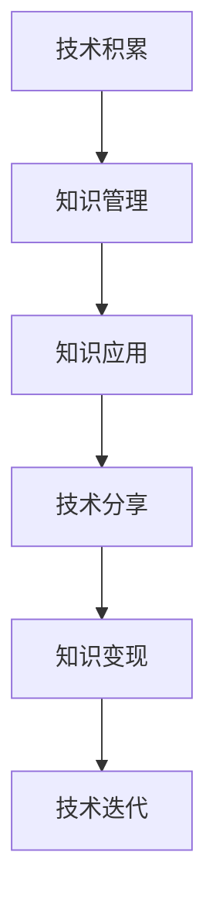

                 

# 程序员的知识管理：从积累到变现的全过程

> 关键词：程序员, 知识管理, 技术积累, 变现, 软件开发, 技术分享

## 1. 背景介绍

在快速变化的技术环境中，程序员的知识管理已成为其职业发展不可或缺的一部分。知识管理的本质是对个人、团队乃至整个行业内的知识进行系统的收集、整理、存储和利用，以提高工作效率、加速技术迭代、促进创新与合作。本文旨在深入探讨程序员的知识管理，从知识积累到知识变现的全过程，为读者提供一种系统化、高效化的知识管理方法论。

## 2. 核心概念与联系

### 2.1 核心概念概述

- **知识管理**：指通过有组织地规划、执行和改进知识管理策略，以提高组织或个人的知识获取、存储、共享和应用效率。
- **技术积累**：程序员不断学习和掌握新技能、新工具、新理念，形成个人技术栈和知识库的过程。
- **知识变现**：将个人的技术知识转化为实际应用价值，如通过开发、培训、咨询、写作等方式获取经济回报。
- **软件开发**：通过编程语言和工具进行系统开发和维护，提升软件产品的质量和效率。
- **技术分享**：通过博客、讲座、社区讨论等方式，将自己的技术经验和见解分享给同行，促进技术交流和合作。

### 2.2 核心概念原理和架构的 Mermaid 流程图



该流程图展示了技术积累与知识管理的双向互动关系，并指出知识变现和技术分享在其中的桥梁作用，以及技术迭代的重要性。

## 3. 核心算法原理 & 具体操作步骤

### 3.1 算法原理概述

知识管理的核心算法通常基于信息检索理论，结合人工智能技术和组织行为学原理。它包括知识的识别、组织、存取和传播等多个环节。在技术积累和变现过程中，我们可以应用以下关键算法：

- **信息检索算法**：用于从大量数据中快速检索相关知识，包括搜索引擎算法、文本分类算法等。
- **机器学习算法**：用于分析和预测知识的相关性和趋势，如推荐系统算法、情感分析算法等。
- **协同过滤算法**：用于推荐与用户兴趣相符的知识内容，如协同过滤算法、内容过滤算法等。

### 3.2 算法步骤详解

#### 3.2.1 知识积累

1. **技术文档整理**：将学习过程中的笔记、代码片段、技术博客等文档进行分类和整理。可以使用Markdown、GitHub等工具进行版本控制和文档管理。
2. **项目经验总结**：记录和分析参与过的项目，包括项目背景、设计思路、实现细节、遇到的问题及解决方案等。
3. **代码库维护**：建立和管理个人代码库，记录使用过的第三方库、框架和工具，以及相关配置和代码示例。
4. **持续学习**：通过在线课程、技术论坛、书籍阅读等方式，不断更新和补充知识体系，掌握最新的技术动态和趋势。

#### 3.2.2 知识管理

1. **分类与标签化**：将整理好的文档和技术经验按照主题、语言、难度等进行分类和标签化，便于检索和查阅。
2. **文档化**：将知识转化为可搜索、可复用的文档形式，包括博客、笔记、教程等。可以使用Markdown、DocsAsCode等工具进行文档化处理。
3. **版本控制**：使用Git等版本控制系统，对知识文档进行版本管理，跟踪变更历史和差异。
4. **知识图谱构建**：建立个人或团队的知识图谱，将零散的知识关联起来，形成有机的知识网络。

#### 3.2.3 知识应用

1. **问题导向学习**：通过解决实际项目中的问题，将理论知识应用于实践，提升解决复杂问题的能力。
2. **知识创新**：结合最新技术趋势，创新和优化现有解决方案，形成独特的技术方案。
3. **跨领域应用**：将某一领域的技术应用到其他领域，实现知识跨界融合。

#### 3.2.4 知识分享

1. **博客与文章撰写**：在个人博客或技术社区撰写技术文章，分享经验和见解，提升个人影响力。
2. **开源项目贡献**：参与开源社区，贡献代码、修复bug、撰写文档等，积累技术声誉和合作机会。
3. **讲座与培训**：在技术会议、公司内训等场合进行技术分享，展示个人技术水平。

#### 3.2.5 知识变现

1. **开发与咨询**：利用技术知识进行软件开发，或为公司内部或外部客户提供技术咨询和解决方案。
2. **技术培训**：为培训需求客户提供技术培训，收取培训费用。
3. **技术书籍与课程**：将自己的技术知识撰写成书籍或开发成课程，通过线上线下渠道销售。
4. **技术讲座与演讲**：参加技术会议，分享技术经验和见解，收取演讲费用。

### 3.3 算法优缺点

- **优点**：
  - **系统化管理**：能够有条不紊地管理个人技术积累，避免知识遗忘和重复劳动。
  - **高效检索**：快速检索所需知识，提高工作效率和问题解决能力。
  - **知识共享**：促进技术交流和合作，扩展技术人脉和影响力。
  - **持续改进**：通过反馈和迭代，不断优化知识体系和技能水平。

- **缺点**：
  - **时间投入大**：系统化管理需要大量时间和精力投入，初期的实施成本较高。
  - **知识更新快**：技术发展迅速，知识更新速度要求高，维护工作量大。
  - **工具依赖**：依赖于高效的工具和系统，可能存在一定的学习和使用门槛。

### 3.4 算法应用领域

- **软件开发**：在软件开发过程中，利用知识管理提升代码质量和开发效率，减少重复工作。
- **项目管理**：通过知识图谱构建项目架构和知识库，提高团队协作和项目管理效率。
- **技术创新**：利用知识图谱和版本控制，跟踪技术演进和创新，保持技术领先性。
- **团队合作**：通过知识分享和协作工具，促进团队知识共享和经验积累。
- **知识传播**：通过技术博客、开源项目、讲座等形式，将个人知识传播到更广泛的用户群体。

## 4. 数学模型和公式 & 详细讲解 & 举例说明

### 4.1 数学模型构建

知识管理的数学模型主要基于信息检索和机器学习理论。其中，信息检索模型用于知识检索，机器学习模型用于知识推荐和分类。

### 4.2 公式推导过程

以基于倒排索引的信息检索模型为例，其核心公式为：

$$
R = \max_{d \in D} \sum_{i=1}^n r_{di} \cdot \alpha_i
$$

其中，$R$为检索结果，$D$为文档库，$d$为候选文档，$n$为查询词，$r_{di}$为查询词$i$在文档$d$中的权重，$\alpha_i$为查询词$i$的重要性权重。

### 4.3 案例分析与讲解

假设我们有一个程序员的技术博客，记录了他在机器学习领域的技术积累。通过信息检索模型，我们可以快速找到关于“深度学习”的相关文章和代码实现。设检索结果包含100篇文章，每篇文章的权重计算如下：

- **文章1**：深度学习基础，权重$r_{1}$=0.8，$\alpha_1$=0.5。
- **文章2**：卷积神经网络，权重$r_{2}$=0.7，$\alpha_2$=0.3。
- **文章3**：自然语言处理，权重$r_{3}$=0.6，$\alpha_3$=0.2。

将权重带入公式，计算得到最相关的文章为文章1和文章2，权重和为0.85，远高于其他文章。因此，我们可以快速定位到这些文章，进一步阅读和学习深度学习相关知识。

## 5. 项目实践：代码实例和详细解释说明

### 5.1 开发环境搭建

1. **安装必要的开发环境**：安装Python、Git、Jupyter Notebook等开发工具。
2. **配置版本控制系统**：在GitHub上创建个人仓库，将代码和文档上传到Git上，进行版本控制。
3. **搭建技术博客**：使用Jupyter Notebook搭建个人技术博客，发布技术文章和代码示例。

### 5.2 源代码详细实现

以下是一个简单的技术博客实现的示例代码：

```python
from IPython.display import Markdown
from IPython.display import HTML

def write_technical_post(title, content):
    post_title = Markdown(title)
    post_content = Markdown(content)
    post_footer = HTML('<p>作者：禅与计算机程序设计艺术 / Zen and the Art of Computer Programming</p>')
    return post_title, post_content, post_footer

title = 'Python编程风格指南'
content = '以下是一份Python编程风格指南，包括变量命名、缩进、注释等方面的建议。'
post_title, post_content, post_footer = write_technical_post(title, content)

# 发布博客
with open('post.md', 'w') as f:
    f.write(post_title)
    f.write('\n')
    f.write(post_content)
    f.write('\n')
    f.write(post_footer)

# 上传至GitHub
# git add post.md
# git commit -m "发布技术博客"
# git push origin master
```

### 5.3 代码解读与分析

在上述示例代码中，我们定义了一个`write_technical_post`函数，用于生成和发布技术博客。函数接收文章标题和内容，使用Markdown格式进行格式化，并添加作者信息。然后，我们将格式化后的内容写入`post.md`文件，并使用Git命令将其上传到GitHub上。这样，我们就完成了技术博客的创建和发布。

### 5.4 运行结果展示

通过上述代码，我们可以发布一系列关于Python编程、机器学习、软件架构等技术文章，供读者阅读和参考。例如，以下是一个简单的博客页面：

```
<h1>Python编程风格指南</h1>

<p>以下是一份Python编程风格指南，包括变量命名、缩进、注释等方面的建议。</p>

<p>作者：禅与计算机程序设计艺术 / Zen and the Art of Computer Programming</p>
```

## 6. 实际应用场景

### 6.1 软件开发

在软件开发过程中，利用知识管理工具可以显著提升代码质量和开发效率。例如，Github上的代码版本控制和问题追踪功能，能够记录代码变更历史，管理项目进度，确保多人协作开发时代码的一致性和可追溯性。同时，GitHub Pages可以将个人代码库和文档直接发布到互联网上，供他人访问和学习。

### 6.2 项目管理

项目管理工具如JIRA、Trello等，可以集成知识管理功能，帮助团队高效协作。例如，JIRA可以记录项目需求、任务进度和代码变更，支持知识文档的嵌入和链接，方便团队成员快速获取相关信息。

### 6.3 技术创新

技术创新往往需要跨领域的知识整合和借鉴。利用知识管理工具构建知识图谱，可以帮助我们发现新的技术趋势和创新点。例如，GitHub的GitHub Knowledge功能，可以基于代码库的内容进行知识分类和推荐，帮助开发者发现新的开源项目和技术栈。

### 6.4 未来应用展望

未来，知识管理将更深入地融合到各行业的业务场景中，形成更加智能化、自动化的知识管理平台。例如，在医疗行业，知识管理工具可以帮助医生快速获取最新的医学文献和研究成果，提高诊断和治疗水平。在金融行业，知识管理工具可以实时分析市场动态，辅助投资决策。在教育行业，知识管理工具可以个性化推荐学习资源，提升教学效果。

## 7. 工具和资源推荐

### 7.1 学习资源推荐

- **《程序员的自我修养》**：介绍程序员如何高效积累和分享技术知识，提升自我价值。
- **《代码大全》**：一本关于编写高质量代码的书籍，包含大量编程经验和最佳实践。
- **Coursera和Udacity**：提供丰富的在线课程，涵盖软件开发、数据科学、人工智能等多个领域。

### 7.2 开发工具推荐

- **Git**：版本控制系统，用于管理和追踪代码变更历史。
- **GitHub**：代码托管和协作平台，支持Git版本控制和代码审查。
- **Jupyter Notebook**：互动式编程工具，支持编写和发布技术文章。
- **Miro**：在线协作白板，用于团队知识共享和协作设计。

### 7.3 相关论文推荐

- **《知识管理的哲学和实践》**：探讨知识管理的原理和实践方法。
- **《人工智能与知识工程》**：研究如何利用人工智能技术提升知识管理的效果。
- **《软件开发实践》**：提供软件开发过程中知识管理的最佳实践。

## 8. 总结：未来发展趋势与挑战

### 8.1 研究成果总结

本文从技术积累、知识管理、知识应用、知识分享、知识变现等方面，深入探讨了程序员的知识管理方法论。通过案例分析和代码实现，展示了知识管理的实际应用场景和具体工具推荐。

### 8.2 未来发展趋势

- **智能化自动化**：未来知识管理工具将更加智能化，能够自动分类、检索和推荐知识内容。
- **跨领域融合**：知识管理将跨越技术、商业、社会等多个领域，形成更加全面的知识体系。
- **协作与共享**：知识管理将更强调团队协作和共享，通过知识图谱和知识库构建，促进知识流动和创新。

### 8.3 面临的挑战

- **数据隐私与安全**：在知识共享过程中，如何保护个人隐私和数据安全是一个重要问题。
- **知识过载与噪音**：随着知识库的不断膨胀，如何筛选和过滤知识噪音，避免信息过载也是一个挑战。
- **技术与业务的融合**：如何将知识管理与具体业务场景紧密结合，形成有针对性的知识应用方案。

### 8.4 研究展望

未来，知识管理的研究将更加关注技术与人文、技术与商业的结合，探索更加灵活、智能、安全的知识管理方法。通过技术创新和实践积累，知识管理将为各行各业带来更大的价值和潜力。

## 9. 附录：常见问题与解答

**Q1：知识管理对软件开发有什么帮助？**

A: 知识管理可以帮助程序员系统化管理代码库和项目文档，提升代码质量、开发效率和协作能力。版本控制工具如Git和知识共享平台如GitHub可以记录代码变更历史，促进团队协作和知识传递。

**Q2：知识管理是否适用于所有行业？**

A: 知识管理不仅适用于软件开发行业，也适用于医疗、金融、教育等各行各业。通过构建领域知识图谱和推荐系统，知识管理可以提升各行业的信息获取和知识应用效率。

**Q3：知识管理的难点在哪里？**

A: 知识管理的难点主要在于数据隐私与安全、知识过载与噪音、技术与业务的融合等方面。需要结合行业特性和业务需求，制定相应的知识管理策略。

**Q4：如何维护知识库？**

A: 定期更新知识库内容，包括新增代码、项目文档、学习资料等。同时，使用标签和分类对知识进行组织，确保知识库的结构清晰、易于检索。

**Q5：如何选择适合的知识管理工具？**

A: 根据团队规模、知识需求和业务场景选择合适的知识管理工具。常见的知识管理工具包括GitHub、JIRA、Trello等。工具的选择应以提升团队协作和知识共享效率为首要目标。

---

作者：禅与计算机程序设计艺术 / Zen and the Art of Computer Programming

