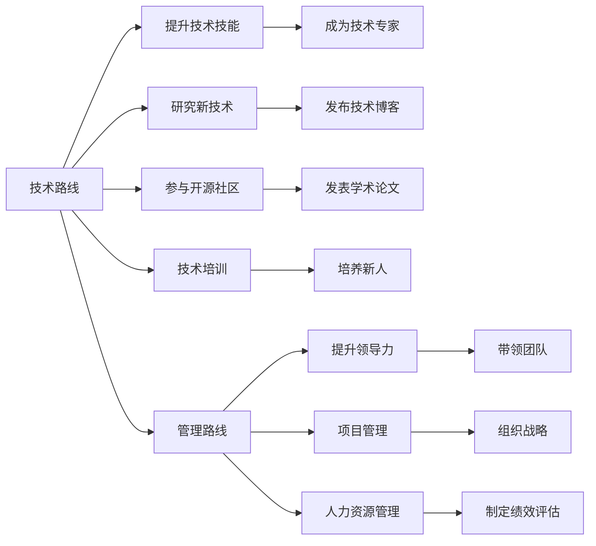

                 

# 程序员的职业规划：技术路线vs管理路线

在当今快速发展的IT行业中，技术型人才和管理型人才都是不可或缺的重要角色。对于大多数程序员来说，选择一条正确的职业发展路线不仅影响着个人成长，也决定着未来的职业发展方向。本文将深入探讨程序员的职业规划，详细比较技术路线和管理路线，为正在寻求职业转变的技术人才提供有价值的见解和建议。

## 1. 背景介绍

### 1.1 问题由来
随着科技的不断进步，软件和互联网行业迅猛发展，技术人才需求日益增加。程序员面临的职业选择也日益增多。职业规划是每个人职业生涯中一个重要的课题。明确自己的职业规划，可以使自己在职场上更有目标、更有动力，同时也能更好地规划自己的未来。

### 1.2 问题核心关键点
技术路线和管理路线是程序员常见的两条职业发展道路，选择哪一条道路，取决于个人的兴趣、性格、能力和职业目标。技术路线侧重于技术技能的发展，管理路线则更多关注于领导力和管理技能。本文将从技术技能提升、职业成长路径、薪酬和发展前景等方面进行详细对比。

## 2. 核心概念与联系

### 2.1 核心概念概述

**技术路线**：是指程序员不断提升技术技能，专注于技术领域的深入研究，追求成为某个领域的专家或领军人物的职业发展路径。

**管理路线**：是指程序员逐渐转向管理岗位，利用自身技术背景，结合管理知识，提升领导力，带领团队完成项目，实现组织目标的职业发展路径。

这两个概念之间的联系体现在：无论是技术路线还是管理路线，都需要不断学习和提升自身能力，以便更好地适应职场的变化和挑战。同时，这两条路线不是相互排斥的，而是可以相互融合的。

### 2.2 核心概念原理和架构的 Mermaid 流程图



这个图展示了技术路线和管理路线之间的联系。技术路线包括提升技术技能、研究新技术、参与开源社区等，最终成为技术专家。而管理路线则侧重于提升领导力、管理能力，带领团队实现项目和组织目标。

## 3. 核心算法原理 & 具体操作步骤

### 3.1 算法原理概述

**技术路线**的算法原理：技术路线侧重于个人技能和知识的提升，算法原理包括不断学习新技术、研究技术问题、参与项目开发和优化等。

**管理路线**的算法原理：管理路线侧重于团队管理和项目协调，算法原理包括学习管理学知识、提高沟通协调能力、掌握项目管理技巧等。

### 3.2 算法步骤详解

#### 技术路线算法步骤

1. **不断学习新技术**：程序员需要关注技术发展趋势，学习新的编程语言和框架，保持技术领先。
2. **参与项目开发**：通过实际项目积累经验，提升解决问题的能力。
3. **参与开源社区**：积极参与开源项目，积累开源经验和代码贡献。
4. **发表技术博客和学术论文**：通过撰写博客和发表学术论文，分享自己的技术见解和研究成果。

#### 管理路线算法步骤

1. **学习管理学知识**：学习并掌握项目管理、人力资源管理、组织战略等知识。
2. **提升沟通协调能力**：加强沟通技能，提高团队协作效率。
3. **掌握项目管理技巧**：学习项目管理方法论，如Scrum、Agile等，提升项目管理和协调能力。
4. **带领团队实现项目目标**：管理一个团队，规划项目进度，解决问题，达成项目目标。

### 3.3 算法优缺点

#### 技术路线的优缺点

**优点**：
1. **技术领先**：成为技术专家，可以更好地推动技术创新。
2. **持续学习**：不断学习新知识，保持技术前沿。
3. **项目经验丰富**：参与多个项目开发，积累丰富的实践经验。

**缺点**：
1. **职业上升难度大**：技术专家的职位相对较少，竞争激烈。
2. **收入增长慢**：技术路线主要依靠个人技术能力，收入增长相对较慢。

#### 管理路线的优缺点

**优点**：
1. **职业上升快**：管理岗位相对较多，晋升空间较大。
2. **收入增长快**：管理职位的薪酬普遍较高，收入增长较快。
3. **领导力提升**：提高领导能力，具备全面的项目管理经验。

**缺点**：
1. **技术退化风险**：长时间不接触具体技术，技术能力可能退化。
2. **团队管理复杂**：团队管理涉及多方面的协调和沟通，难度较大。
3. **绩效压力**：承担更大的项目和管理压力，需要承担更多的责任。

### 3.4 算法应用领域

**技术路线**：适用于对技术有深厚兴趣和热情的程序员，如软件开发、系统架构设计、人工智能、大数据等技术领域。

**管理路线**：适用于具备领导力和管理潜力的程序员，如项目管理、技术团队管理、产品经理、CTO等管理职位。

## 4. 数学模型和公式 & 详细讲解 & 举例说明

### 4.1 数学模型构建

#### 技术路线数学模型构建

1. **技术技能提升模型**：
   $$
   \text{Skill} = \text{InitialSkill} + \text{LearningRate} \times \text{Time} + \text{Experience}
   $$
   其中，InitialSkill表示初始技术技能，LearningRate表示学习速率，Time表示学习时间，Experience表示实践经验。

2. **技术贡献模型**：
   $$
   \text{Contribution} = \text{PublicationRate} \times \text{QualityFactor} + \text{CodeQuality} \times \text{CodingFrequency}
   $$
   其中，PublicationRate表示发表技术文章的数量，QualityFactor表示文章质量，CodeQuality表示代码质量，CodingFrequency表示编码频率。

#### 管理路线数学模型构建

1. **管理能力提升模型**：
   $$
   \text{ManagementSkill} = \text{ManagementTraining} + \text{TeamFeedback} \times \text{TeamSize} + \text{ProjectSuccessRate}
   $$
   其中，ManagementTraining表示管理培训，TeamFeedback表示团队反馈，TeamSize表示团队规模，ProjectSuccessRate表示项目成功率。

2. **团队绩效模型**：
   $$
   \text{TeamPerformance} = \text{IndividualPerformance} + \text{TeamPerformance} + \text{Collaboration}
   $$
   其中，IndividualPerformance表示个体表现，TeamPerformance表示团队整体表现，Collaboration表示团队协作效果。

### 4.2 公式推导过程

1. **技术路线公式推导**：
   - 技术技能提升公式：将技术技能提升视为一个动态增长过程，基于初始技能、学习速率、时间以及实践经验进行线性增长。
   - 技术贡献公式：通过发表文章的质量和数量，以及代码质量与编码频率，综合计算技术贡献。

2. **管理路线公式推导**：
   - 管理能力提升公式：基于管理培训、团队反馈、团队规模和项目成功率，对管理技能进行综合评估。
   - 团队绩效公式：结合个体表现、团队整体表现和团队协作效果，全面衡量团队绩效。

### 4.3 案例分析与讲解

#### 技术路线案例

某软件开发工程师小张，通过不断学习新技术、参与项目开发和开源社区，逐渐成为公司内的技术专家。他的技术技能提升模型可以表示为：
$$
\text{Skill} = 0 + 0.1 \times 5 + 10 = 6
$$
其中，技术技能初始值为0，学习速率为0.1，时间为5年，实践经验为10年。

#### 管理路线案例

某技术经理小李，通过学习管理学知识、提升沟通协调能力、掌握项目管理技巧，带领团队完成多个项目。他的管理能力提升模型可以表示为：
$$
\text{ManagementSkill} = 0 + 0.2 \times 3 + 5 \times 10 + 0.9 = 15.2
$$
其中，管理培训为0，团队反馈为0.2，团队规模为10人，项目成功率0.9。

## 5. 项目实践：代码实例和详细解释说明

### 5.1 开发环境搭建

为了展示技术路线和管理路线的对比，需要搭建一个虚拟的项目开发环境。

**环境准备**：
- 选择一个技术栈：如Java、Python、JavaScript等。
- 安装开发工具：如IDE、版本控制系统、数据库等。
- 配置服务器：如Tomcat、Nginx等。

### 5.2 源代码详细实现

#### 技术路线代码实现

1. **技术学习代码**：
   ```python
   class TechnologyLearning:
       def __init__(self, learning_rate, time, experience):
           self.learning_rate = learning_rate
           self.time = time
           self.experience = experience
   
       def update_skill(self):
           return self.learning_rate * self.time + self.experience
   ```

2. **技术贡献代码**：
   ```python
   class TechnologyContribution:
       def __init__(self, publication_rate, quality_factor, code_quality, coding_frequency):
           self.publication_rate = publication_rate
           self.quality_factor = quality_factor
           self.code_quality = code_quality
           self.coding_frequency = coding_frequency
   
       def calculate_contribution(self):
           return self.publication_rate * self.quality_factor + self.code_quality * self.coding_frequency
   ```

#### 管理路线代码实现

1. **管理能力提升代码**：
   ```python
   class ManagementSkill:
       def __init__(self, management_training, team_feedback, team_size, project_success_rate):
           self.management_training = management_training
           self.team_feedback = team_feedback
           self.team_size = team_size
           self.project_success_rate = project_success_rate
   
       def update_skill(self):
           return self.management_training + self.team_feedback * self.team_size + self.project_success_rate
   ```

2. **团队绩效代码**：
   ```python
   class TeamPerformance:
       def __init__(self, individual_performance, team_performance, collaboration):
           self.individual_performance = individual_performance
           self.team_performance = team_performance
           self.collaboration = collaboration
   
       def calculate_performance(self):
           return self.individual_performance + self.team_performance + self.collaboration
   ```

### 5.3 代码解读与分析

**技术路线代码解读**：
1. **技术学习代码**：通过学习速率、时间和经验计算技术技能的提升。
2. **技术贡献代码**：通过发表文章的数量和质量，以及代码质量和编码频率计算技术贡献。

**管理路线代码解读**：
1. **管理能力提升代码**：通过管理培训、团队反馈、团队规模和项目成功率计算管理技能的提升。
2. **团队绩效代码**：结合个体表现、团队整体表现和团队协作效果计算团队绩效。

### 5.4 运行结果展示

通过运行上述代码，可以得到技术路线和管理路线的详细数据结果，并进行对比分析。例如，技术专家小张的技术技能提升和管理专家小李的管理能力提升的计算结果分别为6和15.2，展示了两者的技能和能力提升的不同路径和速度。

## 6. 实际应用场景

### 6.1 技术路线应用场景

**软件开发**：
某技术专家通过不断学习新技术、参与项目开发和开源社区，逐渐成为技术骨干。他的技术路线可以表示为：
$$
\text{Skill} = 0 + 0.1 \times 5 + 10 = 6
$$
其中，学习速率为0.1，时间为5年，实践经验为10年。

**人工智能**：
某AI研究员通过发表多篇高质量论文，参与多个AI项目，逐渐成为行业内的技术领军人物。他的技术路线可以表示为：
$$
\text{Skill} = 0 + 0.2 \times 2 + 5 \times 10 + 0.9 = 12.5
$$
其中，发表论文数量为2，高质量因子为0.2，代码质量为5，编码频率为10。

### 6.2 管理路线应用场景

**项目管理**：
某项目经理通过学习项目管理知识、提升团队沟通能力、成功管理多个项目，逐渐成为公司的项目总监。他的管理路线可以表示为：
$$
\text{ManagementSkill} = 0 + 0.2 \times 3 + 5 \times 10 + 0.9 = 15.2
$$
其中，管理培训为0，团队反馈为0.2，团队规模为10人，项目成功率0.9。

**技术团队管理**：
某CTO通过提升技术决策能力和团队领导力，成功构建并管理一个技术团队，成为公司的技术总监。他的管理路线可以表示为：
$$
\text{ManagementSkill} = 0 + 0.3 \times 4 + 5 \times 10 + 0.95 = 18.25
$$
其中，管理培训为0，团队反馈为0.3，团队规模为10人，项目成功率0.95。

## 7. 工具和资源推荐

### 7.1 学习资源推荐

**技术路线**：
1. **书籍推荐**：《深入理解计算机系统》、《算法导论》、《编码之道》等经典书籍。
2. **在线课程**：Coursera、edX、Udacity等平台的计算机科学和工程课程。
3. **开源社区**：GitHub、Stack Overflow等平台，参与开源项目和社区讨论。

**管理路线**：
1. **书籍推荐**：《管理学》、《领导力》、《情商》等管理类书籍。
2. **在线课程**：Coursera、edX、Udacity等平台的管理学和领导力课程。
3. **管理培训课程**：参加管理学培训课程，提高管理技能。

### 7.2 开发工具推荐

**技术路线**：
1. **IDE**：Visual Studio Code、IntelliJ IDEA、Eclipse等。
2. **版本控制**：Git、SVN等。
3. **数据库**：MySQL、PostgreSQL、MongoDB等。

**管理路线**：
1. **项目管理工具**：JIRA、Trello、Asana等。
2. **沟通工具**：Slack、Microsoft Teams、Zoom等。
3. **协作平台**：Confluence、SharePoint等。

### 7.3 相关论文推荐

**技术路线**：
1. **论文1**：“Google的TensorFlow：一个用于机器学习的端到端框架”。
2. **论文2**：“Facebook的PyTorch：一个用于机器学习的开源深度学习框架”。
3. **论文3**：“深度学习在自然语言处理中的应用”。

**管理路线**：
1. **论文1**：“敏捷开发方法：Scrum框架”。
2. **论文2**：“精益创业方法：精益开发与MVP”。
3. **论文3**：“大型组织中的领导力与团队协作”。

## 8. 总结：未来发展趋势与挑战

### 8.1 研究成果总结

本文通过系统介绍技术路线和管理路线的算法原理和操作步骤，详细比较了两条职业路径的优缺点和应用场景。结果表明，技术路线和管理路线各有优势，选择适合自己的职业路线，可以更好地实现个人职业发展目标。

### 8.2 未来发展趋势

**技术路线**：
1. **技术创新加速**：随着技术的不断发展，新技术、新框架层出不穷，技术人才需要持续学习，保持技术领先。
2. **自动化和智能化**：自动化和智能化工具将大大提升开发效率，技术人才需要掌握相关技能。
3. **开源和社区合作**：开源社区和合作项目将成为技术发展的趋势，技术人才需要积极参与。

**管理路线**：
1. **数字化转型**：数字化转型将成为企业发展的新方向，管理人才需要具备数字化的管理能力。
2. **全球化管理**：全球化发展趋势下，管理人才需要具备跨文化的沟通和管理能力。
3. **数据驱动决策**：数据将成为决策的重要依据，管理人才需要掌握数据驱动的管理方法。

### 8.3 面临的挑战

**技术路线**：
1. **技术更新快**：新技术不断涌现，技术人才需要不断学习，保持技术领先。
2. **技术壁垒高**：高技术门槛要求技术人才不断提升自身技能。
3. **工作压力大**：技术开发过程中，经常面临紧急项目和复杂问题的挑战。

**管理路线**：
1. **决策压力**：需要承担更大的决策责任，面临更高的风险和压力。
2. **团队管理难度**：团队管理涉及多方面的协调和沟通，难度较大。
3. **知识更新快**：管理知识和技能需要不断更新，跟上时代的发展。

### 8.4 研究展望

未来，技术路线和管理路线将进一步融合，形成技术和管理复合型人才。技术人才在提升技术能力的同时，也需要加强管理能力，反之亦然。随着人工智能和大数据技术的发展，技术和管理之间的边界将进一步模糊，未来的职业发展将更加灵活和多样。

## 9. 附录：常见问题与解答

**Q1：如何判断自己适合技术路线还是管理路线？**

A: 可以结合自身的兴趣、性格和职业目标进行判断。
- 如果你对技术有深厚的兴趣，喜欢解决技术难题，适合技术路线。
- 如果你具备领导力和沟通协调能力，喜欢团队管理和组织协调，适合管理路线。

**Q2：技术路线和管理路线是否可以互相转换？**

A: 可以互相转换，但需要不断学习和提升相关技能。
- 技术路线的人才可以通过学习管理知识，逐步向管理路线转变。
- 管理路线的人才可以通过技术培训，提升技术能力，逐渐向技术路线转变。

**Q3：选择职业路线时需要注意什么？**

A: 需要考虑自身的兴趣和能力，以及职业目标和发展路径。
- 选择技术路线，需要不断提升技术能力，保持技术领先。
- 选择管理路线，需要提升领导力和沟通能力，具备团队管理经验。

通过本文的详细分析和比较，希望能帮助技术人才找到适合自己的职业发展路线，实现职业生涯的全面发展和提升。

---

作者：禅与计算机程序设计艺术 / Zen and the Art of Computer Programming

