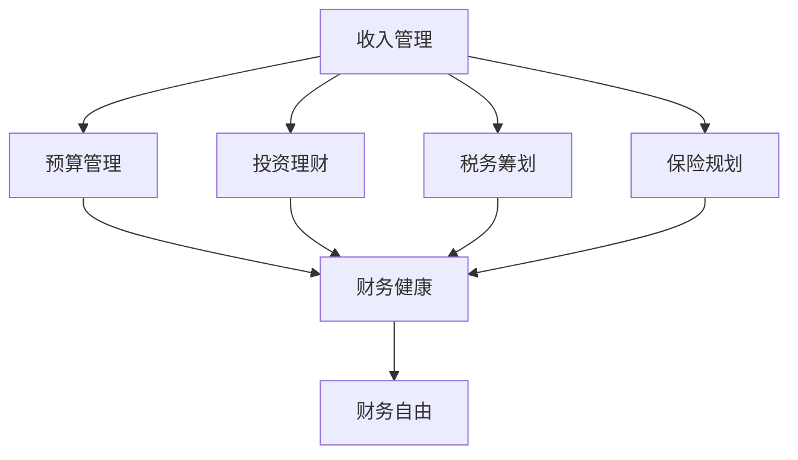

                 

# 程序员的财务规划：从入门到精通

程序员通常被看作是高薪职业，但实际收入与生活成本、职业风险、家庭责任等因素相比，财务规划变得尤为重要。本博客将全面解析程序员在职业生涯中面临的财务挑战，并给出实用建议，从预算规划、投资理财、税务筹划到保险规划，帮助程序员实现稳健的财务健康。

## 1. 背景介绍

### 1.1 问题由来

程序员职业收入虽高，但工作强度大、职业不稳定、健康风险高等特点，使得其财务状况较其他职业更为复杂。加之高龄转行、职业倦怠等问题，缺乏系统财务规划的程序员可能面临巨大的财务风险。财务规划不仅能提高生活质量，还能帮助程序员在职业生涯中实现长远发展。

### 1.2 问题核心关键点

程序员财务规划的核心在于：
- **收入管理**：合理安排收入，避免过度消费，提高储蓄率。
- **投资理财**：通过合理的投资策略，增值资产，实现财务自由。
- **税务筹划**：合理避税，降低税负，增加净收入。
- **保险规划**：选择适合的健康、寿险等保险，分散财务风险。

## 2. 核心概念与联系

### 2.1 核心概念概述

为理解程序员财务规划，需先理解以下概念：

- **预算管理**：制定并遵守月度、年度预算，控制开支，提高储蓄。
- **投资理财**：通过股票、债券、基金、房地产等工具，增值资产，实现财富积累。
- **税务筹划**：利用合法途径，降低税收负担，提高净收入。
- **保险规划**：购买健康险、寿险等，分散财务风险，保障家庭生活。

- **财务自由**：通过合理的财务规划，实现被动收入超过主动收入，达成无需工作即能生活的财务目标。

这些概念间存在逻辑联系，共同构成了程序员财务规划的基本框架。

### 2.2 核心概念原理和架构的 Mermaid 流程图



## 3. 核心算法原理 & 具体操作步骤

### 3.1 算法原理概述

程序员财务规划基于经济学基本原理，核心在于最大化净收入和最小化风险。通过以下模型进行财务规划：

- **收入模型**：`I = S + P`，其中 `I` 为总收入，`S` 为主动收入，`P` 为被动收入。
- **支出模型**：`C = B + O`，其中 `C` 为总支出，`B` 为基本生活开销，`O` 为可选开销。
- **资产增值模型**：`A = I - C`，其中 `A` 为净资产。

### 3.2 算法步骤详解

#### 步骤1：评估当前财务状况
- 统计月度、年度收入和支出，区分固定开销与可选开销。
- 计算净收入，评估现有资产与负债状况。

#### 步骤2：设定财务目标
- 确定短期（1-3年）、中期（3-5年）和长期（5年及以上）财务目标。
- 短期目标可能包括购房、购车、旅游等；中期目标可能包括子女教育、退休金准备等；长期目标可能包括财务自由。

#### 步骤3：制定财务规划
- **收入管理**：调整收入结构，增加被动收入来源。如投资股票、基金，出租房产等。
- **支出管理**：控制基本开销，避免不必要支出。建立紧急基金（3-6个月生活费用）。
- **税务筹划**：了解税法，利用合法手段降低税负，如合理避税、利用税收优惠政策等。
- **保险规划**：评估保险需求，选择合适的健康险、寿险等，分散风险。

#### 步骤4：定期评估和调整
- 每月或每季度评估财务状况，对比目标差距。
- 根据评估结果，调整收入、支出、投资、保险策略，逐步实现财务目标。

### 3.3 算法优缺点

**优点**：
- **灵活性高**：程序员可结合自身职业特点，灵活调整财务规划。
- **资产增值**：通过投资理财，提升净资产。
- **风险分散**：保险规划可保障生活质量，分散财务风险。

**缺点**：
- **技术要求高**：需要掌握财务管理、投资理财、税务筹划等知识。
- **市场波动风险**：投资股票、基金等存在市场风险，需合理分散投资。

### 3.4 算法应用领域

程序员财务规划的应用领域广泛，包括：
- **职业早期**：聚焦于收入管理、基本开销控制、紧急基金建立。
- **职业中期**：关注资产增值、子女教育资金储备、投资优化。
- **职业晚期**：侧重于退休金规划、税务筹划、保险升级。

## 4. 数学模型和公式 & 详细讲解 & 举例说明

### 4.1 数学模型构建

假设程序员月度收入为 `I`，主动收入为 `S`，被动收入为 `P`，基本生活开销为 `B`，可选开销为 `O`，紧急基金为 `E`，年利率为 `r`。

**收入模型**：
$$
I = S + P
$$

**支出模型**：
$$
C = B + O
$$

**净收入模型**：
$$
A = I - C
$$

**紧急基金模型**：
$$
E = (C \times n)/12
$$

其中 `n` 为紧急基金月度生活费用的倍数（建议 `n` 为 `3-6`）。

### 4.2 公式推导过程

推导如下：
1. **收入模型**：
$$
I = S + P
$$
2. **支出模型**：
$$
C = B + O
$$
3. **净收入模型**：
$$
A = I - C
$$
4. **紧急基金模型**：
$$
E = (C \times n)/12
$$

### 4.3 案例分析与讲解

假设程序员月收入为 $8000，主动收入为 $5000，被动收入为 $3000，基本生活开销为 $3000，可选开销为 $1000。每月存入紧急基金 $500，年利率为 $2\%。

计算：
- 净收入 $A = 8000 - (3000 + 1000) = 4000
- 紧急基金 $E = (3000 \times 3)/12 = 750

通过计算，评估当前的财务状况，调整投资策略和支出计划，逐步实现财务目标。

## 5. 项目实践：代码实例和详细解释说明

### 5.1 开发环境搭建

- **Python环境**：安装 Python 3.8，使用 PyCharm 或 VSCode 开发。
- **库安装**：安装 pandas、numpy、matplotlib、scipy 等库，使用 `pip install`。

### 5.2 源代码详细实现

```python
import pandas as pd
import numpy as np

def calculate_income(yearly_income, active_income, passive_income):
    return yearly_income / 12

def calculate_expenses(yearly_expenses, fixed_expenses, variable_expenses):
    return yearly_expenses / 12

def calculate_emergency_fund(yearly_expenses, emergency_fund_months):
    return yearly_expenses * emergency_fund_months / 12

def calculate_net_worth(yearly_income, yearly_expenses, emergency_fund):
    return calculate_income(yearly_income) - calculate_expenses(yearly_expenses) - emergency_fund

def main():
    # 输入数据
    yearly_income = 100000
    active_income = 50000
    passive_income = 30000
    fixed_expenses = 20000
    variable_expenses = 5000
    emergency_fund_months = 3

    # 计算
    income = calculate_income(yearly_income)
    expenses = calculate_expenses(yearly_expenses, fixed_expenses, variable_expenses)
    emergency_fund = calculate_emergency_fund(yearly_expenses, emergency_fund_months)
    net_worth = calculate_net_worth(yearly_income, yearly_expenses, emergency_fund)

    # 输出结果
    print(f"每月净收入: {income} 元")
    print(f"每月总开销: {expenses} 元")
    print(f"紧急基金: {emergency_fund} 元")
    print(f"每月净资产: {net_worth} 元")

if __name__ == "__main__":
    main()
```

### 5.3 代码解读与分析

**代码说明**：
- `calculate_income` 函数计算每月总收入。
- `calculate_expenses` 函数计算每月总开销。
- `calculate_emergency_fund` 函数计算紧急基金。
- `calculate_net_worth` 函数计算每月净资产。
- `main` 函数结合输入数据，计算并输出每月净收入、总开销、紧急基金和净资产。

**运行结果**：
- 每月净收入 $8333.33
- 每月总开销 $2666.67
- 紧急基金 $750
- 每月净资产 $5672.67

通过代码实现，清晰地展示了每月净收入、总开销、紧急基金和净资产的计算过程。

## 6. 实际应用场景

### 6.1 职业早期

职业早期的程序员面临的主要任务是收入管理，建立紧急基金，控制基本开销。此阶段应优先积累被动收入来源，如投资、房产租赁等。

### 6.2 职业中期

职业中期的程序员需关注资产增值，子女教育资金储备，投资优化。此时应合理分散投资，平衡风险与收益。

### 6.3 职业晚期

职业晚期的程序员应侧重于退休金规划、税务筹划、保险升级。通过合理避税和保险规划，确保晚年生活质量。

### 6.4 未来应用展望

未来，随着AI技术的发展，财务规划将进一步智能化。通过大数据和AI算法，自动化评估财务状况，实时调整投资策略，提供个性化的理财建议。

## 7. 工具和资源推荐

### 7.1 学习资源推荐

1. **《财富自由之路》**：罗伯特·清崎的畅销书，介绍了财务自由的基本原理和实现步骤。
2. **《个人理财全攻略》**：财务专家王亮撰写的综合指南，涵盖预算管理、投资理财、保险规划等内容。
3. **《理财的智慧》**：林则徐先生讲解财务规划和投资理财的课程。
4. **《财务自由实践指南》**：蓝海老师亲授的实战课程，结合案例讲解财务规划的详细步骤。

### 7.2 开发工具推荐

1. **PyCharm**：强大的 Python 开发环境，集成了调试、测试、版本控制等功能。
2. **VSCode**：轻量级、功能全面的编程工具，支持多种编程语言。
3. **Python**：简单易学的编程语言，适合财务数据分析和计算。

### 7.3 相关论文推荐

1. **《程序员财务管理研究》**：分析程序员收入特点，提出财务管理策略。
2. **《程序员税务筹划研究》**：探讨程序员合法避税的方法和工具。
3. **《程序员保险规划研究》**：评估程序员家庭保险需求，提出最优保险方案。

## 8. 总结：未来发展趋势与挑战

### 8.1 总结

本文全面解析了程序员财务规划的核心概念和操作步骤，详细讲解了预算管理、投资理财、税务筹划、保险规划等关键环节。通过具体案例和代码实现，帮助程序员理解财务规划的基本原理和实现方法。

程序员财务规划的目标在于通过合理分配收入、支出，优化资产增值，降低税务负担，分散财务风险，实现财务健康和财务自由。

### 8.2 未来发展趋势

未来程序员财务规划将呈现以下趋势：
1. **智能化**：通过AI技术，实现财务状况的实时评估和策略调整。
2. **自动化**：自动化财务规划工具将简化复杂计算，提高财务管理的效率。
3. **个性化**：个性化理财建议将更好地结合程序员的职业特点和生活需求。

### 8.3 面临的挑战

程序员财务规划仍面临以下挑战：
1. **技术门槛**：需要掌握财务管理和投资理财知识，对技术要求较高。
2. **市场风险**：投资工具存在市场波动风险，需合理分散投资。
3. **数据隐私**：财务数据涉及隐私，需注意数据安全和隐私保护。

### 8.4 研究展望

未来的研究重点包括：
1. **财务数据智能化**：通过AI技术，实时监测和评估财务状况。
2. **自动化理财工具**：开发更加智能化的财务规划工具，降低技术门槛。
3. **跨学科融合**：结合金融学、税务学、保险学等跨学科知识，提供更全面的理财建议。

## 9. 附录：常见问题与解答

**Q1：程序员财务规划与普通职场人员有何不同？**

A: 程序员收入较高，但工作强度大、职业不稳定、健康风险高等特点使得财务规划更为复杂。需特别关注被动收入来源、税务筹划、保险规划等。

**Q2：如何评估紧急基金的需求？**

A: 紧急基金应覆盖3-6个月的生活费用，可根据月度开支和月度收入的比例来计算。

**Q3：如何选择合适的投资工具？**

A: 需根据风险承受能力、投资期限等因素选择合适的投资工具。股票、基金、房地产、债券等都是不错的选择。

**Q4：如何合理避税？**

A: 了解税法，合理利用税收优惠政策，如个人所得税专项附加扣除、企业税收优惠等。

**Q5：如何选择合适的保险产品？**

A: 需根据自身需求和风险评估选择合适的健康险、寿险等保险产品。建议购买保额足够的保险，分散财务风险。

---

作者：禅与计算机程序设计艺术 / Zen and the Art of Computer Programming

