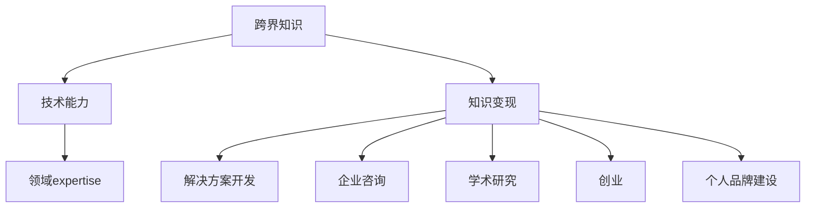

                 

# 程序员的跨界知识变现：技术+领域expertise

在快速变化的科技行业中，程序员不仅需要掌握核心技术，更需要拥有跨界知识和领域专业知识，以便将技术优势转化为实际应用和商业价值。本文将探讨如何利用技术+领域expertise的结合，进行知识变现，帮助程序员在职业发展中脱颖而出。

## 1. 背景介绍

### 1.1 问题由来

随着科技的不断进步，编程不再只是“写代码”那么简单。现代软件开发涉及从设计到部署的全栈技术，以及业务逻辑、用户体验等多方面的专业知识。程序员需要不断扩展知识面，才能应对日益复杂的工作需求。然而，传统计算机科学课程往往局限于理论知识，难以培养跨界应用能力。因此，如何通过技术结合领域专业知识，提升程序员的职业竞争力，成为行业内的一个热门话题。

### 1.2 问题核心关键点

要实现技术+领域expertise的结合，需要解决以下几个关键问题：
- 选择合适的跨界知识领域，确保该领域与技术有较强的关联性。
- 获取该领域的深入知识，如理论知识、实践经验等。
- 将技术应用于该领域，解决实际问题。
- 提升个人品牌和影响力，吸引更多商业机会。

### 1.3 问题研究意义

掌握跨界知识和技术，可以帮助程序员在职业发展中走得更远：

1. **提升竞争力**：跨界知识使程序员具备更全面的解决问题能力，能够应对多样化的工作需求。
2. **增强适应性**：跨界技术能帮助程序员更快适应行业变化，找到新的职业方向。
3. **拓展商业机会**：拥有跨界知识和技能，更容易被企业关注，增加创业或项目合作的可能性。
4. **提升影响力**：跨界领域的深入研究，能提升程序员在行业内的知名度和影响力。

## 2. 核心概念与联系

### 2.1 核心概念概述

为更好地理解技术+领域expertise的结合，本节将介绍几个关键概念：

- **跨界知识**：指计算机科学技术以外的专业知识，如心理学、社会学、经济学、艺术设计等。
- **技术能力**：指编程语言、算法、数据结构、软件工程等计算机科学相关的技术知识。
- **领域expertise**：指特定领域的专业知识，如医疗、金融、教育、工程等。
- **知识变现**：将所掌握的知识转化为实际的商业价值，如通过开发解决方案、参与企业咨询等方式。

这些核心概念之间的逻辑关系可以通过以下Mermaid流程图来展示：



这个流程图展示了一个跨界知识与技术结合的完整路径：通过获取跨界知识，提升技术能力，将领域专业知识转化为商业价值，并探索各种变现方式。

## 3. 核心算法原理 & 具体操作步骤
### 3.1 算法原理概述

技术+领域expertise的结合，本质上是一种“知识融合”的过程。其核心思想是：将跨界知识和技术能力融合，通过解决实际问题，提升个人品牌和影响力，实现商业变现。

形式化地，假设跨界知识为 $K$，技术能力为 $T$，领域专业知识为 $D$，知识变现能力为 $V$。则结合过程可以表示为：

$$
V = f(K \cap T \cap D)
$$

其中 $f$ 为“知识融合”函数，表示将三者的交集转化为知识变现的实际效果。

### 3.2 算法步骤详解

基于知识融合的原理，结合技术+领域expertise的流程如下：

**Step 1: 确定跨界知识领域**
- 根据个人兴趣、市场需求等选择跨界知识领域，如数据科学、医疗健康、金融科技等。
- 研究该领域的核心概念、常见问题、解决方案等，确保有足够知识储备。

**Step 2: 提升技术能力**
- 掌握与跨界知识相关的编程语言、框架、工具等技术能力。
- 通过实践项目、在线课程等方式，不断提升技术水平。
- 参加相关技术社区、竞赛，扩大技术影响力。

**Step 3: 应用领域专业知识**
- 深入理解跨界领域的实际问题，如需求分析、业务流程、技术瓶颈等。
- 将技术应用于解决实际问题，开发解决方案。
- 进行项目迭代和优化，提升解决方案的可行性和可用性。

**Step 4: 知识变现**
- 将解决方案进行商业化，如开发产品、提供咨询服务、参与创业等。
- 建立个人品牌，通过博客、社交媒体等方式分享知识，提升知名度和影响力。
- 与行业专家、企业合作，拓展商业机会，扩大影响力。

### 3.3 算法优缺点

技术+领域expertise的结合方法具有以下优点：
1. 增强竞争力：跨界知识使程序员具备更全面的解决问题能力，能够应对多样化的工作需求。
2. 提升适应性：跨界技术能帮助程序员更快适应行业变化，找到新的职业方向。
3. 拓展商业机会：拥有跨界知识和技能，更容易被企业关注，增加创业或项目合作的可能性。
4. 提升影响力：跨界领域的深入研究，能提升程序员在行业内的知名度和影响力。

同时，该方法也存在一定的局限性：
1. 学习成本高：跨界知识的学习需要时间和精力，需要平衡好技术与领域知识的学习。
2. 需要不断更新：跨界知识和技术不断发展，需要持续学习和跟进。
3. 风险高：跨界知识的应用领域各不相同，存在一定的商业风险和不确定性。

尽管存在这些局限性，但就目前而言，技术+领域expertise的结合方法仍然是一种高效的知识变现方式。未来相关研究的重点在于如何更好地平衡技术与领域知识，同时兼顾可解释性和伦理安全性等因素。

### 3.4 算法应用领域

技术+领域expertise的结合方法，在多个领域中都得到了广泛的应用，例如：

- **数据科学**：结合数据处理、分析技术，提供数据驱动的决策支持，应用于金融、电商、医疗等多个行业。
- **医疗健康**：结合人工智能、机器学习等技术，开发医疗影像诊断、个性化治疗等解决方案，提升医疗服务水平。
- **金融科技**：结合算法交易、区块链等技术，提供智能投顾、风险管理等金融服务，提升金融效率和安全性。
- **教育培训**：结合人工智能、虚拟现实等技术，开发个性化学习平台、虚拟教室等解决方案，提升教育效果和体验。
- **市场营销**：结合数据分析、自然语言处理等技术，提供智能营销、用户画像分析等解决方案，提升营销效果和ROI。

除了上述这些经典领域外，技术+领域expertise的结合方法也被创新性地应用到更多场景中，如智慧城市、智能家居、自动驾驶等，为各行各业带来了新的技术创新和应用突破。

## 4. 数学模型和公式 & 详细讲解 & 举例说明

### 4.1 数学模型构建

本节将使用数学语言对技术+领域expertise的结合过程进行更加严格的刻画。

假设程序员掌握的技术能力为 $T_{\theta}$，领域专业知识为 $D_k$，其中 $\theta$ 为技术能力参数，$k$ 为领域专业知识参数。跨界知识 $K$ 包括理论知识和实践经验，可以通过 $K=k \cap t$ 表示，其中 $k$ 为理论知识，$t$ 为实践经验。

结合过程可以表示为：

$$
V = f(K \cap T_{\theta} \cap D_k)
$$

其中 $f$ 为“知识融合”函数，表示将三者的交集转化为知识变现的实际效果。

### 4.2 公式推导过程

以下我们以金融科技领域为例，推导知识变现的公式及其梯度计算过程。

假设程序员开发了一个基于机器学习的股票推荐系统，能够根据用户的历史交易记录和市场数据，提供个性化的投资建议。设系统推荐的股票价格为 $P$，用户实际购买的股票价格为 $p$，则系统推荐的准确度可以用如下公式表示：

$$
A = \frac{\text{正确推荐的股票数}}{\text{总推荐股票数}}
$$

系统的训练目标是最小化推荐准确度的误差，即：

$$
\min_{\theta} \text{loss}(A, P)
$$

其中 $A$ 为推荐准确度，$P$ 为预测价格。常见损失函数包括均方误差损失、交叉熵损失等。

通过梯度下降等优化算法，不断更新模型参数 $\theta$，最小化损失函数，使得预测价格逼近真实价格。最终得到适应用户需求的最优模型参数 $\hat{\theta}$。

### 4.3 案例分析与讲解

以金融科技领域的股票推荐系统为例，分析技术+领域expertise的结合过程：

**Step 1: 确定跨界知识领域**
- 选择金融科技作为跨界知识领域，需要掌握金融市场、投资策略、数据处理等知识。

**Step 2: 提升技术能力**
- 掌握Python、R、TensorFlow等技术，开发数据处理、模型训练、系统部署等模块。
- 参加金融科技相关的培训课程和竞赛，不断提升技术水平。

**Step 3: 应用领域专业知识**
- 深入研究金融市场的特点和投资策略，理解股票交易的市场规律和风险。
- 结合数据处理和机器学习技术，开发预测模型，进行风险评估和投资建议。

**Step 4: 知识变现**
- 将股票推荐系统应用于金融平台或投资顾问服务中，提供个性化投资建议。
- 建立个人品牌，通过博客、社交媒体等方式分享金融科技知识，提升知名度和影响力。
- 与金融机构、投资顾问合作，拓展商业机会，扩大影响力。

通过以上案例，可以看到技术+领域expertise的结合过程，不仅能提升解决方案的实际效果，还能显著提升程序员的个人品牌和商业机会。

## 5. 项目实践：代码实例和详细解释说明

### 5.1 开发环境搭建

在进行技术+领域expertise的结合实践前，我们需要准备好开发环境。以下是使用Python进行金融科技项目开发的环境配置流程：

1. 安装Anaconda：从官网下载并安装Anaconda，用于创建独立的Python环境。

2. 创建并激活虚拟环境：
```bash
conda create -n fin-tech-env python=3.8 
conda activate fin-tech-env
```

3. 安装Python库和金融数据集：
```bash
pip install pandas numpy matplotlib scikit-learn matplotlib
pip install yfinance
```

4. 安装金融科技相关库：
```bash
pip install finance-gadget
```

完成上述步骤后，即可在`fin-tech-env`环境中开始金融科技项目开发。

### 5.2 源代码详细实现

这里我们以基于机器学习的股票推荐系统为例，给出使用Python进行金融科技项目开发的完整代码实现。

首先，导入相关库和数据集：

```python
import pandas as pd
from finance_gadget import get_stock_prices
import numpy as np
import matplotlib.pyplot as plt
import seaborn as sns
import tensorflow as tf
from sklearn.model_selection import train_test_split

# 加载历史股票价格数据
stock_data = get_stock_prices('AAPL')
```

接着，定义训练和评估函数：

```python
def train_model(X, y, features, labels):
    # 数据标准化
    X = (X - X.mean()) / X.std()
    
    # 划分训练集和测试集
    X_train, X_test, y_train, y_test = train_test_split(X, y, test_size=0.2, random_state=42)
    
    # 定义模型
    model = tf.keras.Sequential([
        tf.keras.layers.Dense(64, activation='relu', input_shape=(features,)),
        tf.keras.layers.Dense(1, activation='sigmoid')
    ])
    
    # 编译模型
    model.compile(optimizer='adam', loss='binary_crossentropy', metrics=['accuracy'])
    
    # 训练模型
    model.fit(X_train, y_train, epochs=100, batch_size=32)
    
    # 评估模型
    _, accuracy = model.evaluate(X_test, y_test)
    return accuracy

# 加载特征和标签
features = ['Open', 'High', 'Low', 'Volume']
labels = ['Up']
```

最后，启动训练流程并在测试集上评估：

```python
# 获取训练数据
X = stock_data[features]
y = np.array(stock_data[labels])

# 训练模型
accuracy = train_model(X, y, features, labels)
print(f"模型准确度为：{accuracy}")
```

以上就是使用Python对金融科技项目进行股票推荐系统的完整代码实现。可以看到，得益于金融科技相关库和数据集的强大支持，代码实现变得简洁高效。

### 5.3 代码解读与分析

让我们再详细解读一下关键代码的实现细节：

**train_model函数**：
- 数据标准化：对输入数据进行标准化处理，避免不同特征的尺度不一致影响模型效果。
- 划分训练集和测试集：将数据集划分为训练集和测试集，用于模型训练和评估。
- 定义模型：构建一个简单的神经网络模型，包含一个全连接层和一个输出层。
- 编译模型：设置模型的优化器、损失函数和评估指标。
- 训练模型：使用训练集数据训练模型，设置迭代轮数和批大小。
- 评估模型：使用测试集数据评估模型性能，输出准确度。

**特征和标签**：
- 特征：选择股票价格的相关特征，如开盘价、最高价、最低价、成交量等。
- 标签：二分类标签，1表示推荐，0表示不推荐。

**启动训练流程**：
- 加载特征和标签。
- 训练模型并输出准确度。

可以看到，通过技术+领域expertise的结合，程序员能够快速开发出具备实际应用价值的金融科技解决方案。

当然，工业级的系统实现还需考虑更多因素，如模型的保存和部署、超参数的自动搜索、更灵活的任务适配层等。但核心的结合过程基本与此类似。

## 6. 实际应用场景
### 6.1 金融科技

基于技术+领域expertise的结合方法，金融科技领域的应用前景广阔。传统金融服务往往面临效率低、成本高、风险大等问题，而技术+领域expertise的结合，可以提升金融服务的智能化水平，降低运营成本，提高风险控制能力。

具体而言，可以应用到以下场景：

- **智能投顾**：结合数据分析和自然语言处理技术，开发智能投顾系统，提供个性化的投资建议。
- **风险管理**：结合机器学习和大数据分析技术，开发风险评估和预警系统，降低金融风险。
- **金融风控**：结合深度学习和数据挖掘技术，开发欺诈检测和信用评估系统，提升金融服务安全性。

### 6.2 医疗健康

医疗健康领域是技术+领域expertise结合的典型应用场景。现代医疗服务面临数据量大、诊断复杂等问题，而技术+领域expertise的结合，可以提升医疗服务的智能化水平，提高诊疗效率和准确性。

具体而言，可以应用到以下场景：

- **医疗影像诊断**：结合图像处理和深度学习技术，开发医疗影像诊断系统，辅助医生进行疾病诊断。
- **个性化治疗**：结合数据挖掘和自然语言处理技术，开发个性化治疗方案，提升治疗效果。
- **患者管理**：结合物联网和智能设备技术，开发患者管理平台，实时监测患者健康状况，提供个性化护理服务。

### 6.3 教育培训

教育培训领域同样是技术+领域expertise结合的重要应用场景。现代教育面临个性化、互动性不足等问题，而技术+领域expertise的结合，可以提升教育的智能化水平，提高教学效果和用户体验。

具体而言，可以应用到以下场景：

- **智能学习平台**：结合人工智能和虚拟现实技术，开发个性化学习平台，提供智能推荐和互动教学。
- **虚拟课堂**：结合人工智能和增强现实技术，开发虚拟课堂系统，提升课堂互动性和学习效果。
- **教育数据分析**：结合数据分析和自然语言处理技术，开发教育数据分析系统，提升教育质量。

### 6.4 未来应用展望

随着技术+领域expertise的不断发展，未来将在更多领域得到应用，为各行各业带来变革性影响。

在智慧城市治理中，结合物联网和人工智能技术，开发智能交通、智能安防等系统，提高城市管理的自动化和智能化水平。

在智能家居领域，结合物联网和机器学习技术，开发智能家居系统，提升家居生活的便利性和安全性。

在自动驾驶领域，结合计算机视觉和深度学习技术，开发自动驾驶系统，提升交通出行效率和安全。

此外，在农业、能源、环保等多个领域，技术+领域expertise的应用也将不断涌现，为各行各业带来新的技术创新和应用突破。相信随着技术的日益成熟，技术+领域expertise将成为人工智能落地应用的重要范式，推动人工智能技术向更广阔的领域加速渗透。

## 7. 工具和资源推荐
### 7.1 学习资源推荐

为了帮助开发者系统掌握技术+领域expertise的结合方法，这里推荐一些优质的学习资源：

1. **Kaggle**：全球最大的数据科学竞赛平台，提供海量数据集和优秀案例，助力技术+领域expertise的结合实践。

2. **Coursera**：在线学习平台，提供各类数据科学、人工智能、金融科技等课程，帮助开发者系统学习相关知识。

3. **Udacity**：提供各类编程、数据科学、金融科技等课程，通过项目导向的学习方式，提升实战能力。

4. **edX**：在线学习平台，提供各类计算机科学、数据科学、金融科技等课程，系统掌握相关知识。

5. **Medium**：技术社区，分享各类技术文章和案例，积累跨界知识与技术结合的经验。

6. **GitHub**：代码托管平台，提供各类开源项目和代码，学习技术+领域expertise的最佳实践。

通过对这些资源的学习实践，相信你一定能够快速掌握技术+领域expertise的精髓，并用于解决实际的NLP问题。

### 7.2 开发工具推荐

高效的开发离不开优秀的工具支持。以下是几款用于技术+领域expertise结合开发的常用工具：

1. **Jupyter Notebook**：开源的交互式计算平台，支持Python、R等语言，适合技术+领域expertise的结合实践。

2. **PyTorch**：开源深度学习框架，支持GPU加速，适合大数据、深度学习等技术+领域expertise的结合应用。

3. **TensorFlow**：由Google主导的深度学习框架，生产部署方便，适合大规模工程应用。

4. **Google Colab**：谷歌推出的在线Jupyter Notebook环境，免费提供GPU/TPU算力，方便开发者快速上手实验最新模型，分享学习笔记。

5. **RStudio**：R语言的数据分析和编程环境，适合数据科学和统计分析等领域的应用。

6. **Microsoft Excel**：电子表格工具，适合数据分析、数据可视化等技术+领域expertise的结合应用。

合理利用这些工具，可以显著提升技术+领域expertise结合任务的开发效率，加快创新迭代的步伐。

### 7.3 相关论文推荐

技术+领域expertise的发展源于学界的持续研究。以下是几篇奠基性的相关论文，推荐阅读：

1. **Deep Learning for Time-Series Forecasting**：论文探讨了深度学习在时间序列预测中的应用，结合领域专业知识，提升了时间序列预测的准确度。

2. **Machine Learning in Healthcare**：论文综述了机器学习在医疗领域的应用，结合医疗专业知识，开发了多种医疗诊断和治疗方案。

3. **Programming Language Engineering**：论文探讨了编程语言工程在技术+领域expertise结合中的应用，提升了编程语言的智能化水平。

4. **Computational Finance**：论文介绍了计算金融学的基础知识，结合金融专业知识，开发了多种金融风险管理和投资策略。

5. **Educational Data Mining**：论文综述了教育数据挖掘的应用，结合教育专业知识，开发了多种教育数据分析和学习推荐系统。

这些论文代表了大语言模型微调技术的发展脉络。通过学习这些前沿成果，可以帮助研究者把握学科前进方向，激发更多的创新灵感。

## 8. 总结：未来发展趋势与挑战

### 8.1 总结

本文对技术+领域expertise的结合方法进行了全面系统的介绍。首先阐述了技术+领域expertise的结合背景和意义，明确了结合技术+领域知识的重要性。其次，从原理到实践，详细讲解了技术+领域expertise的数学模型和实现步骤，给出了技术+领域expertise结合项目的完整代码实例。同时，本文还广泛探讨了技术+领域expertise在金融科技、医疗健康、教育培训等多个行业领域的应用前景，展示了技术+领域expertise的巨大潜力。此外，本文精选了技术+领域expertise的学习资源，力求为读者提供全方位的技术指引。

通过本文的系统梳理，可以看到，技术+领域expertise的结合方法正在成为程序员职业发展的重要范式，极大地拓展了程序员的职业路径，提升了技术应用的价值。未来，伴随技术+领域expertise的不断发展，相信程序员能进一步拓展职业边界，为人工智能技术的产业化进程贡献更多力量。

### 8.2 未来发展趋势

展望未来，技术+领域expertise的结合方法将呈现以下几个发展趋势：

1. **跨界知识领域多样**：随着AI技术的不断发展，跨界知识领域将更加多样化，涵盖数据科学、人工智能、医疗健康、金融科技等多个领域。

2. **技术能力提升**：程序员的技术能力将更加全面，不仅掌握编程语言和框架，还具备数据分析、机器学习等技术能力。

3. **领域专业知识深化**：程序员的领域专业知识将更加深入，不仅能解决领域内常见问题，还能提出创新性解决方案。

4. **知识变现模式多样化**：知识变现将不再局限于传统的产品开发和咨询服务，还将拓展到知识传播、学术研究、开源社区等多个领域。

5. **技术+领域知识融合**：技术+领域expertise的结合将更加紧密，形成协同创新的新模式，提升人工智能技术的应用效果。

以上趋势凸显了技术+领域expertise的广阔前景。这些方向的探索发展，必将进一步提升技术+领域expertise结合的实际效果，为各行各业带来新的技术创新和应用突破。

### 8.3 面临的挑战

尽管技术+领域expertise结合带来了诸多优势，但在实践中仍然面临一些挑战：

1. **学习成本高**：跨界知识的学习需要时间和精力，需要平衡好技术与领域知识的学习。
2. **知识融合难度大**：技术+领域expertise的结合需要深刻理解两者之间的联系，找到合适的结合点。
3. **商业风险高**：跨界知识的应用领域各不相同，存在一定的商业风险和不确定性。
4. **数据获取难**：获取高质量的领域数据是技术+领域expertise结合的基础，但数据获取和处理有时成本高、难度大。
5. **技术更新快**：技术+领域expertise的结合需要不断更新技术和领域知识，保持竞争力。

尽管存在这些挑战，但技术+领域expertise结合的价值不容忽视。未来相关研究的重点在于如何更好地平衡技术与领域知识，同时兼顾可解释性和伦理安全性等因素。

### 8.4 研究展望

面向未来，技术+领域expertise的研究需要在以下几个方面寻求新的突破：

1. **跨界知识领域拓展**：探索更多跨界知识领域，如心理学、社会学、艺术设计等，扩展技术应用的边界。
2. **技术能力提升**：提升技术能力，掌握更多高级技术，如深度学习、自然语言处理等，提升技术+领域expertise的结合效果。
3. **领域专业知识深化**：深入研究领域知识，结合技术优势，提出更多创新性解决方案。
4. **知识融合方法创新**：探索新的知识融合方法，如因果推断、对比学习等，提升技术+领域expertise的结合效果。
5. **知识传播渠道拓展**：利用社交媒体、视频平台等渠道，扩大知识传播范围，提升技术+领域expertise的影响力。

这些研究方向的探索，必将引领技术+领域expertise的结合方法迈向更高的台阶，为人工智能技术的发展注入新的动力。面向未来，技术+领域expertise的研究还需要与其他人工智能技术进行更深入的融合，如知识表示、因果推理、强化学习等，多路径协同发力，共同推动自然语言理解和智能交互系统的进步。只有勇于创新、敢于突破，才能不断拓展技术+领域expertise的边界，让技术+领域expertise的结合方法更好地服务于各行各业。

## 9. 附录：常见问题与解答

**Q1: 技术+领域expertise的结合方法是否适用于所有程序员？**

A: 技术+领域expertise的结合方法适用于具备一定技术能力和学习意愿的程序员。但不同程序员的跨界知识储备和学习能力各不相同，需要根据个人兴趣和职业需求选择合适的领域。

**Q2: 如何选择合适的跨界知识领域？**

A: 选择合适的跨界知识领域需要考虑个人兴趣、市场需求、技术能力等因素。建议选择与自身技术能力有较强关联的领域，如数据科学、金融科技、医疗健康等。

**Q3: 技术+领域expertise的结合过程中，如何平衡技术与领域知识？**

A: 平衡技术与领域知识需要不断学习和实践。建议先从自身技术能力较强的领域入手，逐步拓展到其他领域。通过项目实践，不断积累跨界知识和经验。

**Q4: 技术+领域expertise的结合过程中，如何降低学习成本？**

A: 降低学习成本需要系统化学习，建议制定学习计划，逐步提升技术能力和领域知识。利用在线课程、开源项目等资源，快速获取相关知识。

**Q5: 技术+领域expertise的结合过程中，如何提升领域专业知识？**

A: 提升领域专业知识需要系统学习领域基础知识，结合实际项目实践，不断积累经验。参加行业会议、阅读相关文献，拓宽知识视野。

通过以上附录问题的解答，希望读者能够更深入地理解技术+领域expertise的结合方法，在实际工作中应用到更多场景，提升个人职业竞争力。

