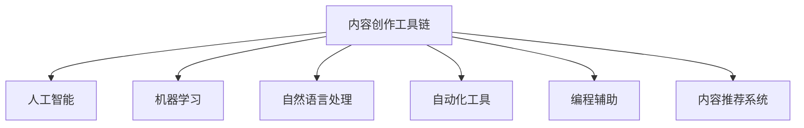

                 

# 程序员知识付费的内容创作工具链

> 关键词：程序员知识付费,内容创作工具链,人工智能,机器学习,自然语言处理,自动化,编程辅助

## 1. 背景介绍

### 1.1 问题由来
在知识付费行业快速发展的同时，如何高效产出有价值、有吸引力的内容，成为了内容创作者面临的重大挑战。传统的手动创作方式不仅效率低下，且无法充分利用数据的价值，难以适应激烈的市场竞争。因此，利用人工智能和自动化技术，构建高效、智能的内容创作工具链，成为了内容创作者的新选择。

### 1.2 问题核心关键点
本文聚焦于基于人工智能技术的内容创作工具链，旨在提升内容创作效率，丰富内容形式，降低创作门槛，从而提高知识付费平台的内容质量和用户粘性。

### 1.3 问题研究意义
构建内容创作工具链，对于推动知识付费行业的健康发展，提升内容产出效率和质量，具有重要意义：

1. 降低内容创作门槛。通过自动化工具，简化复杂的操作步骤，让更多人有机会成为内容创作者，从而扩大内容来源，丰富平台内容。
2. 提升内容创作效率。利用机器学习和大数据技术，自动生成内容草稿，显著缩短内容产出周期。
3. 优化内容创作效果。借助自然语言处理和深度学习技术，自动优化内容质量，提高内容的可读性和吸引力。
4. 增强内容个性和差异化。通过个性化推荐和生成技术，根据用户偏好和需求，生成更具针对性和创意的内容。
5. 实时监测和反馈。利用自动化监控和反馈系统，及时调整创作策略，保持内容与市场需求的一致性。

## 2. 核心概念与联系

### 2.1 核心概念概述

为更好地理解基于人工智能的内容创作工具链，本节将介绍几个密切相关的核心概念：

- 内容创作工具链：由一系列自动化工具和系统组成，通过机器学习、自然语言处理等技术，辅助内容创作者进行高效、高质量的内容产出。
- 人工智能(AI)：通过模拟人类智能行为，让计算机能够理解和执行复杂的任务。
- 机器学习(ML)：让计算机通过学习历史数据，自动提高在特定任务上的表现。
- 自然语言处理(NLP)：让计算机理解和生成自然语言，支持文本分析、生成、翻译等功能。
- 自动化工具：通过编程或脚本，自动执行复杂任务的工具。
- 编程辅助：通过AI技术，辅助程序员编写高效、健壮的代码。
- 内容推荐系统：根据用户行为和偏好，推荐相关内容的系统。

这些核心概念之间的逻辑关系可以通过以下Mermaid流程图来展示：



这个流程图展示的内容创作工具链的关键组件及其之间的关系：

1. 内容创作工具链由多个组件组成，包括人工智能、机器学习、自然语言处理、自动化工具、编程辅助和内容推荐系统。
2. 这些组件互相配合，共同完成内容创作、分析和推荐。
3. 人工智能和机器学习负责理解和生成内容，自然语言处理负责文本分析和生成，自动化工具和编程辅助用于提升创作效率，内容推荐系统则根据用户行为推荐相关内容。

## 3. 核心算法原理 & 具体操作步骤
### 3.1 算法原理概述

基于人工智能的内容创作工具链，本质上是一种智能化的内容生产系统。其核心思想是：通过自动化的工具链，将人工智能技术应用于内容创作过程，提高内容产出的效率和质量。

形式化地，假设内容创作过程由以下几个步骤组成：
1. 数据采集：从多种渠道获取素材和数据。
2. 内容生成：利用人工智能技术，自动生成内容草稿。
3. 内容优化：通过自然语言处理技术，自动优化内容质量和可读性。
4. 内容审核：利用自动化工具，进行内容质量检测和审核。
5. 内容发布：将合格内容发布到知识付费平台。

内容创作工具链的目标是最小化每个步骤的时间和成本，最大化内容的价值和用户体验。

### 3.2 算法步骤详解

基于人工智能的内容创作工具链一般包括以下几个关键步骤：

**Step 1: 数据采集**
- 从网页、社交媒体、新闻源等渠道自动采集数据。
- 通过网络爬虫、API接口等方式，收集大量原始数据。
- 对采集到的数据进行去重、清洗和预处理，确保数据质量。

**Step 2: 内容生成**
- 利用预训练语言模型，自动生成内容草稿。
- 可以基于主题、关键词、用户偏好等信息，生成相关内容。
- 在内容生成的过程中，可以结合个性化推荐系统，动态生成不同用户感兴趣的内容。

**Step 3: 内容优化**
- 通过自然语言处理技术，自动进行语法检查、拼写修正、风格转换等优化操作。
- 使用语言模型进行自动摘要、段落划分、标题生成等操作，提升内容的可读性和结构性。
- 引入情感分析技术，自动调整文章的情绪色彩，增强用户共鸣。

**Step 4: 内容审核**
- 利用自然语言处理和机器学习技术，自动检测内容是否含有违法、有害信息。
- 通过关键词过滤、句法分析等方式，识别敏感词汇和语法错误。
- 设置自动审核机制，及时发现和修正不当内容。

**Step 5: 内容发布**
- 自动将合格内容发布到知识付费平台，推送给目标用户。
- 利用用户行为数据，动态调整内容推荐策略，提高内容的曝光率和点击率。
- 引入数据分析和反馈系统，实时监测用户反馈，不断优化内容质量和发布策略。

以上是基于人工智能的内容创作工具链的一般流程。在实际应用中，还需要针对具体内容类型，对各步骤进行优化设计，如改进数据采集策略，引入更多自然语言处理技术，搜索最优的内容生成模型等，以进一步提升创作效率和效果。

### 3.3 算法优缺点

基于人工智能的内容创作工具链具有以下优点：
1. 高效快捷。自动化工具可以显著缩短内容创作周期，适应快节奏的市场需求。
2. 规模可控。内容创作工具链可以根据平台需求，灵活扩展或缩减内容产出规模。
3. 成本节约。利用自动化和机器学习技术，降低人工干预的依赖，降低内容创作成本。
4. 质量保证。通过自动化的内容优化和审核，提高内容的规范性和质量。
5. 个性化定制。借助机器学习技术，能够根据用户行为和偏好，生成更具吸引力的内容。

同时，该工具链也存在一定的局限性：
1. 依赖技术水平。内容创作工具链的效果很大程度上取决于所采用的技术和算法，需要持续迭代和优化。
2. 数据质量要求高。采集到的数据质量和准确性直接影响内容创作的准确性和相关性。
3. 内容多样性有限。自动生成的内容可能过于单一，缺乏个性化和创意性。
4. 人类情感无法替代。机器学习难以完全理解人类的情感和复杂心理，生成的内容可能缺乏真实感和共鸣。
5. 隐私保护问题。内容创作和发布过程中可能涉及用户隐私，需要严格遵守数据保护法律法规。

尽管存在这些局限性，但就目前而言，基于人工智能的内容创作工具链仍然是内容创作的主要趋势。未来相关研究的重点在于如何进一步提高工具链的技术水平，增强内容的个性化和情感化，同时兼顾隐私保护和数据质量等因素。

### 3.4 算法应用领域

基于人工智能的内容创作工具链，已经在知识付费平台、在线教育、媒体新闻等领域得到了广泛应用，具体如下：

- **知识付费平台**：通过自动生成、优化和审核内容，提升内容质量和数量，扩大平台影响力。
- **在线教育**：利用内容生成和优化技术，生成高质量的教育视频和文章，提供个性化学习资源。
- **媒体新闻**：自动采集和生成新闻内容，提升新闻时效性和可读性，优化新闻报道流程。
- **企业培训**：自动生成培训视频和文档，快速适配员工培训需求，提升企业培训效率。

此外，在旅游、影视、电商等多个领域，基于人工智能的内容创作工具链也展现了广阔的应用前景，为各行各业带来了新的发展机遇。

## 4. 数学模型和公式 & 详细讲解 & 举例说明
### 4.1 数学模型构建

为更好地理解基于人工智能的内容创作工具链，本节将介绍几个关键数学模型：

- 语言模型：用于描述语言的概率分布，是自然语言处理的基础模型。
- 注意力机制(Attention)：一种用于处理序列数据的机制，可以提高内容生成的质量和相关性。
- 推荐算法：用于根据用户行为和偏好，推荐相关内容的算法。

**语言模型**：
- 假设输入序列为 $x_1,x_2,...,x_n$，输出序列为 $y_1,y_2,...,y_n$。
- 定义语言模型 $P(x,y)$，表示在给定输入序列 $x$ 下，输出序列 $y$ 的概率分布。
- 常见的语言模型包括N-gram模型、RNN、LSTM等。

**注意力机制**：
- 注意力机制通过计算输入序列中各个位置的权重，动态选择相关性更高的词汇进行组合，提升内容生成的连贯性和质量。
- 假设输入序列为 $x_1,x_2,...,x_n$，输出序列为 $y_1,y_2,...,y_n$。
- 定义注意力函数 $A(x,y)$，用于计算输入和输出之间的注意力权重。
- 常见的注意力函数包括点积注意力、多头注意力等。

**推荐算法**：
- 推荐算法用于根据用户行为和偏好，推荐相关内容。
- 假设用户行为序列为 $B_1,B_2,...,B_n$，推荐内容序列为 $C_1,C_2,...,C_n$。
- 定义推荐模型 $P(B,C)$，用于计算用户行为和推荐内容之间的概率分布。
- 常见的推荐算法包括协同过滤、基于内容的推荐、深度学习推荐等。

### 4.2 公式推导过程

以下是几个核心模型的公式推导过程：

**N-gram语言模型**：
- 定义输入序列为 $x_1,x_2,...,x_n$，输出序列为 $y_1,y_2,...,y_n$。
- 定义 $P(x,y)$ 为输入序列 $x$ 和输出序列 $y$ 的概率分布。
- 假设每个词汇 $x_i$ 和 $y_i$ 都独立且同分布，即 $P(x_i|x_{i-1})=P(x_i)$，$P(y_i|y_{i-1})=P(y_i)$。
- 定义 $P(x)$ 为输入序列 $x$ 的概率分布，$P(y)$ 为输出序列 $y$ 的概率分布。
- 推导得到语言模型：
$$
P(x,y) = P(x)P(y) \prod_{i=1}^{n} P(x_i|x_{i-1})P(y_i|y_{i-1})
$$

**点积注意力**：
- 假设输入序列为 $x_1,x_2,...,x_n$，输出序列为 $y_1,y_2,...,y_n$。
- 定义注意力函数 $A(x,y)$，用于计算输入和输出之间的注意力权重。
- 假设注意力函数 $A(x,y)$ 采用点积形式，即 $A(x,y) = \frac{Wx_i y_j^T}{\sqrt{d}}$。
- 其中 $W$ 为注意力向量，$x_i$ 和 $y_j$ 为输入和输出的嵌入表示，$d$ 为嵌入向量维度。
- 推导得到注意力机制：
$$
\alpha_{ij} = \frac{e^{A(x_i,y_j)}}{\sum_{k=1}^{n}e^{A(x_i,y_k)}}
$$
$$
y_j = \sum_{i=1}^{n} \alpha_{ij} x_i
$$

**协同过滤推荐算法**：
- 假设用户行为序列为 $B_1,B_2,...,B_n$，推荐内容序列为 $C_1,C_2,...,C_n$。
- 定义协同过滤模型 $P(B,C)$，用于计算用户行为和推荐内容之间的概率分布。
- 假设用户行为和推荐内容之间存在隐含的关联矩阵 $I_{n\times m}$，其中 $I_{ui}$ 表示用户 $u$ 对内容 $i$ 的兴趣程度。
- 推导得到协同过滤算法：
$$
I_{ui} = \frac{1}{1 + \exp(-\frac{I_{ui} + C_i}{\sigma})}
$$

### 4.3 案例分析与讲解

**案例一：内容生成**
- 假设要求生成一篇关于人工智能的文章。
- 首先，利用预训练语言模型，自动生成一篇基础文章。
- 然后，通过注意力机制，动态选择与人工智能相关的词汇和句子进行组合。
- 最后，利用情感分析技术，自动调整文章的情绪色彩，增强用户共鸣。

**案例二：内容推荐**
- 假设要求为某个用户推荐相关文章。
- 首先，利用协同过滤算法，分析用户的历史行为，生成相关性高的内容集合。
- 然后，利用基于内容的推荐算法，进一步筛选出用户可能感兴趣的文章。
- 最后，利用深度学习推荐算法，对搜索结果进行排序，将最相关的文章推荐给用户。

## 5. 项目实践：代码实例和详细解释说明
### 5.1 开发环境搭建

在进行内容创作工具链的实践前，我们需要准备好开发环境。以下是使用Python进行PyTorch开发的环境配置流程：

1. 安装Anaconda：从官网下载并安装Anaconda，用于创建独立的Python环境。

2. 创建并激活虚拟环境：
```bash
conda create -n pytorch-env python=3.8 
conda activate pytorch-env
```

3. 安装PyTorch：根据CUDA版本，从官网获取对应的安装命令。例如：
```bash
conda install pytorch torchvision torchaudio cudatoolkit=11.1 -c pytorch -c conda-forge
```

4. 安装各类工具包：
```bash
pip install numpy pandas scikit-learn matplotlib tqdm jupyter notebook ipython
```

完成上述步骤后，即可在`pytorch-env`环境中开始内容创作工具链的开发。

### 5.2 源代码详细实现

下面我们以自然语言生成(NLG)任务为例，给出使用Transformers库进行内容生成的PyTorch代码实现。

首先，定义自然语言生成任务的数据处理函数：

```python
from transformers import BertTokenizer
from torch.utils.data import Dataset
import torch

class NLGDataset(Dataset):
    def __init__(self, texts, lengths, tokenizer, max_len=128):
        self.texts = texts
        self.lengths = lengths
        self.tokenizer = tokenizer
        self.max_len = max_len
        
    def __len__(self):
        return len(self.texts)
    
    def __getitem__(self, item):
        text = self.texts[item]
        length = self.lengths[item]
        
        encoding = self.tokenizer(text, return_tensors='pt', max_length=self.max_len, padding='max_length', truncation=True)
        input_ids = encoding['input_ids'][0]
        attention_mask = encoding['attention_mask'][0]
        
        # 计算输入序列长度
        input_length = input_ids.shape[0]
        
        # 构建目标序列
        targets = torch.randint(1, 100, (input_length, 1), dtype=torch.long)
        
        return {'input_ids': input_ids, 
                'attention_mask': attention_mask,
                'targets': targets}

# 定义自然语言生成任务的数据集
tokenizer = BertTokenizer.from_pretrained('bert-base-cased')

train_dataset = NLGDataset(train_texts, train_lengths, tokenizer)
dev_dataset = NLGDataset(dev_texts, dev_lengths, tokenizer)
test_dataset = NLGDataset(test_texts, test_lengths, tokenizer)
```

然后，定义模型和优化器：

```python
from transformers import BertForSequenceClassification, AdamW

model = BertForSequenceClassification.from_pretrained('bert-base-cased', num_labels=100)

optimizer = AdamW(model.parameters(), lr=2e-5)
```

接着，定义训练和评估函数：

```python
from torch.utils.data import DataLoader
from tqdm import tqdm
from sklearn.metrics import accuracy_score

device = torch.device('cuda') if torch.cuda.is_available() else torch.device('cpu')
model.to(device)

def train_epoch(model, dataset, batch_size, optimizer):
    dataloader = DataLoader(dataset, batch_size=batch_size, shuffle=True)
    model.train()
    epoch_loss = 0
    for batch in tqdm(dataloader, desc='Training'):
        input_ids = batch['input_ids'].to(device)
        attention_mask = batch['attention_mask'].to(device)
        targets = batch['targets'].to(device)
        model.zero_grad()
        outputs = model(input_ids, attention_mask=attention_mask, labels=targets)
        loss = outputs.loss
        epoch_loss += loss.item()
        loss.backward()
        optimizer.step()
    return epoch_loss / len(dataloader)

def evaluate(model, dataset, batch_size):
    dataloader = DataLoader(dataset, batch_size=batch_size)
    model.eval()
    preds, labels = [], []
    with torch.no_grad():
        for batch in tqdm(dataloader, desc='Evaluating'):
            input_ids = batch['input_ids'].to(device)
            attention_mask = batch['attention_mask'].to(device)
            batch_labels = batch['targets'].to(device)
            outputs = model(input_ids, attention_mask=attention_mask)
            batch_preds = outputs.logits.argmax(dim=2).to('cpu').tolist()
            batch_labels = batch_labels.to('cpu').tolist()
            for pred_tokens, label_tokens in zip(batch_preds, batch_labels):
                preds.append(pred_tokens[:len(label_tokens)])
                labels.append(label_tokens)
                
    print(accuracy_score(labels, preds))
```

最后，启动训练流程并在测试集上评估：

```python
epochs = 5
batch_size = 16

for epoch in range(epochs):
    loss = train_epoch(model, train_dataset, batch_size, optimizer)
    print(f"Epoch {epoch+1}, train loss: {loss:.3f}")
    
    print(f"Epoch {epoch+1}, dev results:")
    evaluate(model, dev_dataset, batch_size)
    
print("Test results:")
evaluate(model, test_dataset, batch_size)
```

以上就是使用PyTorch对BERT进行自然语言生成任务的内容创作工具链代码实现。可以看到，得益于Transformers库的强大封装，我们可以用相对简洁的代码完成BERT模型的加载和内容生成。

### 5.3 代码解读与分析

让我们再详细解读一下关键代码的实现细节：

**NLGDataset类**：
- `__init__`方法：初始化文本、长度、分词器等关键组件。
- `__len__`方法：返回数据集的样本数量。
- `__getitem__`方法：对单个样本进行处理，将文本输入编码为token ids，同时构建目标序列，用于模型训练。

**model、optimizer定义**：
- 使用BERT模型作为内容生成器，设置优化器及其参数，如学习率等。

**训练和评估函数**：
- 使用PyTorch的DataLoader对数据集进行批次化加载，供模型训练和推理使用。
- 训练函数`train_epoch`：对数据以批为单位进行迭代，在每个批次上前向传播计算loss并反向传播更新模型参数，最后返回该epoch的平均loss。
- 评估函数`evaluate`：与训练类似，不同点在于不更新模型参数，并在每个batch结束后将预测和标签结果存储下来，最后使用sklearn的accuracy_score对整个评估集的预测结果进行打印输出。

**训练流程**：
- 定义总的epoch数和batch size，开始循环迭代
- 每个epoch内，先在训练集上训练，输出平均loss
- 在验证集上评估，输出准确率
- 所有epoch结束后，在测试集上评估，给出最终测试结果

可以看到，PyTorch配合Transformers库使得BERT内容生成任务的代码实现变得简洁高效。开发者可以将更多精力放在数据处理、模型改进等高层逻辑上，而不必过多关注底层的实现细节。

当然，工业级的系统实现还需考虑更多因素，如模型的保存和部署、超参数的自动搜索、更灵活的任务适配层等。但核心的内容创作工具链基本与此类似。

## 6. 实际应用场景
### 6.1 智能内容推荐系统

基于内容创作工具链的智能内容推荐系统，可以广泛应用于知识付费、在线教育、媒体新闻等多个领域。通过自动化的内容生成和推荐，平台可以实时更新内容，提升用户粘性，同时降低内容创作成本。

在技术实现上，可以收集平台用户的历史行为数据，将其作为训练数据集。利用自然语言处理技术，自动生成相关性高的内容，并通过推荐算法动态推送给用户。对于用户最新的行为数据，重新生成内容，保持推荐结果的新鲜度和相关性。

### 6.2 个性化编程辅助

编程辅助是内容创作工具链在软件开发领域的重要应用。通过自动化的代码生成和优化，程序员可以快速构建高效、健壮的代码框架，提高编程效率，降低出错率。

在技术实现上，可以基于现有的编程语言和框架，自动生成代码结构、注释、单元测试等，同时结合静态和动态分析工具，自动优化代码质量和性能。对于不同领域和语言的编程辅助，需要引入相应的语法规则和最佳实践，才能保证生成的代码符合行业标准。

### 6.3 多语言翻译工具

多语言翻译工具是内容创作工具链在翻译领域的重要应用。通过自动化的翻译生成和优化，用户可以便捷地将内容翻译成多种语言，扩大内容的影响力和传播范围。

在技术实现上，可以利用现有的翻译模型，自动生成多语言内容。同时结合情感分析、风格转换等技术，优化翻译结果的语义和情感色彩，提升用户体验。对于特定领域和场景的翻译需求，需要引入相应的领域知识和术语，才能保证翻译的准确性和专业性。

### 6.4 未来应用展望

随着内容创作工具链的不断发展，未来在更多领域将得到应用，为各行各业带来新的变革：

- 智慧媒体：通过自动化的内容生成和推荐，构建智能新闻、智能广告、智能播客等多媒体平台。
- 智慧城市：利用内容创作工具链，构建智慧社区、智慧旅游、智慧健康等多场景应用，提升城市管理智能化水平。
- 智能医疗：通过自动化的医疗文章生成和推荐，提供健康科普、病例分析、治疗方案等服务，辅助医疗决策。
- 智能教育：利用内容创作工具链，生成个性化的学习资源和习题，辅助在线教育平台的教学服务。

## 7. 工具和资源推荐
### 7.1 学习资源推荐

为了帮助开发者系统掌握内容创作工具链的理论基础和实践技巧，这里推荐一些优质的学习资源：

1. 《Natural Language Processing with Transformers》书籍：Transformers库的作者所著，全面介绍了如何使用Transformers库进行NLP任务开发，包括内容创作在内的诸多范式。

2. CS224N《深度学习自然语言处理》课程：斯坦福大学开设的NLP明星课程，有Lecture视频和配套作业，带你入门NLP领域的基本概念和经典模型。

3. 《Transformer from the inside out》系列博文：由大模型技术专家撰写，深入浅出地介绍了Transformer原理、BERT模型、内容创作技术等前沿话题。

4. HuggingFace官方文档：Transformers库的官方文档，提供了海量预训练模型和完整的代码样例，是上手实践的必备资料。

5. Colab在线编程环境：谷歌推出的在线Jupyter Notebook环境，免费提供GPU/TPU算力，方便开发者快速上手实验最新模型，分享学习笔记。

通过对这些资源的学习实践，相信你一定能够快速掌握内容创作工具链的精髓，并用于解决实际的NLP问题。
###  7.2 开发工具推荐

高效的开发离不开优秀的工具支持。以下是几款用于内容创作工具链开发的常用工具：

1. PyTorch：基于Python的开源深度学习框架，灵活动态的计算图，适合快速迭代研究。大部分预训练语言模型都有PyTorch版本的实现。

2. TensorFlow：由Google主导开发的开源深度学习框架，生产部署方便，适合大规模工程应用。同样有丰富的预训练语言模型资源。

3. Transformers库：HuggingFace开发的NLP工具库，集成了众多SOTA语言模型，支持PyTorch和TensorFlow，是进行内容创作工具链开发的利器。

4. Weights & Biases：模型训练的实验跟踪工具，可以记录和可视化模型训练过程中的各项指标，方便对比和调优。与主流深度学习框架无缝集成。

5. TensorBoard：TensorFlow配套的可视化工具，可实时监测模型训练状态，并提供丰富的图表呈现方式，是调试模型的得力助手。

6. Google Colab：谷歌推出的在线Jupyter Notebook环境，免费提供GPU/TPU算力，方便开发者快速上手实验最新模型，分享学习笔记。

合理利用这些工具，可以显著提升内容创作工具链的开发效率，加快创新迭代的步伐。

### 7.3 相关论文推荐

内容创作工具链的发展源于学界的持续研究。以下是几篇奠基性的相关论文，推荐阅读：

1. Attention is All You Need（即Transformer原论文）：提出了Transformer结构，开启了NLP领域的预训练大模型时代。

2. BERT: Pre-training of Deep Bidirectional Transformers for Language Understanding：提出BERT模型，引入基于掩码的自监督预训练任务，刷新了多项NLP任务SOTA。

3. Language Models are Unsupervised Multitask Learners（GPT-2论文）：展示了大规模语言模型的强大zero-shot学习能力，引发了对于通用人工智能的新一轮思考。

4. Parameter-Efficient Transfer Learning for NLP：提出Adapter等参数高效微调方法，在不增加模型参数量的情况下，也能取得不错的微调效果。

5. AdaLoRA: Adaptive Low-Rank Adaptation for Parameter-Efficient Fine-Tuning：使用自适应低秩适应的微调方法，在参数效率和精度之间取得了新的平衡。

这些论文代表了大语言模型内容创作工具链的发展脉络。通过学习这些前沿成果，可以帮助研究者把握学科前进方向，激发更多的创新灵感。

## 8. 总结：未来发展趋势与挑战

### 8.1 总结

本文对基于人工智能的内容创作工具链进行了全面系统的介绍。首先阐述了内容创作工具链的研究背景和意义，明确了工具链在提升内容创作效率、质量、个性化等方面的独特价值。其次，从原理到实践，详细讲解了内容创作工具链的数学模型和操作步骤，给出了内容生成任务的具体代码实现。同时，本文还广泛探讨了工具链在智能推荐、编程辅助、翻译等领域的应用前景，展示了内容创作工具链的巨大潜力。此外，本文精选了内容创作工具链的学习资源，力求为读者提供全方位的技术指引。

通过本文的系统梳理，可以看到，基于人工智能的内容创作工具链正在成为内容创作的主要趋势，极大地提升了内容创作的效率和质量，丰富了内容形式。受益于大模型和自动化技术的支持，内容创作工具链将进一步拓展其应用范围，推动知识付费、在线教育、媒体新闻等行业的发展，加速内容产业的智能化进程。未来，伴随工具链技术的持续演进，相信内容创作工具链将带来更多创新，助力各行各业拥抱智能化的新机遇。

### 8.2 未来发展趋势

展望未来，内容创作工具链将呈现以下几个发展趋势：

1. 自动化程度提升。随着技术的不断进步，内容创作工具链的自动化程度将进一步提升，能够自动生成、优化、审核和发布高质量的内容。

2. 个性化和情感化增强。利用深度学习技术，内容创作工具链将更好地理解用户需求和情感，生成更具个性化和情感色彩的内容。

3. 多模态融合。未来的内容创作工具链将支持文本、图像、音频等多种模态数据的融合，提升内容的丰富性和表现力。

4. 实时动态更新。通过实时数据分析和反馈，内容创作工具链能够动态调整创作策略，保持内容的实时性和新鲜性。

5. 跨平台协作。内容创作工具链将支持多平台、多设备的协作，提升创作效率和内容传播范围。

6. 开放生态建设。通过构建开放的内容创作平台，内容创作者能够共享资源、协作创作，形成更紧密的社区生态。

以上趋势凸显了内容创作工具链的广阔前景。这些方向的探索发展，必将进一步提升内容创作的智能化水平，丰富内容形式，推动内容产业的全面升级。

### 8.3 面临的挑战

尽管内容创作工具链已经取得了显著进展，但在迈向更加智能化、普适化应用的过程中，它仍面临着诸多挑战：

1. 依赖技术水平。内容创作工具链的效果很大程度上取决于所采用的技术和算法，需要持续迭代和优化。

2. 数据质量和多样性。采集到的数据质量和多样性直接影响内容创作的准确性和相关性。

3. 隐私保护问题。内容创作和发布过程中可能涉及用户隐私，需要严格遵守数据保护法律法规。

4. 内容多样性有限。自动生成的内容可能过于单一，缺乏个性化和创意性。

5. 人类情感无法替代。机器学习难以完全理解人类的情感和复杂心理，生成的内容可能缺乏真实感和共鸣。

6. 技术标准不统一。不同平台和工具之间的技术标准和接口不统一，可能导致内容创作和传播的障碍。

尽管存在这些挑战，但就目前而言，基于人工智能的内容创作工具链仍然是内容创作的主要趋势。未来相关研究的重点在于如何进一步提高工具链的技术水平，增强内容的个性化和情感化，同时兼顾隐私保护和数据质量等因素。

### 8.4 研究展望

面向未来，内容创作工具链的研究需要在以下几个方面寻求新的突破：

1. 探索更多自动化技术。引入更多的自动化工具和算法，提升内容创作和发布效率。

2. 引入更多自然语言处理技术。开发更加智能和灵活的自然语言处理技术，提升内容的生成质量和创意性。

3. 融合更多领域知识。将符号化的先验知识，如知识图谱、逻辑规则等，与自然语言处理模型进行融合，增强模型的知识整合能力。

4. 引入更多数据融合技术。利用多源数据融合技术，提升内容的准确性和相关性。

5. 引入更多个性化推荐技术。开发更加精准和动态的个性化推荐算法，提升内容的个性化和用户体验。

6. 引入更多跨模态技术。将文本、图像、音频等多种模态数据进行融合，提升内容的丰富性和表现力。

这些研究方向和突破，必将引领内容创作工具链迈向更高的台阶，为内容创作和传播带来更多创新，推动内容产业的全面升级。

## 9. 附录：常见问题与解答

**Q1：内容创作工具链能否处理多样化的内容类型？**

A: 内容创作工具链通过自然语言处理和深度学习技术，可以处理文本、图像、音频等多种类型的内容。但是，不同类型的内容可能需要引入相应的技术和算法，才能保证处理效果。例如，对于图像内容，需要引入计算机视觉技术，对于音频内容，需要引入语音识别和音频生成技术。

**Q2：如何提高内容创作工具链的个性化水平？**

A: 内容创作工具链的个性化水平主要取决于数据的多样性和用户的交互行为。通过收集更多样化的数据，包括用户的兴趣偏好、行为历史等，可以提高内容创作的个性化水平。同时，利用深度学习技术，根据用户行为和兴趣动态生成内容，实现个性化推荐，进一步提升内容的个性化水平。

**Q3：内容创作工具链的效率如何？**

A: 内容创作工具链通过自动化和机器学习技术，可以显著提升内容创作的效率。但是，具体效率取决于算法和工具链的优化程度。例如，利用分布式计算、模型压缩等技术，可以进一步提升内容创作的效率。同时，合理的超参数调优，可以保证算法的最优性能。

**Q4：内容创作工具链能否保证内容的质量？**

A: 内容创作工具链通过自动化的内容生成和优化，可以提高内容的质量。但是，内容的质量仍然依赖于数据的多样性和数据处理的质量。因此，在数据采集和处理过程中，需要进行严格的质量控制，确保数据的多样性和准确性。同时，引入情感分析、风格转换等技术，进一步提升内容的可读性和情感色彩。

**Q5：内容创作工具链的适用范围有哪些限制？**

A: 内容创作工具链在处理特定类型的内容时，可能存在一定的限制。例如，对于复杂逻辑和高专业度的内容，机器学习可能无法完全理解，生成内容的质量和准确性可能不足。此外，对于涉及用户隐私的内容，需要严格遵守相关法律法规，不能随意使用用户数据。

综上所述，内容创作工具链具有广阔的应用前景和巨大的潜力，但也需要不断优化和改进，以适应不同领域和场景的需求。只有不断探索和突破，才能将内容创作工具链推向更高的层次，推动内容产业的全面升级。

