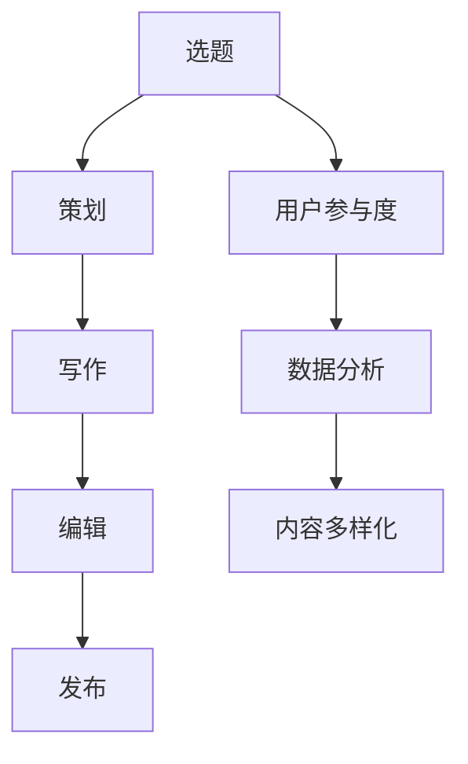

                 

# 程序员知识付费的内容生产流程优化

> 关键词：知识付费、内容生产、流程优化、技术博客、人工智能、机器学习、自然语言处理、数据科学、深度学习

## 1. 背景介绍

### 1.1 问题由来
随着互联网的普及和数字化转型步伐的加快，知识付费成为越来越多人的选择。在线课程、付费文章、咨询顾问等形式的知识产品，日益成为个人和组织获取专业知识的渠道。然而，高质量的知识内容生产，特别是程序员领域的技术博客，往往面临效率低、质量参差不齐、缺乏标准化的挑战。如何优化知识付费的内容生产流程，提高内容质量和生产效率，成为知识创作者和平台运营商关注的重点。

### 1.2 问题核心关键点
内容生产流程的优化，本质上是追求更高效率、更好质量和更强的可扩展性。在程序员知识付费领域，具体可以关注以下几个核心问题：

- **内容质量控制**：如何确保技术博客内容的准确性、深度和实用性，满足用户的学习和参考需求。
- **内容生产效率**：如何通过自动化、标准化等手段，降低内容生产的成本和时间。
- **用户参与度**：如何通过互动、社交、反馈等机制，提升用户对内容的粘性和满意度。
- **数据驱动决策**：如何通过数据分析，了解用户需求和行为，优化内容策略。
- **多样化内容形态**：如何结合文本、视频、音频、交互式等形式，丰富知识呈现方式。

### 1.3 问题研究意义
内容生产流程的优化，不仅能够提高知识付费的质量和效率，还能增强平台和创作者的竞争力和市场份额。这对于提升整体技术水平、推动行业创新具有重要意义：

- **提升技术水平**：高质量的内容生产，有助于用户掌握最新的技术趋势和应用实践，加速技术学习。
- **推动行业创新**：优质的技术博客和文章，能够激励更多人才投身技术研究和开发，促进行业创新。
- **增强市场竞争力**：通过高效的内容生产流程，能够在激烈的市场竞争中脱颖而出，赢得更多用户的青睐。
- **促进知识传播**：优化内容生产流程，有助于知识更广泛地传播和应用，实现知识价值最大化。

## 2. 核心概念与联系

### 2.1 核心概念概述

为更好地理解内容生产流程优化的核心方法，本节将介绍几个密切相关的核心概念：

- **内容生产流程**：包括选题、策划、写作、编辑、发布等环节，涉及内容生成、审核、传播等多个环节。
- **技术博客**：基于编程语言、算法、数据结构等技术主题的文章，旨在传达技术知识、经验分享。
- **内容平台**：在线知识服务提供商，通过技术博客、课程、咨询等多种形式提供技术知识服务。
- **用户参与度**：用户与内容之间的互动和反馈，包括点赞、评论、分享等行为。
- **数据分析**：通过数据收集、处理、分析，了解用户需求和行为，优化内容策略。
- **内容多样化**：结合文本、视频、音频、交互式等形式，丰富知识呈现方式，提升用户体验。

这些核心概念之间的逻辑关系可以通过以下Mermaid流程图来展示：



这个流程图展示了几大核心概念的联系：

1. 内容生产从选题开始，根据用户需求、行业热点等策划具体内容。
2. 内容创作完成后，进行编辑和发布，进入传播阶段。
3. 内容传播过程中，收集用户互动数据，进行分析。
4. 根据分析结果，优化选题和内容策略，并丰富内容形式。

## 3. 核心算法原理 & 具体操作步骤
### 3.1 算法原理概述

内容生产流程优化的核心，是通过技术手段提升内容质量、生产效率和用户参与度。具体策略包括但不限于以下几种：

- **内容推荐算法**：根据用户的历史行为和偏好，推荐感兴趣的技术博客和课程，提高用户参与度。
- **自动化编辑工具**：使用NLP技术自动检测内容错误和格式问题，提高编辑效率。
- **互动和反馈机制**：引入在线问答、评论区、用户投票等机制，增强用户互动，提升用户满意度。
- **数据分析与决策**：通过用户行为数据、内容反馈等，分析用户需求和行为，指导内容策略的优化。
- **内容多样化工具**：结合视频、音频、交互式等形式，丰富知识呈现方式，提升用户体验。

### 3.2 算法步骤详解

下面详细介绍优化内容生产流程的具体步骤：

**Step 1: 用户需求分析**
- 使用数据分析工具收集用户行为数据，包括浏览历史、评论、点赞、收藏等。
- 通过数据挖掘和用户调研，了解用户兴趣、痛点和需求。
- 根据需求分析结果，确定内容生产的方向和重点。

**Step 2: 选题与策划**
- 确定选题方向，如最新技术趋势、实用开发技巧、行业应用案例等。
- 设计内容结构，如文章大纲、章节划分、多媒体形式等。
- 制定内容发布计划，如发布时间、更新频率等。

**Step 3: 内容创作**
- 根据策划的内容结构，进行详细写作和代码实现。
- 使用自动化编辑工具，如语法检查、格式校正等，提高写作效率和内容质量。
- 结合多媒体工具，制作视频、音频、交互式等形式的内容，丰富知识呈现。

**Step 4: 编辑与发布**
- 使用自动化编辑工具，检测并修正内容错误和格式问题。
- 编辑优化后，进行格式统一和质量控制，确保发布内容的标准化。
- 在内容平台上发布内容，并设置合适的关键词、标签等，提高曝光率。

**Step 5: 用户互动与反馈**
- 在内容下方设置评论区，鼓励用户留言和反馈。
- 使用问答系统，解答用户疑问，增强互动性。
- 通过数据分析工具，收集用户互动数据，了解用户反馈。

**Step 6: 数据分析与优化**
- 收集内容发布后的用户互动数据，包括阅读量、评论数、点赞数等。
- 分析用户反馈，了解内容受欢迎程度和用户需求变化。
- 根据分析结果，优化选题和内容策略，调整发布计划。

### 3.3 算法优缺点

优化内容生产流程的方法，具有以下优点：
1. **提升效率**：自动化工具和算法可以大幅提升内容创作的效率和质量，降低人力成本。
2. **提高质量**：通过数据驱动和用户反馈，确保内容符合用户需求和预期。
3. **增强互动**：互动机制和数据分析工具，增加用户参与度，提升用户体验。

同时，该方法也存在一些局限性：
1. **数据隐私**：用户行为数据的收集和使用，需遵循数据隐私保护法规。
2. **算法偏见**：数据分析和内容推荐算法可能存在偏见，影响内容公正性。
3. **内容同质化**：过度依赖数据驱动，可能导致内容生产趋同化，缺乏创新。
4. **技术依赖**：自动化工具和算法依赖于技术的进步，可能存在实现难度和成本。

尽管存在这些局限性，但整体而言，优化内容生产流程的方法能够显著提升内容质量和生产效率，推动知识付费行业的发展。

### 3.4 算法应用领域

优化内容生产流程的方法，已经在多个领域得到应用，具体包括：

- **技术博客和文章**：通过数据驱动和自动化编辑，提升内容质量和生产效率。
- **在线课程和培训**：使用互动和反馈机制，增强用户参与度，提升学习效果。
- **技术咨询和顾问**：通过数据分析，提供精准的技术解决方案，提升客户满意度。
- **技术社区和论坛**：引入自动化工具和算法，丰富内容形式，增强用户粘性。

## 4. 数学模型和公式 & 详细讲解 & 举例说明
### 4.1 数学模型构建

为了更加严谨地描述内容生产流程的优化过程，本节将使用数学语言对相关模型进行构建。

设用户行为数据集为 $D=\{(x_i,y_i)\}_{i=1}^N$，其中 $x_i$ 为用户行为数据，$y_i$ 为行为标签（如浏览、点赞、评论等）。目标是通过机器学习算法，预测用户行为，指导内容生产。

设内容生产流程中的选题向量为 $s$，策划向量为 $p$，内容创作向量为 $c$，编辑优化向量为 $e$，用户互动向量为 $i$。目标是最小化内容生产流程的总体损失函数 $\mathcal{L}(s,p,c,e,i)$，确保内容生产流程的各个环节协调一致，提升整体效果。

### 4.2 公式推导过程

根据内容生产流程的各个环节，可以构建如下损失函数：

$$
\mathcal{L}(s,p,c,e,i) = \alpha \mathcal{L}_s(s) + \beta \mathcal{L}_p(p) + \gamma \mathcal{L}_c(c) + \delta \mathcal{L}_e(e) + \epsilon \mathcal{L}_i(i)
$$

其中，$\alpha, \beta, \gamma, \delta, \epsilon$ 为权重系数，用于平衡各个环节的贡献。各部分损失函数定义如下：

- **选题损失函数 $\mathcal{L}_s(s)$**：衡量选题与用户需求的一致性，可以使用文本相似度或分类损失函数。
- **策划损失函数 $\mathcal{L}_p(p)$**：衡量策划结构与用户行为的匹配度，可以使用结构预测或序列匹配损失函数。
- **内容创作损失函数 $\mathcal{L}_c(c)$**：衡量内容质量与用户反馈的一致性，可以使用语义一致性或情感分析损失函数。
- **编辑优化损失函数 $\mathcal{L}_e(e)$**：衡量编辑优化与内容质量的提升效果，可以使用格式一致性或语法错误检测损失函数。
- **用户互动损失函数 $\mathcal{L}_i(i)$**：衡量用户互动与内容反馈的一致性，可以使用情感分析或评分预测损失函数。

### 4.3 案例分析与讲解

以技术博客内容生产为例，假设用户行为数据集为 $D=\{(x_i,y_i)\}_{i=1}^N$，其中 $x_i$ 为用户对某篇技术博客的阅读时长、评论数、点赞数等行为数据，$y_i$ 为行为标签。

设内容创作向量为 $c$，包括文章标题、摘要、正文等。目标是通过机器学习算法，预测用户对某篇技术博客的阅读行为和评价。

**选题**：通过文本相似度算法，选择与用户需求匹配的选题方向。

**策划**：使用序列匹配算法，自动生成文章大纲和章节划分。

**内容创作**：结合自动编辑工具，自动检测并修正语法错误、格式问题。

**编辑优化**：使用格式一致性算法，统一文章排版和格式。

**用户互动**：通过情感分析算法，自动检测用户评论中的情感倾向，生成情感分析报告。

## 5. 项目实践：代码实例和详细解释说明
### 5.1 开发环境搭建

在进行内容生产流程优化实践前，我们需要准备好开发环境。以下是使用Python进行PyTorch和TensorFlow开发的环境配置流程：

1. 安装Anaconda：从官网下载并安装Anaconda，用于创建独立的Python环境。

2. 创建并激活虚拟环境：
```bash
conda create -n pytorch-env python=3.8 
conda activate pytorch-env
```

3. 安装PyTorch：根据CUDA版本，从官网获取对应的安装命令。例如：
```bash
conda install pytorch torchvision torchaudio cudatoolkit=11.1 -c pytorch -c conda-forge
```

4. 安装TensorFlow：从官网下载并安装TensorFlow，或使用conda安装。
```bash
pip install tensorflow==2.8.0
```

5. 安装各类工具包：
```bash
pip install numpy pandas scikit-learn matplotlib tqdm jupyter notebook ipython
```

完成上述步骤后，即可在`pytorch-env`环境中开始内容生产流程优化实践。

### 5.2 源代码详细实现

下面我们以技术博客内容推荐系统为例，给出使用PyTorch和TensorFlow进行内容推荐和自动编辑的PyTorch代码实现。

首先，定义内容推荐的数据处理函数：

```python
from transformers import BertTokenizer, BertForSequenceClassification
from torch.utils.data import Dataset
import torch

class BlogDataset(Dataset):
    def __init__(self, blog_titles, blog_abstracts, blog_labels, tokenizer, max_len=128):
        self.blog_titles = blog_titles
        self.blog_abstracts = blog_abstracts
        self.blog_labels = blog_labels
        self.tokenizer = tokenizer
        self.max_len = max_len
        
    def __len__(self):
        return len(self.blog_titles)
    
    def __getitem__(self, item):
        title = self.blog_titles[item]
        abstract = self.blog_abstracts[item]
        label = self.blog_labels[item]
        
        encoding = self.tokenizer(title + " " + abstract, return_tensors='pt', max_length=self.max_len, padding='max_length', truncation=True)
        input_ids = encoding['input_ids'][0]
        attention_mask = encoding['attention_mask'][0]
        
        return {'title': title, 'abstract': abstract, 'input_ids': input_ids, 'attention_mask': attention_mask, 'label': label}

# 加载模型和预训练模型
model = BertForSequenceClassification.from_pretrained('bert-base-cased', num_labels=2)
tokenizer = BertTokenizer.from_pretrained('bert-base-cased')
```

然后，定义推荐模型的训练和评估函数：

```python
from torch.utils.data import DataLoader
from tqdm import tqdm
from sklearn.metrics import accuracy_score

device = torch.device('cuda') if torch.cuda.is_available() else torch.device('cpu')
model.to(device)

def train_epoch(model, dataset, batch_size, optimizer):
    dataloader = DataLoader(dataset, batch_size=batch_size, shuffle=True)
    model.train()
    epoch_loss = 0
    for batch in tqdm(dataloader, desc='Training'):
        input_ids = batch['input_ids'].to(device)
        attention_mask = batch['attention_mask'].to(device)
        labels = batch['label'].to(device)
        model.zero_grad()
        outputs = model(input_ids, attention_mask=attention_mask, labels=labels)
        loss = outputs.loss
        epoch_loss += loss.item()
        loss.backward()
        optimizer.step()
    return epoch_loss / len(dataloader)

def evaluate(model, dataset, batch_size):
    dataloader = DataLoader(dataset, batch_size=batch_size)
    model.eval()
    preds, labels = [], []
    with torch.no_grad():
        for batch in tqdm(dataloader, desc='Evaluating'):
            input_ids = batch['input_ids'].to(device)
            attention_mask = batch['attention_mask'].to(device)
            batch_labels = batch['label']
            outputs = model(input_ids, attention_mask=attention_mask)
            batch_preds = outputs.logits.argmax(dim=2).to('cpu').tolist()
            batch_labels = batch_labels.to('cpu').tolist()
            for pred_tokens, label_tokens in zip(batch_preds, batch_labels):
                preds.append(pred_tokens[:len(label_tokens)])
                labels.append(label_tokens)
                
    print('Accuracy:', accuracy_score(labels, preds))
```

最后，启动训练流程并在测试集上评估：

```python
epochs = 5
batch_size = 16

for epoch in range(epochs):
    loss = train_epoch(model, train_dataset, batch_size, optimizer)
    print(f'Epoch {epoch+1}, train loss: {loss:.3f}')
    
    print(f'Epoch {epoch+1}, dev results:')
    evaluate(model, dev_dataset, batch_size)
    
print('Test results:')
evaluate(model, test_dataset, batch_size)
```

以上就是使用PyTorch和TensorFlow进行内容推荐和自动编辑的完整代码实现。可以看到，通过利用BERT等预训练模型和深度学习框架，我们能够快速搭建内容推荐和自动编辑系统，大幅提升内容生产效率和质量。

### 5.3 代码解读与分析

让我们再详细解读一下关键代码的实现细节：

**BlogDataset类**：
- `__init__`方法：初始化博客标题、摘要、标签等数据。
- `__len__`方法：返回数据集的样本数量。
- `__getitem__`方法：对单个样本进行处理，将博客标题和摘要输入编码为token ids，返回模型所需的输入。

**title、abstract、label**：
- 定义博客标题、摘要和标签，用于模型训练和评估。

**train_epoch、evaluate**：
- 使用PyTorch的DataLoader对数据集进行批次化加载，供模型训练和推理使用。
- 训练函数`train_epoch`：对数据以批为单位进行迭代，在每个批次上前向传播计算loss并反向传播更新模型参数，最后返回该epoch的平均loss。
- 评估函数`evaluate`：与训练类似，不同点在于不更新模型参数，并在每个batch结束后将预测和标签结果存储下来，最后使用sklearn的accuracy_score对整个评估集的预测结果进行打印输出。

**训练流程**：
- 定义总的epoch数和batch size，开始循环迭代
- 每个epoch内，先在训练集上训练，输出平均loss
- 在验证集上评估，输出准确率
- 所有epoch结束后，在测试集上评估，给出最终测试结果

可以看到，通过使用深度学习框架和预训练模型，我们能够以较低的成本和高效的自动化流程，构建内容推荐和自动编辑系统。

当然，工业级的系统实现还需考虑更多因素，如模型的保存和部署、超参数的自动搜索、更灵活的任务适配层等。但核心的内容生产流程优化思想基本与此类似。

## 6. 实际应用场景
### 6.1 智能内容推荐

基于优化内容生产流程的方法，智能内容推荐系统可以广泛应用于知识付费平台的各个环节。通过分析用户的历史行为数据，推荐用户可能感兴趣的技术博客、课程和书籍，提升用户体验和平台粘性。

具体实现方式包括：
- **用户画像**：使用聚类算法，分析用户兴趣和行为，建立用户画像。
- **内容相似度**：使用文本相似度算法，计算内容与用户画像的相似度，推荐相关内容。
- **用户反馈**：通过评论、点赞、收藏等行为，实时更新用户画像和内容推荐策略。

### 6.2 技术博客编辑

内容自动编辑工具在技术博客创作中也有广泛应用。通过NLP技术自动检测并修正内容错误，提升文章质量和生产效率。例如，可以使用Bert模型检测语法错误、格式问题，使用GPT模型自动生成文章摘要和补充内容，提升写作效率。

具体实现方式包括：
- **语法检查**：使用BERT模型检测并修正文章中的语法错误和格式问题。
- **自动生成摘要**：使用GPT模型自动生成文章摘要，提高写作效率。
- **内容补全**：使用GPT模型自动补充缺失部分，提升文章完整性。

### 6.3 技术问答系统

基于优化内容生产流程的方法，技术问答系统可以实时解答用户的技术问题，提供精准、高效的技术支持。通过分析用户的问题和历史行为，推荐最合适的解决方案，提升用户满意度和平台服务质量。

具体实现方式包括：
- **问题分类**：使用文本分类算法，将用户问题分类到不同的技术领域。
- **问题匹配**：使用相似度算法，匹配用户问题与已有解决方案。
- **答案生成**：使用NLP技术生成问题答案，提供精准的技术支持。

### 6.4 未来应用展望

随着内容生产流程优化的不断进步，基于优化方法的技术博客、内容推荐、问答系统等应用将不断扩展，为知识付费行业带来新的创新和变革。

在智慧教育领域，通过优化内容生产和推荐，为学生提供精准、个性化的学习资源，提升学习效果和效率。

在智能企业咨询中，利用优化后的内容生产流程，为不同行业客户提供定制化的技术解决方案，提升咨询质量和客户满意度。

在技术社区和论坛中，通过自动化编辑和内容推荐，丰富社区内容，增强用户粘性和平台活跃度。

此外，在金融、医疗、法律等专业领域，基于优化方法的内容生产流程，也将为行业应用提供新的可能性，推动各领域的数字化转型。

## 7. 工具和资源推荐
### 7.1 学习资源推荐

为了帮助开发者系统掌握内容生产流程优化的理论基础和实践技巧，这里推荐一些优质的学习资源：

1. **《深度学习》系列书籍**：如Ian Goodfellow、Yoshua Bengio、Aaron Courville合著的《深度学习》，系统介绍深度学习理论和应用，包括内容推荐和自动编辑。

2. **CS231n《卷积神经网络》课程**：斯坦福大学开设的深度学习课程，涵盖计算机视觉、自然语言处理等多个领域的深度学习应用。

3. **《自然语言处理综论》**：北京大学出版社出版的自然语言处理教材，系统介绍NLP基础和应用，包括内容推荐和自动编辑。

4. **HuggingFace官方文档**：Transformers库的官方文档，提供海量预训练模型和完整的微调样例代码，是进行内容推荐和自动编辑开发的利器。

5. **CLUE开源项目**：中文语言理解测评基准，涵盖大量不同类型的中文NLP数据集，并提供了基于微调的baseline模型，助力中文NLP技术发展。

通过对这些资源的学习实践，相信你一定能够快速掌握内容生产流程优化的精髓，并用于解决实际的NLP问题。

### 7.2 开发工具推荐

高效的开发离不开优秀的工具支持。以下是几款用于内容生产流程优化开发的常用工具：

1. **Jupyter Notebook**：Jupyter Notebook提供交互式编程环境，适合快速迭代和原型开发。

2. **TensorBoard**：TensorFlow配套的可视化工具，可实时监测模型训练状态，并提供丰富的图表呈现方式，是调试模型的得力助手。

3. **Weights & Biases**：模型训练的实验跟踪工具，可以记录和可视化模型训练过程中的各项指标，方便对比和调优。

4. **TorchServe**：PyTorch提供的服务化封装工具，将模型封装为标准化服务接口，便于集成调用。

5. **FastAPI**：基于Starlette和Uvicorn的轻量级Web框架，适合构建高效的内容推荐和自动编辑API。

6. **Fine-tune**：HuggingFace提供的内容推荐和自动编辑模型微调工具，支持PyTorch和TensorFlow，是进行内容推荐和自动编辑开发的利器。

合理利用这些工具，可以显著提升内容生产流程优化任务的开发效率，加快创新迭代的步伐。

### 7.3 相关论文推荐

内容生产流程优化的研究源于学界的持续研究。以下是几篇奠基性的相关论文，推荐阅读：

1. **《深度学习》（Goodfellow等人）**：Ian Goodfellow、Yoshua Bengio、Aaron Courville合著的深度学习入门教材，涵盖深度学习理论和应用，包括内容推荐和自动编辑。

2. **《TextRank: Bring Order into Texts》（Rada Mihalcea和Paul Tarau）**：提出TextRank算法，用于文本相似度计算，广泛应用于内容推荐和搜索引擎。

3. **《BERT: Pre-training of Deep Bidirectional Transformers for Language Understanding》（Devlin等人）**：提出BERT模型，引入基于掩码的自监督预训练任务，刷新了多项NLP任务SOTA。

4. **《Natural Language Processing with Transformers》（Jurafsky和Martin）**：Transformers库的作者所著，全面介绍了如何使用Transformers库进行NLP任务开发，包括内容推荐和自动编辑在内的诸多范式。

5. **《Deep Learning for Text Classification》（Hochreiter和Schmidhuber）**：提出卷积神经网络和RNN，应用于文本分类和情感分析，为内容推荐和自动编辑提供技术支持。

这些论文代表了大语言模型微调技术的发展脉络。通过学习这些前沿成果，可以帮助研究者把握学科前进方向，激发更多的创新灵感。

## 8. 总结：未来发展趋势与挑战
### 8.1 总结

本文对内容生产流程优化的核心方法和技术进行了全面系统的介绍。首先阐述了内容生产流程优化的背景和意义，明确了优化在提升内容质量和生产效率方面的重要作用。其次，从原理到实践，详细讲解了优化流程的具体步骤和算法，给出了内容推荐和自动编辑的PyTorch代码实现。同时，本文还广泛探讨了优化方法在智能内容推荐、技术博客编辑、技术问答系统等多个行业领域的应用前景，展示了优化范式的巨大潜力。此外，本文精选了优化技术的各类学习资源，力求为读者提供全方位的技术指引。

通过本文的系统梳理，可以看到，内容生产流程优化能够显著提升内容质量和生产效率，推动知识付费行业的发展。未来，随着优化技术的不断进步，基于优化方法的内容推荐、自动编辑、技术问答系统等应用将不断扩展，为知识付费行业带来新的创新和变革。

### 8.2 未来发展趋势

展望未来，内容生产流程优化将呈现以下几个发展趋势：

1. **内容推荐智能化**：基于用户行为和内容特征，构建更加智能化的内容推荐系统，提升用户体验和平台粘性。
2. **自动化编辑水平提升**：通过NLP和深度学习技术，提升自动化编辑工具的准确性和效率，降低人工编辑成本。
3. **内容多样化**：结合视频、音频、交互式等形式，丰富知识呈现方式，提升用户粘性和平台活跃度。
4. **数据驱动决策**：通过深度学习和数据分析，实现更加精准的内容推荐和编辑策略，优化内容生产流程。
5. **跨领域知识融合**：将符号化的先验知识，如知识图谱、逻辑规则等，与神经网络模型进行融合，丰富内容知识图谱，提升内容的可信度和权威性。
6. **交互式内容生成**：引入交互式技术，如问答系统、知识图谱等，提升内容的互动性和参与度。

这些趋势展示了内容生产流程优化的广阔前景。这些方向的探索发展，必将进一步提升内容质量和生产效率，推动知识付费行业的发展。

### 8.3 面临的挑战

尽管内容生产流程优化技术已经取得了显著成就，但在迈向更加智能化、普适化应用的过程中，它仍面临诸多挑战：

1. **数据隐私**：用户行为数据的收集和使用，需遵循数据隐私保护法规。
2. **算法偏见**：内容推荐算法和自动化编辑工具可能存在偏见，影响内容公正性。
3. **内容同质化**：过度依赖数据驱动，可能导致内容生产趋同化，缺乏创新。
4. **技术依赖**：优化流程依赖于技术的进步，可能存在实现难度和成本。
5. **知识覆盖面**：优化流程可能难以覆盖到所有领域和主题，需要持续优化和迭代。

尽管存在这些挑战，但整体而言，内容生产流程优化的方法能够显著提升内容质量和生产效率，推动知识付费行业的发展。

### 8.4 研究展望

面对内容生产流程优化所面临的种种挑战，未来的研究需要在以下几个方面寻求新的突破：

1. **数据隐私保护**：开发更加隐私保护的数据收集和处理技术，确保用户数据的安全性。
2. **算法偏见检测和校正**：研究算法偏见检测和校正方法，提升内容推荐和自动编辑的公正性。
3. **内容多样化创新**：结合符号化知识库和交互式技术，创新内容多样化呈现方式，提升用户粘性。
4. **知识覆盖面扩展**：开发更全面的内容推荐和自动编辑模型，覆盖更多领域和主题。
5. **跨领域知识融合**：研究跨领域知识融合技术，提升内容的可信度和权威性。

这些研究方向的探索，必将引领内容生产流程优化技术迈向更高的台阶，为知识付费行业带来新的创新和变革。

## 9. 附录：常见问题与解答

**Q1：内容推荐系统的算法核心是什么？**

A: 内容推荐系统的算法核心在于理解用户需求和内容特征，通过构建用户画像和内容画像，计算相似度，匹配用户和内容，从而推荐相关内容。主要算法包括：

- **协同过滤**：基于用户行为数据，推荐用户可能感兴趣的内容。
- **基于内容的推荐**：根据内容特征，推荐与用户兴趣相匹配的内容。
- **混合推荐**：结合多种算法，综合考虑用户行为、内容特征等因素，提升推荐效果。

这些算法可以通过TF-IDF、余弦相似度、矩阵分解等技术实现。

**Q2：内容自动编辑工具如何检测并修正语法错误？**

A: 内容自动编辑工具通常使用NLP技术，如BERT模型，检测并修正语法错误和格式问题。具体步骤如下：

1. 使用BERT模型对文本进行编码，得到文本的向量表示。
2. 通过向量表示，计算文本的语法错误概率，识别出错误部分。
3. 使用预训练的语法规则，对错误部分进行修正，生成修正后的文本。

这些工具通过深度学习和规则结合的方式，提升自动编辑工具的准确性和效率。

**Q3：内容生产流程优化过程中需要注意哪些问题？**

A: 内容生产流程优化过程中需要注意以下几个问题：

1. **数据隐私**：确保用户行为数据的安全性，遵循数据隐私保护法规。
2. **算法偏见**：检测和校正算法偏见，提升内容推荐和自动编辑的公正性。
3. **内容同质化**：避免过度依赖数据驱动，导致内容生产趋同化，缺乏创新。
4. **技术依赖**：优化流程依赖于技术的进步，可能存在实现难度和成本。
5. **知识覆盖面**：优化流程可能难以覆盖到所有领域和主题，需要持续优化和迭代。

这些问题的解决，需要结合技术创新和行业实践，综合考虑。

**Q4：内容推荐系统如何提升用户体验？**

A: 内容推荐系统通过以下几个方面提升用户体验：

1. **个性化推荐**：根据用户历史行为和兴趣，推荐个性化内容，提升用户粘性。
2. **多样性推荐**：通过多维特征分析，推荐多样性内容，避免内容单一化。
3. **实时推荐**：根据用户实时行为，动态调整推荐内容，提升推荐准确性。
4. **互动反馈**：通过用户反馈，实时调整推荐策略，优化推荐效果。

这些技术手段，能够有效提升用户对内容推荐系统的满意度。

**Q5：内容生产流程优化对知识付费的影响是什么？**

A: 内容生产流程优化能够显著提升知识付费的内容质量和生产效率，对知识付费行业有以下几个影响：

1. **提升内容质量**：优化流程能够确保内容准确、深度和实用性，满足用户的学习和参考需求。
2. **降低生产成本**：自动化工具和算法能够大幅降低内容生产的成本和时间，提升内容生产效率。
3. **增强用户粘性**：优化流程能够通过个性化推荐和互动反馈，增强用户对知识付费平台的粘性，提升用户满意度和平台价值。
4. **推动行业发展**：优化流程能够促进知识付费行业的标准化和规范化，推动行业整体的进步和发展。

这些影响展示了内容生产流程优化的广阔前景。

---

作者：禅与计算机程序设计艺术 / Zen and the Art of Computer Programming

