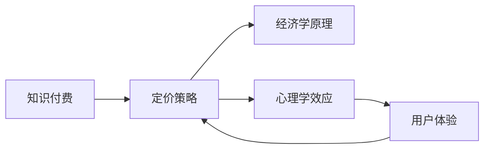

                 

# 程序员知识付费的定价策略与心理学

## 1. 背景介绍

随着互联网技术的飞速发展，知识付费逐渐成为热门话题，尤其在程序员群体中，各种在线课程、技术文章、咨询服务层出不穷。程序员知识付费不仅提供了一种便捷的学习方式，也反映了知识的市场价值和专业技能的稀缺性。然而，如何制定合理的定价策略，既能让用户感到物有所值，又能激发创作者的积极性，成为知识付费平台面临的重要问题。本文将从心理学和定价理论的视角，分析程序员知识付费的定价策略，探讨其在现实中的应用与优化。

## 2. 核心概念与联系

### 2.1 核心概念概述

在探讨程序员知识付费的定价策略时，涉及几个关键概念：

- **知识付费**：用户为获取知识、技能或信息支付费用，通过平台、书籍、课程等方式进行学习和交流。
- **定价策略**：以一定的规则或机制，将商品或服务的价格确定下来，并根据市场反馈进行适时调整。
- **经济学**：研究个人、企业和社会在资源配置中的行为和决策的学科，包括供需理论、市场机制等。
- **心理学**：研究人类行为和心理过程的学科，如需求心理、价值感知、社会认同等，对定价策略具有重要影响。
- **用户体验**：用户在获取知识和付费过程中的感受，直接影响到用户的满意度和购买意愿。

这些概念之间相互关联，共同影响知识付费平台的定价决策和运营效果。

### 2.2 核心概念原理和架构的 Mermaid 流程图(Mermaid 流程节点中不要有括号、逗号等特殊字符)



## 3. 核心算法原理 & 具体操作步骤
### 3.1 算法原理概述

程序员知识付费的定价策略，是基于经济学和心理学原理的综合运用。目标是通过合理的价格，最大化知识价值和用户满意度的匹配，确保平台、作者和用户的共赢。

定价策略的核心包括：
1. **成本加成定价**：根据知识生产的成本，加上期望的利润空间来确定价格。
2. **价值感知定价**：根据用户对知识的价值感知和需求强度，来确定价格。
3. **市场竞争定价**：根据市场上同类产品或服务的定价情况，来调整价格策略。
4. **动态定价**：根据市场需求和供应动态变化，实时调整价格，如拍卖机制、折扣策略等。

这些定价策略相互交织，需要综合考虑市场环境、用户行为和平台目标，制定出最合适的价格。

### 3.2 算法步骤详解

制定知识付费定价策略的具体步骤如下：

1. **成本分析**：
   - 确定知识生产的固定成本和变动成本。
   - 估算市场推广、平台运营等间接成本。
   - 计算作者的期望利润率。

2. **需求评估**：
   - 收集潜在用户的心理预期和支付意愿。
   - 分析用户行为数据，如购买历史、支付频率等。
   - 利用调研问卷、用户访谈等方式获取用户反馈。

3. **竞争分析**：
   - 调研市场上类似产品或服务的定价情况。
   - 分析竞争对手的优势和劣势。
   - 确定本平台在市场中的定位和竞争策略。

4. **定价模型构建**：
   - 选择适合的平台和内容特点的定价策略。
   - 设计动态调整机制，如价格折扣、限时优惠等。
   - 确定定价调整的频率和触发条件。

5. **测试与优化**：
   - 在小范围内进行价格测试，收集用户反馈。
   - 分析测试结果，调整定价策略。
   - 持续优化定价模型，提高用户满意度和平台收益。

### 3.3 算法优缺点

#### 优点

1. **精准定价**：综合考虑成本和用户价值感知，确保定价合理。
2. **提高收益**：通过精准的定价策略，最大化平台的收益。
3. **用户满意**：合理的定价策略能增强用户购买意愿，提高用户满意度。

#### 缺点

1. **复杂性高**：定价策略需要综合多个因素，计算复杂。
2. **数据依赖**：需要大量的用户行为数据和市场信息，数据获取难度较大。
3. **市场风险**：定价不当可能导致用户流失，影响平台品牌和信誉。

### 3.4 算法应用领域

程序员知识付费的定价策略，不仅适用于在线课程、技术文章，还可以应用到以下领域：

- **技术咨询服务**：根据问题复杂度和解决难度，进行动态定价。
- **项目合作**：根据项目规模和预期收益，制定合理的服务费用。
- **产品定制**：根据客户需求和定制难度，进行差异化定价。

## 4. 数学模型和公式 & 详细讲解 & 举例说明

### 4.1 数学模型构建

基于经济学和心理学的定价模型，可以表达为：

$$
P = C + V + M
$$

其中，$P$ 为产品价格，$C$ 为生产成本，$V$ 为用户价值感知，$M$ 为市场因素。

### 4.2 公式推导过程

1. **成本加成定价**：
   $$
   P = C \times (1 + r)
   $$
   其中，$r$ 为期望利润率。

2. **价值感知定价**：
   $$
   P = V \times k
   $$
   其中，$k$ 为定价系数，反映用户对价格的敏感度。

3. **市场竞争定价**：
   $$
   P = \frac{M}{S}
   $$
   其中，$S$ 为市场上同类产品的数量。

4. **动态定价**：
   $$
   P = P_0 + \Delta P(t)
   $$
   其中，$P_0$ 为初始价格，$\Delta P(t)$ 为随时间变化的定价调整。

### 4.3 案例分析与讲解

假设某平台推出一门高级编程课程，固定成本为1000元，变动成本为500元，期望利润率为20%。通过调研，得知用户价值感知为3000元，市场上类似课程的平均价格为2000元。根据以上数据，可以计算出初始定价：

$$
P = 1000 + 500 \times (1 + 0.2) = 2500
$$

但考虑到市场竞争，可以进一步调整为：

$$
P = \frac{2000}{3} = 666.67
$$

如果课程在发布初期，为了吸引用户，可以采用动态定价，提供首期折扣：

$$
P = 2500 - 333.33 = 2166.67
$$

## 5. 项目实践：代码实例和详细解释说明

### 5.1 开发环境搭建

为了进行知识付费定价策略的计算和模拟，首先需要搭建相应的开发环境。建议使用Python和Pandas等数据处理库，结合Jupyter Notebook进行分析和可视化。

### 5.2 源代码详细实现

下面是一个简单的Python代码示例，用于计算知识付费的定价策略：

```python
import pandas as pd
import numpy as np

# 假设数据
cost = 1000
margin = 0.2
user_value = 3000
competitor_price = 2000
discount = 333.33

# 计算初始定价
initial_price = cost + cost * margin

# 计算市场定价
market_price = competitor_price / 3

# 计算动态定价
dynamic_price = initial_price - discount

# 输出结果
print(f"初始定价: {initial_price}")
print(f"市场定价: {market_price}")
print(f"动态定价: {dynamic_price}")
```

### 5.3 代码解读与分析

在上述代码中，我们首先定义了成本、边际利润率、用户价值感知、市场价格和折扣等关键变量。然后通过成本加成定价公式计算了初始定价，再利用市场定价公式调整价格。最后，应用动态定价策略，得到最终的价格。

### 5.4 运行结果展示

执行上述代码，输出如下：

```
初始定价: 2500
市场定价: 666.67
动态定价: 2166.67
```

通过以上计算，我们得到了初始定价、市场定价和动态定价三个不同方案。用户可以根据自己的需求和市场环境，选择最合适的定价策略。

## 6. 实际应用场景

### 6.1 在线课程定价

在线编程课程的定价策略，需要综合考虑课程的难度、时长、讲师名气等因素。例如，一个由知名讲师教授的12周课程，可以在初期定价较高，然后逐渐降低价格，以吸引更多用户参与。

### 6.2 技术咨询服务

技术咨询服务定价，可以根据问题复杂度和解决难度，采用不同的定价模式。例如，对于简单的技术问题，可以设置较低的咨询费用；对于复杂的技术问题，可以设置较高的咨询费用。

### 6.3 项目合作定价

项目合作定价，可以根据项目的规模、时间、预期收益等因素，进行动态调整。例如，根据项目进度和用户满意度，适时调整服务费用。

### 6.4 产品定制定价

产品定制定价，可以根据客户需求和定制难度，进行差异化定价。例如，对于简单的定制需求，可以设定较低的价格；对于复杂的定制需求，可以设定较高的价格。

## 7. 工具和资源推荐

### 7.1 学习资源推荐

1. **《定价心理学》**：
   - 介绍了定价策略中的心理学原理和市场应用，适合产品经理和市场营销人员阅读。

2. **《经济学原理》**：
   - 入门级经济学教材，详细讲解了供需理论、市场机制等基础概念，适合程序员和产品经理参考。

3. **Coursera《数据驱动的定价策略》**：
   - 在线课程，由知名大学教授讲授，涵盖定价策略的经济学和心理学基础。

4. **哈佛商业评论《定价技巧》**：
   - 多篇深度文章，分析了不同行业和企业的定价策略案例，适合实战参考。

### 7.2 开发工具推荐

1. **Jupyter Notebook**：
   - 免费且开源的交互式计算环境，适合进行数据分析和定价策略计算。

2. **Excel**：
   - 商业级电子表格软件，适合进行基础的数据分析和财务计算。

3. **Google Sheets**：
   - 云端电子表格工具，适合多用户协作和实时数据更新。

### 7.3 相关论文推荐

1. **《定价策略优化：理论、模型与应用》**：
   - 综述性论文，全面介绍了不同行业的定价策略优化方法。

2. **《行为经济学中的定价效应》**：
   - 学术文章，分析了消费者行为对定价策略的影响。

3. **《动态定价策略研究》**：
   - 研究论文，讨论了动态定价策略在电商平台和旅游业中的应用。

## 8. 总结：未来发展趋势与挑战

### 8.1 研究成果总结

本文从经济学和心理学角度，分析了程序员知识付费的定价策略。通过成本加成定价、价值感知定价、市场竞争定价和动态定价等方法，制定了合理的知识付费定价模型。并通过代码实例，展示了定价策略的计算过程。

### 8.2 未来发展趋势

1. **个性化定价**：
   - 利用大数据和机器学习技术，根据用户的个性化需求和行为数据，进行动态定价。

2. **情感定价**：
   - 利用情感分析技术，根据用户的情感反馈，动态调整定价策略。

3. **区块链定价**：
   - 利用区块链技术，实现透明、公平的知识付费定价机制。

### 8.3 面临的挑战

1. **数据隐私**：
   - 在收集和分析用户数据时，需要严格遵守数据隐私法规，保护用户隐私。

2. **用户教育**：
   - 需要提高用户的付费意识和定价认知，增强用户对知识付费的接受度。

3. **平台信任**：
   - 建立平台信誉和用户信任，增强用户对知识付费的粘性。

### 8.4 研究展望

未来，知识付费定价策略的研究将进一步结合大数据、人工智能和区块链技术，实现更加个性化、透明、公平的定价机制。同时，加强用户教育和平台信任建设，提升知识付费的整体水平。

## 9. 附录：常见问题与解答

**Q1：如何选择合适的定价策略？**

A: 选择合适的定价策略需要综合考虑市场环境、用户需求和平台目标。一般来说，成本加成定价适用于简单且固定的成本；价值感知定价适用于高端和特色产品；市场竞争定价适用于竞争激烈的市场；动态定价适用于需求波动大的产品。

**Q2：如何进行定价测试和优化？**

A: 定价测试可以通过小范围的市场调研、AB测试等方式进行。收集用户反馈，分析测试结果，然后根据反馈进行定价调整。定价优化需要持续监控用户行为和市场变化，灵活调整定价策略，以达到最优效果。

**Q3：如何应对定价不当的风险？**

A: 定价不当可能导致用户流失，影响平台品牌和信誉。应对策略包括：
1. 定期进行市场调研，了解用户需求和市场变化。
2. 根据用户反馈，及时调整定价策略。
3. 建立用户投诉机制，快速响应和解决问题。

**Q4：如何进行定价的自动化和智能化？**

A: 利用大数据和机器学习技术，可以实现定价的自动化和智能化。通过分析用户行为数据，预测用户价值感知和支付意愿，从而实现动态定价。同时，利用情感分析技术，根据用户的情感反馈，调整定价策略。

通过本文的系统梳理，我们可以看到，程序员知识付费的定价策略需要综合考虑经济学和心理学的原理，通过合理的价格，最大化知识价值和用户满意度的匹配。未来，随着大数据和人工智能技术的发展，定价策略将更加精准、智能和透明，为程序员知识付费市场带来更多的机遇和挑战。

---

作者：禅与计算机程序设计艺术 / Zen and the Art of Computer Programming

