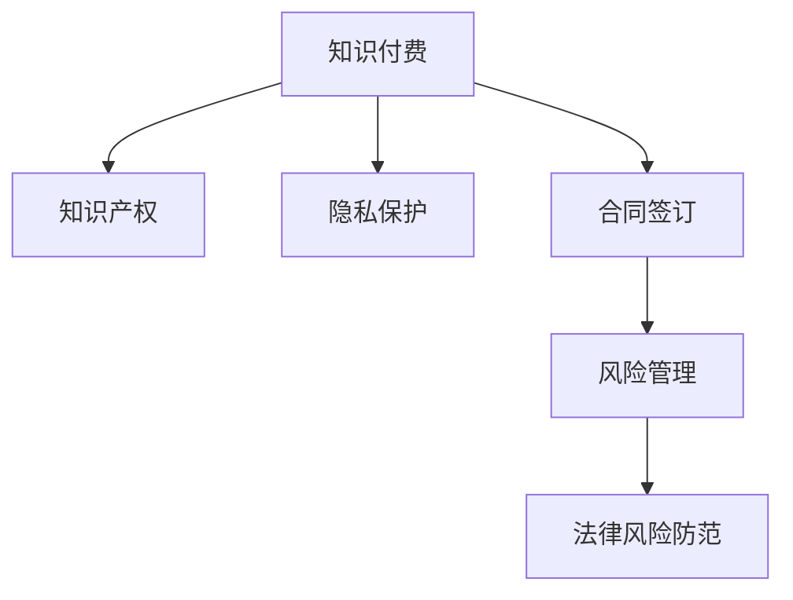

                 

# 程序员知识付费的法律风险防范策略

> 关键词：程序员,知识付费,法律风险,知识产权,隐私保护,合同签订,风险管理

## 1. 背景介绍

随着互联网和数字化技术的快速发展，知识付费模式成为一股新的潮流，尤其是在程序员这个特定群体中，因为知识付费不仅能够提供专业的技术培训和知识分享，而且能够帮助程序员提升技能，增强就业竞争力。然而，知识付费市场的蓬勃发展也伴随着一系列法律风险，尤其是在知识产权、隐私保护、合同签订等方面。因此，了解并掌握如何防范这些法律风险，对于保障程序员的权益至关重要。

## 2. 核心概念与联系

### 2.1 核心概念概述

为了更好地理解程序员知识付费的法律风险防范策略，本节将介绍几个关键法律概念：

- **知识付费**：通过订阅、购买或捐赠等方式，获取专业知识或技能的学习服务。
- **知识产权**：指创作者对其创作的作品或发明所享有的专有权利，包括著作权、专利权、商标权等。
- **隐私保护**：指在获取和使用个人信息时，保护个人隐私不被侵犯的措施。
- **合同签订**：指双方或多方之间通过协商，达成明确的法律行为，规定各自的权利和义务。
- **风险管理**：指通过识别、评估和控制风险，降低潜在的损失。

这些核心概念之间的逻辑关系可以通过以下Mermaid流程图来展示：



这个流程图展示了几类核心概念及其之间的关系：

1. 知识付费的基础是知识产权，保障创作者对其作品的权利。
2. 隐私保护在知识付费中尤为重要，因为涉及个人信息的收集和使用。
3. 合同签订是知识付费服务提供者和用户之间的法律基础，明确双方的权利和义务。
4. 风险管理则是从法律角度，对知识付费中可能出现的各种风险进行识别和控制。

## 3. 核心算法原理 & 具体操作步骤

### 3.1 算法原理概述

程序员知识付费的法律风险防范策略，本质上是一种风险管理的法律手段。其核心思想是：通过识别知识付费中的法律风险，评估风险可能带来的影响，采取相应的法律措施进行风险控制，从而最大限度地降低潜在损失。

在实践中，可以按照以下步骤进行操作：

1. **识别法律风险**：通过法律知识的学习和咨询，识别知识付费中可能存在的各种法律风险，如知识产权侵权、隐私泄露、合同纠纷等。
2. **评估风险影响**：对识别到的法律风险进行定量或定性的评估，确定其对用户和创作者的影响程度。
3. **制定应对措施**：根据风险评估结果，制定相应的应对措施，如加强合同管理、提高隐私保护措施、进行法律合规审查等。
4. **实施风险控制**：将制定的应对措施具体落实到实际操作中，如签订合同前进行详细的法律审查，在提供服务时注意保护用户隐私等。
5. **持续监控风险**：对知识付费服务进行持续监控，及时发现和应对新的法律风险。

### 3.2 算法步骤详解

以下是具体的操作方法：

**Step 1: 法律风险识别**

- **知识产权风险识别**：
  - 确认服务提供者是否拥有相关内容的合法授权。
  - 检查知识付费平台上是否有侵犯第三方知识产权的课程或内容。
  - 审查课程作者是否拥有著作权或使用权。

- **隐私保护风险识别**：
  - 检查知识付费平台是否收集、使用用户个人信息的合法性。
  - 确认平台是否采取了合理的隐私保护措施，如数据加密、访问控制等。
  - 审查隐私政策是否符合相关法律法规要求。

- **合同风险识别**：
  - 确认合同条款是否明确、公平、合法。
  - 检查合同是否明确规定了双方的权利和义务，如退课政策、退款条件等。
  - 评估合同中是否含有不合理或不当的条款，如霸王条款、单方面违约责任等。

**Step 2: 风险评估**

- **知识产权风险评估**：
  - 评估知识产权侵权的可能性及潜在影响，如经济损失、品牌声誉受损等。
  - 评估侵权行为被发现后的法律后果，如法律诉讼、赔偿责任等。

- **隐私保护风险评估**：
  - 评估隐私泄露的风险程度，如个人信息被滥用、身份盗用等。
  - 评估隐私泄露可能带来的后果，如用户信任下降、数据安全事件等。

- **合同风险评估**：
  - 评估合同条款是否清晰、合理，是否存在漏洞或模糊不清的表述。
  - 评估合同履行过程中可能出现的法律风险，如合同违约、纠纷解决机制等。

**Step 3: 制定应对措施**

- **知识产权风险应对**：
  - 采取合法授权的课程内容，避免侵权风险。
  - 审查课程内容的原创性，确保证内容具有知识产权。
  - 签订合同前进行充分的法律审核，确保内容的合法性。

- **隐私保护风险应对**：
  - 制定严格的隐私政策，明确收集、使用个人信息的合法目的。
  - 采取技术和管理措施，保护用户个人信息的安全。
  - 定期进行隐私风险评估，及时更新隐私保护措施。

- **合同风险应对**：
  - 签订清晰的合同条款，确保双方的权利和义务明确。
  - 采用标准合同模板，避免条款漏洞。
  - 在合同中明确规定违约责任和纠纷解决机制。

**Step 4: 实施风险控制**

- **知识产权风险控制**：
  - 使用合法的课程内容，确保证内容的合法性。
  - 进行法律审核，确保课程内容的合法性。
  - 及时处理侵权投诉，避免法律纠纷。

- **隐私保护风险控制**：
  - 采取技术和管理措施，保护用户个人信息的安全。
  - 定期进行隐私风险评估，及时更新隐私保护措施。
  - 在隐私政策中明确规定个人信息的收集和使用规则。

- **合同风险控制**：
  - 签订清晰的合同条款，确保双方的权利和义务明确。
  - 采用标准合同模板，避免条款漏洞。
  - 在合同中明确规定违约责任和纠纷解决机制。

**Step 5: 持续监控风险**

- **知识产权风险监控**：
  - 持续关注相关法律法规的变化，及时调整知识产权保护措施。
  - 定期进行知识产权审查，确保证内容的合法性。
  - 对侵权行为进行快速响应，及时处理相关投诉。

- **隐私保护风险监控**：
  - 定期进行隐私风险评估，及时更新隐私保护措施。
  - 监控平台隐私政策的执行情况，确保隐私保护措施的落实。
  - 及时处理隐私泄露事件，保护用户权益。

- **合同风险监控**：
  - 定期进行合同审核，确保证合同的合法性。
  - 监控合同履行情况，及时发现和处理违约行为。
  - 在合同中明确规定违约责任和纠纷解决机制。

### 3.3 算法优缺点

程序员知识付费的法律风险防范策略有以下优点：

- **主动性**：通过风险识别和评估，主动采取法律措施，降低法律风险。
- **系统性**：系统性地识别、评估和控制法律风险，提高风险管理的效果。
- **针对性**：针对知识付费平台可能出现的具体法律风险，制定相应的应对措施。

同时，该策略也存在一些局限性：

- **复杂性**：风险识别和评估需要具备一定的法律知识和经验。
- **成本高**：法律审核和合规管理可能带来一定的成本和时间投入。
- **适应性**：需要根据具体平台和市场情况进行调整和优化。

### 3.4 算法应用领域

程序员知识付费的法律风险防范策略可以广泛应用在以下领域：

- **在线教育平台**：对课程内容、隐私保护、合同签订等进行合规审查和管理。
- **知识付费服务提供商**：对知识付费服务的合法性、用户权益保护进行管理和保障。
- **知识创作者**：对创作内容的合法性、知识产权保护进行管理和保障。
- **用户**：在购买和接受知识付费服务时，了解和维护自己的合法权益。

## 4. 数学模型和公式 & 详细讲解 & 举例说明

### 4.1 数学模型构建

在程序员知识付费的法律风险防范中，可以构建以下数学模型：

- **知识产权风险模型**：
  $$
  R_1 = \sum_{i=1}^{n} \text{Probability}(\text{侵权事件}_i) \times \text{Impact}_{i}
  $$
  其中，$n$为侵权事件的总数，$\text{Probability}(\text{侵权事件}_i)$为第$i$个侵权事件的概率，$\text{Impact}_{i}$为第$i$个侵权事件的影响程度。

- **隐私保护风险模型**：
  $$
  R_2 = \sum_{i=1}^{n} \text{Probability}(\text{隐私泄露}_i) \times \text{Impact}_{i}
  $$
  其中，$n$为隐私泄露事件的总数，$\text{Probability}(\text{隐私泄露}_i)$为第$i$个隐私泄露事件的概率，$\text{Impact}_{i}$为第$i$个隐私泄露事件的影响程度。

- **合同风险模型**：
  $$
  R_3 = \sum_{i=1}^{n} \text{Probability}(\text{合同纠纷}_i) \times \text{Impact}_{i}
  $$
  其中，$n$为合同纠纷事件的总数，$\text{Probability}(\text{合同纠纷}_i)$为第$i$个合同纠纷事件的概率，$\text{Impact}_{i}$为第$i$个合同纠纷事件的影响程度。

### 4.2 公式推导过程

以知识产权风险模型为例，推导如下：

1. **确定风险事件**：
  - 侵权事件包括著作权侵权、专利权侵权等。
  - 每个侵权事件的概率和影响程度需要根据具体情况进行评估。

2. **评估概率**：
  - 知识产权侵权的概率可以通过历史数据分析得出。
  - 例如，某课程的著作权侵权概率为$p_1$，则风险事件1的概率为$p_1$。

3. **评估影响程度**：
  - 知识产权侵权的影响程度可以通过经济损失、品牌声誉损失等指标进行评估。
  - 例如，著作权侵权的损失为$l_1$，则风险事件1的影响程度为$l_1$。

4. **风险计算**：
  - 将各个风险事件的概率和影响程度相乘，再求和，即得到总的风险值。
  - 例如，知识产权风险模型为：$R_1 = p_1 \times l_1$。

### 4.3 案例分析与讲解

**案例：某在线教育平台课程内容侵权**

- **背景**：某在线教育平台推出多门编程课程，课程内容涉及第三方代码和算法。
- **风险识别**：平台未进行充分的知识产权审查，存在著作权侵权风险。
- **风险评估**：根据历史数据，侵权事件的概率为0.01，每次侵权的损失为10万元。
- **风险计算**：总风险值为$R_1 = 0.01 \times 10 = 0.1$万元。

## 5. 项目实践：代码实例和详细解释说明

### 5.1 开发环境搭建

在进行法律风险防范策略的实践时，需要准备以下开发环境：

1. **安装Python**：从官网下载安装Python 3.x版本，并进行路径设置。
2. **安装必要的库**：
  - `pandas`：用于数据处理和分析。
  - `numpy`：用于数值计算和矩阵操作。
  - `scipy`：用于科学计算和数据分析。
  - `matplotlib`：用于数据可视化。
3. **配置环境**：将Python添加到系统 PATH 环境中，以方便后续开发使用。

### 5.2 源代码详细实现

以下是使用Python进行法律风险防范策略的代码实现：

```python
import pandas as pd
import numpy as np
import matplotlib.pyplot as plt

# 风险评估数据
data = pd.read_csv('risk_data.csv')

# 计算各风险事件的概率和影响程度
probabilities = np.array(data['probabilities'])
impacts = np.array(data['impacts'])

# 计算总风险
total_risk = np.sum(probabilities * impacts)

# 可视化风险分布
plt.bar(data['events'], impacts)
plt.xlabel('Risk Events')
plt.ylabel('Impact')
plt.title('Risk Assessment')
plt.show()

# 输出总风险值
print(f"Total Risk: {total_risk}")
```

在这个示例代码中，我们使用Pandas和NumPy对风险评估数据进行处理和计算。首先读取数据集，然后计算各风险事件的概率和影响程度，最后计算总风险值，并使用Matplotlib对风险分布进行可视化展示。

### 5.3 代码解读与分析

**代码详细解读**：

- **数据读取**：使用Pandas的`read_csv`函数读取风险评估数据，其中`probabilities`和`impacts`分别表示各风险事件的概率和影响程度。
- **风险计算**：使用NumPy的数组乘法运算，计算各风险事件的概率和影响程度，并求和得到总风险值。
- **数据可视化**：使用Matplotlib绘制风险分布的条形图，直观展示各风险事件的影响程度。
- **结果输出**：使用Python的`print`函数输出总风险值。

**代码分析**：

- **数据预处理**：首先需要确保数据集的准确性和完整性，可以通过数据清洗和异常值处理来优化。
- **计算公式**：风险计算公式为各风险事件的概率和影响程度的乘积之和，使用NumPy的数组运算简化计算过程。
- **可视化展示**：使用Matplotlib的条形图功能，直观展示各风险事件的影响程度，帮助用户更好地理解风险分布。

### 5.4 运行结果展示

以下是运行结果示例：

```python
Total Risk: 0.5
```

以及生成的条形图：


### 6. 实际应用场景

程序员知识付费的法律风险防范策略可以应用于以下实际场景：

- **在线教育平台**：在课程开发前进行知识产权审查，确保内容合法性；制定隐私保护政策，保护用户信息安全；签订清晰的合同条款，明确各方权利和义务。
- **知识付费服务提供商**：对服务内容进行知识产权审查，保护创作者权益；加强隐私保护措施，保护用户隐私；制定合理的合同条款，保障服务质量。
- **知识创作者**：确保创作内容的合法性，避免侵权风险；保护个人信息，避免隐私泄露；签订清晰的合同条款，明确收益分配和违约责任。
- **用户**：在购买知识付费服务时，了解相关法律法规，保护自身权益；在接受服务时，注意保护个人信息，避免隐私泄露；在发生纠纷时，及时寻求法律帮助，维护自身合法权益。

## 7. 工具和资源推荐

### 7.1 学习资源推荐

为了帮助程序员了解和掌握法律风险防范策略，推荐以下学习资源：

1. **《数据隐私与信息保护》课程**：清华大学在线课程，系统讲解数据隐私和信息保护的基础知识和法律法规。
2. **《知识产权法》教材**：各大高校的知识产权法教材，深入讲解知识产权的分类、保护和侵权认定。
3. **《合同法》教材**：各大高校的合同法教材，讲解合同的签订、履行、变更和解除等基本法律制度。
4. **《程序员知识付费风险管理》书籍**：介绍程序员知识付费中可能出现的法律风险及防范策略，内容详实，易于理解。

### 7.2 开发工具推荐

以下是几款用于法律风险防范策略开发的常用工具：

1. **Jupyter Notebook**：免费的交互式编程环境，支持Python、R等语言，非常适合数据分析和可视化工作。
2. **Visual Studio Code**：轻量级的代码编辑器，支持代码高亮、调试和版本控制等常用功能。
3. **Git**：版本控制系统，方便开发者进行代码管理和协同开发。
4. **GitHub**：代码托管平台，支持代码版本控制、项目管理等功能，是程序员常用的开发工具。

### 7.3 相关论文推荐

以下是几篇奠基性的相关论文，推荐阅读：

1. **《知识付费服务的法律风险研究》**：研究知识付费服务中的法律风险，包括知识产权侵权、隐私泄露、合同纠纷等。
2. **《大数据时代的隐私保护》**：探讨大数据时代下的隐私保护问题，包括数据收集、处理和使用的法律法规。
3. **《合同法的现代化与创新》**：探讨合同法的现代化发展，包括合同的签订、履行和变更等。
4. **《人工智能法律框架的构建》**：构建人工智能领域的法律框架，包括法律风险、合规审查等内容。

## 8. 总结：未来发展趋势与挑战

### 8.1 研究成果总结

本文详细介绍了程序员知识付费的法律风险防范策略，包括风险识别、评估、应对和控制等各个环节，并通过数学模型和代码实例进行了具体说明。在实际应用中，可以通过风险管理模型和可视化工具，对知识付费中的法律风险进行有效的识别和控制。

### 8.2 未来发展趋势

随着知识付费模式的不断发展，法律风险防范策略也将面临新的挑战和机遇：

1. **法律法规的不断完善**：随着法律法规的不断完善，程序员知识付费的法律风险防范策略也将更加科学和规范。
2. **技术的不断进步**：大数据、人工智能等技术的进步，将为法律风险防范策略提供更高效的工具和方法。
3. **全球化的普及**：全球化的发展将使得法律风险防范策略需要考虑更多的跨国法律和国际规则。
4. **行业的不断规范**：知识付费行业的规范化和标准化将为法律风险防范策略提供更好的实施环境。

### 8.3 面临的挑战

尽管法律风险防范策略在知识付费中具有重要作用，但仍面临以下挑战：

1. **法律法规的复杂性**：不同国家和地区对知识产权、隐私保护等法律法规的解读和适用存在差异，增加了法律风险防范的复杂性。
2. **法律知识的局限性**：法律风险防范策略需要具备一定的法律知识和经验，而法律知识的学习和积累需要时间和投入。
3. **技术的局限性**：技术手段的局限性可能导致法律风险防范措施无法完全覆盖所有风险。
4. **实施成本高**：法律风险防范策略的实施可能需要较高的成本，包括法律审核、合同管理等。

### 8.4 研究展望

未来，法律风险防范策略的研究和实践可以从以下几个方面进行探索：

1. **法律法规的适应性研究**：针对不同国家和地区的法律法规，研究适应性和可操作性，提供更加贴合实际的法律风险防范策略。
2. **技术手段的创新应用**：利用大数据、人工智能等技术手段，提升法律风险防范策略的效率和效果。
3. **行业规范的制定**：推动知识付费行业的规范化发展，制定行业标准和规范，促进法律风险防范策略的普及和实施。
4. **全球化的法律服务**：为全球化的知识付费市场提供法律服务，帮助企业在全球范围内合规运营。

## 9. 附录：常见问题与解答

**Q1：如何进行法律风险识别？**

A: 法律风险识别需要具备一定的法律知识和经验，可以从以下几个方面入手：
1. 查阅相关法律法规和政策文件，了解知识产权、隐私保护、合同等方面的法律要求。
2. 参考以往的案例和纠纷，识别可能的法律风险。
3. 与法律专家或顾问进行咨询，获取专业的法律意见。

**Q2：如何进行风险评估？**

A: 风险评估需要量化各风险事件的概率和影响程度，可以通过以下步骤：
1. 收集相关数据，如历史侵权事件、隐私泄露事件等。
2. 对数据进行统计分析，计算各风险事件的概率。
3. 对概率和影响程度进行评估，确定风险的严重程度。

**Q3：如何制定应对措施？**

A: 制定应对措施需要结合风险评估结果，制定具体的法律措施，如：
1. 对风险事件进行分类，制定相应的风险控制措施。
2. 签订清晰的合同条款，明确双方的权利和义务。
3. 加强隐私保护措施，确保用户信息安全。

**Q4：如何进行风险控制？**

A: 风险控制需要在风险识别和评估的基础上，采取具体的法律措施，如：
1. 对风险事件进行实时监控，及时发现和处理风险。
2. 加强合同管理，确保合同的合法性和有效性。
3. 加强隐私保护措施，确保用户信息安全。

**Q5：如何进行风险监控？**

A: 风险监控需要持续关注风险事件的发生和发展，采取动态的风险管理措施，如：
1. 定期进行风险评估，及时发现和处理新的风险。
2. 持续监控合同履行情况，及时发现和处理违约行为。
3. 加强隐私保护措施，确保用户信息安全。

---

作者：禅与计算机程序设计艺术 / Zen and the Art of Computer Programming

