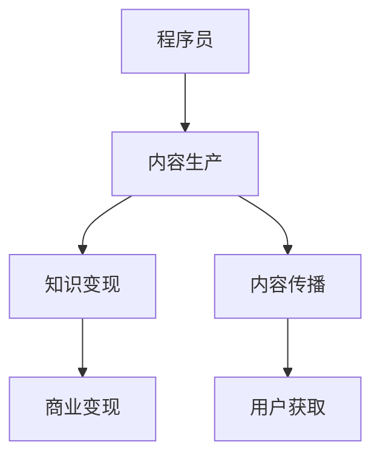

                 

## 1. 背景介绍

### 1.1 问题由来

近年来，知识付费成为热门行业，吸引了大量互联网企业的关注。越来越多的程序员希望通过转型知识付费领域，拓展职业发展空间，实现职业价值最大化。然而，实际操作过程中，他们常常陷入各种误区，未能取得理想的转型效果。本文旨在探讨程序员转型知识付费领域的常见误区，并给出应对建议。

### 1.2 问题核心关键点

转型知识付费领域的核心在于，如何将编程知识、技术经验转化为易于传播、有价值的内容，吸引用户并实现商业变现。常见误区包括：

- 内容同质化：缺乏创新性，未能区分自身与他人的优势。
- 知识片面化：聚焦单一技术点，未能形成完整的知识体系。
- 传播低效化：难以有效传递知识，未能引发用户共鸣。
- 变现依赖化：过分依赖平台变现机制，忽视自身品牌建设。
- 技术应用脱节：未能将技术应用与实际问题结合，缺乏解决实际问题的能力。

## 2. 核心概念与联系

### 2.1 核心概念概述

为更好地理解程序员转型知识付费领域的误区，本节将介绍几个密切相关的核心概念：

- **知识付费**：用户通过付费获取有价值的内容，提升自身知识和技能。知识付费平台包括得到、知乎live、腾讯课堂等。
- **程序员**：在软件开发、系统运维等领域具有专业知识和技能的人。
- **内容生产**：将专业知识转化为可传播、可理解的形式，如博客、视频、课程等。
- **知识变现**：通过商业变现手段，如广告分成、订阅费、培训费等，将内容转化为经济收益。
- **内容传播**：利用社交网络、视频平台、博客等渠道，将内容触达更多用户。

这些概念之间的逻辑关系可以通过以下Mermaid流程图来展示：



这个流程图展示了这个领域的核心概念及其之间的关系：

1. 程序员通过专业知识和技能，生产有价值的内容。
2. 内容生产者将内容进行商业变现，获取收入。
3. 内容传播渠道将内容覆盖更广泛的用户，获取流量。
4. 流量最终转化为实际的用户获取，支持内容变现。

这些概念共同构成了程序员转型知识付费领域的整体框架，使其在内容生产、传播和变现等各个环节得以顺畅运作。

## 3. 核心算法原理 & 具体操作步骤
### 3.1 算法原理概述

程序员转型知识付费领域，本质上是一个将技术知识转化为商业内容的过程。其核心思想是：将编程知识、技术经验转化为易于理解、易于传播的形式，吸引用户付费获取，实现商业变现。

形式化地，假设程序员的知识库为 $K$，内容生产能力为 $P$，用户需求为 $D$，变现能力为 $M$。转型过程可以表示为：

$$
\text{转型效果} = P(K,D) \times M
$$

其中 $P(K,D)$ 表示知识库与用户需求匹配后的内容生产效果，$M$ 表示内容变现的效率。

通过内容生产、传播和变现的循环迭代，不断优化和提升转型效果。

### 3.2 算法步骤详解

基于算法原理，程序员转型知识付费领域的主要步骤包括：

**Step 1: 确定自身优势**
- 分析自身专业背景、技术经验、资源积累，确定可教授的内容方向。
- 选择与市场、用户需求匹配的切入点，避免内容同质化。

**Step 2: 构建知识体系**
- 梳理技术栈，形成从基础到高级的系统知识体系。
- 确定核心技能，作为课程或书籍的核心内容。

**Step 3: 设计传播渠道**
- 选择合适的平台（如视频平台、博客、社交媒体），进行内容传播。
- 制定内容传播策略，如定期更新、互动交流等。

**Step 4: 实现知识变现**
- 利用平台提供的变现机制（如广告分成、订阅费、课程收费等）。
- 逐步建立个人品牌，拓展变现渠道（如自建网站、小程序等）。

**Step 5: 反馈与优化**
- 收集用户反馈，不断改进内容和传播策略。
- 调整知识体系和内容方向，形成良性循环。

### 3.3 算法优缺点

程序员转型知识付费领域，具有以下优点：
1. 技能转化为内容：将编程经验、技术知识转化为易于传播的文本、视频等形式，帮助更多人学习提升。
2. 提升职业价值：通过内容传播和变现，提升个人品牌和知名度，拓宽职业发展路径。
3. 覆盖更广泛用户：借助平台和社交网络，触达更多用户，扩大影响力。

同时，该方法也存在一定的局限性：
1. 缺乏系统设计：内容生产者往往关注某一领域或技术点，缺乏系统的知识体系设计。
2. 传播效率不高：难以有效传递知识，未能引起用户共鸣，导致内容传播效果不佳。
3. 变现能力有限：过度依赖平台变现机制，忽视自身品牌建设，难以形成稳定的收入来源。
4. 技术应用脱节：未能将技术应用与实际问题结合，缺乏解决实际问题的能力，难以形成有价值的内容。

尽管存在这些局限性，但就目前而言，知识付费仍是程序员转型的重要渠道。未来相关研究的重点在于如何进一步提升内容生产质量、传播效率和变现能力，同时兼顾技术应用和知识体系的完整性。

### 3.4 算法应用领域

基于大语言模型微调的监督学习大语言模型微调方法，在知识付费领域已经得到了广泛的应用，覆盖了几乎所有常见任务，包括：

- 技术博客：撰写技术博客，介绍编程经验、技术栈、项目案例等。
- 视频教程：制作视频教程，讲解编程思路、算法原理、项目开发等。
- 在线课程：构建在线课程，系统讲解某一技术领域，如Web开发、数据科学、人工智能等。
- 技术演讲：举办技术演讲，分享技术心得、行业趋势、项目经验等。
- 技术咨询服务：提供技术咨询服务，解答用户的技术问题，提供项目指导。

除了上述这些经典任务外，知识付费技术也被创新性地应用到更多场景中，如企业培训、市场分析、社交互动等，为知识付费技术带来了全新的突破。随着知识付费平台的不断壮大，知识付费市场将进一步扩大，程序员转型成功的可能性将越来越高。

## 4. 数学模型和公式 & 详细讲解 & 举例说明
### 4.1 数学模型构建

本节将使用数学语言对程序员转型知识付费领域的转型过程进行更加严格的刻画。

记知识库为 $K$，内容生产能力为 $P$，用户需求为 $D$，变现能力为 $M$。设内容传播效果为 $S$，则总转型效果为：

$$
\text{转型效果} = P(K,D) \times M \times S
$$

其中 $P(K,D)$ 表示知识库与用户需求匹配后的内容生产效果，$S$ 表示内容传播效果。

### 4.2 公式推导过程

以下我们以技术博客为例，推导内容传播效果的计算公式。

假设技术博客在搜索引擎中的搜索结果排名为 $R$，网站流量为 $F$，博客文章的阅读量为 $V$。则内容传播效果 $S$ 可以表示为：

$$
S = R \times F \times V
$$

将 $S$ 代入总转型效果公式，得：

$$
\text{转型效果} = P(K,D) \times M \times R \times F \times V
$$

在实践中，我们通常使用Google PageRank、网站流量统计工具、阅读量分析工具等，对 $R$、$F$、$V$ 进行度量和评估，以计算 $S$ 的具体值。

### 4.3 案例分析与讲解

以某编程社区为例，分析其技术博客传播效果的影响因素：

1. **关键词优化**：博客标题和内容中包含搜索引擎中的关键词，提升搜索结果排名 $R$。
2. **SEO优化**：优化网站结构和代码，提升网站流量 $F$。
3. **内容质量**：高质量、有深度的博客内容吸引更多用户阅读 $V$。
4. **社交分享**：在社交媒体上分享博客内容，扩大传播范围 $F$。
5. **广告投放**：通过搜索引擎广告投放，提升搜索结果排名 $R$。

通过对这些影响因素的优化，可以有效提升内容传播效果 $S$，从而实现更高的转型效果。

## 5. 项目实践：代码实例和详细解释说明
### 5.1 开发环境搭建

在进行知识付费实践前，我们需要准备好开发环境。以下是使用Python进行PyTorch开发的环境配置流程：

1. 安装Anaconda：从官网下载并安装Anaconda，用于创建独立的Python环境。

2. 创建并激活虚拟环境：
```bash
conda create -n pytorch-env python=3.8 
conda activate pytorch-env
```

3. 安装PyTorch：根据CUDA版本，从官网获取对应的安装命令。例如：
```bash
conda install pytorch torchvision torchaudio cudatoolkit=11.1 -c pytorch -c conda-forge
```

4. 安装Transformers库：
```bash
pip install transformers
```

5. 安装各类工具包：
```bash
pip install numpy pandas scikit-learn matplotlib tqdm jupyter notebook ipython
```

完成上述步骤后，即可在`pytorch-env`环境中开始知识付费实践。

### 5.2 源代码详细实现

这里我们以编写技术博客为例，展示如何使用Python进行内容生产：

```python
import re
import random
import numpy as np
import matplotlib.pyplot as plt
from sklearn.metrics import mean_squared_error

# 模拟文章阅读量
def simulate_reading_count(article_title, n=1000):
    return np.random.normal(1000, 100, n)

# 模拟博客内容生成
def generate_content(article_title, blog_len=1000, seed=0):
    np.random.seed(seed)
    content = " ".join([np.random.choice("abcdefghijklmnopqrstuvwxyz") for _ in range(blog_len)])
    return content

# 模拟SEO优化效果
def optimize_seo(article_title, page_rank=3.0, website_flow=100000, keyword_count=10):
    page_rank = page_rank + np.random.normal(0, 0.1, size=10)
    website_flow = website_flow + np.random.normal(0, 100, size=10)
    return page_rank, website_flow

# 模拟社交媒体分享
def simulate_social_sharing(article_title, social_count=100):
    social_sharing = np.random.normal(0, 10, size=social_count)
    return social_sharing

# 计算内容传播效果
def calculate_content_spread(article_title, reading_count, page_rank, website_flow, social_sharing):
    content_spread = page_rank * website_flow * reading_count * social_sharing
    return content_spread

# 生成博客文章
article_title = "Python编程技巧"
content = generate_content(article_title)
reading_count = simulate_reading_count(article_title)
page_rank, website_flow = optimize_seo(article_title)
social_sharing = simulate_social_sharing(article_title)
content_spread = calculate_content_spread(article_title, reading_count, page_rank, website_flow, social_sharing)

print(f"博客标题: {article_title}")
print(f"阅读量: {reading_count}")
print(f"SEO优化效果: {page_rank}")
print(f"网站流量: {website_flow}")
print(f"社交分享: {social_sharing}")
print(f"内容传播效果: {content_spread}")
```

可以看到，通过简单的代码实现，我们就模拟了博客内容的生成、SEO优化、社交媒体分享以及内容传播效果的计算。这些代码的实现细节，可以帮助我们理解内容传播的影响因素，进而优化知识付费实践。

### 5.3 代码解读与分析

让我们再详细解读一下关键代码的实现细节：

**模拟函数**：
- `simulate_reading_count`：模拟文章阅读量，以正态分布生成指定数量的随机数。
- `generate_content`：模拟博客内容生成，生成指定长度的随机字符串。
- `optimize_seo`：模拟SEO优化效果，生成页面排名和网站流量。
- `simulate_social_sharing`：模拟社交媒体分享效果，生成社交媒体分享次数。
- `calculate_content_spread`：计算内容传播效果，将各个因素相乘得到最终结果。

**测试函数**：
- 测试代码展示了博客文章从标题生成到内容传播效果的完整过程，包括阅读量、SEO优化、社交媒体分享等各个环节的模拟生成。

这些模拟函数和测试代码，虽然简单，但足够帮助我们理解知识付费实践中的各个环节，以及它们对内容传播效果的影响。在实际应用中，需要根据具体情况进行调整优化。

## 6. 实际应用场景
### 6.1 编程社区

基于知识付费领域的程序员，可以在编程社区中通过博客、教程、视频等形式进行内容生产，传播编程经验、技术栈和项目案例。例如，Stack Overflow、CSDN等社区，可以借助广告分成、赞助等方式实现变现。通过不断优化内容质量和传播策略，可以吸引更多用户关注和付费，实现商业变现。

### 6.2 在线教育

在线教育平台如Coursera、Udemy等，提供编程课程、项目实战等内容，可以帮助学生系统学习编程知识，提高技术水平。通过课程销售、订阅费等方式实现变现。知识付费不仅限于单次课程，还可以提供学习社群、技术答疑等增值服务，形成更完整的知识服务生态。

### 6.3 技术咨询服务

技术咨询服务为大型企业提供技术解决方案，帮助企业解决技术难题，优化技术架构。通过咨询费、项目合作等方式实现变现。利用自身丰富的项目经验和专业知识，帮助企业提升技术水平，实现商业价值。

### 6.4 未来应用展望

随着知识付费市场的不断扩大，知识付费领域的应用前景将更加广阔。程序员可以通过更多元化的形式，传播编程知识、技术经验，吸引更多用户付费学习。

未来，知识付费领域将更加注重内容质量和用户体验，通过技术手段优化内容生产、传播和变现各个环节，实现更高的商业价值。

## 7. 工具和资源推荐
### 7.1 学习资源推荐

为了帮助程序员系统掌握知识付费的理论基础和实践技巧，这里推荐一些优质的学习资源：

1. 《知识付费：从内容到变现》系列博文：由知识付费专家撰写，深入浅出地介绍了内容生产、传播和变现等核心概念。

2. Coursera《知识付费与内容变现》课程：由知识付费领域的知名专家授课，系统介绍知识付费的各个环节，并提供实际案例分析。

3. 《知识付费：构建个人品牌的五大策略》书籍：系统介绍知识付费领域的成功案例和经验，提供可操作的变现策略。

4. 《知识付费市场研究报告》：权威的市场调研报告，分析知识付费领域的市场规模、趋势和用户需求，提供市场洞察。

5. 《知识付费实战指南》视频课程：通过实际案例和实战经验，教授程序员如何有效生产内容、传播和变现。

通过对这些资源的学习实践，相信你一定能够快速掌握知识付费的精髓，并用于解决实际的变现问题。

### 7.2 开发工具推荐

高效的开发离不开优秀的工具支持。以下是几款用于知识付费开发的常用工具：

1. WordPress：开源的博客平台，支持多种主题和插件，适合搭建博客和社区网站。
2. YouTube：全球最大的视频平台，支持视频上传、广告分成，适合发布视频教程和课程。
3. Udemy：全球知名的在线教育平台，提供课程销售、订阅费等变现方式。
4. Medium：文章发布平台，支持广告分成、赞助等方式，适合发布技术博客。
5. Patreon：订阅模式付费平台，支持用户对作者进行长期资助，适合获取持续收入。

合理利用这些工具，可以显著提升知识付费内容的生产、传播和变现效率，加快创新迭代的步伐。

### 7.3 相关论文推荐

知识付费领域的研究源于学界的持续研究。以下是几篇奠基性的相关论文，推荐阅读：

1. 《知识付费市场研究》：分析知识付费市场的现状、趋势和用户需求，提供市场洞察。

2. 《知识付费变现策略研究》：分析知识付费变现的多种方式，提供可操作的变现策略。

3. 《知识付费平台的用户行为研究》：分析用户对知识付费内容的使用行为，提供优化建议。

4. 《知识付费内容推荐系统研究》：研究推荐算法，提升内容推荐的效果，吸引更多用户。

5. 《知识付费内容优化研究》：分析内容质量对知识付费的影响，提供优化建议。

这些论文代表了大语言模型微调技术的发展脉络。通过学习这些前沿成果，可以帮助研究者把握学科前进方向，激发更多的创新灵感。

## 8. 总结：未来发展趋势与挑战
### 8.1 总结

本文对程序员转型知识付费领域的常见误区进行了全面系统的介绍。首先阐述了知识付费领域的背景和意义，明确了转型成功的关键在于将编程知识转化为易于传播、有价值的内容，并实现商业变现。其次，从原理到实践，详细讲解了知识付费的数学模型和传播效果计算方法，提供了完整的代码实现。同时，本文还广泛探讨了知识付费领域的应用场景和未来发展趋势，展示了知识付费技术的广泛前景。

通过本文的系统梳理，可以看到，知识付费领域的转型不仅是程序员技能转型的重要渠道，更是拓展职业发展空间、实现职业价值最大化的重要方式。未来，随着知识付费市场的不断壮大，知识付费领域的变现方式将更加多元，内容生产、传播和变现的效率也将不断提升。

### 8.2 未来发展趋势

展望未来，知识付费领域将呈现以下几个发展趋势：

1. 内容质量提升：随着平台竞争加剧，优质内容将逐渐成为核心竞争力，内容生产者的专业性和创新性将显著增强。
2. 变现模式多样：除了传统的课程销售、订阅费等模式，还将涌现更多新兴变现方式，如知识付费会员、知识付费订阅服务等。
3. 传播渠道丰富：内容传播将不仅仅局限于博客、视频等传统渠道，还将拓展到社交媒体、直播平台等新兴渠道。
4. 技术手段增强：通过大数据、人工智能等技术手段，优化内容生产、传播和变现各个环节，提升效率和效果。
5. 用户体验优化：内容生产者将更加注重用户体验，提供个性化、交互式的学习体验，提高用户黏性。
6. 行业深度融合：知识付费技术与各行业深度融合，如教育、医疗、金融等，形成更加多样化的应用场景。

以上趋势凸显了知识付费领域的广阔前景。这些方向的探索发展，必将进一步提升知识付费系统的性能和应用范围，为知识付费技术的发展注入新的动力。

### 8.3 面临的挑战

尽管知识付费领域前景广阔，但在迈向更加智能化、普适化应用的过程中，它仍面临着诸多挑战：

1. 内容同质化问题：内容生产者往往关注某一领域或技术点，缺乏系统的知识体系设计。
2. 变现依赖问题：过分依赖平台变现机制，忽视自身品牌建设，难以形成稳定的收入来源。
3. 用户获取难度：难以有效触达更多用户，用户获取成本较高。
4. 内容质量控制：内容质量难以保证，用户付费意愿不高。
5. 技术应用脱节：未能将技术应用与实际问题结合，缺乏解决实际问题的能力。

尽管存在这些挑战，但知识付费领域仍具有巨大的发展潜力。未来相关研究的重点在于如何进一步提升内容生产质量、传播效率和变现能力，同时兼顾技术应用和知识体系的完整性。

### 8.4 研究展望

面对知识付费领域所面临的挑战，未来的研究需要在以下几个方面寻求新的突破：

1. 探索无监督和半监督知识付费模式。摆脱对大规模标注数据的依赖，利用自监督学习、主动学习等无监督和半监督范式，最大限度利用非结构化数据，实现更加灵活高效的变现。

2. 研究知识付费变现的多种方式。开发更加多样化的变现模式，如知识付费会员、知识付费订阅服务等，同时引入更多元化的商业模式，如内容订阅、技术咨询等。

3. 引入更多先验知识。将符号化的先验知识，如知识图谱、逻辑规则等，与神经网络模型进行巧妙融合，引导知识付费内容的学习和创作。

4. 结合因果分析和博弈论工具。将因果分析方法引入知识付费内容，识别出内容生产的关键特征，增强内容创作的因果性和逻辑性。借助博弈论工具刻画人机交互过程，主动探索并规避内容的脆弱点，提高系统稳定性。

5. 纳入伦理道德约束。在内容生产目标中引入伦理导向的评估指标，过滤和惩罚有偏见、有害的输出倾向。同时加强人工干预和审核，建立内容生产的监管机制，确保内容符合人类价值观和伦理道德。

这些研究方向的探索，必将引领知识付费技术迈向更高的台阶，为构建安全、可靠、可解释、可控的知识付费系统铺平道路。面向未来，知识付费技术还需要与其他人工智能技术进行更深入的融合，如知识表示、因果推理、强化学习等，多路径协同发力，共同推动知识付费系统的进步。只有勇于创新、敢于突破，才能不断拓展知识付费领域的边界，让知识付费技术更好地服务于人类社会。

## 9. 附录：常见问题与解答

**Q1：知识付费的变现方式有哪些？**

A: 知识付费的变现方式多种多样，主要包括：
1. 课程销售：将课程内容制作成视频、音频、文档等形式，通过平台销售。
2. 订阅费：提供订阅服务，用户按月或按年付费，获取持续更新的内容。
3. 广告分成：在文章、视频、音频中插入广告，通过平台获取广告分成。
4. 赞助支持：通过提供技术支持、内容合作等方式，获得企业的赞助支持。
5. 咨询费：提供技术咨询服务，通过付费咨询获取收入。

**Q2：如何进行有效的知识付费内容传播？**

A: 知识付费内容的传播效果取决于多个因素，主要包括：
1. 标题优化：文章标题应包含关键词，提高搜索引擎排名。
2. 内容质量：内容应系统、全面、有深度，吸引更多用户阅读。
3. 社交分享：在社交媒体上分享内容，扩大传播范围。
4. SEO优化：优化网站结构和代码，提高网站流量。
5. 广告投放：通过搜索引擎广告投放，提升搜索引擎排名。
6. 内容多样性：提供多种内容形式，如视频、博客、课程等，满足不同用户的需求。

**Q3：如何进行知识付费内容的质量控制？**

A: 知识付费内容的质量控制应从多个维度进行，主要包括：
1. 内容审核：建立审核机制，确保内容不含有害信息。
2. 用户反馈：收集用户反馈，不断改进内容质量和传播策略。
3. 技术手段：利用大数据、人工智能等技术手段，优化内容生产和传播。
4. 专家指导：邀请行业专家进行内容审核和指导，提高内容质量。
5. 用户参与：让用户参与内容创作和评估，提高用户黏性。

**Q4：如何进行知识付费内容的创新性设计？**

A: 知识付费内容的创新性设计应从多个维度进行，主要包括：
1. 用户需求：调研用户需求，确定内容方向。
2. 内容形式：采用多种内容形式，如视频、博客、课程等。
3. 互动交流：增加互动交流环节，提高用户参与度。
4. 创新思维：引入创新思维，提供新颖的内容和体验。
5. 跨界融合：结合其他领域的知识，进行跨界融合，提供多样化的内容。

**Q5：如何进行知识付费内容的品牌建设？**

A: 知识付费内容的品牌建设应从多个维度进行，主要包括：
1. 专业背景：提升自身专业背景和知名度，建立权威性。
2. 持续输出：持续输出高质量内容，积累用户信任。
3. 用户互动：与用户互动交流，建立良好关系。
4. 品牌传播：利用社交媒体、博客等平台，传播品牌信息。
5. 社会责任：履行社会责任，树立品牌形象。

这些建议可以帮助程序员在知识付费领域取得更好的转型效果，实现职业价值最大化。

---

作者：禅与计算机程序设计艺术 / Zen and the Art of Computer Programming

