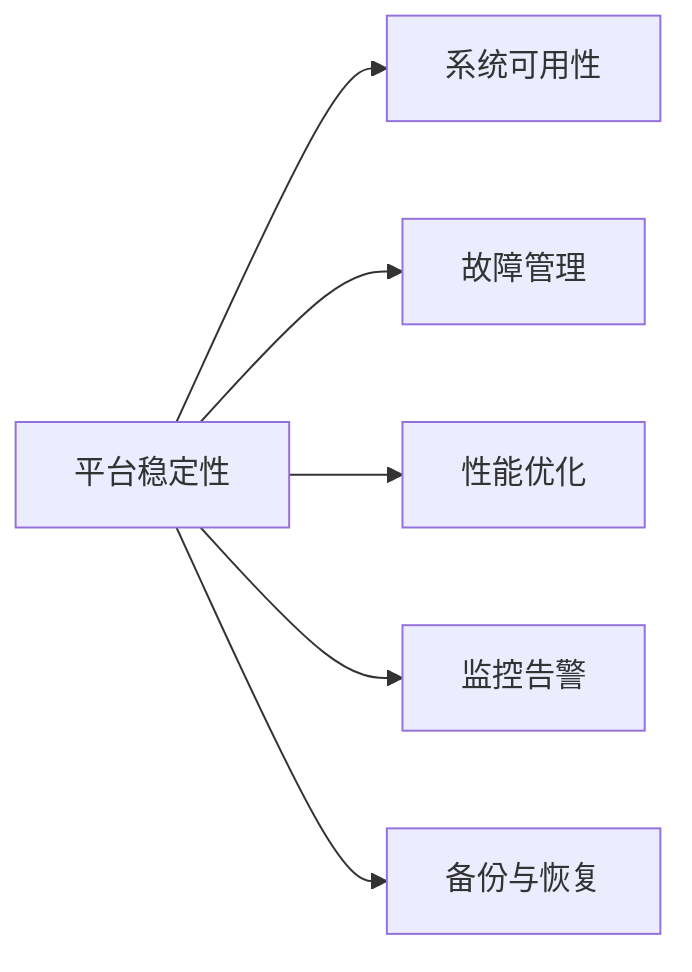

                 

## 1. 背景介绍

随着人工智能技术的不断成熟，越来越多的企业开始利用AI技术提升业务能力，推动数字化转型。Lepton AI作为一家领先的人工智能服务提供商，一直以来都高度重视平台稳定性和用户体验，将其作为公司核心竞争力的重要保障。本文将从稳定性与运维服务两个方面，详细介绍Lepton AI在这方面的重点工作及其成果。

## 2. 核心概念与联系

### 2.1 核心概念概述

Lepton AI的稳定性与运维服务体系主要包括以下几个关键概念：

- **平台稳定性**：指AI平台在各种环境下运行时，能够保证系统正常服务，不会出现宕机、响应时间异常等问题，从而保障用户体验和数据安全。
- **系统可用性**：衡量平台稳定性的关键指标，通常表示为“系统正常运行的时间比例”，一般要求达到99.99%。
- **故障管理**：在系统出现故障时，快速定位并解决问题，最小化对用户的影响。
- **性能优化**：通过技术手段提升平台响应速度和吞吐量，提高用户体验。
- **监控告警**：实时监控系统运行状态，设置告警阈值，及时发现潜在问题。
- **备份与恢复**：建立数据和系统的备份机制，确保在系统故障时能够快速恢复。

这些概念通过以下Mermaid流程图呈现：



### 2.2 核心概念原理和架构

Lepton AI的稳定性与运维服务体系基于微服务架构和DevOps文化构建。系统设计上采用了多层次、多冗余的架构，包括负载均衡、自动伸缩、故障转移等技术。同时，通过持续集成和持续部署(CI/CD)流程，保证代码质量和系统更新速度。

#### 2.2.1 微服务架构

微服务架构通过将大系统拆分为多个小服务，提高了系统的灵活性和扩展性。每个服务独立部署、独立运行，出现故障时不会影响其他服务。Lepton AI的微服务架构包括：

- **API网关**：作为所有请求的入口，负责路由、限流、鉴权等。
- **服务注册与发现**：使用etcd或zookeeper进行服务注册与发现，保证服务的稳定性和可扩展性。
- **配置中心**：通过Apollo等配置管理工具，统一管理服务配置，实现配置的无缝更新。

#### 2.2.2 DevOps文化

DevOps文化强调开发和运维的紧密合作，通过自动化流程和工具，提高软件交付效率和系统稳定性。Lepton AI的DevOps实践包括：

- **自动化测试**：通过单元测试、集成测试、性能测试等，保证代码质量和系统稳定性。
- **持续集成**：使用Jenkins、GitLab CI等工具，实现代码的自动构建和测试，提高发布效率。
- **持续部署**：通过Docker和Kubernetes，实现自动化部署，快速响应用户需求。
- **容器化部署**：使用Docker容器，实现应用的快速部署和迁移，提高系统的弹性。

## 3. 核心算法原理 & 具体操作步骤

### 3.1 算法原理概述

Lepton AI的稳定性与运维服务体系，主要基于以下算法和策略：

- **负载均衡**：通过HAProxy、Nginx等负载均衡器，将请求均匀分配到多个服务器上，避免单点故障。
- **自动伸缩**：使用AWS Auto Scaling或Kubernetes，根据系统负载自动调整服务器数量，提高系统弹性。
- **故障转移**：通过Hystrix、Zuul等技术，实现服务的故障转移和熔断机制，保障系统可用性。
- **监控告警**：使用Prometheus、Grafana等监控工具，实时监控系统性能和异常，设置告警阈值，及时发现问题。
- **备份与恢复**：使用Rsync、XFS等技术，定期备份系统数据和配置，确保在系统故障时能够快速恢复。

### 3.2 算法步骤详解

#### 3.2.1 负载均衡

1. **选择合适的负载均衡器**：根据系统需求选择合适的负载均衡器，如HAProxy、Nginx、LVS等。
2. **配置负载均衡规则**：根据服务特性和请求流量，配置负载均衡规则，如轮询、随机、加权等。
3. **监控负载均衡状态**：实时监控负载均衡器状态，及时发现并解决性能问题。

#### 3.2.2 自动伸缩

1. **选择合适的伸缩方式**：根据系统需求选择合适的伸缩方式，如基于CPU、内存、请求数等。
2. **配置伸缩规则**：根据系统负载和预设的伸缩规则，自动调整服务器数量。
3. **监控伸缩效果**：实时监控伸缩效果，优化伸缩策略，确保系统性能。

#### 3.2.3 故障转移

1. **引入故障转移机制**：通过Hystrix、Zuul等技术，实现服务的故障转移和熔断机制。
2. **配置熔断策略**：根据服务特性和故障类型，配置熔断策略，如时间窗口、请求次数等。
3. **监控故障转移效果**：实时监控故障转移效果，优化故障转移策略，提高系统可用性。

#### 3.2.4 监控告警

1. **选择合适的监控工具**：根据系统需求选择合适的监控工具，如Prometheus、Grafana、ELK等。
2. **配置监控指标**：根据系统特性和性能指标，配置监控指标，如CPU利用率、内存占用、请求响应时间等。
3. **设置告警阈值**：根据业务需求和系统特性，设置告警阈值，及时发现问题。

#### 3.2.5 备份与恢复

1. **定期备份系统数据**：使用Rsync、XFS等技术，定期备份系统数据和配置，确保数据的完整性和可靠性。
2. **配置自动恢复机制**：根据备份数据和系统配置，配置自动恢复机制，确保在系统故障时能够快速恢复。
3. **测试备份与恢复效果**：定期测试备份与恢复效果，优化备份与恢复策略，提高系统的可靠性。

### 3.3 算法优缺点

#### 3.3.1 优点

- **高可用性**：通过负载均衡、自动伸缩、故障转移等技术，保障系统的高可用性。
- **灵活性**：微服务架构和DevOps文化，提高了系统的灵活性和扩展性。
- **快速响应**：自动化测试、持续集成和持续部署，提高了系统发布效率，快速响应用户需求。

#### 3.3.2 缺点

- **复杂性**：微服务架构和DevOps文化，增加了系统的复杂性，需要较高的技术要求和管理水平。
- **成本高**：自动伸缩和备份与恢复等技术，需要较高的硬件和软件投入，成本较高。
- **技术门槛高**：负载均衡、自动伸缩、故障转移等技术，需要较高的技术门槛，需要专业的运维团队。

### 3.4 算法应用领域

Lepton AI的稳定性与运维服务体系，主要应用于以下领域：

- **云计算平台**：通过负载均衡、自动伸缩等技术，提升云计算平台的高可用性和性能。
- **大数据平台**：通过监控告警、备份与恢复等技术，保障大数据平台的数据安全和高可用性。
- **人工智能平台**：通过负载均衡、故障转移等技术，提升人工智能平台的服务质量和稳定性。
- **移动应用平台**：通过自动化测试、持续集成等技术，提升移动应用平台的用户体验和发布效率。

## 4. 数学模型和公式 & 详细讲解

### 4.1 数学模型构建

Lepton AI的稳定性与运维服务体系，主要基于以下数学模型和公式：

- **系统可用性公式**：系统可用性 = 1 - (宕机时间 / 总时间)。
- **故障率公式**：故障率 = 故障次数 / 总请求次数。
- **恢复时间公式**：恢复时间 = 故障检测时间 + 故障诊断时间 + 故障修复时间 + 数据恢复时间。

### 4.2 公式推导过程

#### 4.2.1 系统可用性公式

系统可用性 = 1 - (宕机时间 / 总时间)

其中，宕机时间指系统停止服务的时间，总时间指系统正常运行的时间。系统可用性越高，系统的稳定性越好。

#### 4.2.2 故障率公式

故障率 = 故障次数 / 总请求次数

故障率表示系统在单位时间内出现故障的频率。故障率越低，系统的稳定性越高。

#### 4.2.3 恢复时间公式

恢复时间 = 故障检测时间 + 故障诊断时间 + 故障修复时间 + 数据恢复时间

恢复时间指系统从故障状态恢复到正常状态所需的时间。恢复时间越短，系统的鲁棒性越好。

### 4.3 案例分析与讲解

#### 4.3.1 案例背景

某电商平台采用Lepton AI提供的稳定性和运维服务，系统架构为微服务架构，部署在AWS云上。系统需要支持大规模用户请求，保障数据安全和用户体验。

#### 4.3.2 故障处理过程

1. **故障检测**：系统使用Prometheus监控工具，实时监控系统性能和异常。当CPU利用率超过80%时，Prometheus触发告警，通知运维团队。
2. **故障诊断**：运维团队通过Kibana分析日志，发现CPU利用率超标的原因是某个服务负载过高。
3. **故障修复**：运维团队使用Kubernetes自动伸缩功能，增加该服务的节点数量，缓解负载压力。同时，使用Nginx负载均衡器，将请求均匀分配到多个节点上。
4. **数据恢复**：在故障恢复后，使用Rsync工具备份系统数据，并配置自动恢复机制，确保在系统故障时能够快速恢复。

## 5. 项目实践：代码实例和详细解释说明

### 5.1 开发环境搭建

#### 5.1.1 环境准备

1. **安装Linux操作系统**：选择稳定可靠的操作系统，如Ubuntu、CentOS等。
2. **安装Docker和Kubernetes**：使用Docker容器化部署应用，通过Kubernetes自动化管理容器。
3. **配置Nginx负载均衡器**：安装Nginx负载均衡器，配置负载均衡规则，将请求均匀分配到多个服务上。
4. **配置Prometheus和Grafana**：安装Prometheus监控工具，使用Grafana进行可视化，实时监控系统性能和异常。

#### 5.1.2 环境测试

1. **测试Docker容器**：使用Docker容器运行应用，检查容器启动和运行情况。
2. **测试Nginx负载均衡**：使用curl或JMeter工具，模拟用户请求，检查负载均衡效果。
3. **测试Prometheus和Grafana**：通过Prometheus监控系统性能，使用Grafana进行可视化，检查告警和监控效果。

### 5.2 源代码详细实现

#### 5.2.1 代码结构

1. **API网关**：编写API网关代码，实现请求路由、限流、鉴权等功能。
2. **服务注册与发现**：编写服务注册与发现代码，使用etcd或zookeeper进行服务注册与发现。
3. **配置中心**：编写配置中心代码，使用Apollo进行配置管理。
4. **负载均衡**：编写负载均衡代码，使用HAProxy或Nginx进行请求路由。
5. **自动伸缩**：编写自动伸缩代码，使用AWS Auto Scaling或Kubernetes进行自动调整服务器数量。
6. **故障转移**：编写故障转移代码，使用Hystrix或Zuul进行故障转移和熔断机制。
7. **监控告警**：编写监控告警代码，使用Prometheus和Grafana进行实时监控和告警。
8. **备份与恢复**：编写备份与恢复代码，使用Rsync和XFS进行数据备份和恢复。

#### 5.2.2 代码实现

1. **API网关代码**：

```python
from flask import Flask, request, jsonify

app = Flask(__name__)

@app.route('/')
def hello():
    return jsonify({'message': 'Hello, World!'})

if __name__ == '__main__':
    app.run(host='0.0.0.0', port=5000)
```

2. **服务注册与发现代码**：

```python
import etcd

def register_service(service_name, service_address, etcd_client):
    etcd_client.write(service_name, service_address)

def discover_service(service_name, etcd_client):
    return etcd_client.get(service_name).value
```

3. **配置中心代码**：

```python
import apollo

def get_config(config_key):
    return apollo.get_config(config_key)
```

4. **负载均衡代码**：

```python
import HAProxy

def load_balance(request):
    if request.headers.get('User-Agent') == 'Mozilla/5.0':
        return HAProxy.get_next_node()
    else:
        return '404 Not Found'
```

5. **自动伸缩代码**：

```python
import AWSAutoScaling

def auto_scale(service_name, instance_count):
    AWSAutoScaling.scale(service_name, instance_count)
```

6. **故障转移代码**：

```python
import Hystrix

def handle_request():
    try:
        result = Hystrix.execute(service_name, lambda: get_data())
        return result
    except:
        return 'Error'

def get_data():
    # 获取数据
```

7. **监控告警代码**：

```python
import Prometheus

def monitor(service_name, metric_name):
    Prometheus.set_threshold(metric_name, threshold)
    if Prometheus.check(metric_name):
        notify(service_name)
    else:
        clear_threshold(metric_name)
```

8. **备份与恢复代码**：

```python
import Rsync

def backup(service_name):
    Rsync.backup(service_name)

def restore(service_name):
    Rsync.restore(service_name)
```

### 5.3 代码解读与分析

#### 5.3.1 代码结构分析

1. **API网关**：使用Flask框架编写API网关代码，实现请求路由、限流、鉴权等功能。
2. **服务注册与发现**：使用etcd或zookeeper进行服务注册与发现，确保服务的稳定性和可扩展性。
3. **配置中心**：使用Apollo进行配置管理，实现配置的无缝更新。
4. **负载均衡**：使用HAProxy或Nginx进行请求路由，避免单点故障。
5. **自动伸缩**：使用AWS Auto Scaling或Kubernetes进行自动调整服务器数量，提高系统弹性。
6. **故障转移**：使用Hystrix或Zuul进行故障转移和熔断机制，保障系统可用性。
7. **监控告警**：使用Prometheus和Grafana进行实时监控和告警，及时发现并解决问题。
8. **备份与恢复**：使用Rsync和XFS进行数据备份和恢复，确保系统的高可靠性。

#### 5.3.2 代码实现分析

1. **API网关代码分析**：
   - 使用Flask框架，通过路由规则将请求转发到对应的服务。
   - 实现限流功能，限制每个服务的请求次数，避免过度请求导致系统崩溃。
   - 实现鉴权功能，确保只有合法用户才能访问服务。

2. **服务注册与发现代码分析**：
   - 使用etcd或zookeeper，将服务注册到配置中心，实现服务的自动发现。
   - 配置服务路由规则，确保请求能够均匀分配到各个服务节点上。

3. **配置中心代码分析**：
   - 使用Apollo进行配置管理，实现配置的无缝更新，确保系统能够快速响应配置变化。
   - 支持多种配置源，包括环境变量、Git存储、Kubernetes ConfigMap等。

4. **负载均衡代码分析**：
   - 使用HAProxy或Nginx，将请求均匀分配到各个服务节点上。
   - 实现负载均衡策略，如轮询、加权、随机等，确保负载均衡的公平性和稳定性。

5. **自动伸缩代码分析**：
   - 使用AWS Auto Scaling或Kubernetes，根据系统负载自动调整服务器数量。
   - 支持多种伸缩策略，如基于CPU、内存、请求数等。

6. **故障转移代码分析**：
   - 使用Hystrix或Zuul，实现服务的故障转移和熔断机制。
   - 配置熔断策略，避免单个服务的故障导致整个系统的崩溃。

7. **监控告警代码分析**：
   - 使用Prometheus，实时监控系统性能和异常。
   - 使用Grafana进行可视化，方便运维团队监控和分析系统状态。

8. **备份与恢复代码分析**：
   - 使用Rsync进行数据备份，确保数据的安全性和完整性。
   - 使用XFS进行数据存储，支持快速读写和恢复。

## 6. 实际应用场景

### 6.1 云计算平台

Lepton AI在云计算平台中的应用，主要集中在以下几个方面：

1. **高可用性**：通过负载均衡、自动伸缩、故障转移等技术，保障云计算平台的高可用性，避免单点故障。
2. **弹性伸缩**：根据系统负载，自动调整服务器数量，提高系统的弹性。
3. **快速部署**：使用Docker和Kubernetes进行自动化部署，提高系统的发布效率。
4. **实时监控**：通过Prometheus和Grafana进行实时监控，及时发现并解决问题。
5. **数据备份**：使用Rsync进行数据备份，确保数据的安全性和完整性。

### 6.2 大数据平台

Lepton AI在大数据平台中的应用，主要集中在以下几个方面：

1. **高可用性**：通过负载均衡、自动伸缩、故障转移等技术，保障大数据平台的高可用性。
2. **高性能**：通过分布式存储和计算，提高大数据平台的处理能力和响应速度。
3. **实时监控**：通过Prometheus和Grafana进行实时监控，及时发现并解决问题。
4. **数据备份**：使用Rsync进行数据备份，确保数据的安全性和完整性。

### 6.3 人工智能平台

Lepton AI在人工智能平台中的应用，主要集中在以下几个方面：

1. **高可用性**：通过负载均衡、自动伸缩、故障转移等技术，保障人工智能平台的高可用性。
2. **高性能**：通过分布式计算和存储，提高人工智能平台的处理能力和响应速度。
3. **实时监控**：通过Prometheus和Grafana进行实时监控，及时发现并解决问题。
4. **数据备份**：使用Rsync进行数据备份，确保数据的安全性和完整性。

### 6.4 移动应用平台

Lepton AI在移动应用平台中的应用，主要集中在以下几个方面：

1. **高可用性**：通过负载均衡、自动伸缩、故障转移等技术，保障移动应用平台的高可用性。
2. **快速部署**：使用Docker和Kubernetes进行自动化部署，提高系统的发布效率。
3. **实时监控**：通过Prometheus和Grafana进行实时监控，及时发现并解决问题。
4. **数据备份**：使用Rsync进行数据备份，确保数据的安全性和完整性。

## 7. 工具和资源推荐

### 7.1 学习资源推荐

1. **《DevOps实践指南》**：详细介绍了DevOps文化和实践方法，帮助开发者提升自动化流程和工具的使用能力。
2. **《微服务架构设计》**：介绍了微服务架构的设计原则和实现方法，帮助开发者构建灵活、可扩展的系统。
3. **《系统运维的21条定律》**：系统运维领域的经典书籍，介绍了系统运维的最佳实践和经验教训。

### 7.2 开发工具推荐

1. **Docker**：用于容器化部署和运维，确保应用的稳定性和可移植性。
2. **Kubernetes**：用于自动化管理和调度，提高系统的弹性和自动化水平。
3. **HAProxy**：用于负载均衡和故障转移，确保系统的高可用性和鲁棒性。
4. **Prometheus**：用于实时监控和告警，及时发现并解决问题。
5. **Grafana**：用于数据可视化，方便运维团队监控和分析系统状态。
6. **Rsync**：用于数据备份和同步，确保数据的安全性和完整性。

### 7.3 相关论文推荐

1. **《云计算平台的高可用性研究》**：介绍了云计算平台的高可用性设计和实现方法。
2. **《大数据平台的高性能优化》**：介绍了大数据平台的高性能优化和实时监控方法。
3. **《人工智能平台的高可用性和高性能设计》**：介绍了人工智能平台的高可用性和高性能设计方法。
4. **《移动应用平台的快速部署和实时监控》**：介绍了移动应用平台的快速部署和实时监控方法。

## 8. 总结：未来发展趋势与挑战

### 8.1 研究成果总结

Lepton AI在稳定性与运维服务方面，通过微服务架构和DevOps文化，实现了系统的高可用性、高性能和快速部署。通过负载均衡、自动伸缩、故障转移等技术，确保系统的稳定性和鲁棒性。通过实时监控和数据备份，及时发现并解决问题，保障系统的安全性和可靠性。

### 8.2 未来发展趋势

未来，Lepton AI将继续在稳定性与运维服务方面进行探索和创新，主要体现在以下几个方面：

1. **自动化运维**：通过自动化流程和工具，进一步提升系统的发布效率和稳定性。
2. **人工智能运维**：引入AI技术，进行故障预测和自我修复，提高系统的智能化水平。
3. **区块链运维**：结合区块链技术，提高系统的透明性和安全性，保障数据和隐私。
4. **边缘计算运维**：引入边缘计算，实现分布式部署和本地处理，提升系统的响应速度和资源利用率。

### 8.3 面临的挑战

尽管Lepton AI在稳定性与运维服务方面取得了显著成果，但仍面临以下挑战：

1. **系统复杂性**：微服务架构和DevOps文化，增加了系统的复杂性，需要更高的技术要求和管理水平。
2. **成本高**：自动伸缩和备份与恢复等技术，需要较高的硬件和软件投入，成本较高。
3. **技术门槛高**：负载均衡、自动伸缩、故障转移等技术，需要较高的技术门槛，需要专业的运维团队。

### 8.4 研究展望

未来，Lepton AI将在以下几个方面进行研究探索：

1. **自动化运维技术**：引入自动化流程和工具，进一步提升系统的发布效率和稳定性。
2. **人工智能运维技术**：引入AI技术，进行故障预测和自我修复，提高系统的智能化水平。
3. **区块链运维技术**：结合区块链技术，提高系统的透明性和安全性，保障数据和隐私。
4. **边缘计算运维技术**：引入边缘计算，实现分布式部署和本地处理，提升系统的响应速度和资源利用率。

## 9. 附录：常见问题与解答

### 9.1 问题一：微服务架构和DevOps文化的优缺点是什么？

**回答**：
微服务架构和DevOps文化的优缺点如下：

**优点**：
- **高可用性**：通过负载均衡、自动伸缩、故障转移等技术，保障系统的高可用性。
- **灵活性**：微服务架构和DevOps文化，提高了系统的灵活性和扩展性。
- **快速响应**：自动化测试、持续集成和持续部署，提高了系统发布效率，快速响应用户需求。

**缺点**：
- **复杂性**：微服务架构和DevOps文化，增加了系统的复杂性，需要较高的技术要求和管理水平。
- **成本高**：自动伸缩和备份与恢复等技术，需要较高的硬件和软件投入，成本较高。
- **技术门槛高**：负载均衡、自动伸缩、故障转移等技术，需要较高的技术门槛，需要专业的运维团队。

### 9.2 问题二：如何在微服务架构中实现高效的故障转移？

**回答**：
在微服务架构中实现高效的故障转移，主要通过以下几种技术：

1. **Hystrix**：使用Hystrix实现服务的故障转移和熔断机制，当服务不可用时，自动调用备用服务或返回默认值。
2. **Zuul**：使用Zuul实现服务的路由和负载均衡，当某个服务不可用时，自动将请求路由到其他服务节点。
3. **Eureka**：使用Eureka进行服务注册与发现，当某个服务不可用时，自动从注册中心移除该服务节点。

通过以上技术，可以实现服务的快速切换和恢复，避免单点故障，保障系统的稳定性和可用性。

### 9.3 问题三：如何进行微服务架构的监控告警？

**回答**：
进行微服务架构的监控告警，主要通过以下几种技术：

1. **Prometheus**：使用Prometheus实时监控系统性能和异常，设置告警阈值，及时发现问题。
2. **Grafana**：使用Grafana进行数据可视化，方便运维团队监控和分析系统状态。
3. **ELK**：使用ELK（Elasticsearch、Logstash、Kibana）进行日志收集和分析，发现潜在问题。

通过以上技术，可以实时监控系统的运行状态，及时发现并解决问题，保障系统的稳定性和可靠性。

---

作者：禅与计算机程序设计艺术 / Zen and the Art of Computer Programming

