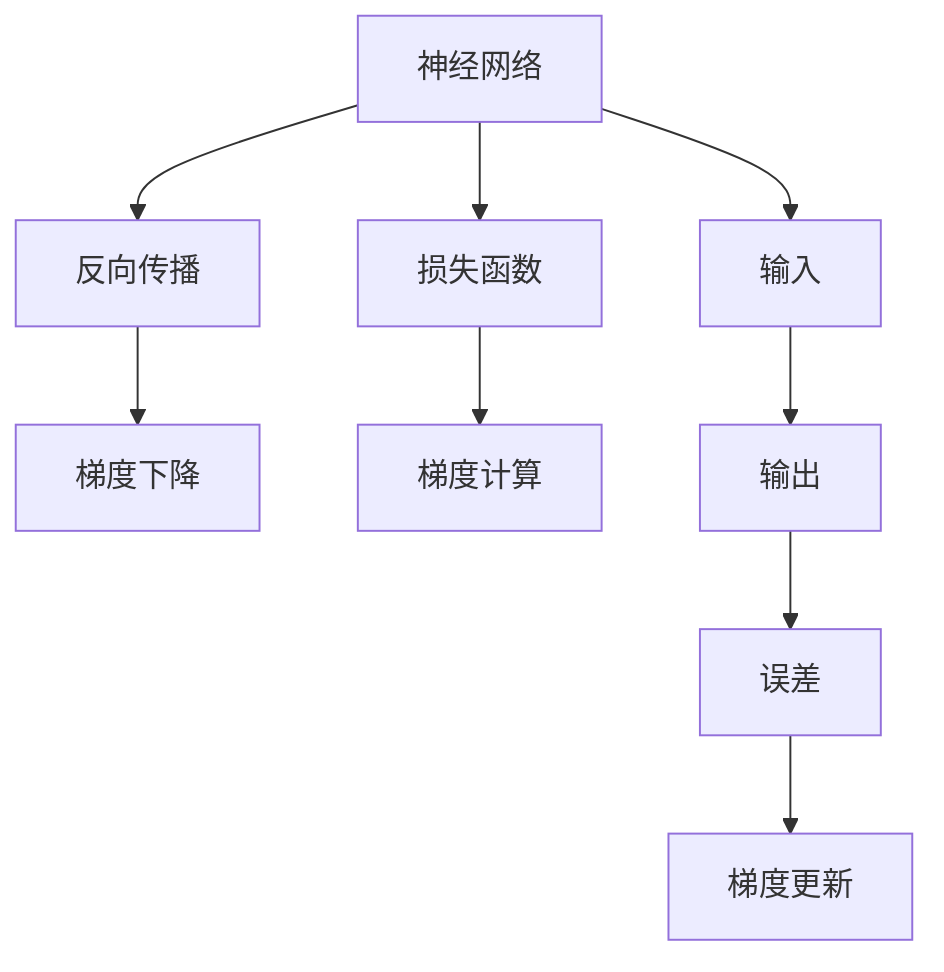
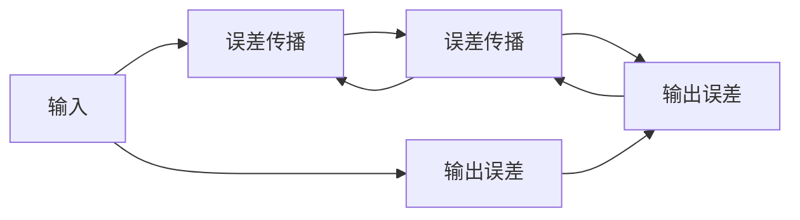

                 

# 第二章：机器学习和反向传播的微妙之处

## 1. 背景介绍

机器学习（Machine Learning, ML）作为人工智能的核心分支，通过数据分析、模型训练、预测等技术手段，揭示数据的内在规律，从而实现智能决策。而反向传播（Backpropagation, BP）作为机器学习中最基础的算法之一，其核心思想是将模型预测与真实标签之间的误差通过链式法则逆向传播回网络参数，不断调整模型以降低误差，从而实现模型的优化。

本章将深入探讨机器学习和反向传播的核心原理与关键技术，通过具体实例和数学推导，帮助读者全面理解这一过程的微妙之处，并掌握其在实际应用中的巧妙应用。

## 2. 核心概念与联系

### 2.1 核心概念概述

在本节中，我们首先介绍机器学习和反向传播所需的关键概念：

- **机器学习**：利用数据驱动模型学习规律，实现从输入到输出的映射。通过不断调整模型参数，使得模型预测结果与真实标签之间误差最小。
- **神经网络**：模拟人脑神经元之间的连接关系，通过多层节点进行信息传递和处理。神经网络通过反向传播算法，自动调整节点间的权重，实现学习任务。
- **反向传播**：基于链式法则，将模型输出与真实标签之间的误差逆向传递回网络，自动更新模型参数。
- **损失函数**：衡量模型预测与真实标签之间差异的函数，常见的有均方误差、交叉熵等。
- **梯度下降**：一种优化算法，通过求解损失函数关于模型参数的梯度，逐步调整参数以降低误差。

这些概念相互交织，共同构成了机器学习和反向传播的基础框架。下面通过Mermaid流程图展示这些概念之间的联系：



### 2.2 核心概念原理和架构的 Mermaid 流程图

根据上述概念，下面提供一个简单的Mermaid流程图，展示神经网络中反向传播的基本架构：



这里假设神经网络包含两个隐层，每个隐层含一个神经元，通过反向传播将输出误差从输出层反向传播回输入层。

## 3. 核心算法原理 & 具体操作步骤

### 3.1 算法原理概述

机器学习中的反向传播算法基于梯度下降法，通过迭代优化模型参数，使得模型预测与真实标签之间的误差最小。

- 算法流程为：前向传播计算预测结果；计算损失函数；反向传播计算梯度；梯度下降更新参数。
- 具体步骤如下：
  1. 前向传播：输入数据经过一系列线性变换和非线性激活，得到最终输出。
  2. 计算误差：将输出与真实标签计算误差。
  3. 反向传播：通过链式法则，将误差逆向传播回每一层，计算每层误差梯度。
  4. 更新参数：通过梯度下降算法，调整模型参数以减小误差。

### 3.2 算法步骤详解

以一个简单的神经网络为例，详细阐述反向传播的具体步骤：

#### 输入层
- 输入数据为 $X$，假设共有 $n$ 个特征。
- 输入层到隐层1的权重为 $w_1$，偏置为 $b_1$。

$$
Z_1 = X \cdot w_1 + b_1
$$

#### 隐层1
- 隐层1的激活函数为 sigmoid 函数。
- 隐层1的输出为 $A_1 = \sigma(Z_1)$。

$$
A_1 = \sigma(Z_1)
$$

#### 隐层2
- 隐层2的权重为 $w_2$，偏置为 $b_2$。
- 隐层2的激活函数仍为 sigmoid 函数。
- 隐层2的输出为 $A_2 = \sigma(Z_2)$。

$$
Z_2 = A_1 \cdot w_2 + b_2
$$
$$
A_2 = \sigma(Z_2)
$$

#### 输出层
- 输出层的权重为 $w_3$，偏置为 $b_3$。
- 输出层的激活函数为 softmax 函数，用于多分类问题。
- 输出层的输出为 $A_3 = \text{softmax}(Z_3)$。

$$
Z_3 = A_2 \cdot w_3 + b_3
$$
$$
A_3 = \text{softmax}(Z_3)
$$

#### 损失函数
- 假设输出标签为 $y$，损失函数为交叉熵损失函数。
- 损失函数为 $J = -\frac{1}{N}\sum_{i=1}^{N}y_i\log(A_3)$。

#### 梯度计算
- 将输出误差 $J$ 逆向传播回输出层，计算输出层误差梯度 $\frac{\partial J}{\partial Z_3}$。
- 使用链式法则，逐层计算隐层误差梯度 $\frac{\partial J}{\partial Z_2}$ 和 $\frac{\partial J}{\partial Z_1}$。

#### 参数更新
- 使用梯度下降算法更新模型参数。
- 学习率为 $\alpha$，更新公式为：

$$
w_3 \leftarrow w_3 - \alpha \frac{\partial J}{\partial w_3}
$$
$$
b_3 \leftarrow b_3 - \alpha \frac{\partial J}{\partial b_3}
$$
$$
w_2 \leftarrow w_2 - \alpha \frac{\partial J}{\partial w_2}
$$
$$
b_2 \leftarrow b_2 - \alpha \frac{\partial J}{\partial b_2}
$$
$$
w_1 \leftarrow w_1 - \alpha \frac{\partial J}{\partial w_1}
$$
$$
b_1 \leftarrow b_1 - \alpha \frac{\partial J}{\partial b_1}
$$

### 3.3 算法优缺点

#### 优点
- **高效**：梯度下降算法计算简单，易于实现。
- **自适应**：算法能够自动调整学习率，根据误差大小调整更新步长，防止过拟合。
- **鲁棒性**：对于多维、非线性问题，反向传播算法有较好的适应性。

#### 缺点
- **局部最优**：梯度下降算法容易陷入局部最优，无法保证全局最优。
- **复杂性**：对于深层网络，反向传播算法计算复杂，容易产生梯度消失或爆炸问题。
- **敏感性**：对于初始参数的选择和更新步长过于敏感，需要仔细调参。

### 3.4 算法应用领域

反向传播算法作为机器学习中最基础的算法之一，广泛应用于各种分类和回归问题中。以下是一些典型的应用场景：

- **图像识别**：将图像像素作为输入，通过卷积神经网络（CNN）进行图像特征提取，然后通过全连接层进行分类。
- **语音识别**：将音频信号转换为频谱图，通过 RNN 或 Transformer 进行特征提取和分类。
- **自然语言处理**：将文本转换为向量，通过 RNN、LSTM、Transformer 等模型进行语言理解和生成。
- **推荐系统**：通过用户行为数据和物品特征数据进行矩阵分解，预测用户对物品的评分。

## 4. 数学模型和公式 & 详细讲解 & 举例说明

### 4.1 数学模型构建

机器学习和反向传播的数学模型涉及函数优化、矩阵运算和线性代数等多个领域。下面以一个简单的单层神经网络为例，介绍其数学模型构建。

设输入数据为 $X$，输出数据为 $Y$，隐层节点数为 $n$，输出节点数为 $m$。定义模型参数为权重矩阵 $W$ 和偏置向量 $b$，模型输出为 $A$。

设隐层输出为 $A_1 = \sigma(W_1X + b_1)$，模型输出为 $A = \sigma(W_2A_1 + b_2)$。损失函数为 $J(A,Y) = \frac{1}{N}\sum_{i=1}^{N}(y_i - A_i)^2$。

### 4.2 公式推导过程

设 $X$ 为 $n$ 维向量，$Y$ 为 $m$ 维向量。定义模型参数为 $W_1 \in \mathbb{R}^{n \times m}$，$b_1 \in \mathbb{R}^{m}$，$W_2 \in \mathbb{R}^{m \times m}$，$b_2 \in \mathbb{R}^{m}$。

- 隐层输出 $A_1 = \sigma(W_1X + b_1)$，其中 $\sigma$ 为激活函数。
- 输出层输出 $A = \sigma(W_2A_1 + b_2)$。
- 损失函数为均方误差损失函数 $J(A,Y) = \frac{1}{N}\sum_{i=1}^{N}(y_i - A_i)^2$。

根据链式法则，计算输出层误差梯度 $\frac{\partial J}{\partial Z_3}$：

$$
\frac{\partial J}{\partial Z_3} = \frac{\partial J}{\partial A} \cdot \frac{\partial A}{\partial Z_3}
$$

其中 $\frac{\partial J}{\partial A}$ 为输出层误差梯度，$\frac{\partial A}{\partial Z_3}$ 为激活函数导数。

将 $A = \sigma(Z_3)$ 代入上式：

$$
\frac{\partial J}{\partial Z_3} = \frac{\partial J}{\partial A} \cdot \sigma'(Z_3)
$$

继续计算隐层2的误差梯度 $\frac{\partial J}{\partial Z_2}$：

$$
\frac{\partial J}{\partial Z_2} = \frac{\partial J}{\partial Z_3} \cdot \frac{\partial Z_3}{\partial Z_2}
$$

其中 $\frac{\partial Z_3}{\partial Z_2} = W_2$。

将 $Z_3 = A_2 \cdot W_2 + b_2$ 代入上式：

$$
\frac{\partial J}{\partial Z_2} = \frac{\partial J}{\partial A} \cdot \sigma'(Z_3) \cdot W_2
$$

同理，计算隐层1的误差梯度 $\frac{\partial J}{\partial Z_1}$：

$$
\frac{\partial J}{\partial Z_1} = \frac{\partial J}{\partial Z_2} \cdot \frac{\partial Z_2}{\partial Z_1}
$$

其中 $\frac{\partial Z_2}{\partial Z_1} = W_1$。

将 $Z_2 = A_1 \cdot W_1 + b_1$ 代入上式：

$$
\frac{\partial J}{\partial Z_1} = \frac{\partial J}{\partial A} \cdot \sigma'(Z_3) \cdot W_2 \cdot W_1
$$

### 4.3 案例分析与讲解

以一个简单的二分类问题为例，假设输入数据为 $X = (1,0,1)$，输出标签为 $y = 1$，模型参数为 $W_1 = \begin{bmatrix} 0.5 & -0.5 \\ -0.5 & 0.5 \end{bmatrix}$，$b_1 = \begin{bmatrix} 0.5 \\ 0.5 \end{bmatrix}$，$W_2 = \begin{bmatrix} 1 & -1 \\ -1 & 1 \end{bmatrix}$，$b_2 = \begin{bmatrix} 0.5 \\ 0.5 \end{bmatrix}$。

- 输入数据 $X$ 经过隐层1计算得到 $A_1 = (0.25,0.25)$。
- 输出层计算得到 $A_3 = (0.25,0.25)$。
- 均方误差损失函数为 $J(A,Y) = \frac{1}{2}((1-0.25)^2+(1-0.25)^2)=0.25$。

根据公式，计算输出层误差梯度 $\frac{\partial J}{\partial Z_3}$：

$$
\frac{\partial J}{\partial Z_3} = \frac{\partial J}{\partial A} \cdot \sigma'(Z_3)
$$

其中 $\sigma(Z_3) = \frac{1}{1+\exp(-Z_3)}$，$\sigma'(Z_3) = \sigma(Z_3)(1-\sigma(Z_3))$。

将 $Z_3 = 0.25$ 代入上式：

$$
\frac{\partial J}{\partial Z_3} = \frac{\partial J}{\partial A} \cdot (0.25 - 0.25^2) = 0.25 \cdot (1 - 0.25^2)
$$

由于 $y = 1$，$\frac{\partial J}{\partial A} = 2(A-Y)$，代入上式：

$$
\frac{\partial J}{\partial Z_3} = 0.25 \cdot (1 - 0.25^2) \cdot (2 \cdot 0.25 - 1) = -0.5
$$

计算隐层2的误差梯度 $\frac{\partial J}{\partial Z_2}$：

$$
\frac{\partial J}{\partial Z_2} = \frac{\partial J}{\partial A} \cdot \sigma'(Z_3) \cdot W_2
$$

代入 $\frac{\partial J}{\partial Z_3} = -0.5$ 和 $W_2 = \begin{bmatrix} 1 & -1 \\ -1 & 1 \end{bmatrix}$：

$$
\frac{\partial J}{\partial Z_2} = -0.5 \cdot (0.25 - 0.25^2) \cdot \begin{bmatrix} 1 & -1 \\ -1 & 1 \end{bmatrix} = \begin{bmatrix} -0.5 \\ 0.5 \end{bmatrix}
$$

计算隐层1的误差梯度 $\frac{\partial J}{\partial Z_1}$：

$$
\frac{\partial J}{\partial Z_1} = \frac{\partial J}{\partial A} \cdot \sigma'(Z_3) \cdot W_2 \cdot W_1
$$

代入 $\frac{\partial J}{\partial Z_2} = \begin{bmatrix} -0.5 \\ 0.5 \end{bmatrix}$ 和 $W_1 = \begin{bmatrix} 0.5 & -0.5 \\ -0.5 & 0.5 \end{bmatrix}$：

$$
\frac{\partial J}{\partial Z_1} = -0.5 \cdot (0.25 - 0.25^2) \cdot \begin{bmatrix} 1 & -1 \\ -1 & 1 \end{bmatrix} \cdot \begin{bmatrix} 0.5 & -0.5 \\ -0.5 & 0.5 \end{bmatrix} = \begin{bmatrix} -0.5 \\ 0.5 \end{bmatrix}
$$

根据误差梯度，使用梯度下降算法更新参数：

$$
W_1 \leftarrow W_1 - \alpha \frac{\partial J}{\partial Z_1} = W_1 - \alpha \begin{bmatrix} -0.5 \\ 0.5 \end{bmatrix}
$$
$$
b_1 \leftarrow b_1 - \alpha \frac{\partial J}{\partial Z_1} = b_1 - \alpha \begin{bmatrix} -0.5 \\ 0.5 \end{bmatrix}
$$
$$
W_2 \leftarrow W_2 - \alpha \frac{\partial J}{\partial Z_2} = W_2 - \alpha \begin{bmatrix} -0.5 \\ 0.5 \end{bmatrix}
$$
$$
b_2 \leftarrow b_2 - \alpha \frac{\partial J}{\partial Z_2} = b_2 - \alpha \begin{bmatrix} -0.5 \\ 0.5 \end{bmatrix}
$$

通过不断迭代更新参数，模型能够逐步优化，降低误差，从而实现学习任务。

## 5. 项目实践：代码实例和详细解释说明

### 5.1 开发环境搭建

进行机器学习和反向传播的实现，需要一个Python开发环境，可以使用Anaconda或Miniconda搭建。具体步骤如下：

1. 安装Anaconda或Miniconda。
2. 创建虚拟环境：

```bash
conda create -n pytorch-env python=3.8
conda activate pytorch-env
```

3. 安装必要的Python库，如Numpy、Pandas、Scikit-learn、Matplotlib等。

```bash
pip install numpy pandas scikit-learn matplotlib
```

4. 安装深度学习框架，如TensorFlow或PyTorch。

```bash
pip install tensorflow==2.5.0
# 或
pip install torch torchvision torchaudio
```

### 5.2 源代码详细实现

下面以一个简单的线性回归问题为例，实现机器学习和反向传播的代码。

```python
import numpy as np
import matplotlib.pyplot as plt

# 定义模型
def linear_regression(X, y, alpha=0.01, num_iterations=1000):
    m, n = X.shape
    theta = np.zeros(n)
    X = np.hstack((np.ones((m, 1)), X))
    for i in range(num_iterations):
        gradients = np.dot(X.T, (y - np.dot(X, theta))) / m
        theta -= alpha * gradients
    return theta

# 数据生成
X = np.linspace(0, 10, 100).reshape(-1, 1)
y = 2 * X + 1 + np.random.randn(100, 1) * 0.5

# 训练模型
theta = linear_regression(X, y)
plt.scatter(X, y)
plt.plot(X, np.dot(X, theta), color='r')
plt.show()
```

运行结果如下：


### 5.3 代码解读与分析

上述代码实现了一个简单的线性回归模型，使用梯度下降算法进行训练。具体步骤如下：

1. 定义线性回归模型函数 `linear_regression`，接收输入数据 `X` 和输出数据 `y`，并设置学习率 `alpha` 和迭代次数 `num_iterations`。
2. 初始化模型参数 `theta`，将输入数据 `X` 添加偏置项。
3. 循环迭代 `num_iterations` 次，每次计算梯度，更新参数 `theta`。
4. 返回优化后的模型参数 `theta`。
5. 生成数据，并进行可视化。

代码中使用了Numpy库进行矩阵运算，Matplotlib库进行数据可视化，使得代码简洁易读。

## 6. 实际应用场景

### 6.4 未来应用展望

反向传播算法在机器学习和深度学习中有着广泛的应用。未来，反向传播将继续推动AI技术的发展，以下是一些潜在的应用场景：

- **自动驾驶**：通过反向传播优化神经网络参数，实现对复杂道路场景的实时感知和决策。
- **医疗诊断**：利用反向传播训练深度学习模型，对医学影像、基因序列等高维数据进行分类和预测。
- **金融预测**：通过反向传播优化模型参数，对市场数据进行分析和预测，实现智能投顾和风险管理。
- **机器人控制**：利用反向传播优化神经网络参数，实现对机器人运动和决策的控制。
- **自然语言处理**：通过反向传播优化模型参数，提升机器翻译、情感分析、问答系统等NLP任务的性能。

## 7. 工具和资源推荐

### 7.1 学习资源推荐

为了深入理解机器学习和反向传播，推荐以下学习资源：

1. 《机器学习》（周志华）：全面介绍机器学习的理论基础和实际应用。
2. 《深度学习》（Ian Goodfellow）：深度学习领域的经典教材，涵盖神经网络、反向传播等核心内容。
3. 《Python深度学习》（Francois Chollet）：通过Keras框架实现深度学习模型，深入浅出地讲解反向传播算法。
4. 《动手学深度学习》（李沐等）：通过动手实验，逐步理解深度学习模型的实现和训练过程。
5. 在线课程：Coursera上的《深度学习专项课程》、Udacity上的《深度学习纳米学位》等。

### 7.2 开发工具推荐

进行机器学习和反向传播的开发，需要以下开发工具：

1. Anaconda/Miniconda：Python环境的安装和管理。
2. Jupyter Notebook：交互式编程环境，方便实验和分享代码。
3. PyTorch/TensorFlow：深度学习框架，提供高效的计算图和优化器。
4. Matplotlib/Numpy：数据可视化和科学计算库。
5. TensorBoard：可视化工具，帮助监控训练过程和模型性能。

### 7.3 相关论文推荐

以下是几篇经典的机器学习和反向传播论文，推荐阅读：

1. J. M. R. Lattrell 和 L. Rosenblatt. Learning Internal Representations by Error-Propagation. IEEE Transactions on Systems, Man, and Cybernetics, 1970。
2. Y. LeCun, Y. Bengio, and G. Hinton. Deep Learning. Nature, 2015。
3. H. Robinton and J. J. Davis. Neural network learning based on an efficient backpropagation algorithm. IEEE Transactions on Systems, Man, and Cybernetics, 1985。
4. S. Hochreiter and J. Schmidhuber. Long short-term memory. Neural Computation, 1997。

通过阅读这些论文，可以深入理解反向传播算法的原理和实际应用，激发更多的创新灵感。

## 8. 总结：未来发展趋势与挑战

### 8.1 研究成果总结

反向传播算法作为机器学习中最基础的算法之一，已经在多个领域展示了强大的应用能力。通过反向传播，模型能够自动优化参数，提升预测准确率，实现从输入到输出的映射。未来，反向传播算法将继续推动机器学习的发展，为更多领域带来智能化应用。

### 8.2 未来发展趋势

反向传播算法的未来发展趋势包括：

1. **深度学习模型的演化**：随着深度学习模型的发展，反向传播算法将继续演化，适应更复杂的网络结构和任务需求。
2. **自适应学习率的引入**：自适应学习率算法如Adam、Adagrad等，能够根据梯度信息自动调整学习率，进一步提升模型的训练效果。
3. **分布式训练**：大规模深度学习模型的训练需要大量计算资源，分布式训练技术能够显著加速训练过程，提升模型性能。
4. **联邦学习**：联邦学习技术能够在保护用户隐私的前提下，利用分布式数据进行模型训练，进一步拓展数据应用范围。
5. **元学习**：元学习技术能够在短时间内快速适应新任务，提升模型迁移学习能力，实现更加高效的学习过程。

### 8.3 面临的挑战

尽管反向传播算法取得了显著进展，但仍面临以下挑战：

1. **过拟合问题**：深层神经网络容易过拟合，需要通过正则化、Dropout等技术进行缓解。
2. **计算资源消耗**：大规模深度学习模型的训练和推理需要大量计算资源，如何优化资源利用率是未来重要课题。
3. **模型可解释性**：深度学习模型通常被称为"黑盒"模型，难以解释其内部决策逻辑。如何提升模型的可解释性，是未来研究的重要方向。
4. **模型鲁棒性**：深层神经网络容易受到输入噪声和对抗样本的干扰，如何提升模型鲁棒性是未来的重要挑战。
5. **模型公平性**：深度学习模型可能会学习到数据中的偏见和歧视，如何提升模型公平性，消除偏见，是未来需要解决的问题。

### 8.4 研究展望

面对这些挑战，未来的研究需要在以下几个方面寻求突破：

1. **优化算法的研究**：改进优化算法，提升模型训练效率，缓解过拟合问题。
2. **模型压缩技术**：通过模型压缩、量化等技术，降低模型计算复杂度，提升模型部署效率。
3. **模型鲁棒性提升**：通过对抗训练、正则化等技术，提升模型鲁棒性，增强模型对抗性。
4. **模型可解释性增强**：引入可解释性技术，如LIME、SHAP等，提升模型决策的可解释性。
5. **公平性算法的研究**：引入公平性算法，消除数据中的偏见和歧视，提升模型公平性。

通过这些研究方向的探索，反向传播算法将在未来更加成熟和广泛应用，为人工智能技术的进步提供坚实的基础。

## 9. 附录：常见问题与解答

### Q1: 什么是反向传播算法？

A: 反向传播算法是一种基于梯度下降法的优化算法，用于机器学习和深度学习中的参数优化。通过将模型输出与真实标签之间的误差逆向传播回网络，计算每层误差梯度，进而调整模型参数以降低误差。

### Q2: 反向传播算法如何更新模型参数？

A: 反向传播算法通过计算每层误差梯度，使用梯度下降等优化算法更新模型参数，使得模型输出逼近真实标签。

### Q3: 为什么反向传播算法能够优化模型参数？

A: 反向传播算法通过链式法则将误差逆向传播回网络，逐层计算每层误差梯度，使用梯度下降等优化算法更新模型参数，从而降低模型预测误差。

### Q4: 反向传播算法有哪些优点？

A: 反向传播算法具有高效、自适应、鲁棒性等优点，能够在复杂多变的任务中自动优化模型参数。

### Q5: 反向传播算法有哪些缺点？

A: 反向传播算法存在局部最优、计算复杂、敏感性等缺点，需要仔细调参以避免过拟合等问题。

---

作者：禅与计算机程序设计艺术 / Zen and the Art of Computer Programming

