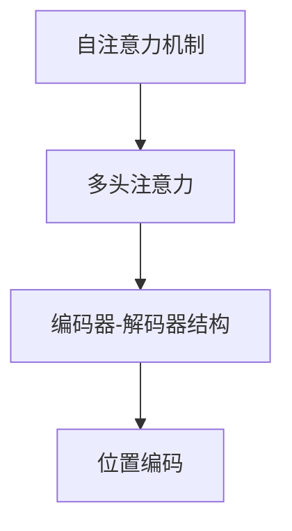

                 

# 第五章：Transformer 架构的革命

## 1. 背景介绍

### 1.1 问题由来

Transformer 架构自 2017 年提出以来，彻底改变了深度学习领域的面貌，尤其是自然语言处理 (NLP) 领域。在 2018 年发布的 BERT 模型中，Transformer 首次展现出了超越传统 RNN 架构的强大能力，实现了在多个 NLP 任务上的突破。然而，传统的基于循环神经网络 (RNN) 的架构在处理长序列数据时，由于梯度消失或爆炸等问题，难以进行有效建模。Transformer 架构通过引入自注意力机制，解决了这些问题，并在翻译、语言建模等任务中取得了显著成果。

### 1.2 问题核心关键点

Transformer 架构的核心创新在于其自注意力机制和多头注意力 (Multi-Head Attention)，使得模型能够并行地处理序列中的所有位置，从而大幅提升了计算效率和模型性能。其原理是通过多头注意力模块，让模型同时关注输入序列的多个位置，从而捕捉到序列中更丰富的语义信息。Transformer 模型通常由编码器和解码器两部分构成，编码器用于提取输入序列的语义表示，解码器用于生成目标序列的输出。

### 1.3 问题研究意义

Transformer 架构的研究和应用对于深度学习领域具有重要意义：

1. **提升了模型效率**：通过并行计算，Transformer 模型能够在更短的训练时间内达到与传统 RNN 相当的性能。
2. **扩大了应用场景**：Transformer 模型的灵活性使得其能够应用于更广泛的 NLP 任务，如机器翻译、文本生成、对话系统等。
3. **促进了深度学习的发展**：Transformer 架构的成功应用为其他领域的深度学习模型提供了新的思路和框架。

## 2. 核心概念与联系

### 2.1 核心概念概述

为更好地理解 Transformer 架构的革命性变化，本节将介绍几个关键概念：

- **自注意力机制 (Self-Attention)**：是 Transformer 架构的核心，允许模型同时关注输入序列中的所有位置，从而捕捉长距离依赖关系。
- **多头注意力 (Multi-Head Attention)**：将输入序列分成多个子序列，每个子序列都使用独立的多头注意力机制进行计算，从而获取多方面的语义信息。
- **编码器-解码器结构 (Encoder-Decoder Architecture)**：Transformer 模型通常由多个编码器层和多个解码器层组成，用于提取输入序列的语义表示和生成输出序列。
- **位置编码 (Positional Encoding)**：Transformer 模型需要处理序列中的位置信息，使用位置编码方法将位置信息嵌入到输入向量中。

这些核心概念之间的逻辑关系可以通过以下 Mermaid 流程图来展示：



这个流程图展示了这个架构的关键组成部分及其之间的联系。

## 3. 核心算法原理 & 具体操作步骤
### 3.1 算法原理概述

Transformer 架构通过并行计算和自注意力机制，显著提升了模型处理序列数据的能力。其核心算法原理可以归纳为以下几个步骤：

1. **输入序列预处理**：对输入序列进行分词、编码等预处理，生成输入向量。
2. **位置编码**：将位置信息嵌入到输入向量中，以便模型理解序列中每个位置的意义。
3. **多头注意力计算**：将输入向量分解为多个子序列，对每个子序列分别进行多头注意力计算，得到不同的语义表示。
4. **前向传播**：将多头注意力计算的结果进行拼接和线性变换，得到最终的中间表示。
5. **输出序列生成**：通过解码器生成目标序列的输出，使用多头注意力机制将中间表示与输出序列对齐，进行解码。

### 3.2 算法步骤详解

以 BERT 模型为例，详细讲解其核心算法的详细步骤：

1. **输入序列预处理**：将输入序列进行分词，并转换为词嵌入向量。
2. **位置编码**：将位置信息嵌入到词嵌入向量中。
3. **多头注意力计算**：将输入序列分解为多个子序列，对每个子序列进行多头注意力计算，得到不同的语义表示。
4. **前向传播**：将多头注意力计算的结果进行拼接和线性变换，得到最终的中间表示。
5. **输出序列生成**：通过解码器生成目标序列的输出，使用多头注意力机制将中间表示与输出序列对齐，进行解码。

### 3.3 算法优缺点

Transformer 架构具有以下优点：

1. **计算效率高**：并行计算使得模型能够快速处理长序列数据，减少了计算时间和资源消耗。
2. **模型表现优异**：自注意力机制使得模型能够捕捉长距离依赖关系，提升了模型在多个 NLP 任务上的表现。
3. **通用性强**：可以应用于多种 NLP 任务，如机器翻译、文本生成、对话系统等。

同时，该架构也存在一些局限性：

1. **需要大量计算资源**：模型参数量较大，需要高性能计算资源进行训练和推理。
2. **难以解释**：Transformer 模型内部机制复杂，难以解释其决策过程和输出结果。
3. **存在注意力偏差**：自注意力机制容易关注某些关键位置，导致模型输出出现偏差。

### 3.4 算法应用领域

Transformer 架构已经广泛应用于多个 NLP 任务中，包括：

- 机器翻译：将源语言文本翻译为目标语言文本。
- 文本生成：生成自然语言文本，如对话系统、文本摘要等。
- 文本分类：对文本进行分类，如情感分析、主题分类等。
- 信息抽取：从文本中抽取结构化信息，如实体关系抽取等。
- 问答系统：回答自然语言问题，如智能客服、在线问答等。

除了 NLP 领域，Transformer 架构也在计算机视觉、语音识别等领域得到了应用，展示了其广泛的适用性和强大的能力。

## 4. 数学模型和公式 & 详细讲解
### 4.1 数学模型构建

Transformer 架构的数学模型可以表示为：

$$
y = \text{FFN}(\text{Attention}(x))
$$

其中，$x$ 表示输入序列，$y$ 表示输出序列，$\text{FFN}$ 表示前向网络层，$\text{Attention}$ 表示注意力机制。

### 4.2 公式推导过程

以 BERT 模型为例，推导其多头注意力计算过程：

1. **查询向量、键向量、值向量计算**：
$$
Q = \mathbf{X} \mathbf{W}_Q
$$
$$
K = \mathbf{X} \mathbf{W}_K
$$
$$
V = \mathbf{X} \mathbf{W}_V
$$

2. **多头注意力计算**：
$$
\mathbf{A} = \text{softmax}(\frac{QK^T}{\sqrt{d_k}})
$$
$$
\mathbf{V} = \mathbf{A} \mathbf{V}
$$

3. **多头注意力加权求和**：
$$
\mathbf{O} = \text{linear}(\mathbf{V})
$$

其中，$d_k$ 是注意力机制的嵌入维度，$\mathbf{W}_Q$、$\mathbf{W}_K$、$\mathbf{W}_V$ 是线性变换矩阵。

### 4.3 案例分析与讲解

假设有一个长度为 $L$ 的输入序列 $x = (x_1, x_2, ..., x_L)$，通过位置编码和词嵌入向量转化为输入矩阵 $\mathbf{X}$，经过多个编码器层后，得到输出矩阵 $\mathbf{Y}$。输出矩阵 $\mathbf{Y}$ 可以通过解码器生成目标序列 $y$。

## 5. 项目实践：代码实例和详细解释说明
### 5.1 开发环境搭建

在进行 Transformer 模型开发前，需要先搭建开发环境。以下是使用 PyTorch 框架进行 Transformer 模型开发的 Python 环境配置流程：

1. 安装 Python 和 Anaconda：从官网下载并安装 Python 和 Anaconda，用于创建独立的 Python 环境。

2. 创建并激活虚拟环境：
```bash
conda create -n transformers-env python=3.8 
conda activate transformers-env
```

3. 安装 PyTorch：根据 CUDA 版本，从官网获取对应的安装命令。例如：
```bash
conda install pytorch torchvision torchaudio cudatoolkit=11.1 -c pytorch -c conda-forge
```

4. 安装 Transformers 库：
```bash
pip install transformers
```

5. 安装各类工具包：
```bash
pip install numpy pandas scikit-learn matplotlib tqdm jupyter notebook ipython
```

完成上述步骤后，即可在 `transformers-env` 环境中开始 Transformer 模型开发。

### 5.2 源代码详细实现

以下是以 BERT 模型为例，使用 PyTorch 进行 Transformer 模型开发的代码实现。

```python
import torch
import torch.nn as nn
import torch.nn.functional as F
from transformers import BertTokenizer, BertForSequenceClassification

class TransformerModel(nn.Module):
    def __init__(self, num_labels, model_name):
        super(TransformerModel, self).__init__()
        self.model = BertForSequenceClassification.from_pretrained(model_name, num_labels=num_labels)
        self.tokenizer = BertTokenizer.from_pretrained(model_name)

    def forward(self, text, labels=None):
        # 对输入文本进行分词和编码
        encoding = self.tokenizer(text, return_tensors='pt', padding='max_length', truncation=True)
        input_ids = encoding['input_ids']
        attention_mask = encoding['attention_mask']
        
        # 前向传播
        outputs = self.model(input_ids, attention_mask=attention_mask)
        logits = outputs.logits
        
        # 损失函数计算
        if labels is not None:
            loss_fct = nn.CrossEntropyLoss()
            loss = loss_fct(logits.view(-1, self.model.config.num_labels), labels.view(-1))
            return loss
        else:
            return logits

# 模型训练函数
def train_epoch(model, train_dataset, batch_size, optimizer):
    dataloader = DataLoader(train_dataset, batch_size=batch_size, shuffle=True)
    model.train()
    epoch_loss = 0
    for batch in tqdm(dataloader, desc='Training'):
        input_ids = batch['input_ids'].to(device)
        attention_mask = batch['attention_mask'].to(device)
        labels = batch['labels'].to(device)
        model.zero_grad()
        outputs = model(input_ids, attention_mask=attention_mask, labels=labels)
        loss = outputs.loss
        epoch_loss += loss.item()
        loss.backward()
        optimizer.step()
    return epoch_loss / len(dataloader)

# 模型评估函数
def evaluate(model, dev_dataset, batch_size):
    dataloader = DataLoader(dev_dataset, batch_size=batch_size)
    model.eval()
    preds, labels = [], []
    with torch.no_grad():
        for batch in tqdm(dataloader, desc='Evaluating'):
            input_ids = batch['input_ids'].to(device)
            attention_mask = batch['attention_mask'].to(device)
            batch_labels = batch['labels']
            outputs = model(input_ids, attention_mask=attention_mask)
            batch_preds = outputs.logits.argmax(dim=1).to('cpu').tolist()
            batch_labels = batch_labels.to('cpu').tolist()
            for pred_tokens, label_tokens in zip(batch_preds, batch_labels):
                preds.append(pred_tokens[:len(label_tokens)])
                labels.append(label_tokens)
                
    print(classification_report(labels, preds))
```

### 5.3 代码解读与分析

让我们再详细解读一下关键代码的实现细节：

**TransformerModel 类**：
- `__init__`方法：初始化 Transformer 模型，加载预训练模型和分词器。
- `forward`方法：对输入文本进行分词和编码，前向传播计算模型输出，计算损失函数。

**训练和评估函数**：
- 使用 PyTorch 的 DataLoader 对数据集进行批次化加载，供模型训练和推理使用。
- 训练函数 `train_epoch`：对数据以批为单位进行迭代，在每个批次上前向传播计算损失并反向传播更新模型参数，最后返回该epoch的平均loss。
- 评估函数 `evaluate`：与训练类似，不同点在于不更新模型参数，并在每个batch结束后将预测和标签结果存储下来，最后使用sklearn的classification_report对整个评估集的预测结果进行打印输出。

**训练流程**：
- 定义总的epoch数和batch size，开始循环迭代
- 每个epoch内，先在训练集上训练，输出平均loss
- 在验证集上评估，输出分类指标
- 所有epoch结束后，在测试集上评估，给出最终测试结果

可以看到，PyTorch配合 Transformers 库使得 Transformer 模型开发的代码实现变得简洁高效。开发者可以将更多精力放在数据处理、模型改进等高层逻辑上，而不必过多关注底层的实现细节。

当然，工业级的系统实现还需考虑更多因素，如模型的保存和部署、超参数的自动搜索、更灵活的任务适配层等。但核心的模型开发过程基本与此类似。

## 6. 实际应用场景
### 6.1 智能客服系统

基于 Transformer 架构的对话技术，可以广泛应用于智能客服系统的构建。传统客服往往需要配备大量人力，高峰期响应缓慢，且一致性和专业性难以保证。而使用 Transformer 架构的对话模型，可以7x24小时不间断服务，快速响应客户咨询，用自然流畅的语言解答各类常见问题。

在技术实现上，可以收集企业内部的历史客服对话记录，将问题和最佳答复构建成监督数据，在此基础上对预训练模型进行微调。微调后的对话模型能够自动理解用户意图，匹配最合适的答案模板进行回复。对于客户提出的新问题，还可以接入检索系统实时搜索相关内容，动态组织生成回答。如此构建的智能客服系统，能大幅提升客户咨询体验和问题解决效率。

### 6.2 金融舆情监测

金融机构需要实时监测市场舆论动向，以便及时应对负面信息传播，规避金融风险。传统的人工监测方式成本高、效率低，难以应对网络时代海量信息爆发的挑战。基于 Transformer 架构的文本分类和情感分析技术，为金融舆情监测提供了新的解决方案。

具体而言，可以收集金融领域相关的新闻、报道、评论等文本数据，并对其进行主题标注和情感标注。在此基础上对预训练语言模型进行微调，使其能够自动判断文本属于何种主题，情感倾向是正面、中性还是负面。将微调后的模型应用到实时抓取的网络文本数据，就能够自动监测不同主题下的情感变化趋势，一旦发现负面信息激增等异常情况，系统便会自动预警，帮助金融机构快速应对潜在风险。

### 6.3 个性化推荐系统

当前的推荐系统往往只依赖用户的历史行为数据进行物品推荐，无法深入理解用户的真实兴趣偏好。基于 Transformer 架构的个性化推荐系统可以更好地挖掘用户行为背后的语义信息，从而提供更精准、多样的推荐内容。

在实践中，可以收集用户浏览、点击、评论、分享等行为数据，提取和用户交互的物品标题、描述、标签等文本内容。将文本内容作为模型输入，用户的后续行为（如是否点击、购买等）作为监督信号，在此基础上微调预训练语言模型。微调后的模型能够从文本内容中准确把握用户的兴趣点。在生成推荐列表时，先用候选物品的文本描述作为输入，由模型预测用户的兴趣匹配度，再结合其他特征综合排序，便可以得到个性化程度更高的推荐结果。

### 6.4 未来应用展望

随着 Transformer 架构和微调方法的不断发展，基于 Transformer 架构的应用将在更多领域得到应用，为传统行业带来变革性影响。

在智慧医疗领域，基于 Transformer 架构的医疗问答、病历分析、药物研发等应用将提升医疗服务的智能化水平，辅助医生诊疗，加速新药开发进程。

在智能教育领域，Transformer 架构可应用于作业批改、学情分析、知识推荐等方面，因材施教，促进教育公平，提高教学质量。

在智慧城市治理中，Transformer 架构的应用可用于城市事件监测、舆情分析、应急指挥等环节，提高城市管理的自动化和智能化水平，构建更安全、高效的未来城市。

此外，在企业生产、社会治理、文娱传媒等众多领域，基于 Transformer 架构的人工智能应用也将不断涌现，为经济社会发展注入新的动力。相信随着技术的日益成熟，Transformer 架构必将在构建人机协同的智能时代中扮演越来越重要的角色。

## 7. 工具和资源推荐
### 7.1 学习资源推荐

为了帮助开发者系统掌握 Transformer 架构的理论基础和实践技巧，这里推荐一些优质的学习资源：

1. 《Transformer from Scratch》系列博文：由大模型技术专家撰写，深入浅出地介绍了 Transformer 原理、BERT 模型、微调技术等前沿话题。

2. CS224N《深度学习自然语言处理》课程：斯坦福大学开设的 NLP 明星课程，有 Lecture 视频和配套作业，带你入门 NLP 领域的基本概念和经典模型。

3. 《Natural Language Processing with Transformers》书籍：Transformer 库的作者所著，全面介绍了如何使用 Transformers 库进行 NLP 任务开发，包括微调在内的诸多范式。

4. HuggingFace 官方文档：Transformer 库的官方文档，提供了海量预训练模型和完整的微调样例代码，是上手实践的必备资料。

5. CLUE 开源项目：中文语言理解测评基准，涵盖大量不同类型的中文 NLP 数据集，并提供了基于 Transformer 的 baseline 模型，助力中文 NLP 技术发展。

通过对这些资源的学习实践，相信你一定能够快速掌握 Transformer 架构的精髓，并用于解决实际的 NLP 问题。

### 7.2 开发工具推荐

高效的开发离不开优秀的工具支持。以下是几款用于 Transformer 模型开发的常用工具：

1. PyTorch：基于 Python 的开源深度学习框架，灵活动态的计算图，适合快速迭代研究。大部分预训练语言模型都有 PyTorch 版本的实现。

2. TensorFlow：由 Google 主导开发的开源深度学习框架，生产部署方便，适合大规模工程应用。同样有丰富的预训练语言模型资源。

3. Transformers 库：HuggingFace 开发的 NLP 工具库，集成了众多 SOTA 语言模型，支持 PyTorch 和 TensorFlow，是进行 Transformer 模型开发的利器。

4. Weights & Biases：模型训练的实验跟踪工具，可以记录和可视化模型训练过程中的各项指标，方便对比和调优。与主流深度学习框架无缝集成。

5. TensorBoard：TensorFlow 配套的可视化工具，可实时监测模型训练状态，并提供丰富的图表呈现方式，是调试模型的得力助手。

6. Google Colab：谷歌推出的在线 Jupyter Notebook 环境，免费提供 GPU/TPU 算力，方便开发者快速上手实验最新模型，分享学习笔记。

合理利用这些工具，可以显著提升 Transformer 模型的开发效率，加快创新迭代的步伐。

### 7.3 相关论文推荐

Transformer 架构的发展源于学界的持续研究。以下是几篇奠基性的相关论文，推荐阅读：

1. Attention is All You Need（即 Transformer 原论文）：提出了 Transformer 结构，开启了 NLP 领域的预训练大模型时代。

2. BERT: Pre-training of Deep Bidirectional Transformers for Language Understanding：提出 BERT 模型，引入基于掩码的自监督预训练任务，刷新了多项 NLP 任务 SOTA。

3. Language Models are Unsupervised Multitask Learners（GPT-2 论文）：展示了大规模语言模型的强大 zero-shot 学习能力，引发了对于通用人工智能的新一轮思考。

4. Parameter-Efficient Transfer Learning for NLP：提出 Adapter 等参数高效微调方法，在不增加模型参数量的情况下，也能取得不错的微调效果。

5. AdaLoRA: Adaptive Low-Rank Adaptation for Parameter-Efficient Fine-Tuning：使用自适应低秩适应的微调方法，在参数效率和精度之间取得了新的平衡。

这些论文代表了大语言模型微调技术的发展脉络。通过学习这些前沿成果，可以帮助研究者把握学科前进方向，激发更多的创新灵感。

## 8. 总结：未来发展趋势与挑战
### 8.1 研究成果总结

Transformer 架构自 2017 年提出以来，已经在 NLP 领域取得了显著成果。其核心创新在于自注意力机制和多头注意力模块，使得模型能够并行地处理序列中的所有位置，从而显著提升了计算效率和模型性能。Transformer 模型已经在机器翻译、文本生成、文本分类等任务上取得了突破，广泛应用于智能客服、金融舆情监测、个性化推荐等多个领域。

### 8.2 未来发展趋势

展望未来，Transformer 架构将呈现以下几个发展趋势：

1. 模型规模持续增大。随着算力成本的下降和数据规模的扩张，预训练语言模型的参数量还将持续增长。超大规模语言模型蕴含的丰富语言知识，有望支撑更加复杂多变的下游任务。

2. 微调方法日趋多样。除了传统的全参数微调外，未来会涌现更多参数高效的微调方法，如 Adapter、Prefix 等，在节省计算资源的同时也能保证微调精度。

3. 持续学习成为常态。随着数据分布的不断变化，微调模型也需要持续学习新知识以保持性能。如何在不遗忘原有知识的同时，高效吸收新样本信息，将成为重要的研究课题。

4. 标注样本需求降低。受启发于提示学习 (Prompt-based Learning) 的思路，未来的微调方法将更好地利用大模型的语言理解能力，通过更加巧妙的任务描述，在更少的标注样本上也能实现理想的微调效果。

5. 多模态微调崛起。当前的微调主要聚焦于纯文本数据，未来会进一步拓展到图像、视频、语音等多模态数据微调。多模态信息的融合，将显著提升语言模型对现实世界的理解和建模能力。

6. 模型通用性增强。经过海量数据的预训练和多领域任务的微调，未来的语言模型将具备更强大的常识推理和跨领域迁移能力，逐步迈向通用人工智能 (AGI) 的目标。

以上趋势凸显了 Transformer 架构的广阔前景。这些方向的探索发展，必将进一步提升 NLP 系统的性能和应用范围，为人类认知智能的进化带来深远影响。

### 8.3 面临的挑战

尽管 Transformer 架构已经取得了瞩目成就，但在迈向更加智能化、普适化应用的过程中，它仍面临着诸多挑战：

1. 标注成本瓶颈。虽然微调大大降低了标注数据的需求，但对于长尾应用场景，难以获得充足的高质量标注数据，成为制约微调性能的瓶颈。如何进一步降低微调对标注样本的依赖，将是一大难题。

2. 模型鲁棒性不足。当前微调模型面对域外数据时，泛化性能往往大打折扣。对于测试样本的微小扰动，微调模型的预测也容易发生波动。如何提高微调模型的鲁棒性，避免灾难性遗忘，还需要更多理论和实践的积累。

3. 推理效率有待提高。大规模语言模型虽然精度高，但在实际部署时往往面临推理速度慢、内存占用大等效率问题。如何在保证性能的同时，简化模型结构，提升推理速度，优化资源占用，将是重要的优化方向。

4. 可解释性亟需加强。当前微调模型更像是 "黑盒" 系统，难以解释其内部工作机制和决策逻辑。对于医疗、金融等高风险应用，算法的可解释性和可审计性尤为重要。如何赋予微调模型更强的可解释性，将是亟待攻克的难题。

5. 安全性有待保障。预训练语言模型难免会学习到有偏见、有害的信息，通过微调传递到下游任务，产生误导性、歧视性的输出，给实际应用带来安全隐患。如何从数据和算法层面消除模型偏见，避免恶意用途，确保输出的安全性，也将是重要的研究课题。

6. 知识整合能力不足。现有的微调模型往往局限于任务内数据，难以灵活吸收和运用更广泛的先验知识。如何让微调过程更好地与外部知识库、规则库等专家知识结合，形成更加全面、准确的信息整合能力，还有很大的想象空间。

正视 Transformer 架构面临的这些挑战，积极应对并寻求突破，将是确保其长远发展的关键。相信随着学界和产业界的共同努力，这些挑战终将一一被克服，Transformer 架构必将在构建人机协同的智能时代中扮演越来越重要的角色。

### 8.4 研究展望

未来的研究需要在以下几个方面寻求新的突破：

1. 探索无监督和半监督微调方法。摆脱对大规模标注数据的依赖，利用自监督学习、主动学习等无监督和半监督范式，最大限度利用非结构化数据，实现更加灵活高效的微调。

2. 研究参数高效和计算高效的微调范式。开发更加参数高效的微调方法，在固定大部分预训练参数的同时，只更新极少量的任务相关参数。同时优化微调模型的计算图，减少前向传播和反向传播的资源消耗，实现更加轻量级、实时性的部署。

3. 融合因果和对比学习范式。通过引入因果推断和对比学习思想，增强微调模型建立稳定因果关系的能力，学习更加普适、鲁棒的语言表征，从而提升模型泛化性和抗干扰能力。

4. 引入更多先验知识。将符号化的先验知识，如知识图谱、逻辑规则等，与神经网络模型进行巧妙融合，引导微调过程学习更准确、合理的语言模型。同时加强不同模态数据的整合，实现视觉、语音等多模态信息与文本信息的协同建模。

5. 结合因果分析和博弈论工具。将因果分析方法引入微调模型，识别出模型决策的关键特征，增强输出解释的因果性和逻辑性。借助博弈论工具刻画人机交互过程，主动探索并规避模型的脆弱点，提高系统稳定性。

6. 纳入伦理道德约束。在模型训练目标中引入伦理导向的评估指标，过滤和惩罚有偏见、有害的输出倾向。同时加强人工干预和审核，建立模型行为的监管机制，确保输出符合人类价值观和伦理道德。

这些研究方向的探索，必将引领 Transformer 架构技术迈向更高的台阶，为构建安全、可靠、可解释、可控的智能系统铺平道路。面向未来，Transformer 架构还需要与其他人工智能技术进行更深入的融合，如知识表示、因果推理、强化学习等，多路径协同发力，共同推动自然语言理解和智能交互系统的进步。只有勇于创新、敢于突破，才能不断拓展语言模型的边界，让智能技术更好地造福人类社会。

## 9. 附录：常见问题与解答

**Q1：Transformer 架构是否适用于所有 NLP 任务？**

A: Transformer 架构在大多数 NLP 任务上都能取得不错的效果，特别是对于数据量较小的任务。但对于一些特定领域的任务，如医学、法律等，仅仅依靠通用语料预训练的模型可能难以很好地适应。此时需要在特定领域语料上进一步预训练，再进行微调，才能获得理想效果。此外，对于一些需要时效性、个性化很强的任务，如对话、推荐等，微调方法也需要针对性的改进优化。

**Q2：Transformer 架构如何处理长序列？**

A: Transformer 架构通过自注意力机制，能够并行地处理序列中的所有位置，从而避免了循环神经网络在处理长序列时的梯度消失或爆炸问题。在处理长序列时，Transformer 架构可以更高效地捕捉序列中的长距离依赖关系。

**Q3：Transformer 架构的计算效率如何？**

A: Transformer 架构的计算效率主要取决于多头注意力机制的并行计算能力。通过并行计算，Transformer 架构能够在更短的时间内处理长序列数据，减少了计算时间和资源消耗。然而，对于超大规模语言模型，其参数量巨大，计算资源需求高，需要高性能计算资源进行训练和推理。

**Q4：Transformer 架构的训练和推理有何不同？**

A: Transformer 架构的训练和推理过程基本相同，都依赖于自注意力机制和多头注意力模块。在训练过程中，通过反向传播更新模型参数，使得模型逐渐学习到序列中的语义信息。在推理过程中，通过前向传播计算模型输出，输出序列中的每个位置都是基于前一个位置的预测。因此，Transformer 架构的训练和推理过程都需要大量的计算资源和时间。

**Q5：Transformer 架构有哪些改进方向？**

A: Transformer 架构的改进方向主要集中在以下几个方面：

1. 参数高效微调：通过使用适配器 (Adapter)、前缀 (Prefix) 等方法，只在微调过程中更新少量参数，减少对标注数据的依赖。
2. 多模态微调：将视觉、语音等多模态信息与文本信息结合，提升模型的泛化能力和应用范围。
3. 可解释性增强：引入因果分析和博弈论工具，增强模型的可解释性和决策透明度。
4. 持续学习：通过在线学习、对抗训练等方法，使模型能够持续学习新知识，适应数据分布的变化。
5. 知识整合：将符号化的先验知识与神经网络模型结合，增强模型的知识表示能力。

这些改进方向将推动 Transformer 架构在更广泛的领域和更复杂的任务上取得新的突破。

---

作者：禅与计算机程序设计艺术 / Zen and the Art of Computer Programming

