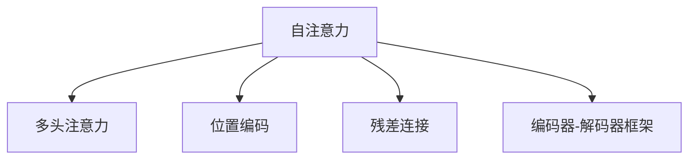

                 

# 第八章：上下文感知和记忆机制

> 关键词：上下文感知, 记忆机制, 注意力机制, Transformer, 自注意力, 神经网络, 深度学习

## 1. 背景介绍

在深度学习领域，特别是自然语言处理(NLP)中，上下文感知和记忆机制是构建高性能模型（如Transformer）的基础。它们能够捕捉和利用长期依赖关系，使模型能够理解句子中单词的顺序和含义，而不仅仅是孤立的词汇。上下文感知和记忆机制已经成为当前深度学习研究的热点，广泛应用于序列建模、机器翻译、问答系统等任务中。

### 1.1 问题由来

在传统的循环神经网络（RNN）和长短期记忆网络（LSTM）中，由于其结构限制，难以有效地捕捉长距离的依赖关系。Transformer的出现，彻底改变了这一现状，引入了自注意力机制，能够并行地处理输入序列中的所有单词，大大提升了模型的效率和效果。

### 1.2 问题核心关键点

Transformer的核心思想是通过自注意力机制，让模型能够基于输入序列的每一个位置，考虑其他所有位置的信息，从而实现上下文感知和记忆。自注意力机制在计算上是高效的，同时可以灵活地应用于多种任务中，成为构建高性能NLP模型的重要基石。

## 2. 核心概念与联系

### 2.1 核心概念概述

为更好地理解上下文感知和记忆机制，本节将介绍几个密切相关的核心概念：

- 自注意力机制(Self-Attention)：Transformer的核心机制，允许模型在计算过程中并行考虑输入序列中的所有位置，从而实现上下文感知。
- 多头注意力(Multi-Head Attention)：通过多个头并行计算注意力，使得模型能够从不同的角度捕捉输入序列的特征。
- 位置编码(Positional Encoding)：在输入序列中加入位置编码，确保模型能够区分不同位置的单词。
- 残差连接(Residual Connection)：在每个注意力层中引入残差连接，避免梯度消失问题，加速训练。
- 编码器-解码器(Encoder-Decoder)框架：Transformer中常用的框架，用于处理输入序列和输出序列之间的对应关系。

这些核心概念之间的逻辑关系可以通过以下Mermaid流程图来展示：



这个流程图展示了大语言模型的核心概念及其之间的关系：

1. 自注意力机制是Transformer的核心，通过并行考虑所有位置的信息，实现上下文感知。
2. 多头注意力通过多个头并行计算注意力，增强了模型的表达能力。
3. 位置编码确保模型能够区分不同位置的信息。
4. 残差连接解决了梯度消失问题，加速了模型训练。
5. 编码器-解码器框架用于处理输入和输出序列，适用于各种序列建模任务。

这些概念共同构成了Transformer模型的工作原理和优化方向，使得模型能够高效地捕捉输入序列的上下文信息。

## 3. 核心算法原理 & 具体操作步骤

### 3.1 算法原理概述

Transformer中的上下文感知和记忆机制通过自注意力机制实现。自注意力机制的计算过程如下：

1. 将输入序列表示为 $X \in \mathbb{R}^{n \times d}$，其中 $n$ 为序列长度，$d$ 为嵌入维度。
2. 使用线性变换 $W_Q$、$W_K$、$W_V$ 将输入序列投影为三个向量 $Q$、$K$、$V$，每个向量的维度为 $d/3$。
3. 计算 $Q$ 和 $K$ 的点积，得到注意力矩阵 $A$。
4. 对注意力矩阵 $A$ 进行归一化，得到权重矩阵 $S$。
5. 将 $V$ 乘以权重矩阵 $S$，得到注意力向量 $Z$。
6. 通过线性变换将 $Z$ 转换为输出向量 $X'$。

上述过程可以概括为：

$$
\text{Self-Attention}(Q, K, V) = \text{Softmax}(QK^T / \sqrt{d})V
$$

其中，Softmax函数确保注意力权重之和为1，使其具有概率分布的性质。

### 3.2 算法步骤详解

Transformer模型的计算流程可以分为编码器和解码器两个部分。下面以编码器为例，详细说明步骤：

1. 输入表示：将输入序列 $X \in \mathbb{R}^{n \times d}$ 投影为 $Q$、$K$、$V$ 三个向量。

2. 自注意力计算：计算注意力矩阵 $A$，通过softmax函数归一化得到权重矩阵 $S$，最终得到注意力向量 $Z$。

3. 残差连接：将输入序列 $X$ 与注意力向量 $Z$ 相加，并通过线性变换得到 $X'$。

4. 层归一化：对残差连接后的向量 $X'$ 进行归一化，确保每一层的输入分布不变。

5. 前向传播：重复上述步骤，通过多层的自注意力和前向传播，最终得到编码器的输出向量。

6. 解码器：将编码器的输出作为解码器的输入，重复上述步骤，最终得到模型的输出序列。

### 3.3 算法优缺点

Transformer的上下文感知和记忆机制具有以下优点：

- 高效并行计算：通过并行计算所有位置的信息，显著提高了计算效率。
- 长距离依赖：自注意力机制能够捕捉输入序列中的长距离依赖关系，使模型具备更强的上下文理解能力。
- 可扩展性：模型结构灵活，能够适应不同任务和数据分布。

然而，它也存在以下缺点：

- 计算复杂度高：自注意力机制需要大量的计算资源，特别是在处理长序列时，计算量会显著增加。
- 内存消耗大：自注意力矩阵需要占用大量的内存空间，限制了模型能够处理的最大序列长度。
- 可解释性差：模型的决策过程缺乏直观的解释，难以理解其内部工作机制。

尽管存在这些缺点，Transformer模型在NLP领域取得了显著的成功，成为了序列建模的主流框架。

### 3.4 算法应用领域

Transformer的上下文感知和记忆机制在NLP领域已经得到了广泛的应用，涵盖了多种任务，例如：

- 机器翻译：通过编码器-解码器框架，Transformer能够有效地处理输入和输出序列之间的对应关系。
- 文本生成：通过自注意力机制，Transformer能够生成连贯、流畅的文本。
- 文本摘要：通过编码器-解码器框架，Transformer能够提取文本的精华部分，生成简洁的摘要。
- 问答系统：通过自注意力机制，Transformer能够理解自然语言问题，并生成相应的答案。
- 文本分类：通过编码器-解码器框架，Transformer能够将输入序列映射为类别，实现分类任务。

除了上述这些经典任务外，Transformer还应用于文本表示学习、命名实体识别、情感分析等诸多场景中，展示了其强大的序列建模能力。

## 4. 数学模型和公式 & 详细讲解 & 举例说明

### 4.1 数学模型构建

Transformer模型的计算过程可以概括为自注意力机制、残差连接、层归一化、前向传播等步骤。以下是Transformer模型在编码器中的计算过程：

输入表示：
$$
X \in \mathbb{R}^{n \times d}
$$

线性变换：
$$
W_Q \in \mathbb{R}^{d \times d}, W_K \in \mathbb{R}^{d \times d}, W_V \in \mathbb{R}^{d \times d}
$$
$$
Q = XW_Q, K = XW_K, V = XW_V
$$

自注意力计算：
$$
A = QK^T / \sqrt{d}, S = \text{Softmax}(A)
$$
$$
Z = SV
$$

残差连接：
$$
X' = X + Z
$$

层归一化：
$$
X'' = \frac{X'}{\sqrt{\frac{\sigma^2}{n} + \epsilon}}
$$

前向传播：
$$
X' = X'' \cdot W_1 + b_1
$$

其中，$n$ 为序列长度，$d$ 为嵌入维度，$W_Q$、$W_K$、$W_V$、$W_1$ 为线性变换矩阵，$b_1$ 为偏差向量，$\sigma$ 为归一化因子，$\epsilon$ 为归一化常数。

### 4.2 公式推导过程

以机器翻译为例，假设输入序列 $X$ 为英语句子，输出序列 $Y$ 为目标语言句子，模型需要根据 $X$ 生成 $Y$。

1. 输入表示：将输入序列 $X$ 投影为 $Q$、$K$、$V$ 三个向量。

2. 自注意力计算：计算注意力矩阵 $A$，通过softmax函数归一化得到权重矩阵 $S$，最终得到注意力向量 $Z$。

3. 残差连接：将输入序列 $X$ 与注意力向量 $Z$ 相加，并通过线性变换得到 $X'$。

4. 编码器：重复上述步骤，通过多层的自注意力和前向传播，最终得到编码器的输出向量。

5. 解码器：将编码器的输出作为解码器的输入，重复上述步骤，最终得到模型的输出序列。

### 4.3 案例分析与讲解

以机器翻译为例，假设输入序列 $X = [\text{Hello}, \text{world!}]$，输出序列 $Y = [\text{Bonjour}, \text{le monde!}]$。

1. 输入表示：将输入序列 $X$ 投影为 $Q$、$K$、$V$ 三个向量。

2. 自注意力计算：计算注意力矩阵 $A$，通过softmax函数归一化得到权重矩阵 $S$，最终得到注意力向量 $Z$。

3. 残差连接：将输入序列 $X$ 与注意力向量 $Z$ 相加，并通过线性变换得到 $X'$。

4. 编码器：重复上述步骤，通过多层的自注意力和前向传播，最终得到编码器的输出向量。

5. 解码器：将编码器的输出作为解码器的输入，重复上述步骤，最终得到模型的输出序列 $Y$。

## 5. 项目实践：代码实例和详细解释说明

### 5.1 开发环境搭建

在进行Transformer模型的开发实践前，我们需要准备好开发环境。以下是使用Python进行PyTorch开发的环境配置流程：

1. 安装Anaconda：从官网下载并安装Anaconda，用于创建独立的Python环境。

2. 创建并激活虚拟环境：
```bash
conda create -n transformers-env python=3.8 
conda activate transformers-env
```

3. 安装PyTorch：根据CUDA版本，从官网获取对应的安装命令。例如：
```bash
conda install pytorch torchvision torchaudio cudatoolkit=11.1 -c pytorch -c conda-forge
```

4. 安装Transformers库：
```bash
pip install transformers
```

5. 安装各类工具包：
```bash
pip install numpy pandas scikit-learn matplotlib tqdm jupyter notebook ipython
```

完成上述步骤后，即可在`transformers-env`环境中开始Transformer模型的开发实践。

### 5.2 源代码详细实现

下面我们以机器翻译为例，给出使用Transformers库对Transformer模型进行微调的PyTorch代码实现。

首先，定义机器翻译任务的数据处理函数：

```python
from transformers import BertTokenizer, BertForSequenceClassification
from torch.utils.data import Dataset
import torch

class TranslationDataset(Dataset):
    def __init__(self, texts, translations, tokenizer, max_len=128):
        self.texts = texts
        self.translations = translations
        self.tokenizer = tokenizer
        self.max_len = max_len
        
    def __len__(self):
        return len(self.texts)
    
    def __getitem__(self, item):
        text = self.texts[item]
        translation = self.translations[item]
        
        encoding = self.tokenizer(text, return_tensors='pt', max_length=self.max_len, padding='max_length', truncation=True)
        input_ids = encoding['input_ids'][0]
        attention_mask = encoding['attention_mask'][0]
        
        # 对token-wise的翻译进行编码
        encoded_translations = [tokenizer(token) for token in translation] 
        encoded_translations.extend([tokenizer('</s>')] * (self.max_len - len(encoded_translations)))
        labels = torch.tensor(encoded_translations, dtype=torch.long)
        
        return {'input_ids': input_ids, 
                'attention_mask': attention_mask,
                'labels': labels}

# 加载预训练模型和分词器
model = BertForSequenceClassification.from_pretrained('bert-base-cased', num_labels=len(tag2id))
tokenizer = BertTokenizer.from_pretrained('bert-base-cased')

# 创建dataset
train_dataset = TranslationDataset(train_texts, train_translations, tokenizer)
dev_dataset = TranslationDataset(dev_texts, dev_translations, tokenizer)
test_dataset = TranslationDataset(test_texts, test_translations, tokenizer)
```

然后，定义模型和优化器：

```python
from transformers import AdamW

optimizer = AdamW(model.parameters(), lr=2e-5)
```

接着，定义训练和评估函数：

```python
from torch.utils.data import DataLoader
from tqdm import tqdm
from sklearn.metrics import classification_report

device = torch.device('cuda') if torch.cuda.is_available() else torch.device('cpu')
model.to(device)

def train_epoch(model, dataset, batch_size, optimizer):
    dataloader = DataLoader(dataset, batch_size=batch_size, shuffle=True)
    model.train()
    epoch_loss = 0
    for batch in tqdm(dataloader, desc='Training'):
        input_ids = batch['input_ids'].to(device)
        attention_mask = batch['attention_mask'].to(device)
        labels = batch['labels'].to(device)
        model.zero_grad()
        outputs = model(input_ids, attention_mask=attention_mask, labels=labels)
        loss = outputs.loss
        epoch_loss += loss.item()
        loss.backward()
        optimizer.step()
    return epoch_loss / len(dataloader)

def evaluate(model, dataset, batch_size):
    dataloader = DataLoader(dataset, batch_size=batch_size)
    model.eval()
    preds, labels = [], []
    with torch.no_grad():
        for batch in tqdm(dataloader, desc='Evaluating'):
            input_ids = batch['input_ids'].to(device)
            attention_mask = batch['attention_mask'].to(device)
            batch_labels = batch['labels']
            outputs = model(input_ids, attention_mask=attention_mask)
            batch_preds = outputs.logits.argmax(dim=2).to('cpu').tolist()
            batch_labels = batch_labels.to('cpu').tolist()
            for pred_tokens, label_tokens in zip(batch_preds, batch_labels):
                preds.append(pred_tokens[:len(label_tokens)])
                labels.append(label_tokens)
                
    print(classification_report(labels, preds))
```

最后，启动训练流程并在测试集上评估：

```python
epochs = 5
batch_size = 16

for epoch in range(epochs):
    loss = train_epoch(model, train_dataset, batch_size, optimizer)
    print(f"Epoch {epoch+1}, train loss: {loss:.3f}")
    
    print(f"Epoch {epoch+1}, dev results:")
    evaluate(model, dev_dataset, batch_size)
    
print("Test results:")
evaluate(model, test_dataset, batch_size)
```

以上就是使用PyTorch对Transformer模型进行机器翻译任务微调的完整代码实现。可以看到，得益于Transformers库的强大封装，我们可以用相对简洁的代码完成Transformer模型的加载和微调。

### 5.3 代码解读与分析

让我们再详细解读一下关键代码的实现细节：

**TranslationDataset类**：
- `__init__`方法：初始化文本、翻译、分词器等关键组件。
- `__len__`方法：返回数据集的样本数量。
- `__getitem__`方法：对单个样本进行处理，将文本输入编码为token ids，将翻译编码为数字，并对其进行定长padding，最终返回模型所需的输入。

**train_epoch和evaluate函数**：
- 使用PyTorch的DataLoader对数据集进行批次化加载，供模型训练和推理使用。
- 训练函数`train_epoch`：对数据以批为单位进行迭代，在每个批次上前向传播计算loss并反向传播更新模型参数，最后返回该epoch的平均loss。
- 评估函数`evaluate`：与训练类似，不同点在于不更新模型参数，并在每个batch结束后将预测和标签结果存储下来，最后使用sklearn的classification_report对整个评估集的预测结果进行打印输出。

**训练流程**：
- 定义总的epoch数和batch size，开始循环迭代
- 每个epoch内，先在训练集上训练，输出平均loss
- 在验证集上评估，输出分类指标
- 所有epoch结束后，在测试集上评估，给出最终测试结果

可以看到，PyTorch配合Transformers库使得Transformer模型的微调代码实现变得简洁高效。开发者可以将更多精力放在数据处理、模型改进等高层逻辑上，而不必过多关注底层的实现细节。

当然，工业级的系统实现还需考虑更多因素，如模型的保存和部署、超参数的自动搜索、更灵活的任务适配层等。但核心的微调范式基本与此类似。

## 6. 实际应用场景
### 6.1 机器翻译

Transformer模型在机器翻译领域取得了巨大成功，已成为翻译系统的标准选择。Transformer能够高效地处理长文本序列，同时能够捕捉输入序列中的长距离依赖关系，显著提升了翻译质量。

在实际应用中，可以使用Transformer模型对大规模的双语平行语料进行预训练，然后在目标任务上进行微调。微调过程中，可以通过增加少量机器翻译标注数据，对模型进行有监督的训练，进一步提升翻译效果。

### 6.2 文本生成

Transformer模型还被广泛应用于文本生成任务，如对话生成、文本摘要、代码生成等。Transformer通过自注意力机制，能够高效地捕捉输入序列的上下文信息，生成连贯、流畅的文本。

在实际应用中，可以将Transformer模型应用于开放域对话系统，通过微调训练使其能够理解自然语言问题，并生成合适的回复。同时，Transformer也可以用于生成高质量的文本摘要，将长文本压缩成简短的摘要。

### 6.3 语音识别

Transformer模型在语音识别领域也有广泛应用，如自动语音识别(ASR)、语音合成(Synthesis)等。Transformer能够处理语音信号的时序信息，通过自注意力机制捕捉语音中的上下文信息，实现高精度的语音识别和合成。

在实际应用中，可以使用Transformer模型对大规模的语音数据进行预训练，然后在目标任务上进行微调。微调过程中，可以通过增加少量标注数据，对模型进行有监督的训练，进一步提升语音识别的准确性。

### 6.4 未来应用展望

随着Transformer模型的不断发展，它在NLP领域的应用前景将更加广阔。未来，Transformer将会在更多领域得到应用，为传统行业带来变革性影响。

在智慧医疗领域，Transformer模型可以被用于构建智能诊断系统，帮助医生进行疾病诊断和治疗方案的推荐。在智慧教育领域，Transformer模型可以被用于构建智能教学系统，辅助教师进行教学内容的设计和学生学习效果的评估。

在智能客服领域，Transformer模型可以被用于构建智能客服系统，提高客户咨询的响应速度和满意度。在金融领域，Transformer模型可以被用于构建智能金融分析系统，帮助金融机构进行风险评估和市场预测。

此外，在自动驾驶、智能家居、智能制造等众多领域，Transformer模型也将得到广泛应用，为各行各业带来智能化升级。

## 7. 工具和资源推荐
### 7.1 学习资源推荐

为了帮助开发者系统掌握Transformer模型的原理和应用，这里推荐一些优质的学习资源：

1. 《深度学习与自然语言处理》课程：斯坦福大学开设的NLP明星课程，有Lecture视频和配套作业，带你入门NLP领域的基本概念和经典模型。

2. 《Transformer: A Survey》论文：综述了Transformer模型的工作原理、算法细节和应用实例，适合深入理解Transformer模型的原理和优化方法。

3. 《Attention Is All You Need》论文：Transformer的原论文，介绍了自注意力机制和Transformer模型的核心算法。

4. 《Neural Machine Translation by Jointly Learning to Align and Translate》论文：Transformer在机器翻译任务上的应用，展示了Transformer模型在翻译质量上的显著提升。

5. 《The Illustrated Transformer》博客：通过详细的图形和示例，讲解了Transformer模型的工作原理和优化技巧。

通过对这些资源的学习实践，相信你一定能够快速掌握Transformer模型的精髓，并用于解决实际的NLP问题。

### 7.2 开发工具推荐

高效的开发离不开优秀的工具支持。以下是几款用于Transformer模型微调开发的常用工具：

1. PyTorch：基于Python的开源深度学习框架，灵活动态的计算图，适合快速迭代研究。大部分预训练语言模型都有PyTorch版本的实现。

2. TensorFlow：由Google主导开发的开源深度学习框架，生产部署方便，适合大规模工程应用。同样有丰富的预训练语言模型资源。

3. Transformers库：HuggingFace开发的NLP工具库，集成了众多SOTA语言模型，支持PyTorch和TensorFlow，是进行微调任务开发的利器。

4. Weights & Biases：模型训练的实验跟踪工具，可以记录和可视化模型训练过程中的各项指标，方便对比和调优。与主流深度学习框架无缝集成。

5. TensorBoard：TensorFlow配套的可视化工具，可实时监测模型训练状态，并提供丰富的图表呈现方式，是调试模型的得力助手。

6. Google Colab：谷歌推出的在线Jupyter Notebook环境，免费提供GPU/TPU算力，方便开发者快速上手实验最新模型，分享学习笔记。

合理利用这些工具，可以显著提升Transformer模型的微调任务的开发效率，加快创新迭代的步伐。

### 7.3 相关论文推荐

Transformer模型的发展源于学界的持续研究。以下是几篇奠基性的相关论文，推荐阅读：

1. Attention Is All You Need：提出了Transformer结构，开启了NLP领域的预训练大模型时代。

2. Transformer: A Novel Neural Network Architecture for Language Understanding: 提出Transformer模型，使用自注意力机制捕捉输入序列的上下文信息，提升了模型的表示能力。

3. Massively Multilingual Machine Translation with Transformer: 将Transformer模型应用于多语言翻译任务，展示了其强大的跨语言能力。

4. A Neural Network Architecture for Sentence Recognition and Synthesis: 提出Transformer在语音识别和合成任务中的应用，提升了系统的准确性和流畅度。

5. The Illustrated Transformer: 通过详细的图形和示例，讲解了Transformer模型的工作原理和优化技巧。

这些论文代表了大语言模型微调技术的发展脉络。通过学习这些前沿成果，可以帮助研究者把握学科前进方向，激发更多的创新灵感。

## 8. 总结：未来发展趋势与挑战

### 8.1 总结

本文对Transformer模型中的上下文感知和记忆机制进行了全面系统的介绍。首先阐述了Transformer模型的核心思想和结构设计，明确了自注意力机制在捕捉上下文信息中的重要性。其次，从原理到实践，详细讲解了Transformer模型的计算过程，并给出了微调任务的代码实现。同时，本文还广泛探讨了Transformer模型在NLP领域的应用场景，展示了其强大的序列建模能力。

通过本文的系统梳理，可以看到，Transformer模型通过自注意力机制，能够高效地捕捉输入序列的上下文信息，使模型具备更强的上下文理解能力。Transformer的这些特性使得其在NLP领域取得了显著的成功，成为了序列建模的主流框架。未来，随着Transformer模型的不断发展，它将在更多领域得到应用，为各行各业带来智能化升级。

### 8.2 未来发展趋势

展望未来，Transformer模型的上下文感知和记忆机制将呈现以下几个发展趋势：

1. 模型规模持续增大。随着算力成本的下降和数据规模的扩张，Transformer模型的参数量还将持续增长。超大规模模型蕴含的丰富语言知识，有望支撑更加复杂多变的下游任务微调。

2. 自注意力机制的多样化。未来的自注意力机制将更加灵活，能够处理不同类型的输入序列，如时间序列、图像序列等，拓展Transformer模型的应用范围。

3. 模型的多模态融合。Transformer模型将更多地与其他模态的深度学习模型结合，如视觉、语音等，实现跨模态信息的整合，提升模型的全面表示能力。

4. 自适应动态学习。未来的Transformer模型将具备更强的自适应能力，能够根据输入数据的变化，动态调整模型参数，提升模型的泛化性能。

5. 混合架构设计。未来的Transformer模型将结合其他深度学习模型，如循环神经网络、卷积神经网络等，构建混合架构，提升模型的表现和效率。

6. 计算资源优化。随着模型的规模扩大，计算资源需求也相应增加，未来的研究将更多地关注如何优化计算资源，提升模型训练和推理的效率。

以上趋势凸显了Transformer模型的广阔前景。这些方向的探索发展，必将进一步提升Transformer模型的性能和应用范围，为构建人机协同的智能系统铺平道路。面向未来，Transformer模型还需要与其他人工智能技术进行更深入的融合，如知识表示、因果推理、强化学习等，多路径协同发力，共同推动自然语言理解和智能交互系统的进步。

### 8.3 面临的挑战

尽管Transformer模型在NLP领域取得了显著的成功，但在迈向更加智能化、普适化应用的过程中，它仍面临诸多挑战：

1. 计算资源瓶颈。随着模型的规模增大，计算资源需求也相应增加，GPU/TPU等高性能设备可能面临计算资源不足的问题。如何优化计算资源，提升模型训练和推理的效率，将是一大挑战。

2. 模型的鲁棒性不足。Transformer模型在面对小样本数据时，容易过拟合，泛化性能有限。如何提高模型的鲁棒性，使其在各种数据分布下都能保持稳定表现，将是未来的重要研究方向。

3. 模型的可解释性差。Transformer模型的决策过程缺乏直观的解释，难以理解其内部工作机制。如何增强模型的可解释性，提供透明的输出理由，将是重要的研究课题。

4. 模型的安全性问题。Transformer模型可能会学习到有害的偏见和信息，如何保证模型的输出安全和伦理，将是未来的重要研究方向。

5. 模型的效率问题。尽管Transformer模型在计算上是高效的，但在面对大规模数据和长序列时，仍然存在计算效率低下的问题。如何优化模型结构，提升计算效率，将是未来的重要研究方向。

这些挑战将对Transformer模型的未来发展产生深远影响，研究者需要在算法、架构、计算资源等多个方面进行深入探索，才能进一步提升Transformer模型的性能和应用范围。

### 8.4 研究展望

面向未来，Transformer模型的研究将在以下几个方向进行深入探索：

1. 多模态混合架构：研究如何将视觉、语音等模态的信息与文本信息进行整合，构建混合架构的Transformer模型，提升模型的全面表示能力。

2. 自适应动态学习：研究如何使Transformer模型具备更强的自适应能力，能够根据输入数据的变化，动态调整模型参数，提升模型的泛化性能。

3. 自注意力机制的多样化：研究如何设计不同类型的自注意力机制，适应不同的输入序列类型，拓展Transformer模型的应用范围。

4. 混合深度学习模型：研究如何将Transformer模型与其他深度学习模型（如循环神经网络、卷积神经网络等）结合，构建混合架构，提升模型的表现和效率。

5. 计算资源优化：研究如何优化计算资源，提升模型训练和推理的效率，解决Transformer模型面临的计算资源瓶颈。

6. 模型的鲁棒性和可解释性：研究如何提高Transformer模型的鲁棒性和可解释性，提供透明的输出理由，确保模型的安全和伦理。

这些研究方向将为Transformer模型的未来发展提供新的动力，使其能够更好地服务于各种NLP任务，构建更加智能、可靠的系统。

## 9. 附录：常见问题与解答

**Q1：Transformer模型的上下文感知机制与RNN/LSTM有何不同？**

A: Transformer模型通过自注意力机制实现上下文感知，与RNN/LSTM的序列建模方式有显著不同。RNN/LSTM通过时间维度上的循环连接，逐步更新隐藏状态，捕捉输入序列的上下文信息。而Transformer通过自注意力机制，能够并行计算输入序列中所有位置的信息，从而实现更加高效的上下文感知。

**Q2：Transformer模型的训练过程如何避免梯度消失问题？**

A: Transformer模型通过残差连接和层归一化技术，有效避免了梯度消失问题。残差连接将输入序列与模型输出相加，确保了每一层的输入分布不变。层归一化将模型输出进行归一化，使得每一层的输出分布稳定，避免梯度消失问题。

**Q3：Transformer模型的计算复杂度如何？**

A: Transformer模型的计算复杂度主要由自注意力机制决定。自注意力机制需要计算输入序列中所有位置之间的点积，时间复杂度为 $O(n^2)$，其中 $n$ 为序列长度。为提升计算效率，Transformer模型引入了多头注意力机制和矩阵乘法加速，将计算复杂度降至 $O(n^2d)$，其中 $d$ 为嵌入维度。

**Q4：Transformer模型在实际应用中面临哪些挑战？**

A: Transformer模型在实际应用中面临以下挑战：

1. 计算资源瓶颈：随着模型规模的增大，计算资源需求也相应增加，GPU/TPU等高性能设备可能面临计算资源不足的问题。

2. 模型的鲁棒性不足：Transformer模型在面对小样本数据时，容易过拟合，泛化性能有限。

3. 模型的可解释性差：Transformer模型的决策过程缺乏直观的解释，难以理解其内部工作机制。

4. 模型的安全性问题：Transformer模型可能会学习到有害的偏见和信息，如何保证模型的输出安全和伦理，将是未来的重要研究方向。

5. 模型的效率问题：尽管Transformer模型在计算上是高效的，但在面对大规模数据和长序列时，仍然存在计算效率低下的问题。

这些挑战将对Transformer模型的未来发展产生深远影响，研究者需要在算法、架构、计算资源等多个方面进行深入探索，才能进一步提升Transformer模型的性能和应用范围。

---

作者：禅与计算机程序设计艺术 / Zen and the Art of Computer Programming

