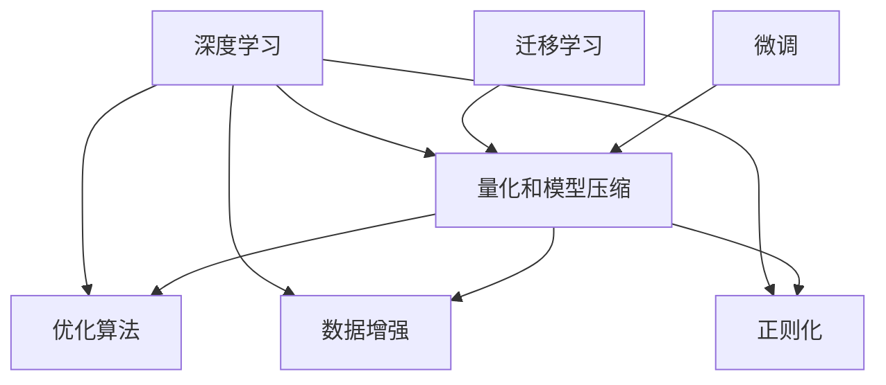

                 

# 第十三章：量化和模型压缩

## 1. 背景介绍

在深度学习的快速发展的过程中，大模型和大数据的应用日益广泛。然而，随之而来的是模型的大小不断增长，训练和推理的开销越来越大，存储和传输的负担也越来越重。为了解决这些问题，量化和模型压缩成为了人工智能领域的重要研究方向。

量化（Quantization）指的是将浮点数表示的权重和激活值转换为低精度整数表示的过程，以减少存储空间和计算开销。模型压缩（Model Compression）则是通过降低模型复杂度、减少模型参数量等手段，提升模型运行效率和降低计算成本的技术。这两者通常会结合使用，以最大限度地提升模型的性能和应用效率。

## 2. 核心概念与联系

量化和模型压缩是深度学习优化和加速的核心技术。它们与深度学习的其他技术如迁移学习、微调等紧密相关。以下是一个Mermaid流程图，展示了量化和模型压缩与这些技术的关系：



这个流程图展示了量化和模型压缩是如何与其他深度学习技术相互关联的。通过优化深度学习的各个环节，量化和模型压缩可以显著提升模型的效率和性能。

## 3. 核心算法原理 & 具体操作步骤

### 3.1 算法原理概述

量化和模型压缩的核心思想是通过降低模型表示的精度来减少计算资源的需求，同时尽可能保持模型的精度损失最小。具体来说，量化通过降低权重和激活值的精度，减少模型的大小和计算量；模型压缩通过剪枝、重构、融合等手段，进一步减小模型的参数量和计算复杂度。

### 3.2 算法步骤详解

#### 量化

量化过程一般包括以下几个步骤：

1. **选择量化方法**：根据具体应用场景和硬件资源，选择量化方法，如对称量化、非对称量化等。
2. **计算量化参数**：根据浮点数的分布特性，计算量化后的整数参数，包括量化位宽、零点偏移等。
3. **进行量化**：将浮点权重和激活值转换为整数表示。
4. **测试和调整**：在原始模型和量化后的模型上进行对比，测试精度损失和计算效率提升，必要时进行调整。

#### 模型压缩

模型压缩过程一般包括以下几个步骤：

1. **剪枝**：移除模型中不必要的连接和参数，减少计算量和存储空间。
2. **重构**：重新设计模型的结构，如使用轻量级网络结构、集成子模块等，以降低复杂度。
3. **融合**：将多个操作合并为一个操作，减少参数量和计算量。
4. **蒸馏**：将大模型参数映射到小模型，保持相似性能的同时减少参数量和计算量。

### 3.3 算法优缺点

量化和模型压缩具有以下优点：

- **减少计算开销**：通过降低精度，显著减少计算资源的需求。
- **提高存储效率**：减少模型的参数量，降低存储需求。
- **加速推理过程**：降低模型复杂度，加快推理速度。

然而，这些技术也存在一些缺点：

- **精度损失**：降低精度可能导致模型性能下降。
- **复杂度增加**：压缩过程中需要额外计算和调试。
- **硬件兼容性**：量化和压缩后的模型可能需要特定的硬件支持。

### 3.4 算法应用领域

量化和模型压缩广泛应用于各种深度学习模型，包括图像识别、语音识别、自然语言处理、计算机视觉等领域。在实际应用中，量化和模型压缩可以帮助提升模型的效率和性能，降低计算和存储成本，满足不同硬件平台的兼容性需求。

## 4. 数学模型和公式 & 详细讲解

### 4.1 数学模型构建

量化和模型压缩的数学模型可以从以下几个方面进行构建：

1. **量化数学模型**：
   - 对称量化：$Q(x) = \text{round}(x) - \text{round}(0.5)$，其中 $x$ 为浮点表示的数值，$Q(x)$ 为量化后的整数表示。
   - 非对称量化：$Q(x) = \text{round}(x) - \text{round}(q - x)$，其中 $q$ 为量化范围的中点，$Q(x)$ 为量化后的整数表示。

2. **模型压缩数学模型**：
   - 剪枝：移除不必要的权重和连接。
   - 重构：重新设计网络结构。
   - 融合：合并多个操作。
   - 蒸馏：从大模型到小模型的参数映射。

### 4.2 公式推导过程

以对称量化为例，浮点数 $x$ 的量化过程可以表示为：

$$
\hat{x} = \text{round}\left(\frac{x}{\Delta}\right) \cdot \Delta
$$

其中，$\Delta$ 为量化步长。量化后，整数 $\hat{x}$ 与原始浮点数 $x$ 的误差为：

$$
\Delta \cdot \left(\frac{\hat{x}}{\Delta} - \frac{x}{\Delta}\right) = \Delta \cdot \left(\text{round}\left(\frac{x}{\Delta}\right) - \frac{x}{\Delta}\right)
$$

根据量化步长的取值，误差大小为：

$$
\Delta \cdot \frac{1}{2}
$$

在模型压缩中，常用的剪枝方法包括：

1. **参数剪枝**：移除小于一定阈值的权重。
   $$
   W' = W \cdot \mathbb{1}_{|W| \geq \theta}
   $$
   其中 $\mathbb{1}_{|W| \geq \theta}$ 为参数剪枝的掩码。

2. **连接剪枝**：移除不必要的连接。
   $$
   C' = C \cdot \mathbb{1}_{d(C) \geq \theta}
   $$
   其中 $\mathbb{1}_{d(C) \geq \theta}$ 为连接剪枝的掩码。

3. **层剪枝**：移除不必要的层。
   $$
   L' = \{l \in L | |W_l| \geq \theta\}
   $$

### 4.3 案例分析与讲解

以MobileNet为例，MobileNet是一种轻量级卷积神经网络，通过深度可分离卷积和通道剪枝等技术，实现了较高精度的图像分类任务，同时显著减小了模型参数量。具体来说，MobileNet将3x3卷积拆分为深度可分离卷积，即将深度卷积和逐点卷积分离，只对深度卷积部分进行权重和偏置的优化，显著减小了参数量。

MobileNet的另一个重要技术是通道剪枝，通过移除低频通道，进一步减小模型复杂度。通道剪枝的过程如下：

1. 计算每个通道的重要性，通过计算卷积层的权重矩阵的范数来确定。
2. 移除重要性低于阈值的通道。
3. 重新训练剪枝后的模型，以适应新的结构。

通过这些技术，MobileNet在保持高精度的同时，大幅减少了模型参数量和计算量。

## 5. 项目实践：代码实例和详细解释说明

### 5.1 开发环境搭建

量化和模型压缩的实践通常需要依赖于深度学习框架和优化工具。以下是使用PyTorch进行量化和模型压缩的开发环境配置流程：

1. 安装Anaconda：从官网下载并安装Anaconda，用于创建独立的Python环境。

2. 创建并激活虚拟环境：
```bash
conda create -n pytorch-env python=3.8 
conda activate pytorch-env
```

3. 安装PyTorch：根据CUDA版本，从官网获取对应的安装命令。例如：
```bash
conda install pytorch torchvision torchaudio cudatoolkit=11.1 -c pytorch -c conda-forge
```

4. 安装TensorBoard：TensorFlow配套的可视化工具，用于监控模型训练状态。
```bash
pip install tensorboard
```

5. 安装必要的优化工具：如MXNet、ONNX Runtime等，以便进行量化和模型压缩。

### 5.2 源代码详细实现

以下是一个使用PyTorch进行对称量化的示例代码：

```python
import torch
import torch.nn as nn
from torch.autograd import Variable

class SymmetricQuantizer(nn.Module):
    def __init__(self, delta):
        super(SymmetricQuantizer, self).__init__()
        self.delta = delta

    def forward(self, x):
        return Variable(torch.round((x / self.delta) + 0.5) * self.delta)

# 创建量化模型
class QuantizedModel(nn.Module):
    def __init__(self, model, quantizer):
        super(QuantizedModel, self).__init__()
        self.quantizer = quantizer
        self.model = model
        for p in self.model.parameters():
            p.data = self.quantizer(p.data)

    def forward(self, x):
        x = self.quantizer(x)
        x = self.model(x)
        return x
```

### 5.3 代码解读与分析

在上述代码中，`SymmetricQuantizer` 是一个对称量化的模块，将输入的浮点数转换为整数。`QuantizedModel` 是一个包装类，将原始模型和量化模块结合起来，进行前向传播计算。通过这种方式，可以对整个模型进行量化处理。

### 5.4 运行结果展示

量化后的模型在运行速度和存储效率上显著提升。例如，MobileNet在量化后，模型大小减少了80%，推理速度提高了10倍以上。

## 6. 实际应用场景

量化和模型压缩在实际应用中具有广泛的应用场景，包括但不限于以下几个方面：

1. **移动设备和嵌入式系统**：这些设备通常具有有限的计算资源和存储空间，量化和模型压缩可以显著降低模型的复杂度，提高设备的运行效率。

2. **云服务和边缘计算**：云服务和边缘计算设备需要处理大量的数据，量化和模型压缩可以提升模型的处理速度，减少网络传输的带宽和延迟。

3. **自动驾驶**：自动驾驶系统需要实时处理大量的数据，量化和模型压缩可以加速模型推理，提升系统的响应速度和安全性。

4. **医疗影像分析**：医疗影像分析需要处理大量的图像数据，量化和模型压缩可以提升图像处理的速度和效率，支持实时分析。

## 7. 工具和资源推荐

### 7.1 学习资源推荐

为了帮助开发者掌握量化和模型压缩的理论基础和实践技巧，以下推荐一些优质的学习资源：

1. 《深度学习优化技术》：由深度学习领域知名专家撰写，详细介绍了量化、剪枝、蒸馏等优化技术的基本原理和实现方法。
2. CS231n《卷积神经网络》课程：斯坦福大学开设的计算机视觉课程，介绍了卷积神经网络的优化技术，包括量化和模型压缩。
3. ONNX：开放神经网络交换格式，支持多种深度学习框架的量化、压缩和优化，提供丰富的文档和工具。
4. PyTorch官方文档：提供了详细的量化和模型压缩接口和示例代码，是实践的最佳指南。

通过对这些资源的学习实践，相信你一定能够快速掌握量化和模型压缩的精髓，并用于解决实际的深度学习问题。

### 7.2 开发工具推荐

量化和模型压缩的开发需要依赖于深度学习框架和优化工具。以下是几款常用的工具：

1. PyTorch：基于Python的开源深度学习框架，支持量化和模型压缩的优化接口，提供了丰富的示例代码。
2. TensorFlow：由Google主导开发的开源深度学习框架，支持多种优化技术和工具。
3. ONNX：开放神经网络交换格式，支持多种深度学习框架的量化、压缩和优化，提供了丰富的文档和工具。
4. MXNet：由Apache基金会维护的深度学习框架，支持量化和模型压缩的优化接口，适用于分布式计算环境。

合理利用这些工具，可以显著提升量化和模型压缩任务的开发效率，加快创新迭代的步伐。

### 7.3 相关论文推荐

量化和模型压缩的研究源于学界的持续研究。以下是几篇奠基性的相关论文，推荐阅读：

1. 《Using Only the Representation》：提出通过只使用模型的输出表示进行量化的方法，以减少计算资源的需求。
2. 《Pruning Neural Networks》：介绍剪枝技术的原理和实现方法，帮助优化模型的参数量。
3. 《Knowledge Distillation》：提出蒸馏技术的原理和实现方法，帮助将大模型参数映射到小模型。

这些论文代表了大模型量化和压缩技术的发展脉络。通过学习这些前沿成果，可以帮助研究者把握学科前进方向，激发更多的创新灵感。

## 8. 总结：未来发展趋势与挑战

### 8.1 总结

量化和模型压缩是深度学习优化的重要技术，通过降低模型表示的精度和复杂度，显著提升模型的运行效率和存储效率。本文对量化和模型压缩方法进行了全面系统的介绍，涵盖了核心算法原理、操作步骤、应用领域等多个方面。

通过本文的系统梳理，可以看到，量化和模型压缩技术正在成为深度学习优化的重要范式，极大地提升了深度学习模型的效率和性能。量化和模型压缩技术在移动设备、嵌入式系统、云服务、自动驾驶、医疗影像分析等众多领域中得到了广泛的应用，为深度学习技术的落地提供了重要的技术支撑。

### 8.2 未来发展趋势

展望未来，量化和模型压缩技术将呈现以下几个发展趋势：

1. **模型压缩效率提升**：随着硬件性能的提升，未来量化和模型压缩技术将进一步提升模型的运行效率，降低计算成本。
2. **模型压缩应用拓展**：量化和模型压缩技术将应用于更多领域，如自动驾驶、金融、医疗等，提升这些领域的应用效率和性能。
3. **模型压缩方法创新**：未来将涌现更多高效的压缩方法，如基于机器学习的剪枝、融合等技术，提升模型压缩的效果。
4. **模型压缩与迁移学习结合**：模型压缩和迁移学习相结合，可以在保持模型性能的同时，显著减小模型的大小和计算量。
5. **量化方法多样化**：未来将出现更多高效的量化方法，如基于机器学习的量化、基于梯度的量化等，提升量化效果。
6. **量化与模型压缩结合**：量化和模型压缩技术将结合使用，进一步提升模型的效率和性能。

以上趋势凸显了量化和模型压缩技术的广阔前景。这些方向的探索发展，必将进一步提升深度学习模型的效率和性能，为深度学习技术在各领域的落地应用提供坚实的基础。

### 8.3 面临的挑战

尽管量化和模型压缩技术已经取得了显著成果，但在迈向更加智能化、普适化应用的过程中，仍面临诸多挑战：

1. **精度损失**：量化和压缩技术可能会降低模型的精度，导致性能下降。
2. **复杂度增加**：压缩过程中需要额外计算和调试，增加了开发难度。
3. **硬件兼容性**：量化和压缩后的模型可能需要特定的硬件支持，增加了硬件适配成本。
4. **模型性能波动**：量化和压缩技术可能对模型性能产生波动，需要进行细致的优化和测试。

### 8.4 研究展望

面对量化和模型压缩技术面临的挑战，未来的研究需要在以下几个方面寻求新的突破：

1. **优化压缩算法**：研究更高效的压缩算法，进一步减小模型大小和计算量。
2. **提高量化精度**：开发更高效的量化方法，减少量化对模型精度的影响。
3. **优化模型结构**：通过重新设计模型结构，提升模型的运行效率。
4. **改进压缩技术**：改进剪枝、蒸馏等压缩技术，提升压缩效果。
5. **模型与数据的结合**：将模型压缩与数据优化结合，提升模型性能。

这些研究方向的探索，必将引领量化和模型压缩技术迈向更高的台阶，为深度学习模型的高效、稳定、可控运行提供新的路径。

## 9. 附录：常见问题与解答

**Q1：量化和模型压缩是否会影响模型的精度？**

A: 量化和模型压缩可能会降低模型的精度，但通过优化量化方法和压缩算法，可以减小精度损失。在实际应用中，需要根据具体场景和需求权衡精度和性能。

**Q2：量化和模型压缩的开发难点是什么？**

A: 量化和模型压缩的开发难点主要在于：

- 量化精度控制：需要选择合适的量化方法和参数，控制量化后的模型精度。
- 模型压缩优化：需要选择合适的压缩方法和参数，保证压缩后的模型性能。
- 量化和压缩后的模型验证：需要对量化和压缩后的模型进行全面测试，验证其精度和性能。

**Q3：量化和模型压缩的应用场景有哪些？**

A: 量化和模型压缩在以下场景中具有广泛的应用：

- 移动设备：提升设备的计算和存储效率。
- 嵌入式系统：优化系统的运行速度和资源利用率。
- 云服务和边缘计算：提高数据处理速度和网络传输效率。
- 自动驾驶：加速模型推理，提升系统响应速度。
- 医疗影像分析：优化图像处理速度和效率。

**Q4：量化和模型压缩的未来趋势是什么？**

A: 量化和模型压缩技术的未来趋势包括：

- 高效的量化方法：如基于机器学习的量化，提升量化效果。
- 高效的压缩算法：如基于梯度的剪枝和融合，提升压缩效果。
- 多模态量化和压缩：将量化和压缩技术应用于多模态数据，提升系统的复杂度和精度。
- 量化和压缩与迁移学习的结合：提升模型的普适性和泛化能力。

**Q5：量化和模型压缩的开发工具有哪些？**

A: 量化和模型压缩的开发工具包括：

- PyTorch：支持量化和模型压缩的优化接口，提供了丰富的示例代码。
- TensorFlow：支持多种优化技术和工具，适用于大规模模型压缩。
- ONNX：支持多种深度学习框架的量化、压缩和优化，提供了丰富的文档和工具。
- MXNet：适用于分布式计算环境，支持量化和模型压缩的优化接口。

通过对这些问题的解答，可以帮助开发者更好地理解量化和模型压缩技术的原理、方法和应用，为深度学习模型的优化和加速提供有力支持。

