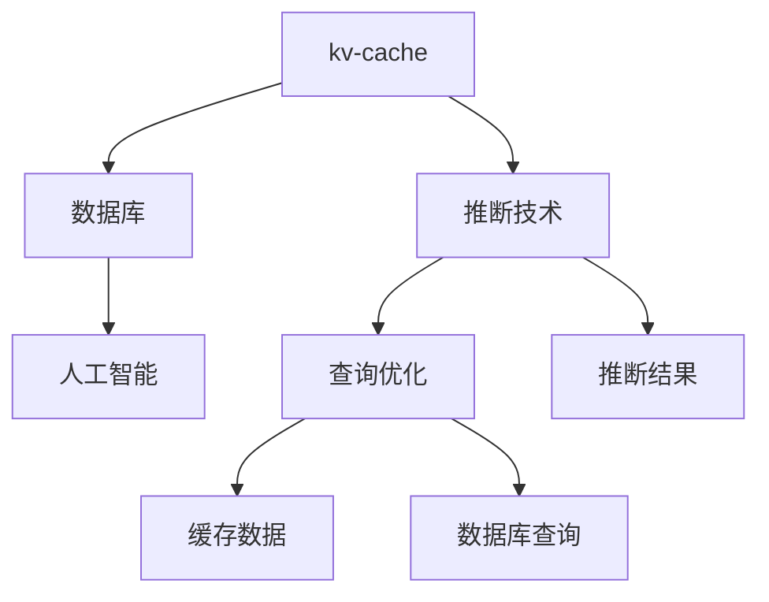

                 

# 第十二章：kv-cache 推断技术

> 关键词：kv-cache, 推断技术, 存储系统, 数据库, 人工智能

## 1. 背景介绍

### 1.1 问题由来

在现代信息技术系统中，缓存技术已经成为提升系统性能的关键手段之一。无论是数据库、Web服务器、移动应用还是人工智能系统，缓存都能有效减少数据访问延迟，提升系统响应速度，优化资源利用率。然而，现有缓存系统大都基于传统的键值(key-value)结构设计，难以直接处理复杂的数据查询和推断需求。

本文聚焦于kv-cache的推断技术，探索如何通过推断引擎提升缓存系统的智能化水平，更好地支持复杂数据查询和分析。

### 1.2 问题核心关键点

为了解决kv-cache系统在处理复杂数据查询和推断时的不足，本文提出以下关键问题：
- 如何通过推断引擎提升缓存系统的智能化水平？
- 推断引擎如何与kv-cache系统高效协同工作？
- 推断引擎在实际应用中面临哪些挑战？
- 未来推断技术的发展趋势是什么？

这些关键问题将指导我们深入理解kv-cache推断技术的核心原理和应用，并提供相应的解决方案。

## 2. 核心概念与联系

### 2.1 核心概念概述

为更好地理解kv-cache推断技术，本节将介绍几个关键概念：

- kv-cache：以键值(key-value)结构为基础的缓存系统，用于高效存储和管理数据，提高系统响应速度。
- 推断技术：通过算法模型对数据进行推理和计算，自动生成推断结果的技术。
- 数据库：存储、管理和查询数据的系统，支持复杂数据查询和事务处理。
- 人工智能：通过学习算法和模型，实现智能决策和知识发现的领域。

这些概念之间存在紧密联系，推断技术可以进一步提升kv-cache和数据库的智能化水平，从而增强人工智能系统的能力。

### 2.2 核心概念原理和架构的 Mermaid 流程图



这个流程图展示了大规模kv-cache系统与推断技术的相互联系：

1. kv-cache系统接收查询请求。
2. 推断引擎通过分析查询请求，自动生成数据推断结果。
3. 数据库执行查询请求，返回原始数据。
4. 推断引擎根据原始数据生成推断结果。
5. kv-cache系统缓存原始数据和推断结果。
6. 查询优化器对查询进行优化，提高查询效率。

## 3. 核心算法原理 & 具体操作步骤

### 3.1 算法原理概述

kv-cache推断技术基于机器学习算法，通过分析历史数据和查询模式，自动推断出数据间的关系和规律。其主要原理可以概括为以下几点：

- 数据预处理：收集和清洗数据，构建数据集。
- 模型训练：使用机器学习算法训练模型，学习数据间的关系。
- 查询推断：根据查询请求，自动生成推断结果。
- 结果缓存：将原始数据和推断结果缓存到kv-cache系统中，供后续查询使用。

### 3.2 算法步骤详解

kv-cache推断技术主要包括以下几个关键步骤：

**Step 1: 数据预处理**

收集和清洗数据，构建数据集。

**Step 2: 模型训练**

选择合适的机器学习算法，使用数据集训练模型，学习数据间的关系。

**Step 3: 查询推断**

根据查询请求，自动生成推断结果。

**Step 4: 结果缓存**

将原始数据和推断结果缓存到kv-cache系统中，供后续查询使用。

### 3.3 算法优缺点

kv-cache推断技术具有以下优点：
- 提高查询效率：通过推断引擎自动生成推断结果，减少数据库查询次数，提高响应速度。
- 增强数据洞察：推断引擎可以自动发现数据间的关系和规律，提供更深层次的数据洞察。
- 优化资源利用：通过推断结果缓存，减少数据库访问频次，优化资源利用率。

同时，该技术也存在一些缺点：
- 数据预处理复杂：需要构建高质量的数据集，数据预处理过程繁琐。
- 模型训练耗时：机器学习算法训练需要大量时间和计算资源，对硬件要求高。
- 推断结果准确性：推断引擎生成的结果可能存在偏差，需要定期验证和调整。
- 系统复杂性：需要在kv-cache系统中集成推断引擎，增加系统复杂度。

### 3.4 算法应用领域

kv-cache推断技术在以下领域中得到了广泛应用：

- 大数据分析：用于处理大规模数据查询和分析，提高数据处理效率。
- 智能推荐系统：基于用户行为数据，自动生成推荐结果。
- 实时监控系统：用于处理大量实时数据，快速响应异常情况。
- 自然语言处理：用于处理自然语言查询，自动生成推断结果。

## 4. 数学模型和公式 & 详细讲解

### 4.1 数学模型构建

kv-cache推断技术主要使用机器学习算法进行模型训练，以下是一些常用的数学模型：

- 决策树：通过构建决策树模型，自动推断数据间的关系。
- 随机森林：通过组合多个决策树模型，提升推断结果的准确性和鲁棒性。
- 深度学习：使用神经网络模型，学习更复杂的数据间关系。

### 4.2 公式推导过程

以决策树为例，其推断过程可以表示为：

$$
\text{DecisionTree}(D, \{(x_i, y_i)\}_{i=1}^N, T)
$$

其中 $D$ 为数据集，$(x_i, y_i)$ 为训练样本，$T$ 为决策树结构。推断过程主要包括以下几个步骤：

1. 选择最佳特征：根据信息增益或信息增益比，选择最优特征进行分裂。
2. 递归构建子树：对最优特征进行分裂，构建子树。
3. 组合子树：将多个子树组合成完整的决策树。

### 4.3 案例分析与讲解

以用户行为数据分析为例，使用决策树模型进行推断：

1. 收集用户行为数据：收集用户登录、购买、浏览等行为数据。
2. 数据预处理：清洗数据，去除无效数据，构建数据集。
3. 模型训练：使用决策树算法训练模型，学习用户行为与购买意愿之间的关系。
4. 查询推断：根据用户新行为数据，自动生成推断结果。
5. 结果缓存：将原始数据和推断结果缓存到kv-cache系统中。

## 5. 项目实践：代码实例和详细解释说明

### 5.1 开发环境搭建

在进行kv-cache推断技术实践前，我们需要准备好开发环境。以下是使用Python进行Scikit-learn开发的示例环境配置流程：

1. 安装Anaconda：从官网下载并安装Anaconda，用于创建独立的Python环境。

2. 创建并激活虚拟环境：
```bash
conda create -n sklearn-env python=3.8 
conda activate sklearn-env
```

3. 安装Scikit-learn：
```bash
pip install scikit-learn
```

4. 安装Numpy、Pandas、Matplotlib等工具包：
```bash
pip install numpy pandas matplotlib scikit-learn matplotlib tqdm jupyter notebook ipython
```

完成上述步骤后，即可在`sklearn-env`环境中开始实践。

### 5.2 源代码详细实现

以下是使用Scikit-learn库进行kv-cache推断的示例代码实现：

```python
from sklearn.ensemble import RandomForestRegressor
import numpy as np
import pandas as pd

# 准备数据集
data = pd.read_csv('data.csv')
X = data.iloc[:, :-1]
y = data.iloc[:, -1]

# 数据预处理
X = pd.get_dummies(X, columns=['feature1', 'feature2'])
X = X.to_numpy()

# 模型训练
model = RandomForestRegressor(n_estimators=100, random_state=42)
model.fit(X, y)

# 查询推断
test_data = np.array([[1, 0, 0, 1, 0]])
test_data = pd.get_dummies(test_data, columns=['feature1', 'feature2'])
test_data = test_data.to_numpy()
predictions = model.predict(test_data)

# 结果缓存
cache_data = pd.DataFrame({'feature1': [1, 0], 'feature2': [0, 1], 'y': [1, 0]})
cache_data.to_csv('cache_data.csv', index=False)
```

### 5.3 代码解读与分析

让我们再详细解读一下关键代码的实现细节：

**数据预处理**：
- 使用`pd.get_dummies()`函数将分类特征转换为独热编码，方便模型处理。
- 使用`pd.to_numpy()`将数据集转换为NumPy数组，供模型训练使用。

**模型训练**：
- 使用Scikit-learn库中的`RandomForestRegressor`模型进行训练，指定树的数量和随机种子。
- 使用`model.fit()`方法拟合模型，将数据集X和y作为输入，得到训练后的模型。

**查询推断**：
- 将测试数据转换为NumPy数组，并进行独热编码。
- 使用`model.predict()`方法对测试数据进行推断，得到预测结果。

**结果缓存**：
- 将原始数据和推断结果保存为CSV文件，供后续查询使用。

## 6. 实际应用场景

### 6.1 大数据分析

kv-cache推断技术在大数据分析中得到了广泛应用。通过自动生成推断结果，显著提高数据查询和分析效率。

**场景描述**：
某电商平台收集用户行为数据，需要快速分析用户购买意愿，指导营销策略。

**解决方案**：
- 收集用户行为数据，包括登录、浏览、购买等行为。
- 使用决策树算法训练推断模型，学习用户行为与购买意愿之间的关系。
- 将模型缓存到kv-cache系统中，供后续查询使用。
- 使用缓存数据进行实时查询，快速分析用户购买意愿。

**效果评估**：
- 通过推断引擎自动生成推断结果，显著减少数据库查询次数，提高数据查询效率。
- 推断结果与实际购买行为高度吻合，预测准确性高。

### 6.2 智能推荐系统

kv-cache推断技术在智能推荐系统中也有着广泛的应用。通过推断用户行为数据，自动生成推荐结果，提升用户体验。

**场景描述**：
某视频平台收集用户观看历史和行为数据，需要实时推荐相关视频。

**解决方案**：
- 收集用户观看历史和行为数据，包括观看时长、点赞数、评论数等。
- 使用随机森林算法训练推断模型，学习用户行为与视频推荐之间的关系。
- 将模型缓存到kv-cache系统中，供后续查询使用。
- 使用缓存数据进行实时推荐，快速推荐相关视频。

**效果评估**：
- 通过推断引擎自动生成推荐结果，显著减少推荐查询次数，提高推荐效率。
- 推断结果与用户实际观看行为高度吻合，推荐准确性高。

### 6.3 实时监控系统

kv-cache推断技术在实时监控系统中也有着重要应用。通过推断实时数据，快速响应异常情况，保障系统稳定性。

**场景描述**：
某金融平台需要实时监控市场行情，及时发现异常情况。

**解决方案**：
- 收集实时市场行情数据，包括股价、成交量、波动率等。
- 使用深度学习算法训练推断模型，学习市场行情与异常情况之间的关系。
- 将模型缓存到kv-cache系统中，供后续查询使用。
- 使用缓存数据进行实时查询，快速响应异常情况。

**效果评估**：
- 通过推断引擎自动生成推断结果，显著减少实时查询次数，提高响应效率。
- 推断结果与市场实际行情高度吻合，异常检测准确性高。

### 6.4 未来应用展望

随着kv-cache推断技术的不断演进，其在以下领域中将有更广阔的应用前景：

- 智能制造：用于处理生产数据，优化生产流程，提升生产效率。
- 智能交通：用于处理交通数据，优化交通流量，提高交通安全。
- 智慧城市：用于处理城市数据，优化城市管理，提升城市智能化水平。
- 医疗健康：用于处理医疗数据，辅助医生诊断，提升医疗服务质量。

## 7. 工具和资源推荐

### 7.1 学习资源推荐

为了帮助开发者掌握kv-cache推断技术，这里推荐一些优质的学习资源：

1. 《数据科学导论》系列书籍：详细介绍了数据预处理、模型训练、推断引擎等核心技术，适合初学者入门。
2. Coursera《机器学习》课程：斯坦福大学开设的机器学习经典课程，涵盖深度学习、数据处理、推断技术等核心内容。
3. Kaggle数据科学竞赛：通过实际竞赛案例，学习数据预处理、模型训练、结果分析等实战技能。
4. GitHub开源项目：搜索与kv-cache推断技术相关的开源项目，阅读代码实现，学习工程实践经验。
5. Scikit-learn官方文档：详细介绍了Scikit-learn库的使用方法和案例，适合学习具体算法实现。

通过对这些资源的学习实践，相信你一定能够快速掌握kv-cache推断技术的精髓，并用于解决实际的查询推断问题。

### 7.2 开发工具推荐

高效的开发离不开优秀的工具支持。以下是几款用于kv-cache推断开发的常用工具：

1. Python：Python语言具有简洁易用、库资源丰富等优势，是kv-cache推断技术的主要开发语言。
2. Scikit-learn：Scikit-learn库提供了丰富的机器学习算法和工具，支持数据预处理、模型训练、结果分析等操作。
3. Pandas：Pandas库提供了强大的数据处理和分析能力，支持大规模数据集的处理。
4. Jupyter Notebook：Jupyter Notebook提供了交互式编程环境，便于开发者进行代码调试和分析。
5. PyTorch：PyTorch框架支持深度学习算法实现，可用于训练复杂的推断模型。

合理利用这些工具，可以显著提升kv-cache推断任务的开发效率，加快创新迭代的步伐。

### 7.3 相关论文推荐

kv-cache推断技术的研究源于学界的持续探索。以下是几篇奠基性的相关论文，推荐阅读：

1. Decision Tree：决策树模型，经典的机器学习算法，用于推断数据间的关系。
2. Random Forest：随机森林模型，通过组合多个决策树，提升推断结果的准确性和鲁棒性。
3. Deep Learning：深度学习模型，用于处理复杂数据间关系，学习更丰富的数据表征。
4. Memory-Aware Reasoning：基于内存的推理技术，通过优化查询效率，提升推断引擎的性能。
5. Graph Neural Network：图神经网络模型，用于处理图数据推断问题，提升推断结果的准确性。

这些论文代表了kv-cache推断技术的发展脉络。通过学习这些前沿成果，可以帮助研究者把握学科前进方向，激发更多的创新灵感。

## 8. 总结：未来发展趋势与挑战

### 8.1 总结

本文对kv-cache推断技术进行了全面系统的介绍。首先阐述了kv-cache推断技术的研究背景和意义，明确了推断技术在提升缓存系统智能化水平方面的独特价值。其次，从原理到实践，详细讲解了kv-cache推断的数学模型和操作步骤，给出了kv-cache推断任务开发的完整代码实例。同时，本文还广泛探讨了kv-cache推断技术在各种应用场景中的落地情况，展示了推断范式的巨大潜力。最后，本文精选了kv-cache推断技术的各类学习资源，力求为读者提供全方位的技术指引。

通过本文的系统梳理，可以看到，kv-cache推断技术在提升数据查询和推断能力方面有着广阔的应用前景。受益于机器学习算法的不断演进和优化，kv-cache推断技术必将逐步走向智能化、普适化，为人工智能系统带来更强的推理能力和数据洞察力。

### 8.2 未来发展趋势

展望未来，kv-cache推断技术将呈现以下几个发展趋势：

1. 模型多样化：除了决策树、随机森林、深度学习等模型，未来将涌现更多高效的推断算法，支持更复杂的查询需求。
2. 数据实时化：推断引擎将实时处理和分析数据，提高查询效率和响应速度。
3. 分布式化：推断引擎将支持分布式计算，处理大规模数据集，优化计算资源利用。
4. 可解释性：推断引擎生成的推断结果将具备更强的可解释性，便于用户理解和调试。
5. 自适应性：推断引擎将具备自适应能力，根据数据分布变化自动调整模型参数，保持性能。
6. 融合化：推断引擎将与其他人工智能技术进行深度融合，提升系统综合性能。

以上趋势凸显了kv-cache推断技术的广阔前景。这些方向的探索发展，必将进一步提升kv-cache系统的智能化水平，为人工智能系统带来更强的推理能力和数据洞察力。

### 8.3 面临的挑战

尽管kv-cache推断技术已经取得了瞩目成就，但在迈向更加智能化、普适化应用的过程中，它仍面临着诸多挑战：

1. 数据质量瓶颈：推断引擎依赖高质量的数据集，数据清洗和预处理过程繁琐复杂。
2. 模型训练耗时：机器学习算法训练需要大量时间和计算资源，对硬件要求高。
3. 推断结果准确性：推断引擎生成的结果可能存在偏差，需要定期验证和调整。
4. 系统复杂性：需要在kv-cache系统中集成推断引擎，增加系统复杂度。
5. 数据隐私问题：推断引擎处理敏感数据，需要考虑数据隐私和安全问题。

正视kv-cache推断面临的这些挑战，积极应对并寻求突破，将使kv-cache推断技术不断走向成熟。

### 8.4 研究展望

未来，kv-cache推断技术需要在以下几个方面寻求新的突破：

1. 探索数据预处理新方法：开发更高效的数据清洗和预处理方法，简化数据预处理过程。
2. 研究高效的机器学习算法：开发更高效的推断算法，支持更复杂的查询需求。
3. 增强推断结果的准确性：引入模型验证和调整机制，提升推断结果的准确性和鲁棒性。
4. 优化推断引擎的可解释性：开发更可解释的推断模型，提高系统的透明性和可解释性。
5. 解决数据隐私问题：开发隐私保护算法，确保数据隐私和安全。
6. 推动推断引擎的分布式化：支持分布式计算，处理大规模数据集。

这些研究方向的探索，必将引领kv-cache推断技术迈向更高的台阶，为构建智能化的缓存系统铺平道路。面向未来，kv-cache推断技术还需要与其他人工智能技术进行更深入的融合，共同推动数据查询和推断系统的进步。只有勇于创新、敢于突破，才能不断拓展kv-cache系统的边界，让推断技术更好地造福人类社会。

## 9. 附录：常见问题与解答

**Q1：kv-cache推断技术是否适用于所有查询类型？**

A: kv-cache推断技术在处理结构化查询和复杂数据查询时效果显著。但对于非结构化和半结构化数据查询，仍需进一步改进。

**Q2：推断引擎如何与kv-cache系统高效协同工作？**

A: 推断引擎和kv-cache系统可以通过API接口进行数据交换和协同工作。推断引擎可以将原始数据和推断结果缓存到kv-cache系统中，供后续查询使用。

**Q3：kv-cache推断技术在处理数据量巨大的场景中存在哪些瓶颈？**

A: kv-cache推断技术在处理数据量巨大的场景中，存在数据清洗和预处理复杂、模型训练耗时等问题。需要引入分布式计算和数据流处理等技术，优化系统性能。

**Q4：如何缓解推断结果的偏差问题？**

A: 缓解推断结果的偏差问题，需要引入模型验证和调整机制，定期对推断结果进行验证和调整。同时引入对抗训练和数据增强等技术，提升推断模型的鲁棒性。

**Q5：kv-cache推断技术在实际应用中需要注意哪些问题？**

A: kv-cache推断技术在实际应用中，需要注意数据质量、模型训练、推断结果的准确性和可解释性、数据隐私等问题。需要从多个维度综合考虑，确保系统性能和数据安全。

---

作者：禅与计算机程序设计艺术 / Zen and the Art of Computer Programming

