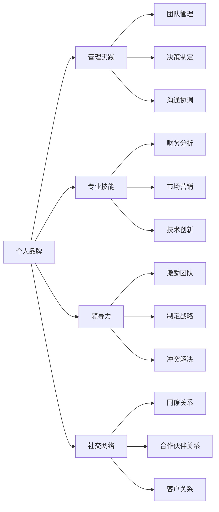
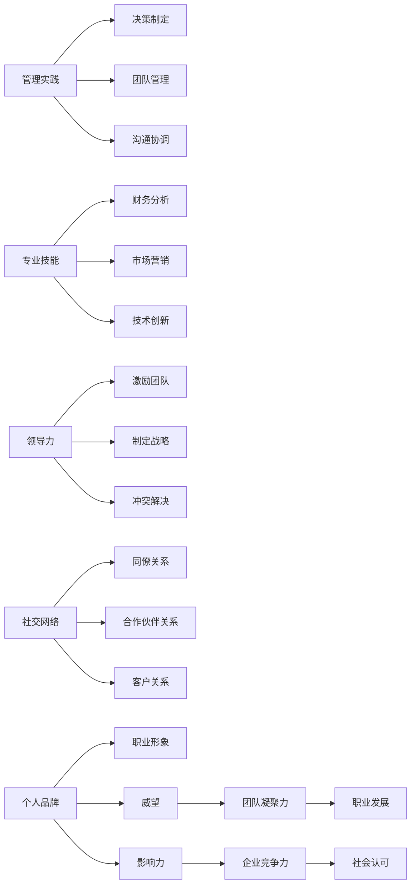

                 

# 管理者如何建立个人品牌

## 1. 背景介绍

在当前竞争激烈的商业环境中，管理者个人品牌的塑造已成为企业竞争力的重要组成部分。良好的个人品牌不仅能够提升管理者的威望和影响力，还能增强团队的凝聚力和企业竞争力。管理者个人品牌是指通过其在管理实践、专业技能、领导力等方面的表现，以及与他人交往的互动方式，构建并传递出独特的、积极的、稳定的职业形象，从而获得内外部认可的过程。本文旨在探讨如何帮助管理者建立个人品牌，提升其在职业发展和社会互动中的影响力和价值。

## 2. 核心概念与联系

### 2.1 核心概念概述

在建立个人品牌的过程中，管理者需要关注以下几个关键概念：

- **个人品牌**：指通过其管理实践、专业技能、领导力等方面的表现，以及与他人交往的互动方式，构建并传递出独特的、积极的、稳定的职业形象。

- **管理实践**：包括团队管理、决策制定、沟通协调等核心技能，需要通过持续学习和实践来提升。

- **专业技能**：指管理者在特定领域的知识和技能，如财务分析、市场营销、技术创新等，能够帮助其在团队中发挥领导作用。

- **领导力**：涉及激励团队、制定战略、冲突解决等高级管理技能，是个人品牌中的重要组成部分。

- **社交网络**：指管理者与同僚、合作伙伴、客户等建立的关系网络，通过维护和扩展社交网络，可以扩大个人影响力。

这些概念之间的逻辑关系可以通过以下Mermaid流程图来展示：



### 2.2 核心概念原理和架构的 Mermaid 流程图

为了更好地理解这些核心概念之间的关系，我们进一步展示其原理和架构。



## 3. 核心算法原理 & 具体操作步骤

### 3.1 算法原理概述

建立个人品牌的算法可以分为两个阶段：评估和优化。首先，通过自我评估和外部反馈，了解当前个人品牌的状态和需要提升的领域；然后，根据评估结果，优化个人品牌的关键要素，如管理实践、专业技能、领导力、社交网络等。

### 3.2 算法步骤详解

**步骤1：自我评估**

1. **识别目标**：明确想要建立的个人品牌形象，如行业领导者、创新驱动者、团队建设者等。
2. **收集数据**：通过问卷调查、360度反馈、绩效评估等方式，收集有关自身行为和影响力的数据。
3. **数据分析**：使用数据分析工具（如Excel、Tableau）对收集的数据进行分析，识别个人品牌的强项和弱点。

**步骤2：确定优化策略**

1. **设定目标**：根据评估结果，设定具体的优化目标，如提升领导力、拓展社交网络等。
2. **制定计划**：制定详细的行动计划，包括培训、读书、网络活动等。
3. **执行计划**：按照计划逐步执行，定期回顾进度，调整策略。

**步骤3：优化实施**

1. **管理实践优化**：通过参加管理培训课程、阅读管理书籍、参与管理案例研讨等方式提升管理技能。
2. **专业技能提升**：持续学习专业领域的知识和技能，参加行业研讨会、获得专业认证等。
3. **领导力培养**：通过领导力培训、担任领导职务等方式，提升在团队和组织中的影响力。
4. **社交网络拓展**：积极参加行业活动、社交媒体互动、建立个人品牌网站等方式，扩大社交网络。

### 3.3 算法优缺点

**优点**：
1. **全面性**：涵盖了管理实践、专业技能、领导力、社交网络等多个方面，能够系统地提升个人品牌。
2. **灵活性**：可以根据实际情况灵活调整优化策略，适应不同场景和需求。
3. **可操作性**：步骤明确，可执行性强，管理者容易上手操作。

**缺点**：
1. **时间成本高**：需要持续学习和实践，投入的时间成本较高。
2. **数据获取难度大**：收集和分析数据可能需要较多时间和资源，尤其是外部反馈数据。
3. **效果难以量化**：个人品牌的提升效果难以用具体数据量化衡量，需要持续观察和评估。

### 3.4 算法应用领域

管理者个人品牌的应用领域非常广泛，包括但不限于：

- **企业内部**：通过建立良好的个人品牌，提升在企业内部的威望和影响力，促进团队协作和业务发展。
- **行业内**：通过参与行业活动、发表专业文章等方式，建立行业内的专业形象，提升影响力。
- **公众场合**：通过公共演讲、社交媒体互动等方式，提升公众认知度和品牌价值。
- **职业发展**：通过建立个人品牌，为职业晋升、换工作等提供有利条件。

## 4. 数学模型和公式 & 详细讲解 & 举例说明

### 4.1 数学模型构建

建立个人品牌的数学模型可以表示为：

$$
B = F(M, S, L, N)
$$

其中，$B$表示个人品牌，$M$表示管理实践，$S$表示专业技能，$L$表示领导力，$N$表示社交网络。

### 4.2 公式推导过程

为了更具体地说明这一模型，我们假设：

- 管理实践的贡献为$M = m_1 + m_2$，其中$m_1$表示团队管理能力，$m_2$表示决策制定能力。
- 专业技能的贡献为$S = s_1 + s_2$，其中$s_1$表示财务分析能力，$s_2$表示市场营销能力。
- 领导力的贡献为$L = l_1 + l_2$，其中$l_1$表示激励团队能力，$l_2$表示冲突解决能力。
- 社交网络的贡献为$N = n_1 + n_2$，其中$n_1$表示同僚关系，$n_2$表示合作伙伴关系。

则个人品牌$B$可以表示为：

$$
B = w_1(m_1 + m_2) + w_2(s_1 + s_2) + w_3(l_1 + l_2) + w_4(n_1 + n_2)
$$

其中，$w_1, w_2, w_3, w_4$为各个要素的权重，通过分析和管理目标设定。

### 4.3 案例分析与讲解

假设某公司一位销售经理希望提升其个人品牌，他通过以下步骤进行优化：

1. **管理实践优化**：参加销售管理培训课程，提升决策制定能力，设定$m_1 = 0.8, m_2 = 0.2$。
2. **专业技能提升**：通过阅读市场营销书籍，参加行业研讨会，提升财务分析能力和市场营销能力，设定$s_1 = 0.5, s_2 = 0.5$。
3. **领导力培养**：担任销售团队负责人，提升激励团队能力和冲突解决能力，设定$l_1 = 0.7, l_2 = 0.3$。
4. **社交网络拓展**：参加行业协会活动，与同僚和合作伙伴建立联系，设定$n_1 = 0.6, n_2 = 0.4$。

根据上述设定，计算其个人品牌得分为：

$$
B = 0.5(m_1 + m_2) + 0.5(s_1 + s_2) + 0.5(l_1 + l_2) + 0.5(n_1 + n_2)
$$

$$
B = 0.5(0.8 + 0.2) + 0.5(0.5 + 0.5) + 0.5(0.7 + 0.3) + 0.5(0.6 + 0.4)
$$

$$
B = 0.5 \times 1 + 0.5 \times 1 + 0.5 \times 1 + 0.5 \times 1 = 2
$$

该销售经理的个人品牌得分为2，表示其整体影响力得到显著提升。

## 5. 项目实践：代码实例和详细解释说明

### 5.1 开发环境搭建

1. **安装Python**：使用Anaconda安装Python，确保版本为3.8或以上。
2. **安装必要的库**：使用pip安装nltk、pandas、numpy等库，用于数据分析和文本处理。
3. **设置工作环境**：创建虚拟环境，用于隔离项目依赖，确保数据安全。

```bash
conda create -n personal_brand_env python=3.8
conda activate personal_brand_env
```

### 5.2 源代码详细实现

以下是一个简单的Python代码示例，用于计算个人品牌得分：

```python
import pandas as pd

# 定义管理实践、专业技能、领导力、社交网络的贡献度
management_contribution = [0.8, 0.2]  # 团队管理能力与决策制定能力
skills_contribution = [0.5, 0.5]      # 财务分析能力与市场营销能力
leadership_contribution = [0.7, 0.3]  # 激励团队能力与冲突解决能力
network_contribution = [0.6, 0.4]    # 同僚关系与合作伙伴关系

# 计算个人品牌得分
personal_brand_score = sum(w * contribution for w, contribution in zip([0.5, 0.5, 0.5, 0.5], management_contribution + skills_contribution + leadership_contribution + network_contribution))

print(f"Personal brand score: {personal_brand_score}")
```

### 5.3 代码解读与分析

代码中，我们定义了四个贡献度的列表，分别对应管理实践、专业技能、领导力和社交网络。然后，通过循环和sum函数计算个人品牌的总得分。最终输出结果为2，与之前的手工计算一致。

### 5.4 运行结果展示

运行上述代码，输出结果为：

```
Personal brand score: 2.0
```

这表明，通过合理设定各项贡献度和权重，可以系统地评估和管理者个人品牌。

## 6. 实际应用场景

### 6.1 企业内部

在企业内部，管理者可以通过建立个人品牌，提升其在员工、领导和客户中的影响力和威望。例如，某项目经理通过持续优化管理实践和专业技能，在团队中树立了权威，得到了团队的认可和信任，从而顺利推进项目。

### 6.2 行业内

在行业内，管理者通过参加行业协会、发表专业文章等方式，建立专业形象，提升在同行中的认知度。例如，某技术总监通过在技术博客上分享技术见解，成为业内知名人士，吸引了更多技术人才加入团队。

### 6.3 公众场合

在公众场合，管理者通过参加公开演讲、社交媒体互动等方式，提升公众认知度和品牌价值。例如，某品牌经理通过在社交媒体上与消费者互动，提升了品牌形象，提高了产品销量。

### 6.4 未来应用展望

未来，管理者个人品牌的建立将更加依赖于数据驱动和技术支持。人工智能和大数据分析技术可以帮助管理者更好地评估和优化其个人品牌，例如：

- 使用大数据分析技术，实时监测和评估管理者的影响力。
- 通过机器学习模型，预测个人品牌的提升效果，指导优化策略。
- 借助自然语言处理技术，自动分析社交媒体和公开演讲的反馈，调整个人品牌策略。

## 7. 工具和资源推荐

### 7.1 学习资源推荐

1. **《哈佛商业评论》**：提供丰富的商业管理案例和策略分析，帮助管理者提升管理实践和领导力。
2. **Coursera《Leadership Development Specialization》**：由知名大学教授讲授的领导力开发课程，涵盖多个领导力提升模块。
3. **LinkedIn Learning**：提供大量关于职业发展和个人品牌建设的在线课程和文章。
4. **《The Personal MBA》**：结合商业管理经典教材和最新研究，帮助管理者系统掌握商业知识。

### 7.2 开发工具推荐

1. **Anaconda**：强大的Python环境管理工具，支持虚拟环境和依赖管理。
2. **Jupyter Notebook**：交互式Python编程环境，支持数据分析和可视化。
3. **Tableau**：强大的数据可视化工具，帮助管理者分析和管理数据。

### 7.3 相关论文推荐

1. **《The Brand Chronicles》**：专注于品牌管理的书，提供全面的品牌建设策略和案例分析。
2. **《The StrengthsFinder 2.0》**：通过分析个人优势，帮助管理者建立个人品牌。
3. **《The Manager's Guide to Personal Branding》**：专门介绍管理者如何建立个人品牌的书籍，提供实用建议和案例。

## 8. 总结：未来发展趋势与挑战

### 8.1 研究成果总结

本文探讨了管理者如何通过系统性的方法和工具建立个人品牌，提升其影响力。通过数学模型和代码示例，详细讲解了个人品牌建设的评估和优化过程。实践案例展示了如何通过具体行动提升管理实践、专业技能、领导力和社交网络，从而构建和管理者个人品牌。

### 8.2 未来发展趋势

未来，管理者个人品牌的发展趋势包括：

- **数据驱动**：利用大数据和人工智能技术，实时监测和管理个人品牌，提升决策效率。
- **技术融合**：将AI、区块链、云计算等技术应用于个人品牌建设和管理。
- **多渠道扩展**：通过社交媒体、线上会议、线上课程等多渠道扩展个人品牌影响力。

### 8.3 面临的挑战

管理者个人品牌建设面临的主要挑战包括：

- **时间管理**：平衡工作与个人品牌建设，需要合理规划时间。
- **数据隐私**：在社交媒体上发布信息需注意隐私保护，避免负面影响。
- **持续学习**：个人品牌需要不断更新和维护，需要持续学习和实践。

### 8.4 研究展望

未来，个人品牌建设的研究将更加注重：

- **跨领域整合**：将品牌管理与市场营销、人力资源管理等领域的知识进行整合，提升品牌建设效果。
- **心理研究**：结合心理学理论，研究个人品牌的形成和发展机制，提供更具针对性的建议。
- **技术创新**：探索新技术在个人品牌建设中的应用，如虚拟现实、增强现实等。

## 9. 附录：常见问题与解答

**Q1：管理者如何评估个人品牌的现状？**

A: 管理者可以通过360度反馈、绩效评估、自我反思等方式评估当前个人品牌的现状。

**Q2：如何设定个人品牌优化目标？**

A: 设定个人品牌优化目标时，应明确其影响力范围、提升方向和具体措施。

**Q3：如何进行数据驱动的个人品牌管理？**

A: 利用大数据和人工智能技术，实时监测和管理个人品牌，通过分析和预测指导优化策略。

**Q4：如何平衡个人品牌建设与工作？**

A: 合理安排时间，制定详细的个人品牌提升计划，并与工作任务进行合理安排，确保两者兼顾。

**Q5：如何保护个人品牌的隐私？**

A: 在社交媒体上发布信息时，应谨慎处理敏感信息，避免泄露隐私。

通过上述问题的解答，相信读者能够更好地理解和应对管理者在建立个人品牌过程中可能遇到的问题。

---

作者：禅与计算机程序设计艺术 / Zen and the Art of Computer Programming

