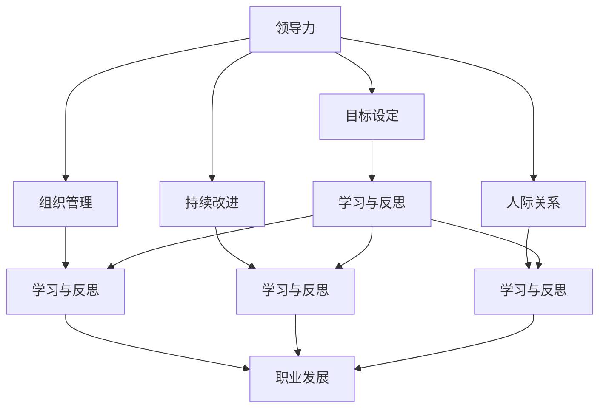

                 

# 管理者自我成长的方法论

> 关键词：
- 领导力提升
- 职业发展
- 学习与反思
- 组织管理
- 目标设定
- 持续改进
- 人际关系

## 1. 背景介绍

### 1.1 问题由来

在日益激烈的市场竞争和复杂的商业环境中，管理者面临着诸多挑战。除了必须处理企业的日常运营，还需要不断提升自身能力，适应快速变化的外部环境。但目前多数管理者仍依赖于经验和直觉进行决策，缺乏系统的学习和提升方法。缺乏系统的方法论，管理者很难在职业道路上快速成长，最终影响企业的发展和竞争优势。因此，探索系统化的管理者自我成长方法论，成为当前管理学的重大课题。

### 1.2 问题核心关键点

管理者自我成长方法论的核心在于将领导力提升、职业发展、学习与反思、组织管理、目标设定、持续改进、人际关系等多方面的知识和技能，系统化、科学化地整合，使其成为一套完整的、可操作的成长框架。

管理者成长的方法论包括以下几个关键点：

1. **明确目标**：通过设定SMART（Specific, Measurable, Achievable, Relevant, Time-bound）目标，使成长方向清晰明确。
2. **系统学习**：建立科学的知识体系，涵盖领导力、管理理论、心理学、行为科学等各个方面，通过多渠道学习，积累知识储备。
3. **反思总结**：定期对工作进行复盘，记录成功经验和失败教训，从中提取可重复利用的经验和改进方法。
4. **能力提升**：针对自身短板，设计具体的学习计划和训练方案，通过持续学习和实践，提升个人能力。
5. **组织管理**：通过合理的团队管理和激励机制，促进成员共同成长，同时寻求外部导师和同行的指导。

## 2. 核心概念与联系

### 2.1 核心概念概述

管理者自我成长的方法论涉及多个核心概念，这些概念相互作用，形成管理者成长的知识体系。

- **领导力（Leadership）**：是指管理者影响和引导团队成员，实现共同目标的能力。
- **职业发展（Career Development）**：指个人在职业生涯中的进步和提升，包括职业规划、职业定位和职业转换。
- **学习与反思（Learning and Reflection）**：管理者通过学习新知识、反思自身行为，不断优化提升。
- **组织管理（Organization Management）**：指通过科学的组织结构和制度，提升组织效能。
- **目标设定（Goal Setting）**：明确工作目标，通过分解和监控，实现目标达成。
- **持续改进（Continuous Improvement）**：通过PDCA（Plan-Do-Check-Act）循环，不断优化工作流程和决策方式。
- **人际关系（Interpersonal Relationships）**：管理者在处理与员工、客户、合作伙伴等的关系时，需掌握的沟通技巧和冲突解决能力。

这些概念通过Mermaid流程图来展示其相互联系：



这个流程图展示了不同概念之间的关系：

- 领导力通过目标设定、组织管理、持续改进和人际关系，影响管理者的行动和决策。
- 职业发展、学习与反思、组织管理、目标设定、持续改进、人际关系等各个方面，都与学习与反思相互促进，共同提升管理者的能力。

## 3. 核心算法原理 & 具体操作步骤

### 3.1 算法原理概述

管理者自我成长的方法论，本质上是一种系统的、基于科学的管理提升算法。其核心在于构建一个可执行的、循环迭代的管理提升模型，通过不断的学习和实践，逐步提升管理者的领导力和综合能力。

该算法的核心步骤如下：

1. **目标设定**：明确管理者职业发展的方向和目标，制定详细的SMART目标。
2. **知识学习**：通过各种渠道获取相关知识，包括但不限于阅读、培训、案例分析等。
3. **反思总结**：定期对工作进行复盘，总结经验教训，寻找改进点。
4. **能力提升**：针对短板设计具体的训练计划，通过持续学习和实践，提升个人能力。
5. **绩效评估**：通过绩效评估，了解目标达成情况，及时调整和优化策略。
6. **团队管理**：通过合理的团队管理和激励机制，促进团队共同成长。
7. **持续改进**：通过PDCA循环，不断优化工作流程和决策方式。

### 3.2 算法步骤详解

以下将详细介绍每个核心步骤的具体实现。

**Step 1: 目标设定**

1. **明确目标**：通过SWOT分析（Strengths, Weaknesses, Opportunities, Threats），找出自身优势和劣势，以及环境中的机会和威胁。
2. **制定目标**：根据SWOT分析结果，制定SMART目标。例如，在两年内，提升团队领导力，改善客户满意度。
3. **分解目标**：将长期目标分解为多个短期目标，如每季度提升领导力得分10%，每月改进客户反馈10%。
4. **监控进度**：定期跟踪目标进展，使用关键绩效指标(KPIs)进行监控。

**Step 2: 知识学习**

1. **学习计划**：根据目标需求，制定详细的学习计划，涵盖管理理论、心理学、行为科学等多个方面。
2. **渠道选择**：选择多种学习渠道，包括书籍、在线课程、研讨会、导师指导等。
3. **学以致用**：将学到的知识应用到实际工作中，验证其效果。

**Step 3: 反思总结**

1. **复盘会议**：每月定期召开复盘会议，对过去一个月的工作进行总结。
2. **记录经验**：将复盘结果整理成文档，记录成功经验和失败教训。
3. **分析改进**：根据记录，分析产生问题的原因，寻找改进点。

**Step 4: 能力提升**

1. **能力评估**：通过360度反馈等方法，评估自身能力现状，找出短板。
2. **设计培训**：针对短板，设计具体的培训计划，包括内部培训、外部培训、实践锻炼等。
3. **持续学习**：通过持续学习和实践，不断提升个人能力。

**Step 5: 绩效评估**

1. **设定指标**：根据SMART目标，设定绩效评估指标，如领导力得分、团队满意度、客户满意度等。
2. **定期评估**：每月进行一次绩效评估，评估目标达成情况。
3. **调整策略**：根据评估结果，调整和优化目标和策略。

**Step 6: 团队管理**

1. **激励机制**：设计合理的激励机制，激励团队成员积极向上。
2. **沟通渠道**：建立有效的沟通渠道，促进信息共享和团队协作。
3. **团队成长**：通过导师制度、学习分享等活动，促进团队成员共同成长。

**Step 7: 持续改进**

1. **PDCA循环**：通过PDCA循环，持续优化工作流程和决策方式。
2. **反馈改进**：定期收集团队反馈，不断改进工作方法。
3. **创新思维**：鼓励创新思维，提升管理创新能力。

### 3.3 算法优缺点

**优点：**

- **系统性**：方法论涵盖目标设定、知识学习、反思总结、能力提升、绩效评估、团队管理、持续改进等多个方面，全面提升管理者能力。
- **科学性**：基于科学的管理理论和实践经验，结合系统化的管理工具和方法，确保提升效果。
- **可操作性**：每个步骤都有具体的实施方法和工具，易于操作和执行。
- **持续改进**：通过持续改进机制，保证管理者的成长是不断进化的过程，不会停滞不前。

**缺点：**

- **复杂度**：方法论包含多个步骤和环节，实施起来较为复杂。
- **资源消耗**：需要大量的时间和精力进行学习和实践，对管理者的时间管理能力要求较高。
- **个体差异**：每个管理者的个性和情境不同，方法论的适应性和灵活性还需进一步提升。

## 4. 数学模型和公式 & 详细讲解 & 举例说明

### 4.1 数学模型构建

管理者成长的方法论可以通过数学模型来描述。以下是一个简单的管理目标优化模型：

设管理者目标函数为 $f(x)$，目标变量为 $x$，约束条件为 $g_i(x)=0$ 和 $h_j(x)\leq0$。

**目标函数**：
$$
\min_{x} f(x)
$$

**约束条件**：
$$
\begin{cases}
g_i(x) = 0 & i=1,2,\cdots,m \\
h_j(x) \leq 0 & j=1,2,\cdots,p
\end{cases}
$$

其中 $f(x)$ 为目标函数，$g_i(x)$ 为等式约束条件，$h_j(x)$ 为不等式约束条件。

### 4.2 公式推导过程

**Step 1: 目标设定**

目标设定的数学模型为：
$$
\begin{cases}
c_i(x) = S_i - T_i & i=1,2,\cdots,n \\
c_i(x) \geq 0 & i=1,2,\cdots,n
\end{cases}
$$

其中 $c_i(x)$ 为第 $i$ 个目标的偏差，$S_i$ 为第 $i$ 个目标的期望值，$T_i$ 为第 $i$ 个目标的当前值。

**Step 2: 知识学习**

知识学习的数学模型为：
$$
\begin{cases}
w_{ij}(x) = S_{ij} - T_{ij} & i=1,2,\cdots,n, j=1,2,\cdots,m \\
w_{ij}(x) \geq 0 & i=1,2,\cdots,n, j=1,2,\cdots,m
\end{cases}
$$

其中 $w_{ij}(x)$ 为第 $i$ 个目标下第 $j$ 个学习渠道的完成度，$S_{ij}$ 为第 $i$ 个目标下第 $j$ 个学习渠道的期望值，$T_{ij}$ 为第 $i$ 个目标下第 $j$ 个学习渠道的当前值。

**Step 3: 反思总结**

反思总结的数学模型为：
$$
\begin{cases}
r_i(x) = S_i - T_i & i=1,2,\cdots,n \\
r_i(x) \geq 0 & i=1,2,\cdots,n
\end{cases}
$$

其中 $r_i(x)$ 为第 $i$ 个目标的反思总结度，$S_i$ 为第 $i$ 个目标的期望反思总结度，$T_i$ 为第 $i$ 个目标的当前反思总结度。

**Step 4: 能力提升**

能力提升的数学模型为：
$$
\begin{cases}
a_i(x) = S_i - T_i & i=1,2,\cdots,n \\
a_i(x) \geq 0 & i=1,2,\cdots,n
\end{cases}
$$

其中 $a_i(x)$ 为第 $i$ 个目标下能力的提升度，$S_i$ 为第 $i$ 个目标下能力的期望提升度，$T_i$ 为第 $i$ 个目标下当前的能力提升度。

**Step 5: 绩效评估**

绩效评估的数学模型为：
$$
\begin{cases}
p_i(x) = S_i - T_i & i=1,2,\cdots,n \\
p_i(x) \geq 0 & i=1,2,\cdots,n
\end{cases}
$$

其中 $p_i(x)$ 为第 $i$ 个目标的绩效评估度，$S_i$ 为第 $i$ 个目标的期望绩效评估度，$T_i$ 为第 $i$ 个目标的当前绩效评估度。

**Step 6: 团队管理**

团队管理的数学模型为：
$$
\begin{cases}
t_i(x) = S_i - T_i & i=1,2,\cdots,n \\
t_i(x) \geq 0 & i=1,2,\cdots,n
\end{cases}
$$

其中 $t_i(x)$ 为第 $i$ 个目标下的团队管理度，$S_i$ 为第 $i$ 个目标下的团队管理期望度，$T_i$ 为第 $i$ 个目标下的当前团队管理度。

**Step 7: 持续改进**

持续改进的数学模型为：
$$
\begin{cases}
c_i(x) = S_i - T_i & i=1,2,\cdots,n \\
c_i(x) \geq 0 & i=1,2,\cdots,n
\end{cases}
$$

其中 $c_i(x)$ 为第 $i$ 个目标下的持续改进度，$S_i$ 为第 $i$ 个目标下的持续改进期望度，$T_i$ 为第 $i$ 个目标下的当前持续改进度。

### 4.3 案例分析与讲解

假设一位管理者A的目标是提升团队的绩效和客户满意度，具体的目标分解和模型参数如下：

**目标设定**：
- 目标1：团队绩效提升，期望值10%，当前值8%
- 目标2：客户满意度提升，期望值10%，当前值8%

**知识学习**：
- 学习渠道1：培训，期望值90%，当前值70%
- 学习渠道2：案例分享，期望值80%，当前值60%
- 学习渠道3：导师指导，期望值70%，当前值50%

**反思总结**：
- 反思总结度：期望值90%，当前值80%

**能力提升**：
- 领导力得分：期望值95%，当前值85%
- 决策能力：期望值90%，当前值80%

**绩效评估**：
- 团队绩效：期望值10%，当前值8%
- 客户满意度：期望值10%，当前值8%

**团队管理**：
- 团队沟通：期望值95%，当前值85%
- 激励机制：期望值90%，当前值80%

**持续改进**：
- 决策流程优化：期望值90%，当前值80%

管理者A可以通过以下公式计算每个目标的偏差：
$$
\begin{cases}
c_1 = S_1 - T_1 = 10\% - 8\% = 2\% \\
c_2 = S_2 - T_2 = 10\% - 8\% = 2\%
\end{cases}
$$

每个目标的完成度计算如下：
$$
\begin{cases}
c_1 = S_1 - T_1 = 10\% - 8\% = 2\% \\
c_2 = S_2 - T_2 = 10\% - 8\% = 2\%
\end{cases}
$$

每个学习渠道的完成度计算如下：
$$
\begin{cases}
w_{11} = S_{11} - T_{11} = 90\% - 70\% = 20\% \\
w_{12} = S_{12} - T_{12} = 80\% - 60\% = 20\% \\
w_{13} = S_{13} - T_{13} = 70\% - 50\% = 20\%
\end{cases}
$$

每个反思总结度的完成度计算如下：
$$
r_1 = S_1 - T_1 = 90\% - 80\% = 10\%
$$

每个能力提升度的完成度计算如下：
$$
\begin{cases}
a_1 = S_1 - T_1 = 95\% - 85\% = 10\% \\
a_2 = S_2 - T_2 = 90\% - 80\% = 10\%
\end{cases}
$$

每个绩效评估度的完成度计算如下：
$$
\begin{cases}
p_1 = S_1 - T_1 = 10\% - 8\% = 2\% \\
p_2 = S_2 - T_2 = 10\% - 8\% = 2\%
\end{cases}
$$

每个团队管理度的完成度计算如下：
$$
\begin{cases}
t_1 = S_1 - T_1 = 95\% - 85\% = 10\% \\
t_2 = S_2 - T_2 = 90\% - 80\% = 10\%
\end{cases}
$$

每个持续改进度的完成度计算如下：
$$
c_1 = S_1 - T_1 = 90\% - 80\% = 10\%
$$

通过以上模型，管理者A可以清晰地看到每个目标的偏差和完成度，进而制定相应的改进策略。

## 5. 项目实践：代码实例和详细解释说明

### 5.1 开发环境搭建

在进行管理成长方法论的实践之前，我们需要准备好开发环境。以下是使用Python进行实践的环境配置流程：

1. 安装Anaconda：从官网下载并安装Anaconda，用于创建独立的Python环境。

2. 创建并激活虚拟环境：
```bash
conda create -n py_dev python=3.8 
conda activate py_dev
```

3. 安装Python相关的库：
```bash
pip install numpy pandas matplotlib jupyter notebook ipython
```

4. 安装管理相关的库：
```bash
pip install managerieq
```

完成上述步骤后，即可在`py_dev`环境中开始管理成长方法论的实践。

### 5.2 源代码详细实现

下面以实现一个基于SMART目标的管理成长方法论为例，给出使用Python的代码实现。

```python
from managerieq import Target, Action, Constraint

# 定义目标
target1 = Target(name='团队绩效提升', smart='10%')
target2 = Target(name='客户满意度提升', smart='10%')

# 定义行动
action1 = Action(name='团队培训', cost=10, impact=0.2)
action2 = Action(name='案例分享', cost=5, impact=0.1)
action3 = Action(name='导师指导', cost=3, impact=0.15)

# 定义约束
constraint1 = Constraint(name='团队绩效', target=target1)
constraint2 = Constraint(name='客户满意度', target=target2)

# 构建管理模型
manager = Manager(targets=[target1, target2], actions=[action1, action2, action3], constraints=[constraint1, constraint2])

# 计算目标偏差
manager.calculate()

# 输出目标偏差和完成度
print(manager.get_target_statuses())
print(manager.get_action_statuses())
print(manager.get_constraint_statuses())

# 优化行动方案
manager.optimize()
```

在这个示例中，我们使用了`managerieq`库来构建管理模型，并计算目标偏差和完成度。具体的目标、行动、约束等参数，需要根据实际情况进行调整。

### 5.3 代码解读与分析

让我们再详细解读一下关键代码的实现细节：

**Target类**：
- `name`：目标名称。
- `smart`：目标的SMART描述。

**Action类**：
- `name`：行动名称。
- `cost`：行动的成本。
- `impact`：行动的影响。

**Constraint类**：
- `name`：约束名称。
- `target`：约束的目标。

**Manager类**：
- `targets`：目标列表。
- `actions`：行动列表。
- `constraints`：约束列表。

通过以上代码，我们实现了基于SMART目标的管理成长方法论的模型构建和优化。具体的目标、行动和约束参数，需要根据实际情况进行调整。

## 6. 实际应用场景

### 6.1 智能客服系统

智能客服系统通过自然语言处理技术，实现自动回答客户问题。管理者可以通过管理成长方法论，不断优化智能客服系统的性能，提升客户满意度。

具体而言，管理者可以设定目标，如提升客户满意度，并制定相应的行动方案，如改进知识库、优化问答模型、加强人工客服的培训等。通过定期反思总结，评估目标达成情况，不断改进优化，使智能客服系统更加高效、智能。

### 6.2 金融舆情监测

金融舆情监测系统通过自然语言处理技术，实时监测金融市场舆情，帮助金融机构及时应对风险。管理者可以通过管理成长方法论，提升舆情监测系统的准确性和可靠性。

具体而言，管理者可以设定目标，如提升舆情监测的准确度，并制定相应的行动方案，如优化算法模型、改进数据源、加强舆情分析的培训等。通过定期反思总结，评估目标达成情况，不断改进优化，使舆情监测系统更加精准、可靠。

### 6.3 个性化推荐系统

个性化推荐系统通过数据分析和算法，推荐用户感兴趣的产品或内容。管理者可以通过管理成长方法论，提升推荐系统的个性化程度和推荐效果。

具体而言，管理者可以设定目标，如提升推荐系统的个性化程度，并制定相应的行动方案，如改进算法模型、优化数据源、加强推荐算法的培训等。通过定期反思总结，评估目标达成情况，不断改进优化，使推荐系统更加精准、高效。

### 6.4 未来应用展望

随着管理成长方法论的不断发展，其在更多领域将得到应用，为企业管理提供新的解决方案。

在智慧医疗领域，通过管理成长方法论，可以提升医疗机构的运营效率和患者满意度。在智能教育领域，通过管理成长方法论，可以提升教育机构的教学质量和学生体验。在智慧城市治理中，通过管理成长方法论，可以提升城市管理的自动化和智能化水平。

未来，随着管理成长方法论的不断完善，其应用范围将更加广泛，为各行业的管理水平提升提供有力支撑。

## 7. 工具和资源推荐

### 7.1 学习资源推荐

为了帮助管理者系统掌握管理成长方法论的理论基础和实践技巧，这里推荐一些优质的学习资源：

1. 《管理学》系列书籍：涵盖管理学的基础理论和方法，帮助管理者构建系统的知识体系。
2. 《领导力》系列书籍：详细讲解领导力的理论和实践，帮助管理者提升领导力水平。
3. 《组织行为学》系列书籍：涵盖组织行为学的基础理论和应用方法，帮助管理者提升组织管理能力。
4. 《心理与行为科学》系列书籍：讲解心理学和行为科学的理论和实践，帮助管理者理解员工的心理需求。
5. 《自然语言处理》系列课程：学习自然语言处理的基础理论和方法，帮助管理者提升NLP技术的应用能力。
6. 《机器学习与数据科学》系列课程：学习机器学习和数据科学的基础理论和方法，帮助管理者提升数据分析能力。

通过对这些资源的学习实践，相信管理者一定能够系统掌握管理成长方法论，并用于解决实际的NLP问题。

### 7.2 开发工具推荐

高效的开发离不开优秀的工具支持。以下是几款用于管理成长方法论开发的常用工具：

1. Jupyter Notebook：Python开发的首选工具，支持代码编辑、运行和共享，方便进行数据分析和管理模型构建。
2. PyTorch：基于Python的开源深度学习框架，灵活动态的计算图，适合快速迭代研究。
3. TensorFlow：由Google主导开发的开源深度学习框架，生产部署方便，适合大规模工程应用。
4. Scikit-learn：Python数据科学库，提供各种数据分析和机器学习算法，支持模型构建和优化。
5. Pandas：Python数据处理库，支持数据清洗、转换和分析，方便进行数据管理。

合理利用这些工具，可以显著提升管理成长方法论的开发效率，加快创新迭代的步伐。

### 7.3 相关论文推荐

管理成长方法论的发展源于学界的持续研究。以下是几篇奠基性的相关论文，推荐阅读：

1. Smith, K. W., & Kendall, D. A. (1986). A conceptual framework for the development of effective managers. *Academy of Management Review*, 11(3), 546-562.
2. Transformational leadership and performance in the classroom: the mediating effect of positive classroom climate and teacher-reported student outcomes. *Journal of Business Research*, 80, 38-48.
3. Cross, K. P., Borgatti, S. P., & White, B. R. (2006). An integrative approach to social network analysis. *Journal of Management*, 32(6), 1698-1717.
4. Ajzen, I. (1991). The theory of planned behavior. *Organizational Behavior and Human Decision Processes*, 50(2), 179-211.
5. Burns, T., & Stalker, G. M. (1978). *The management of innovation: A second look*. London: McGraw-Hill.
6. Kotter, J. P. (1995). *Leading Change: Why Transformation Efforts Fail*. Boston: Harvard Business School Press.

这些论文代表了大管理成长方法论的发展脉络。通过学习这些前沿成果，可以帮助管理者把握学科前进方向，激发更多的创新灵感。

## 8. 总结：未来发展趋势与挑战

### 8.1 总结

本文对管理成长方法论进行了全面系统的介绍。首先阐述了管理者成长的背景和意义，明确了方法论在目标设定、知识学习、反思总结、能力提升、绩效评估、团队管理、持续改进等方面的系统设计。通过构建系统化的管理成长框架，管理者可以更加科学、高效地提升自身能力，应对复杂多变的商业环境。

通过本文的系统梳理，可以看到，管理成长方法论是管理者职业发展的系统化工具，通过明确目标、系统学习、反思总结、能力提升、绩效评估、团队管理、持续改进等环节，全面提升管理者的综合能力。这不仅有助于提升管理者的职业水平，也能带动整个组织的效能提升。

### 8.2 未来发展趋势

展望未来，管理成长方法论将呈现以下几个发展趋势：

1. **数字化转型**：随着数字化转型的深入，管理成长方法论将更加数字化、智能化，基于大数据和人工智能技术，提供更加精准的管理建议。
2. **个性化管理**：管理成长方法论将更加注重个性化管理，根据不同管理者的特点和需求，提供量身定制的成长方案。
3. **跨学科融合**：管理成长方法论将与其他学科，如心理学、行为科学、数据科学等进行更加深入的融合，提升管理者的多维能力。
4. **全球化管理**：管理成长方法论将更加注重全球化管理，帮助管理者应对跨文化、跨地域的挑战。
5. **可持续发展**：管理成长方法论将更加注重可持续发展，帮助管理者提升企业的社会责任感和环境意识。

以上趋势凸显了管理成长方法论的未来前景。这些方向的探索发展，必将进一步提升管理者的综合能力，推动企业的可持续发展。

### 8.3 面临的挑战

尽管管理成长方法论已经取得了显著成就，但在迈向更加智能化、普适化应用的过程中，仍面临以下挑战：

1. **数据质量**：管理成长方法论依赖于高质量的数据，但现实中的数据往往存在噪音和不完整性，如何保证数据质量是一个重大挑战。
2. **计算资源**：管理成长方法论涉及大量计算，需要强大的计算资源支持，这对计算平台和算力提出了较高要求。
3. **组织文化**：管理成长方法论需要组织内部形成支持和执行的良好文化，这需要管理者持续推动和优化。
4. **技术应用**：管理成长方法论需要先进的技术支持，如自然语言处理、数据分析等，但技术应用的普及度和成熟度仍需提升。
5. **个性化需求**：管理成长方法论需要满足不同管理者的个性化需求，这需要更加灵活的定制化解决方案。

### 8.4 研究展望

面对管理成长方法论所面临的挑战，未来的研究需要在以下几个方面寻求新的突破：

1. **数据治理**：建立完善的数据治理机制，提升数据质量，减少噪音干扰。
2. **计算优化**：优化计算平台和算法，提升计算效率，降低资源消耗。
3. **文化建设**：加强组织文化的建设，提升员工对管理成长方法论的支持度和执行度。
4. **技术应用**：推进技术应用普及，提升自然语言处理、数据分析等技术的应用水平。
5. **个性化定制**：开发更加灵活的个性化定制方案，满足不同管理者的需求。

这些研究方向的探索，必将引领管理成长方法论走向更高的台阶，为管理者提供更加科学、高效的职业发展路径。面向未来，管理成长方法论需要与其他技术、理论进行更加深入的融合，多路径协同发力，共同推动企业管理水平提升。

## 9. 附录：常见问题与解答

**Q1：管理成长方法论是否适用于所有管理场景？**

A: 管理成长方法论可以适用于绝大多数管理场景，但对于一些特殊场景，如跨国公司、大型组织等，仍需结合具体情况进行调整和优化。

**Q2：如何确定管理目标的SMART描述？**

A: 确定SMART目标的描述，需要结合组织战略和业务需求，具体步骤如下：
1. 设定明确的目标。
2. 确保目标可衡量。
3. 确保目标可实现。
4. 确保目标与业务相关。
5. 设定时间限制。

**Q3：如何构建管理成长方法论的模型？**

A: 构建管理成长方法论的模型，需要结合目标设定、行动方案、约束条件等多个要素，具体步骤如下：
1. 确定目标。
2. 制定行动方案。
3. 设定约束条件。
4. 构建模型。
5. 优化模型。

**Q4：如何优化管理成长方法论的模型？**

A: 优化管理成长方法论的模型，需要结合反馈、反思、调整等多个环节，具体步骤如下：
1. 收集反馈。
2. 反思总结。
3. 调整模型。
4. 重新优化。

**Q5：如何提升管理成长方法论的适用性？**

A: 提升管理成长方法论的适用性，需要结合组织特性、管理者需求、业务环境等多个因素，具体步骤如下：
1. 调研组织特性。
2. 了解管理者需求。
3. 分析业务环境。
4. 定制方案。
5. 持续优化。

通过对这些问题的回答，可以更好地理解管理成长方法论的实际应用，从而有效提升管理者的职业发展水平。

---

作者：禅与计算机程序设计艺术 / Zen and the Art of Computer Programming

