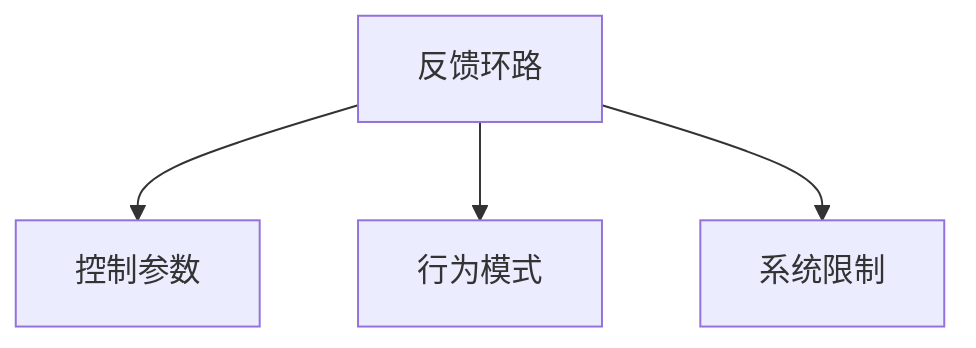

                 

# 系统思考在团队管理中的应用

系统思考(Systems Thinking)是一种复杂性分析方法，它从整体出发，研究系统各组成部分之间的相互关系和动态变化，从而找到系统行为的根本原因，并指导决策和行动。在系统思考的视角下，团队管理不再是孤立地看一个个单独的任务或成员，而是将团队视为一个整体，研究其内部各元素之间的交互作用和相互依赖关系。

## 1. 背景介绍

### 1.1 问题由来

随着企业规模的扩大和市场竞争的加剧，团队管理变得越来越复杂。传统的管理方式往往以个体为中心，注重单项任务完成和人员绩效考核，忽视了团队整体协同和动态变化。这种管理方式在小型企业或项目中可能有效，但在大型企业或跨部门协作中则显得力不从心。系统思考方法正是在这种背景下应运而生，为企业提供了一种全新的管理视角。

### 1.2 问题核心关键点

在系统思考中，团队管理的目标是从整体上提高团队绩效和成员满意度，而不仅仅是优化各个单独的任务和人员。具体来说，关键点包括：
1. **整体视角**：团队作为一个整体，内部各成员之间的互动和依赖关系是相互影响和作用的。
2. **动态变化**：团队管理是一个动态过程，需要不断调整和优化，以适应内外环境的变化。
3. **因果关系**：系统思考关注团队行为背后的根本原因，找到影响团队绩效的关键因素。
4. **学习与反馈**：通过不断学习反馈，优化团队结构和运营方式，提升整体效能。

## 2. 核心概念与联系

### 2.1 核心概念概述

在系统思考中，团队管理涉及以下几个关键概念：

- **反馈环路(Feedback Loop)**：指团队成员之间的信息交换和互动，是系统思考的根本概念。
- **控制参数(Control Parameter)**：指团队成员的行为选择，如工作态度、沟通方式等，直接影响系统状态。
- **行为模式(Patterns of Behavior)**：指团队成员在特定情境下的一贯行为倾向，影响团队绩效。
- **系统限制(System Limits)**：指团队运行的环境限制，如资源、时间、能力等。

这些概念之间的关系可以通过以下Mermaid流程图来展示：



### 2.2 核心概念原理和架构

在系统思考中，团队管理通过以下几个步骤实现：

1. **整体视角分析**：从团队整体出发，观察各成员之间的交互关系，识别系统的关键组成部分。
2. **动态变化观察**：分析团队在各个时间段的运行状态，理解其动态变化过程。
3. **因果关系追溯**：通过观察反馈环路，找到影响团队绩效的根本原因。
4. **控制参数调整**：针对找到的控制参数，制定相应的管理策略。
5. **行为模式优化**：引导团队成员形成更有效的行为模式。
6. **系统限制应对**：通过优化资源分配、时间管理等，应对团队运行的外部限制。

## 3. 核心算法原理 & 具体操作步骤

### 3.1 算法原理概述

在系统思考中，团队管理的核心算法原理是**动态系统仿真(Simulation)**。通过构建团队的动态系统模型，模拟团队在不同管理策略下的运行状态，找到最优的管理方案。动态系统仿真涉及以下几个关键步骤：

1. **模型构建**：根据团队管理的具体需求，构建合适的系统模型。
2. **参数设定**：设定模型中的关键参数，包括控制参数、行为模式和系统限制。
3. **仿真运行**：通过仿真软件运行模型，观察系统的动态变化过程。
4. **结果分析**：分析仿真结果，找到最优的管理策略。

### 3.2 算法步骤详解

系统思考在团队管理中的应用步骤如下：

**Step 1: 系统定义**

1. **系统边界**：明确团队管理的边界，确定团队成员、任务、资源等关键要素。
2. **目标设定**：设定团队管理的总体目标，如提高绩效、提升满意度等。
3. **变量定义**：定义团队管理的变量，如工作满意度、任务完成度等。

**Step 2: 系统构建**

1. **系统建模**：使用UML或其他建模工具，构建团队管理的系统模型。
2. **行为分析**：分析团队成员的行为模式，识别可能影响团队绩效的关键行为。
3. **限制识别**：识别团队运行的外部限制，如资源不足、时间紧迫等。

**Step 3: 参数设定**

1. **控制参数选择**：选择对系统状态有显著影响的控制参数，如工作分配、沟通方式等。
2. **初始参数设定**：设定控制参数的初始值，形成初步的管理策略。
3. **参数调整机制**：设计参数调整机制，以应对不同的管理情况。

**Step 4: 仿真运行**

1. **仿真环境搭建**：搭建仿真环境，包括软件选择、参数设定等。
2. **模型运行**：运行团队管理的系统模型，观察系统在各个参数设定下的运行状态。
3. **数据收集**：收集仿真运行中的关键数据，如任务完成度、成员满意度等。

**Step 5: 结果分析**

1. **仿真结果评估**：评估仿真结果，分析团队在各个参数设定下的表现。
2. **关键因素识别**：识别影响团队绩效的关键因素，找到导致问题的根本原因。
3. **优化策略制定**：制定针对性的管理策略，优化控制参数和行为模式。

**Step 6: 实践验证**

1. **策略实施**：在实际团队管理中实施制定的管理策略。
2. **反馈收集**：收集团队成员和管理层的反馈，评估策略的实际效果。
3. **迭代优化**：根据反馈结果，进行策略的迭代优化，持续提升团队绩效。

### 3.3 算法优缺点

系统思考在团队管理中的优点包括：
1. **整体性视角**：从整体出发，考虑各成员之间的交互关系，避免孤立看待任务和人员。
2. **动态适应**：通过动态仿真，实时调整管理策略，适应团队的变化和环境的变化。
3. **因果关系分析**：找到影响团队绩效的根本原因，制定更加精准的管理措施。
4. **学习反馈机制**：通过不断学习和反馈，持续优化团队管理，提高整体效能。

系统思考的缺点包括：
1. **复杂性高**：系统思考需要考虑的因素较多，模型构建和参数设定较为复杂。
2. **需要专业工具**：系统仿真需要专业的软件工具，对用户的技术水平有一定要求。
3. **数据需求高**：系统仿真需要大量数据，收集和管理这些数据需要一定的时间和资源。

## 4. 数学模型和公式 & 详细讲解 & 举例说明

### 4.1 数学模型构建

在系统思考中，团队管理通常采用基于Agent的建模方法，其中每个Agent代表团队成员，通过模拟其行为来分析系统状态。以下是系统思考的数学模型构建步骤：

1. **系统描述**：用文字或图形描述系统组成和交互关系。
2. **状态变量定义**：定义系统的状态变量，如成员的工作满意度、任务完成度等。
3. **行为模型构建**：建立Agent的行为模型，描述其决策过程和行为选择。
4. **仿真模型构建**：将行为模型嵌入仿真软件，构建完整的系统仿真模型。

### 4.2 公式推导过程

在系统思考中，常用的数学公式包括：
1. **系统状态方程**：描述系统各个状态变量的变化规律。
2. **行为决策模型**：描述Agent的行为选择和行为模式。
3. **仿真时间步长**：设定仿真运行的时间步长，影响仿真精度。

以下是一个简单的系统状态方程的推导过程：

假设系统有$n$个成员，每个成员的工作满意度为$S_i$，初始状态为$S_{i0}$。成员行为受到当前满意度和其他成员满意度的影响，满足以下状态方程：

$$
S_i(t+1) = f(S_i(t), \sum_{j=1}^n w_{ij}S_j(t))
$$

其中$f$为满意度变化函数，$w_{ij}$为成员间的交互权重，$t$为时间步长。

### 4.3 案例分析与讲解

以下是一个系统思考在团队管理中的实际案例分析：

**案例背景**：某软件公司发现其团队在过去几个月中，整体工作效率下降，成员满意度也较低。管理层决定使用系统思考方法，分析团队管理问题，并制定改进策略。

**系统建模**：公司定义团队管理的系统边界，包括团队成员、任务、资源等关键要素。设定团队管理的总体目标为提高工作效率和成员满意度。

**行为分析**：通过调研和访谈，分析团队成员的行为模式，发现成员之间存在沟通不足、工作分配不均等问题，导致整体效率下降。

**限制识别**：识别团队运行的外部限制，如任务复杂度高、资源有限等。

**参数设定**：选择影响系统状态的控制参数，如工作分配、沟通方式等，设定初始参数值。

**仿真运行**：搭建仿真环境，运行系统模型，观察在不同管理策略下的运行状态，收集关键数据。

**结果分析**：评估仿真结果，找到影响团队绩效的关键因素，如沟通不足、工作分配不均等，制定相应的改进措施。

**实践验证**：在实际团队管理中实施改进措施，收集反馈数据，根据反馈结果进行策略的迭代优化。

## 5. 项目实践：代码实例和详细解释说明

### 5.1 开发环境搭建

在系统思考的实践应用中，常用的开发环境包括UML建模工具、系统仿真软件等。以下是几个常用的工具：

1. **UML建模工具**：如Lucidchart、StarUML等，用于定义系统模型和行为分析。
2. **系统仿真软件**：如AnyLogic、Simulink等，用于构建和运行系统模型。

### 5.2 源代码详细实现

以下是一个简单的Python代码示例，展示如何使用Python进行基于Agent的系统仿真：

```python
import networkx as nx
import matplotlib.pyplot as plt

# 定义系统模型
G = nx.Graph()

# 添加成员节点
for i in range(1, 6):
    G.add_node(f"Member{i}")

# 添加任务节点
G.add_node("Task1")
G.add_node("Task2")
G.add_node("Task3")

# 添加关系边
for i in range(1, 6):
    G.add_edge(f"Member{i}", "Task1")
    G.add_edge(f"Member{i}", "Task2")
    G.add_edge(f"Member{i}", "Task3")

# 运行仿真
for t in range(10):
    for i in range(1, 6):
        # 计算成员满意度
        S_i = 0.5 * (G.degree(f"Member{i}") + sum(G[i] for j in G.neighbors(f"Member{i}") if G[i] != G[j]))
        # 更新成员满意度
        G.nodes[f"Member{i}"]["S"] = S_i

# 绘制满意度变化曲线
plt.figure(figsize=(8, 6))
for i in range(1, 6):
    plt.plot(range(10), [G.nodes[f"Member{i}"]["S"] for i in range(1, 6)], label=f"Member{i}")
plt.xlabel("Time")
plt.ylabel("Satisfaction")
plt.legend()
plt.show()
```

### 5.3 代码解读与分析

以上代码示例展示了如何使用网络图(NetworkX)库构建一个简单的基于Agent的系统模型，并通过仿真运行观察成员满意度的变化。

**代码解析**：
1. **网络图构建**：定义一个无向图G，添加成员节点和任务节点，以及成员与任务之间的边。
2. **仿真运行**：通过循环，计算每个成员的满意度，并更新网络图中的满意度值。
3. **绘制曲线**：使用Matplotlib库绘制满意度变化曲线，展示仿真结果。

**结果解读**：
通过仿真运行，可以观察到成员满意度的变化趋势，发现不同管理策略对成员满意度的影响。例如，增加成员间的沟通合作，可以提高整体满意度，提升团队绩效。

## 6. 实际应用场景

### 6.1 企业项目管理

在系统思考中，企业项目管理可以应用系统思考方法，从整体视角出发，优化项目管理的各个环节，提高项目成功率。具体来说，可以从以下几个方面入手：

1. **需求分析**：通过系统建模，识别项目需求的关键因素，制定详细的需求分析计划。
2. **资源管理**：通过仿真模拟，优化资源分配和任务分配，提升项目执行效率。
3. **风险管理**：通过动态仿真，评估风险因素对项目的影响，制定相应的风险应对策略。
4. **团队协作**：通过行为分析，识别团队协作中的问题，制定协作优化措施。

### 6.2 供应链管理

在系统思考中，供应链管理可以应用系统思考方法，从整体视角出发，优化供应链的各个环节，提升供应链的整体效率。具体来说，可以从以下几个方面入手：

1. **需求预测**：通过系统建模，优化需求预测模型，提高预测准确性。
2. **库存管理**：通过仿真模拟，优化库存水平和订货策略，降低库存成本。
3. **物流优化**：通过行为分析，识别物流瓶颈，制定物流优化措施。
4. **供应商管理**：通过系统限制识别，优化供应商选择和管理，提升供应链可靠性。

### 6.3 人力资源管理

在系统思考中，人力资源管理可以应用系统思考方法，从整体视角出发，优化人力资源管理的各个环节，提升员工满意度和工作效率。具体来说，可以从以下几个方面入手：

1. **招聘管理**：通过系统建模，优化招聘流程，提高招聘效率和质量。
2. **绩效管理**：通过仿真模拟，优化绩效评估和激励措施，提升员工激励效果。
3. **培训管理**：通过行为分析，识别培训需求，制定培训计划，提升员工技能水平。
4. **员工发展**：通过系统限制识别，优化职业发展路径，提升员工满意度和忠诚度。

### 6.4 未来应用展望

在系统思考的指导下，团队管理的未来应用前景广阔，具体展望如下：

1. **自动化管理**：随着人工智能和大数据技术的发展，系统思考方法可以与自动化工具结合，实现更加精准和高效的管理。
2. **跨领域应用**：系统思考方法可以应用于更多领域，如医疗、教育、金融等，提升各领域的运营效率和管理水平。
3. **持续改进**：通过系统思考的动态仿真和持续反馈机制，团队管理可以不断优化和改进，适应外部环境的变化。
4. **技术融合**：系统思考可以与更多技术融合，如物联网、区块链等，提升团队管理的智能化和安全性。

## 7. 工具和资源推荐

### 7.1 学习资源推荐

为了帮助开发者系统掌握系统思考的理论基础和实践技巧，这里推荐一些优质的学习资源：

1. **《系统思考：重新塑造现代组织》**：介绍系统思考的基本概念和实际应用，帮助理解系统思考的核心思想。
2. **《组织系统：管理者的挑战》**：探讨系统思考在企业管理中的应用，提供实际案例和分析方法。
3. **《系统动力学：原理与实践》**：详细介绍系统动力学方法，帮助理解系统思考的数学基础和建模技术。
4. **《组织系统建模与仿真》**：介绍UML建模和系统仿真软件的使用，提供实际操作指导。

### 7.2 开发工具推荐

在系统思考的实践应用中，常用的开发工具包括UML建模工具、系统仿真软件等。以下是几个常用的工具：

1. **UML建模工具**：如Lucidchart、StarUML等，用于定义系统模型和行为分析。
2. **系统仿真软件**：如AnyLogic、Simulink等，用于构建和运行系统模型。
3. **数据分析工具**：如Tableau、Power BI等，用于数据可视化和分析。

### 7.3 相关论文推荐

在系统思考的研究领域，以下几篇论文具有重要参考价值：

1. **《系统思考：重新塑造现代组织》**：介绍系统思考的基本概念和实际应用，提供丰富的案例和分析方法。
2. **《组织系统：管理者的挑战》**：探讨系统思考在企业管理中的应用，提供实际案例和分析方法。
3. **《系统动力学：原理与实践》**：详细介绍系统动力学方法，帮助理解系统思考的数学基础和建模技术。
4. **《组织系统建模与仿真》**：介绍UML建模和系统仿真软件的使用，提供实际操作指导。

## 8. 总结：未来发展趋势与挑战

### 8.1 研究成果总结

在系统思考的研究中，已经取得了许多重要成果，主要包括：
1. **系统思考框架**：建立系统思考的基本框架，明确系统思考的核心概念和方法。
2. **系统动力学模型**：开发系统动力学模型，分析系统行为的动态变化。
3. **行为分析方法**：提出行为分析方法，识别影响系统绩效的关键因素。
4. **仿真优化技术**：发展仿真优化技术，提升系统管理的精度和效率。

### 8.2 未来发展趋势

在系统思考的未来发展中，以下几个趋势值得关注：
1. **智能化管理**：系统思考方法与人工智能和大数据技术结合，实现更加精准和高效的管理。
2. **跨领域应用**：系统思考方法应用于更多领域，提升各领域的运营效率和管理水平。
3. **技术融合**：系统思考方法与其他技术融合，如物联网、区块链等，提升团队管理的智能化和安全性。
4. **持续改进**：通过系统思考的动态仿真和持续反馈机制，团队管理可以不断优化和改进，适应外部环境的变化。

### 8.3 面临的挑战

在系统思考的研究中，仍然面临一些挑战：
1. **复杂性高**：系统思考需要考虑的因素较多，模型构建和参数设定较为复杂。
2. **数据需求高**：系统仿真需要大量数据，收集和管理这些数据需要一定的时间和资源。
3. **技术门槛高**：系统思考涉及UML建模、系统仿真等多种技术，需要较高的技术门槛。

### 8.4 研究展望

在系统思考的未来研究中，以下几个方向值得探索：
1. **多模态建模**：将系统思考与其他技术结合，如物联网、区块链等，实现多模态信息融合。
2. **自动化技术**：引入自动化技术，优化系统建模和仿真过程，降低人工干预。
3. **智能优化**：开发智能优化算法，提升系统仿真和优化的效率和精度。
4. **动态仿真**：实现动态仿真，实时调整管理策略，适应团队的变化和环境的变化。

## 9. 附录：常见问题与解答

**Q1: 系统思考和系统动力学有什么区别？**

A: 系统思考是一种思维方式，强调从整体视角出发，识别系统各组成部分之间的相互关系和动态变化。系统动力学则是系统思考的一种数学建模技术，通过建立动态模型，模拟系统的行为变化。

**Q2: 在系统思考中，如何选择合适的控制参数？**

A: 在系统思考中，选择控制参数需要考虑以下几个因素：
1. **影响度**：选择对系统状态有显著影响的控制参数，如工作分配、沟通方式等。
2. **可控性**：选择可以控制的参数，便于调整和管理。
3. **重要性**：选择对团队绩效有重要影响的控制参数，优先优化。

**Q3: 在系统思考中，如何处理数据缺失问题？**

A: 在系统思考中，数据缺失是一个常见问题。处理数据缺失的方法包括：
1. **插值法**：使用插值法填补缺失数据，如线性插值、多项式插值等。
2. **均值填补**：使用均值填补缺失数据，如取均值、取中位数等。
3. **回归分析**：使用回归分析模型预测缺失数据。

**Q4: 在系统思考中，如何进行行为分析？**

A: 在系统思考中，行为分析主要通过观察和访谈等方式，识别团队成员的行为模式和影响因素。具体步骤包括：
1. **数据收集**：通过问卷、访谈等方式，收集团队成员的行为数据。
2. **行为识别**：分析行为数据，识别团队成员的一贯行为模式。
3. **因果分析**：通过行为分析，识别影响团队绩效的关键因素，找到根本原因。

**Q5: 在系统思考中，如何进行系统建模？**

A: 在系统思考中，系统建模主要通过UML建模工具实现。具体步骤包括：
1. **系统描述**：用文字或图形描述系统组成和交互关系。
2. **状态变量定义**：定义系统的状态变量，如成员的工作满意度、任务完成度等。
3. **行为模型构建**：建立Agent的行为模型，描述其决策过程和行为选择。
4. **仿真模型构建**：将行为模型嵌入仿真软件，构建完整的系统仿真模型。

**Q6: 在系统思考中，如何进行仿真优化？**

A: 在系统思考中，仿真优化主要通过调整仿真参数和优化控制参数实现。具体步骤包括：
1. **参数调整**：调整仿真参数，如时间步长、仿真次数等，提升仿真精度。
2. **控制参数优化**：优化控制参数，如工作分配、沟通方式等，提高系统绩效。
3. **反馈调整**：通过仿真结果，反馈调整控制参数和行为模式，提升系统性能。

---

作者：禅与计算机程序设计艺术 / Zen and the Art of Computer Programming

