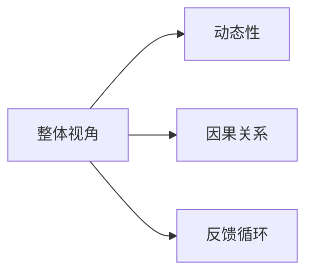

                 

# 系统思考在管理中的应用

> 关键词：系统思考, 管理, 组织变革, 决策分析, 系统动力学, 领导力

## 1. 背景介绍

在快速变化和复杂多变的商业环境中，企业面临的挑战日益增加。传统的管理方式，如严格的层级结构、分散的决策制定和短视的绩效考核，已难以满足现代企业的需求。系统思考（Systems Thinking）作为一种新兴的管理思维，强调从整体视角出发，理解系统中各部分之间的动态关系，通过优化整体来提升部分的效果。本文将系统思考的核心理念应用于管理中，探讨其在组织变革、决策分析、领导力提升等方面的应用，以期为企业提供新的管理思路和方法。

## 2. 核心概念与联系

### 2.1 核心概念概述

系统思考是一种管理思维框架，旨在帮助人们理解、分析和改善复杂系统。其核心理念包括以下几个方面：

- **整体视角**：强调系统作为一个整体进行观察，而不是局部。系统各部分之间相互关联，部分的变化会影响整体，反之亦然。
- **动态性**：系统是动态变化的，输入、输出、状态和结构都会随时间演化。系统思考关注系统变化的机制和驱动因素。
- **因果关系**：系统中的变化往往是多因多果的，识别和理解因果链是系统思考的重要部分。
- **反馈循环**：系统中的输入和输出之间存在反馈循环，对系统的稳定性和动态性有重要影响。

### 2.2 核心概念原理和架构的 Mermaid 流程图



这个流程图展示了系统思考的核心概念及其相互关系。整体视角强调系统作为一个整体进行观察，动态性关注系统随时间变化，因果关系和反馈循环则揭示系统内部的变化机制。

### 2.3 核心概念的联系

系统思考中的各个概念相互关联，共同构成一个全面的管理框架。整体视角提供了一个全局视角，动态性强调变化和适应，因果关系和反馈循环则揭示了变化的驱动因素和影响机制。通过综合这些概念，可以更好地理解和管理复杂系统，从而优化组织结构和流程，提升企业的整体绩效。

## 3. 核心算法原理 & 具体操作步骤

### 3.1 算法原理概述

系统思考在管理中的应用，主要体现在以下几个方面：

1. **组织变革**：通过系统思考，可以更好地理解组织内部各部分之间的相互关系，识别影响组织整体绩效的关键因素，从而进行系统性的组织变革。
2. **决策分析**：系统思考提供了一种动态、整体的决策框架，能够帮助管理层在复杂多变的环境中做出更科学的决策。
3. **领导力提升**：系统思考强调领导者的整体视角和系统理解，帮助领导者更有效地进行战略规划和资源配置。

### 3.2 算法步骤详解

系统思考在管理中的应用，主要包括以下几个步骤：

**Step 1: 建立系统模型**

- 识别系统的关键组成部分，如人、流程、技术等。
- 分析各部分之间的关系，识别系统的输入、输出、状态和结构。
- 绘制系统图，使用节点和箭头表示各部分及其关系。

**Step 2: 分析系统动态**

- 通过系统图，识别系统的关键反馈循环和因果链。
- 使用系统动力学软件，如Stella或Vensim，进行仿真和模拟。
- 分析系统在特定输入条件下的行为，预测系统的未来趋势。

**Step 3: 设计干预策略**

- 根据系统分析结果，设计干预措施，如调整流程、优化资源配置等。
- 设计干预措施时，考虑其对系统其他部分的影响。
- 实施干预措施，监控其效果，根据反馈调整策略。

### 3.3 算法优缺点

系统思考在管理中的优点包括：

- **全局视角**：帮助管理层理解系统各部分之间的相互关系，避免局部优化导致整体损害。
- **动态适应**：关注系统随时间变化的特点，提高对变化的适应能力。
- **科学决策**：提供了一种基于系统动态和因果关系的决策框架，减少决策的盲目性。

系统思考也存在一些局限性：

- **复杂性**：系统思考需要识别和理解系统内部的复杂关系，对管理层的要求较高。
- **实施难度**：设计和实施干预措施需要综合考虑系统各部分的影响，难度较大。
- **数据需求**：系统思考需要大量系统数据进行建模和分析，数据获取和处理成本较高。

### 3.4 算法应用领域

系统思考在管理中的应用广泛，主要包括以下几个领域：

1. **组织变革**：通过系统思考，识别和解决影响组织整体绩效的关键因素，进行系统性的组织重构。
2. **决策分析**：应用于复杂多变的决策场景，帮助管理层进行科学决策。
3. **领导力提升**：指导领导者从整体视角进行战略规划，优化资源配置，提升领导力。
4. **风险管理**：识别和分析系统中的风险点，进行系统性的风险控制。
5. **流程优化**：通过系统思考，优化流程中的瓶颈和冗余，提升整体效率。

## 4. 数学模型和公式 & 详细讲解 & 举例说明

### 4.1 数学模型构建

系统思考的数学模型通常使用系统动力学（Systems Dynamics）方法进行建模。系统动力学是一种研究系统动态行为的建模方法，通过因果关系和反馈循环来模拟系统的行为和变化。

**系统动力学模型结构**：

$$
\dot{x} = f(x, u, p)
$$

其中，$x$ 表示系统状态，$u$ 表示系统输入，$p$ 表示系统参数，$f$ 表示系统动态方程。

### 4.2 公式推导过程

以一个简单的供应链系统为例，使用系统动力学方法进行建模和推导。

1. **识别系统组成部分**：
   - 供应商、生产商、仓库、客户。
   - 库存水平、订单数量、生产能力、需求量。

2. **建立因果关系**：
   - 供应商供应 => 仓库库存 => 生产商生产 => 客户需求。
   - 订单数量 => 需求量 => 生产商生产 => 库存水平。

3. **建立反馈循环**：
   - 生产商生产 => 库存水平 => 供应商供应 => 仓库库存。
   - 库存水平 => 生产商生产 => 订单数量 => 需求量。

4. **构建系统动力学方程**：
   $$
   \dot{x}_1 = -k_1 x_1 + k_2 u_1
   $$
   $$
   \dot{x}_2 = k_1 x_1 - k_3 x_2
   $$
   $$
   \dot{x}_3 = k_4 x_2 - k_5 x_3
   $$
   $$
   \dot{x}_4 = k_6 x_3 - k_7 x_4
   $$

其中，$x_1$ 表示供应商供应，$x_2$ 表示仓库库存，$x_3$ 表示生产商生产，$x_4$ 表示客户需求；$u_1$ 表示供应商供应量，$u_2$ 表示生产商生产量，$u_3$ 表示订单数量；$k_1$ 表示供应损耗系数，$k_2$ 表示供应增加系数，$k_3$ 表示生产消耗系数，$k_4$ 表示生产增加系数，$k_5$ 表示库存损耗系数，$k_6$ 表示需求消耗系数，$k_7$ 表示需求增加系数。

### 4.3 案例分析与讲解

假设某电商平台，供应商、生产商、仓库和客户之间的关系如下：

- 供应商供应 => 仓库库存 => 生产商生产 => 客户需求。
- 订单数量 => 需求量 => 生产商生产 => 库存水平。

使用系统动力学方法进行建模，并分析不同策略下系统的动态变化。例如，当市场需求突然增加时，系统如何响应？如何调整供应商的供应量，以保持系统的稳定性？通过系统动力学仿真，可以直观地看到系统各部分的动态变化，从而优化供应链系统的设计和运行。

## 5. 项目实践：代码实例和详细解释说明

### 5.1 开发环境搭建

为了使用系统动力学软件进行建模和仿真，需要搭建相应的开发环境。以下是使用Stella进行系统动力学建模的开发环境搭建步骤：

1. **安装Stella软件**：
   - 下载Stella软件，安装到本地计算机。
   - 启动Stella软件，创建新模型。

2. **配置系统动力学方程**：
   - 添加系统组成部分和参数。
   - 建立因果关系和反馈循环。
   - 编写系统动力学方程。

3. **进行仿真分析**：
   - 运行仿真，观察系统随时间变化的动态行为。
   - 调整参数，分析不同策略下系统的响应。

### 5.2 源代码详细实现

以一个简单的供应链系统为例，使用Stella进行建模和仿真。具体步骤如下：

1. **创建新模型**：
   - 打开Stella软件，创建新模型。
   - 添加供应商、生产商、仓库、客户等组成部分。

2. **建立因果关系**：
   - 将供应商供应与仓库库存建立因果关系。
   - 将仓库库存与生产商生产建立因果关系。
   - 将生产商生产与客户需求建立因果关系。
   - 将订单数量与需求量建立因果关系。

3. **编写系统动力学方程**：
   - 添加供应商供应量的动态方程。
   - 添加仓库库存的动态方程。
   - 添加生产商生产的动态方程。
   - 添加客户需求的动态方程。

4. **进行仿真分析**：
   - 运行仿真，观察系统随时间变化的动态行为。
   - 调整供应商的供应量，观察系统响应。

### 5.3 代码解读与分析

以下是使用Stella进行系统动力学建模的代码示例：

```stella
// 创建供应商
Var supplier_supply;
// 创建仓库
Var warehouse_inventory;
// 创建生产商
Var production;
// 创建客户
Var customer_demand;

// 添加因果关系
Couple supplier_supply -> warehouse_inventory;
Couple warehouse_inventory -> production;
Couple production -> customer_demand;
Couple customer_demand -> order_quantity;
Couple order_quantity -> demand;

// 添加系统动力学方程
Equation supplier_supply_eq = k1 * supplier_supply + k2 * u1 - k3 * warehouse_inventory;
Equation warehouse_inventory_eq = k4 * production - k5 * warehouse_inventory;
Equation production_eq = k6 * order_quantity - k7 * production;
Equation customer_demand_eq = k8 * order_quantity - k9 * customer_demand;

// 运行仿真
Simulation sim;
sim.add_var(supplier_supply);
sim.add_var(warehouse_inventory);
sim.add_var(production);
sim.add_var(customer_demand);
sim.set_equation(supplier_supply_eq, warehouse_inventory_eq, production_eq, customer_demand_eq);
sim.run();
```

该代码创建了一个简单的供应链系统，并通过因果关系和动态方程进行建模。仿真结果展示了系统随时间变化的动态行为，帮助管理层进行系统分析和决策。

### 5.4 运行结果展示

通过运行仿真，可以观察到系统在特定输入条件下的动态行为。例如，调整供应商的供应量，观察系统库存水平、生产量和客户需求的变化。通过分析仿真结果，可以识别系统的关键反馈循环和因果链，从而进行系统优化和干预策略设计。

## 6. 实际应用场景

### 6.1 供应链管理

系统思考在供应链管理中的应用，可以显著提升供应链的效率和响应能力。通过系统思考，管理层可以全面了解供应链各部分之间的动态关系，识别影响供应链整体绩效的关键因素，从而进行系统性的供应链优化。例如，使用系统动力学方法，分析供应商、生产商、仓库和客户之间的相互关系，设计优化策略，提升供应链的整体性能。

### 6.2 人力资源管理

人力资源管理中，系统思考可以帮助企业更好地理解员工之间的相互关系，优化人力资源配置。例如，通过系统思考，识别员工离职的关键因素，设计科学的培训和激励机制，降低员工流失率，提升员工满意度和工作效率。

### 6.3 产品开发管理

产品开发管理中，系统思考可以帮助企业更好地理解市场需求与产品开发之间的动态关系。通过系统思考，识别市场需求变化的驱动因素，设计科学的研发策略，加速产品迭代和上市。例如，通过系统思考，分析市场需求与产品功能、技术难度之间的关系，设计科学的研发流程，优化产品开发周期。

### 6.4 风险管理

风险管理中，系统思考可以帮助企业更好地识别和评估系统中的风险点，进行系统性的风险控制。通过系统思考，识别系统中的关键反馈循环和因果链，设计科学的风险管理策略，降低系统风险。例如，通过系统思考，分析金融市场的波动对企业经营的影响，设计科学的资本管理和投资策略，降低企业经营风险。

## 7. 工具和资源推荐

### 7.1 学习资源推荐

为了帮助企业理解系统思考的核心概念和应用方法，以下是几本经典书籍，推荐阅读：

1. **《系统思考》（The Systems Thinker's Toolbox）**：作者：Peter Senge。介绍了系统思考的基本概念、方法和工具，是系统思考领域的经典之作。
2. **《系统动力学导论》（Systems Dynamics: Principles and Applications）**：作者：J. Warren Weicker。介绍了系统动力学的方法和应用，是系统动力学领域的权威教材。
3. **《系统思考：管理变革的新范式》（Systems Thinking: A New Approach to Designing Human Centered Organizations）**：作者：Kerry Eisenhardt。介绍了系统思考在组织变革中的应用，提供了丰富的案例分析。
4. **《系统思考：解锁商业动态的智慧》（Systems Thinking Unleashed）**：作者：Adrien Beauchamp。介绍了系统思考在商业决策中的应用，提供了实用的管理工具和策略。

通过对这些书籍的学习，可以帮助企业理解系统思考的核心概念和应用方法，提升系统的整体绩效。

### 7.2 开发工具推荐

为了使用系统动力学软件进行建模和仿真，以下是几款常用的系统动力学工具，推荐使用：

1. **Stella**：一款开源的系统动力学软件，提供了强大的建模和仿真功能，适用于中小型企业使用。
2. **Vensim**：一款商业化的系统动力学软件，提供了丰富的可视化工具和数据分析功能，适用于大型企业使用。
3. **AnyLogic**：一款通用的系统动力学仿真软件，支持多种模型的建模和仿真，适用于复杂系统的模拟和优化。

这些工具提供了丰富的建模和仿真功能，帮助企业进行系统思考和优化。

### 7.3 相关论文推荐

为了深入了解系统思考的研究进展和应用案例，以下是几篇经典论文，推荐阅读：

1. **《系统思考与组织变革》（Systems Thinking and Organizational Change）**：作者：Peter Senge。探讨了系统思考在组织变革中的应用，提供了丰富的案例分析。
2. **《系统动力学在风险管理中的应用》（Systems Dynamics in Risk Management）**：作者：John D. Cochrane。介绍了系统动力学在金融风险管理中的应用，提供了科学的风险管理策略。
3. **《系统思考在产品开发中的应用》（Systems Thinking in Product Development）**：作者：James Treacy。探讨了系统思考在产品开发中的应用，提供了科学的产品开发策略。

这些论文代表了系统思考在各个领域的研究进展和应用案例，有助于企业理解系统思考的核心概念和应用方法。

## 8. 总结：未来发展趋势与挑战

### 8.1 研究成果总结

系统思考在管理中的应用，已经取得了显著的成效。通过系统思考，企业能够更好地理解系统各部分之间的动态关系，优化系统设计和运营，提升整体绩效。系统思考已经被广泛应用于组织变革、决策分析、领导力提升等多个领域，为企业提供了新的管理思路和方法。

### 8.2 未来发展趋势

系统思考在管理中的应用，未来将呈现以下几个发展趋势：

1. **智能化升级**：随着人工智能技术的发展，系统思考将与AI技术进行更深入的融合，提供更加智能化的决策支持。
2. **多学科融合**：系统思考将与心理学、社会学、经济学等多个学科进行融合，提供更加全面的管理工具和策略。
3. **企业生态优化**：系统思考将帮助企业更好地理解外部环境和内部生态的关系，优化企业生态系统，提升企业的市场竞争力和可持续发展能力。
4. **数据驱动**：系统思考将更多地依赖大数据和AI技术进行分析和优化，提升系统思考的科学性和准确性。

### 8.3 面临的挑战

尽管系统思考在管理中的应用已经取得了显著成效，但仍面临以下挑战：

1. **数据需求高**：系统思考需要大量系统数据进行建模和分析，数据获取和处理成本较高。
2. **技术门槛高**：系统思考需要系统动力学等专业知识，技术门槛较高。
3. **实施难度大**：系统思考的实施需要综合考虑系统各部分的影响，难度较大。
4. **效果评估难**：系统思考的效果评估较为复杂，需要结合多方面指标进行综合评估。

### 8.4 研究展望

未来，系统思考在管理中的应用还需要在以下几个方面进行突破：

1. **数据获取与处理**：研究和开发更多数据获取和处理工具，降低系统思考的数据需求和技术门槛。
2. **技术融合**：将系统思考与AI技术、大数据技术等进行更深入的融合，提升系统思考的科学性和准确性。
3. **多学科应用**：将系统思考与其他学科进行融合，提供更加全面的管理工具和策略。
4. **效果评估**：研究和开发更科学的效果评估方法，提升系统思考的应用效果。

系统思考在管理中的应用，未来将不断拓展其应用范围，提升企业的整体绩效。只有勇于创新、敢于突破，才能不断拓展系统思考的边界，为企业的管理带来新的突破。

## 9. 附录：常见问题与解答

### 9.1 问题1：系统思考与传统管理方法的区别是什么？

答案：系统思考与传统管理方法的最大区别在于其整体视角和动态思维。传统管理方法往往关注局部优化，而系统思考强调系统各部分之间的相互关系和动态变化，从整体视角进行优化。

### 9.2 问题2：系统思考在组织变革中的应用有哪些？

答案：系统思考在组织变革中的应用包括：
1. 识别影响组织整体绩效的关键因素，进行系统性的组织重构。
2. 设计科学的组织结构和流程，提升整体效率。
3. 优化人力资源配置，提升员工满意度和工作效率。

### 9.3 问题3：系统思考在产品开发中的应用有哪些？

答案：系统思考在产品开发中的应用包括：
1. 识别市场需求变化的驱动因素，设计科学的研发策略。
2. 优化产品迭代和上市流程，加速产品上市。
3. 优化产品功能和技术难度，提升产品竞争力。

### 9.4 问题4：系统思考在供应链管理中的应用有哪些？

答案：系统思考在供应链管理中的应用包括：
1. 识别供应链各部分之间的动态关系，进行系统性的供应链优化。
2. 设计科学的供应链策略，提升供应链的效率和响应能力。
3. 识别供应链中的关键反馈循环和因果链，进行系统性的风险控制。

### 9.5 问题5：系统思考在风险管理中的应用有哪些？

答案：系统思考在风险管理中的应用包括：
1. 识别系统中的关键反馈循环和因果链，设计科学的风险管理策略。
2. 优化系统设计和运营，降低系统风险。
3. 实时监测系统状态，及时响应风险。

---

作者：禅与计算机程序设计艺术 / Zen and the Art of Computer Programming

