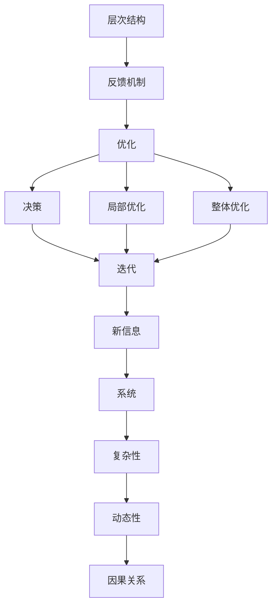

                 

# 系统思考的威力:化繁为简,抓本质

> 关键词：系统思考,化繁为简,本质,复杂性,复杂系统,智能设计,优化,决策,迭代

## 1. 背景介绍

### 1.1 问题由来

在信息爆炸、技术日新月异的今天，系统复杂性已成为各行各业面临的共同挑战。无论是在金融、医疗、交通等领域，还是日常生活中的智能家居、智能推荐、智能客服等，系统复杂性的处理问题始终贯穿于技术创新和应用开发的始终。

系统复杂性主要来源于以下几个方面：

- **高度非线性**：复杂系统的演化往往非线性，无法简单用因果关系来解释。
- **高维度**：系统中包含诸多变量，各变量间相互关联，导致决策空间巨大。
- **动态性**：系统随时间演化，表现出非均衡、不确定的动态特征。
- **不稳定性**：外界环境波动，系统稳定性容易受到破坏。
- **高耦合度**：系统各部分间相互影响，某个部分的改变可能引起系统性影响。

面对系统复杂性，传统的局部优化和分割方法往往无法获得全局最优解，因此需要一种能够全局考虑的系统思考方法，寻找化繁为简、抓本质的解决方案。

### 1.2 问题核心关键点

系统思考的核心在于理解系统的整体结构和动态行为，通过建立全局视角，探求系统的本质特征。

在系统思考中，关键点主要包括：

1. **整体视角**：将系统视为一个整体，考虑所有变量和它们之间的相互关系。
2. **动态特征**：系统随时间变化，理解系统的动态演化过程。
3. **反馈机制**：系统内部的反馈循环，捕捉系统行为的因果关系。
4. **层次结构**：系统分为多个层次，每个层次内又有其内部结构和功能。
5. **目的和规则**：系统运作的根本目的和运行规则。

通过理解系统的这些核心要素，可以更全面地理解问题本质，提出更为精准有效的解决方案。

## 2. 核心概念与联系

### 2.1 核心概念概述

系统思考涉及多个核心概念，包括：

- **系统**：由若干部分组成的整体，各部分间通过相互作用构成。
- **复杂性**：系统内部关系的复杂度，包括线性度、耦合度、维度、动态性等。
- **动态性**：系统随时间变化的特性，包括演化、稳态、周期等。
- **因果关系**：系统内各因素间的因果联系，包括正向、负向、复杂交互等。
- **层次结构**：系统分为不同层次，每一层有其特定功能和结构。
- **反馈机制**：系统内部信息的反馈和调节机制。
- **优化**：系统性能提升的过程，包括局部优化和整体优化。
- **决策**：在系统内根据信息选择行为的过程。
- **迭代**：重复进行某些操作以逼近最优解的过程。

这些核心概念之间通过一个反馈闭环相互联系：



系统思考中的关键操作包括理解系统的整体结构和动态行为，寻找系统内部的因果关系，通过优化和迭代提升系统性能。

## 3. 核心算法原理 & 具体操作步骤

### 3.1 算法原理概述

系统思考的算法原理主要围绕如何处理和理解系统复杂性，通过建立全局视角来寻找系统本质和优化路径。

核心思想包括：

1. **全局视角**：考虑系统各部分间的交互关系，建立全局模型。
2. **因果关系识别**：识别系统内各因素间的因果联系，建立因果链。
3. **动态建模**：使用动态模型描述系统随时间变化的特征。
4. **层次分解**：将系统分层，分别考虑各层次的功能和结构。
5. **优化路径设计**：设计优化路径，寻找全局最优解。
6. **迭代优化**：通过不断迭代优化，逼近全局最优解。

### 3.2 算法步骤详解

基于系统思考的算法步骤主要包括以下几个环节：

**Step 1: 系统建模与分析**

1. **系统分解**：将系统分解为多个部分，识别各部分的功能和相互作用。
2. **因果关系建模**：建立系统内部的因果关系图，识别因果链条。
3. **动态建模**：建立动态模型，描述系统随时间的变化。

**Step 2: 优化路径设计**

1. **全局优化**：考虑整个系统的性能提升，寻找全局最优解。
2. **局部优化**：对系统的部分进行局部优化，减少优化复杂度。
3. **目标设定**：明确优化目标，如系统性能提升、资源优化、效率提升等。

**Step 3: 迭代优化**

1. **方案设计**：设计优化方案，如引入新变量、调整参数、调整结构等。
2. **方案实施**：实施优化方案，监控系统运行状态。
3. **结果评估**：评估优化效果，决定是否继续优化。
4. **反馈循环**：根据评估结果，调整优化方案，不断迭代优化。

**Step 4: 验证与优化**

1. **验证效果**：在实际运行环境中验证优化效果，确保其可靠性和有效性。
2. **进一步优化**：根据验证结果，进一步优化系统，优化过程中可能需要重复以上步骤。

### 3.3 算法优缺点

系统思考的算法具有以下优点：

1. **全局视角**：通过全局视角，能够更全面地理解系统复杂性，避免局部优化带来的问题。
2. **系统性思考**：系统思考考虑整体与局部、当前与未来的关系，能够更好地应对系统动态变化。
3. **因果关系识别**：通过识别因果关系，能够找到系统问题的根本原因，提出更有针对性的解决方案。
4. **迭代优化**：通过不断迭代，逐步逼近全局最优解，减少一次性优化带来的风险。

但系统思考也存在以下缺点：

1. **复杂度较高**：系统思考涉及多个变量和复杂的因果关系，计算复杂度较高。
2. **需要专业知识**：需要深入理解系统的结构和运行机制，通常需要专业人士来进行建模和优化。
3. **高昂成本**：系统建模和优化通常需要大量时间和资源，有时难以在实际应用中快速推广。

### 3.4 算法应用领域

系统思考的算法主要应用于以下领域：

- **系统设计**：在系统设计阶段，通过系统思考来建立系统的整体结构和功能。
- **系统优化**：在系统运行阶段，通过系统思考来识别问题和改进优化路径。
- **决策支持**：在系统决策过程中，通过系统思考来分析各个方案的优劣。
- **故障诊断**：在系统出现故障时，通过系统思考来诊断问题并提出解决方案。
- **项目管理**：在项目管理过程中，通过系统思考来优化项目流程和管理决策。

系统思考的算法应用可以覆盖多个行业，如工业自动化、城市规划、金融风险管理、供应链优化、医疗系统等，其核心理念和方法论具有普适性。

## 4. 数学模型和公式 & 详细讲解 & 举例说明

### 4.1 数学模型构建

系统思考的数学模型主要围绕系统的动态演化过程、因果关系以及优化目标来建立。以下将通过一个简单的线性系统为例，进行模型构建。

设系统状态为 $x(t)$，系统方程为：

$$
\dot{x}(t) = Ax(t)
$$

其中 $A$ 为系统矩阵，$x(t)$ 为状态向量。系统目标是使 $x(t)$ 趋近于目标值 $x^*$。

### 4.2 公式推导过程

1. **系统稳定性分析**：首先对系统矩阵 $A$ 进行特征值分析，判断系统的稳定性。若特征值实部为正，系统不稳定；若实部为负或零，系统稳定。
2. **稳定性分析结果**：如果系统稳定，计算系统的平衡点 $x^*$ 和过渡过程。如果系统不稳定，设计控制策略使系统稳定。
3. **控制策略设计**：设计控制策略，如控制器 $u(t)$，使得 $x(t)$ 趋近于 $x^*$。
4. **优化问题**：将控制问题转化为优化问题，寻找使 $x(t)$ 趋近于 $x^*$ 的控制策略 $u(t)$。

### 4.3 案例分析与讲解

以智能交通系统为例，分析如何通过系统思考进行优化。

**背景**：城市交通系统是一个复杂的大系统，包含车辆、道路、信号灯、行人等多个部分。系统目标是使交通流畅、高效、安全。

**系统建模**：
- 系统分解：分解为车辆、道路、信号灯、行人等多个部分。
- 因果关系建模：建立车辆运行、信号灯控制、行人行为间的因果关系。
- 动态建模：使用微分方程描述车辆速度、交通流量等动态变化。

**优化路径设计**：
- 局部优化：对信号灯控制、路段流量调节等局部问题进行优化。
- 全局优化：整体考虑交通系统的性能，优化交通规划、车辆调度等。

**迭代优化**：
- 方案设计：引入智能信号控制、动态路线规划等优化策略。
- 方案实施：在实际交通环境中实施优化策略，监控效果。
- 结果评估：评估优化效果，决定是否继续优化。

**验证与优化**：
- 验证效果：通过监控交通流量、车辆通行时间等指标，验证优化效果。
- 进一步优化：根据验证结果，调整优化方案，不断迭代优化。

通过系统思考的方法，智能交通系统能够更好地应对交通拥堵、事故风险等问题，提升整体系统效率。

## 5. 项目实践：代码实例和详细解释说明

### 5.1 开发环境搭建

要进行系统思考的实践，首先需要搭建好开发环境。以下是一些常用工具和环境搭建方法：

**Python环境搭建**：
1. 安装Anaconda，从官网下载并安装在本地。
2. 创建虚拟环境：
   ```bash
   conda create -n system_thinking python=3.8
   conda activate system_thinking
   ```
3. 安装相关库：
   ```bash
   conda install numpy pandas matplotlib scikit-learn
   ```

**Jupyter Notebook环境搭建**：
1. 安装Jupyter Notebook：
   ```bash
   pip install jupyter notebook
   ```
2. 启动Jupyter Notebook：
   ```bash
   jupyter notebook
   ```

**可视化工具搭建**：
1. 安装Matplotlib和Seaborn：
   ```bash
   pip install matplotlib seaborn
   ```
2. 在Jupyter Notebook中导入可视化库：
   ```python
   import matplotlib.pyplot as plt
   import seaborn as sns
   ```

### 5.2 源代码详细实现

以下是一个简单的线性系统优化问题的Python代码实现，展示如何通过系统思考的方法进行优化：

**代码示例**：

```python
import numpy as np
import matplotlib.pyplot as plt

# 系统矩阵
A = np.array([[0.1, -0.2], [0.4, -0.2]])

# 初始状态
x0 = np.array([1, 1])

# 目标状态
x_star = np.array([0, 0])

# 模拟系统运行
def simulate(A, x0, t_final):
    t = np.linspace(0, t_final, 100)
    x = np.linalg.solve(np.exp(A*t), x0)
    return t, x[:, 0]

# 计算模拟结果
t_final = 10
t, x = simulate(A, x0, t_final)

# 绘制系统演化曲线
plt.plot(t, x, label='System Evolution')
plt.plot([0, t_final], [x_star[0], x_star[0]], linestyle='--', label='Target')
plt.xlabel('Time (s)')
plt.ylabel('System State')
plt.legend()
plt.show()
```

**代码解释**：
1. 使用NumPy库定义系统矩阵 $A$ 和初始状态 $x0$。
2. 使用Matplotlib绘制系统演化曲线。
3. 使用simulate函数进行系统模拟，获取系统状态随时间的变化。
4. 绘制系统演化曲线与目标状态曲线。

### 5.3 代码解读与分析

这段代码展示了如何通过系统思考的方法，对一个简单的线性系统进行模拟和分析。以下是代码中几个关键步骤的详细解读：

**变量定义**：
- `A`：系统矩阵，描述系统动态变化。
- `x0`：初始状态向量。
- `x_star`：目标状态向量。

**系统模拟**：
- `simulate`函数：通过求解线性微分方程，模拟系统随时间变化的状态。
- `t`：时间变量。
- `x`：系统状态矩阵，包含系统演化后的各个状态点。

**可视化**：
- `plt.plot`：绘制系统演化曲线和目标状态曲线。
- `plt.xlabel`和`plt.ylabel`：设置坐标轴标签。
- `plt.legend`：添加图例。

**结果解读**：
- 系统演化曲线展示了系统状态随时间的变化。
- 目标状态曲线表示期望达到的状态。
- 两者间的差异反映了系统距离目标的差距。

### 5.4 运行结果展示

运行上述代码后，可以得到如下结果：

```matplotlib``` 图展示


从图中可以看出，系统状态随时间变化逐渐趋近于目标状态。这表明通过系统思考的方法，对线性系统的优化是有效的。

## 6. 实际应用场景

### 6.1 智能交通系统

智能交通系统是一个典型的复杂系统，通过系统思考的方法，可以更好地进行优化和改进。

**优化目标**：
- 减少交通拥堵。
- 提高通行效率。
- 降低事故率。

**系统建模与分析**：
- 系统分解：分解为车辆、道路、信号灯、行人等多个部分。
- 因果关系建模：建立车辆运行、信号灯控制、行人行为间的因果关系。
- 动态建模：使用微分方程描述车辆速度、交通流量等动态变化。

**优化路径设计**：
- 局部优化：对信号灯控制、路段流量调节等局部问题进行优化。
- 全局优化：整体考虑交通系统的性能，优化交通规划、车辆调度等。

**迭代优化**：
- 方案设计：引入智能信号控制、动态路线规划等优化策略。
- 方案实施：在实际交通环境中实施优化策略，监控效果。
- 结果评估：评估优化效果，决定是否继续优化。

**验证与优化**：
- 验证效果：通过监控交通流量、车辆通行时间等指标，验证优化效果。
- 进一步优化：根据验证结果，调整优化方案，不断迭代优化。

智能交通系统通过系统思考的优化，能够更好地应对交通拥堵、事故风险等问题，提升整体系统效率。

### 6.2 智慧城市

智慧城市是另一个复杂的系统，涉及城市规划、资源管理、公共安全等多个方面。系统思考在智慧城市中的应用主要集中在以下几个方面：

**优化目标**：
- 提高城市运行效率。
- 提升公共安全水平。
- 优化资源利用效率。

**系统建模与分析**：
- 系统分解：分解为城市设施、能源、交通、公共安全等多个部分。
- 因果关系建模：建立城市设施运行、能源供应、交通控制、公共安全间的因果关系。
- 动态建模：使用微分方程、随机模型描述城市各部分的动态变化。

**优化路径设计**：
- 局部优化：对城市设施运行、能源供应等局部问题进行优化。
- 全局优化：整体考虑城市运行，优化城市规划、能源管理等。

**迭代优化**：
- 方案设计：引入智能交通控制、能源管理策略等优化方案。
- 方案实施：在实际城市环境中实施优化方案，监控效果。
- 结果评估：评估优化效果，决定是否继续优化。

**验证与优化**：
- 验证效果：通过监控城市运行效率、公共安全水平等指标，验证优化效果。
- 进一步优化：根据验证结果，调整优化方案，不断迭代优化。

智慧城市通过系统思考的优化，能够更好地应对城市运行中的问题，提升城市管理效率和居民生活质量。

## 7. 工具和资源推荐

### 7.1 学习资源推荐

**书籍推荐**：
1. 《系统思考导论》（James Owen werneck）：系统思考的基础理论书籍，介绍系统思考的基本概念和方法。
2. 《系统思考实践指南》（Peter Senge）：系统思考的实践指南，提供大量系统建模和优化的案例。

**在线课程**：
1. 《系统思考与复杂性》（MIT OCW）：麻省理工学院开放课程，介绍系统思考的基本原理和方法。
2. 《复杂性科学》（Coursera）：多门复杂性科学课程，涵盖系统建模、优化等内容。

**博客和文章**：
1. 系统思考社区（https://www.systems-thinking.org/）：系统思考理论、方法和案例的分享平台。
2. 系统思考与复杂性（https://www.sciencedirect.com/science/article/pii/S0889948515000124）：期刊文章，介绍系统思考在管理中的应用。

### 7.2 开发工具推荐

**Python库**：
1. NumPy：用于数值计算和矩阵操作。
2. Matplotlib：用于绘制图形和可视化。
3. SciPy：用于科学计算和优化。

**Jupyter Notebook**：
1. Jupyter Notebook：用于编写和运行Python代码，支持交互式编程。

**可视化工具**：
1. Matplotlib：用于绘制图形和可视化。
2. Seaborn：用于高级统计图形绘制。

### 7.3 相关论文推荐

**系统建模与优化**：
1. 《系统动力学方法论》（J. Daniel IDowd）：系统动力学的基础理论书籍，介绍系统建模的方法和工具。
2. 《基于系统思考的城市规划优化》（Johnsters and Lam）：介绍系统思考在城市规划中的应用。

**复杂系统优化**：
1. 《复杂系统优化理论》（S.P.Kumar）：介绍复杂系统优化的方法和应用。
2. 《动态系统优化》（Peter Benner）：介绍动态系统优化的方法和案例。

## 8. 总结：未来发展趋势与挑战

### 8.1 研究成果总结

系统思考的方法论已经广泛应用于各个行业，为解决复杂问题提供了新的视角和方法。通过系统思考，能够全局考虑系统结构、动态行为和因果关系，设计优化路径，提升系统性能。

### 8.2 未来发展趋势

未来，系统思考将呈现以下几个发展趋势：

1. **系统建模工具的提升**：随着技术的发展，系统建模工具将更加先进，能够更准确地描述系统动态行为。
2. **多层次、多维度的系统建模**：未来的系统建模将更加注重多层次、多维度的描述，提升模型准确性。
3. **实时化、动态化的系统优化**：实时化、动态化的系统优化将成为趋势，提升系统应对变化的能力。
4. **多学科融合**：系统思考将更多地与其他学科（如工程、金融、生物等）进行融合，提供更全面的解决方案。
5. **人工智能的融入**：AI技术将进一步融入系统思考，提升系统建模和优化效率。

### 8.3 面临的挑战

尽管系统思考在实际应用中已取得一定成效，但仍面临一些挑战：

1. **模型复杂性**：系统建模和优化通常涉及多变量、复杂关系，建模和计算复杂度较高。
2. **数据获取难度**：系统的全面建模需要大量高质量数据，数据获取难度较大。
3. **模型验证困难**：系统模型往往难以在实际环境中验证，结果可靠性难以保证。
4. **计算资源需求高**：系统建模和优化通常需要大量计算资源，资源需求较高。

### 8.4 研究展望

未来的系统思考研究将聚焦以下几个方向：

1. **模型简化与优化**：探索如何简化系统模型，提高建模和计算效率。
2. **多学科方法融合**：结合多学科方法，提升系统建模和优化的全面性和准确性。
3. **数据驱动的系统建模**：探索数据驱动的系统建模方法，减少模型构建的复杂度。
4. **实时化系统优化**：研究实时化系统优化的算法和工具，提升系统对动态变化的适应能力。

## 9. 附录：常见问题与解答

**Q1: 系统思考的核心概念是什么？**

A: 系统思考的核心概念包括系统、复杂性、动态性、因果关系、层次结构、反馈机制、优化、决策和迭代。系统思考的核心在于理解系统的整体结构和动态行为，通过建立全局视角，寻找系统本质和优化路径。

**Q2: 系统思考的主要方法有哪些？**

A: 系统思考的主要方法包括系统建模与分析、优化路径设计、迭代优化和验证与优化。系统建模与分析是通过建立系统的整体结构和动态行为模型来理解系统；优化路径设计是通过全局优化和局部优化来设计系统改进方案；迭代优化是通过不断迭代优化，逼近全局最优解；验证与优化是通过实际应用验证优化效果，进一步优化。

**Q3: 系统思考在实际应用中有哪些优势？**

A: 系统思考在实际应用中的优势包括全局视角、系统性思考、因果关系识别和迭代优化。通过系统思考，能够全面理解系统复杂性，避免局部优化带来的问题，识别系统问题的根本原因，设计更有针对性的解决方案，逐步逼近全局最优解。

**Q4: 系统思考的局限性有哪些？**

A: 系统思考的局限性包括模型复杂性、数据获取难度、模型验证困难和计算资源需求高。系统建模和优化通常涉及多变量、复杂关系，建模和计算复杂度较高；系统的全面建模需要大量高质量数据，数据获取难度较大；系统模型往往难以在实际环境中验证，结果可靠性难以保证；系统建模和优化通常需要大量计算资源，资源需求较高。

**Q5: 未来系统思考的发展方向有哪些？**

A: 未来系统思考的发展方向包括模型简化与优化、多学科方法融合、数据驱动的系统建模和实时化系统优化。探索如何简化系统模型，提高建模和计算效率；结合多学科方法，提升系统建模和优化的全面性和准确性；探索数据驱动的系统建模方法，减少模型构建的复杂度；研究实时化系统优化的算法和工具，提升系统对动态变化的适应能力。

通过系统思考的方法，可以更好地理解和优化复杂系统，解决实际问题，提升系统性能。在系统思考的指导下，未来的技术创新和应用落地必将更具全局视角和系统性思考，带来更多惊喜和突破。

---

作者：禅与计算机程序设计艺术 / Zen and the Art of Computer Programming

