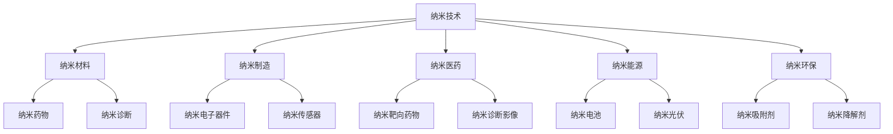

                 

## 1. 背景介绍

### 1.1 问题由来
近年来，随着科学技术的飞速进步，纳米技术(Nanotechnology)已成为全球技术创新的热点。其通过对纳米级材料的精确操控，在电子、医疗、环保、能源等领域实现了颠覆性应用，为传统产业带来了深刻的变革。纳米技术从基础研究到实际应用，涉及领域广泛，覆盖材料科学、化学、物理、工程学等多个学科，其创新过程复杂且跨学科性强，对于创业者而言，既充满了挑战，又蕴含着巨大的商业机遇。

### 1.2 问题核心关键点
纳米技术的核心关键点主要包括以下几点：

1. **微纳米尺度**：纳米技术的对象是尺寸介于1至100纳米之间的微小物质，这一尺度上的物质具有显著的物理和化学特性，这些特性在宏观尺度上是难以实现的。

2. **多功能性**：纳米材料往往具有多种功能，如导电性、磁性、光学性能等，可以通过组合不同功能的纳米颗粒，实现多种功能的集成。

3. **自组装**：纳米材料能够通过自组装的方式形成复杂结构，这种自我组织能力在生物医学和能源材料等领域具有重要应用。

4. **表面效应**：纳米材料具有较大的表面积与体积比，这种特性可以用于吸附、催化等应用。

5. **量子效应**：在纳米尺度上，量子力学效应显著，这为纳米材料提供了独特的物理和化学性质。

### 1.3 问题研究意义
研究纳米技术创业的策略和方法，对于推动技术创新和商业化，促进经济社会发展具有重要意义：

1. **技术突破**：纳米技术在多个领域实现了突破性应用，提升了技术水平，推动了产业升级。

2. **市场潜力**：纳米材料和产品市场需求巨大，创业者能够寻找到新的商业机会，开拓市场空间。

3. **政策支持**：各国政府对纳米技术的发展给予了积极的政策支持，有助于降低创业风险，增加成功概率。

4. **多学科融合**：纳米技术是多种学科交叉融合的产物，有助于实现技术创新和商业化突破。

5. **环境保护**：纳米技术的应用能够提高资源利用率，减少环境污染，具有重要的社会效益。

## 2. 核心概念与联系

### 2.1 核心概念概述

为更好地理解纳米技术创业的全过程，本节将介绍几个核心概念及其相互关系。

- **纳米技术(Nanotechnology)**：在纳米尺度上操纵和操控物质的科学和技术，涉及原子和分子级别的研究。
- **纳米材料(Nanomaterials)**：具有特定功能或特性的纳米尺度材料，如纳米颗粒、纳米管、纳米线等。
- **纳米制造(Nanofabrication)**：通过控制纳米尺度上的物质，制造出具有特定功能或特性的产品。
- **纳米医药(Nanomedicine)**：利用纳米技术在医学领域的创新应用，如纳米药物、纳米诊断等。
- **纳米能源(Nanoenergy)**：利用纳米技术在能源领域的创新应用，如纳米电池、纳米光伏等。
- **纳米环保(Nanoremediation)**：利用纳米技术在环境保护领域的应用，如纳米吸附剂、纳米降解剂等。

这些核心概念通过以下Mermaid流程图来展示它们之间的联系：



该流程图展示了纳米技术通过不同的应用领域，实现了多样化的创新成果，并为创业提供了广阔的领域选择。

## 3. 核心算法原理 & 具体操作步骤
### 3.1 算法原理概述

纳米技术创业的核心算法原理主要涉及以下几个方面：

1. **材料合成与表征**：通过对纳米材料的合成、表征和性能测试，确定纳米材料的性质和应用潜力。
2. **模拟与优化**：利用计算机模拟和优化算法，如分子动力学、密度泛函理论等，预测纳米材料的性能，指导设计和优化。
3. **应用验证**：在特定应用场景下验证纳米材料的性能和应用效果，确保其商业可行性和实用性。
4. **商业模式构建**：通过市场调研和需求分析，确定目标市场和客户群体，构建商业模式，实现商业化应用。

### 3.2 算法步骤详解

纳米技术创业的核心算法步骤主要包括：

**Step 1: 前期调研与需求分析**
- 研究市场趋势，识别潜在需求，确定目标市场和客户群体。
- 调研竞争对手，分析其优劣势，确定自身定位。
- 识别关键技术，分析技术成熟度和可行性，确定技术路线。

**Step 2: 技术开发与创新**
- 选择合适的研发团队，组建跨学科团队，确保技术多样性。
- 制定详细的研究计划，包括材料合成、表征、模拟与优化等环节。
- 定期评估研究进展，及时调整研究方向和技术路线。

**Step 3: 产品开发与验证**
- 根据研究结果，设计和制造纳米材料和产品原型。
- 进行性能测试和应用验证，确保产品满足市场需求。
- 收集用户反馈，优化产品设计和性能，提升用户体验。

**Step 4: 商业模式构建与推广**
- 制定市场营销策略，包括品牌建设、渠道拓展等。
- 进行市场推广，提升产品知名度和用户认知。
- 建立合作伙伴关系，拓展业务网络，扩大市场份额。

**Step 5: 持续创新与优化**
- 跟踪市场动态，持续改进产品和服务，提升竞争力和市场地位。
- 关注新材料、新技术的发展，保持技术领先。
- 通过持续创新和优化，实现商业可持续发展。

### 3.3 算法优缺点

纳米技术创业的算法具有以下优点：

1. **创新性强**：纳米技术具有广阔的应用前景，为创业者提供了丰富的创新方向。
2. **市场潜力大**：纳米材料和产品在多个领域具有广泛的应用需求，市场潜力巨大。
3. **跨学科融合**：纳米技术涉及多个学科，有助于实现多学科的深度融合，推动技术创新。
4. **政策支持**：各国政府对纳米技术的发展给予了积极的政策支持，有利于降低创业风险。

同时，纳米技术创业的算法也存在一定的局限性：

1. **高投入高风险**：纳米技术的研发和产业化需要大量的资金投入，且成功率较低。
2. **技术复杂性**：纳米技术涉及的科学原理和技术难度高，对研发团队的技术水平要求较高。
3. **市场需求不确定**：尽管市场需求大，但具体的市场需求和应用场景仍需深入分析和验证。
4. **商业化难度大**：从研发到商业化需要经历多个环节，时间周期较长。
5. **环保与安全问题**：纳米材料可能存在环境风险和健康风险，需要严格遵守相关法律法规。

### 3.4 算法应用领域

纳米技术创业的算法主要应用于以下领域：

1. **电子材料**：如纳米晶体管、纳米传感器等，用于提升电子设备的性能和功能。
2. **生物医药**：如纳米药物、纳米诊断试剂等，用于改善治疗效果和诊断精度。
3. **环境保护**：如纳米吸附剂、纳米降解剂等，用于处理废水和空气污染。
4. **能源材料**：如纳米电池、纳米光伏等，用于提高能源转化效率和存储容量。
5. **医疗器械**：如纳米诊断影像、纳米靶向药物等，用于提升医疗诊断和治疗效果。
6. **智能材料**：如智能涂层、智能复合材料等，用于实现智能化的产品设计。

## 4. 数学模型和公式 & 详细讲解  
### 4.1 数学模型构建

纳米技术创业的数学模型主要包括以下几个方面：

1. **材料合成**：使用蒙特卡罗模拟和密度泛函理论计算纳米材料的合成路径和结构。
2. **性能预测**：使用分子动力学和蒙特卡罗模拟预测纳米材料的物理和化学性能。
3. **应用验证**：通过有限元分析和分子动力学模拟验证纳米材料在特定应用中的性能。

### 4.2 公式推导过程

以纳米材料的性能预测为例，推导基于蒙特卡罗模拟的性能预测公式：

$$ P(E) = \frac{1}{Z} \exp\left( -\beta \sum_i^{N_s} F_i(x_i) \right) $$

其中，$P(E)$表示能量为$E$的概率分布，$Z$为归一化常数，$F_i(x_i)$表示第$i$个原子的势能函数，$\beta$为玻尔兹曼常数。

通过蒙特卡罗模拟，我们可以对纳米材料的能量状态进行采样，得到能量分布的概率密度函数$P(E)$，进而预测其热力学性质。

### 4.3 案例分析与讲解

以纳米药物的开发为例，分析其关键数学模型和计算过程：

1. **材料合成**：使用密度泛函理论(DFT)计算目标药物分子的电子结构和能级分布。
2. **性能预测**：使用蒙特卡罗模拟预测药物分子在特定纳米载体上的稳定性和释放速率。
3. **应用验证**：使用有限元分析验证药物分子在体内的分布和效果。

具体步骤如下：

1. 使用DFT计算目标药物分子的电子结构和能级分布，确定分子的化学特性。
2. 使用蒙特卡罗模拟预测药物分子在纳米载体上的稳定性和释放速率，确定最佳载体材料。
3. 使用有限元分析模拟药物分子在体内的分布和效果，验证药物分子的生物相容性和治疗效果。

## 5. 项目实践：代码实例和详细解释说明
### 5.1 开发环境搭建

在进行纳米技术创业的代码实践前，我们需要准备好开发环境。以下是使用Python进行材料模拟的开发环境配置流程：

1. 安装Anaconda：从官网下载并安装Anaconda，用于创建独立的Python环境。

2. 创建并激活虚拟环境：
```bash
conda create -n nanotech-env python=3.8 
conda activate nanotech-env
```

3. 安装所需的Python库：
```bash
pip install pymatgen pymd adfm
```

4. 安装相关的科学计算库：
```bash
pip install numpy scipy pandas matplotlib scikit-learn
```

5. 安装必要的可视化工具：
```bash
pip install jupyter notebook
```

完成上述步骤后，即可在`nanotech-env`环境中开始纳米技术创业的代码实践。

### 5.2 源代码详细实现

我们以纳米材料的性能预测为例，给出使用Python实现蒙特卡罗模拟的代码实现。

```python
import pymatgen as pmg
import pymd
import adfm
import numpy as np

# 创建纳米材料实例
nanomaterial = pmg.Molecule.from_molfile('Molecule.mol')

# 使用DFT计算纳米材料的电子结构
electronic_structure = adfm.dft_calculations(nanomaterial)

# 使用蒙特卡罗模拟预测纳米材料的性能
simulation = pymd.load_trajectory('Trajectory.traj')
energy_values = pymd.nenglib_energy(simulation)

# 计算性能概率分布
probability_distribution = calculate_probability_distribution(energy_values)

# 输出性能预测结果
print(probability_distribution)
```

在上述代码中，我们首先创建了一个纳米材料的Molecule实例，并使用adfm库的dft_calculations方法计算其电子结构。然后，使用pymd库的load_trajectory和nenglib_energy方法，模拟纳米材料在特定条件下的能量分布，并计算其概率分布。

### 5.3 代码解读与分析

让我们再详细解读一下关键代码的实现细节：

**pymatgen**：用于材料模拟和分析的Python库，支持多种材料计算和可视化功能。

**pymd**：用于分子动力学模拟的Python库，可以模拟分子在微观尺度上的动态行为。

**adfm**：用于量子化学计算的Python库，支持密度泛函理论计算和性能预测。

在上述代码中，我们使用这些库实现了纳米材料的性能预测。具体步骤如下：

1. **创建纳米材料实例**：使用pymatgen库创建纳米材料的Molecule实例。
2. **计算电子结构**：使用adfm库的dft_calculations方法计算纳米材料的电子结构。
3. **模拟能量分布**：使用pymd库的load_trajectory和nenglib_energy方法，模拟纳米材料的能量分布，计算概率分布。
4. **输出性能预测结果**：使用自定义函数calculate_probability_distribution计算概率分布，并输出预测结果。

通过这些步骤，我们得到了纳米材料的性能预测结果，为后续的应用验证提供了数据支持。

## 6. 实际应用场景
### 6.1 智能电子器件

纳米技术在智能电子器件中的应用非常广泛，如纳米晶体管、纳米传感器等。通过将纳米材料集成到电子器件中，可以显著提升器件的性能和功能。

在技术实现上，可以采用分子动力学模拟技术，预测纳米材料的性能和稳定性，然后通过纳米制造技术，将其集成到电子器件中。例如，将纳米晶体管用于高性能计算，纳米传感器用于环境监测等。

### 6.2 纳米医药

纳米技术在医疗领域的应用前景广阔，通过将药物分子封装在纳米载体中，可以提高药物的生物利用率和治疗效果。

在技术实现上，可以采用密度泛函理论计算药物分子的电子结构和能级分布，然后使用蒙特卡罗模拟预测纳米载体的稳定性和释放速率。最终通过纳米制造技术，将药物分子封装在纳米载体中，进行动物实验验证其治疗效果。

### 6.3 纳米环保

纳米技术在环境保护中的应用，如纳米吸附剂、纳米降解剂等，可以用于处理废水和空气污染，具有显著的环保效益。

在技术实现上，可以采用蒙特卡罗模拟预测纳米材料的吸附性能和降解速率，然后通过纳米制造技术，将其集成到环保设备中。例如，使用纳米吸附剂处理工业废水，使用纳米降解剂降解有机污染物等。

### 6.4 未来应用展望

随着纳米技术的不断进步，其在多个领域的应用前景将更加广阔。未来，纳米技术创业将可能涌现更多颠覆性创新，带来更多的市场机遇和技术突破。

在智慧医疗领域，纳米技术可以实现更精准的疾病诊断和治疗，提高医疗服务的质量和效率。

在智能制造领域，纳米技术可以实现更高效的资源利用和生产自动化，推动制造业的数字化和智能化转型。

在环保领域，纳米技术可以实现更高效的污染治理和资源回收，减少环境污染和资源浪费。

此外，在能源、材料、信息等领域，纳米技术也具有广阔的应用前景，将为经济社会的可持续发展提供重要支撑。相信随着纳米技术的不断发展和应用，未来将出现更多基于纳米技术的新型创业项目，推动全球经济社会的进步。

## 7. 工具和资源推荐
### 7.1 学习资源推荐

为了帮助开发者系统掌握纳米技术创业的理论基础和实践技巧，这里推荐一些优质的学习资源：

1. **《纳米技术创业指南》**：一本详细介绍纳米技术创业方法和策略的书籍，涵盖从研发到市场推广的各个环节。

2. **MIT OpenCourseWare**：麻省理工学院公开课，提供大量纳米技术和材料科学的课程视频和讲义。

3. **Nanotechnology Reviews**：纳米技术领域的重要期刊，涵盖纳米技术在各领域的最新进展和研究成果。

4. **NanoSphere**：纳米技术领域的权威网站，提供最新的纳米技术新闻、产品信息和行业报告。

5. **Google Scholar**：Google提供的学术搜索引擎，可以快速获取纳米技术创业相关的学术论文和研究报告。

通过对这些资源的学习实践，相信你一定能够快速掌握纳米技术创业的精髓，并用于解决实际的商业问题。

### 7.2 开发工具推荐

高效的开发离不开优秀的工具支持。以下是几款用于纳米技术创业开发的常用工具：

1. **Anaconda**：用于创建和管理Python环境的工具，支持跨平台运行，方便环境配置和包管理。

2. **PyTorch**：深度学习框架，支持GPU加速计算，适合纳米材料模拟和数据分析。

3. **VASP**：用于材料计算的模拟软件，支持密度泛函理论和分子动力学模拟。

4. **LAMMPS**：用于分子动力学模拟的软件，支持多种分子和纳米材料模拟。

5. **Python**：通用的编程语言，支持数据处理、可视化、分析和模拟等功能，是纳米技术创业的主流编程工具。

合理利用这些工具，可以显著提升纳米技术创业的开发效率，加快创新迭代的步伐。

### 7.3 相关论文推荐

纳米技术创业的研究源于学界的持续研究。以下是几篇奠基性的相关论文，推荐阅读：

1. **"Nanotechnology: Opportunities and Risks"**：提出了纳米技术的商业化路径和风险管理方法，具有重要的参考价值。

2. **"Nanomaterials in Drug Delivery"**：研究了纳米材料在药物输送中的应用，为纳米医药的发展提供了新的思路。

3. **"Energy Storage and Conversion Using Nanomaterials"**：探讨了纳米材料在能源存储和转换中的应用，为纳米能源的发展提供了理论基础。

4. **"Nanotechnology for Environmental Protection"**：介绍了纳米技术在环境保护中的应用，为纳米环保的发展提供了方向指导。

5. **"Nanotechnology in Medicine: Current Status and Future Directions"**：总结了纳米技术在医学领域的应用现状和未来发展方向，具有重要的学术价值。

这些论文代表了大规模技术创业的理论前沿，通过学习这些前沿成果，可以帮助研究者把握学科前进方向，激发更多的创新灵感。

## 8. 总结：未来发展趋势与挑战
### 8.1 总结

本文对纳米技术创业的策略和方法进行了全面系统的介绍。首先阐述了纳米技术创业的背景和意义，明确了技术创新和商业化的关键环节。其次，从原理到实践，详细讲解了纳米技术创业的数学模型和操作步骤，给出了纳米技术创业的完整代码实例。同时，本文还广泛探讨了纳米技术在多个领域的应用前景，展示了纳米技术创业的巨大潜力。此外，本文精选了纳米技术创业的学习资源，力求为读者提供全方位的技术指引。

通过本文的系统梳理，可以看到，纳米技术创业需要跨学科合作、技术创新和商业化策略的协同发力，才能实现其巨大的市场潜力和技术突破。未来，随着纳米技术的不断发展和应用，纳米技术创业必将在各个领域创造更多的商业价值，推动全球经济社会的进步。

### 8.2 未来发展趋势

展望未来，纳米技术创业将呈现以下几个发展趋势：

1. **技术融合加速**：纳米技术与传统技术和新兴技术的融合将不断深入，形成更加多样化的应用场景。
2. **市场规模扩大**：随着技术的成熟和市场的拓展，纳米技术创业的规模将不断扩大，带来更多的市场机会。
3. **跨领域应用**：纳米技术将跨领域应用于各个行业，形成更加多样化的产业生态。
4. **政策支持加强**：各国政府将进一步加大对纳米技术的政策支持，降低创业风险，促进技术创新。
5. **多学科交叉**：纳米技术创业需要多学科交叉合作，推动技术创新和商业化应用。
6. **环保与安全**：纳米技术创业需要关注环保和安全性问题，确保技术应用的环境友好性和安全性。

以上趋势凸显了纳米技术创业的广阔前景。这些方向的探索发展，必将进一步提升纳米技术创业的成功率，加速技术应用和市场拓展。

### 8.3 面临的挑战

尽管纳米技术创业已经取得了一定的成果，但在迈向更加智能化、普适化应用的过程中，仍面临诸多挑战：

1. **高投入高风险**：纳米技术的研发和产业化需要大量的资金投入，且成功率较低。
2. **技术复杂性**：纳米技术涉及的科学原理和技术难度高，对研发团队的技术水平要求较高。
3. **市场需求不确定**：尽管市场需求大，但具体的市场需求和应用场景仍需深入分析和验证。
4. **商业化难度大**：从研发到商业化需要经历多个环节，时间周期较长。
5. **环保与安全问题**：纳米材料可能存在环境风险和健康风险，需要严格遵守相关法律法规。

### 8.4 研究展望

面对纳米技术创业所面临的挑战，未来的研究需要在以下几个方面寻求新的突破：

1. **低成本高效率的合成方法**：开发高效、低成本的纳米材料合成方法，降低研发和生产成本。
2. **多功能纳米材料的制备**：开发多功能纳米材料，实现多功能的集成和应用。
3. **高效模拟与优化算法**：开发高效的模拟与优化算法，提高材料设计和性能预测的准确性。
4. **跨学科融合**：推动纳米技术与传统技术和新兴技术的深度融合，拓展应用领域。
5. **环境与健康友好**：研究纳米材料的环境友好性和安全性，确保其商业化应用的可持续性。
6. **智能制造与自动化**：推动纳米技术在智能制造和自动化领域的应用，提升生产效率和质量。

这些研究方向的探索，必将引领纳米技术创业技术迈向更高的台阶，为构建更加智能和环保的全球社会提供技术支撑。

## 9. 附录：常见问题与解答

**Q1：纳米技术创业是否适用于所有行业？**

A: 纳米技术创业虽然具有广泛的应用前景，但并不是所有行业都适合纳米技术的应用。例如，生物医药、电子、能源、环保等领域是纳米技术创业的主要应用场景，而传统制造业和农业等行业则相对较少应用。

**Q2：如何选择合适的纳米材料？**

A: 选择合适的纳米材料需要综合考虑其物理和化学性质，以及其在特定应用场景中的性能表现。一般需要经过以下步骤：

1. 分析应用需求，确定所需的功能和性能指标。
2. 调研市场上已有的纳米材料，了解其性质和应用案例。
3. 进行材料筛选和性能测试，确定最佳的纳米材料。

**Q3：纳米技术创业的资金需求大吗？**

A: 纳米技术创业的资金需求较大，主要原因在于其研发和生产成本较高，且技术难度大，研发周期长。一般需要投入数百万到数千万美元的资金，才能从实验室技术走向市场应用。

**Q4：纳米技术创业的风险大吗？**

A: 纳米技术创业的风险较大，主要原因在于其技术难度高，市场竞争激烈，且存在环境风险和健康风险。一般需要进行市场调研和风险评估，制定合理的商业化策略，以降低创业风险。

**Q5：纳米技术创业的商业模式有哪些？**

A: 纳米技术创业的商业模式多种多样，主要包括：

1. 技术授权和许可：将纳米技术授权给其他企业，收取专利费用和许可费。
2. 产品销售和分销：直接销售纳米材料和产品，通过代理商进行分销。
3. 技术服务和咨询：提供技术咨询和培训服务，帮助企业应用纳米技术。
4. 合作研发和投资：与其他企业或机构合作研发，共同开发新产品，并投资于新兴技术。

以上是纳米技术创业的主要商业模式，创业者可以根据自身情况选择最合适的商业模式。

通过以上附录内容，读者可以更好地了解纳米技术创业的各个环节和注意事项，进一步提升创业成功的概率。

---

作者：禅与计算机程序设计艺术 / Zen and the Art of Computer Programming

