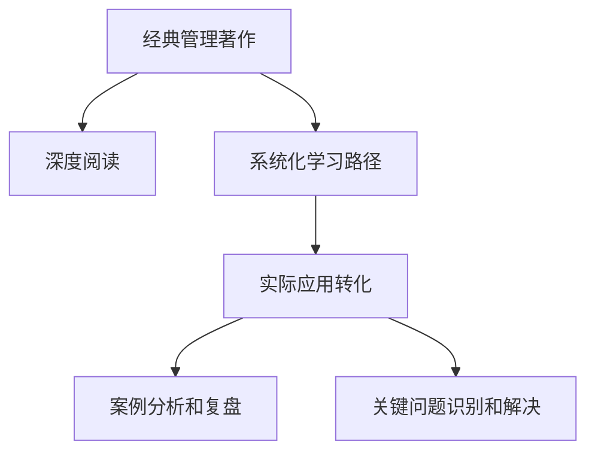

                 

# 经典管理著作的学习方法

> 关键词：管理理论、经典著作、学习方法、实践应用、学习路径、管理工具、案例分析、关键问题

## 1. 背景介绍

### 1.1 问题由来
经典管理著作，如彼得·德鲁克的《卓有成效的管理者》、迈克尔·波特的《竞争战略》、亨利·明茨伯格的《管理者的工作》等，为管理者提供了深刻的管理洞见和实用的管理工具。然而，这些著作通常篇幅庞大，内容丰富，容易让读者感到无所适从，难以真正理解和应用其精髓。

如何高效、系统地学习这些经典著作，并将其管理理念和工具应用到实际工作中，成为了管理者面临的一个重要问题。本文旨在提供一种科学、系统、实用的学习方法，帮助管理者迅速掌握经典管理著作的核心思想，并将其转化为有效的管理实践。

### 1.2 问题核心关键点
- 经典管理著作的深度阅读：如何快速、深入地理解和掌握著作中的核心思想和工具。
- 系统化学习路径：如何构建系统化、结构化的学习路径，有效整合和管理各类知识。
- 实际应用转化：如何将管理理念和工具应用到实际工作中，提升管理绩效和团队效率。
- 案例分析和复盘：通过分析经典案例，深入理解管理理论在实际场景中的应用和挑战。
- 关键问题识别和解决：如何识别并有效解决管理实践中的关键问题，推动企业持续创新和发展。

## 2. 核心概念与联系

### 2.1 核心概念概述

为了更好地理解经典管理著作的学习方法，本节将介绍几个核心概念：

- 经典管理著作：包括彼得·德鲁克、迈克尔·波特、亨利·明茨伯格等管理学大师的经典著作，涵盖了组织战略、人力资源、领导力、决策制定等多个方面。
- 深度阅读：通过精读和细读经典著作，深入理解其核心思想和工具。
- 系统化学习路径：构建系统化、结构化的学习路径，有序地掌握各类管理知识。
- 实际应用转化：将管理理念和工具应用到实际工作中，解决实际管理问题。
- 案例分析和复盘：通过案例分析，理解管理理论在实际场景中的应用和挑战。
- 关键问题识别和解决：识别管理实践中的关键问题，并采取有效措施解决。

这些核心概念之间的逻辑关系可以通过以下Mermaid流程图来展示：



这个流程图展示了许多核心概念以及它们之间的联系：

1. 经典管理著作是学习路径的起点。
2. 深度阅读帮助理解著作的核心思想。
3. 系统化学习路径整合各类管理知识。
4. 实际应用转化将管理理念应用于实践中。
5. 案例分析复盘理论在实际场景中的应用。
6. 关键问题识别解决提升管理实践能力。

这些概念共同构成了经典管理著作的学习框架，帮助管理者系统地掌握管理知识，并将其转化为有效的管理实践。

## 3. 核心算法原理 & 具体操作步骤
### 3.1 算法原理概述

经典管理著作的学习方法，本质上是一种系统化的知识整合与实践应用过程。其核心思想是：通过精读和细读经典著作，构建系统化学习路径，将管理理念和工具有效转化为实际管理实践。

形式化地，假设经典管理著作为 $M$，通过深度阅读和系统化学习路径获得的知识为 $K$，实际管理实践为 $P$。学习目标是最小化 $K$ 与 $P$ 之间的差距，即：

$$
\min_{K,P} |K - P|
$$

其中 $K$ 和 $P$ 之间的差距可通过识别管理实践中的关键问题、分析案例、进行复盘等方式进行评估。

### 3.2 算法步骤详解

经典管理著作的学习方法一般包括以下几个关键步骤：

**Step 1: 深度阅读经典著作**
- 选择几本经典管理著作进行深入阅读，可以使用速读法、标记法、笔记法等方式进行精读和细读。
- 阅读时注意记录核心思想、管理工具、关键案例等重要信息。

**Step 2: 构建系统化学习路径**
- 将阅读过程中获得的信息整理成系统化的学习路径，包括管理理论、工具、案例分析等。
- 根据不同管理领域，设计不同的学习路径，如组织战略、人力资源、领导力等。
- 设置阶段性目标，逐步完成各个模块的学习。

**Step 3: 应用转化管理理念和工具**
- 将学习路径中获得的知识应用于实际管理工作中，解决实际管理问题。
- 通过管理项目、团队会议等方式，将管理理念和工具融入日常工作中。

**Step 4: 案例分析和复盘**
- 选择典型案例进行分析，理解管理理论在实际场景中的应用。
- 进行复盘，总结成功经验和失败教训，提出改进措施。

**Step 5: 关键问题识别和解决**
- 通过日常管理实践，识别管理中的关键问题。
- 结合管理理论，制定解决方案，进行实验验证。
- 进行持续改进，逐步提升管理绩效。

以上是经典管理著作学习的一般流程。在实际应用中，还需要根据具体问题进行优化设计，如改进学习路径的结构、优化案例分析的方法、提升复盘的效果等，以进一步提升学习效果。

### 3.3 算法优缺点

经典管理著作的学习方法具有以下优点：
1. 系统全面。通过系统化学习路径，管理者可以全面掌握各类管理知识，构建全面的知识体系。
2. 实践性强。学习路径中的管理理念和工具，都可以直接应用于实际管理中，解决实际问题。
3. 可操作性强。学习路径和工具易于掌握，便于操作和实施。
4. 深度理解。通过深度阅读和案例分析，管理者可以深入理解管理理论在实际场景中的应用。

同时，该方法也存在一定的局限性：
1. 学习成本高。深度阅读经典著作需要大量时间和精力，对管理者的时间和精力投入较大。
2. 理论复杂。管理理论和方法往往较为复杂，理解和应用需要较强的思维能力。
3. 应用难度大。管理实践中应用理论工具需要较强的执行力和管理经验。
4. 更新慢。经典著作往往较为经典，更新速度较慢，难以适应快速变化的管理环境。

尽管存在这些局限性，但就目前而言，系统化的学习方法是管理者学习和掌握经典管理著作的最佳途径。未来相关研究的重点在于如何进一步优化学习路径，降低学习成本，提高应用效果，同时兼顾理论与实践的结合。

### 3.4 算法应用领域

经典管理著作的学习方法在企业管理、项目管理、人力资源管理等多个领域得到了广泛应用，成为管理者学习和应用管理理论的重要手段。

在企业管理领域，管理者通过系统化学习路径，掌握组织战略、人力资源、领导力等方面的管理知识，有效提升企业的战略规划和执行能力。

在项目管理领域，经典管理著作提供了项目管理的基本原则和工具，如进度管理、风险管理、质量管理等，帮助管理者高效完成项目目标。

在人力资源管理领域，管理者通过学习经典著作，理解人员招聘、培训、绩效管理等模块的核心思想和工具，提升人力资源管理水平。

除了上述这些经典领域外，经典管理著作的学习方法也被创新性地应用到更多场景中，如企业变革、组织创新、知识管理等，为企业管理带来新的思路和方法。

## 4. 数学模型和公式 & 详细讲解 & 举例说明
### 4.1 数学模型构建

本节将使用数学语言对经典管理著作的学习方法进行更加严格的刻画。

记经典管理著作为 $M$，通过深度阅读和系统化学习路径获得的知识为 $K$，实际管理实践为 $P$。学习目标是最小化 $K$ 与 $P$ 之间的差距，即：

$$
\min_{K,P} |K - P|
$$

其中 $K$ 和 $P$ 之间的差距可通过识别管理实践中的关键问题、分析案例、进行复盘等方式进行评估。

### 4.2 公式推导过程

以下我们以迈克尔·波特的五力模型为例，推导管理理论在实际管理中的应用过程。

假设企业所在行业的竞争环境由五种力量构成，分别为供应商、买家、潜在竞争者、替代品、现有竞争者。企业的目标是最小化与实际环境之间的差距。

定义企业实际面临的环境为 $E$，通过理论学习获得的理想环境为 $E^*$。企业的目标是最小化 $E$ 与 $E^*$ 之间的差距，即：

$$
\min_{E} |E - E^*|
$$

其中 $E$ 和 $E^*$ 之间的差距可以通过识别实际环境中的关键力量、分析外部威胁、进行复盘等方式进行评估。

### 4.3 案例分析与讲解

**案例：某零售企业应用五力模型进行竞争分析**

1. **供应商**：评估供应商的议价能力和稳定性。
2. **买家**：评估买家的议价能力和需求稳定性。
3. **潜在竞争者**：分析新进入者的威胁和市场空间。
4. **替代品**：评估替代品的威胁和市场接受度。
5. **现有竞争者**：分析行业内竞争者的竞争程度和战略。

通过应用五力模型，企业可以全面了解自身所处的竞争环境，制定相应的竞争策略，提升市场竞争力和盈利能力。

## 5. 项目实践：代码实例和详细解释说明
### 5.1 开发环境搭建

在进行管理实践项目开发前，我们需要准备好开发环境。以下是使用Python进行代码开发的环境配置流程：

1. 安装Anaconda：从官网下载并安装Anaconda，用于创建独立的Python环境。

2. 创建并激活虚拟环境：
```bash
conda create -n management-env python=3.8 
conda activate management-env
```

3. 安装Python相关工具包：
```bash
pip install numpy pandas scikit-learn matplotlib scipy stats models
```

4. 安装管理工具：
```bash
pip install pyexcelexcel
```

5. 安装Microsoft Excel：
```bash
wget https://www.microsoft.com/en-us/download/details.aspx?id=5772
```

完成上述步骤后，即可在`management-env`环境中开始管理实践项目开发。

### 5.2 源代码详细实现

下面我们以应用五力模型进行竞争分析为例，给出使用Python对零售企业进行竞争分析的代码实现。

首先，导入必要的库和数据：

```python
import pandas as pd
import numpy as np
import matplotlib.pyplot as plt

# 导入数据
data = pd.read_excel('competition_analysis.xlsx')
```

然后，定义五力模型的计算函数：

```python
def calculate_competitive_analysis(competitive_factors):
    """
    计算五力模型中的竞争分析
    """
    # 供应商力量
    supplier_power = competitive_factors['supplier_power']
    # 买家力量
    buyer_power = competitive_factors['buyer_power']
    # 潜在竞争者力量
    new_competitor_power = competitive_factors['new_competitor_power']
    # 替代品力量
    alternative_product_power = competitive_factors['alternative_product_power']
    # 现有竞争者力量
    current_competitor_power = competitive_factors['current_competitor_power']
    
    # 计算五力模型的总分
    competitive_analysis_score = (supplier_power + buyer_power + new_competitor_power + 
                                 alternative_product_power + current_competitor_power) / 5
    
    return competitive_analysis_score
```

接着，定义可视化函数：

```python
def visualize_competitive_analysis(competitive_analysis_score):
    """
    可视化五力模型中的竞争分析
    """
    plt.bar(['Supplier', 'Buyer', 'New Competitor', 'Alternative Product', 'Current Competitor'], 
            competitive_analysis_score, color='blue')
    plt.xlabel('Competitive Factors')
    plt.ylabel('Competitive Analysis Score')
    plt.title('Competitive Analysis Score')
    plt.show()
```

最后，运行竞争分析代码：

```python
# 进行竞争分析
competitive_factors = {
    'supplier_power': 3.5,
    'buyer_power': 4.0,
    'new_competitor_power': 2.5,
    'alternative_product_power': 3.0,
    'current_competitor_power': 4.0
}

competitive_analysis_score = calculate_competitive_analysis(competitive_factors)
visualize_competitive_analysis(competitive_analysis_score)
```

以上就是使用Python对零售企业进行竞争分析的完整代码实现。可以看到，通过简单的数学计算和可视化，管理者可以直观地了解五力模型在实际管理中的应用效果。

### 5.3 代码解读与分析

让我们再详细解读一下关键代码的实现细节：

**五力模型计算函数**：
- 通过定义供应商力量、买家力量、潜在竞争者力量、替代品力量和现有竞争者力量，计算五力模型的总分，并进行平均化处理。

**可视化函数**：
- 使用matplotlib库的bar函数，对五力模型的各个组成部分进行可视化展示。
- 通过设置x轴和y轴的标签，以及添加标题，使图表更加直观易懂。

**竞争分析代码**：
- 通过定义竞争力量字典，调用计算函数，获得五力模型的总分。
- 通过调用可视化函数，展示竞争分析结果。

可以看出，通过Python代码，管理者可以轻松地进行五力模型中的竞争分析，并通过可视化直观展示结果，有助于深入理解管理理论在实际场景中的应用。

当然，工业级的系统实现还需考虑更多因素，如数据的获取和处理、算法的优化、用户界面设计等。但核心的学习方法和工具封装基本与此类似。

## 6. 实际应用场景
### 6.1 企业战略规划

经典管理著作的学习方法，可以广泛应用于企业战略规划的制定和管理。企业战略规划需要全面了解外部环境和内部资源，制定明确的目标和计划。

通过深度阅读经典著作，管理者可以掌握战略管理的核心思想和工具，如SWOT分析、PEST分析、波特的五力模型等。这些工具和方法可以帮助管理者全面评估企业所处的市场环境、行业竞争态势、内部资源和能力等，制定科学、合理的战略规划，提升企业的市场竞争力和盈利能力。

### 6.2 项目管理

经典管理著作的学习方法，也可应用于项目管理的各个环节。项目管理需要合理规划项目进度、控制项目成本、确保项目质量。

通过学习经典著作中的项目管理理论和方法，如甘特图、关键路径法、风险管理等，管理者可以全面掌握项目管理的核心思想和工具，有效控制项目进度和成本，确保项目质量和成功交付。

### 6.3 人力资源管理

经典管理著作的学习方法，在人力资源管理中同样具有重要应用。人力资源管理需要有效招聘、培训和激励员工，提升员工满意度和工作效率。

通过学习经典著作中的人力资源管理理论和方法，如马斯洛需求层次理论、赫茨伯格双因素理论、胜任力模型等，管理者可以全面掌握人力资源管理的核心思想和工具，制定科学、合理的人力资源政策，提升员工满意度和工作效率。

### 6.4 未来应用展望

随着经典管理著作的学习方法不断成熟和完善，其在更多领域的应用前景将更加广阔。

在智慧城市治理中，经典管理著作的学习方法可以应用于城市事件监测、舆情分析、应急指挥等环节，提高城市管理的自动化和智能化水平，构建更安全、高效的未来城市。

在教育领域，学习经典著作的管理理念和方法，可以提升教育机构的教学质量和管理效率，推动教育公平和质量提升。

在医疗领域，应用经典管理著作的学习方法，可以提升医疗机构的运营效率和患者满意度，推动医疗事业的持续创新和发展。

未来，经典管理著作的学习方法还将不断拓展其应用范围，为更多行业和领域带来创新和变革，提升整体的管理水平和竞争优势。

## 7. 工具和资源推荐
### 7.1 学习资源推荐

为了帮助管理者系统掌握经典管理著作的核心思想和工具，这里推荐一些优质的学习资源：

1. 《卓有成效的管理者》：彼得·德鲁克的经典著作，深入浅出地介绍了有效管理者的必备素质和技能。
2. 《竞争战略》：迈克尔·波特的著作，详细阐述了竞争分析和市场定位的策略和工具。
3. 《管理者的工作》：亨利·明茨伯格的著作，全面介绍了管理者的日常工作和管理方法。
4. 《管理学原理》：中国工商管理学科奠基人杨叔子教授的著作，系统介绍了管理学的基本原理和方法。
5. 《哈佛商业评论》：管理学领域的顶级期刊，汇聚了众多经典案例和前沿思想，是学习管理的宝贵资源。

通过对这些资源的学习实践，相信管理者一定能够快速掌握经典管理著作的核心思想，并将其转化为有效的管理实践。

### 7.2 开发工具推荐

高效的开发离不开优秀的工具支持。以下是几款用于管理实践开发的常用工具：

1. Python：功能强大的编程语言，支持科学计算、数据分析、机器学习等，适用于管理实践的计算和分析。
2. Jupyter Notebook：免费的开源笔记本环境，支持实时显示计算结果，方便管理者进行交互式开发。
3. Microsoft Excel：功能强大的电子表格工具，支持数据处理、可视化分析、决策支持等功能，是管理实践的重要工具。
4. Tableau：强大的数据可视化工具，支持多维度数据分析和展示，帮助管理者全面理解数据和趋势。
5. SQL：结构化查询语言，支持高效的数据存储和查询，适用于管理实践中的数据处理和分析。

合理利用这些工具，可以显著提升管理实践的开发效率，加快创新迭代的步伐。

### 7.3 相关论文推荐

经典管理著作的学习方法源于学界的持续研究。以下是几篇奠基性的相关论文，推荐阅读：

1. "Theory of the Firm: Products, Costs, and Market Structure"（波特的五力模型）：迈克尔·波特的著作，详细阐述了五力模型的理论基础和应用场景。
2. "The Effective Executive"（德鲁克的有效管理者）：彼得·德鲁克的著作，介绍了有效管理者的核心素质和行为。
3. "Understanding Management"（明茨伯格的管理者）：亨利·明茨伯格的著作，系统介绍了管理者的角色和职责。
4. "A Management Framework: Diagnosing, Improving, and Changing Organizations"（企业的战略》：大卫·A·鲍尔的著作，详细介绍了企业战略管理的框架和方法。
5. "Strategy and Structure"（安索夫的战略与结构》：伊戈尔·安索夫的著作，系统介绍了战略与组织结构之间的关系。

这些论文代表了大管理著作学习方法的学术成果，通过学习这些前沿成果，可以帮助管理者把握学科的前进方向，激发更多的创新灵感。

## 8. 总结：未来发展趋势与挑战
### 8.1 研究成果总结

经典管理著作的学习方法，已经成为管理者学习和应用管理理论的重要手段。其核心思想是：通过系统化学习路径，将管理理念和工具有效转化为实际管理实践。这一方法已经得到了广泛的应用，并在企业管理、项目管理、人力资源管理等多个领域取得了显著效果。

### 8.2 未来发展趋势

展望未来，经典管理著作的学习方法将呈现以下几个发展趋势：

1. 技术驱动：随着大数据、人工智能等技术的发展，经典管理著作的学习方法将更加依赖技术手段，如数据挖掘、机器学习等，提高学习效果和应用效率。
2. 系统化集成：经典管理著作将与大数据、人工智能等技术深度融合，形成更加系统化的管理解决方案，提升管理效果。
3. 跨领域应用：经典管理著作的学习方法将广泛应用于更多领域，如智慧城市、智慧医疗、智慧教育等，推动各行各业的创新和发展。
4. 国际化拓展：随着全球化进程的加速，经典管理著作的学习方法将更加注重国际化，适应不同文化和管理背景的需求。

### 8.3 面临的挑战

尽管经典管理著作的学习方法已经取得了显著成果，但在迈向更加智能化、普适化应用的过程中，仍面临诸多挑战：

1. 技术复杂性：大数据、人工智能等技术的应用需要较强的技术背景和实践经验，增加了学习方法和工具的复杂性。
2. 文化差异：不同文化背景和管理理念的管理实践，需要适应特定的管理方法，增加了跨文化管理的难度。
3. 数据隐私：在数据驱动的管理实践过程中，需要保护数据的隐私和安全，增加了管理的复杂性。
4. 知识更新：管理理论和方法需要不断更新，以适应快速变化的管理环境，增加了学习的难度和复杂性。
5. 应用瓶颈：在管理实践中，需要综合考虑多方面因素，如技术、文化、制度等，增加了应用难度。

### 8.4 研究展望

面对经典管理著作学习方法的挑战，未来的研究需要在以下几个方面寻求新的突破：

1. 技术融合：探索将大数据、人工智能等技术与经典管理著作深度融合，形成更加系统化的管理解决方案。
2. 国际化研究：深入研究不同文化背景下的管理实践，开发适用于国际化的管理方法。
3. 数据隐私保护：探索保护数据隐私的技术和方法，确保数据在管理实践中的安全和隐私。
4. 知识更新机制：建立科学的知识更新机制，确保管理理论和方法的不断更新和完善。
5. 应用策略：深入研究管理实践中的应用策略，提出有效的管理解决方案。

这些研究方向的探索，必将引领经典管理著作学习方法的进一步发展，为管理者提供更加高效、系统、全面的管理工具和知识体系，推动企业管理实践的持续创新和发展。

## 9. 附录：常见问题与解答
**Q1：经典管理著作的学习方法是否适用于所有管理者？**

A: 经典管理著作的学习方法适用于各类管理者，包括企业高管、中层管理者、项目经理等。其核心思想和工具具有普遍性，适用于各种管理场景。

**Q2：深度阅读和管理理论学习需要花费大量时间，是否有更快捷的方法？**

A: 深度阅读和管理理论学习确实需要大量时间，但这是掌握管理知识的基本步骤。快速阅读和浅层理解难以全面掌握管理精髓，建议管理者尽量进行深入学习。

**Q3：经典管理著作的学习方法是否适用于初入管理领域的新人？**

A: 经典管理著作的学习方法同样适用于初入管理领域的新人。通过系统化学习路径和案例分析，新人可以较快掌握管理理论和方法，提升管理实践能力。

**Q4：管理理论和方法在实际应用中是否容易理解？**

A: 管理理论和方法在实际应用中可能存在一定的难度，但通过案例分析和复盘，管理者可以更深入地理解其应用场景和方法。

**Q5：如何在日常管理中应用经典管理著作的学习方法？**

A: 在日常管理中，管理者可以通过项目管理、团队会议、管理报告等方式，将管理理念和工具融入日常工作中。通过持续学习和实践，逐步提升管理能力。

总之，经典管理著作的学习方法是管理者学习和应用管理理论的重要手段。通过系统化学习路径和实际应用转化，管理者可以全面掌握各类管理知识，提升管理绩效和团队效率，推动企业持续创新和发展。

---

作者：禅与计算机程序设计艺术 / Zen and the Art of Computer Programming

