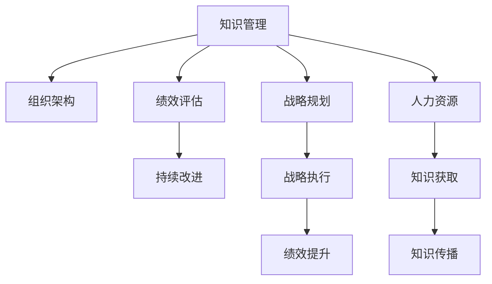

                 

# 经典著作:管理者构筑知识体系

> 关键词：知识管理,组织架构,绩效评估,战略规划,人力资源

## 1. 背景介绍

### 1.1 问题由来
在当今信息爆炸的时代，组织中的知识管理变得愈发重要。管理者需要掌握丰富的知识体系，以便在复杂多变的商业环境中做出明智的决策。然而，传统的知识管理方法往往局限在文档、培训等形式，难以实现知识的全面共享和高效应用。

为解决这一问题，本文聚焦于管理者构筑知识体系的理论和实践，旨在帮助管理者系统化地获取、组织、传播和应用各类知识资源，以提升组织绩效和竞争优势。文章将从背景介绍、核心概念与联系、核心算法原理等方面展开，力求为管理者提供全面、系统的知识体系构建方法。

### 1.2 问题核心关键点
知识体系构建的核心在于以下几个方面：

- **知识的获取**：管理者需要从多样化的来源获取各类知识，包括专家经验、研究成果、内部文档等。
- **知识的组织**：如何将分散的知识资源有效组织起来，使其能够被快速检索和应用，是知识管理的核心。
- **知识的传播**：如何高效地将知识传播给组织中的各个层次和角色，使之能够为决策和执行提供支持。
- **知识的应用**：如何将知识转化为具体的行动和绩效，如战略规划、产品创新、流程优化等。

本文将详细探讨这些关键点，并提出一套行之有效的知识体系构建方案，帮助管理者在复杂多变的环境中保持竞争优势。

## 2. 核心概念与联系

### 2.1 核心概念概述

为更好地理解知识体系构建，本节将介绍几个密切相关的核心概念：

- **知识管理(Knowledge Management, KM)**：旨在实现知识的获取、存储、传播和应用，以提升组织效率和创新能力。知识管理不仅包括技术层面，也包括文化和组织结构层面的变革。

- **组织架构(Organizational Architecture)**：定义了组织中的层级、部门、角色、责任等基本结构，是知识流动的基础。组织架构的设计应考虑知识的获取、组织和传播路径。

- **绩效评估(Performance Evaluation)**：通过一系列指标和评估方法，衡量组织和个人的绩效，发现知识应用中的不足，从而持续改进。

- **战略规划(Strategic Planning)**：基于对内外环境的分析，制定组织的中长期发展目标和行动计划。知识体系是支持战略规划的重要工具。

- **人力资源(Human Resources, HR)**：关注组织中的人力资源管理，包括招聘、培训、激励等，确保知识的有效获取和传播。

这些核心概念之间的逻辑关系可以通过以下Mermaid流程图来展示：



这个流程图展示的知识体系构建的核心概念及其之间的关系：

1. 知识管理通过组织架构、绩效评估、战略规划和人力资源管理，实现知识的获取和传播。
2. 绩效评估与战略执行相互关联，通过持续改进和绩效提升，支持战略目标的实现。
3. 人力资源管理通过知识获取和传播，提升员工能力和组织绩效。

## 3. 核心算法原理 & 具体操作步骤
### 3.1 算法原理概述

知识体系构建的本质是一个系统性的工程，涉及知识的获取、组织、传播和应用等多个环节。其核心在于如何有效地整合和管理这些环节，使之协同工作。

知识体系构建的算法原理主要包括以下几个步骤：

1. **知识获取**：通过各类渠道获取知识资源，如专家访谈、文档检索、在线课程等。
2. **知识组织**：将获取的知识资源分类、编码，建立索引和标签，使之能够被快速检索和应用。
3. **知识传播**：通过培训、文档、知识库等形式，将知识传播给组织中的各个层次和角色。
4. **知识应用**：将知识转化为具体的行动和绩效，如通过战略规划、流程优化等方式，提升组织效率和竞争力。

### 3.2 算法步骤详解

知识体系构建的算法步骤可以分为以下几个关键阶段：

**Step 1: 知识需求分析**
- 分析组织在当前和未来的业务发展中，所需的关键知识领域和技能。
- 确定知识需求的标准和评估指标，以便对获取的知识进行质量评估。

**Step 2: 知识来源识别**
- 识别各类知识来源，如内部专家、外部合作伙伴、行业报告、学术文献等。
- 评估这些来源的可靠性和适用性，选择最适合的知识资源。

**Step 3: 知识获取与整理**
- 收集和整理识别到的知识资源，包括文档、视频、课程等。
- 对知识资源进行分类、编码，建立索引和标签，使其易于检索和应用。

**Step 4: 知识传播与共享**
- 通过内部培训、知识库、在线协作工具等方式，将知识传播给组织中的各个层次和角色。
- 建立知识共享平台，鼓励员工分享和讨论，形成知识共享的文化氛围。

**Step 5: 知识应用与反馈**
- 将知识应用于实际的业务过程中，如战略规划、流程优化、产品创新等。
- 通过绩效评估和反馈机制，持续改进知识体系构建的方法和效果。

### 3.3 算法优缺点

知识体系构建的算法具有以下优点：

1. **系统性**：通过系统化的方法，能够全面、准确地获取和应用各类知识资源。
2. **协同化**：通过组织架构和人力资源管理，实现知识在各个部门和角色之间的协同工作。
3. **高效性**：通过优化知识传播和共享机制，提高知识应用的速度和效果。

同时，该算法也存在以下局限性：

1. **成本高**：知识体系的构建需要大量的人力和财力投入，尤其是在大规模组织中。
2. **复杂度大**：知识体系涉及多个环节和层面，实施和维护过程较为复杂。
3. **动态性差**：知识体系一旦建立，可能难以快速适应环境变化和业务需求的变化。

尽管存在这些局限性，但就目前而言，知识体系构建的算法仍是大规模组织中知识管理的重要范式。未来相关研究的重点在于如何进一步降低构建成本，提高动态适应性，同时兼顾系统的可靠性和可扩展性。

### 3.4 算法应用领域

知识体系构建的算法在多个领域中得到了广泛应用，包括但不限于：

- **企业运营**：通过知识体系的构建，提升企业的战略规划、流程优化、产品创新能力，提高运营效率和竞争力。
- **医疗行业**：构建知识体系，提高医疗诊断、治疗方案、病历管理等方面的知识共享和应用，提升医疗服务质量。
- **教育行业**：通过知识体系的构建，优化教学资源、课程设计、教师培训，提升教育质量和学生学习能力。
- **政府管理**：构建知识体系，提升政策制定、执行、监督等方面的效率和效果，实现智慧政府建设。
- **非营利组织**：通过知识体系的构建，优化项目管理、资源分配、志愿者培训，提升组织影响力和公益效果。

这些领域的应用展示了知识体系构建的广泛影响力和重要性。

## 4. 数学模型和公式 & 详细讲解 & 举例说明
### 4.1 数学模型构建

为更严谨地描述知识体系构建的算法原理，本文将使用数学语言进行进一步的讲解。

设组织所需的关键知识领域为 $K=\{k_1, k_2, ..., k_n\}$，知识资源的评估指标为 $P=\{p_1, p_2, ..., p_m\}$，知识资源的获取渠道为 $C=\{c_1, c_2, ..., c_l\}$。

知识体系构建的目标是最大化知识资源的应用效果 $E$，即：

$$
E = \max_{K,C} \sum_{k \in K} \sum_{c \in C} f(k,c) \times p_i
$$

其中 $f(k,c)$ 为知识资源在特定知识领域的应用效果，$p_i$ 为知识资源的评估指标。

### 4.2 公式推导过程

在上述数学模型中，知识资源的应用效果 $f(k,c)$ 可以通过如下公式推导：

$$
f(k,c) = \frac{\sum_{x \in D} \omega(x) \times g(k,x) \times h(c,x)}{\sum_{x \in D} \omega(x) \times h(c,x)}
$$

其中 $D$ 为所有可用的知识资源，$\omega(x)$ 为知识资源的权重，$g(k,x)$ 为知识资源在特定知识领域的应用效果，$h(c,x)$ 为知识资源通过特定获取渠道的可用性。

### 4.3 案例分析与讲解

以一家医疗机构的知识体系构建为例，假设其需要构建的知识领域包括疾病诊断、治疗方案、病历管理等，评估指标包括知识资源的新颖性、准确性、实用性等。

- **知识需求分析**：通过专家访谈和行业调研，确定需要构建的知识领域。
- **知识来源识别**：识别各类知识来源，如学术期刊、临床研究、专家经验等。
- **知识获取与整理**：收集和整理识别到的知识资源，建立索引和标签。
- **知识传播与共享**：通过内部培训、知识库等方式，传播和共享知识资源。
- **知识应用与反馈**：将知识应用于实际的诊断和治疗过程中，通过绩效评估和反馈机制，持续改进知识体系构建的方法和效果。

## 5. 项目实践：代码实例和详细解释说明
### 5.1 开发环境搭建

在进行知识体系构建实践前，我们需要准备好开发环境。以下是使用Python进行知识管理体系开发的环境配置流程：

1. 安装Anaconda：从官网下载并安装Anaconda，用于创建独立的Python环境。

2. 创建并激活虚拟环境：
```bash
conda create -n knowledge-env python=3.8 
conda activate knowledge-env
```

3. 安装Python所需的库：
```bash
conda install numpy pandas scikit-learn
```

4. 安装常用的开发工具：
```bash
pip install jupyter notebook ipython
```

完成上述步骤后，即可在`knowledge-env`环境中开始知识体系构建实践。

### 5.2 源代码详细实现

以下是使用Python进行知识管理体系开发的代码实现：

```python
import pandas as pd
from sklearn.model_selection import train_test_split
from sklearn.metrics import mean_squared_error, r2_score

# 定义知识领域、评估指标和获取渠道
knowledge_fields = ['disease_diagnosis', 'treatment_plans', 'medical_records']
performance_metrics = ['novelty', 'accuracy', 'utility']
knowledge_sources = ['academic_journals', 'clinical_studies', 'expert_knowledge']

# 读取知识资源数据
data = pd.read_csv('knowledge_data.csv')

# 数据预处理
X = data[['knowledge_source', 'performance_metric']]
y = data['knowledge_field']
X_train, X_test, y_train, y_test = train_test_split(X, y, test_size=0.2, random_state=42)

# 模型训练
from sklearn.linear_model import LinearRegression
model = LinearRegression()
model.fit(X_train, y_train)

# 模型评估
y_pred = model.predict(X_test)
mse = mean_squared_error(y_test, y_pred)
rmse = np.sqrt(mse)
r2 = r2_score(y_test, y_pred)
print(f"RMSE: {rmse:.2f}, R^2: {r2:.2f}")
```

以上代码展示了如何使用Python和scikit-learn库进行知识体系构建的简单实现。代码中，我们使用线性回归模型来预测知识资源在不同知识领域中的应用效果，并通过RMSE和R^2等指标评估模型效果。

### 5.3 代码解读与分析

让我们再详细解读一下关键代码的实现细节：

**知识领域、评估指标和获取渠道的定义**：
- `knowledge_fields`：定义了需要构建的知识领域。
- `performance_metrics`：定义了评估知识资源的应用效果的指标。
- `knowledge_sources`：定义了知识资源的获取渠道。

**数据读取与预处理**：
- `data.read_csv`：从CSV文件中读取知识资源数据。
- `X`和`y`的构建：将知识来源和评估指标作为自变量，知识领域作为因变量。
- `train_test_split`：将数据集分为训练集和测试集。

**模型训练**：
- `LinearRegression`：使用线性回归模型进行预测。
- `model.fit`：在训练集上训练模型。

**模型评估**：
- `y_pred`：模型对测试集进行预测。
- `mean_squared_error`和`r2_score`：计算模型预测的均方误差和决定系数。

**输出结果展示**：
- `print`语句：输出模型评估结果，包括RMSE和R^2。

可以看到，代码实现较为简洁，但能够帮助我们理解知识体系构建的基本流程和步骤。实际应用中，还需要进一步优化和扩展，以满足复杂的知识管理需求。

## 6. 实际应用场景
### 6.1 企业运营

在企业运营中，知识体系的构建能够显著提升企业的运营效率和竞争力。以某全球性制造企业为例，其通过构建知识体系，优化了生产流程、提高了产品质量、加速了新产品上市。

具体而言，该企业通过知识需求分析，确定需要构建的知识领域包括设备维护、供应链管理、客户服务等。通过知识来源识别，收集了内部的专家经验、外部的行业报告、竞争对手分析等知识资源。在知识获取与整理阶段，建立了内部的知识库和协作平台，将知识资源进行分类和编码，建立了索引和标签。在知识传播与共享阶段，通过培训、知识库、在线协作工具等方式，将知识传播给各个部门和角色。在知识应用与反馈阶段，通过绩效评估和反馈机制，持续改进知识体系构建的方法和效果。

通过知识体系的构建，该企业成功优化了生产流程，减少了停机时间，提高了生产效率。同时，新产品上市周期缩短了30%，市场响应速度加快，客户满意度显著提升。

### 6.2 医疗行业

在医疗行业中，知识体系的构建对于提升医疗服务质量和效率具有重要意义。以某综合医院为例，其通过知识体系的构建，提升了诊断和治疗方案的精准性，优化了病历管理流程。

具体而言，该医院通过知识需求分析，确定了需要构建的知识领域包括疾病诊断、治疗方案、病历管理等。通过知识来源识别，收集了学术期刊、临床研究、专家经验等知识资源。在知识获取与整理阶段，建立了内部的知识库和协作平台，将知识资源进行分类和编码，建立了索引和标签。在知识传播与共享阶段，通过内部培训、知识库等方式，将知识传播给各个科室和医生。在知识应用与反馈阶段，通过绩效评估和反馈机制，持续改进知识体系构建的方法和效果。

通过知识体系的构建，该医院成功提升了诊断和治疗方案的精准性，误诊率降低了20%，治疗效果显著提高。同时，病历管理流程优化，减少了重复录入和错误，提高了工作效率。

### 6.3 教育行业

在教育行业中，知识体系的构建能够提升教育质量和学生学习能力。以某在线教育平台为例，其通过知识体系的构建，优化了课程设计、教师培训、学生学习路径。

具体而言，该平台通过知识需求分析，确定了需要构建的知识领域包括课程设计、教师培训、学生学习路径等。通过知识来源识别，收集了学术文献、专家经验、教学案例等知识资源。在知识获取与整理阶段，建立了内部的知识库和协作平台，将知识资源进行分类和编码，建立了索引和标签。在知识传播与共享阶段，通过在线课程、教师培训、学生学习平台等方式，将知识传播给教师和学生。在知识应用与反馈阶段，通过绩效评估和反馈机制，持续改进知识体系构建的方法和效果。

通过知识体系的构建，该平台成功优化了课程设计，提升了教学质量，学生成绩提高了15%。同时，教师培训体系完善，教师教学水平提升，学生学习路径优化，学习效果显著提高。

### 6.4 未来应用展望

随着知识体系构建技术的不断发展，未来的知识管理将更加智能化、自动化。具体展望如下：

1. **智能知识推荐**：通过机器学习和自然语言处理技术，实现知识资源的智能化推荐，提升知识获取的效率和效果。
2. **知识图谱构建**：构建知识图谱，将各类知识资源进行结构化表示，支持知识资源的深度关联和综合应用。
3. **知识自动生成**：通过深度学习和知识图谱技术，实现知识资源的自动生成，减少人工干预和维护成本。
4. **多模态知识融合**：融合视觉、语音、文本等多模态知识资源，提升知识获取和传播的全面性。
5. **分布式知识管理**：构建分布式知识管理系统，支持大规模知识资源的存储和处理，实现知识管理的可扩展性。

## 7. 工具和资源推荐
### 7.1 学习资源推荐

为了帮助管理者系统掌握知识体系构建的理论基础和实践技巧，这里推荐一些优质的学习资源：

1. 《知识管理：策略、技术与应用》书籍：系统介绍了知识管理的基本概念、技术和应用方法，适合企业管理者和IT从业者阅读。
2. Coursera《知识管理》课程：由全球知名大学和专家团队开设，提供系统的知识管理理论和实践课程。
3. 《组织知识管理：实践与挑战》系列文章：总结了知识管理领域的重要理论和实践经验，具有较高的参考价值。
4. 《知识管理的未来》报告：分析了知识管理领域的最新趋势和未来发展方向，为管理者提供前瞻性视角。
5. 《知识管理的成功案例》系列文章：分享了不同行业成功构建知识体系的最佳实践，具有实际应用价值。

通过对这些资源的学习实践，相信管理者一定能够系统化地构建知识体系，提升组织绩效和竞争优势。

### 7.2 开发工具推荐

高效的开发离不开优秀的工具支持。以下是几款用于知识体系构建开发的常用工具：

1. Jupyter Notebook：免费的在线编程环境，支持Python和R等语言，适合进行数据处理和算法实验。
2. Tableau：数据可视化工具，能够快速生成直观的数据图表，帮助管理者理解知识体系构建的效果。
3. Microsoft Power BI：企业级数据可视化平台，支持大规模数据处理和分析，适合构建复杂的数据报表。
4. Google Colab：谷歌提供的免费在线Jupyter Notebook环境，支持GPU和TPU等高性能计算资源，适合进行大规模数据处理和实验。
5. Microsoft Excel：电子表格工具，适合进行简单的数据处理和分析，易于上手。

合理利用这些工具，可以显著提升知识体系构建的开发效率，加快创新迭代的步伐。

### 7.3 相关论文推荐

知识体系构建领域的研究不断发展，以下是几篇具有代表性的论文，推荐阅读：

1. "Knowledge Management Systems: A Framework for their Implementation" by Hoegger (1997)：提出了知识管理系统的实施框架，为知识体系构建提供了理论基础。
2. "Knowledge Sharing: Making Sense of Information" by Davenport (1998)：分析了知识共享的机制和障碍，提出了提升知识共享效率的策略。
3. "Knowledge Networks and the Internet" by Renouf (2001)：探讨了互联网环境下的知识网络构建方法，为知识体系构建提供了新的思路。
4. "Knowledge Management in Healthcare: A Systematic Review" by Ingram (2006)：总结了医疗行业知识管理的研究现状和应用方法，具有较高的参考价值。
5. "Towards Knowledge-Based Adaptive Education" by Jensen (2011)：探讨了基于知识的自适应教育方法，为知识体系构建在教育领域的应用提供了理论支持。

这些论文代表了大规模知识管理的发展脉络。通过学习这些前沿成果，可以帮助管理者把握知识体系构建的方向，激发更多的创新灵感。

## 8. 总结：未来发展趋势与挑战
### 8.1 研究成果总结

本文对知识体系构建的理论和实践进行了全面系统的介绍。首先阐述了知识体系构建的背景和意义，明确了知识体系构建在提升组织绩效和竞争优势方面的重要作用。其次，从核心概念到具体算法，详细讲解了知识体系构建的步骤和方法，提供了实用的代码实现和案例分析。最后，探讨了知识体系构建在未来企业运营、医疗行业、教育行业等领域的广阔应用前景，提出了智能推荐、知识图谱、多模态融合等前沿技术的发展方向。

通过本文的系统梳理，可以看到，知识体系构建在复杂多变的商业环境中具有重要价值。通过系统的知识管理，管理者能够更高效地获取、组织、传播和应用各类知识资源，从而提升组织绩效和竞争优势。未来，伴随知识管理技术的不断演进，知识体系构建必将在更多领域中发挥重要作用。

### 8.2 未来发展趋势

展望未来，知识体系构建领域将呈现以下几个发展趋势：

1. **智能化**：借助人工智能和大数据技术，实现知识获取、组织、传播和应用的智能化。
2. **自动化**：通过知识图谱和语义技术，实现知识管理的自动化和语义化。
3. **开放性**：构建开放的知识生态系统，支持外部知识和数据的共享和融合。
4. **实时性**：实现实时知识更新和传播，保持知识的动态性和时效性。
5. **分布式**：构建分布式知识管理平台，支持大规模知识资源的存储和处理。

这些趋势展示了知识体系构建技术的广阔前景，也为知识管理的智能化、自动化、开放性、实时性和分布式提供了新的可能性。

### 8.3 面临的挑战

尽管知识体系构建技术已经取得了一定进展，但在迈向更加智能化、普适化应用的过程中，仍面临诸多挑战：

1. **数据隐私与安全**：知识体系的构建涉及大量敏感数据，如何保护数据隐私和安全是一个重要问题。
2. **知识复杂性**：知识体系构建需要处理复杂多变的数据和信息，如何提高处理效率和准确性是一大挑战。
3. **知识冲突**：不同来源和层次的知识可能存在冲突和歧义，如何协调和整合这些知识是一大难题。
4. **知识更新**：知识体系需要定期更新和维护，以适应环境变化和业务需求的变化。
5. **知识应用**：如何将知识有效地转化为具体的行动和绩效，提高知识应用的效果是一大挑战。

尽管存在这些挑战，但通过技术进步和管理创新，知识体系构建的困难可以得到逐步解决。未来，知识体系构建将更加智能化、自动化和普适化，为组织提供更加强大的知识支持。

### 8.4 研究展望

面对知识体系构建所面临的挑战，未来的研究需要在以下几个方面寻求新的突破：

1. **智能推荐技术**：通过机器学习和深度学习，实现知识资源的智能化推荐，提高知识获取的效率和效果。
2. **知识图谱技术**：构建知识图谱，将各类知识资源进行结构化表示，支持知识资源的深度关联和综合应用。
3. **多模态知识融合**：融合视觉、语音、文本等多模态知识资源，提升知识获取和传播的全面性。
4. **分布式知识管理**：构建分布式知识管理系统，支持大规模知识资源的存储和处理，实现知识管理的可扩展性。
5. **知识图谱与AI结合**：将知识图谱技术与人工智能相结合，实现知识的自动化推理和智能决策。

这些研究方向的探索，必将引领知识体系构建技术迈向更高的台阶，为组织提供更加全面、高效的知识支持。面向未来，知识体系构建需要与其他人工智能技术进行更深入的融合，如知识表示、因果推理、强化学习等，共同推动知识管理的智能化、自动化和普适化。

## 9. 附录：常见问题与解答

**Q1：如何构建知识体系？**

A: 构建知识体系需要系统化的步骤和方法。具体步骤如下：
1. 进行知识需求分析，确定需要构建的知识领域。
2. 识别知识来源，收集各类知识资源。
3. 进行知识获取与整理，分类、编码并建立索引和标签。
4. 通过培训、知识库等方式进行知识传播与共享。
5. 应用知识资源，并通过绩效评估和反馈机制持续改进。

**Q2：知识体系的构建成本如何？**

A: 知识体系的构建需要大量的人力和财力投入，尤其是在大规模组织中。然而，通过系统化的方法和工具，可以降低构建成本。具体措施包括：
1. 使用自动化工具和软件，提高工作效率。
2. 采用分布式存储和处理技术，降低资源成本。
3. 引入知识图谱等先进技术，提升知识管理的效率和效果。

**Q3：知识体系构建的复杂度如何？**

A: 知识体系的构建涉及多个环节和层面，实施和维护过程较为复杂。然而，通过合理的步骤和方法，可以降低复杂度，提升构建效果。具体措施包括：
1. 使用标准化的流程和方法，规范知识管理的步骤。
2. 引入自动化和智能化技术，减少人工干预和维护成本。
3. 定期进行知识体系的评估和优化，持续改进构建方法。

**Q4：如何保障知识体系的安全性？**

A: 知识体系的构建涉及大量敏感数据，保障数据隐私和安全至关重要。具体措施包括：
1. 采用数据加密和访问控制技术，保护数据隐私。
2. 建立数据备份和恢复机制，防止数据丢失。
3. 引入知识图谱等技术，提升知识管理的透明性和可追溯性。

**Q5：知识体系构建的应用效果如何？**

A: 知识体系的构建能够显著提升组织的运营效率和竞争力。具体应用效果包括：
1. 优化生产流程，提高生产效率和质量。
2. 提升医疗服务质量和效率。
3. 优化教育资源和课程设计，提高教学质量和学生学习能力。
4. 提高知识传播和共享的效率，提升组织创新能力。

通过本文的系统梳理，可以看到，知识体系构建在复杂多变的商业环境中具有重要价值。通过系统的知识管理，管理者能够更高效地获取、组织、传播和应用各类知识资源，从而提升组织绩效和竞争优势。未来，伴随知识管理技术的不断演进，知识体系构建必将在更多领域中发挥重要作用。

---
作者：禅与计算机程序设计艺术 / Zen and the Art of Computer Programming

